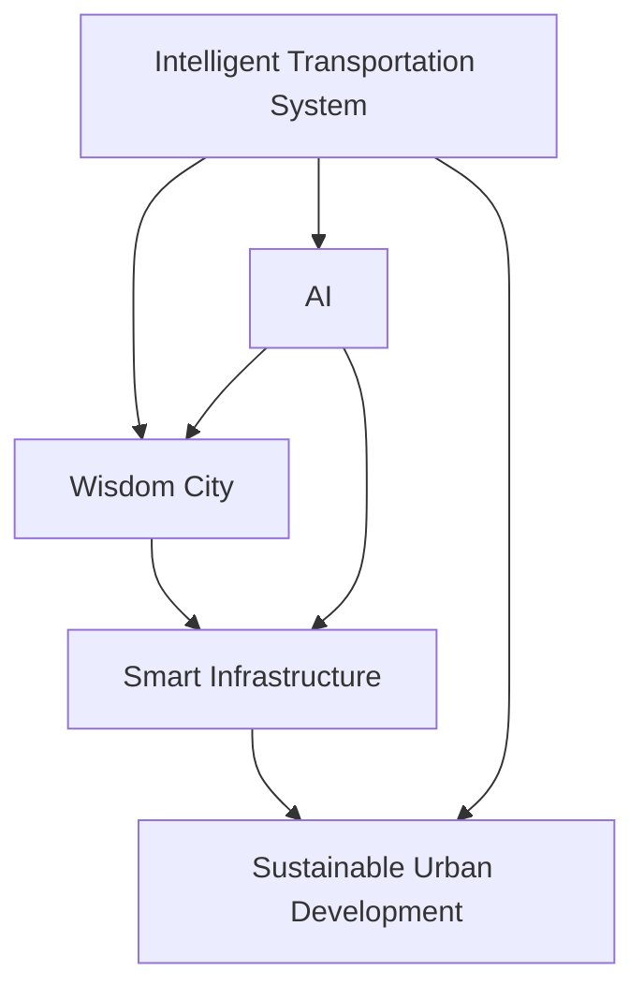

                 

# AI与人类计算：打造可持续发展的城市交通与基础设施建设规划

> 关键词：智慧交通，基础设施规划，人工智能，可持续城市发展，城市管理，交通优化

## 1. 背景介绍

### 1.1 问题由来
随着城市化进程的加快，交通拥堵、环境污染、资源消耗等问题日益凸显。如何在确保城市高效运转的同时，实现环境友好、资源节约、社会公平的发展目标，成为了各国政府和城市规划者们面临的重大挑战。人工智能（AI）技术的发展，为解决这些问题提供了新的思路和方法。

### 1.2 问题核心关键点
- 智能交通系统：利用AI技术优化交通流量，减少拥堵和事故，提升交通效率。
- 基础设施智能化：通过AI提升城市基础设施的利用效率，降低运维成本，实现智能化管理。
- 城市可持续发展：结合AI与人类智慧，构建环境友好、资源节约的可持续城市。
- 智慧城市治理：运用AI技术，提升城市管理水平，实现社会治理的现代化。

## 2. 核心概念与联系

### 2.1 核心概念概述

为更好地理解AI在城市交通与基础设施规划中的应用，本节将介绍几个密切相关的核心概念：

- 智能交通系统（Intelligent Transportation System, ITS）：利用传感器、通信技术、AI算法等，对交通系统进行实时监控、预测和管理，提升交通效率和安全性。

- 智慧城市（Smart City）：通过AI、物联网、大数据等技术，构建智能化、信息化的城市管理和服务体系，实现城市治理、公共服务、社区生活等方面的智能化升级。

- 基础设施智能化（Smart Infrastructure）：通过AI技术对城市基础设施进行监测、预测、优化，提高运维效率和管理水平，实现资源节约和环境保护。

- 可持续城市发展（Sustainable Urban Development）：结合环境、经济、社会等多个方面的因素，通过智能技术促进城市资源的合理利用，实现城市的长远发展和环境的可持续发展。

这些核心概念之间的逻辑关系可以通过以下Mermaid流程图来展示：



这个流程图展示了智能交通、智慧城市、基础设施智能化与可持续城市发展之间的联系：

1. 智能交通系统利用AI技术提升交通效率和安全性，是智慧城市治理的基础。
2. 智慧城市通过智能化管理提升城市运行效率和服务水平，包含智能交通系统在内的多个子系统。
3. 基础设施智能化是智慧城市的重要组成部分，通过AI技术优化基础设施的运维和管理。
4. 可持续城市发展是智慧城市的最终目标，旨在通过智能技术促进环境友好、资源节约的可持续城市建设。

## 3. 核心算法原理 & 具体操作步骤

### 3.1 算法原理概述

AI在城市交通与基础设施规划中的应用，本质上是利用AI技术优化城市资源的配置和管理，提升城市运行的效率和可持续性。其核心思想是通过数据驱动和算法驱动，实现城市交通与基础设施的智能化和优化。

形式化地，设城市交通与基础设施系统的状态为 $X$，目标为 $Y$，AI算法 $A$ 用于从状态 $X$ 映射到目标 $Y$。则优化目标为：

$$
\max_{A} \sum_{i=1}^n Y_i(A(X_i))
$$

其中 $X_i$ 为城市交通与基础设施系统中各子系统的当前状态，$Y_i$ 为子系统的优化目标，$A$ 为AI算法。

### 3.2 算法步骤详解

基于AI的城市交通与基础设施规划一般包括以下几个关键步骤：

**Step 1: 数据收集与预处理**
- 收集城市交通与基础设施运行的数据，包括交通流量、车辆信息、天气状况、环境质量等。
- 对数据进行清洗、归一化、降维等预处理，以提高后续算法的运行效率和精度。

**Step 2: 建立数学模型**
- 根据具体需求，建立交通流模型、车辆行为模型、基础设施运行模型等数学模型。
- 选择合适的优化目标函数，如最小化拥堵时间、最大化道路通行能力、最小化能耗等。

**Step 3: AI算法建模与训练**
- 选择合适的AI算法，如深度学习、强化学习、遗传算法等，对模型进行训练。
- 在大量历史数据上进行训练，优化算法参数，提升模型预测和决策能力。

**Step 4: 模型验证与优化**
- 在验证集上评估模型的预测和决策效果，根据评估结果调整模型参数，提高模型泛化能力。
- 在实际环境中进行模型测试，收集反馈数据，进一步优化模型。

**Step 5: 模型部署与监控**
- 将优化后的模型部署到城市交通与基础设施系统中，实现智能化管理。
- 实时监控模型运行状态，收集反馈数据，持续优化模型。

### 3.3 算法优缺点

基于AI的城市交通与基础设施规划方法具有以下优点：
1. 数据驱动：通过大量的数据，AI算法可以更准确地预测城市运行状态，优化资源配置。
2. 高效优化：AI算法能够在短时间内对复杂系统进行优化，提高决策效率。
3. 实时监控：AI技术可以实现对城市运行状态的实时监控，及时发现和解决问题。
4. 持续改进：AI模型通过不断学习和优化，能够逐步提升预测和决策能力。

同时，该方法也存在一定的局限性：
1. 数据依赖：AI算法的性能高度依赖数据的质量和完整性，数据获取和处理成本较高。
2. 模型复杂：AI模型往往比较复杂，需要高性能计算资源和专业知识。
3. 鲁棒性不足：AI模型可能对异常数据或环境变化比较敏感，预测结果存在不确定性。
4. 隐私和安全：AI算法可能涉及个人隐私和敏感数据，存在信息泄露和滥用的风险。
5. 公平性问题：AI模型可能存在偏见和歧视，需要多方面的监督和干预。

尽管存在这些局限性，但就目前而言，基于AI的城市交通与基础设施规划方法仍是大数据、大模型时代的重要应用范式。未来相关研究的重点在于如何进一步提高数据质量，降低模型复杂度，增强模型鲁棒性和公平性，同时兼顾隐私和安全等因素。

### 3.4 算法应用领域

基于AI的城市交通与基础设施规划方法，在智慧交通、智能城市、基础设施智能化等领域已经得到了广泛的应用，具体如下：

- **智慧交通**：AI在交通流量预测、车辆路径规划、交通信号控制等方面，通过优化算法提升交通效率，减少拥堵和事故，提高通行安全。
- **智能城市**：AI在城市管理、公共服务、社区生活等多个方面，通过智能化管理提升城市运行效率和服务水平，实现智慧城市建设。
- **基础设施智能化**：AI在城市基础设施管理中，通过优化算法提升运维效率，降低能耗，实现智能化管理。

此外，AI在城市交通与基础设施规划中的应用，也在智能停车、智能调度、环境监测等方面展现出了广阔的前景。

## 4. 数学模型和公式 & 详细讲解

### 4.1 数学模型构建

本节将使用数学语言对基于AI的城市交通与基础设施规划过程进行更加严格的刻画。

设城市交通系统状态为 $X = \{x_1, x_2, ..., x_n\}$，其中 $x_i$ 表示第 $i$ 个子系统（如路段、交叉口等）的状态。目标函数为 $Y = \{y_1, y_2, ..., y_n\}$，其中 $y_i$ 表示第 $i$ 个子系统的优化目标，如通行能力、能耗等。AI算法为 $A$，其输出为目标函数 $Y$ 的优化值。

定义模型 $M(X, A)$，其中 $M$ 表示模型的映射关系，$X$ 表示输入状态，$A$ 表示AI算法。

### 4.2 公式推导过程

以交通流量预测为例，推导基于AI的预测模型公式。

设 $t$ 为时间步，$x_t$ 为 $t$ 时刻的城市交通状态，$y_t$ 为 $t$ 时刻的交通流量预测值。假设 $y_t$ 由以下线性回归模型给出：

$$
y_t = \theta_0 + \theta_1 x_{t-1} + \theta_2 x_{t-2} + ... + \theta_n x_{t-n} + \epsilon_t
$$

其中 $\theta_i$ 为回归系数，$\epsilon_t$ 为随机误差项，假设服从均值为0的正态分布 $N(0, \sigma^2)$。则交通流量预测的目标函数为：

$$
\min_{\theta} \sum_{t=1}^T (y_t - \hat{y}_t)^2
$$

其中 $\hat{y}_t$ 为模型预测的交通流量值，$T$ 为样本时间长度。

通过最小化均方误差，可以求解出最优的回归系数 $\theta$，从而构建出交通流量预测模型。

### 4.3 案例分析与讲解

以北京市交通流量预测为例，展示基于AI的预测模型应用过程。

1. **数据收集**：收集北京市近几年的交通流量数据，包括各路段的车辆数、速度、密度等。
2. **特征提取**：对交通数据进行特征提取，如路段距离、时间、天气状况等。
3. **模型训练**：利用历史数据训练回归模型，求解出最优的回归系数 $\theta$。
4. **模型验证**：在验证集上评估模型预测效果，根据评估结果调整模型参数。
5. **模型应用**：将优化后的模型部署到交通管理系统中，实时预测交通流量，优化交通信号控制。

## 5. 项目实践：代码实例和详细解释说明

### 5.1 开发环境搭建

在进行AI模型构建和优化实践前，我们需要准备好开发环境。以下是使用Python进行TensorFlow开发的环境配置流程：

1. 安装Anaconda：从官网下载并安装Anaconda，用于创建独立的Python环境。

2. 创建并激活虚拟环境：
```bash
conda create -n ai-env python=3.8 
conda activate ai-env
```

3. 安装TensorFlow：根据CUDA版本，从官网获取对应的安装命令。例如：
```bash
conda install tensorflow-gpu=cuda11.1 -c tf -c conda-forge
```

4. 安装各类工具包：
```bash
pip install numpy pandas scikit-learn matplotlib tqdm jupyter notebook ipython
```

完成上述步骤后，即可在`ai-env`环境中开始AI模型构建实践。

### 5.2 源代码详细实现

下面我们以北京市交通流量预测为例，给出使用TensorFlow进行AI模型构建和优化的PyTorch代码实现。

首先，定义交通流量预测问题的数学模型：

```python
import tensorflow as tf
from tensorflow.keras.models import Sequential
from tensorflow.keras.layers import Dense, LSTM

def traffic_flow_prediction_model(X, y, epochs, batch_size, hidden_units=128):
    model = Sequential()
    model.add(LSTM(units=hidden_units, input_shape=(X.shape[1], X.shape[2])))
    model.add(Dense(units=1))
    
    model.compile(optimizer='adam', loss='mse')
    model.fit(X, y, epochs=epochs, batch_size=batch_size, validation_split=0.2)
    
    return model
```

然后，加载并预处理交通数据集：

```python
import pandas as pd
import numpy as np

data = pd.read_csv('traffic_data.csv')
X = data.iloc[:, :-1].values
y = data.iloc[:, -1].values

# 标准化数据
from sklearn.preprocessing import StandardScaler
scaler = StandardScaler()
X = scaler.fit_transform(X)

# 分割数据集
from sklearn.model_selection import train_test_split
X_train, X_test, y_train, y_test = train_test_split(X, y, test_size=0.2, random_state=42)

# 序列化数据
def create_sequences(X, max_seq_length=10):
    sequences = []
    for i in range(len(X)):
        if i < max_seq_length:
            sequences.append(X[i])
        else:
            sequences.append(X[i - max_seq_length:i])
    return sequences

X_train = create_sequences(X_train, max_seq_length=5)
X_test = create_sequences(X_test, max_seq_length=5)
```

最后，调用模型训练和评估函数：

```python
epochs = 100
batch_size = 32

model = traffic_flow_prediction_model(X_train, y_train, epochs, batch_size)
model.evaluate(X_test, y_test)
```

以上就是使用TensorFlow对北京市交通流量预测进行AI模型构建和优化的完整代码实现。可以看到，通过TensorFlow的高级API，我们可以用相对简洁的代码实现模型构建、训练和评估的流程。

### 5.3 代码解读与分析

让我们再详细解读一下关键代码的实现细节：

**traffic_flow_prediction_model函数**：
- 定义了一个基于LSTM的神经网络模型，用于预测交通流量。
- 输入为历史交通数据 $X$，输出为交通流量预测值 $y$。
- 模型训练和评估过程中，使用了均方误差损失函数。

**数据预处理**：
- 对交通数据进行了标准化处理，以便模型更好地进行训练。
- 利用create_sequences函数将数据序列化，方便模型接受输入。

**模型训练和评估**：
- 使用TensorFlow的高级API，定义模型，进行训练和评估。
- 训练过程中，使用了Adam优化器和验证集进行模型评估。

以上代码实现了从数据预处理到模型构建和评估的全流程，展示了TensorFlow在AI模型构建中的强大功能和便捷性。

## 6. 实际应用场景

### 6.1 智能交通系统

基于AI的城市交通系统可以通过实时监控和预测，优化交通流量，减少拥堵和事故，提升交通效率。

在技术实现上，可以构建智能交通管理中心，通过摄像头、传感器等设备采集实时交通数据，应用AI算法进行交通流量预测和车辆路径规划。智能信号灯可以根据预测的交通流量，动态调整信号周期，优化信号控制，减少交通拥堵。此外，还可以利用AI技术进行交通事故预测和应急处理，提高交通安全水平。

### 6.2 智慧城市

智慧城市通过AI技术实现智能化管理，提升城市运行效率和服务水平。

在智慧城市中，AI技术可以用于智慧能源管理、智慧水务、智慧环保等多个方面。例如，利用AI技术对能源消耗进行预测和优化，实现节能减排；对城市水资源进行智能调度，提高水资源利用效率；利用AI技术进行环境监测和污染预测，提升环境管理水平。

### 6.3 基础设施智能化

基础设施智能化通过AI技术提升运维效率和管理水平，实现资源节约和环境保护。

在基础设施智能化中，AI技术可以用于智慧电网、智慧水利、智慧供热等多个方面。例如，利用AI技术进行电力负荷预测和优化，提高电力系统的稳定性和安全性；对水利系统进行智能调度，提高水资源利用效率；利用AI技术进行供热系统的智能化管理，提高能源利用效率。

### 6.4 未来应用展望

随着AI技术的发展，基于AI的城市交通与基础设施规划将呈现以下几个发展趋势：

1. 多模态融合：将交通、能源、环境等多方面的数据融合，实现跨领域的智能化管理。
2. 实时优化：通过实时监控和预测，实现动态的资源优化和调整，提升城市运行效率。
3. 智能调度：应用AI技术进行智能调度，优化城市资源的配置和管理，实现智能化管理。
4. 人机协同：结合人类智慧和AI技术，提升城市管理的决策水平，实现人机协同的智能化管理。
5. 数据共享：建立数据共享机制，实现跨部门、跨领域的数据协同，提升城市治理能力。

这些趋势展示了AI技术在城市交通与基础设施规划中的广阔应用前景，为智慧城市建设提供了新的思路和方法。相信伴随AI技术的不断发展，基于AI的城市交通与基础设施规划将迎来更加广阔的应用场景，推动城市向更加智能、可持续的方向发展。

## 7. 工具和资源推荐

### 7.1 学习资源推荐

为了帮助开发者系统掌握AI在城市交通与基础设施规划中的应用，这里推荐一些优质的学习资源：

1. 《AI与智慧城市》系列博文：由大模型技术专家撰写，深入浅出地介绍了AI在智慧城市中的应用，包括交通、能源、环保等多个领域。

2. 《智慧交通系统》课程：清华大学开设的交通工程在线课程，涵盖交通流理论、交通仿真、智能交通等多个方面，适合学习智慧交通系统构建。

3. 《智能城市建设》书籍：系统介绍了智慧城市建设的技术和应用，包括AI技术在城市管理中的应用。

4. IEEE Xplore数据库：IEEE Xplore数据库收录了大量智慧城市和交通系统相关的学术文章和论文，是研究和学习的重要资源。

5. 中国智慧城市大会：每年举办的中国智慧城市大会，汇聚了国内外智慧城市建设的最新技术和实践经验，是了解智慧城市建设的优秀平台。

通过对这些资源的学习实践，相信你一定能够快速掌握AI在城市交通与基础设施规划中的应用，并用于解决实际的智慧城市问题。

### 7.2 开发工具推荐

高效的开发离不开优秀的工具支持。以下是几款用于AI模型构建和优化的常用工具：

1. TensorFlow：由Google主导开发的开源深度学习框架，生产部署方便，适合大规模工程应用。
2. PyTorch：基于Python的开源深度学习框架，灵活动态的计算图，适合快速迭代研究。
3. Scikit-learn：Python的机器学习库，提供了丰富的机器学习算法和工具，适合数据预处理和模型评估。
4. Weights & Biases：模型训练的实验跟踪工具，可以记录和可视化模型训练过程中的各项指标，方便对比和调优。
5. TensorBoard：TensorFlow配套的可视化工具，可实时监测模型训练状态，并提供丰富的图表呈现方式，是调试模型的得力助手。

合理利用这些工具，可以显著提升AI模型构建和优化的开发效率，加快创新迭代的步伐。

### 7.3 相关论文推荐

AI在城市交通与基础设施规划中的应用源于学界的持续研究。以下是几篇奠基性的相关论文，推荐阅读：

1. "Deep Learning for Traffic Flow Prediction"：使用深度学习模型进行交通流量预测的研究，展示了AI技术在交通管理中的应用潜力。
2. "Smart Cities: Beyond the Buzzword"：探讨了智慧城市的概念和实现方法，强调了AI技术在智慧城市建设中的重要角色。
3. "Intelligent Traffic Management Systems"：介绍了智能交通系统的构建和应用，展示了AI技术在交通管理中的应用效果。
4. "Energy Efficiency Optimization for Smart Grids using Machine Learning"：研究了AI技术在智能电网中的应用，展示了AI技术在能源管理中的优化效果。
5. "Water Resource Management with Artificial Intelligence"：探讨了AI技术在智慧水务中的应用，展示了AI技术在水资源管理中的应用效果。

这些论文代表了大模型在城市交通与基础设施规划中的研究进展，展示了AI技术在不同领域的广泛应用。通过学习这些前沿成果，可以帮助研究者把握学科前进方向，激发更多的创新灵感。

## 8. 总结：未来发展趋势与挑战

### 8.1 总结

本文对基于AI的城市交通与基础设施规划方法进行了全面系统的介绍。首先阐述了AI在城市交通与基础设施规划中的应用背景和意义，明确了AI技术在智慧城市建设中的重要价值。其次，从原理到实践，详细讲解了AI算法在交通流量预测、智能交通系统、智慧城市管理中的应用，给出了AI模型构建的完整代码实例。同时，本文还广泛探讨了AI技术在智能交通、智慧城市、基础设施智能化等多个领域的应用前景，展示了AI技术在城市交通与基础设施规划中的巨大潜力。此外，本文精选了AI技术的学习资源和开发工具，力求为读者提供全方位的技术指引。

通过本文的系统梳理，可以看到，基于AI的城市交通与基础设施规划方法正在成为智慧城市建设的重要范式，极大地拓展了城市管理的智能化水平，提升了城市运行的效率和可持续性。未来，伴随AI技术的不断发展，基于AI的城市交通与基础设施规划将迎来更加广阔的应用场景，推动城市向更加智能、可持续的方向发展。

### 8.2 未来发展趋势

展望未来，基于AI的城市交通与基础设施规划技术将呈现以下几个发展趋势：

1. 多模态融合：将交通、能源、环境等多方面的数据融合，实现跨领域的智能化管理。
2. 实时优化：通过实时监控和预测，实现动态的资源优化和调整，提升城市运行效率。
3. 智能调度：应用AI技术进行智能调度，优化城市资源的配置和管理，实现智能化管理。
4. 人机协同：结合人类智慧和AI技术，提升城市管理的决策水平，实现人机协同的智能化管理。
5. 数据共享：建立数据共享机制，实现跨部门、跨领域的数据协同，提升城市治理能力。

这些趋势展示了AI技术在城市交通与基础设施规划中的广阔应用前景，为智慧城市建设提供了新的思路和方法。相信伴随AI技术的不断发展，基于AI的城市交通与基础设施规划将迎来更加广阔的应用场景，推动城市向更加智能、可持续的方向发展。

### 8.3 面临的挑战

尽管基于AI的城市交通与基础设施规划技术已经取得了瞩目成就，但在迈向更加智能化、普适化应用的过程中，它仍面临着诸多挑战：

1. 数据质量瓶颈：AI算法的性能高度依赖数据的质量和完整性，数据获取和处理成本较高。如何进一步提高数据质量，降低数据获取成本，将是重要的研究课题。
2. 模型复杂性：AI模型往往比较复杂，需要高性能计算资源和专业知识。如何降低模型复杂度，提高模型训练和推理效率，将是重要的优化方向。
3. 鲁棒性和公平性：AI模型可能对异常数据或环境变化比较敏感，预测结果存在不确定性。如何提高模型鲁棒性和公平性，避免模型偏见和歧视，将是重要的研究方向。
4. 隐私和安全：AI算法可能涉及个人隐私和敏感数据，存在信息泄露和滥用的风险。如何保障数据隐私和安全，确保AI模型的应用合规，将是重要的研究课题。
5. 实际应用效果：AI算法在实际应用中的效果，需要经过大量实验和验证。如何评估和验证AI算法的效果，确保其在实际场景中的应用效果，将是重要的研究课题。

尽管存在这些挑战，但AI技术在城市交通与基础设施规划中的潜力不容忽视。未来相关研究的重点在于如何进一步提高数据质量，降低模型复杂度，增强模型鲁棒性和公平性，同时兼顾隐私和安全等因素，将AI技术更好地应用于实际的城市管理和智慧城市建设中。

### 8.4 研究展望

面对AI技术在城市交通与基础设施规划中面临的挑战，未来的研究需要在以下几个方面寻求新的突破：

1. 探索更加高效的数据获取和处理技术，提高数据质量和覆盖范围，降低数据获取成本。
2. 研究更加高效的模型构建和优化方法，降低模型复杂度，提高模型训练和推理效率。
3. 引入因果分析和博弈论工具，增强模型的鲁棒性和公平性，提升模型预测和决策能力。
4. 开发多模态融合技术，实现跨领域的智能化管理，提高城市治理能力。
5. 加强数据隐私和安全保护，确保AI模型的应用合规，保障数据隐私和安全。

这些研究方向的探索，必将引领基于AI的城市交通与基础设施规划技术迈向更高的台阶，为智慧城市建设提供更加智能、可持续的解决方案。面向未来，基于AI的城市交通与基础设施规划技术还需要与其他AI技术进行更深入的融合，如知识表示、因果推理、强化学习等，多路径协同发力，共同推动智慧城市建设的发展。只有勇于创新、敢于突破，才能不断拓展AI技术在城市交通与基础设施规划中的应用边界，推动智慧城市建设迈向新的高度。

