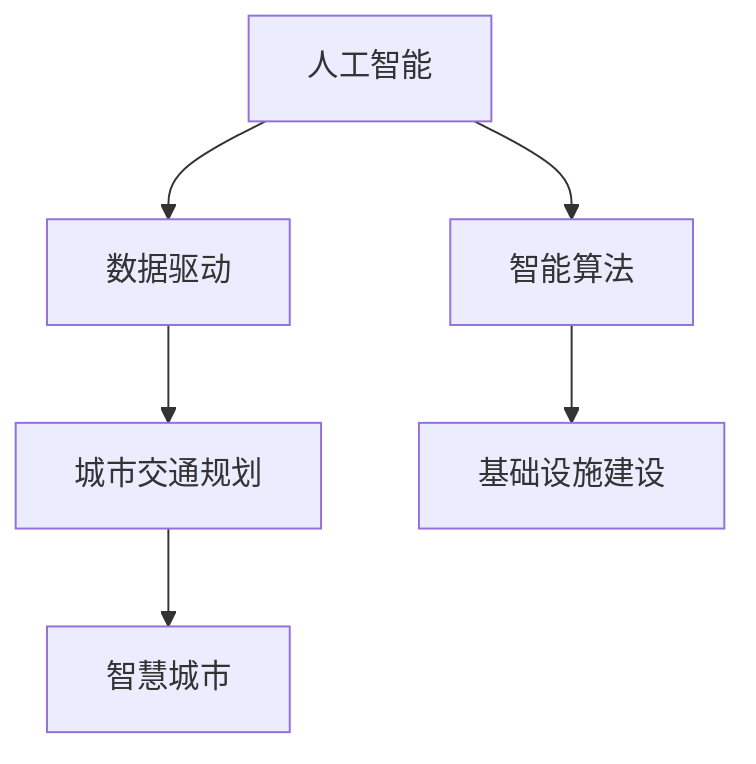

                 

# AI与人类计算：打造可持续发展的城市交通与基础设施建设规划与管理

## 1. 背景介绍

### 1.1 问题由来
随着城市化进程的加快和科技的发展，城市交通与基础设施建设规划与管理成为了城市可持续发展的关键环节。传统的城市规划方法依赖于人类经验，存在耗时长、成本高、准确性低等问题。随着人工智能（AI）和大数据技术的成熟，AI与人类计算的结合为城市规划与管理的智能化、高效化提供了新的可能性。

### 1.2 问题核心关键点
AI与人类计算在城市交通与基础设施建设规划与管理中的应用，核心在于利用数据驱动和智能算法，帮助城市规划师和工程师更好地理解城市交通动态，优化基础设施建设方案，提升城市运行效率和可持续性。

### 1.3 问题研究意义
AI与人类计算的应用不仅能够显著提升城市规划与管理的效率和质量，还能减少对人力资源的依赖，降低规划成本，实现城市的可持续发展。

## 2. 核心概念与联系

### 2.1 核心概念概述

为了更好地理解AI与人类计算在城市交通与基础设施建设规划与管理中的应用，本节将介绍几个关键概念：

- **人工智能（AI）**：利用计算机模拟人类智能行为的科学技术，包括机器学习、深度学习、自然语言处理、计算机视觉等。
- **数据驱动**：利用数据作为决策依据，减少对人类经验的主观依赖。
- **智能算法**：通过算法优化决策过程，提升计算效率和精度。
- **城市交通规划**：对城市交通流量、路线、站点等进行规划，以优化交通运行。
- **基础设施建设**：包括道路、桥梁、公共交通设施等的建设，确保城市运行的基础保障。
- **智慧城市**：利用AI和大数据技术，构建智能化的城市运行体系，实现高效的资源管理。

这些概念之间的逻辑关系可以通过以下Mermaid流程图来展示：



这个流程图展示了几者的关联：

1. 人工智能通过数据驱动和智能算法支持城市交通规划和基础设施建设。
2. 数据驱动帮助规划师和工程师更好地理解交通动态和基础设施需求。
3. 智能算法优化决策过程，提升规划和建设效率。
4. 城市交通规划和基础设施建设是智慧城市构建的重要组成部分。

## 3. 核心算法原理 & 具体操作步骤
### 3.1 算法原理概述

基于AI与人类计算的城市交通与基础设施建设规划与管理，本质上是一个数据驱动的智能决策过程。其核心思想是：利用AI技术处理和分析城市交通数据和基础设施需求数据，通过智能算法进行优化和预测，辅助人类规划师和工程师制定决策。

形式化地，假设城市交通和基础设施需求数据集为 $D=\{(x_i,y_i)\}_{i=1}^N, x_i \in \mathcal{X}, y_i \in \mathcal{Y}$，其中 $\mathcal{X}$ 为输入空间，$\mathcal{Y}$ 为输出空间。假设模型为 $M_{\theta}$，其中 $\theta$ 为模型参数。规划与管理的目标是找到最优参数 $\theta^*$，使得模型预测 $M_{\theta}(x_i)$ 尽可能接近实际标签 $y_i$。

具体步骤如下：

1. **数据收集**：收集城市交通流量、道路条件、公共交通运行等数据。
2. **数据预处理**：清洗、标注数据，处理缺失值和异常值。
3. **模型训练**：选择合适的AI模型（如深度学习、强化学习等），使用训练数据 $D$ 进行模型训练。
4. **模型评估**：在验证集上评估模型性能，选择最优模型。
5. **决策辅助**：将模型应用于实际决策，优化城市交通规划和基础设施建设。

### 3.2 算法步骤详解

以下是一个基于深度学习的城市交通规划流程：

**Step 1: 数据收集与预处理**
- 收集城市交通数据，如交通流量、道路条件、公共交通运行数据等。
- 对数据进行清洗和标注，处理缺失值和异常值。
- 数据划分训练集、验证集和测试集。

**Step 2: 模型选择与设计**
- 选择深度学习模型，如卷积神经网络（CNN）、循环神经网络（RNN）等，用于处理时间序列数据。
- 设计合适的网络结构，如LSTM、GRU等。
- 设定合适的损失函数和优化器，如均方误差、交叉熵、Adam等。

**Step 3: 模型训练**
- 将训练集输入模型，进行前向传播和计算损失。
- 反向传播更新模型参数，优化模型性能。
- 周期性在验证集上评估模型性能，选择最优模型。

**Step 4: 模型评估与决策辅助**
- 在测试集上评估模型性能，输出预测结果。
- 辅助规划师和工程师进行决策，优化城市交通规划和基础设施建设。
- 持续收集新数据，更新模型，提升模型适应性。

### 3.3 算法优缺点

AI与人类计算在城市交通与基础设施建设规划与管理中的应用，具有以下优点：

1. **高效性**：AI算法可以快速处理和分析大量数据，提升规划效率。
2. **精确性**：AI算法可以避免人为经验的主观偏差，提高规划决策的准确性。
3. **可扩展性**：AI模型可以不断学习和更新，适应新数据和新变化。

同时，也存在一些局限性：

1. **数据质量依赖**：AI模型的效果很大程度上依赖于数据的质量和量。
2. **模型解释性不足**：AI模型往往是"黑盒"，难以解释其决策过程。
3. **技术门槛高**：需要掌握数据科学、机器学习等专业知识。
4. **资源消耗大**：AI模型训练和推理需要大量的计算资源。

尽管存在这些局限性，AI与人类计算在城市规划与管理中的应用前景广阔，将继续推动城市智能化和可持续发展的进程。

### 3.4 算法应用领域

AI与人类计算在城市交通与基础设施建设规划与管理中的应用，主要包括以下几个方面：

- **交通流量预测**：利用AI模型预测未来交通流量，优化道路和公共交通方案。
- **城市规划优化**：通过AI模型分析城市发展趋势，优化城市规划布局。
- **智能交通信号控制**：利用AI算法优化交通信号，提升交通流畅度和安全性。
- **基础设施健康监测**：通过AI技术监测基础设施状况，及时发现和修复问题。
- **智慧城市管理**：整合城市各类数据，实现城市运行的智能化管理。

## 4. 数学模型和公式 & 详细讲解  
### 4.1 数学模型构建

假设城市交通流量数据为 $x_i$，交通拥堵程度为 $y_i$，其中 $x_i \in \mathcal{X}, y_i \in \mathcal{Y}$。模型为深度学习模型 $M_{\theta}$，其中 $\theta$ 为模型参数。目标为最小化预测误差：

$$
\theta^* = \mathop{\arg\min}_{\theta} \mathcal{L}(M_{\theta},D)
$$

其中 $\mathcal{L}$ 为损失函数，如均方误差损失函数：

$$
\mathcal{L}(M_{\theta},D) = \frac{1}{N} \sum_{i=1}^N (y_i - M_{\theta}(x_i))^2
$$

### 4.2 公式推导过程

假设选择了LSTM模型，输入为 $x_i$，输出为 $y_i$，模型结构如下：

$$
y_i = M_{\theta}(x_i) = f(U(x_i), V(x_i))
$$

其中 $U$ 为输入到隐藏层的映射，$V$ 为隐藏层到输出的映射，$f$ 为激活函数。在训练过程中，通过反向传播更新参数 $\theta$：

$$
\frac{\partial \mathcal{L}}{\partial \theta} = -2\frac{\partial M_{\theta}(x_i)}{\partial \theta} (y_i - M_{\theta}(x_i))
$$

通过梯度下降等优化算法，不断更新参数 $\theta$，最小化损失函数 $\mathcal{L}$。

### 4.3 案例分析与讲解

以智能交通信号控制为例，使用AI模型优化信号灯周期。首先，收集历史交通流量数据，作为训练集。设计LSTM模型，使用均方误差损失函数进行训练。训练完成后，使用验证集评估模型性能，选择最优模型。最后，将模型应用于实际交通信号控制，优化信号灯周期，提升交通流畅度和安全性。

## 5. 项目实践：代码实例和详细解释说明
### 5.1 开发环境搭建

在进行AI与人类计算项目实践前，我们需要准备好开发环境。以下是使用Python进行TensorFlow开发的环境配置流程：

1. 安装Anaconda：从官网下载并安装Anaconda，用于创建独立的Python环境。

2. 创建并激活虚拟环境：
```bash
conda create -n tensorflow-env python=3.8 
conda activate tensorflow-env
```

3. 安装TensorFlow：根据CUDA版本，从官网获取对应的安装命令。例如：
```bash
conda install tensorflow -c tensorflow -c conda-forge
```

4. 安装必要的库：
```bash
pip install numpy pandas matplotlib scikit-learn torch
```

5. 安装TensorBoard：
```bash
pip install tensorboard
```

完成上述步骤后，即可在`tensorflow-env`环境中开始项目开发。

### 5.2 源代码详细实现

以下是使用TensorFlow进行智能交通信号控制的示例代码：

```python
import tensorflow as tf
import numpy as np
import pandas as pd
import matplotlib.pyplot as plt

# 加载数据
data = pd.read_csv('traffic_data.csv')

# 数据预处理
X = data[['traffic_flow']].values
y = data['signal_period'].values

# 划分数据集
train_ratio = 0.8
X_train, X_test, y_train, y_test = train_test_split(X, y, test_size=1-train_ratio)

# 构建LSTM模型
model = tf.keras.Sequential([
    tf.keras.layers.LSTM(64, input_shape=(X.shape[1], 1)),
    tf.keras.layers.Dense(1)
])

# 编译模型
model.compile(optimizer=tf.keras.optimizers.Adam(learning_rate=0.001),
              loss=tf.keras.losses.MeanSquaredError())

# 训练模型
model.fit(X_train.reshape((-1, X_train.shape[1], 1)), y_train,
          epochs=50, batch_size=32, validation_data=(X_test.reshape((-1, X_test.shape[1], 1)), y_test))

# 评估模型
model.evaluate(X_test.reshape((-1, X_test.shape[1], 1)), y_test)

# 预测信号周期
y_pred = model.predict(X_test.reshape((-1, X_test.shape[1], 1)))
plt.plot(y_pred)
plt.show()
```

### 5.3 代码解读与分析

让我们再详细解读一下关键代码的实现细节：

**数据加载与预处理**：
- `pd.read_csv`方法：从CSV文件中读取数据。
- `train_test_split`方法：将数据集划分为训练集和测试集。

**模型构建与训练**：
- `tf.keras.Sequential`：构建LSTM模型，输入维度为交通流量，输出维度为信号周期。
- `compile`方法：编译模型，设置优化器和损失函数。
- `fit`方法：训练模型，设置训练轮数和批量大小。

**模型评估与预测**：
- `evaluate`方法：在测试集上评估模型性能。
- `predict`方法：使用模型进行预测。

**可视化结果**：
- `plt.plot`方法：绘制预测信号周期。

可以看到，TensorFlow的高级API使得模型构建和训练变得非常简洁高效。开发者可以将更多精力放在数据处理和模型改进上，而不必过多关注底层实现细节。

## 6. 实际应用场景
### 6.1 智能交通管理

AI与人类计算在智能交通管理中的应用，可以显著提升城市交通的效率和安全性。例如，智能信号灯系统可以根据实时交通流量自动调整信号周期，避免交通拥堵，提高通行效率。此外，通过AI模型预测交通流量变化，可以有效调整交通资源分配，缓解高峰期交通压力。

### 6.2 智慧城市建设

AI与人类计算在智慧城市建设中的应用，可以实现城市各类数据的整合和利用，提升城市管理水平。例如，通过AI模型分析城市能源消耗数据，优化能源分配方案，减少浪费，实现节能减排。同时，AI模型可以辅助城市规划师进行地块分析，优化城市布局，提升城市生态环境。

### 6.3 基础设施维护

AI与人类计算在基础设施维护中的应用，可以实现基础设施状态的实时监测和预测。例如，通过AI模型分析桥梁、道路等基础设施的传感器数据，及时发现损坏或磨损情况，制定维修计划，延长基础设施使用寿命。此外，AI模型可以预测基础设施的故障模式，提前采取预防措施，减少突发事件的发生。

## 7. 工具和资源推荐
### 7.1 学习资源推荐

为了帮助开发者掌握AI与人类计算在城市交通与基础设施建设规划与管理中的应用，这里推荐一些优质的学习资源：

1. **《TensorFlow实战》**：由TensorFlow官方发布的实战指南，介绍了TensorFlow的基本使用方法和实例应用。
2. **《深度学习与城市智能化》**：介绍深度学习在城市交通、基础设施管理中的应用。
3. **《智慧城市构建》**：由知名专家编写的智慧城市构建指南，涵盖AI与大数据在智慧城市中的应用。
4. **Kaggle竞赛**：参加Kaggle的智慧城市、交通管理等领域的竞赛，实战锻炼AI技术能力。
5. **CS231n《深度学习课程》**：斯坦福大学开设的深度学习课程，涵盖AI和机器学习的基本概念和应用。

通过对这些资源的学习实践，相信你一定能够快速掌握AI与人类计算的应用技术，并将其应用于城市交通与基础设施建设规划与管理中。

### 7.2 开发工具推荐

高效的开发离不开优秀的工具支持。以下是几款用于AI与人类计算开发的工具：

1. **TensorFlow**：由Google主导开发的深度学习框架，支持分布式计算和GPU加速，适合大规模工程应用。
2. **PyTorch**：Facebook开发的深度学习框架，支持动态图，灵活性高，适合研究应用。
3. **Scikit-learn**：基于Python的数据分析与机器学习库，包含多种常用算法和数据预处理工具。
4. **Jupyter Notebook**：交互式编程环境，适合开发和测试AI模型。
5. **TensorBoard**：TensorFlow配套的可视化工具，可以实时监测模型训练状态，提供丰富的图表。

合理利用这些工具，可以显著提升AI与人类计算项目的开发效率，加速技术创新和落地应用。

### 7.3 相关论文推荐

AI与人类计算在城市交通与基础设施建设规划与管理中的应用，源于学界的持续研究。以下是几篇奠基性的相关论文，推荐阅读：

1. **《智能交通系统：理论与实践》**：系统介绍智能交通系统的设计、实现与优化。
2. **《智慧城市：构建与治理》**：讨论智慧城市的概念、构建方法与治理策略。
3. **《深度学习在城市基础设施维护中的应用》**：研究AI模型在基础设施维护中的实际应用。
4. **《基于深度学习的城市交通流量预测》**：提出深度学习模型在交通流量预测中的应用。
5. **《多智能体系统在城市交通管理中的应用》**：探讨多智能体系统在智能交通管理中的应用。

这些论文代表了大数据和AI在城市规划与管理领域的发展脉络。通过学习这些前沿成果，可以帮助研究者把握学科前进方向，激发更多的创新灵感。

## 8. 总结：未来发展趋势与挑战
### 8.1 总结

本文对基于AI与人类计算的城市交通与基础设施建设规划与管理进行了全面系统的介绍。首先阐述了AI与人类计算在城市规划与管理中的应用背景和意义，明确了其在提升城市智能化水平和效率方面的独特价值。其次，从原理到实践，详细讲解了AI与人类计算的数学模型和关键操作步骤，给出了实际应用中的代码实例。同时，本文还广泛探讨了AI与人类计算在智能交通、智慧城市、基础设施维护等多个领域的应用前景，展示了其在推动城市可持续发展中的潜力。

通过本文的系统梳理，可以看到，AI与人类计算的应用为城市交通与基础设施建设规划与管理带来了新的可能性，能够显著提升城市运行的智能化和高效化。AI模型的数据驱动和智能算法优势，使其在城市规划与管理中发挥了重要作用。

### 8.2 未来发展趋势

展望未来，AI与人类计算在城市交通与基础设施建设规划与管理中的应用将呈现以下几个发展趋势：

1. **智能化程度提升**：随着AI技术的进步，城市交通与基础设施规划将更加智能化，决策过程更加科学和高效。
2. **跨领域融合**：AI与人类计算将与城市能源、环境、公共安全等更多领域进行融合，实现城市综合治理。
3. **实时化应用**：通过AI模型实时分析城市数据，城市交通与基础设施建设将能够实现动态优化和应急响应。
4. **模型可解释性增强**：AI模型的可解释性研究将成为热点，使其决策过程更加透明和可信。
5. **数据资源利用优化**：通过AI技术优化数据收集、处理和利用方式，提升城市管理的数据质量。
6. **模型参数高效性提升**：研究参数高效、计算高效的AI模型，减少资源消耗，实现高效应用。

以上趋势凸显了AI与人类计算在城市规划与管理中的广阔前景。这些方向的探索发展，必将进一步推动城市智能化和可持续发展的进程。

### 8.3 面临的挑战

尽管AI与人类计算在城市交通与基础设施建设规划与管理中的应用前景广阔，但在迈向更加智能化、普适化应用的过程中，仍面临诸多挑战：

1. **数据隐私保护**：城市数据的隐私保护和安全性问题需要重视，避免数据泄露和滥用。
2. **技术门槛高**：AI技术需要专业的知识和技能，对从业者的素质要求较高。
3. **模型泛化能力**：AI模型需要具备较强的泛化能力，以适应不同地区和情况的城市。
4. **模型计算资源需求高**：AI模型的训练和推理需要大量计算资源，成本较高。
5. **模型解释性不足**：AI模型的黑盒特性需要改进，增强可解释性和可信度。
6. **技术标准化问题**：不同城市和地区的技术标准不一致，需要建立统一的标准。

这些挑战需要在技术、管理和政策等多个层面进行解决，才能实现AI与人类计算在城市交通与基础设施建设规划与管理的广泛应用。

### 8.4 研究展望

为了应对上述挑战，未来的研究需要在以下几个方面寻求新的突破：

1. **数据隐私保护技术**：研究数据隐私保护技术，确保城市数据的合法使用和保护。
2. **AI模型可解释性**：研究模型解释性技术，提高AI模型的可解释性和可信度。
3. **跨领域融合**：研究跨领域融合技术，实现AI与人类计算在更多领域的应用。
4. **高效模型计算**：研究高效模型计算技术，降低AI模型的计算资源需求。
5. **模型标准化**：建立AI模型的标准化框架，确保不同城市和地区的技术兼容。

这些研究方向的探索，必将推动AI与人类计算在城市交通与基础设施建设规划与管理中的应用不断进步，实现智能化和可持续发展的目标。

## 9. 附录：常见问题与解答

**Q1：AI与人类计算在城市交通与基础设施建设规划与管理中的应用前景如何？**

A: AI与人类计算在城市交通与基础设施建设规划与管理中的应用前景广阔，能够显著提升城市运行的智能化和高效化。通过AI模型实时分析城市数据，可以优化交通流量、提升基础设施维护效率，实现城市综合治理。

**Q2：AI模型在城市交通与基础设施建设规划与管理中面临哪些挑战？**

A: AI模型在城市交通与基础设施建设规划与管理中面临以下挑战：
1. 数据隐私保护：需要研究数据隐私保护技术，确保城市数据的合法使用和保护。
2. 技术门槛高：需要提高从业者的技术素质，降低技术应用的门槛。
3. 模型泛化能力：需要研究模型泛化能力，使其能够适应不同地区和情况的城市。
4. 计算资源需求高：需要研究高效模型计算技术，降低计算资源需求。
5. 模型解释性不足：需要研究模型解释性技术，提高AI模型的可解释性和可信度。
6. 技术标准化：需要建立AI模型的标准化框架，确保不同城市和地区的技术兼容。

这些挑战需要在技术、管理和政策等多个层面进行解决，才能实现AI与人类计算在城市交通与基础设施建设规划与管理中的广泛应用。

**Q3：如何在城市交通与基础设施建设规划与管理中应用AI与人类计算？**

A: 在城市交通与基础设施建设规划与管理中应用AI与人类计算，可以采取以下步骤：
1. 数据收集与预处理：收集城市交通流量、道路条件、公共交通运行数据等，进行清洗和标注。
2. 模型选择与设计：选择深度学习模型，如LSTM、GRU等，设计合适的网络结构。
3. 模型训练与评估：使用训练集训练模型，在验证集上评估模型性能。
4. 决策辅助：将模型应用于实际决策，优化城市交通规划和基础设施建设。
5. 持续优化：持续收集新数据，更新模型，提升模型适应性。

这些步骤能够有效利用AI与人类计算在城市交通与基础设施建设规划与管理中的应用，提升城市运行的智能化和高效化。

---

作者：禅与计算机程序设计艺术 / Zen and the Art of Computer Programming

