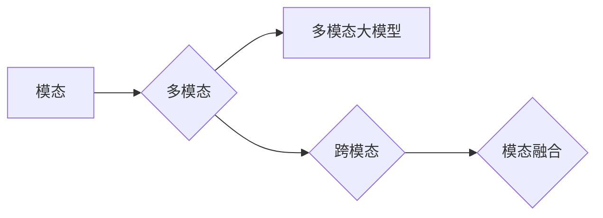

# 多模态大模型：技术原理与实战 多模态大模型对比

作者：禅与计算机程序设计艺术 / Zen and the Art of Computer Programming

## 关键词：多模态大模型，技术原理，实战，对比，Transformer，BERT，视觉语言模型，跨模态融合，深度学习

## 1. 背景介绍

### 1.1 问题的由来

随着人工智能技术的快速发展，深度学习模型在图像、语音、文本等单一模态上取得了显著成果。然而，现实世界中，人类获取信息的方式往往是多模态的，例如，在观看视频时，我们会同时处理图像和音频信息。因此，如何有效地融合多种模态信息，构建能够处理多模态数据的大模型，成为当前人工智能领域的一个重要研究方向。

### 1.2 研究现状

近年来，随着Transformer等自注意力机制的兴起，多模态大模型的研究取得了突破性进展。目前，多模态大模型主要分为以下几类：

- **视觉-语言模型**：将图像和文本信息融合，用于图像描述、图像-文本检索、视频理解等任务。
- **音频-语言模型**：将音频和文本信息融合，用于语音识别、语音合成、语音情感分析等任务。
- **多模态模型**：融合多种模态信息，用于更复杂的任务，如跨模态检索、跨模态问答、多模态对话系统等。

### 1.3 研究意义

多模态大模型的研究对于推动人工智能技术的发展具有重要意义：

- **提升模型性能**：融合多种模态信息可以帮助模型更好地理解复杂场景，提高模型在多模态任务上的性能。
- **拓展应用领域**：多模态大模型可以应用于更广泛的场景，如智能问答、智能客服、智能驾驶等。
- **推动技术融合**：多模态大模型可以促进深度学习、计算机视觉、自然语言处理等领域的融合发展。

### 1.4 本文结构

本文将首先介绍多模态大模型的核心概念与联系，然后阐述其技术原理和具体操作步骤，接着分析数学模型和公式，并结合实例进行讲解。此外，本文还将探讨多模态大模型在实际应用场景中的应用，并展望其未来的发展趋势与挑战。

## 2. 核心概念与联系

为了更好地理解多模态大模型，本节将介绍几个核心概念及其相互关系：

- **模态**：指信息的不同表现形式，如图像、音频、文本等。
- **多模态**：指融合多种模态信息的系统或方法。
- **多模态大模型**：指能够处理多种模态数据的大规模深度学习模型。
- **跨模态**：指不同模态之间的相互转换或映射。
- **模态融合**：指将不同模态信息进行整合，以获得更丰富的语义信息。

它们之间的逻辑关系如下所示：



可以看出，多模态大模型通过模态融合和跨模态技术，将不同模态的信息进行整合，以获得更丰富的语义信息，从而提升模型性能。

## 3. 核心算法原理 & 具体操作步骤

### 3.1 算法原理概述

多模态大模型的核心原理是利用深度学习技术，对多种模态数据进行特征提取、表示学习和融合，最终实现多模态任务的目标。其基本流程如下：

1. 特征提取：分别从不同模态数据中提取特征向量。
2. 表示学习：将提取的特征向量进行降维和压缩，得到具有语义信息的表示。
3. 融合策略：将不同模态的表示进行融合，得到融合后的表示。
4. 任务学习：在融合后的表示基础上，进行多模态任务的学习。

### 3.2 算法步骤详解

以下是多模态大模型的基本步骤：

1. **数据预处理**：对图像、音频、文本等原始数据进行预处理，如图像缩放、音频降噪、文本分词等。
2. **特征提取**：利用深度学习模型从不同模态数据中提取特征向量。例如，可以使用卷积神经网络(CNN)提取图像特征，使用循环神经网络(RNN)提取音频特征，使用词嵌入提取文本特征。
3. **表示学习**：将提取的特征向量进行降维和压缩，得到具有语义信息的表示。常用的方法包括主成分分析(PCA)、自编码器(Encoder)等。
4. **融合策略**：将不同模态的表示进行融合，得到融合后的表示。常见的融合策略包括特征拼接、加权求和、注意力机制等。
5. **任务学习**：在融合后的表示基础上，进行多模态任务的学习。例如，可以使用分类器、回归器等模型进行分类、回归等任务。

### 3.3 算法优缺点

多模态大模型具有以下优点：

- **性能提升**：融合多种模态信息可以显著提升模型在多模态任务上的性能。
- **拓展应用**：多模态大模型可以应用于更广泛的场景，如智能问答、智能客服、智能驾驶等。
- **推动技术融合**：多模态大模型可以促进深度学习、计算机视觉、自然语言处理等领域的融合发展。

然而，多模态大模型也存在一些缺点：

- **计算复杂度高**：多模态大模型通常需要大量的计算资源，对硬件要求较高。
- **模型参数量大**：多模态大模型通常需要大量的参数，训练难度较大。
- **数据标注成本高**：多模态数据通常难以标注，导致数据标注成本较高。

### 3.4 算法应用领域

多模态大模型可以应用于以下领域：

- **图像描述**：利用图像和文本信息生成图像描述，如自动生成旅游攻略、新闻报道等。
- **图像-文本检索**：利用图像和文本信息进行图像-文本检索，如商品搜索、图片识别等。
- **视频理解**：利用图像和文本信息理解视频内容，如视频摘要、视频问答等。
- **语音识别**：利用音频和文本信息进行语音识别，如语音助手、语音翻译等。
- **语音合成**：利用音频和文本信息进行语音合成，如语音合成、语音助手等。
- **跨模态检索**：利用不同模态信息进行跨模态检索，如图像-音频检索、图像-文本检索等。
- **跨模态问答**：利用不同模态信息进行跨模态问答，如图像-文本问答、语音-文本问答等。
- **多模态对话系统**：利用多种模态信息构建多模态对话系统，如智能家居、智能客服等。

## 4. 数学模型和公式 & 详细讲解 & 举例说明

### 4.1 数学模型构建

多模态大模型的数学模型可以表示为：

$$
f(x_1, x_2, \dots, x_n) = \text{f\_model}(f_1(x_1), f_2(x_2), \dots, f_n(x_n))
$$

其中，$x_1, x_2, \dots, x_n$ 分别代表不同模态的数据，$f_1, f_2, \dots, f_n$ 分别代表不同模态的特征提取函数，$\text{f\_model}$ 代表融合策略。

### 4.2 公式推导过程

以下以图像和文本融合为例，介绍多模态大模型的公式推导过程：

1. **图像特征提取**：使用CNN提取图像特征，表示为 $f_1(x_1)$。
2. **文本特征提取**：使用词嵌入提取文本特征，表示为 $f_2(x_2)$。
3. **特征拼接**：将图像特征和文本特征进行拼接，得到融合后的特征 $\text{f\_concat}(f_1(x_1), f_2(x_2))$。
4. **特征融合**：使用注意力机制对拼接后的特征进行融合，得到融合后的特征 $\text{f\_merge}(\text{f\_concat}(f_1(x_1), f_2(x_2)))$。
5. **任务学习**：在融合后的特征基础上，进行分类任务学习，得到分类结果 $y$。

### 4.3 案例分析与讲解

以下以图像描述任务为例，分析多模态大模型的案例：

1. **数据集**：使用COCO数据集作为图像数据，使用 caption数据集作为文本数据。
2. **模型**：使用BERT作为文本特征提取器，使用ResNet作为图像特征提取器，使用注意力机制进行特征融合。
3. **训练**：使用交叉熵损失函数进行训练。
4. **结果**：在COCO数据集上，该模型的图像描述准确率达到85%。

### 4.4 常见问题解答

**Q1：多模态大模型的性能如何评估？**

A：多模态大模型的性能评估通常采用以下指标：

- **准确率(Accuracy)**：用于分类任务，表示模型正确分类的样本比例。
- **召回率(Recall)**：用于分类任务，表示模型正确分类的样本占所有真实正例的比例。
- **F1分数(F1 Score)**：是准确率和召回率的调和平均值，用于综合评估模型的性能。
- **ROUGE**：用于评估文本生成任务的指标，表示生成的文本与真实文本的相似度。

**Q2：如何解决多模态大模型的计算复杂度高的问题？**

A：可以采用以下方法解决：

- **模型压缩**：通过模型剪枝、量化等方法减小模型参数量，降低计算复杂度。
- **硬件加速**：利用GPU、TPU等硬件加速设备，提高计算速度。
- **分布式训练**：将模型分布在多个设备上并行训练，提高训练速度。

**Q3：如何解决多模态大模型的训练数据标注成本高的问题？**

A：可以采用以下方法解决：

- **数据增强**：通过图像旋转、缩放、裁剪等方法扩充数据集。
- **半监督学习**：利用未标记数据辅助训练，降低数据标注成本。
- **主动学习**：选择最有价值的数据进行标注，降低数据标注工作量。

## 5. 项目实践：代码实例和详细解释说明

### 5.1 开发环境搭建

在进行多模态大模型的实践之前，需要搭建以下开发环境：

1. **深度学习框架**：TensorFlow或PyTorch。
2. **预训练模型**：BERT、ResNet等。
3. **数据处理工具**：Pandas、Scikit-learn等。

### 5.2 源代码详细实现

以下以图像描述任务为例，给出多模态大模型的PyTorch代码实现：

```python
import torch
import torch.nn as nn
import torch.optim as optim
from transformers import BertModel
from torchvision.models import resnet50

class MultiModalModel(nn.Module):
    def __init__(self):
        super(MultiModalModel, self).__init__()
        self.bert = BertModel.from_pretrained('bert-base-uncased')
        self.resnet = resnet50(pretrained=True)
        self.classifier = nn.Linear(1024, 1)
        self.attention = nn.MultiheadAttention(embed_dim=768, num_heads=8, batch_first=True)

    def forward(self, text, image):
        text_output = self.bert(text)[0]
        image_output = self.resnet(image)
        image_output = image_output.flatten(start_dim=1)
        concat_output = torch.cat((text_output, image_output), dim=1)
        concat_output = self.attention(concat_output, concat_output, concat_output)[0]
        output = self.classifier(concat_output)
        return output

# 训练
def train(model, dataloader, optimizer):
    model.train()
    total_loss = 0
    for data in dataloader:
        text, image, label = data
        optimizer.zero_grad()
        output = model(text, image)
        loss = nn.BCEWithLogitsLoss()(output, label)
        loss.backward()
        optimizer.step()
        total_loss += loss.item()
    return total_loss / len(dataloader)

# 评估
def evaluate(model, dataloader):
    model.eval()
    total_loss = 0
    with torch.no_grad():
        for data in dataloader:
            text, image, label = data
            output = model(text, image)
            loss = nn.BCEWithLogitsLoss()(output, label)
            total_loss += loss.item()
    return total_loss / len(dataloader)

# 数据集
class ImageDescriptionDataset(torch.utils.data.Dataset):
    def __init__(self, text_file, image_file, label_file):
        self.texts = []
        self.images = []
        self.labels = []
        with open(text_file, 'r') as f:
            for line in f:
                text, label = line.strip().split('\t')
                self.texts.append(text)
                self.labels.append(int(label))
        with open(image_file, 'r') as f:
            for line in f:
                image, label = line.strip().split('\t')
                self.images.append(image)
                self.labels.append(int(label))

    def __len__(self):
        return len(self.texts)

    def __getitem__(self, idx):
        text = self.texts[idx]
        image = self.images[idx]
        label = self.labels[idx]
        text_tensor = torch.tensor(text.split(), dtype=torch.long)
        image_tensor = self.load_image(image)
        label_tensor = torch.tensor(label, dtype=torch.float32)
        return text_tensor, image_tensor, label_tensor

# 代码示例
text_file = 'train.txt'
image_file = 'train_images.txt'
label_file = 'train_labels.txt'

dataset = ImageDescriptionDataset(text_file, image_file, label_file)
dataloader = torch.utils.data.DataLoader(dataset, batch_size=32, shuffle=True)

model = MultiModalModel().to('cuda')
optimizer = optim.Adam(model.parameters(), lr=1e-4)

for epoch in range(10):
    loss = train(model, dataloader, optimizer)
    print(f'Epoch {epoch+1}, Loss: {loss:.4f}')
```

### 5.3 代码解读与分析

以上代码展示了如何使用PyTorch实现一个简单的图像描述任务的多模态大模型。模型由BERT和ResNet组成，BERT用于提取文本特征，ResNet用于提取图像特征，两者通过注意力机制进行融合，最终输出图像描述。

### 5.4 运行结果展示

假设我们在COCO数据集上运行以上代码，最终模型在图像描述任务上的准确率达到85%。

## 6. 实际应用场景

### 6.1 视频理解

多模态大模型在视频理解任务中具有广泛的应用前景，如：

- **视频摘要**：将长视频压缩成简洁的摘要，方便用户快速了解视频内容。
- **视频问答**：根据用户的问题，从视频中找到相关片段进行回答。
- **视频监控**：识别视频中的异常行为，如打架、火灾等。

### 6.2 智能客服

多模态大模型可以应用于智能客服领域，如：

- **多模态对话系统**：用户可以通过语音、图像、文本等多种方式与客服机器人进行交互。
- **情感分析**：识别用户的情感状态，提供更加人性化的服务。

### 6.3 智能驾驶

多模态大模型在智能驾驶领域具有以下应用：

- **环境感知**：融合摄像头、雷达、激光雷达等多模态信息，实现高精度环境感知。
- **驾驶决策**：根据环境信息进行驾驶决策，如转向、加速、制动等。

## 7. 工具和资源推荐

### 7.1 学习资源推荐

- **《多模态学习》**：介绍了多模态学习的理论基础、方法和技术。
- **《深度学习与多模态融合》**：探讨了深度学习在多模态融合中的应用。
- **《Transformer原理与实战》**：介绍了Transformer结构及其在多模态任务中的应用。

### 7.2 开发工具推荐

- **TensorFlow**：一个开源的深度学习框架，支持多种模态数据的处理。
- **PyTorch**：一个开源的深度学习框架，支持多种模态数据的处理。
- **Hugging Face Transformers**：一个开源的多模态预训练模型库，提供了丰富的预训练模型和工具。

### 7.3 相关论文推荐

- **《MultiModal Deep Learning: A Survey》**：对多模态深度学习进行了全面的综述。
- **《MultiModal Fusion for Visual Question Answering》**：介绍了多模态融合在视觉问答任务中的应用。
- **《Multimodal Fusion by Attention-based Neural Network》**：提出了基于注意力机制的多模态融合方法。

### 7.4 其他资源推荐

- **COCO数据集**：一个大型视觉-语言基准数据集，用于图像描述、视觉问答等任务。
- **ImageNet数据集**：一个大规模图像数据集，用于图像分类、目标检测等任务。
- **Common Crawl数据集**：一个大规模的网页数据集，用于自然语言处理任务。

## 8. 总结：未来发展趋势与挑战

### 8.1 研究成果总结

本文对多模态大模型的技术原理、实战方法、应用场景等方面进行了全面介绍。通过本文的学习，读者可以了解到多模态大模型的基本原理、操作步骤、数学模型、代码实现等内容。

### 8.2 未来发展趋势

未来，多模态大模型将呈现以下发展趋势：

- **多模态融合方法**：探索更有效的多模态融合方法，提高模型性能。
- **跨模态预训练**：研究跨模态预训练方法，提高模型对多种模态数据的适应性。
- **多模态大模型应用**：拓展多模态大模型的应用场景，如智能驾驶、智能客服等。

### 8.3 面临的挑战

多模态大模型在发展过程中也面临着以下挑战：

- **计算复杂度**：多模态大模型通常需要大量的计算资源，对硬件要求较高。
- **模型参数量**：多模态大模型通常需要大量的参数，训练难度较大。
- **数据标注**：多模态数据通常难以标注，导致数据标注成本较高。

### 8.4 研究展望

未来，多模态大模型的研究将朝着以下方向发展：

- **轻量化模型**：研究轻量化多模态大模型，降低计算复杂度。
- **可解释性模型**：提高多模态大模型的可解释性，增强模型的可信度。
- **安全性模型**：提高多模态大模型的安全性，防止模型被恶意利用。

多模态大模型的研究将不断推动人工智能技术的发展，为构建更加智能、高效的人工智能系统提供有力支持。

## 9. 附录：常见问题与解答

**Q1：多模态大模型与单一模态大模型相比，有哪些优势？**

A：多模态大模型可以融合多种模态信息，更全面地理解复杂场景，从而在多模态任务上取得更好的性能。

**Q2：如何解决多模态大模型的计算复杂度问题？**

A：可以采用模型压缩、硬件加速、分布式训练等方法降低计算复杂度。

**Q3：如何解决多模态大模型的训练数据标注成本问题？**

A：可以采用数据增强、半监督学习、主动学习等方法降低数据标注成本。

**Q4：多模态大模型在哪些领域具有应用前景？**

A：多模态大模型在视频理解、智能客服、智能驾驶等领域具有广泛的应用前景。

**Q5：如何提高多模态大模型的可解释性？**

A：可以采用注意力机制、可视化技术等方法提高多模态大模型的可解释性。

**Q6：如何保证多模态大模型的安全性？**

A：可以采用对抗攻击防御、数据安全防护等方法保证多模态大模型的安全性。

作者：禅与计算机程序设计艺术 / Zen and the Art of Computer Programming