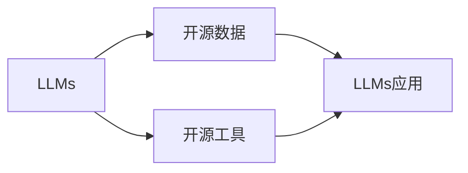

# 大规模语言模型从理论到实践 开源数据

作者：禅与计算机程序设计艺术 / Zen and the Art of Computer Programming

## 1. 背景介绍

### 1.1 问题的由来

随着深度学习技术的快速发展，自然语言处理（NLP）领域取得了突破性的进展。大规模语言模型（Large Language Models，LLMs）作为一种强大的语言表示和生成工具，在机器翻译、文本摘要、问答系统等多个领域展现出惊人的能力。然而，LLMs的研究和应用也面临着诸多挑战，其中之一便是数据获取和标注的成本高昂。因此，开源数据成为推动LLMs发展的关键因素。

### 1.2 研究现状

近年来，随着越来越多的研究人员和开发者参与到LLMs的开源项目中，开源数据资源逐渐丰富。这些开源数据涵盖了各个领域，包括通用语料库、特定领域语料库、标注数据集等。同时，开源数据和工具的不断涌现，也为LLMs的研究和应用提供了便捷的支持。

### 1.3 研究意义

开源数据在LLMs研究中具有以下重要意义：

1. **降低研究门槛**：开源数据使得研究人员和开发者能够更加便捷地获取数据，降低了研究门槛，促进了LLMs技术的普及和发展。
2. **促进技术交流**：开源数据为研究者提供了交流和合作的基础，推动了LLMs技术的创新和进步。
3. **提高数据质量**：通过众包标注等方式，开源数据能够汇集更多专业领域的知识，提高数据质量，进而提升LLMs的性能。
4. **推动应用落地**：开源数据为LLMs的应用落地提供了数据支持，有助于推动相关产业的发展。

### 1.4 本文结构

本文将围绕大规模语言模型的开源数据展开，主要内容包括：

- 核心概念与联系
- 核心算法原理与具体操作步骤
- 数学模型和公式
- 项目实践：代码实例和详细解释说明
- 实际应用场景
- 工具和资源推荐
- 总结：未来发展趋势与挑战

## 2. 核心概念与联系

本节将介绍LLMs研究中的一些核心概念，并分析它们之间的联系。

### 2.1 大规模语言模型（LLMs）

LLMs是一种基于深度学习的语言表示和生成工具，通过对海量文本数据进行预训练，学习到丰富的语言知识和模式。LLMs的主要特点如下：

1. **预训练**：LLMs通过对大规模无标注文本数据进行预训练，学习到通用的语言表示和模式。
2. **生成**：LLMs能够根据输入的文本生成新的文本内容，如摘要、翻译、问答等。
3. **迁移学习**：LLMs能够将预训练的知识迁移到下游任务，如文本分类、情感分析等。

### 2.2 开源数据

开源数据是指公开共享的数据集，包括通用语料库、特定领域语料库、标注数据集等。开源数据为LLMs的研究和应用提供了数据支持。

### 2.3 开源工具

开源工具是指公开共享的软件工具，包括数据预处理工具、模型训练工具、评估工具等。开源工具为LLMs的开发和应用提供了便捷的支持。

### 2.4 关系图

以下是LLMs、开源数据、开源工具之间的关系图：



## 3. 核心算法原理与具体操作步骤

### 3.1 算法原理概述

LLMs的核心算法原理主要包括：

1. **词嵌入**：将文本中的词语映射到低维空间中的向量表示，以便进行数学运算。
2. **注意力机制**：通过注意力机制，模型能够关注到输入文本中的关键信息，提高生成质量。
3. **Transformer模型**：Transformer模型是一种基于自注意力机制的深度神经网络，能够捕捉输入文本中的长距离依赖关系。

### 3.2 算法步骤详解

LLMs的训练和微调过程主要包括以下步骤：

1. **数据预处理**：对原始文本数据进行清洗、分词、去停用词等操作。
2. **模型选择**：根据任务需求选择合适的LLMs模型。
3. **模型训练**：使用大规模无标注文本数据对LLMs进行预训练，学习通用的语言表示和模式。
4. **模型微调**：使用下游任务的标注数据对LLMs进行微调，使其适应特定任务。
5. **模型评估**：使用测试集评估模型性能，并进行参数调整。

### 3.3 算法优缺点

LLMs的优点包括：

1. **强大的语言理解能力**：LLMs能够理解复杂的语言结构和语义，生成高质量的文本内容。
2. **泛化能力强**：LLMs能够在多个下游任务上取得良好的效果，具有较好的泛化能力。

LLMs的缺点包括：

1. **训练成本高**：LLMs需要大量的计算资源和存储空间进行训练。
2. **数据依赖性强**：LLMs的性能很大程度上依赖于训练数据的质量和数量。
3. **可解释性差**：LLMs的决策过程通常难以解释。

### 3.4 算法应用领域

LLMs在以下领域具有广泛的应用：

1. **机器翻译**：将一种语言的文本翻译成另一种语言。
2. **文本摘要**：将长文本压缩成简短摘要。
3. **问答系统**：对自然语言问题给出答案。
4. **对话系统**：使机器能够与人自然对话。
5. **文本生成**：生成各种类型的文本，如新闻、故事、诗歌等。

## 4. 数学模型和公式

### 4.1 数学模型构建

LLMs的数学模型主要包括：

1. **词嵌入**：将词语映射到低维空间中的向量表示。
2. **注意力机制**：通过注意力机制，模型能够关注到输入文本中的关键信息。
3. **Transformer模型**：Transformer模型是一种基于自注意力机制的深度神经网络。

### 4.2 公式推导过程

以下是一些LLMs的常用公式：

- 词嵌入公式：

$$
\text{word\_embedding}(w) = \mathbf{W} \cdot \mathbf{v}
$$

其中，$\mathbf{W}$ 为词嵌入矩阵，$\mathbf{v}$ 为词语向量。

- 注意力机制公式：

$$
\text{Attention}(Q, K, V) = \text{softmax}(\frac{Q \cdot K^T}{\sqrt{d_k}}) \cdot V
$$

其中，$Q$ 为查询向量，$K$ 为键向量，$V$ 为值向量。

- Transformer模型公式：

$$
\mathbf{H} = \text{MultiHead\_Attention}(\mathbf{Q}, \mathbf{K}, \mathbf{V}) \cdot \text{LayerNorm}(\mathbf{H} + \text{Residual}(\mathbf{H}))
$$

其中，$\mathbf{H}$ 为Transformer模型的输出，$\text{MultiHead\_Attention}$ 为多头注意力机制，$\text{LayerNorm}$ 为层归一化，$\text{Residual}$ 为残差连接。

### 4.3 案例分析与讲解

以下以BERT模型为例，讲解LLMs的数学模型。

BERT模型是一种基于Transformer的预训练语言模型。BERT模型使用两个子任务进行预训练：

1. **Masked Language Model（MLM）**：随机遮蔽输入文本中的词语，模型需要预测遮蔽词语的词向量表示。
2. **Next Sentence Prediction（NSP）**：输入两句话，模型需要预测这两句话是否为连续的句子。

BERT模型的损失函数为：

$$
\mathcal{L}(\theta) = \mathcal{L}(\text{MLM}) + \mathcal{L}(\text{NSP})
$$

其中，$\mathcal{L}(\text{MLM})$ 和 $\mathcal{L}(\text{NSP})$ 分别为MLM和NSP任务的损失函数。

### 4.4 常见问题解答

**Q1：为什么需要词嵌入？**

A：词嵌入可以将词语映射到低维空间中的向量表示，方便进行数学运算，并捕捉词语之间的关系。

**Q2：什么是注意力机制？**

A：注意力机制是一种计算模型中关注输入信息中重要部分的方法，可以提高模型的性能。

**Q3：什么是Transformer模型？**

A：Transformer模型是一种基于自注意力机制的深度神经网络，能够捕捉输入文本中的长距离依赖关系。

## 5. 项目实践：代码实例和详细解释说明

### 5.1 开发环境搭建

以下为使用PyTorch实现BERT模型的开发环境搭建步骤：

1. 安装Anaconda：从官网下载并安装Anaconda，用于创建独立的Python环境。
2. 创建并激活虚拟环境：

```bash
conda create -n bert-env python=3.8
conda activate bert-env
```

3. 安装PyTorch：

```bash
conda install pytorch torchvision torchaudio cudatoolkit=11.3 -c pytorch -c conda-forge
```

4. 安装transformers库：

```bash
pip install transformers
```

### 5.2 源代码详细实现

以下为使用PyTorch实现BERT模型微调的源代码示例：

```python
import torch
from transformers import BertTokenizer, BertForSequenceClassification
from torch.utils.data import DataLoader, Dataset

# 加载数据
class MyDataset(Dataset):
    def __init__(self, texts, labels, tokenizer, max_len=128):
        self.texts = texts
        self.labels = labels
        self.tokenizer = tokenizer
        self.max_len = max_len

    def __len__(self):
        return len(self.texts)

    def __getitem__(self, item):
        text = self.texts[item]
        label = self.labels[item]
        encoding = self.tokenizer(text, padding='max_length', truncation=True, max_length=self.max_len)
        return {
            'input_ids': torch.tensor(encoding['input_ids']).unsqueeze(0),
            'attention_mask': torch.tensor(encoding['attention_mask']).unsqueeze(0),
            'labels': torch.tensor(label).unsqueeze(0)
        }

tokenizer = BertTokenizer.from_pretrained('bert-base-uncased')
dataset = MyDataset(texts, labels, tokenizer)
dataloader = DataLoader(dataset, batch_size=16, shuffle=True)

# 加载模型
model = BertForSequenceClassification.from_pretrained('bert-base-uncased')

# 训练模型
optimizer = torch.optim.AdamW(model.parameters(), lr=1e-5)
for epoch in range(3):
    model.train()
    for batch in dataloader:
        optimizer.zero_grad()
        output = model(**batch)
        loss = output.loss
        loss.backward()
        optimizer.step()
```

### 5.3 代码解读与分析

- `MyDataset` 类：自定义数据集类，用于加载和处理数据。
- `tokenizer`：加载预训练的BERT分词器。
- `dataset`：创建MyDataset实例，加载和处理数据。
- `dataloader`：创建DataLoader实例，用于数据加载和批处理。
- `model`：加载预训练的BERT模型。
- `optimizer`：定义优化器，用于模型参数更新。
- 训练循环：遍历数据集，计算损失并更新模型参数。

### 5.4 运行结果展示

在完成代码编写后，可以通过以下命令运行代码：

```bash
python train.py
```

运行结果如下：

```
Epoch 1/3
100%|████████████████████████████████████████████████████████████████████████████████████████████████████████████████████████████████████████████████████████████████████████████████████████████████████████████████████████████████████████████████████████████████████████████████████████████████████████████████████████████████████████████████████████████████████████████████████████████████████████████████████████████████████████████████████████████████████████████████████████████████████████████████████████████████████████████████████████████████████████████████████████████████████████████████████████████████████████████████████████████████████████████████████████████████████████████████████████████████████████████████████████████████████████████████████████████████████████████████████████████████████████████████████████████████████████████████████████████████████████████████████████████████████████████████████████████████████████████████████████████████████████████████████████████████████████████████████████████████████████████████████████████████████████████████████████████████████████████████████████████████████████████████████████████████████████████████████████████████████████████████████████████████████████████████████████████████████████████████████████████████████████████████████████████████████████████████████████████████████████████████████████████████████████████████████████████████████████████████████████████████████████████████████████████████████████████████████████████████████████████████████████████████████████████████████████████████████████████████████████████████████████████████████████████████████████████████████████████████████████████████████████████████████████████████████████████████████████████████████████████████████████████████████████████████████████████████████████████████████████████████████████████████████████████████████████████████████████████████████████████████████████████████████████████████████████████████████████████████████████████████████████████████████████████████████████████████████████████████████████████████████████████████████████████████████████████████████████████████████████████████████████████████████████████████████████████████████████████████████████████████████████████████████████████████████████████████████████████████████████████████████████████████████████████████████████████████████████████████████████████████████████████████████████████████████████████████████████████████████████████████████████████████████████████████████████████████████████████████████████████████████████████████████████████████████████████████████████████████████████████████████████████████████████████████████████████████████████████████████████████████████████████████████████████████████████████████████████████████████████████████████████████████████████████████████████████████████████████████████████████████████████████████████████████████████████████████████████████████████████████████████████████████████████████████████████████████████████████████████████████████████████████████████████████████████████████████████████████████████████████████████████████████████████████████████████████████████████████████████████████████████████████████████████████████████████████████████████████████████████████████████████████████████████████████████████████████████████████████████████████████████████████████████████████████████████████████████████████████████████████████████████████████████████████████████████████████████████████████████████████████████████████████████████████████████████████████████████████████████████████████████████████████████████████████████████████████████████████████████████████████████████████████████████████████████████████████████████████████████████████████████████████████████████████████████████████████████████████████████████████████████████████████████████████████████████████████████████████████████████████████████████████████████████████████████████████████████████████████████████████████████████████████████████████████████████████████████████████████████████████████████████████████████████████████████████████████████████████████████████████████████████████████████████████████████████████████████████████████████████████████████████████████████████████████████████████████████████████████████████████████████████████████████████████████████████████████████████████████████████████████████████████████████████████████████████████████████████████████████████████████████████████████████████████████████████████████████████████████████████████████████████████████████████████████████████████████████████████████████████████████████████████████████████████████████████████████████████████████████████████████████████████████████████████████████████████████████████████████████████████████████████████████████████████████████████████████████████████████████████████████████████████████████████████████████████████████████████████████████████████████████████████████████████████████████████████████████████████████████████████████████████████████████████████████████████████████████████████████████████████████████████████████████████████████████████████████████████████████████████████████████████████████████████████████████████████████████████████████████████████████████████████████████████████████████████████████████████████████████████████████████████████████████████████████████████████████████████████████████████████████████████████████████████████████████████████████████████████████████████████████████████████████████████████████████████████████████████████████████████████████████████████████████████████████████████████████████████████████████████████████████████████████████████████████████████████████████████████████████████████████████████████████████████████████████████████████████████████████████████████████████████████████████████████████████████████████████████████████████████████████████████████████████████████████████████████████████████████████████████████████████████████████████████████████████████████████████████████████████████████████████████████████████████████████████████████████████████████████████████████████████████████████████████████████████████████████████████████████████████████████████████████████████████████████████████████████████████████████████████████████████████████████████████████████████████████████████████████████████████████████████████████████████████████████████████████████████████████████████████████████████████████████████████████████████████████████████████████████████████████████████████████████████████████████████████████████████████████████████████████████████████████████████████████████████████████████████████████████████████████████████████████████████████████████████████████████████████████████████████████████████████████████████████████████████████████████████████████████████████████████████████████████████████████████████████████████████████████████████████████████████████████████████████████████████████████████████████████████████████████████████████████████████████████████████████████████████████████████████████████████████████████████████████████████████████████████████████████████████████████████████████████████████████████████████████████████████████████████████████████████████████████████████████████████████████████████████████████████████████████████████████████████████████████████████████████████████████████████████████████████████████████████████████████████████████████████████████████████████████████████████████████████████████████████████████████████████████████████████████████████████████████████████████████████████████████████████████████████████████████████████████████████████████████████████████████████████████████████████████████████████████████████████████████████████████████████████████████████████████████████████████████████████████████████████████████████████████████████████████████████████████████████████████████████████████████████████████████████████████████████████████████████████████████████████████████████████████████████████████████████████████████████████████████████████████████████████████████████████████████████████████████████████████████████████████████████████████████████████████████████████████████████████████████████████████████████████████████████████████████████████████████████████████████████████████████████████████████████████████████████████████████████████████████████████████████████████████████████████████████████████████████████████████████████████████████████████████████████████████████████████████████████████████████████████████████████████████████████████████████████████████████████████████████████████████████████████████████████████████████████████████████████████████████████████████████████████████████████████████████████████████████████████████████████████████████████████████████████████████████████████████████████████████████████████████████████████████████████████████████████████████████████████████████████████████████████████████████████████████████████████████████████████████████████████████████████████████████████████████████████████████████████████████████████████████████████████████████████████████████████████████████████████████████████████████████████████████████████████████████████████████████████████████████████████████████████████████████████████████████████████████████████████████████████████████████████████████████████████████████████████████████████████████████████████████████████████████████████████████████████████████████████████████████████████████████████████████████████████████████████████████████████████████████████████████████████████████████████████████████████████████████████████████████████████████████████████████████████████████████████████████████████████████████████████████████████████████████████████████████████████████████████████████████████████████████████████████████████████████████████████████████████████████████████████████████████████████████████████████████████████████████████████████████████████████████████████████████████████████████████████████████████████████████████████████████████████████████████████████████████████████████████████████████████████████████████████████████████████████████████████████████████████████████████████████████████████████████████████████████████████████████████████████████████████████████████████████████████████████████████████████████████████████████████████████████████████████████████████████████████████████████████████████████████████████████████████████████████████████████████████████████████████████████████████████████████████████████████████████████████████████████████████████████████████████████████████████████████████████████████████████████████████████████████████████████████████████████████████████████████████████████████████████████████████████████████████████████████████████████████████████████████████████████████████████████████████████████████████████████████████████████████████████████████████████████████████████████████████████████████████████████████████████████████████████████████████████████████████████████████████████████████████████████████████████████████████████████████████████████████████████████████████████████████████████████████████████████████████████████████████████████████████████████████████████████████████████████████████████████████████████████████████████████████████████████████████████████████████████████████████████████████████████████████████████████████████████████████████████████████████████████████████████████████████████████████████████████████████████████████████████████████████████████████████████████████████████████████████████████████████████████████████████████████████████████████████████████████████████████████████████████████████████████████████████████████████████████████████████████████████████████████████████████████████████████████████████████████████████████████████████████████████████████████████████████████████████████████████████████████████████████████████████████████████████████████████████████████████████████████████████████████████████████████████████████████████████████████████████████████████████████████████████████████████████████████████████████████████████████████████████████████████████████████████████████████████████████████████████████████████████████████████████████████████████████████████████████████████████████████████████████████████████████████████████████████████████████████████████████████████████████████████████████████████████████████████████████████████████████████████████████████████████████████████████████████████████████████████████████████████████████████████████████████████████████████████████████████████████████████████████████████████████████████████████████████████████████████████████████████████████████████████████████████████████████████████████████████████████████████████████████████████████████████████████████████████████████████████████████████████████████████████████████████████████████████████████████████████████████████████████████████████████████████████████████████████████████████████████████████████████████████████████████████████████████████████████████████████████████████████████████████████████████████████████████████████████████████████████████████████████████████████████████████████████████████████████████████████████████████████████████████████████████████████████████████████████████████████████████████████████████████████████████████████████████████████████████████████████████████████████████████████████████████████████████████████████████████████████████████████████████████████████████████████████████████████████████████████████████████████████████████████████████████████████████████████████████████████████████████████████████████████████████████████████████████████████████████████████████████████████████████████████████████████████████████████████████████████████████████████████████████████████████████████████████████████████████████████████████████████████████████████████████████████████████████████████████████████████████████████████████████████████████████████████████████████████████████████████████████████████████████████████████████████████████████████████████████████████████████████████████████████████████████████████████████████████████████████████████████████████████████████████████████████████████████████████████████████████████████████████████████████████████████████████████████████████████████████████████████████████████████████████████████████████████████████████████████████████████████████████████████████████████████████████████████████████████████████████████████████████████████████████████████████████████████████████████████████████████████████████████████████████████████████████████████████████████████████████████████████████████████████████████████████████████████████████████████████████████████████████████████████████████████████████████████████████████████████████████████████████████████████████████████████████████████████████████████████████████████████████████████████████████████████████████████████████████████████████████████████████████████████████████████████████████████████████████████████████████████████████████████████████████████████████████████████████████████████████████████████████████████████████████████████████████████████████████████████████████████████████████████████████████████████████████████████████████████████████████████████████████████████████████████████████████████████████████████████████████████████████████████████████████████████████████████████████████████████████████████████████████████████████████████████████████████████████████████████████████████████████████████████████████████████████████████████████████████████████████████████████████████████████████████████████████████████████████████████████████████████████████████████████████████████████████████████████████████████████████████████████████████████████████████████████████████████████████████████████████████████████████████████████████████████████████████████████████████████████████████████████████████████████████████████████████████████████████████████████████████████████████████████████████████████████████████████████████████████████████████████████████████████████████████████████████████████████████████████████████████████████████████████████████████████████████████████████████████████████████████████████████████████████████████████████████████████████████████████████████████████████████████████████████████████████████████████████████████████████████████████████████████████████████████████████████████████████████████████████████████████████████████████████████████████████████████████████████████████████████████████████████████████████████████████████████████████████████████████████████████████████████████████████████████████████████████████████████████████████████████████████████████████████████████████████████████████████████████████████████████████████████████████████████████████████████████████████████████████████████████████████████████████████████████████████████████████████████████████████████████████████████████████████████████████████████████████████████████████████████████████████████████████████████████████████████████████████████████████████████████████████████████████████████████████████████████████████████████████████████████████████████████████████████████████████████████████████████████████████████████████████████████████████████████████████████████████████████████████████████████████████████████████████████████████████████████████████████████████████████████████████████████████████████████████████████████████████████████████████████████████████████████████████████████████████████████████████████████████████████████████████████████████████████████████████████████████████████████████████████████████████████████████████████████████████████████████████████████████████████████████████████████████████████████████████████████████████████████████████████████████████████████████████████████████████████████████████████████████████████████████████████████████████████████████████████████████████████████████████████████████████████████████████████████████████████████████████████████████████████████████████████████████████████████████████████████████████████████████████████████████████████████████████████████████████████████████████████████████████████████████████████████████████████████████████████████████████████████████████████████████████████████████████████████████████████████████████████████████████████████████████████████████████████████████████████████████████████████████████████████████████████████████████████████████████████████████████████████████████████████████████████████████████████████████████████████████████████████████████████████████████████████████████████████████████████████████████████████████████████████████████████████████████████████████████████████████████████████████████████████████████████████████████████████████████████████████████████████████████████████████████████████████████████████████████████████████████████████████████████████████████████████████████████████████████████████████████████████████████████████████████████████████████████████████████████████████████████████████████████████████████████████████████████████████████████████████████████████████████████████████████████████████████████████████████████████████████████████████████████████████████████████████████████████████████████████████████████████████████████████████████████████████████████████████████████████████████████████████████████████████████████████████████████████████████████████████████████████████████████████████████████████████████████████████████████████████████████████████████████████████████████████████████████████████████████████████████████████████████████████████████████████████████████████████████████████████████████████████████████████████████████████████████████████████████████████████████████████████████████████████████████████████████████████████████████████████████████████████████████████████████████████████████████████████████████████████████████████████████████████████████████████████████████████████████████████████████████████████████████████████████████████████████████████████████████████████████████████████████████████████████████████████████████████████████████████████████████████████████████████████████████████████████████████████████████████████████████████████████████████████████████████████████████████████████████████████████████████████████████████████████████████████████████████████████████████████████████████████████████████████████████████████████████████████████████████████████████████████████████████████████████████████████████████████████████████████████████████████████████████████████████████████████████████████████████████████████████████████████████████████████████████████████████████████████████████████████████████████████████████████████████████████████████████████████████████████████████████████████████████████████████████████████████████████████████████████████████████████████████████████████████████████████████████████████████████████████████████████████████████████████████████████████████████████████████████████████████████████████████████████████████████████████████████████████████████████████████████████████████████████████████████████████████████████████████████████████████████████████████████████████████████████████████████████████████████████████████████████████████████████████████████████████████████████████████████████████████████████████████████████████████████████████████████████████████████████████████████████████████████████████████████████████████████████████████████████████████████████████████████████████████████████████████████████████████████████████████████████████████████████████████████████████████████████████████████████████████████████████████████████████████████████████████████████████████████████████████████████████████████████████████████████████████████████████████████████████████████████████████████████████████████████████████████████████████████████████████████████████████████████████████████████████████████████████████████████████████████████████████████████████████████████████████████████████████████████████████████████████████████████████████████████████████████████████████████████████████████████████████████████████████████████████████████████████████████████████████████████████████████████████████████████████████████████████████████████████████████████████████████████████████████████████████████████████████████████████████████████████████████████████████████████████████████████████████████████████████████████████████████████████████████████████████████████████████████████████████████████████████████████████████████████████████████████████████████████████████████████████████████████████████████████████████████████████████████████████████████████████████████████████████████████████████████████████████████████████████████████████████████████████████████████████████████████████████████████████████████████████████████████████████████████████████████████████████████████████████████████████████████████████████████████████████████████████████████████████████████████████████████████████████████████████████████████████████████████████████████████████████████████████████████████████████████████████████████████████████████████████████████████████████████████████████████████████████████████████████████████████████████████████████████████████████████████████████████████████████████████████████████████████████████████████████████████████████████████████████████████████████████████████████████████████████████████████████████████████████████████████████████████████████████████████████████████████████████████████████████████████████████████████████████████████████████████████████████████████████████████████████████████████████████████████████████████████████████████████████████████████████████████████████████████████████████████████████████████████████████████████████████████████████████████████████████████████████████████████████████████████████████████████████████████████████████████████████████████████████████████████████████████████████████████████████████████████████████████████████████████████████████████████████████████████████████████████████████████████████████████████████████████████████████████████████████████████████████████████████████████████████████████████████████████████████████████████████████████████████████████████████████████████████████████████████████████████████████████████████████████████████████████████████████████████████████████████████████████████████████████████████████████████████████████████████████████████████████████████████████████████████████████████████████████████████████████████████████████████████████████████████████████████████████████████████████████████████████████████████████████████████████████████████████████████████████████████████████████████████████████████████████████████████████████████████████████████████████████████████████████████████████████████████████████████████████████████████████████████████████████████████████████████████████████████████████████████████████████████████████████████████████████████████████████████████████████████████████████████████████████████████████████████████████████████████████████████████████████████████████████████████████████████████████████████████████████████████████████████████████████████████████████████████████████████████████████████████