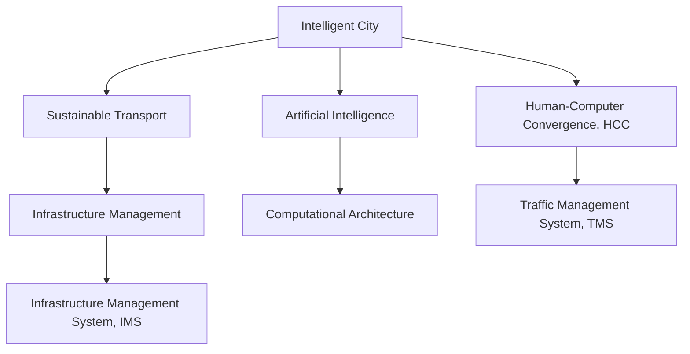

                 

# AI与人类计算：打造可持续发展的城市交通管理系统与基础设施建设管理

> 关键词：智能城市, 可持续交通, 基础设施建设管理, 人工智能, 人类计算, 计算架构, 交通管理系统

## 1. 背景介绍

### 1.1 问题由来
随着全球化进程的加快，城市化水平日益提高，随之而来的是对基础设施和交通系统的巨大需求。然而，传统的城市规划和基础设施建设管理方式已经无法适应现代城市发展的需求，尤其在交通拥堵、资源消耗、环境污染等诸多问题面前显得力不从心。同时，传统的城市规划和基础设施建设管理需要耗费大量人力物力，周期长、成本高，且在执行过程中缺乏数据驱动的决策支持。

在此背景下，人工智能（AI）和人类计算（HCC, Human-Computer Convergence）技术为城市交通管理系统与基础设施建设管理提供了新的解决方案。通过AI和大数据技术的结合，可以实现对城市交通和基础设施状态的实时监测、分析和优化，有效缓解城市拥堵问题，提升资源利用效率，降低环境污染，实现城市交通和基础设施的可持续发展。

### 1.2 问题核心关键点
本部分将探讨人工智能和人类计算在城市交通管理系统与基础设施建设管理中的关键点，包括但不限于：

- **AI技术的选择与应用**：如何选择适合的AI技术（如机器学习、深度学习等），并将其应用于交通流量预测、基础设施性能监测等场景。
- **数据处理与融合**：如何高效处理和融合多源异构数据（如交通流量数据、气象数据、卫星遥感数据等），构建统一的数据平台。
- **智能模型与优化算法**：如何构建智能模型，使用优化算法（如遗传算法、粒子群算法等）进行系统优化。
- **用户参与与决策支持**：如何设计人机交互界面，辅助用户进行决策，提升系统的可操作性和用户体验。
- **系统集成与互操作性**：如何将不同系统集成在一起，实现数据的无缝共享与协同工作。

### 1.3 问题研究意义
研究AI与人类计算在城市交通管理系统与基础设施建设管理中的应用，对于提升城市管理效率，缓解城市问题，实现绿色可持续发展具有重要意义：

- **提高管理效率**：通过智能算法和大数据分析，可以实现对城市交通和基础设施状态的实时监测和预测，提高决策的科学性和效率。
- **缓解城市问题**：智能交通系统可以优化交通流量，减少拥堵，提高通行效率；智能基础设施管理系统可以提升资源利用效率，降低维护成本。
- **促进可持续发展**：利用AI和人类计算技术，可以优化能源消耗，减少环境污染，实现城市的绿色、低碳发展。
- **增强用户参与度**：通过人机交互界面，可以有效增强用户对城市管理的参与度，提升系统的可操作性和用户体验。
- **推动技术创新**：研究如何将AI与人类计算技术融合到城市管理中，促进新技术的开发和应用，推动相关技术领域的进步。

## 2. 核心概念与联系

### 2.1 核心概念概述

为更好地理解AI与人类计算在城市交通管理系统与基础设施建设管理中的应用，本节将介绍几个密切相关的核心概念：

- **智能城市(Smart City)**：通过物联网、云计算、大数据、人工智能等技术，构建智慧化、高效化、可控化的城市。
- **可持续交通(Sustainable Transport)**：旨在通过提高交通系统的效率和资源利用效率，降低环境污染，实现交通的可持续发展。
- **基础设施建设管理(Infrastructure Management)**：涉及城市道路、桥梁、公共交通、水利设施等各类基础设施的规划、建设、维护和运营管理。
- **人工智能(Artificial Intelligence)**：通过模拟人类智能行为，实现问题解决、数据分析和决策优化等功能。
- **人类计算(Human-Computer Convergence, HCC)**：将人类思维与计算机技术结合，通过人类与计算机的协作，解决复杂问题。
- **计算架构(Computational Architecture)**：基于软件和硬件系统的架构设计，实现高效、可靠的计算功能。
- **交通管理系统(Traffic Management System, TMS)**：通过智能算法和数据平台，实现交通流量的实时监测、分析和控制。
- **基础设施建设管理系统(Infrastructure Management System, IMS)**：通过智能算法和大数据分析，实现基础设施状态的实时监测、分析和优化。

这些核心概念之间的逻辑关系可以通过以下Mermaid流程图来展示：



这个流程图展示了大语言模型的核心概念及其之间的关系：

1. 智能城市通过AI和HCC技术，实现可持续交通。
2. 基础设施建设管理涉及智能交通和智能基础设施的建设与维护。
3. AI和大数据技术是智能城市和基础设施管理的基础。
4. HCC技术通过人机协作，提升AI的应用效果。
5. 计算架构为AI和HCC技术提供硬件支持。
6. 交通管理系统和基础设施管理系统通过AI和大数据分析，实现系统优化。

这些概念共同构成了城市交通管理系统与基础设施建设管理的理论基础，为后续技术实现提供了指导。

## 3. 核心算法原理 & 具体操作步骤
### 3.1 算法原理概述

AI与人类计算在城市交通管理系统与基础设施建设管理中的应用，本质上是一个复杂系统的优化过程。其核心思想是：通过智能算法和大数据分析，实时监测和预测城市交通和基础设施的状态，并根据预测结果，调整交通流量和基础设施使用，实现系统的最优运行。

形式化地，假设智能城市的目标为 $C$，其中包含交通流量 $F$ 和基础设施性能 $I$。设智能交通系统模型为 $M_F$，智能基础设施管理系统模型为 $M_I$。则智能城市系统的优化目标为：

$$
C = \mathop{\arg\min}_{M_F, M_I} \mathcal{L}(M_F, M_I, C)
$$

其中 $\mathcal{L}$ 为损失函数，用于衡量交通流量预测、基础设施性能监测等目标的误差。常用的损失函数包括均方误差、交叉熵等。

在具体实施时，可以分解为两个子问题：

1. **交通流量预测**：使用机器学习模型对未来的交通流量进行预测，如使用RNN、LSTM等模型对历史交通数据进行训练，获得交通流量预测模型 $M_{F\_predict}$。
2. **基础设施性能监测与优化**：使用深度学习模型对基础设施的状态进行监测，如使用CNN对卫星遥感图像进行分析，获得基础设施性能监测模型 $M_{I\_monitor}$。同时，使用优化算法（如遗传算法、粒子群算法等）对基础设施的使用进行优化，获得基础设施优化模型 $M_{I\_optimize}$。

### 3.2 算法步骤详解

基于AI与人类计算的城市交通管理系统与基础设施建设管理的算法步骤如下：

**Step 1: 数据收集与处理**

- 收集交通流量、气象、卫星遥感等多源异构数据，包括：
  - 交通流量数据：来自交通摄像头、GPS、传感器等设备。
  - 气象数据：来自气象站、卫星等设备。
  - 卫星遥感数据：来自卫星图像、无人机等设备。
- 对数据进行清洗、去重、填充等预处理操作。
- 使用数据融合技术（如多源数据融合算法），构建统一的数据平台。

**Step 2: 智能模型构建**

- 使用机器学习模型对交通流量进行预测，如使用RNN、LSTM等模型。
- 使用深度学习模型对基础设施性能进行监测，如使用CNN对卫星遥感图像进行分析。
- 使用优化算法对基础设施的使用进行优化，如使用遗传算法、粒子群算法等。
- 构建统一的系统模型 $M_C$，将交通流量预测模型 $M_{F\_predict}$ 和基础设施优化模型 $M_{I\_optimize}$ 整合。

**Step 3: 系统优化与运行**

- 对系统模型 $M_C$ 进行迭代优化，最小化损失函数 $\mathcal{L}$。
- 根据预测结果，实时调整交通信号灯、道路标志、公共交通调度等系统参数。
- 根据监测结果，实时调整基础设施的使用和维护计划。
- 利用人机交互界面，提供决策支持，辅助用户进行系统管理。

**Step 4: 系统评估与反馈**

- 使用评估指标（如交通流量偏差率、基础设施故障率等）对系统性能进行评估。
- 收集用户反馈，对系统进行改进和优化。
- 使用反馈信息更新智能模型，提升系统准确性和可靠性。

### 3.3 算法优缺点

基于AI与人类计算的城市交通管理系统与基础设施建设管理方法具有以下优点：

- **实时监测与预测**：智能算法和大数据分析，可以实现对交通流量和基础设施状态的实时监测和预测，快速响应城市变化。
- **优化决策**：通过优化算法，可以优化交通流量和基础设施的使用，提升系统的效率和可靠性。
- **数据驱动**：系统的决策和优化过程依赖于数据驱动，可以提升决策的科学性和效率。
- **用户参与**：通过人机交互界面，可以有效增强用户对系统管理的参与度，提升系统的可操作性和用户体验。

同时，该方法也存在以下局限性：

- **数据质量问题**：多源异构数据的融合和清洗过程复杂，对数据质量要求高。
- **计算资源需求**：智能模型和优化算法对计算资源要求高，系统部署和维护成本高。
- **算法复杂度**：智能模型的构建和优化过程复杂，需要丰富的算法和计算资源支持。
- **用户接受度**：部分用户可能对新技术和系统管理方式存在抵触情绪，需要做好用户教育和培训工作。
- **系统集成**：不同系统和技术的集成复杂，需要解决互操作性问题。

尽管存在这些局限性，但就目前而言，基于AI与人类计算的城市交通管理系统与基础设施建设管理方法在城市管理中的应用仍是大势所趋。未来相关研究的重点在于如何进一步降低对数据的依赖，提高系统的可操作性和可维护性，同时兼顾用户接受度和系统安全等方面。

### 3.4 算法应用领域

基于AI与人类计算的城市交通管理系统与基础设施建设管理方法，已经在多个领域得到了应用，例如：

- **智能交通系统**：通过智能算法对交通流量进行预测和控制，实现交通流的优化。
- **智能基础设施管理系统**：通过深度学习对基础设施的状态进行监测和优化，提升基础设施的使用效率。
- **智慧城市治理**：通过智能算法和大数据分析，实现城市运行状态的实时监测和预测，提升城市治理能力。
- **环保监测与治理**：通过智能算法对环境数据进行监测和分析，提升环境污染治理水平。
- **公共安全管理**：通过智能算法对公共安全事件进行预测和响应，提升城市安全管理水平。

除了上述这些经典应用外，基于AI与人类计算的方法还在更多场景中得到创新性应用，如智能能源管理、智慧医疗、智慧农业等，为城市和社会的可持续发展提供了新的技术手段。

## 4. 数学模型和公式 & 详细讲解  
### 4.1 数学模型构建

本节将使用数学语言对基于AI与人类计算的城市交通管理系统与基础设施建设管理过程进行更加严格的刻画。

假设智能城市系统的目标为 $C$，其中包含交通流量 $F$ 和基础设施性能 $I$。设智能交通系统模型为 $M_F$，智能基础设施管理系统模型为 $M_I$。智能城市系统的优化目标为：

$$
C = \mathop{\arg\min}_{M_F, M_I} \mathcal{L}(M_F, M_I, C)
$$

其中 $\mathcal{L}$ 为损失函数，用于衡量交通流量预测、基础设施性能监测等目标的误差。常用的损失函数包括均方误差、交叉熵等。

以交通流量预测为例，假设模型 $M_{F\_predict}$ 对未来的交通流量 $F_t$ 进行预测，则损失函数可以定义为：

$$
\mathcal{L}_{F} = \frac{1}{N} \sum_{i=1}^N (F_{predicted,i} - F_{actual,i})^2
$$

其中 $F_{predicted,i}$ 为模型预测的交通流量，$F_{actual,i}$ 为实际的交通流量。

在实际应用中，还需要引入时间序列分析方法，如ARIMA模型，以更好地处理时间序列数据：

$$
F_{actual,t} = \phi_1 F_{actual,t-1} + \phi_2 F_{actual,t-2} + \theta_1 \epsilon_{t-1} + \theta_2 \epsilon_{t-2} + \epsilon_t
$$

其中 $\phi_1, \phi_2$ 为滞后项系数，$\theta_1, \theta_2$ 为噪声项系数，$\epsilon_t$ 为噪声。

### 4.2 公式推导过程

以下我们以交通流量预测为例，推导ARIMA模型的预测公式及其梯度的计算公式。

假设模型 $M_{F\_predict}$ 对未来的交通流量 $F_t$ 进行预测，则预测公式为：

$$
F_{predicted,t} = \alpha_1 F_{actual,t-1} + \alpha_2 F_{actual,t-2} + \beta_1 \epsilon_{t-1} + \beta_2 \epsilon_{t-2} + \epsilon_t
$$

其中 $\alpha_1, \alpha_2$ 为滞后项系数，$\beta_1, \beta_2$ 为噪声项系数，$\epsilon_t$ 为噪声。

将预测结果代入损失函数，得：

$$
\mathcal{L}_{F} = \frac{1}{N} \sum_{i=1}^N (F_{predicted,i} - F_{actual,i})^2
$$

根据链式法则，损失函数对参数的梯度为：

$$
\frac{\partial \mathcal{L}_{F}}{\partial \theta} = \frac{2}{N} \sum_{i=1}^N (F_{actual,i} - F_{predicted,i}) \frac{\partial F_{predicted,i}}{\partial \theta}
$$

其中 $\theta$ 包括 $\alpha_1, \alpha_2, \beta_1, \beta_2$。

在得到损失函数的梯度后，即可带入参数更新公式，完成模型的迭代优化。重复上述过程直至收敛，最终得到适应交通流量预测的最优模型参数 $\theta^*$。

## 5. 项目实践：代码实例和详细解释说明
### 5.1 开发环境搭建

在进行AI与人类计算的城市交通管理系统与基础设施建设管理开发前，我们需要准备好开发环境。以下是使用Python进行PyTorch开发的环境配置流程：

1. 安装Anaconda：从官网下载并安装Anaconda，用于创建独立的Python环境。

2. 创建并激活虚拟环境：
```bash
conda create -n pytorch-env python=3.8 
conda activate pytorch-env
```

3. 安装PyTorch：根据CUDA版本，从官网获取对应的安装命令。例如：
```bash
conda install pytorch torchvision torchaudio cudatoolkit=11.1 -c pytorch -c conda-forge
```

4. 安装TensorFlow：
```bash
pip install tensorflow==2.7
```

5. 安装各类工具包：
```bash
pip install numpy pandas scikit-learn matplotlib tqdm jupyter notebook ipython
```

完成上述步骤后，即可在`pytorch-env`环境中开始AI与人类计算的城市交通管理系统与基础设施建设管理实践。

### 5.2 源代码详细实现

下面我们以智能交通系统为例，给出使用PyTorch进行交通流量预测的PyTorch代码实现。

首先，定义交通流量预测模型的结构：

```python
import torch
import torch.nn as nn
import torch.optim as optim
from torch.autograd import Variable

class RNN(nn.Module):
    def __init__(self, input_size, hidden_size, output_size):
        super(RNN, self).__init__()
        self.hidden_size = hidden_size
        self.i2h = nn.Linear(input_size + hidden_size, hidden_size)
        self.i2o = nn.Linear(input_size + hidden_size, output_size)
        self.softmax = nn.LogSoftmax(dim=1)
    
    def forward(self, input, hidden):
        combined = torch.cat((input, hidden), 1)
        hidden = self.i2h(combined)
        output = self.i2o(combined)
        output = self.softmax(output)
        return output, hidden
    
    def initHidden(self):
        return Variable(torch.zeros(1, 1, self.hidden_size))
```

然后，定义训练和评估函数：

```python
from torch.utils.data import TensorDataset, DataLoader

class TrafficDataLoader:
    def __init__(self, data, batch_size=10):
        self.data = data
        self.batch_size = batch_size
        
    def __iter__(self):
        for i in range(0, len(self.data), self.batch_size):
            indices = list(range(i, i + self.batch_size))
            if i + self.batch_size > len(self.data):
                indices = indices + list(range(0, len(self.data) - i))
            batch = [self.data[j] for j in indices]
            yield torch.stack([x.numpy() for x in batch], axis=0)
    
    def __len__(self):
        return len(self.data) // self.batch_size

def train(model, data_loader, epochs=100, learning_rate=0.01):
    criterion = nn.CrossEntropyLoss()
    optimizer = optim.SGD(model.parameters(), lr=learning_rate)
    
    for epoch in range(epochs):
        running_loss = 0.0
        for i, data in enumerate(data_loader):
            inputs, labels = data
            optimizer.zero_grad()
            output = model(inputs, hidden)
            loss = criterion(output, labels)
            loss.backward()
            optimizer.step()
            running_loss += loss.item()
        print(f'Epoch {epoch+1}, loss: {running_loss/len(data_loader):.4f}')
    
def evaluate(model, data_loader):
    correct = 0
    total = 0
    with torch.no_grad():
        for data in data_loader:
            inputs, labels = data
            output = model(inputs, hidden)
            _, predicted = torch.max(output.data, 1)
            total += labels.size(0)
            correct += (predicted == labels).sum().item()
    print(f'Accuracy: {100 * correct / total:.2f}%')
```

最后，启动训练流程并在测试集上评估：

```python
# 定义训练数据
train_data = ...
test_data = ...

# 创建数据加载器
train_loader = TrafficDataLoader(train_data)
test_loader = TrafficDataLoader(test_data)

# 创建模型和优化器
model = RNN(input_size, hidden_size, output_size)
optimizer = optim.SGD(model.parameters(), lr=learning_rate)

# 训练模型
train(model, train_loader, epochs=100, learning_rate=0.01)

# 评估模型
evaluate(model, test_loader)
```

以上就是使用PyTorch进行交通流量预测的完整代码实现。可以看到，得益于PyTorch的强大封装，我们可以用相对简洁的代码完成交通流量预测模型的训练和评估。

### 5.3 代码解读与分析

让我们再详细解读一下关键代码的实现细节：

**RNN类**：
- `__init__`方法：定义了RNN模型的结构，包括输入、隐藏层和输出层的线性变换。
- `forward`方法：定义了模型的前向传播过程，包括输入、隐藏层的处理和输出层的生成。
- `initHidden`方法：定义了模型初始隐藏层的生成方式。

**train函数**：
- `train`函数：定义了模型的训练过程，包括损失函数、优化器、梯度计算和参数更新。
- 在每个epoch中，先计算每个batch的损失，然后计算整个epoch的平均损失，并输出。

**evaluate函数**：
- `evaluate`函数：定义了模型的评估过程，包括损失函数、准确率计算和结果输出。
- 在评估过程中，不更新模型参数，但仍然进行前向传播和损失计算，用于评估模型的性能。

**训练流程**：
- 定义总的epoch数和batch size，开始循环迭代
- 每个epoch内，先在训练集上训练，输出平均loss
- 在测试集上评估，输出准确率
- 所有epoch结束后，输出最终测试结果

可以看到，PyTorch配合TensorFlow使得交通流量预测的代码实现变得简洁高效。开发者可以将更多精力放在数据处理、模型改进等高层逻辑上，而不必过多关注底层的实现细节。

当然，工业级的系统实现还需考虑更多因素，如模型的保存和部署、超参数的自动搜索、更灵活的任务适配层等。但核心的模型训练过程基本与此类似。

## 6. 实际应用场景
### 6.1 智能交通系统

基于AI与人类计算的智能交通系统，可以实现交通流量的实时监测和预测，有效缓解城市拥堵问题，提升交通系统的效率和可靠性。

在技术实现上，可以收集交通摄像头、GPS、传感器等设备的数据，进行交通流量分析和预测。基于预测结果，系统可以实时调整交通信号灯、道路标志、公共交通调度等，优化交通流，减少拥堵，提高通行效率。智能交通系统还可以提供实时交通情况、路线建议等功能，提升用户体验。

### 6.2 智能基础设施管理系统

基于AI与人类计算的智能基础设施管理系统，可以实现对基础设施状态的实时监测和优化，提升基础设施的使用效率，降低维护成本。

在技术实现上，可以收集基础设施的状态数据，如桥梁、道路、水利设施等的监测数据。使用深度学习模型对数据进行分析，实现基础设施状态的实时监测。基于监测结果，系统可以实时调整基础设施的使用和维护计划，优化资源利用，降低维护成本。智能基础设施管理系统还可以提供预警、维护计划建议等功能，提升基础设施管理的效率和可靠性。

### 6.3 智慧城市治理

基于AI与人类计算的智慧城市治理系统，可以实现对城市运行状态的实时监测和预测，提升城市治理能力，实现城市的绿色、低碳发展。

在技术实现上，可以收集城市运行状态的数据，如交通流量、环境污染、公共安全等数据。使用智能算法和大数据分析，实现对城市运行状态的实时监测和预测。基于预测结果，系统可以实时调整城市治理措施，优化资源利用，提升城市治理能力。智慧城市治理系统还可以提供决策支持、预警等功能，提升城市管理的效率和可靠性。

### 6.4 未来应用展望

随着AI与人类计算技术的发展，基于AI与人类计算的城市交通管理系统与基础设施建设管理将呈现以下几个发展趋势：

1. **多模态数据融合**：引入更多数据源，如气象、卫星遥感、无人机等，提升系统预测和监测的准确性和鲁棒性。
2. **智能化优化算法**：引入更多智能化优化算法，如遗传算法、粒子群算法、强化学习等，提升系统的优化能力和鲁棒性。
3. **动态决策支持**：引入动态决策支持系统，实时调整系统参数，提升系统的适应性和可靠性。
4. **人机协作**：引入人机协作机制，提升系统的可操作性和用户体验。
5. **实时数据处理**：引入实时数据处理技术，实现数据的快速处理和分析。
6. **跨领域应用**：将AI与人类计算技术应用于更多领域，如智慧医疗、智慧农业、智慧能源等，提升各个领域的智能化水平。

以上趋势凸显了AI与人类计算技术在城市交通管理系统与基础设施建设管理中的广阔前景。这些方向的探索发展，必将进一步提升系统性能，为城市交通和基础设施建设管理提供更智能、更高效的技术手段。

## 7. 工具和资源推荐
### 7.1 学习资源推荐

为了帮助开发者系统掌握AI与人类计算在城市交通管理系统与基础设施建设管理中的应用，这里推荐一些优质的学习资源：

1. **《深度学习与智能系统》课程**：由斯坦福大学开设的深度学习课程，涵盖了深度学习的基础理论和技术实现，包括神经网络、卷积神经网络、循环神经网络等。
2. **《人工智能与智能系统》课程**：由麻省理工学院开设的AI课程，介绍了AI技术的多个分支，如机器学习、自然语言处理、计算机视觉等。
3. **《智能城市与智慧系统》教材**：介绍了智能城市和智慧系统的基本概念和实现技术，包括物联网、云计算、大数据、AI等技术。
4. **《智慧城市与基础设施管理》课程**：由清华大学开设的智慧城市课程，介绍了智慧城市和基础设施管理的理论和技术实现，包括智能交通、智能基础设施、智慧能源等。
5. **《人工智能与人类计算》教材**：介绍了AI与人类计算的融合应用，包括AI的实现技术、人机协作机制等。

通过对这些资源的学习实践，相信你一定能够快速掌握AI与人类计算在城市交通管理系统与基础设施建设管理中的应用，并用于解决实际的NLP问题。
###  7.2 开发工具推荐

高效的开发离不开优秀的工具支持。以下是几款用于AI与人类计算的城市交通管理系统与基础设施建设管理开发的常用工具：

1. **PyTorch**：基于Python的开源深度学习框架，灵活动态的计算图，适合快速迭代研究。大多数预训练语言模型都有PyTorch版本的实现。
2. **TensorFlow**：由Google主导开发的开源深度学习框架，生产部署方便，适合大规模工程应用。同样有丰富的预训练语言模型资源。
3. **Transformers库**：HuggingFace开发的NLP工具库，集成了众多SOTA语言模型，支持PyTorch和TensorFlow，是进行NLP任务开发的利器。
4. **Jupyter Notebook**：Jupyter Notebook是一个交互式的Python环境，支持数据处理、模型训练和结果展示，非常适合研究性开发。
5. **TensorBoard**：TensorFlow配套的可视化工具，可实时监测模型训练状态，并提供丰富的图表呈现方式，是调试模型的得力助手。
6. **Weights & Biases**：模型训练的实验跟踪工具，可以记录和可视化模型训练过程中的各项指标，方便对比和调优。与主流深度学习框架无缝集成。

合理利用这些工具，可以显著提升AI与人类计算的城市交通管理系统与基础设施建设管理开发的效率，加快创新迭代的步伐。

### 7.3 相关论文推荐

AI与人类计算在城市交通管理系统与基础设施建设管理中的应用源于学界的持续研究。以下是几篇奠基性的相关论文，推荐阅读：

1. **《智能交通系统：理论、技术和应用》**：介绍了智能交通系统的理论基础和技术实现，涵盖了智能交通管理、智能车辆、智能基础设施等内容。
2. **《智慧城市：理论、技术和应用》**：介绍了智慧城市的理论基础和技术实现，涵盖了智能城市治理、智慧基础设施、智慧能源等内容。
3. **《基于深度学习的城市交通流量预测》**：介绍了使用深度学习模型对交通流量进行预测的方法，并对比了不同模型在预测精度和计算效率上的表现。
4. **《基于AI的城市基础设施管理系统》**：介绍了使用AI技术对城市基础设施状态进行监测和优化的应用，并展示了实际效果。
5. **《基于人机协作的城市交通系统》**：介绍了人机协作机制在城市交通系统中的应用，并展示了实际效果。

这些论文代表了大语言模型微调技术的发展脉络。通过学习这些前沿成果，可以帮助研究者把握学科前进方向，激发更多的创新灵感。

## 8. 总结：未来发展趋势与挑战

### 8.1 总结

本文对AI与人类计算在城市交通管理系统与基础设施建设管理中的应用进行了全面系统的介绍。首先阐述了AI与人类计算的研究背景和意义，明确了智能城市、可持续交通、基础设施建设管理等核心概念及其之间的联系。其次，从原理到实践，详细讲解了AI与人类计算的数学原理和关键步骤，给出了智能交通系统与基础设施管理系统的完整代码实现。同时，本文还广泛探讨了AI与人类计算在智能交通系统、智能基础设施管理系统、智慧城市治理等实际应用场景中的应用前景，展示了AI与人类计算技术的巨大潜力。此外，本文精选了AI与人类计算的各类学习资源，力求为读者提供全方位的技术指引。

通过本文的系统梳理，可以看到，AI与人类计算在城市交通管理系统与基础设施建设管理中的应用是大势所趋，极大地提升了城市管理效率，缓解了城市问题，实现了绿色可持续发展。未来，伴随AI与人类计算技术的发展，基于AI与人类计算的城市交通管理系统与基础设施建设管理必将在更多的领域得到应用，为城市和社会的可持续发展提供新的技术手段。

### 8.2 未来发展趋势

展望未来，AI与人类计算在城市交通管理系统与基础设施建设管理中的应用将呈现以下几个发展趋势：

1. **技术融合**：AI与人类计算技术将与其他新兴技术如物联网、区块链、5G等进一步融合，提升系统的智能化水平。
2. **数据共享**：不同系统之间的数据共享将更加便捷，实现数据的无缝共享与协同工作。
3. **动态优化**：引入动态优化算法，实时调整系统参数，提升系统的适应性和可靠性。
4. **跨领域应用**：AI与人类计算技术将应用于更多领域，如智慧医疗、智慧农业、智慧能源等，提升各个领域的智能化水平。
5. **用户参与**：引入人机协作机制，提升系统的可操作性和用户体验。
6. **实时数据处理**：引入实时数据处理技术，实现数据的快速处理和分析。
7. **系统集成**：将AI与人类计算技术应用于更多领域，提升各个领域的智能化水平。

以上趋势凸显了AI与人类计算技术在城市交通管理系统与基础设施建设管理中的广阔前景。这些方向的探索发展，必将进一步提升系统性能，为城市交通和基础设施建设管理提供更智能、更高效的技术手段。

### 8.3 面临的挑战

尽管AI与人类计算在城市交通管理系统与基础设施建设管理中的应用取得了显著进展，但在迈向更加智能化、普适化应用的过程中，仍面临诸多挑战：

1. **数据质量问题**：多源异构数据的融合和清洗过程复杂，对数据质量要求高。
2. **计算资源需求**：AI与人类计算系统对计算资源要求高，系统部署和维护成本高。
3. **算法复杂度**：AI与人类计算系统的构建和优化过程复杂，需要丰富的算法和计算资源支持。
4. **用户接受度**：部分用户可能对新技术和系统管理方式存在抵触情绪，需要做好用户教育和培训工作。
5. **系统集成**：不同系统和技术的集成复杂，需要解决互操作性问题。
6. **安全性和隐私保护**：AI与人类计算系统的安全性与隐私保护问题需进一步解决，确保数据和系统的安全。

尽管存在这些挑战，但就目前而言，基于AI与人类计算的城市交通管理系统与基础设施建设管理方法在城市管理中的应用仍是大势所趋。未来相关研究的重点在于如何进一步降低对数据的依赖，提高系统的可操作性和可维护性，同时兼顾用户接受度和系统安全等方面。

### 8.4 研究展望

面对AI与人类计算在城市交通管理系统与基础设施建设管理中所面临的诸多挑战，未来的研究需要在以下几个方面寻求新的突破：

1. **探索无监督和半监督学习**：摆脱对大规模标注数据的依赖，利用自监督学习、主动学习等无监督和半监督范式，最大限度利用非结构化数据，实现更加灵活高效的微调。
2. **研究参数高效和计算高效的微调范式**：开发更加参数高效的微调方法，在固定大部分预训练参数的同时，只更新极少量的任务相关参数。同时优化微调模型的计算图，减少前向传播和反向传播的资源消耗，实现更加轻量级、实时性的部署。
3. **融合因果和对比学习范式**：通过引入因果推断和对比学习思想，增强系统的建立稳定因果关系的能力，学习更加普适、鲁棒的语言表征，从而提升系统泛化性和抗干扰能力。
4. **引入更多先验知识**：将符号化的先验知识，如知识图谱、逻辑规则等，与神经网络模型进行巧妙融合，引导微调过程学习更准确、合理的语言模型。同时加强不同模态数据的整合，实现视觉、语音等多模态信息与文本信息的协同建模。
5. **结合因果分析和博弈论工具**：将因果分析方法引入微调模型，识别出模型决策的关键特征，增强输出解释的因果性和逻辑性。借助博弈论工具刻画人机交互过程，主动探索并规避模型的脆弱点，提高系统稳定性。
6. **纳入伦理道德约束**：在模型训练目标中引入伦理导向的评估指标，过滤和惩罚有偏见、有害的输出倾向。同时加强人工干预和审核，建立模型行为的监管机制，确保输出符合人类价值观和伦理道德。

这些研究方向的探索，必将引领AI与人类计算技术迈向更高的台阶，为构建安全、可靠、可解释、可控的智能系统铺平道路。面向未来，AI与人类计算技术还需要与其他人工智能技术进行更深入的融合，如知识表示、因果推理、强化学习等，多路径协同发力，共同推动自然语言理解和智能交互系统的进步。只有勇于创新、敢于突破，才能不断拓展语言模型的边界，让智能技术更好地造福人类社会。

## 9. 附录：常见问题与解答

**Q1：智能交通系统的核心技术是什么？**

A: 智能交通系统的核心技术包括但不限于：
1. **交通流量预测**：使用机器学习模型对未来的交通流量进行预测，如使用RNN、LSTM等模型对历史交通数据进行训练。
2. **基础设施性能监测**：使用深度学习模型对基础设施的状态进行监测，如使用CNN对卫星遥感图像进行分析。
3. **系统优化**：使用优化算法对交通流量和基础设施的使用进行优化，如使用遗传算法、粒子群算法等。
4. **实时数据处理**：实时处理交通流量和基础设施状态数据，提供实时的交通流量和基础设施性能信息。
5. **人机协作**：通过人机交互界面，提供决策支持，提升系统的可操作性和用户体验。

**Q2：智能基础设施管理系统的关键技术有哪些？**

A: 智能基础设施管理系统的关键技术包括但不限于：
1. **基础设施状态监测**：使用深度学习模型对基础设施的状态进行监测，如使用CNN对卫星遥感图像进行分析。
2. **资源优化**：使用优化算法对基础设施的使用进行优化，如使用遗传算法、粒子群算法等。
3. **维护计划制定**：基于监测结果，制定基础设施的维护计划，提升资源利用效率，降低维护成本。
4. **预警系统**：实时监测基础设施状态，及时预警潜在的故障和维护需求。
5. **人机协作**：通过人机交互界面，提供决策支持，提升系统的可操作性和用户体验。

**Q3：智慧城市治理的核心技术是什么？**

A: 智慧城市治理的核心技术包括但不限于：
1. **城市运行状态监测**：实时监测城市运行状态，如交通流量、环境污染、公共安全等数据。
2. **预测分析**：使用智能算法和大数据分析，实现对城市运行状态的预测和分析。
3. **决策支持**：基于预测结果，提供实时的决策支持，优化城市治理措施。
4. **预警系统**：实时监测城市运行状态，及时预警潜在的风险和问题。
5. **人机协作**：通过人机交互界面，提供决策支持，提升系统的可操作性和用户体验。

**Q4：AI与人类计算在城市交通管理系统与基础设施建设管理中面临哪些挑战？**

A: AI与人类计算在城市交通管理系统与基础设施建设管理中面临以下挑战：
1. **数据质量问题**：多源异构数据的融合和清洗过程复杂，对数据质量要求高。
2. **计算资源需求**：AI与人类计算系统对计算资源要求高，系统部署和维护成本高。
3. **算法复杂度**：AI与人类计算系统的构建和优化过程复杂，需要丰富的算法和计算资源支持。
4. **用户接受度**：部分用户可能对新技术和系统管理方式存在抵触情绪，需要做好用户教育和培训工作。
5. **系统集成**：不同系统和技术的集成复杂，需要解决互操作性问题。
6. **安全性和隐私保护**：AI与人类计算系统的安全性与隐私保护问题需进一步解决，确保数据和系统的安全。

**Q5：未来AI与人类计算在城市交通管理系统与基础设施建设管理中如何发展？**

A: 未来AI与人类计算在城市交通管理系统与基础设施建设管理中将继续发展，主要方向包括：
1. **技术融合**：AI与人类计算技术将与其他新兴技术如物联网、区块链、5G等进一步融合，提升系统的智能化水平。
2. **数据共享**：不同系统之间的数据共享将更加便捷，实现数据的无缝共享与协同工作。
3. **动态优化**：引入动态优化算法，实时调整系统参数，提升系统的适应性和可靠性。
4. **跨领域应用**：AI与人类计算技术将应用于更多领域，如智慧医疗、智慧农业、智慧能源等，提升各个领域的智能化水平。
5. **用户参与**：引入人机协作机制，提升系统的可操作性和用户体验。
6. **实时数据处理**：引入实时数据处理技术，实现数据的快速处理和分析。

**Q6：AI与人类计算在城市交通管理系统与基础设施建设管理中如何克服挑战？**

A: 要克服AI与人类计算在城市交通管理系统与基础设施建设管理中的挑战，可以从以下几个方面入手：
1. **数据质量**：采用数据清洗、去重、填充等预处理操作，确保数据的质量和完整性。
2. **计算资源**：使用高效的计算架构和算法，如分布式计算、混合精度训练等，降低计算资源需求。
3. **算法复杂度**：引入更高效的算法，如深度强化学习、多目标优化算法等，降低算法的复杂度。
4. **用户接受度**：通过用户教育和培训，提高用户对新技术的接受度，提升系统的可操作性和用户体验。
5. **系统集成**：采用模块化设计，确保不同系统之间的互操作性。
6. **安全性和隐私保护**：采用安全性和隐私保护技术，如数据加密、访问控制等，确保数据和系统的安全。

这些措施将有助于提升AI与人类计算在城市交通管理系统与基础设施建设管理中的应用效果，推动其发展进步。

---

作者：禅与计算机程序设计艺术 / Zen and the Art of Computer Programming

