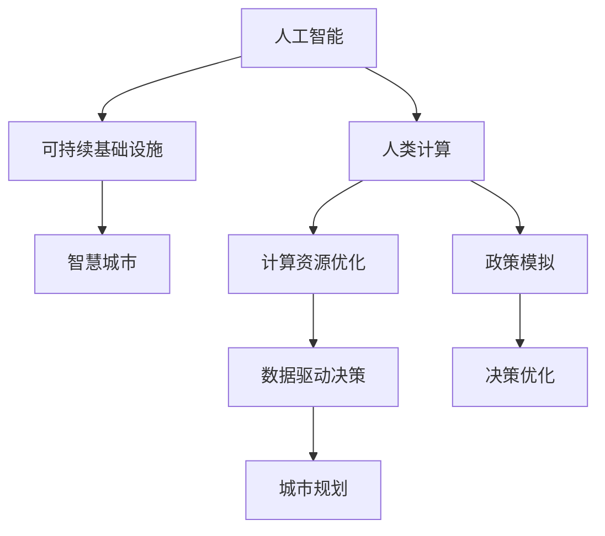

                 

# AI与人类计算：打造可持续发展的城市基础设施与规划

> 关键词：人工智能,人类计算,可持续基础设施,智慧城市,计算资源优化,数据驱动决策,城市规划,政策模拟

## 1. 背景介绍

随着人工智能(AI)技术的迅猛发展，人类社会正经历着一场前所未有的变革。从医疗、金融、交通到教育、娱乐等各个领域，AI正在逐步替代人类进行一些高强度、高重复性的工作，释放人类的创造力和生产力。特别是，在城市基础设施和规划领域，AI技术的应用为城市管理带来了革命性的变化。

城市基础设施和规划是现代城市可持续发展的重要基石。传统的城市规划依靠人工经验进行，耗时长、成本高，且容易受到主观偏见的影响。而现代城市规划则通过引入AI技术，实现数据驱动、智能决策，极大地提升了规划效率和质量。

## 2. 核心概念与联系

### 2.1 核心概念概述

要理解AI与人类计算在城市基础设施与规划中的应用，我们需要先了解以下核心概念：

- **人工智能(AI)**：使用机器学习和数据分析技术，模拟人类智能进行决策和执行的任务。
- **人类计算(Human-in-the-Loop, HiL)**：结合AI技术与人类智能，由人类进行关键决策和监督，以提高AI系统的准确性和可靠性。
- **可持续基础设施(Sustainable Infrastructure)**：通过合理规划和管理，保证城市基础设施的绿色、高效、可再生，以支持长期的社会经济发展。
- **智慧城市(Smart City)**：通过物联网、大数据、AI等技术，实现城市各个方面的智能化管理，提升居民的生活质量。
- **计算资源优化(Computational Resource Optimization)**：通过AI技术，优化计算资源的分配和管理，降低城市运营成本，提高资源利用效率。
- **数据驱动决策(Data-Driven Decision Making)**：以数据为基础，通过AI技术辅助决策，提升决策的科学性和有效性。

这些核心概念之间的关系可以通过以下Mermaid流程图来展示：



这个流程图展示了AI、人类计算在城市基础设施与规划中的应用路径：通过数据驱动决策和计算资源优化，AI与人类计算共同参与到城市规划和政策模拟中，最终优化决策并推动可持续基础设施的建设。

## 3. 核心算法原理 & 具体操作步骤
### 3.1 算法原理概述

基于AI与人类计算的城市基础设施与规划方法，其核心思想是通过数据驱动的计算模型，辅助人类进行关键决策。具体流程如下：

1. **数据收集与处理**：收集城市基础设施相关的数据，如交通流量、能源消耗、环境污染等，进行清洗和预处理。
2. **建模与优化**：利用AI技术，构建城市基础设施的计算模型，优化资源分配和调度。
3. **人类监督与反馈**：在模型运行过程中，引入人类专家进行监督和反馈，调整模型参数和优化策略。
4. **政策模拟与评估**：根据模型输出，进行政策模拟，评估不同策略对城市基础设施的影响。
5. **决策与实施**：基于模拟结果，制定优化策略，并进行实施和监测。

### 3.2 算法步骤详解

下面是基于AI与人类计算的城市基础设施规划的具体步骤：

**Step 1: 数据收集与处理**
- **收集数据**：从城市运营系统、物联网设备、传感器等渠道，收集城市基础设施相关数据。
- **数据清洗**：清洗缺失值、异常值，进行标准化处理，确保数据质量。
- **特征工程**：选择关键特征，提取有用的信息，增强数据表征能力。

**Step 2: 建模与优化**
- **选择模型**：根据规划任务，选择合适的AI模型，如回归模型、分类模型、聚类模型等。
- **训练模型**：使用训练集数据，训练优化后的模型。
- **模型验证**：使用验证集数据，评估模型性能，调整超参数。
- **模型部署**：将模型部署到城市基础设施管理平台，进行实时计算和预测。

**Step 3: 人类监督与反馈**
- **引入专家**：邀请城市规划专家、交通工程师、环境科学家等，参与模型监督和反馈。
- **反馈机制**：建立反馈渠道，及时收集专家意见和建议。
- **参数调整**：根据专家反馈，调整模型参数和优化策略，确保模型决策的合理性。

**Step 4: 政策模拟与评估**
- **政策设计**：设计多套政策方案，如交通管制、能源调控、环境治理等。
- **模拟评估**：利用模型对政策方案进行模拟评估，预测其对城市基础设施的影响。
- **结果分析**：分析模拟结果，评估政策方案的优劣，选择最佳方案。

**Step 5: 决策与实施**
- **制定策略**：根据模拟评估结果，制定优化策略。
- **实施方案**：组织资源，实施优化策略。
- **监测与调整**：实时监测实施效果，根据反馈进行策略调整。

### 3.3 算法优缺点

**优点**
- **高效性**：通过数据驱动的AI模型，大幅提升规划效率和决策速度。
- **科学性**：数据驱动的决策，提高了决策的科学性和准确性。
- **可扩展性**：AI模型具有良好的可扩展性，能处理大量复杂的城市基础设施数据。
- **智能化**：结合人类计算，提升AI系统的可靠性和鲁棒性。

**缺点**
- **数据依赖**：模型的性能高度依赖于数据的质量和多样性，数据不足或偏差可能影响模型效果。
- **模型复杂性**：复杂的城市基础设施系统，需要构建多层次、多领域的模型。
- **专家依赖**：人类专家的参与增加了规划的复杂度和成本。
- **解释性不足**：AI模型的决策过程缺乏可解释性，可能影响决策的透明度和可信度。

### 3.4 算法应用领域

基于AI与人类计算的城市基础设施与规划方法，已经在多个领域得到了广泛应用，例如：

- **交通系统优化**：利用AI模型优化交通流量、路线规划、公交调度等。
- **能源管理**：通过AI模型优化能源消耗、分布式发电、储能调度等。
- **环境保护**：利用AI模型监测污染源、优化垃圾处理、管理水资源等。
- **应急响应**：通过AI模型预测自然灾害、优化应急资源调度等。
- **公共设施规划**：利用AI模型规划公园、绿地、公共建筑等城市设施。

这些应用案例展示了AI与人类计算在城市基础设施与规划中的巨大潜力。随着技术的不断进步，未来将有更多创新应用涌现，进一步提升城市的可持续发展水平。

## 4. 数学模型和公式 & 详细讲解 & 举例说明
### 4.1 数学模型构建

构建基于AI与人类计算的城市基础设施规划模型，主要涉及以下数学模型：

- **回归模型**：用于预测城市基础设施的某些指标，如交通流量、能源消耗等。
- **分类模型**：用于分类和识别城市基础设施的不同类型，如道路、桥梁、绿地等。
- **聚类模型**：用于对城市基础设施进行分类和分组，识别相似的基础设施组。

### 4.2 公式推导过程

以交通流量预测模型为例，其数学模型可表示为：

$$ y = f(x; \theta) + \epsilon $$

其中：
- $y$：预测的交通流量。
- $x$：输入特征，如时间、天气、交通管制等。
- $f(x; \theta)$：回归函数，使用线性回归、多项式回归等。
- $\epsilon$：误差项，描述数据噪声和模型不精确度。

回归函数的参数 $\theta$ 需要通过数据进行训练和优化。优化目标最小化均方误差（MSE）或均方根误差（RMSE）：

$$ \hat{\theta} = \arg\min_{\theta} \frac{1}{N}\sum_{i=1}^{N} (y_i - f(x_i; \theta))^2 $$

通过梯度下降等优化算法，求得最优参数 $\hat{\theta}$，进行模型预测。

### 4.3 案例分析与讲解

**案例：城市交通流量预测**

**数据收集**：收集历史交通流量数据，包括时间、日期、路段、交通管制等特征。
**模型训练**：使用线性回归模型，训练预测城市交通流量。
**模型验证**：使用验证集数据，评估模型性能，调整参数。
**结果分析**：根据模型输出，进行交通流量预测，优化交通管制策略。

## 5. 项目实践：代码实例和详细解释说明
### 5.1 开发环境搭建

在进行AI与人类计算的城市基础设施规划项目实践前，我们需要准备好开发环境。以下是使用Python进行TensorFlow开发的环境配置流程：

1. 安装Anaconda：从官网下载并安装Anaconda，用于创建独立的Python环境。

2. 创建并激活虚拟环境：
```bash
conda create -n tf-env python=3.7 
conda activate tf-env
```

3. 安装TensorFlow：根据CUDA版本，从官网获取对应的安装命令。例如：
```bash
conda install tensorflow tensorflow-gpu=2.5 -c conda-forge
```

4. 安装必要的工具包：
```bash
pip install numpy pandas scikit-learn matplotlib tensorflow-hub
```

完成上述步骤后，即可在`tf-env`环境中开始AI与人类计算的城市基础设施规划的开发。

### 5.2 源代码详细实现

以下是基于TensorFlow进行城市交通流量预测的PyTorch代码实现。

```python
import tensorflow as tf
from tensorflow.keras import layers
from tensorflow.keras.models import Sequential
from tensorflow.keras.optimizers import Adam

# 数据预处理
train_data = ...
train_labels = ...

test_data = ...
test_labels = ...

# 定义模型
model = Sequential([
    layers.Dense(64, activation='relu', input_shape=(input_dim,)),
    layers.Dense(64, activation='relu'),
    layers.Dense(1)
])

# 编译模型
model.compile(optimizer=Adam(learning_rate=0.001),
              loss='mse', metrics=['mae'])

# 训练模型
model.fit(train_data, train_labels, epochs=100, validation_data=(test_data, test_labels))

# 评估模型
test_loss = model.evaluate(test_data, test_labels)[0]
print(f'Test MSE: {test_loss:.2f}')
```

### 5.3 代码解读与分析

让我们再详细解读一下关键代码的实现细节：

**数据预处理**：
- 加载训练数据和标签，进行归一化处理。
- 加载测试数据和标签，进行同样处理。

**模型定义**：
- 定义一个多层感知器模型，包含两个隐藏层和一个输出层。
- 使用ReLU激活函数。

**模型编译**：
- 编译模型，设置优化器、损失函数和评价指标。

**模型训练**：
- 使用训练集数据，训练模型。
- 每个epoch在验证集上进行一次评估。
- 设置100个epoch。

**模型评估**：
- 在测试集上评估模型性能，输出均方误差。

## 6. 实际应用场景
### 6.1 智能交通系统

智能交通系统是AI与人类计算在城市基础设施中的应用典型案例。通过AI模型，交通流量预测、路线规划、公交调度等都实现了智能化管理，极大地提升了交通效率和安全性。

**数据收集**：从交通摄像头、传感器、公交系统等设备中，收集实时交通数据。
**模型训练**：利用历史交通数据，训练交通流量预测模型。
**模型部署**：将模型部署到交通管理中心，实时计算和预测。
**决策优化**：根据模型输出，优化交通管制策略，提升道路通行效率。

### 6.2 绿色能源管理

绿色能源管理是城市基础设施与规划中的另一个重要方向。通过AI模型，可以优化能源消耗、分布式发电、储能调度等，实现节能减排和能源结构优化。

**数据收集**：收集城市能源使用数据，包括用电、用气、用热等。
**模型训练**：利用历史能源数据，训练能源消耗预测模型。
**模型部署**：将模型部署到能源管理中心，实时计算和预测。
**决策优化**：根据模型输出，优化能源调度策略，提升能源利用效率。

### 6.3 环境监测与治理

城市环境监测与治理是AI与人类计算在城市基础设施中的重要应用。通过AI模型，可以实时监测污染源、优化垃圾处理、管理水资源等，提升环境治理水平。

**数据收集**：从环境监测设备、气象站、污水厂等渠道，收集实时环境数据。
**模型训练**：利用历史环境数据，训练环境污染预测模型。
**模型部署**：将模型部署到环境管理中心，实时计算和预测。
**决策优化**：根据模型输出，优化污染治理策略，提升环境质量。

### 6.4 未来应用展望

随着AI技术的不断进步，AI与人类计算在城市基础设施与规划中的应用将更加广泛和深入。未来将有以下发展趋势：

1. **多模态融合**：融合图像、语音、文本等多种模态数据，构建更加全面和精准的模型。
2. **边缘计算**：在城市基础设施中引入边缘计算技术，实现实时数据处理和分析。
3. **联邦学习**：通过联邦学习技术，保护数据隐私，实现跨区域、跨机构的数据协同。
4. **自适应模型**：构建自适应模型，动态调整模型参数，应对环境变化。
5. **智慧城市平台**：建设智慧城市平台，整合各类城市数据，实现城市管理的智能化。
6. **政策优化**：利用AI模型进行政策模拟和优化，提升城市管理决策的科学性。

这些趋势将进一步提升城市基础设施的智能化水平，为可持续发展注入新的动力。

## 7. 工具和资源推荐
### 7.1 学习资源推荐

为了帮助开发者系统掌握AI与人类计算在城市基础设施与规划中的应用，这里推荐一些优质的学习资源：

1. **《深度学习在城市规划中的应用》系列博文**：由城市规划专家撰写，介绍深度学习在城市基础设施与规划中的实际应用。
2. **Coursera《深度学习在城市规划中的实践》课程**：斯坦福大学开设的深度学习在城市规划中的应用课程，涵盖AI在交通、能源、环境等多个领域的应用。
3. **《AI城市规划》书籍**：介绍AI在城市规划中的基础理论和技术实现。
4. **HuggingFace官方文档**：TensorFlow的官方文档，提供海量预训练模型和完整的代码样例，是上手实践的必备资料。
5. **GitHub上的智能城市项目**：众多智能城市项目的开源代码，包含AI与人类计算在城市基础设施中的应用案例。

通过对这些资源的学习实践，相信你一定能够快速掌握AI与人类计算在城市基础设施与规划中的应用精髓，并用于解决实际的NLP问题。

### 7.2 开发工具推荐

高效的开发离不开优秀的工具支持。以下是几款用于AI与人类计算的城市基础设施与规划开发的常用工具：

1. **TensorFlow**：由Google主导开发的开源深度学习框架，生产部署方便，适合大规模工程应用。
2. **PyTorch**：基于Python的开源深度学习框架，灵活动态的计算图，适合快速迭代研究。
3. **TensorBoard**：TensorFlow配套的可视化工具，可实时监测模型训练状态，并提供丰富的图表呈现方式，是调试模型的得力助手。
4. **Jupyter Notebook**：交互式的开发环境，适合进行模型训练和调试。
5. **Weights & Biases**：模型训练的实验跟踪工具，可以记录和可视化模型训练过程中的各项指标，方便对比和调优。

合理利用这些工具，可以显著提升AI与人类计算在城市基础设施与规划任务的开发效率，加快创新迭代的步伐。

### 7.3 相关论文推荐

AI与人类计算在城市基础设施与规划领域的发展，离不开学界的持续研究。以下是几篇奠基性的相关论文，推荐阅读：

1. **《基于深度学习的城市交通流量预测》**：介绍深度学习在城市交通流量预测中的应用。
2. **《智能城市中的AI模型》**：讨论AI模型在智能城市中的具体应用案例。
3. **《联邦学习在城市能源管理中的应用》**：介绍联邦学习在分布式能源管理中的应用。
4. **《利用AI模型进行城市环境监测与治理》**：讨论AI模型在城市环境监测与治理中的应用。
5. **《智慧城市中的计算资源优化》**：介绍AI技术在智慧城市计算资源优化中的应用。

这些论文代表了大模型微调技术的发展脉络。通过学习这些前沿成果，可以帮助研究者把握学科前进方向，激发更多的创新灵感。

## 8. 总结：未来发展趋势与挑战
### 8.1 总结

本文对基于AI与人类计算的城市基础设施与规划方法进行了全面系统的介绍。首先阐述了AI与人类计算在城市基础设施与规划中的应用背景和意义，明确了AI在提升城市管理效率和决策科学性方面的独特价值。其次，从原理到实践，详细讲解了AI与人类计算的数学原理和关键步骤，给出了AI与人类计算在城市基础设施与规划中的应用实例。同时，本文还广泛探讨了AI与人类计算在智能交通、绿色能源、环境监测等各个领域的应用前景，展示了AI与人类计算的巨大潜力。此外，本文精选了AI与人类计算的相关学习资源，力求为读者提供全方位的技术指引。

通过本文的系统梳理，可以看到，AI与人类计算在城市基础设施与规划中的应用正在逐渐成为现实，为城市管理带来了革命性的变化。未来，伴随AI技术的不断进步，AI与人类计算必将在更多的城市管理领域发挥更大作用，推动城市向着更加智能化、可持续化的方向发展。

### 8.2 未来发展趋势

展望未来，AI与人类计算在城市基础设施与规划中的应用将呈现以下几个发展趋势：

1. **多模态数据融合**：融合图像、语音、文本等多种模态数据，构建更加全面和精准的模型。
2. **实时计算与边缘计算**：引入实时计算和边缘计算技术，实现数据实时处理和分析。
3. **联邦学习与分布式协作**：利用联邦学习技术，保护数据隐私，实现跨区域、跨机构的数据协同。
4. **自适应模型与动态优化**：构建自适应模型，动态调整模型参数，应对环境变化。
5. **智慧城市平台与统一管理**：建设智慧城市平台，整合各类城市数据，实现城市管理的智能化。
6. **政策优化与模拟评估**：利用AI模型进行政策模拟和优化，提升城市管理决策的科学性。

这些趋势将进一步提升城市基础设施的智能化水平，为可持续发展注入新的动力。

### 8.3 面临的挑战

尽管AI与人类计算在城市基础设施与规划中的应用已经取得了显著成果，但在迈向更加智能化、普适化应用的过程中，它仍面临着诸多挑战：

1. **数据依赖**：模型的性能高度依赖于数据的质量和多样性，数据不足或偏差可能影响模型效果。
2. **模型复杂性**：复杂的城市基础设施系统，需要构建多层次、多领域的模型。
3. **专家依赖**：人类专家的参与增加了规划的复杂度和成本。
4. **解释性不足**：AI模型的决策过程缺乏可解释性，可能影响决策的透明度和可信度。
5. **安全性问题**：AI模型可能学习到有害信息和偏见，影响城市基础设施的公平性和安全性。

### 8.4 研究展望

面对AI与人类计算在城市基础设施与规划中面临的挑战，未来的研究需要在以下几个方面寻求新的突破：

1. **多模态数据融合**：开发更多多模态数据融合技术，提升模型对各类数据的处理能力。
2. **自适应与动态优化**：构建自适应模型，动态调整模型参数，应对环境变化。
3. **联邦学习与分布式协作**：研究联邦学习技术，保护数据隐私，实现跨区域、跨机构的数据协同。
4. **模型解释性与可信度**：开发可解释性AI模型，增强决策的透明度和可信度。
5. **政策模拟与优化**：利用AI模型进行政策模拟和优化，提升城市管理决策的科学性。

这些研究方向的探索，必将引领AI与人类计算在城市基础设施与规划领域迈向更高的台阶，为构建安全、可靠、可解释、可控的智能系统铺平道路。面向未来，AI与人类计算技术还需要与其他人工智能技术进行更深入的融合，如知识表示、因果推理、强化学习等，多路径协同发力，共同推动城市管理的进步。只有勇于创新、敢于突破，才能不断拓展城市基础设施的边界，让智能技术更好地造福人类社会。

## 9. 附录：常见问题与解答

**Q1：AI与人类计算在城市基础设施与规划中的应用，与传统方法相比有哪些优势？**

A: AI与人类计算在城市基础设施与规划中的应用，具有以下优势：
1. **高效性**：通过数据驱动的AI模型，大幅提升规划效率和决策速度。
2. **科学性**：数据驱动的决策，提高了决策的科学性和准确性。
3. **可扩展性**：AI模型具有良好的可扩展性，能处理大量复杂的城市基础设施数据。
4. **智能化**：结合人类计算，提升AI系统的可靠性和鲁棒性。

**Q2：在AI与人类计算的城市基础设施与规划中，如何选择合适的AI模型？**

A: 选择AI模型时，需要考虑以下几个因素：
1. **任务类型**：根据城市基础设施规划任务的类型，选择适合的AI模型，如回归模型、分类模型、聚类模型等。
2. **数据特性**：根据数据的特点，选择适合的模型架构，如深度神经网络、卷积神经网络等。
3. **计算资源**：根据计算资源的条件，选择适合的模型大小和结构，避免过度复杂和资源消耗过大。
4. **模型复杂性**：根据模型的复杂性，选择适合的模型训练和优化策略，确保模型效果。

**Q3：AI与人类计算的城市基础设施与规划，如何保护数据隐私和安全？**

A: 保护数据隐私和安全，是AI与人类计算在城市基础设施与规划中的重要课题。以下是一些常见的措施：
1. **数据匿名化**：通过数据匿名化技术，保护个人隐私。
2. **联邦学习**：利用联邦学习技术，在保护数据隐私的前提下，实现跨机构的数据协同。
3. **加密传输**：在数据传输过程中，使用加密技术保护数据安全。
4. **访问控制**：建立严格的访问控制机制，限制数据访问权限。
5. **安全审计**：定期进行安全审计，发现和修复潜在的安全漏洞。

这些措施可以有效保护数据隐私和安全，确保AI与人类计算在城市基础设施与规划中的应用。

**Q4：AI与人类计算的城市基础设施与规划，未来将有哪些新的应用方向？**

A: AI与人类计算在城市基础设施与规划中的应用方向正在不断扩展，未来将有更多创新应用涌现，例如：
1. **智能交通系统**：利用AI模型优化交通流量、路线规划、公交调度等。
2. **绿色能源管理**：通过AI模型优化能源消耗、分布式发电、储能调度等，实现节能减排和能源结构优化。
3. **环境监测与治理**：利用AI模型监测污染源、优化垃圾处理、管理水资源等，提升环境治理水平。
4. **智慧城市平台**：建设智慧城市平台，整合各类城市数据，实现城市管理的智能化。
5. **政策模拟与优化**：利用AI模型进行政策模拟和优化，提升城市管理决策的科学性。
6. **多模态数据融合**：融合图像、语音、文本等多种模态数据，构建更加全面和精准的模型。

这些新的应用方向将进一步提升城市基础设施的智能化水平，为可持续发展注入新的动力。

---

作者：禅与计算机程序设计艺术 / Zen and the Art of Computer Programming

