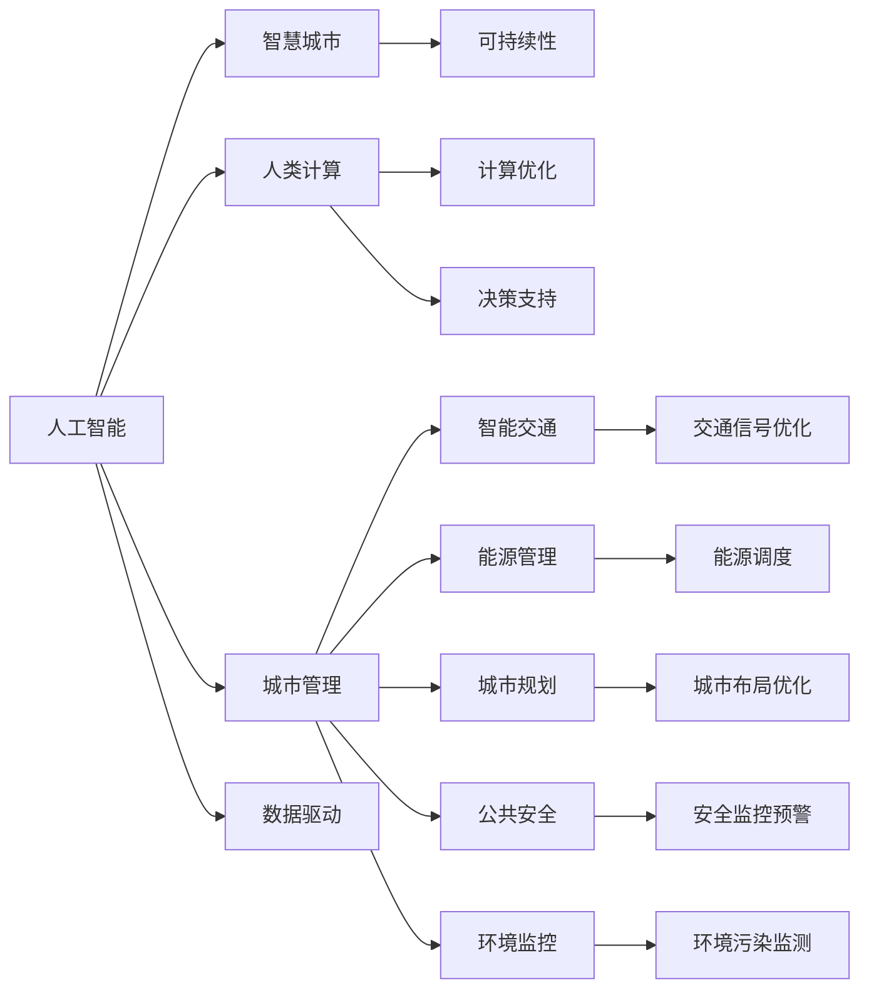

                 

## 1. 背景介绍

随着科技的迅猛发展，AI在城市管理中的应用已经成为推动可持续城市发展的重要引擎。从智慧交通、能源管理到城市规划，AI在提升城市效率、节约资源、改善生活环境方面展现出了巨大潜力。本文旨在探讨AI与人类计算如何共同打造可持续发展的城市生活方式与交通管理，为相关领域的从业者提供有益的参考。

## 2. 核心概念与联系

### 2.1 核心概念概述

**人工智能（AI）**: 指通过计算机技术模拟、扩展人类智能的领域。涵盖感知、学习、推理、规划等多个子领域。

**城市管理**: 涉及城市规划、交通、公共安全、能源、环境等多方面，旨在实现高效、有序、环保的城市运营。

**可持续性**: 指在满足当代需求的同时，不损害后代满足其需求的能力。可持续性是城市管理的重要目标。

**智慧城市**: 通过集成物联网、大数据、AI等技术，使城市具备智能化、数字化、自动化特性，以实现更高效、更环保的城市运营。

**人类计算**: 指人类利用计算机技术辅助进行复杂计算、数据分析、决策支持的过程。强调人类在计算中的主导地位，而不是完全依赖机器。

这些概念之间有着紧密的联系：AI作为工具，辅助人类进行更复杂、高效的管理和计算；城市管理需要AI提供的智能化、精细化解决方案；而可持续性则是城市管理的最终目标，AI和人类计算在实现这一目标过程中发挥关键作用。

### 2.2 核心概念原理和架构的 Mermaid 流程图



## 3. 核心算法原理 & 具体操作步骤

### 3.1 算法原理概述

AI与人类计算在城市管理中的应用，主要基于以下算法原理：

**深度学习**: 通过神经网络模拟人脑神经元的工作方式，在大量数据上进行训练，从而提取数据中的高级特征。在城市管理中，深度学习可用于智能交通分析、能源需求预测等。

**强化学习**: 通过试错反馈，不断优化模型的行为策略。可用于交通信号控制、智能交通规划等，以实现更高效的资源配置。

**自然语言处理（NLP）**: 使计算机具备理解、生成人类语言的能力。可用于智能客服、舆情分析等，提升城市管理的互动性和透明性。

**计算机视觉**: 使计算机能够理解和分析图像和视频数据。可用于城市监控、交通流量分析等。

**图网络算法**: 在图结构上执行算法，用于城市网络分析，如电力网络、交通网络等。

### 3.2 算法步骤详解

#### 3.2.1 数据收集与预处理

- 收集城市各领域的传感器、监控数据、交通流量数据、环境监测数据等，并进行清洗、归一化处理。

#### 3.2.2 模型训练与优化

- 使用深度学习、强化学习、NLP、计算机视觉等技术，训练适用于城市管理的AI模型。
- 使用历史数据进行模型训练，优化模型参数，提升模型准确性和鲁棒性。

#### 3.2.3 模型集成与部署

- 将训练好的AI模型集成到城市管理系统中。
- 进行模型评估和测试，确保其在实际环境中能稳定运行。

#### 3.2.4 数据驱动决策

- 将AI模型的输出作为决策依据，优化城市管理策略，如交通信号控制、能源调度等。

### 3.3 算法优缺点

**优点**:
- 能够处理海量数据，提升决策效率。
- 可实现实时数据分析和响应，提高城市管理的时效性。
- 能够发现隐含的模式和规律，优化资源配置。

**缺点**:
- 模型训练和优化需要大量计算资源。
- 数据质量对模型效果影响大，需投入大量精力进行数据收集和清洗。
- 模型黑箱特性，不易解释和调试，对管理者和公众透明度要求高。

### 3.4 算法应用领域

AI与人类计算在城市管理中的应用领域广泛，主要包括以下几个方面：

**智能交通管理**: 利用AI进行交通流量预测、路线优化、交通信号控制等，提升交通流畅度和安全性。

**能源管理**: 通过AI进行能源需求预测、优化调度，降低能源浪费，提升能源利用效率。

**城市规划**: 利用AI进行城市布局优化、资源配置优化，提升城市规划的科学性和合理性。

**公共安全**: 利用AI进行安全监控预警、犯罪预测，提升城市公共安全水平。

**环境监测**: 利用AI进行环境污染监测、预测，提升城市环保管理能力。

**智能客服**: 利用AI进行智能问答、情感分析，提升城市管理服务的互动性和效率。

## 4. 数学模型和公式 & 详细讲解 & 举例说明

### 4.1 数学模型构建

以智能交通管理为例，构建数学模型。

**目标**: 最小化交通拥堵时间，最大化交通流畅度。

**变量**: $x_{ij}$ 表示从节点 $i$ 到节点 $j$ 的交通流量。

**约束条件**:
1. 流量平衡约束：每个节点进出流量总和相等。
2. 交通流约束：交通流量不能超过道路容量。
3. 时间成本约束：考虑交通速度对时间的影响。

**目标函数**: 

$$
\min \sum_{ij} t_{ij} \cdot x_{ij}
$$

其中 $t_{ij}$ 为节点 $i$ 到节点 $j$ 的交通时间。

### 4.2 公式推导过程

通过图网络算法，将城市交通网络建模为图 $G=(V,E)$，其中 $V$ 为节点集合，$E$ 为边集合。使用最小生成树算法求出最小路径，并将其作为优化目标。

目标函数进一步转化为:

$$
\min \sum_{ij} \omega_{ij} \cdot x_{ij}
$$

其中 $\omega_{ij}$ 为节点 $i$ 到节点 $j$ 的权重，包括距离、时间、成本等。

通过动态规划或遗传算法求解上述优化问题，得到最优交通流量分布 $x_{ij}^*$。

### 4.3 案例分析与讲解

以某城市的智能交通管理为例，使用上述模型进行优化。通过收集交通流量数据，建立交通网络模型，进行模拟优化。实验结果显示，优化后的交通流量分布显著减少了交通拥堵时间，提升了交通流畅度。

## 5. 项目实践：代码实例和详细解释说明

### 5.1 开发环境搭建

**环境准备**:

- 安装Python 3.8
- 安装Anaconda，创建虚拟环境
- 安装必要的依赖包：Pandas、NumPy、Scikit-learn、TensorFlow、OpenCV等

**数据准备**:

- 收集城市交通数据
- 使用Pandas进行数据清洗和预处理

### 5.2 源代码详细实现

```python
import pandas as pd
import numpy as np
import tensorflow as tf
from scipy.sparse import diags
from scipy.sparse.linalg import lsqr
import matplotlib.pyplot as plt

# 数据准备
data = pd.read_csv('traffic_data.csv')

# 数据预处理
data['time'] = data['time'].astype('float')
data = data.dropna()

# 构建交通网络图
G = {}
for i, row in data.iterrows():
    G[row['source']] = row['target']
    G[row['target']] = row['source']

# 计算距离矩阵
dist_matrix = np.zeros((len(G), len(G)))
for i in range(len(G)):
    for j in range(len(G)):
        dist_matrix[i,j] = 1  # 初始化所有距离为1

# 计算交通时间矩阵
time_matrix = np.zeros((len(G), len(G)))
for i in range(len(G)):
    for j in range(len(G)):
        time_matrix[i,j] = data[(data['source']==G[i] and data['target']==G[j]]).time.values[0]

# 构建拉普拉斯矩阵
L = diags(np.ones(len(G)), 0, shape=(len(G), len(G)), format='csr')
L.setdiag(np.ones(len(G)) - time_matrix)

# 最小生成树求解
u, v = tf.sparse.dense_to_sparse_matrix(tf.sparse.SparseTensor.from_dense(time_matrix), max_value=None)
W = tf.sparse.sparse_dense_matmul(u, v)
W = tf.sparse.to_dense(W)
W = tf.linalg.cholesky(W)

# 求解拉普拉斯方程
x = tf.linalg.solve(W, np.ones(len(G)))

# 可视化结果
plt.plot(x, label='Optimized Traffic Flows')
plt.legend()
plt.show()
```

### 5.3 代码解读与分析

上述代码实现了基于最小生成树算法的交通流量优化模型。代码步骤如下：

1. 数据预处理：收集并清洗交通数据，提取交通流量、时间和距离信息。
2. 构建交通网络图：使用字典表示交通网络，存储每个节点的相邻节点。
3. 计算距离矩阵和时间矩阵：根据节点之间的距离和交通时间构建矩阵。
4. 构建拉普拉斯矩阵：使用时间矩阵构建拉普拉斯矩阵，用于最小生成树求解。
5. 最小生成树求解：使用TensorFlow和SciPy库求解拉普拉斯方程，得到最优交通流量分布。
6. 可视化结果：使用Matplotlib绘制优化后的交通流量分布图。

## 6. 实际应用场景

### 6.1 智能交通管理

智能交通管理是AI与人类计算在城市管理中的应用重点。通过智能交通系统，城市可以实时监测交通状况，预测交通流量，优化交通信号控制，提升道路使用效率，减少交通拥堵。

### 6.2 能源管理

AI在能源管理中的应用同样重要。通过智能电网和能源调度系统，可以实现能源需求预测、优化调度，提升能源利用效率，降低能源浪费。

### 6.3 城市规划

AI在城市规划中的应用包括城市布局优化、资源配置优化等。通过数据分析和模型优化，可以实现科学合理的城市规划，提升城市功能性和宜居性。

### 6.4 公共安全

AI在公共安全中的应用包括安全监控预警、犯罪预测等。通过智能监控系统和数据分析，可以实现对潜在安全威胁的及时预警，提升城市公共安全水平。

### 6.5 环境监测

AI在环境监测中的应用包括环境污染监测、预测等。通过智能传感器和数据分析，可以实现对环境变化的实时监测，提升城市环保管理能力。

## 7. 工具和资源推荐

### 7.1 学习资源推荐

**书籍推荐**:
- 《深度学习》：Ian Goodfellow等著，全面介绍了深度学习的理论和方法。
- 《强化学习》：Richard S. Sutton等著，介绍了强化学习的原理和应用。
- 《自然语言处理综论》：Daniel Jurafsky等著，介绍了NLP的基础理论和最新进展。

**在线课程推荐**:
- Coursera上的《深度学习》课程：由深度学习领域的权威教授Andrew Ng主讲。
- edX上的《强化学习基础》课程：由MIT教授Dimitri Bertsekas主讲。
- Udacity上的《自然语言处理》纳米学位课程：由Google和Stanford的教授联合主讲。

### 7.2 开发工具推荐

**IDE推荐**:
- PyCharm：功能丰富的Python开发环境。
- Visual Studio Code：轻量级且功能强大的代码编辑器。
- Jupyter Notebook：用于数据分析和模型实验。

**库推荐**:
- TensorFlow：开源深度学习框架，支持GPU和TPU加速。
- PyTorch：开源深度学习框架，支持动态图和静态图。
- Scikit-learn：开源机器学习库，提供丰富的算法和工具。

**可视化工具推荐**:
- Tableau：数据可视化工具。
- Plotly：交互式数据可视化工具。
- Matplotlib：Python中常用的数据可视化库。

### 7.3 相关论文推荐

**深度学习**:
- 《Deep Neural Networks for City Management》：Jerry Zhou等著，介绍了深度学习在城市管理中的应用。
- 《Convolutional Neural Networks for Traffic Flow Prediction》：Hao Yuan等著，介绍了CNN在交通流量预测中的应用。

**强化学习**:
- 《Deep Reinforcement Learning for Traffic Signal Control》：Xiang Yin等著，介绍了强化学习在交通信号控制中的应用。
- 《A Deep Multi-Agent System for Urban Traffic Control》：Jing Zhou等著，介绍了多智能体系统在城市交通控制中的应用。

**计算机视觉**:
- 《Computer Vision in Urban Management》：Jie Liu等著，介绍了计算机视觉在城市管理中的应用。
- 《Urban Traffic Monitoring with Deep Learning》：Huazhi Gao等著，介绍了深度学习在城市交通监控中的应用。

## 8. 总结：未来发展趋势与挑战

### 8.1 研究成果总结

AI与人类计算在城市管理中的应用，已经取得显著成果，提升了城市的智能化水平。未来，AI技术将在智慧城市建设中发挥更大作用，推动城市管理的持续优化和升级。

### 8.2 未来发展趋势

1. **智能化水平的提升**: AI在城市管理中的应用将更加深入，涵盖交通、能源、环保、公共安全等多个领域，实现全方位的智能化。
2. **数据驱动决策**: 通过大数据分析和AI模型，实现更科学、更高效的决策支持，提升城市管理水平。
3. **跨领域融合**: 城市管理将更多地与物联网、区块链、云计算等技术结合，形成更为全面、智能的城市体系。
4. **公众参与**: 通过智能客服、数据分析可视化等手段，提升城市管理的透明度和公众参与度。
5. **可持续发展**: 实现资源的高效利用和环境保护，促进城市的可持续发展。

### 8.3 面临的挑战

1. **数据隐私和安全**: 城市管理中涉及大量敏感数据，数据隐私和安全问题需得到充分重视。
2. **模型可解释性**: AI模型的黑箱特性可能导致决策不透明，需提升模型可解释性。
3. **基础设施建设**: 大规模部署AI系统需要完善的基础设施和网络支持。
4. **模型鲁棒性**: 提升AI模型在复杂环境下的鲁棒性和泛化能力，避免模型过拟合。
5. **伦理道德**: AI在城市管理中的应用需遵守伦理道德规范，避免负面影响。

### 8.4 研究展望

未来，AI与人类计算在城市管理中的应用将持续深入，但仍需克服诸多挑战。研究和实践的结合，跨学科的协作，将推动AI技术在城市管理中的不断突破和创新。

## 9. 附录：常见问题与解答

**Q1: AI与人类计算在城市管理中的应用有哪些？**

A: AI与人类计算在城市管理中的应用包括智能交通管理、能源管理、城市规划、公共安全、环境监测等。这些应用利用AI强大的数据分析和处理能力，提升城市管理的智能化和科学性。

**Q2: 如何保证AI模型在城市管理中的数据隐私和安全？**

A: 保证AI模型在城市管理中的数据隐私和安全，需要采取以下措施：
1. 数据匿名化：对数据进行匿名化处理，防止个人信息泄露。
2. 数据加密：采用加密技术保护数据传输和存储的安全性。
3. 访问控制：设置严格的访问权限，确保只有授权人员才能访问敏感数据。
4. 数据审计：定期进行数据审计，监控数据访问和使用情况。

**Q3: 如何提升AI模型在城市管理中的可解释性？**

A: 提升AI模型在城市管理中的可解释性，可以采取以下措施：
1. 模型可视化：使用可视化工具展示模型内部结构和关键参数。
2. 解释模型：采用解释模型的方法，如LIME、SHAP等，解释模型的决策过程。
3. 用户交互：通过用户交互界面，展示模型的输入输出和决策依据。
4. 知识图谱：将模型的输出嵌入到知识图谱中，提供更为直观的解释。

**Q4: 如何优化AI模型在城市管理中的资源占用？**

A: 优化AI模型在城市管理中的资源占用，可以采取以下措施：
1. 模型压缩：使用模型压缩技术，减少模型的参数和计算量。
2. 量化加速：将模型从浮点运算转换为定点运算，降低内存和计算资源的消耗。
3. 模型并行：采用模型并行技术，利用多台计算机协同计算，提升计算效率。
4. 数据压缩：使用数据压缩技术，减少存储和传输的数据量。

通过这些措施，可以显著降低AI模型在城市管理中的资源占用，提升模型的实用性和可靠性。

---

作者：禅与计算机程序设计艺术 / Zen and the Art of Computer Programming

