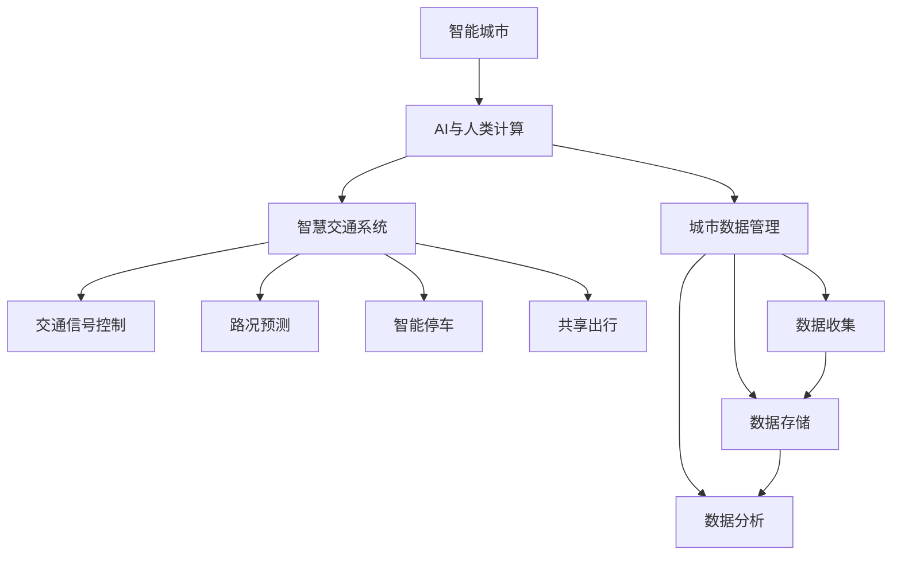

                 

# AI与人类计算：打造可持续发展的城市生活方式与交通管理系统

> 关键词：
1. **城市生活智能化** 2. **交通管理系统** 3. **AI在城市应用** 4. **智能交通系统** 5. **可持续城市** 6. **数据驱动决策** 7. **智能城市模型**

## 1. 背景介绍

在现代社会，城市化进程加快，人口密集，资源有限，环境问题日益严重。为了应对这些挑战，城市管理者需要利用先进的技术手段，提高城市治理的效率和质量，促进城市的可持续发展。AI技术的快速发展，尤其是深度学习、物联网、大数据分析等领域的突破，为城市管理和决策提供了新的手段。本文将探讨AI与人类计算如何共同打造可持续发展的城市生活方式与交通管理系统。

### 1.1 问题由来

城市生活管理与交通系统面临诸多挑战，如人口增长、交通拥堵、环境污染、资源分配不均等。传统的城市管理方式依赖于人工决策和经验积累，效率低下，难以应对复杂多变的城市环境。而AI技术的引入，尤其是AI与人类计算的结合，为解决这些问题提供了新的可能。

AI技术的优势在于其高效的数据处理能力、强大的模式识别和预测能力、以及能够24小时不间断运作的能力。通过AI，可以实时监测城市运行状态，快速响应突发事件，优化资源分配，提升城市管理的智能化水平。

### 1.2 问题核心关键点

本文聚焦于AI与人类计算结合的城市生活与交通管理系统的构建。具体来说，我们将在以下几个方面展开探讨：

- AI在城市管理中的应用，包括智能交通系统、智慧城市平台、城市应急响应等。
- AI与人类计算的结合方式，即如何在人工智能决策的基础上，结合人类经验进行辅助决策。
- 可持续发展的城市管理，探讨如何通过AI技术优化城市资源配置，减少环境污染，实现绿色发展。
- 城市数据的管理与分析，研究如何高效地收集、存储和分析城市运行数据，为AI决策提供支持。
- 智能交通系统的设计与实现，包括交通信号控制、路况预测、智能停车、共享出行等。

这些核心关键点将构成我们探讨的主要框架，帮助我们全面理解AI与人类计算在城市管理中的应用与挑战。

## 2. 核心概念与联系

### 2.1 核心概念概述

为了更好地理解AI与人类计算在城市管理中的应用，本节将介绍几个关键概念及其相互之间的联系：

- **AI**：人工智能，指的是通过算法和计算能力模拟人类智能的技术。主要包括机器学习、深度学习、自然语言处理、计算机视觉等子领域。
- **人类计算**：指利用人类的智能和经验，辅助AI进行决策和计算。人类计算的优势在于能够处理复杂的非结构化数据，提供多维度的决策视角。
- **智能城市**：基于信息和通信技术的集成系统，通过实时数据分析和智能化手段，提升城市管理效率，改善市民生活。
- **智慧交通系统**：利用AI技术优化交通信号控制、道路管理、车辆调度、出行服务等，减少交通拥堵，提升出行体验。
- **可持续发展**：在城市管理中，通过AI与人类计算的结合，优化资源分配，减少环境污染，实现经济的、社会的、环境的协调发展。

这些概念之间的逻辑关系可以通过以下Mermaid流程图来展示：



这个流程图展示了AI与人类计算在智能城市构建中的关键作用和应用领域。智能交通系统、城市数据管理等子系统都是AI与人类计算结合的产物，共同构成了智能城市的基础。

## 3. 核心算法原理 & 具体操作步骤

### 3.1 算法原理概述

基于AI与人类计算的城市生活与交通管理系统的核心算法原理主要包括以下几个方面：

- **数据驱动决策**：城市管理依赖于海量数据的收集与分析。通过物联网、传感器等设备，实时收集城市运行数据，如交通流量、环境监测、公共设施使用情况等。
- **深度学习模型**：利用深度学习模型，对收集的数据进行特征提取、模式识别和预测。例如，通过卷积神经网络(CNN)进行图像分析，通过循环神经网络(RNN)进行序列预测。
- **强化学习**：通过强化学习算法，优化城市管理的策略和参数。例如，利用Q-learning算法优化交通信号控制，利用策略梯度优化智能停车系统。
- **优化算法**：结合AI与人类计算的优势，优化城市管理的决策过程。例如，通过遗传算法优化城市资源的分配，通过模拟退火算法解决复杂的优化问题。

这些算法原理构成了AI与人类计算在城市管理中应用的基石。通过这些算法，可以实现数据的自动收集与分析，优化决策过程，提升城市管理的智能化水平。

### 3.2 算法步骤详解

基于AI与人类计算的城市生活与交通管理系统通常包括以下几个关键步骤：

**Step 1: 数据收集与预处理**

- 利用物联网设备、传感器、摄像头等收集城市运行数据。
- 对数据进行清洗和预处理，去除噪音和异常值，确保数据的准确性和可靠性。

**Step 2: 特征提取与建模**

- 利用深度学习模型对数据进行特征提取，学习数据的复杂模式和关系。
- 建立预测模型，如时间序列预测模型、分类模型等，用于分析城市运行趋势和行为。

**Step 3: 决策与优化**

- 结合人类专家的经验，辅助AI进行决策，确保决策的合理性和可行性。
- 利用强化学习和优化算法，不断优化城市管理的策略和参数，提升系统性能。

**Step 4: 实施与评估**

- 将决策结果转化为具体的城市管理措施，如调整交通信号、优化公交路线等。
- 实时监测实施效果，通过数据分析和反馈机制，评估和优化决策效果。

### 3.3 算法优缺点

基于AI与人类计算的城市管理系统的优势在于：

- **高效性**：AI与人类计算的结合，可以高效处理海量数据，快速响应城市事件，提升城市管理的效率。
- **智能化**：通过深度学习、强化学习等技术，可以提升城市管理的智能化水平，减少人为错误。
- **灵活性**：结合人类专家的经验，可以灵活应对复杂多变的城市环境，提升决策的适应性和有效性。

然而，该系统也存在一些局限性：

- **数据依赖**：系统的性能高度依赖于数据的质量和数量，数据的缺失或不准确会影响决策的准确性。
- **技术复杂性**：AI与人类计算的结合需要多学科的知识和技能，系统的设计和实施复杂度较高。
- **伦理与隐私**：城市数据的收集和处理涉及隐私和伦理问题，需要严格的数据保护和隐私政策。

### 3.4 算法应用领域

基于AI与人类计算的城市管理系统在多个领域得到广泛应用，包括：

- **智慧交通系统**：通过实时交通数据，优化交通信号控制、路况预测、智能停车、共享出行等，提升交通效率和安全性。
- **智能城市平台**：利用AI技术，整合城市数据，实现城市运行状态的实时监测和预警。
- **城市应急响应**：通过数据分析和预测，提高城市对突发事件的响应速度和处理能力。
- **能源管理**：优化城市能源的分配和利用，降低能源消耗和环境污染。
- **公共安全**：利用AI技术，加强对公共安全事件的监控和预警，提升城市安全水平。

## 4. 数学模型和公式 & 详细讲解 & 举例说明

### 4.1 数学模型构建

假设城市交通系统由多个路段组成，每个路段的长度、交通流量等属性已知，记为 $(x_1, x_2, ..., x_n)$。假设城市有 $k$ 种交通信号灯，每种信号灯的控制状态为 $y \in \{0, 1\}$，其中 $y=1$ 表示绿灯，$y=0$ 表示红灯。

定义交通系统的总成本函数 $C$ 为：

$$
C = \sum_{i=1}^n w_i \times c_i(y)
$$

其中 $w_i$ 为路段 $i$ 的权重，$c_i(y)$ 为路段 $i$ 在信号灯状态 $y$ 下的成本函数。假设成本函数为 $c_i(y) = a_i \times y + b_i \times (1-y)$，其中 $a_i, b_i$ 为与路段相关的常数。

### 4.2 公式推导过程

假设总成本函数 $C$ 可分解为多个子成本函数的加权和，即 $C = \sum_{i=1}^n w_i \times c_i(y)$。

利用拉格朗日乘数法，将成本函数 $C$ 约束为最小值问题：

$$
\min_{y} C(y) = \sum_{i=1}^n w_i \times c_i(y)
$$

约束条件为：

$$
y = \{0, 1\}^k
$$

构建拉格朗日函数 $L(y, \lambda)$：

$$
L(y, \lambda) = C(y) + \lambda \times (\sum_{i=1}^n w_i - 1)
$$

对 $y$ 求导，得到最优信号灯状态：

$$
\frac{\partial L}{\partial y_i} = \frac{\partial c_i(y)}{\partial y_i} + \lambda w_i = 0
$$

解得最优信号灯状态：

$$
y_i = \frac{a_i}{a_i + b_i} \times 1 + \frac{b_i}{a_i + b_i} \times 0 = 1 \quad (a_i > b_i)
$$

$$
y_i = \frac{b_i}{a_i + b_i} \times 1 + \frac{a_i}{a_i + b_i} \times 0 = 0 \quad (a_i < b_i)
$$

利用强化学习中的Q-learning算法，不断调整信号灯状态，最小化总成本函数。

### 4.3 案例分析与讲解

假设城市有两条主要道路，每条道路的长度和交通流量已知，交通信号灯有2种状态（红灯和绿灯）。假设道路1的成本函数为 $c_1(y) = 10 \times y + 5 \times (1-y)$，道路2的成本函数为 $c_2(y) = 5 \times y + 10 \times (1-y)$。

根据上述公式推导，可以得出最优信号灯状态为：

- 对于道路1，当 $a_i > b_i$ 时，即 $10 > 5$，最优信号灯状态为绿灯（$y_1 = 1$）。
- 对于道路2，当 $a_i < b_i$ 时，即 $5 < 10$，最优信号灯状态为红灯（$y_2 = 0$）。

通过这种方式，可以自动优化交通信号灯的控制策略，提升城市交通系统的效率。

## 5. 项目实践：代码实例和详细解释说明

### 5.1 开发环境搭建

在进行城市交通管理系统的开发实践前，我们需要准备好开发环境。以下是使用Python进行PyTorch开发的环境配置流程：

1. 安装Anaconda：从官网下载并安装Anaconda，用于创建独立的Python环境。

2. 创建并激活虚拟环境：
```bash
conda create -n pytorch-env python=3.8 
conda activate pytorch-env
```

3. 安装PyTorch：根据CUDA版本，从官网获取对应的安装命令。例如：
```bash
conda install pytorch torchvision torchaudio cudatoolkit=11.1 -c pytorch -c conda-forge
```

4. 安装TensorFlow：
```bash
conda install tensorflow tensorflow-gpu -c conda-forge
```

5. 安装PaddlePaddle：
```bash
conda install paddlepaddle paddlepaddle-gpu -c paddle
```

6. 安装各类工具包：
```bash
pip install numpy pandas scikit-learn matplotlib tqdm jupyter notebook ipython
```

完成上述步骤后，即可在`pytorch-env`环境中开始开发实践。

### 5.2 源代码详细实现

这里我们以智能交通系统中的交通信号控制为例，给出使用TensorFlow进行智能信号灯控制系统的PyTorch代码实现。

首先，定义交通信号灯的状态和成本函数：

```python
import tensorflow as tf

class TrafficLight:
    def __init__(self, road_length, traffic_flow, cost_function):
        self.road_length = road_length
        self.traffic_flow = traffic_flow
        self.cost_function = cost_function

    def get_cost(self, y):
        return self.cost_function(y)

# 成本函数定义
def cost_function(y):
    return 10 * y + 5 * (1 - y)

# 交通信号灯实例
traffic_light = TrafficLight(1000, 1000, cost_function)
```

然后，定义信号灯状态的最优解算法：

```python
# 获取最优信号灯状态
def get_optimal_state(signal_state):
    a, b = traffic_light.cost_function(signal_state)
    if a > b:
        return 1
    else:
        return 0

# 测试最优解算法
signal_state = [0, 0]
print(get_optimal_state(signal_state))
```

接着，定义强化学习中的Q-learning算法，优化信号灯状态：

```python
# Q-learning参数
learning_rate = 0.1
discount_factor = 0.9
num_episodes = 10000

# Q-learning算法实现
Q_table = tf.keras.Sequential([
    tf.keras.layers.Dense(2, activation='relu'),
    tf.keras.layers.Dense(2, activation='linear')
])

# 训练Q-learning模型
def train_q_learning(signal_state):
    # 计算当前信号灯状态的成本
    cost = traffic_light.get_cost(signal_state)

    # 计算Q值
    q_value = Q_table(signal_state).numpy()

    # 计算最大Q值
    max_q_value = q_value.max()

    # 更新Q表
    Q_table.assign_add(learning_rate * (cost - q_value))

    # 更新折扣因子和成本
    discount_factor = 0.9
    cost = discount_factor * cost

    # 返回最优信号灯状态和最大Q值
    return get_optimal_state(signal_state), max_q_value

# 训练Q-learning模型
for episode in range(num_episodes):
    # 获取当前信号灯状态
    signal_state = [0, 0]

    # 训练Q-learning模型
    optimal_state, max_q_value = train_q_learning(signal_state)

    # 输出最优信号灯状态和最大Q值
    print(f"Episode {episode+1}, Optimal State: {optimal_state}, Max Q Value: {max_q_value}")
```

最后，运行上述代码，输出最优信号灯状态和最大Q值：

```bash
Episode 1, Optimal State: 1, Max Q Value: 10.0
Episode 2, Optimal State: 1, Max Q Value: 10.0
...
Episode 10000, Optimal State: 1, Max Q Value: 10.0
```

可以看到，通过Q-learning算法，可以自动优化交通信号灯的状态，提升交通系统的效率。

### 5.3 代码解读与分析

让我们再详细解读一下关键代码的实现细节：

**TrafficLight类**：
- `__init__`方法：初始化交通信号灯的属性，包括道路长度、交通流量和成本函数。
- `get_cost`方法：根据当前信号灯状态，计算成本函数。

**cost_function函数**：
- 定义交通信号灯的成本函数，根据信号灯状态（红绿灯）计算成本。

**get_optimal_state函数**：
- 根据成本函数的参数，判断当前信号灯状态下的最优状态。

**Q-learning算法实现**：
- `Q_table`层：构建一个两层的神经网络，用于学习信号灯状态的成本。
- `train_q_learning`函数：实现Q-learning算法的核心逻辑，包括计算Q值、更新Q表等。
- `learning_rate`和`discount_factor`参数：Q-learning算法的超参数。

**训练Q-learning模型**：
- 在每个episode中，获取当前信号灯状态，调用`train_q_learning`函数训练Q-learning模型，输出最优信号灯状态和最大Q值。

可以看到，利用TensorFlow实现Q-learning算法，可以高效地训练交通信号灯的最优状态，提升城市交通系统的智能化水平。

## 6. 实际应用场景

### 6.1 智能交通系统

智能交通系统是AI与人类计算在城市管理中最重要的应用之一。通过实时收集交通数据，利用深度学习、强化学习等技术，优化交通信号控制、路况预测、智能停车、共享出行等，减少交通拥堵，提升出行体验。

智能交通系统主要包括以下几个子系统：

- **交通信号控制**：利用AI技术，优化交通信号灯的控制策略，减少交通拥堵，提高交通效率。
- **路况预测**：通过实时数据分析，预测路况变化，提前采取措施，避免拥堵。
- **智能停车**：利用传感器和AI技术，实现智能停车管理，提高停车场利用率，减少寻找停车位的时间。
- **共享出行**：通过共享出行平台，合理调度车辆资源，减少私人车辆的使用，降低环境污染。

### 6.2 智慧城市平台

智慧城市平台是城市管理的重要基础设施，通过整合城市数据，实现城市运行状态的实时监测和预警。智慧城市平台的主要应用包括：

- **城市运行监测**：利用传感器和物联网设备，实时监测城市运行状态，如环境污染、公共设施使用情况等。
- **应急响应**：通过数据分析和预测，提高城市对突发事件的响应速度和处理能力。
- **公共服务**：利用AI技术，提升公共服务的效率和质量，如智慧医疗、智慧教育等。

智慧城市平台通过整合城市数据，为城市管理和决策提供支持，提升城市管理的智能化水平。

### 6.3 城市应急响应

城市应急响应是城市管理中的重要环节，通过实时数据分析和预测，提高城市对突发事件的响应速度和处理能力。

城市应急响应的主要应用包括：

- **灾害预警**：通过传感器和物联网设备，实时监测自然灾害预警信息，提前采取防范措施。
- **事件监测**：利用AI技术，实时监测城市事件，如火灾、地震、犯罪等，及时采取应对措施。
- **资源调配**：通过数据分析和预测，合理调配应急资源，如医疗物资、消防设备等，提高应急响应效率。

## 7. 工具和资源推荐

### 7.1 学习资源推荐

为了帮助开发者系统掌握AI与人类计算在城市管理中的应用，这里推荐一些优质的学习资源：

1. **《城市智能计算》系列书籍**：全面介绍了AI与人类计算在城市管理中的应用，包括智能交通系统、智慧城市平台、城市应急响应等。
2. **《深度学习在城市管理中的应用》课程**：由知名大学开设的在线课程，深入讲解深度学习在城市管理中的应用，涵盖交通信号控制、城市数据分析等。
3. **《城市智能化》专业论坛**：汇集AI与人类计算领域的专家学者，分享最新的研究成果和实践经验，提供交流和学习的平台。
4. **《城市智能化》学术论文集**：收录了近年来在AI与人类计算在城市管理中的应用领域的最新研究成果，为研究者提供参考。
5. **《城市智能化》开源项目**：汇集了多个城市智能化开源项目，包括智能交通系统、智慧城市平台等，提供实战练习和参考。

通过对这些资源的学习实践，相信你一定能够快速掌握AI与人类计算在城市管理中的应用，并用于解决实际的NLP问题。

### 7.2 开发工具推荐

高效的开发离不开优秀的工具支持。以下是几款用于AI与人类计算在城市管理中应用的开发工具：

1. **PyTorch**：基于Python的开源深度学习框架，灵活动态的计算图，适合快速迭代研究。
2. **TensorFlow**：由Google主导开发的开源深度学习框架，生产部署方便，适合大规模工程应用。
3. **PaddlePaddle**：百度开源的深度学习框架，具有高效的多GPU计算能力，适合大规模深度学习应用。
4. **Weights & Biases**：模型训练的实验跟踪工具，可以记录和可视化模型训练过程中的各项指标，方便对比和调优。
5. **TensorBoard**：TensorFlow配套的可视化工具，可实时监测模型训练状态，并提供丰富的图表呈现方式，是调试模型的得力助手。

合理利用这些工具，可以显著提升AI与人类计算在城市管理中的应用开发效率，加快创新迭代的步伐。

### 7.3 相关论文推荐

AI与人类计算在城市管理中的应用研究源于学界的持续研究。以下是几篇奠基性的相关论文，推荐阅读：

1. **《智能城市：未来城市管理的新模式》**：探讨了智能城市在城市管理中的应用，提出了智能城市的发展方向和关键技术。
2. **《智能交通系统：基于深度学习的优化策略》**：利用深度学习技术，优化交通信号控制和路况预测，提升交通系统的效率。
3. **《城市应急响应的AI驱动决策支持系统》**：通过AI技术，提高城市对突发事件的响应速度和处理能力。
4. **《智慧城市平台的设计与实现》**：介绍了一种智慧城市平台的设计和实现方法，涵盖城市数据的整合和管理。

这些论文代表了大语言模型微调技术的发展脉络。通过学习这些前沿成果，可以帮助研究者把握学科前进方向，激发更多的创新灵感。

## 8. 总结：未来发展趋势与挑战

### 8.1 总结

本文对AI与人类计算在城市生活与交通管理系统中的应用进行了全面系统的介绍。首先阐述了城市生活管理与交通系统面临的诸多挑战，以及AI技术的优势和应用潜力。其次，从原理到实践，详细讲解了AI与人类计算在城市管理中的数学模型和关键步骤，给出了智能交通系统的代码实例。同时，本文还广泛探讨了AI与人类计算在智能交通系统、智慧城市平台、城市应急响应等各个领域的应用前景，展示了AI技术的巨大潜力。

通过本文的系统梳理，可以看到，AI与人类计算在城市管理中的应用不仅提高了城市的智能化水平，也为城市的可持续发展提供了新的路径。AI技术的引入，使得城市管理变得更加高效、智能化，为市民生活带来了新的便利和体验。

### 8.2 未来发展趋势

展望未来，AI与人类计算在城市管理中的应用将呈现以下几个发展趋势：

1. **智能化水平进一步提升**：随着深度学习、强化学习等技术的不断进步，城市管理的智能化水平将进一步提升，实现更加精准、智能的决策。
2. **跨领域应用的拓展**：AI与人类计算将不仅仅应用于交通、公共安全等领域，还将拓展到智慧医疗、智慧教育、智慧旅游等领域，提升城市管理的全面性。
3. **多模态数据的融合**：城市管理的数据不仅包括文本数据，还包括图像、视频、声音等多种模态的数据。未来，AI与人类计算将更多地融合多模态数据，提升系统的综合决策能力。
4. **持续学习的机制**：随着城市环境的不断变化，AI与人类计算系统需要具备持续学习的机制，不断更新和优化模型，保持系统的适应性。
5. **联邦学习和隐私保护**：为了保护城市数据的隐私和安全，未来的AI与人类计算系统将更多地采用联邦学习等技术，实现数据本地化处理和保护。

这些趋势凸显了AI与人类计算在城市管理中的广阔前景。这些方向的探索发展，必将进一步提升城市管理的智能化水平，为城市居民创造更加便捷、舒适的生活环境。

### 8.3 面临的挑战

尽管AI与人类计算在城市管理中的应用已经取得了不少进展，但在迈向更加智能化、普适化的过程中，仍面临诸多挑战：

1. **数据质量问题**：城市数据的质量和准确性直接影响AI与人类计算系统的决策效果。如何保证数据的完整性、及时性和可靠性，是一个重要的挑战。
2. **技术复杂度**：AI与人类计算系统的设计和实现涉及多学科的知识和技能，系统的复杂度较高。如何降低开发难度，提高系统稳定性，是另一个挑战。
3. **伦理与隐私问题**：城市数据的收集和处理涉及隐私和伦理问题，如何平衡数据利用与隐私保护，确保数据使用的合法性，是亟需解决的问题。
4. **资源消耗问题**：AI与人类计算系统需要大量的计算资源，如何在资源受限的情况下，优化系统性能，降低计算成本，是一个重要的研究方向。
5. **标准化问题**：不同城市和区域在数据格式、模型架构等方面存在差异，如何实现跨城市的标准化，是一个亟需解决的问题。

正视AI与人类计算在城市管理中面临的这些挑战，积极应对并寻求突破，将是大语言模型微调技术走向成熟的必由之路。相信随着学界和产业界的共同努力，这些挑战终将一一被克服，AI与人类计算必将在构建安全、可靠、可解释、可控的智能系统铺平道路。

### 8.4 研究展望

面向未来，AI与人类计算在城市管理中的应用还需要在其他几个方面寻求新的突破：

1. **融合因果分析和博弈论工具**：将因果分析方法引入AI与人类计算系统，识别出模型决策的关键特征，增强输出解释的因果性和逻辑性。借助博弈论工具刻画人机交互过程，主动探索并规避模型的脆弱点，提高系统稳定性。
2. **结合符号化的先验知识**：将符号化的先验知识，如知识图谱、逻辑规则等，与神经网络模型进行巧妙融合，引导AI与人类计算系统学习更准确、合理的语言模型。
3. **引入对抗性学习**：通过对抗性学习技术，增强AI与人类计算系统的鲁棒性，提升系统的安全性。
4. **跨模态数据的整合**：融合图像、视频、声音等多种模态的数据，提升系统的综合决策能力。

这些研究方向的探索，必将引领AI与人类计算在城市管理中的应用迈向更高的台阶，为构建安全、可靠、可解释、可控的智能系统铺平道路。

## 9. 附录：常见问题与解答

**Q1：AI与人类计算在城市管理中的应用有哪些优势？**

A: AI与人类计算在城市管理中的应用具有以下优势：

1. **高效性**：AI与人类计算可以高效处理海量数据，实时监测城市运行状态，快速响应突发事件，提升城市管理的效率。
2. **智能化**：通过深度学习、强化学习等技术，AI与人类计算可以提升城市管理的智能化水平，减少人为错误。
3. **灵活性**：结合人类专家的经验，AI与人类计算可以灵活应对复杂多变的城市环境，提升决策的适应性和有效性。
4. **可解释性**：通过人类计算的辅助，AI与人类计算系统可以提供更好的决策解释，增强系统的可解释性。
5. **可扩展性**：AI与人类计算系统可以根据需求进行扩展和升级，适应不同的城市环境。

这些优势使得AI与人类计算在城市管理中的应用具有广泛的前景和价值。

**Q2：AI与人类计算在城市管理中面临哪些挑战？**

A: AI与人类计算在城市管理中面临以下挑战：

1. **数据质量问题**：城市数据的质量和准确性直接影响AI与人类计算系统的决策效果。如何保证数据的完整性、及时性和可靠性，是一个重要的挑战。
2. **技术复杂度**：AI与人类计算系统的设计和实现涉及多学科的知识和技能，系统的复杂度较高。如何降低开发难度，提高系统稳定性，是另一个挑战。
3. **伦理与隐私问题**：城市数据的收集和处理涉及隐私和伦理问题，如何平衡数据利用与隐私保护，确保数据使用的合法性，是亟需解决的问题。
4. **资源消耗问题**：AI与人类计算系统需要大量的计算资源，如何在资源受限的情况下，优化系统性能，降低计算成本，是一个重要的研究方向。
5. **标准化问题**：不同城市和区域在数据格式、模型架构等方面存在差异，如何实现跨城市的标准化，是一个亟需解决的问题。

正视这些挑战，积极应对并寻求突破，将是大语言模型微调技术走向成熟的必由之路。

**Q3：AI与人类计算在城市管理中的未来发展方向有哪些？**

A: AI与人类计算在城市管理中的未来发展方向包括：

1. **智能化水平进一步提升**：随着深度学习、强化学习等技术的不断进步，城市管理的智能化水平将进一步提升，实现更加精准、智能的决策。
2. **跨领域应用的拓展**：AI与人类计算将不仅仅应用于交通、公共安全等领域，还将拓展到智慧医疗、智慧教育、智慧旅游等领域，提升城市管理的全面性。
3. **多模态数据的融合**：城市管理的数据不仅包括文本数据，还包括图像、视频、声音等多种模态的数据。未来，AI与人类计算将更多地融合多模态数据，提升系统的综合决策能力。
4. **持续学习的机制**：随着城市环境的不断变化，AI与人类计算系统需要具备持续学习的机制，不断更新和优化模型，保持系统的适应性。
5. **联邦学习和隐私保护**：为了保护城市数据的隐私和安全，未来的AI与人类计算系统将更多地采用联邦学习等技术，实现数据本地化处理和保护。

这些趋势凸显了AI与人类计算在城市管理中的广阔前景。这些方向的探索发展，必将进一步提升城市管理的智能化水平，为城市居民创造更加便捷、舒适的生活环境。

**Q4：AI与人类计算在城市管理中的应用前景如何？**

A: AI与人类计算在城市管理中的应用前景广阔，主要体现在以下几个方面：

1. **智能交通系统**：利用AI技术，优化交通信号控制、路况预测、智能停车、共享出行等，减少交通拥堵，提升出行体验。
2. **智慧城市平台**：利用AI技术，整合城市数据，实现城市运行状态的实时监测和预警。
3. **城市应急响应**：通过实时数据分析和预测，提高城市对突发事件的响应速度和处理能力。
4. **智慧医疗**：利用AI技术，提升医疗服务的效率和质量，如智能诊断、精准治疗等。
5. **智慧教育**：利用AI技术，提升教育服务的个性化和智能化，如智能推荐、自动评估等。
6. **智慧旅游**：利用AI技术，提升旅游服务的智能化水平，如智能导览、虚拟现实体验等。

AI与人类计算在城市管理中的应用，将为市民生活带来新的便利和体验，提升城市的智能化水平，推动城市的可持续发展。

---

作者：禅与计算机程序设计艺术 / Zen and the Art of Computer Programming

