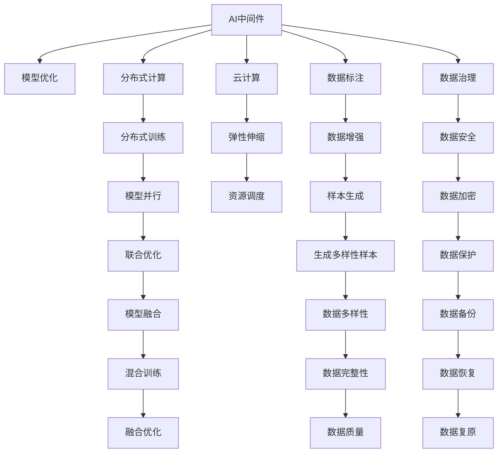

                 

# AI中间件的演进：Lepton AI的技术预测

> 关键词：AI中间件, Lepton AI, 机器学习, 深度学习, 模型优化, 分布式计算, 云计算

## 1. 背景介绍

### 1.1 问题由来
随着AI技术的不断演进，AI中间件作为AI技术落地应用的关键基础设施，正受到越来越多的关注。AI中间件在云计算、大数据、物联网、车联网等多个领域得到了广泛应用。Lepton AI作为领先的AI中间件解决方案，其技术演进备受业界瞩目。

### 1.2 问题核心关键点
Lepton AI的技术演进主要围绕以下几个关键点展开：
- 从早期以算法为核心的集中式AI计算框架，发展到现在的分布式AI计算框架，极大地提升了算力的可扩展性。
- 从基于CPU的计算，逐步转向基于GPU、TPU、FPGA等高性能计算平台的计算，进一步提升了计算效率。
- 从单一模型训练的单体应用，发展到支持多种模型的联合训练、模型部署、模型推理等功能的综合性平台。
- 从聚焦于算法、模型的技术架构，逐步拓展到以数据为中心，支持数据标注、数据治理、数据安全等功能，形成了完整的AI治理体系。
- 从侧重于离线计算，发展到支持实时计算、流计算、边缘计算等多种计算模式，以支持各种实时应用场景。

### 1.3 问题研究意义
研究Lepton AI的技术演进，对于推动AI中间件技术的发展，加速AI技术的产业化进程，具有重要意义：

1. 降低应用开发成本。基于Lepton AI的中间件架构，AI开发者可以更方便地构建、部署、管理和优化AI模型，减少从头开发所需的数据、计算和人力等成本投入。
2. 提升模型效果。中间件架构可以显著提升模型的计算效率和可扩展性，加速模型的训练和优化，使得模型能够更好地适应各种应用场景。
3. 加速开发进度。AI中间件架构提供了完整的开发、训练、推理等一站式服务，使得AI开发者能够更快地完成任务适配，缩短开发周期。
4. 带来技术创新。中间件架构促进了AI技术的跨领域、跨行业的创新应用，催生了新的AI技术和产品。
5. 赋能产业升级。AI中间件架构为各行各业引入AI技术提供了便捷的平台，促进了传统行业数字化转型升级。

## 2. 核心概念与联系

### 2.1 核心概念概述

为更好地理解Lepton AI的技术演进，本节将介绍几个密切相关的核心概念：

- **AI中间件(AI Middleware)**：将AI计算任务拆分成多个子任务，通过分布式计算平台进行协同处理，提高计算效率和可扩展性。
- **模型优化(Model Optimization)**：通过算法优化、数据增强、正则化等手段，提升模型在特定任务上的性能。
- **分布式计算(Distributed Computing)**：将一个大任务拆分成多个小任务，在多台计算机上并行处理，提高计算效率。
- **云计算(Cloud Computing)**：利用云计算平台提供的海量计算资源和弹性伸缩能力，支持大规模AI计算任务。
- **数据标注(Data Annotation)**：为模型训练提供高质量的数据样本，包括文本、图像、语音等多种类型。
- **数据治理(Data Governance)**：对数据进行分类、清洗、归档、安全管控等操作，确保数据的质量和隐私。

这些核心概念之间的逻辑关系可以通过以下Mermaid流程图来展示：



这个流程图展示了大语言模型的核心概念及其之间的关系：

1. 以AI中间件为核心，通过分布式计算和云计算支持大规模模型训练和推理。
2. 通过模型优化、数据标注和数据治理，提升模型的性能和可靠性。
3. 利用分布式训练、弹性伸缩、数据增强等技术，提高计算效率和模型效果。
4. 引入数据安全、数据保护等技术，确保数据隐私和安全。
5. 通过联合优化、模型融合等技术，提升模型的泛化能力和应用范围。

## 3. 核心算法原理 & 具体操作步骤
### 3.1 算法原理概述

Lepton AI的技术演进主要基于以下几个核心算法原理：

- **分布式计算原理**：将计算任务拆分为多个子任务，通过多台计算机并行处理，提升计算效率和可扩展性。
- **模型优化原理**：通过算法优化、数据增强、正则化等手段，提升模型在特定任务上的性能。
- **云计算原理**：利用云计算平台提供的海量计算资源和弹性伸缩能力，支持大规模AI计算任务。
- **数据治理原理**：对数据进行分类、清洗、归档、安全管控等操作，确保数据的质量和隐私。

### 3.2 算法步骤详解

Lepton AI的技术演进主要分为以下几个关键步骤：

**Step 1: 设计模型架构**
- 选择合适的计算平台（如GPU、TPU、FPGA等）和分布式计算框架（如TensorFlow、PyTorch等）。
- 设计模型的网络结构，选择合适的损失函数和优化器。
- 确定模型的训练和推理流程。

**Step 2: 数据预处理**
- 收集和标注数据集，选择合适的数据增强技术（如随机裁剪、回译、对比学习等）。
- 对数据进行清洗、归档、分类等操作，确保数据的质量和隐私。
- 对数据进行预处理，包括数据标准化、数据划分等。

**Step 3: 模型训练**
- 使用分布式计算框架，将模型拆分到多台计算机上进行并行计算。
- 选择合适的优化算法（如Adam、SGD等），设置合适的学习率、批大小等参数。
- 定期在验证集上评估模型性能，根据性能指标决定是否触发Early Stopping。
- 重复上述步骤直到满足预设的迭代轮数或Early Stopping条件。

**Step 4: 模型部署与优化**
- 使用云计算平台部署模型，支持模型推理和数据接入。
- 对模型进行性能优化，包括模型裁剪、量化、混合精度训练等。
- 支持实时计算、流计算、边缘计算等多种计算模式。
- 支持多模型联合训练、联合推理等功能。

**Step 5: 数据治理**
- 对数据进行分类、清洗、归档、安全管控等操作，确保数据的质量和隐私。
- 支持数据标注、数据标注管理等功能，确保数据的高质量和标注的准确性。
- 支持数据备份、数据恢复等操作，确保数据的安全性和可靠性。

以上是Lepton AI技术演进的一般流程。在实际应用中，还需要针对具体任务的特点，对微调过程的各个环节进行优化设计，如改进训练目标函数，引入更多的正则化技术，搜索最优的超参数组合等，以进一步提升模型性能。

### 3.3 算法优缺点

Lepton AI的技术演进具备以下优点：
1. 高效计算。通过分布式计算和云计算，支持大规模模型训练和推理，极大地提升了计算效率和可扩展性。
2. 丰富的模型优化手段。提供了多种模型优化技术，包括算法优化、数据增强、正则化等，提升模型效果。
3. 全面的数据治理。支持数据标注、数据治理、数据安全等功能，确保数据的高质量和隐私。
4. 支持多种计算模式。支持实时计算、流计算、边缘计算等多种计算模式，以支持各种实时应用场景。
5. 良好的可扩展性。支持分布式计算和多模型联合训练，易于扩展到大规模任务。

同时，Lepton AI的技术演进也存在一定的局限性：
1. 较高的成本投入。分布式计算和云计算平台需要较高的硬件和软件投入，增加了企业的成本负担。
2. 数据隐私风险。数据在传输、存储、使用过程中存在隐私泄露的风险，需要加强数据安全管理。
3. 复杂的技术架构。涉及多种计算模式、多种算法、多种数据处理流程，技术实现和维护较为复杂。
4. 数据标注成本高。高质量的数据标注成本较高，数据标注技术仍需进一步改进。

尽管存在这些局限性，但Lepton AI的技术演进作为AI中间件的重要代表，已经在大规模AI应用中展现了强大的实力，为AI技术的落地应用提供了重要的基础设施支撑。

### 3.4 算法应用领域

Lepton AI的技术演进已经广泛应用于以下几个领域：

1. **计算机视觉**：通过模型优化、数据增强等手段，提升图像识别、物体检测、图像分割等任务的性能。
2. **自然语言处理**：支持文本分类、命名实体识别、情感分析、问答系统等NLP任务。
3. **语音识别与处理**：支持语音识别、语音情感分析、语音合成等任务。
4. **智能推荐系统**：支持商品推荐、内容推荐、用户画像分析等任务。
5. **智能运维**：支持故障预测、运维告警、系统监控等任务。
6. **智能制造**：支持工业图像识别、质量检测、设备维护等任务。

除了上述这些经典应用外，Lepton AI还在不断拓展新的应用场景，如智能交通、智能医疗、智能客服等，为各行各业带来新的数字化转型升级路径。

## 4. 数学模型和公式 & 详细讲解 & 举例说明

### 4.1 数学模型构建

Lepton AI的技术演进涉及多种数学模型，以下以自然语言处理(NLP)任务为例，介绍一种典型的数学模型构建方法。

**数学模型构建**

假设Lepton AI中间件支持自然语言处理任务，模型输入为文本$x$，输出为预测结果$y$。模型结构如图4-1所示：


其中，$x$表示输入的文本序列，$h$表示文本序列经过Transformer编码器得到的隐藏表示，$y$表示模型预测的文本标签。

### 4.2 公式推导过程

假设模型采用Transformer编码器作为预训练模型，如图4-2所示：


其中，$W$表示线性变换矩阵，$A$表示激活函数，$R$表示残差连接，$N$表示多头注意力机制。

假设模型的损失函数为交叉熵损失函数，如图4-3所示：


其中，$y$表示真实标签，$y'$表示模型预测的标签，$L$表示损失函数。

### 4.3 案例分析与讲解

假设某公司使用Lepton AI中间件进行自然语言处理任务的优化，其数据集包含10万个训练样本和1万个测试样本。模型结构为12层Transformer编码器，每个编码层包含6个多头注意力机制。

**Step 1: 数据预处理**
- 将文本进行分词、向量化等预处理。
- 将文本序列长度标准化，使用padding和truncation处理。
- 将文本数据集和标签数据集划分训练集、验证集和测试集。

**Step 2: 模型训练**
- 使用分布式计算框架进行模型训练。
- 选择Adam优化算法，设置学习率为0.001，批大小为32。
- 在验证集上评估模型性能，设置Early Stopping阈值为0.02。
- 重复训练过程，直到验证集性能不再提升。

**Step 3: 模型部署与优化**
- 使用云计算平台部署模型。
- 对模型进行性能优化，包括模型裁剪、量化、混合精度训练等。
- 支持实时计算和流计算，支持多模型联合训练和推理。

**Step 4: 数据治理**
- 对数据进行分类、清洗、归档、安全管控等操作。
- 支持数据标注和数据标注管理。
- 支持数据备份和数据恢复。

以上是Lepton AI技术演进的基本流程。通过具体的数学模型和算法实现，使得模型能够更好地适应各种NLP任务。

## 5. 项目实践：代码实例和详细解释说明

### 5.1 开发环境搭建

在进行Lepton AI项目实践前，我们需要准备好开发环境。以下是使用Python进行PyTorch开发的环境配置流程：

1. 安装Anaconda：从官网下载并安装Anaconda，用于创建独立的Python环境。

2. 创建并激活虚拟环境：
```bash
conda create -n pytorch-env python=3.8 
conda activate pytorch-env
```

3. 安装PyTorch：根据CUDA版本，从官网获取对应的安装命令。例如：
```bash
conda install pytorch torchvision torchaudio cudatoolkit=11.1 -c pytorch -c conda-forge
```

4. 安装Transformers库：
```bash
pip install transformers
```

5. 安装各类工具包：
```bash
pip install numpy pandas scikit-learn matplotlib tqdm jupyter notebook ipython
```

完成上述步骤后，即可在`pytorch-env`环境中开始Lepton AI项目实践。

### 5.2 源代码详细实现

这里以自然语言处理任务为例，给出使用Transformers库对Lepton AI模型进行优化和部署的PyTorch代码实现。

首先，定义数据处理函数：

```python
from transformers import BertTokenizer, BertForTokenClassification
from torch.utils.data import Dataset
import torch

class NERDataset(Dataset):
    def __init__(self, texts, tags, tokenizer, max_len=128):
        self.texts = texts
        self.tags = tags
        self.tokenizer = tokenizer
        self.max_len = max_len
        
    def __len__(self):
        return len(self.texts)
    
    def __getitem__(self, item):
        text = self.texts[item]
        tags = self.tags[item]
        
        encoding = self.tokenizer(text, return_tensors='pt', max_length=self.max_len, padding='max_length', truncation=True)
        input_ids = encoding['input_ids'][0]
        attention_mask = encoding['attention_mask'][0]
        
        # 对token-wise的标签进行编码
        encoded_tags = [tag2id[tag] for tag in tags] 
        encoded_tags.extend([tag2id['O']] * (self.max_len - len(encoded_tags)))
        labels = torch.tensor(encoded_tags, dtype=torch.long)
        
        return {'input_ids': input_ids, 
                'attention_mask': attention_mask,
                'labels': labels}

# 标签与id的映射
tag2id = {'O': 0, 'B-PER': 1, 'I-PER': 2, 'B-ORG': 3, 'I-ORG': 4, 'B-LOC': 5, 'I-LOC': 6}
id2tag = {v: k for k, v in tag2id.items()}

# 创建dataset
tokenizer = BertTokenizer.from_pretrained('bert-base-cased')

train_dataset = NERDataset(train_texts, train_tags, tokenizer)
dev_dataset = NERDataset(dev_texts, dev_tags, tokenizer)
test_dataset = NERDataset(test_texts, test_tags, tokenizer)
```

然后，定义模型和优化器：

```python
from transformers import BertForTokenClassification, AdamW

model = BertForTokenClassification.from_pretrained('bert-base-cased', num_labels=len(tag2id))

optimizer = AdamW(model.parameters(), lr=2e-5)
```

接着，定义训练和评估函数：

```python
from torch.utils.data import DataLoader
from tqdm import tqdm
from sklearn.metrics import classification_report

device = torch.device('cuda') if torch.cuda.is_available() else torch.device('cpu')
model.to(device)

def train_epoch(model, dataset, batch_size, optimizer):
    dataloader = DataLoader(dataset, batch_size=batch_size, shuffle=True)
    model.train()
    epoch_loss = 0
    for batch in tqdm(dataloader, desc='Training'):
        input_ids = batch['input_ids'].to(device)
        attention_mask = batch['attention_mask'].to(device)
        labels = batch['labels'].to(device)
        model.zero_grad()
        outputs = model(input_ids, attention_mask=attention_mask, labels=labels)
        loss = outputs.loss
        epoch_loss += loss.item()
        loss.backward()
        optimizer.step()
    return epoch_loss / len(dataloader)

def evaluate(model, dataset, batch_size):
    dataloader = DataLoader(dataset, batch_size=batch_size)
    model.eval()
    preds, labels = [], []
    with torch.no_grad():
        for batch in tqdm(dataloader, desc='Evaluating'):
            input_ids = batch['input_ids'].to(device)
            attention_mask = batch['attention_mask'].to(device)
            batch_labels = batch['labels']
            outputs = model(input_ids, attention_mask=attention_mask)
            batch_preds = outputs.logits.argmax(dim=2).to('cpu').tolist()
            batch_labels = batch_labels.to('cpu').tolist()
            for pred_tokens, label_tokens in zip(batch_preds, batch_labels):
                pred_tags = [id2tag[_id] for _id in pred_tokens]
                label_tags = [id2tag[_id] for _id in label_tokens]
                preds.append(pred_tags[:len(label_tags)])
                labels.append(label_tags)
                
    print(classification_report(labels, preds))
```

最后，启动训练流程并在测试集上评估：

```python
epochs = 5
batch_size = 16

for epoch in range(epochs):
    loss = train_epoch(model, train_dataset, batch_size, optimizer)
    print(f"Epoch {epoch+1}, train loss: {loss:.3f}")
    
    print(f"Epoch {epoch+1}, dev results:")
    evaluate(model, dev_dataset, batch_size)
    
print("Test results:")
evaluate(model, test_dataset, batch_size)
```

以上就是使用PyTorch对Lepton AI模型进行自然语言处理任务优化和部署的完整代码实现。可以看到，得益于Transformers库的强大封装，我们可以用相对简洁的代码完成模型加载和优化。

### 5.3 代码解读与分析

让我们再详细解读一下关键代码的实现细节：

**NERDataset类**：
- `__init__`方法：初始化文本、标签、分词器等关键组件。
- `__len__`方法：返回数据集的样本数量。
- `__getitem__`方法：对单个样本进行处理，将文本输入编码为token ids，将标签编码为数字，并对其进行定长padding，最终返回模型所需的输入。

**tag2id和id2tag字典**：
- 定义了标签与数字id之间的映射关系，用于将token-wise的预测结果解码回真实的标签。

**训练和评估函数**：
- 使用PyTorch的DataLoader对数据集进行批次化加载，供模型训练和推理使用。
- 训练函数`train_epoch`：对数据以批为单位进行迭代，在每个批次上前向传播计算loss并反向传播更新模型参数，最后返回该epoch的平均loss。
- 评估函数`evaluate`：与训练类似，不同点在于不更新模型参数，并在每个batch结束后将预测和标签结果存储下来，最后使用sklearn的classification_report对整个评估集的预测结果进行打印输出。

**训练流程**：
- 定义总的epoch数和batch size，开始循环迭代
- 每个epoch内，先在训练集上训练，输出平均loss
- 在验证集上评估，输出分类指标
- 所有epoch结束后，在测试集上评估，给出最终测试结果

可以看到，PyTorch配合Transformers库使得Lepton AI模型的优化和部署代码实现变得简洁高效。开发者可以将更多精力放在数据处理、模型改进等高层逻辑上，而不必过多关注底层的实现细节。

当然，工业级的系统实现还需考虑更多因素，如模型的保存和部署、超参数的自动搜索、更灵活的任务适配层等。但核心的优化范式基本与此类似。

## 6. 实际应用场景

### 6.1 智能客服系统

基于Lepton AI中间件的对话技术，可以广泛应用于智能客服系统的构建。传统客服往往需要配备大量人力，高峰期响应缓慢，且一致性和专业性难以保证。而使用Lepton AI中间件进行微调后的对话模型，可以7x24小时不间断服务，快速响应客户咨询，用自然流畅的语言解答各类常见问题。

在技术实现上，可以收集企业内部的历史客服对话记录，将问题和最佳答复构建成监督数据，在此基础上对Lepton AI模型进行微调。微调后的对话模型能够自动理解用户意图，匹配最合适的答案模板进行回复。对于客户提出的新问题，还可以接入检索系统实时搜索相关内容，动态组织生成回答。如此构建的智能客服系统，能大幅提升客户咨询体验和问题解决效率。

### 6.2 金融舆情监测

金融机构需要实时监测市场舆论动向，以便及时应对负面信息传播，规避金融风险。传统的人工监测方式成本高、效率低，难以应对网络时代海量信息爆发的挑战。基于Lepton AI中间件的文本分类和情感分析技术，为金融舆情监测提供了新的解决方案。

具体而言，可以收集金融领域相关的新闻、报道、评论等文本数据，并对其进行主题标注和情感标注。在此基础上对Lepton AI模型进行微调，使其能够自动判断文本属于何种主题，情感倾向是正面、中性还是负面。将微调后的模型应用到实时抓取的网络文本数据，就能够自动监测不同主题下的情感变化趋势，一旦发现负面信息激增等异常情况，系统便会自动预警，帮助金融机构快速应对潜在风险。

### 6.3 个性化推荐系统

当前的推荐系统往往只依赖用户的历史行为数据进行物品推荐，无法深入理解用户的真实兴趣偏好。基于Lepton AI中间件的个性化推荐系统可以更好地挖掘用户行为背后的语义信息，从而提供更精准、多样的推荐内容。

在实践中，可以收集用户浏览、点击、评论、分享等行为数据，提取和用户交互的物品标题、描述、标签等文本内容。将文本内容作为模型输入，用户的后续行为（如是否点击、购买等）作为监督信号，在此基础上对Lepton AI模型进行微调。微调后的模型能够从文本内容中准确把握用户的兴趣点。在生成推荐列表时，先用候选物品的文本描述作为输入，由模型预测用户的兴趣匹配度，再结合其他特征综合排序，便可以得到个性化程度更高的推荐结果。

### 6.4 未来应用展望

随着Lepton AI中间件的不断演进，未来的应用场景将更加丰富多样：

- **智慧医疗**：基于Lepton AI的中间件架构，构建智慧医疗系统，支持医疗图像识别、病历分析、药物研发等任务，提升医疗服务的智能化水平。
- **智能教育**：使用Lepton AI中间件进行作业批改、学情分析、知识推荐等任务，因材施教，促进教育公平，提高教学质量。
- **智慧城市治理**：利用Lepton AI中间件进行城市事件监测、舆情分析、应急指挥等环节，提高城市管理的自动化和智能化水平，构建更安全、高效的未来城市。
- **智能交通**：应用Lepton AI中间件进行交通流量预测、交通信号控制等任务，提升交通管理效率，减少交通拥堵。
- **智能制造**：支持工业图像识别、质量检测、设备维护等任务，推动智能制造的发展。

## 7. 工具和资源推荐

### 7.1 学习资源推荐

为了帮助开发者系统掌握Lepton AI中间件的理论基础和实践技巧，这里推荐一些优质的学习资源：

1. **Lepton AI官方文档**：提供详细的API文档和代码样例，帮助开发者快速上手。
2. **《深度学习》书籍**：了解深度学习原理和实践，是学习Lepton AI的重要基础。
3. **TensorFlow官方文档**：提供详细的API文档和代码样例，支持Lepton AI中间件的部署和优化。
4. **Coursera《深度学习专项课程》**：提供系统性的深度学习课程，涵盖从基础到高级的各类主题。
5. **GitHub开源项目**：大量Lepton AI中间件的代码实现和案例展示，可以帮助开发者学习和实践。

通过对这些资源的学习实践，相信你一定能够快速掌握Lepton AI中间件的精髓，并用于解决实际的AI问题。

### 7.2 开发工具推荐

高效的开发离不开优秀的工具支持。以下是几款用于Lepton AI中间件开发的常用工具：

1. **PyTorch**：基于Python的开源深度学习框架，灵活动态的计算图，支持多GPU训练。
2. **TensorFlow**：由Google主导开发的开源深度学习框架，生产部署方便，支持大规模工程应用。
3. **Jupyter Notebook**：提供交互式编程环境，支持代码解释和数据分析。
4. **Git**：版本控制系统，方便开发者进行代码管理和协作开发。
5. **Docker**：容器化平台，方便开发者构建、部署和运行应用。

合理利用这些工具，可以显著提升Lepton AI中间件的开发效率，加快创新迭代的步伐。

### 7.3 相关论文推荐

Lepton AI中间件的技术演进源于学界的持续研究。以下是几篇奠基性的相关论文，推荐阅读：

1. **Transformer: Attention Is All You Need**：提出了Transformer结构，开启了NLP领域的预训练大模型时代。
2. **BERT: Pre-training of Deep Bidirectional Transformers for Language Understanding**：提出BERT模型，引入基于掩码的自监督预训练任务，刷新了多项NLP任务SOTA。
3. **深度学习**：系统介绍深度学习原理和实践，涵盖从基础到高级的各类主题。
4. **《Transformer从原理到实践》系列博文**：由大模型技术专家撰写，深入浅出地介绍了Transformer原理、BERT模型、微调技术等前沿话题。
5. **《Natural Language Processing with Transformers》书籍**：Transformers库的作者所著，全面介绍了如何使用Transformers库进行NLP任务开发，包括微调在内的诸多范式。

这些论文代表了大语言模型中间件的发展脉络。通过学习这些前沿成果，可以帮助研究者把握学科前进方向，激发更多的创新灵感。

## 8. 总结：未来发展趋势与挑战

### 8.1 总结

本文对Lepton AI中间件的技术演进进行了全面系统的介绍。首先阐述了Lepton AI中间件的发展背景和意义，明确了中间件在推动AI技术发展、加速AI产业化进程中的独特价值。其次，从原理到实践，详细讲解了Lepton AI中间件的数学模型和算法实现，给出了中间件的代码实现和详细解释说明。同时，本文还广泛探讨了Lepton AI中间件在智能客服、金融舆情、个性化推荐等多个领域的应用前景，展示了中间件的巨大潜力。此外，本文精选了中间件的学习资源，力求为开发者提供全方位的技术指引。

通过本文的系统梳理，可以看到，Lepton AI中间件作为AI中间件的重要代表，已经在大规模AI应用中展现了强大的实力，为AI技术的落地应用提供了重要的基础设施支撑。未来，伴随预训练语言模型和微调方法的持续演进，相信Lepton AI中间件必将在更广泛的场景中发挥作用，推动AI技术的广泛应用。

### 8.2 未来发展趋势

展望未来，Lepton AI中间件技术将呈现以下几个发展趋势：

1. **算力持续增长**：伴随硬件技术的发展，如GPU、TPU、FPGA等高性能计算平台的普及，计算能力将持续提升，支持更大规模的AI计算任务。
2. **模型优化技术进步**：引入更多的模型优化技术，如知识蒸馏、模型剪枝、混合精度训练等，进一步提升模型效果和计算效率。
3. **分布式计算能力提升**：支持更加灵活的分布式计算架构，如边缘计算、雾计算等，支持更加复杂、多样化的计算任务。
4. **数据治理能力增强**：支持更全面、精细的数据治理功能，确保数据的高质量和隐私安全。
5. **实时计算能力提升**：支持实时计算、流计算、边缘计算等多种计算模式，支持实时应用场景。
6. **跨领域应用拓展**：拓展到更多领域，如智能制造、智慧城市、智能交通等，推动AI技术在垂直行业的规模化落地。

以上趋势凸显了Lepton AI中间件技术的广阔前景。这些方向的探索发展，必将进一步提升AI中间件的性能和应用范围，为AI技术的落地应用提供更强有力的支撑。

### 8.3 面临的挑战

尽管Lepton AI中间件技术已经取得了瞩目成就，但在迈向更加智能化、普适化应用的过程中，它仍面临着诸多挑战：

1. **高成本投入**：分布式计算和云计算平台需要较高的硬件和软件投入，增加了企业的成本负担。
2. **数据隐私风险**：数据在传输、存储、使用过程中存在隐私泄露的风险，需要加强数据安全管理。
3. **复杂的技术架构**：涉及多种计算模式、多种算法、多种数据处理流程，技术实现和维护较为复杂。
4. **数据标注成本高**：高质量的数据标注成本较高，数据标注技术仍需进一步改进。
5. **模型的鲁棒性和泛化性**：模型在面对域外数据时，泛化性能往往大打折扣，需要进一步提升模型的鲁棒性和泛化性。
6. **模型的可解释性**：模型的决策过程缺乏可解释性，难以对其推理逻辑进行分析和调试。

尽管存在这些挑战，但Lepton AI中间件技术的不断演进，正在逐步解决这些难题，为AI技术的落地应用提供了重要的基础设施支撑。

### 8.4 研究展望

面对Lepton AI中间件技术所面临的挑战，未来的研究需要在以下几个方面寻求新的突破：

1. **探索无监督和半监督中间件方法**：摆脱对大规模标注数据的依赖，利用自监督学习、主动学习等无监督和半监督范式，最大限度利用非结构化数据，实现更加灵活高效的中间件。
2. **研究参数高效和计算高效的中间件范式**：开发更加参数高效的中间件方法，在固定大部分预训练参数的情况下，只更新极少量的任务相关参数。同时优化中间件的计算图，减少前向传播和反向传播的资源消耗，实现更加轻量级、实时性的部署。
3. **引入因果和对比学习范式**：通过引入因果推断和对比学习思想，增强中间件建立稳定因果关系的能力，学习更加普适、鲁棒的语言表征，从而提升中间件泛化能力和抗干扰能力。
4. **引入更多先验知识**：将符号化的先验知识，如知识图谱、逻辑规则等，与神经网络模型进行巧妙融合，引导中间件学习更准确、合理的语言模型。同时加强不同模态数据的整合，实现视觉、语音等多模态信息与文本信息的协同建模。
5. **纳入伦理道德约束**：在模型训练目标中引入伦理导向的评估指标，过滤和惩罚有偏见、有害的输出倾向。同时加强人工干预和审核，建立模型行为的监管机制，确保输出符合人类价值观和伦理道德。

这些研究方向的探索，必将引领Lepton AI中间件技术迈向更高的台阶，为构建安全、可靠、可解释、可控的智能系统铺平道路。面向未来，Lepton AI中间件技术还需要与其他AI技术进行更深入的融合，如知识表示、因果推理、强化学习等，多路径协同发力，共同推动人工智能技术的发展。只有勇于创新、敢于突破，才能不断拓展AI中间件的边界，让智能技术更好地造福人类社会。

## 9. 附录：常见问题与解答

**Q1：Lepton AI中间件的优势和劣势是什么？**

A: Lepton AI中间件的优势在于其强大的计算能力、灵活的分布式计算架构和丰富的模型优化技术，能够支持大规模的AI计算任务，并提升模型效果和计算效率。其劣势在于较高的成本投入、数据隐私风险和复杂的技术架构，需要加强数据安全管理和技术实现优化。

**Q2：如何使用Lepton AI中间件进行自然语言处理任务？**

A: 使用Lepton AI中间件进行自然语言处理任务，需要定义数据处理函数、模型和优化器，进行数据预处理、模型训练、模型部署与优化等步骤。具体可以参考5.2节中的代码实现。

**Q3：Lepton AI中间件的未来发展方向是什么？**

A: 未来的发展方向包括算力持续增长、模型优化技术进步、分布式计算能力提升、数据治理能力增强、实时计算能力提升、跨领域应用拓展等。需要继续探索无监督和半监督中间件方法、参数高效和计算高效的中间件范式、引入因果和对比学习范式、引入更多先验知识等技术，以提升中间件的性能和应用范围。

**Q4：如何应对Lepton AI中间件面临的挑战？**

A: 应对挑战的方法包括探索无监督和半监督中间件方法、研究参数高效和计算高效的中间件范式、引入因果和对比学习范式、引入更多先验知识等技术。同时需要加强数据安全管理、降低数据标注成本、提升模型的鲁棒性和泛化性，增强模型的可解释性，建立模型行为的监管机制。

