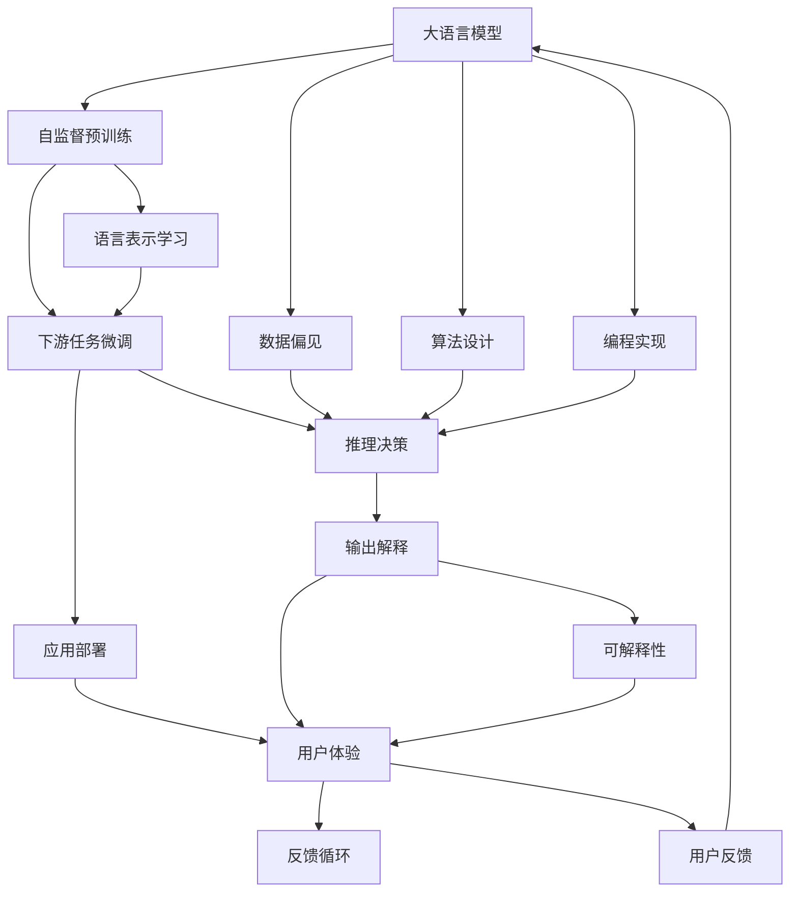

                 

## 1. 背景介绍

随着人工智能（AI）技术的快速发展，尤其是大语言模型（LLMs）在自然语言处理（NLP）领域的突破性进展，LLMs已经广泛应用于诸如智能客服、智能翻译、自动摘要、问答系统等多个领域，带来了巨大的经济效益和社会影响。然而，随着LLMs的广泛应用，其伦理问题也引起了越来越多的关注。如何确保LLMs的使用符合道德规范，避免潜在的偏见、歧视和不公平等问题，成为了摆在技术开发者和使用者面前的紧迫任务。

本文旨在探讨LLM发展的道德指南，通过阐述LLMs的核心概念、关键问题及其应用领域的伦理挑战，为开发者和使用者提供一份基于AI伦理原则的行动指南，促进AI技术的健康发展，造福全人类。

## 2. 核心概念与联系

### 2.1 核心概念概述

大语言模型（Large Language Model, LLM）是一种基于深度学习架构的模型，通过自监督学习在大规模无标签文本数据上预训练，学习到通用语言的表示能力。这些模型能够在自然语言处理任务上表现出色，但同时也带来了诸多伦理挑战。

**AI伦理**是指在AI系统的设计、开发、部署和应用过程中，需要遵循的一系列道德规范和原则，旨在确保技术的安全、公正、透明和可解释性。

**AI偏见**指的是AI系统由于训练数据、算法设计或编程错误等原因，导致在预测和决策过程中表现出不公平的倾向，通常体现在对特定人群、地区或类别的歧视。

**可解释性**是指AI系统的决策过程可以清楚地解释给人类，使得用户理解系统的推理逻辑和结果依据。

### 2.2 核心概念原理和架构的 Mermaid 流程图



此图展示了LLMs的核心概念及它们之间的联系。

## 3. 核心算法原理 & 具体操作步骤

### 3.1 算法原理概述

LLMs的伦理问题主要集中在以下几个方面：

- **数据偏见**：预训练数据中的偏见会通过微调传递到下游任务中，导致模型在特定群体或主题上的表现不佳。
- **模型可解释性**：LLMs通常被视为“黑箱”模型，其决策过程难以解释，这对高风险领域（如医疗、金融）的决策非常不安全。
- **隐私保护**：在收集和处理用户数据时，如何保护用户隐私成为一个重要问题。

### 3.2 算法步骤详解

针对这些伦理问题，可以采取以下措施：

**数据预处理**：通过清洗和去偏处理，确保训练数据的多样性和公平性。

**模型可解释性增强**：采用可解释性技术，如可视化、符号解释、透明接口等，使得模型决策过程透明化。

**隐私保护**：采用数据匿名化、差分隐私等技术，确保用户数据的安全和隐私保护。

### 3.3 算法优缺点

**优点**：
- 提高模型的公平性和透明度，增强用户信任。
- 通过隐私保护措施，增强用户数据的安全性。

**缺点**：
- 预处理和后处理可能增加模型的复杂度，影响性能。
- 增强可解释性可能涉及额外的计算成本和技术难度。

### 3.4 算法应用领域

在金融、医疗、司法等高风险领域，LLMs的应用需要特别关注其伦理问题。在智能客服、自然语言生成等领域，也需要确保LLMs的公平性和透明度。

## 4. 数学模型和公式 & 详细讲解

### 4.1 数学模型构建

为了更好地理解LLMs的伦理问题，我们可以从数学角度构建模型。

设训练数据集为 $\{(x_i, y_i)\}_{i=1}^N$，其中 $x_i$ 为输入文本，$y_i$ 为标签。LLMs在预训练阶段的目标是最大化模型在训练数据上的似然概率 $P_{\theta}(x)$，即：

$$
\max_{\theta} \sum_{i=1}^N \log P_{\theta}(x_i)
$$

在微调阶段，目标是最小化模型在任务数据上的损失函数 $\mathcal{L}$，即：

$$
\min_{\theta} \mathcal{L}(M_{\theta}, D)
$$

其中 $M_{\theta}$ 为微调后的模型，$D$ 为任务数据集。

### 4.2 公式推导过程

以情感分析任务为例，假设模型的输出为 $p_i$ 表示文本 $x_i$ 属于正面情感的概率，则损失函数可以表示为交叉熵损失：

$$
\mathcal{L} = -\frac{1}{N} \sum_{i=1}^N (y_i \log p_i + (1 - y_i) \log (1 - p_i))
$$

### 4.3 案例分析与讲解

在情感分析任务中，数据偏差可能导致模型对某些情感类别预测不准。例如，如果训练数据中正面情感样本远多于负面情感样本，模型可能会更倾向于将文本分类为正面情感。此时，可以通过重新采样和权重调整等方法来缓解数据偏差问题。

## 5. 项目实践：代码实例和详细解释说明

### 5.1 开发环境搭建

要构建一个基于LLMs的情感分析系统，需要以下开发环境：

1. **Python**：安装Python 3.6及以上版本。
2. **PyTorch**：安装PyTorch 1.0及以上版本。
3. **HuggingFace Transformers**：安装HuggingFace Transformers库。
4. **Google Colab**：使用Google Colab平台进行代码调试和测试。

### 5.2 源代码详细实现

以下是一个简单的情感分析代码实现：

```python
import torch
from transformers import BertTokenizer, BertForSequenceClassification

# 初始化预训练模型和分词器
model = BertForSequenceClassification.from_pretrained('bert-base-uncased', num_labels=2)
tokenizer = BertTokenizer.from_pretrained('bert-base-uncased')

# 定义训练函数
def train_model(model, train_data, device, learning_rate=2e-5, epochs=5):
    # 数据预处理
    train_encodings = tokenizer(train_data, truncation=True, padding=True)
    train_labels = torch.tensor(train_labels)

    # 设置训练参数
    optimizer = torch.optim.AdamW(model.parameters(), lr=learning_rate)
    device = torch.device('cuda') if torch.cuda.is_available() else torch.device('cpu')
    model.to(device)

    # 训练过程
    for epoch in range(epochs):
        model.train()
        for i, (input_ids, attention_mask, labels) in enumerate(train_data_loader):
            input_ids = input_ids.to(device)
            attention_mask = attention_mask.to(device)
            labels = labels.to(device)

            # 前向传播
            outputs = model(input_ids, attention_mask=attention_mask)
            loss = outputs.loss

            # 反向传播和优化
            optimizer.zero_grad()
            loss.backward()
            optimizer.step()

        # 计算损失和精度
        train_loss = loss.item()
        train_acc = calculate_accuracy(train_labels, outputs.logits.argmax(dim=1))
        print(f'Epoch {epoch+1}, Train Loss: {train_loss:.4f}, Train Accuracy: {train_acc:.4f}')

# 定义测试函数
def test_model(model, test_data, device):
    # 数据预处理
    test_encodings = tokenizer(test_data, truncation=True, padding=True)
    test_labels = torch.tensor(test_labels)

    # 计算测试集上的损失和精度
    model.eval()
    test_loss = 0
    test_acc = 0
    with torch.no_grad():
        for input_ids, attention_mask, labels in test_data_loader:
            input_ids = input_ids.to(device)
            attention_mask = attention_mask.to(device)
            labels = labels.to(device)

            # 前向传播
            outputs = model(input_ids, attention_mask=attention_mask)
            loss = outputs.loss

            # 累加损失和精度
            test_loss += loss.item()
            predictions = outputs.logits.argmax(dim=1)
            test_acc += calculate_accuracy(test_labels, predictions)

    test_loss /= len(test_data_loader)
    test_acc /= len(test_data_loader)
    print(f'Test Loss: {test_loss:.4f}, Test Accuracy: {test_acc:.4f}')

# 调用训练和测试函数
train_model(model, train_data, device)
test_model(model, test_data, device)
```

### 5.3 代码解读与分析

此代码实现了一个简单的基于BERT的情感分析系统。首先，通过HuggingFace Transformers库加载预训练模型和分词器。然后，定义训练函数和测试函数，分别处理数据预处理、模型前向传播、损失计算和精度计算。最后，在Google Colab平台上测试模型的性能。

## 6. 实际应用场景

### 6.1 智能客服系统

智能客服系统需要对用户输入进行情感分析，以提供更个性化的服务。在智能客服中，LLMs的伦理问题尤其重要，因为系统直接与用户互动，其决策会影响用户的体验和满意度。

### 6.2 金融舆情监测

金融舆情监测系统需要处理大量文本数据，分析用户对金融产品的看法。LLMs在情感分析方面的表现尤为突出，但也需要注意数据偏差和隐私保护问题。

### 6.3 个性化推荐系统

个性化推荐系统通过分析用户的文本评论，推荐相关产品或服务。在推荐过程中，需要确保系统不会对某些用户群体产生偏见，同时保护用户隐私。

### 6.4 未来应用展望

未来，LLMs的伦理问题将受到越来越多的关注，开发者需要在模型设计和应用部署时充分考虑这些因素。随着技术的进步，相信能够开发出更加公平、透明和可解释的LLMs，为社会带来更多福祉。

## 7. 工具和资源推荐

### 7.1 学习资源推荐

1. **《AI伦理：理论与实践》**：一本系统介绍AI伦理的书籍，涵盖数据偏见、隐私保护、可解释性等关键问题。
2. **《机器学习伦理》**：一本面向机器学习从业者的伦理指南，提供实用的伦理实践建议。
3. **AI伦理在线课程**：如Coursera、edX等在线平台提供的AI伦理课程，帮助开发者提升伦理意识。

### 7.2 开发工具推荐

1. **PyTorch**：深度学习框架，提供了丰富的工具和库，支持模型构建和训练。
2. **Google Colab**：免费提供GPU/TPU算力的在线开发平台，支持大规模模型训练和调试。
3. **TensorBoard**：可视化工具，帮助开发者监控模型训练过程和性能指标。

### 7.3 相关论文推荐

1. **《大语言模型的公平性研究》**：讨论了LLMs在处理偏见数据时可能带来的公平性问题。
2. **《模型可解释性的最新进展》**：总结了模型可解释性研究领域的最新进展和未来方向。
3. **《数据隐私保护的最新技术》**：介绍了数据匿名化、差分隐私等隐私保护技术。

## 8. 总结：未来发展趋势与挑战

### 8.1 研究成果总结

本文系统探讨了LLMs的伦理问题，包括数据偏见、模型可解释性和隐私保护等关键方面。通过案例分析、代码实现和工具推荐，为开发者和使用者提供了一份实用的指南。

### 8.2 未来发展趋势

未来，LLMs的伦理问题将更加受到关注，开发者需要在设计和管理LLMs时充分考虑这些问题。同时，随着技术的进步，相信能够开发出更加公平、透明和可解释的LLMs，为社会带来更多福祉。

### 8.3 面临的挑战

尽管LLMs在技术上取得了显著进展，但在实际应用中仍面临诸多挑战，如数据偏见、模型可解释性不足和隐私保护等。解决这些问题需要学界和产业界的共同努力。

### 8.4 研究展望

未来的研究需要在以下几个方面寻求新的突破：
1. **数据偏见缓解**：开发更公平的数据集和预处理方法，减少模型偏见。
2. **模型可解释性增强**：采用可解释性技术，提升模型的透明性和可解释性。
3. **隐私保护技术**：开发更先进的隐私保护技术，确保用户数据的安全。

---

作者：禅与计算机程序设计艺术 / Zen and the Art of Computer Programming

