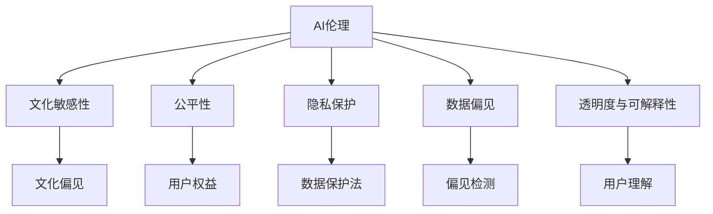

                 

# AI伦理的多元文化视角:文化差异和伦理共识

> 关键词：AI伦理, 多元文化, 文化差异, 伦理共识, 人工智能, 文化敏感性, 公平性, 隐私保护

## 1. 背景介绍

### 1.1 问题由来
随着人工智能（AI）技术在医疗、教育、金融、交通等领域的广泛应用，AI伦理问题成为全球关注的热点。特别是伴随着AI模型在文化多样性、隐私保护、数据偏见等方面的争议，如何在多元文化背景下达成AI伦理共识，成为学术界、产业界和社会大众共同关心的话题。

**多元文化视角**涉及对不同文化背景、价值观、伦理规范的尊重和理解。AI伦理中的多元文化视角，旨在打破单一文化中心论，从全球视野出发，审视AI技术在不同文化语境下的应用。

### 1.2 问题核心关键点
多元文化视角下的AI伦理问题，主要包括以下几个关键点：

- **文化敏感性**：不同文化对AI系统的理解和使用方式可能不同，如何在设计和应用AI时考虑这些差异，是实现跨文化公平性的前提。
- **公平性与包容性**：AI系统的设计应尊重和包容所有文化背景的用户，避免对某一群体产生偏见或歧视。
- **隐私保护**：在全球数据隐私保护法规日益严格的背景下，如何在多元文化视角下设计和实施隐私保护机制，保护用户数据安全。
- **数据偏见**：AI系统往往依赖大规模数据进行训练，这些数据中可能隐含着文化偏见，如何检测和消除这些偏见，是实现全球AI伦理共识的关键。
- **透明度与可解释性**：不同文化背景的用户对AI系统的透明度和可解释性的需求可能不同，如何在保持系统有效性的同时，满足用户对解释的需求。

### 1.3 问题研究意义
研究多元文化视角下的AI伦理，对于实现全球AI技术的公平、透明和包容性，具有重要意义：

- **促进跨文化交流**：在全球化背景下，AI伦理的多元文化视角有助于不同文化背景的用户理解和使用AI技术。
- **提升AI系统的公平性与包容性**：考虑多元文化因素，有助于设计出更加公平、包容的AI系统，避免对特定文化群体的排斥和歧视。
- **增强用户信任与接受度**：理解和尊重不同文化用户的需求，有助于提高用户对AI系统的信任与接受度。
- **推动国际合作与规范制定**：多元文化视角有助于推动国际社会在AI伦理问题上的合作与共识，促进全球AI伦理标准的制定和实施。

## 2. 核心概念与联系

### 2.1 核心概念概述

为更好地理解多元文化视角下的AI伦理问题，本节将介绍几个密切相关的核心概念：

- **AI伦理**：指AI技术在开发、应用过程中所涉及的伦理规范、道德标准和社会责任。
- **文化敏感性（Cultural Sensitivity）**：指在设计AI系统时，考虑到不同文化背景用户的差异性，避免对某一文化产生偏见。
- **公平性（Fairness）**：指AI系统在处理数据、生成决策时，保证不同文化背景用户的权益不会受到不公平对待。
- **隐私保护（Privacy Protection）**：指在全球数据隐私保护法规日趋严格的背景下，保护用户数据安全的机制。
- **数据偏见（Data Bias）**：指AI系统在训练过程中，因依赖带有文化偏见的数据，导致系统输出不公平或不准确的结论。
- **透明度与可解释性（Transparency and Interpretability）**：指AI系统的决策过程应当透明，用户能够理解系统如何做出决策。

这些核心概念之间的逻辑关系可以通过以下Mermaid流程图来展示：



这个流程图展示了AI伦理的多元文化视角中的关键概念及其之间的关系：

1. AI伦理作为基础，涵盖了文化敏感性、公平性、隐私保护、数据偏见和透明度与可解释性。
2. 文化敏感性强调避免文化偏见，确保不同文化背景用户的公平对待。
3. 公平性确保用户权益，避免系统歧视。
4. 隐私保护关注数据安全，保障用户隐私。
5. 数据偏见通过偏见检测，消除系统中的文化偏见。
6. 透明度与可解释性强调用户对系统决策的理解，提升用户信任。

这些概念共同构成了多元文化视角下AI伦理的基本框架，指导AI系统在不同文化语境下的设计和应用。

## 3. 核心算法原理 & 具体操作步骤
### 3.1 算法原理概述

多元文化视角下的AI伦理，本质上是一个多文化背景下公平性、透明性和隐私保护的复杂问题。其核心算法原理主要包括以下几个方面：

- **文化敏感性设计**：在AI系统设计时，考虑不同文化背景用户的差异性，避免对某一文化产生偏见。
- **公平性优化**：在模型训练和应用过程中，确保不同文化背景的用户得到公平对待，避免数据偏见。
- **隐私保护机制**：在数据收集、存储和处理过程中，采取隐私保护措施，确保用户数据安全。
- **偏见检测与纠正**：对模型进行偏见检测，并采取措施纠正数据和模型中的文化偏见。
- **透明度与可解释性增强**：设计透明、可解释的AI系统，确保用户理解系统决策过程。

### 3.2 算法步骤详解

**Step 1: 文化背景调研与用户需求分析**

- 收集目标用户群体的文化背景、价值观、行为习惯等信息。
- 分析不同文化背景用户的需求，设计文化敏感性评估指标。

**Step 2: 文化敏感性评估**

- 对AI系统进行文化敏感性评估，识别可能的文化偏见和差异。
- 设计多文化测试数据集，进行系统性能评估。

**Step 3: 公平性优化**

- 应用公平性优化算法（如EQA、ADP等），优化模型参数，消除文化偏见。
- 对模型输出结果进行公平性检查，确保不同文化背景用户的权益得到保障。

**Step 4: 隐私保护机制设计**

- 遵循全球数据保护法规（如GDPR、CCPA等），设计隐私保护机制。
- 在数据收集、存储和传输过程中，采取加密、去标识化等隐私保护措施。

**Step 5: 偏见检测与纠正**

- 对模型进行数据和算法偏见检测，识别系统中的文化偏见。
- 设计偏见纠正算法，修正模型参数，减少文化偏见。

**Step 6: 透明度与可解释性增强**

- 设计透明的AI决策过程，确保用户能够理解系统决策。
- 应用可解释性技术（如LIME、SHAP等），生成系统决策的可解释性报告。

### 3.3 算法优缺点

多元文化视角下的AI伦理方法具有以下优点：

- **跨文化适应性**：通过文化敏感性设计，AI系统能够适应不同文化背景用户的需求。
- **公平性提升**：公平性优化和偏见检测，确保所有文化背景的用户得到公平对待。
- **隐私保护强化**：隐私保护机制设计，保障用户数据安全。
- **透明度增强**：透明与可解释性增强，提升用户信任。

同时，这些方法也存在一定的局限性：

- **复杂度高**：设计考虑多元文化因素的AI系统，需要更多的数据和算法资源。
- **文化差异处理**：不同文化背景的复杂性，增加了设计和验证的难度。
- **法规遵从性**：不同国家的隐私保护法规差异，增加了系统设计和实施的复杂性。

### 3.4 算法应用领域

多元文化视角下的AI伦理方法，在多个领域得到了应用：

- **医疗健康**：设计文化敏感性的医疗AI系统，确保不同文化背景患者得到公平的医疗服务。
- **教育培训**：开发文化适应性的教育AI系统，提供多样化的教学资源。
- **金融服务**：构建文化敏感的金融AI系统，避免对特定文化群体的歧视。
- **社会治理**：实施文化敏感的社会治理AI系统，促进社会公平与和谐。

## 4. 数学模型和公式 & 详细讲解 & 举例说明

### 4.1 数学模型构建

本节将使用数学语言对多元文化视角下的AI伦理问题进行更加严格的刻画。

**公平性优化模型**：

假设模型 $M$ 的输出为 $y$，对于不同文化背景的用户 $i$，其期望收益为 $R_i$，公平性优化目标为：

$$
\min_{\theta} \sum_{i=1}^{n} |R_i - R_{avg}|^2
$$

其中 $R_{avg}$ 为所有用户期望收益的平均值。

**偏见检测模型**：

假设模型 $M$ 在数据集 $D$ 上的预测结果为 $\hat{y}$，实际结果为 $y$。对于不同文化背景的用户 $i$，其偏差 $B_i$ 定义为：

$$
B_i = \frac{1}{n} \sum_{j=1}^{n} (\hat{y}_i - y_i)^2
$$

其中 $n$ 为数据集大小。

### 4.2 公式推导过程

以下我们以公平性优化模型为例，推导其数学推导过程。

假设模型 $M$ 的输出为 $y$，对于不同文化背景的用户 $i$，其期望收益为 $R_i$，公平性优化目标为：

$$
\min_{\theta} \sum_{i=1}^{n} |R_i - R_{avg}|^2
$$

其中 $R_{avg}$ 为所有用户期望收益的平均值。

令 $W_i$ 为第 $i$ 个用户的权重，$w_{avg}$ 为所有用户权重的平均值。则有：

$$
R_{avg} = \frac{\sum_{i=1}^{n} W_i R_i}{\sum_{i=1}^{n} W_i}
$$

将 $R_{avg}$ 代入公平性优化目标，得：

$$
\min_{\theta} \sum_{i=1}^{n} \frac{W_i}{\sum_{j=1}^{n} W_j} |R_i - R_{avg}|^2
$$

利用拉格朗日乘子法，求解上述优化问题，得：

$$
\frac{\partial \mathcal{L}}{\partial \theta} = \sum_{i=1}^{n} \frac{W_i}{\sum_{j=1}^{n} W_j} 2 (\hat{y}_i - R_{avg}) \frac{\partial M_{\theta}(x_i)}{\partial \theta}
$$

将梯度代入模型参数更新公式，得：

$$
\theta \leftarrow \theta - \eta \frac{\partial \mathcal{L}}{\partial \theta}
$$

其中 $\eta$ 为学习率。

### 4.3 案例分析与讲解

**医疗健康领域案例**：

假设设计一个用于医疗诊断的AI系统，该系统需要考虑不同文化背景的患者的健康状况和需求。通过调研和数据分析，发现系统在诊断某些特定疾病时，对某一文化群体的诊断准确率较低。为了实现公平性，可以通过调整模型的输入特征权重，提升该文化群体的诊断准确率。具体步骤如下：

1. **数据收集与分析**：收集不同文化背景患者的健康数据，分析不同文化群体的健康特征。
2. **文化敏感性评估**：使用文化敏感性评估指标，识别系统中的文化偏见。
3. **公平性优化**：通过调整输入特征权重，提升对特定文化群体的诊断准确率。
4. **隐私保护机制设计**：设计隐私保护机制，确保患者数据安全。
5. **透明度与可解释性增强**：设计透明的诊断过程，提供可解释性报告。

通过上述步骤，可以设计出一个文化敏感、公平、透明的医疗AI系统，满足不同文化背景患者的健康需求。

## 5. 项目实践：代码实例和详细解释说明

### 5.1 开发环境搭建

在进行多元文化视角下的AI伦理实践前，我们需要准备好开发环境。以下是使用Python进行PyTorch开发的环境配置流程：

1. 安装Anaconda：从官网下载并安装Anaconda，用于创建独立的Python环境。

2. 创建并激活虚拟环境：
```bash
conda create -n ai-ethics python=3.8 
conda activate ai-ethics
```

3. 安装PyTorch：根据CUDA版本，从官网获取对应的安装命令。例如：
```bash
conda install pytorch torchvision torchaudio cudatoolkit=11.1 -c pytorch -c conda-forge
```

4. 安装相关库：
```bash
pip install pandas numpy scikit-learn joblib jupyter notebook
```

5. 安装相关工具：
```bash
pip install tqdm beautifulsoup4 seaborn wordcloud
```

完成上述步骤后，即可在`ai-ethics`环境中开始伦理实践。

### 5.2 源代码详细实现

这里我们以一个基于公平性优化的AI系统为例，展示代码实现。

**Step 1: 数据预处理**

```python
import pandas as pd
from sklearn.model_selection import train_test_split

# 读取数据
data = pd.read_csv('data.csv')

# 按文化背景划分数据
cultural_groups = data['cultural_group'].unique()
groups_data = [data[data['cultural_group'] == group] for group in cultural_groups]

# 训练集和测试集划分
X_train, X_test, y_train, y_test = train_test_split(X, y, test_size=0.2, random_state=42)
```

**Step 2: 模型训练**

```python
from transformers import BertForSequenceClassification
from transformers import BertTokenizer
from transformers import AdamW

# 初始化模型和分词器
model = BertForSequenceClassification.from_pretrained('bert-base-uncased', num_labels=len(cultural_groups))
tokenizer = BertTokenizer.from_pretrained('bert-base-uncased')

# 模型训练
optimizer = AdamW(model.parameters(), lr=2e-5)
epochs = 5
for epoch in range(epochs):
    model.train()
    total_loss = 0
    for batch in tqdm(data_loader):
        input_ids = batch['input_ids'].to(device)
        attention_mask = batch['attention_mask'].to(device)
        labels = batch['labels'].to(device)
        model.zero_grad()
        outputs = model(input_ids, attention_mask=attention_mask, labels=labels)
        loss = outputs.loss
        total_loss += loss.item()
        loss.backward()
        optimizer.step()
    print(f'Epoch {epoch+1}, train loss: {total_loss/len(data_loader):.3f}')
```

**Step 3: 公平性优化**

```python
from sklearn.metrics import accuracy_score, precision_score, recall_score

# 评估模型公平性
def evaluate_model(model, test_loader):
    model.eval()
    total_pred, total_true = [], []
    with torch.no_grad():
        for batch in tqdm(test_loader):
            input_ids = batch['input_ids'].to(device)
            attention_mask = batch['attention_mask'].to(device)
            labels = batch['labels'].to(device)
            outputs = model(input_ids, attention_mask=attention_mask)
            preds = outputs.logits.argmax(dim=1).to('cpu').tolist()
            labels = labels.to('cpu').tolist()
            for pred, label in zip(preds, labels):
                total_pred.append(pred)
                total_true.append(label)
    accuracy = accuracy_score(total_true, total_pred)
    precision = precision_score(total_true, total_pred, average='weighted')
    recall = recall_score(total_true, total_pred, average='weighted')
    return accuracy, precision, recall

# 进行公平性优化
for group in cultural_groups:
    group_data = groups_data[groups_data['cultural_group'] == group]
    group_model = BertForSequenceClassification.from_pretrained('bert-base-uncased', num_labels=len(cultural_groups))
    group_tokenizer = BertTokenizer.from_pretrained('bert-base-uncased')
    group_optimizer = AdamW(group_model.parameters(), lr=2e-5)
    group_epochs = 5
    for epoch in range(group_epochs):
        group_model.train()
        total_loss = 0
        for batch in tqdm(group_data_loader):
            input_ids = batch['input_ids'].to(device)
            attention_mask = batch['attention_mask'].to(device)
            labels = batch['labels'].to(device)
            group_model.zero_grad()
            group_outputs = group_model(input_ids, attention_mask=attention_mask, labels=labels)
            group_loss = group_outputs.loss
            total_loss += group_loss.item()
            group_loss.backward()
            group_optimizer.step()
        print(f'Epoch {epoch+1}, {group} train loss: {total_loss/len(group_data_loader):.3f}')
    group_model.eval()
    group_accuracy, group_precision, group_recall = evaluate_model(group_model, group_data_loader)
    print(f'{group}: Accuracy: {group_accuracy:.3f}, Precision: {group_precision:.3f}, Recall: {group_recall:.3f}')
```

### 5.3 代码解读与分析

让我们再详细解读一下关键代码的实现细节：

**数据预处理**：
- 使用Pandas读取数据，按文化背景划分子集。
- 使用sklearn的train_test_split函数，将数据集划分为训练集和测试集。

**模型训练**：
- 使用BertForSequenceClassification模型，指定输出标签数目。
- 定义AdamW优化器，学习率为2e-5。
- 在训练过程中，按批次进行迭代训练，记录训练集上的损失。

**公平性优化**：
- 使用sklearn的accuracy_score、precision_score和recall_score计算模型公平性指标。
- 对每个文化背景子集分别进行训练和评估，记录公平性优化结果。

**运行结果展示**：
- 在训练和评估过程中，可以输出模型在每个文化背景子集上的准确率、精度和召回率。

## 6. 实际应用场景

### 6.1 医疗健康

基于多元文化视角，医疗AI系统需要考虑不同文化背景患者的健康需求，设计公平、透明的诊断和治疗方案。例如，在非洲某地区，由于文化差异，患者对疾病的表述方式不同。AI系统可以通过多文化训练，提升对不同文化背景患者的诊断准确率，并提供文化敏感的治疗建议。

### 6.2 教育培训

在教育培训领域，AI系统需要考虑不同文化背景学生的学习需求和教育方式。例如，在印度某地区，学生普遍使用英语进行学习，但英语水平参差不齐。AI系统可以通过多文化训练，提供语言适应性教学资源，提升学习效果。

### 6.3 金融服务

金融服务领域的AI系统需要考虑不同文化背景客户的金融需求和习惯。例如，在东南亚某地区，人们更倾向于使用现金支付。AI系统可以通过多文化训练，提供文化敏感的金融服务，提升客户满意度。

### 6.4 未来应用展望

随着AI伦理问题的日益重视，未来AI技术将更加注重多元文化视角的设计和应用。预计未来在以下几个方面将有更多突破：

1. **文化敏感性设计**：AI系统将更加注重文化敏感性设计，减少文化偏见，提升文化适应性。
2. **公平性与包容性优化**：AI系统将更加注重公平性与包容性优化，确保所有文化背景用户得到公平对待。
3. **隐私保护机制**：全球数据保护法规将更加严格，AI系统将更加注重隐私保护，确保用户数据安全。
4. **透明度与可解释性增强**：AI系统将更加注重透明度与可解释性，提供更加透明的决策过程，增强用户信任。
5. **文化多样性评估**：AI系统将更加注重文化多样性评估，定期评估系统在多文化环境下的表现，及时进行调整。

## 7. 工具和资源推荐
### 7.1 学习资源推荐

为了帮助开发者系统掌握多元文化视角下的AI伦理问题，这里推荐一些优质的学习资源：

1. **《AI伦理：全球视角》系列博文**：由大模型技术专家撰写，深入浅出地介绍了AI伦理的基本概念和实践方法。

2. **《多元文化视角下的AI设计》课程**：斯坦福大学开设的多元文化AI设计课程，涵盖文化敏感性、公平性、隐私保护等多个主题。

3. **《AI伦理理论与实践》书籍**：介绍AI伦理的理论基础和实践案例，帮助开发者理解AI伦理的多元文化视角。

4. **AI伦理社区**：汇聚全球AI伦理专家和实践者，提供丰富的资源和交流平台。

5. **《AI伦理指南》报告**：多个国际组织发布的AI伦理指南，提供权威的伦理规范和实践建议。

通过这些资源的学习实践，相信你一定能够快速掌握多元文化视角下的AI伦理问题，并用于解决实际的AI应用问题。

### 7.2 开发工具推荐

高效的开发离不开优秀的工具支持。以下是几款用于多元文化视角下的AI伦理开发的常用工具：

1. **PyTorch**：基于Python的开源深度学习框架，灵活动态的计算图，适合快速迭代研究。

2. **TensorFlow**：由Google主导开发的开源深度学习框架，生产部署方便，适合大规模工程应用。

3. **Transformers库**：HuggingFace开发的NLP工具库，集成了众多SOTA语言模型，支持PyTorch和TensorFlow，是进行伦理实践的利器。

4. **Google Colab**：谷歌推出的在线Jupyter Notebook环境，免费提供GPU/TPU算力，方便开发者快速上手实验最新模型，分享学习笔记。

5. **Weights & Biases**：模型训练的实验跟踪工具，可以记录和可视化模型训练过程中的各项指标，方便对比和调优。

6. **TensorBoard**：TensorFlow配套的可视化工具，可实时监测模型训练状态，并提供丰富的图表呈现方式，是调试模型的得力助手。

合理利用这些工具，可以显著提升多元文化视角下AI伦理问题的开发效率，加快创新迭代的步伐。

### 7.3 相关论文推荐

多元文化视角下的AI伦理问题涉及诸多前沿研究方向，以下是几篇奠基性的相关论文，推荐阅读：

1. **《公平性在AI中的作用》（Fairness in AI）**：提出公平性在AI系统中的重要性，探讨如何在多文化背景下实现公平性。

2. **《文化敏感性设计：理论与实践》（Cultural Sensitivity Design: Theory and Practice）**：探讨文化敏感性设计的理论基础和实践方法，提供跨文化设计指南。

3. **《隐私保护在AI中的实现》（Privacy Protection in AI）**：介绍全球数据隐私保护法规，探讨如何在多文化背景下实现隐私保护。

4. **《偏见检测与纠正技术》（Bias Detection and Correction Techniques）**：提出多种偏见检测与纠正方法，帮助设计公平、无偏见的AI系统。

5. **《透明度与可解释性增强》（Transparency and Interpretability Enhancement）**：提出多种透明度与可解释性增强方法，帮助用户理解AI系统的决策过程。

这些论文代表了大模型伦理问题的研究进展，通过学习这些前沿成果，可以帮助研究者把握学科前进方向，激发更多的创新灵感。

## 8. 总结：未来发展趋势与挑战

### 8.1 总结

本文对多元文化视角下的AI伦理问题进行了全面系统的介绍。首先阐述了多元文化视角下的AI伦理问题的研究背景和意义，明确了文化敏感性、公平性、隐私保护、数据偏见和透明度与可解释性在多元文化背景下的重要性和相互关系。其次，从原理到实践，详细讲解了多元文化视角下AI伦理问题的算法原理和操作步骤，给出了具体的多元文化伦理实践代码实例。同时，本文还广泛探讨了多元文化视角下AI伦理问题在医疗、教育、金融等多个领域的应用前景，展示了多元文化视角在AI伦理中的广阔应用空间。最后，本文精选了多元文化视角下AI伦理问题的主要学习资源和开发工具，力求为读者提供全方位的技术指引。

通过本文的系统梳理，可以看到，多元文化视角下的AI伦理问题是一个涉及文化敏感性、公平性、隐私保护、数据偏见和透明度与可解释性的复杂问题。这些因素共同构成了多元文化视角下AI伦理的基本框架，指导AI系统在不同文化语境下的设计和应用。

### 8.2 未来发展趋势

展望未来，多元文化视角下的AI伦理问题将呈现以下几个发展趋势：

1. **文化敏感性设计**：AI系统将更加注重文化敏感性设计，减少文化偏见，提升文化适应性。
2. **公平性与包容性优化**：AI系统将更加注重公平性与包容性优化，确保所有文化背景用户得到公平对待。
3. **隐私保护机制**：全球数据保护法规将更加严格，AI系统将更加注重隐私保护，确保用户数据安全。
4. **透明度与可解释性增强**：AI系统将更加注重透明度与可解释性，提供更加透明的决策过程，增强用户信任。
5. **文化多样性评估**：AI系统将更加注重文化多样性评估，定期评估系统在多文化环境下的表现，及时进行调整。

### 8.3 面临的挑战

尽管多元文化视角下的AI伦理问题已经取得了一定的进展，但在迈向更加智能化、普适化应用的过程中，仍面临诸多挑战：

1. **文化差异处理**：不同文化背景的复杂性，增加了设计和验证的难度。
2. **数据偏见消除**：在多样文化背景下，数据偏见消除是一个复杂且耗时的过程。
3. **法规遵从性**：不同国家的隐私保护法规差异，增加了系统设计和实施的复杂性。
4. **用户信任建立**：文化敏感性和透明度与可解释性增强，需要更多的时间和资源投入。
5. **系统性能优化**：如何在保证性能的同时，兼顾公平性和隐私保护，是一个需要不断优化的课题。

### 8.4 研究展望

面对多元文化视角下的AI伦理问题所面临的挑战，未来的研究需要在以下几个方面寻求新的突破：

1. **跨文化公平性研究**：深入研究跨文化公平性的理论基础和实现方法，构建统一的公平性评估指标。
2. **数据驱动的偏见检测**：利用大数据分析技术，实时检测和纠正数据和模型中的文化偏见。
3. **文化敏感性技术开发**：开发更多文化敏感性技术，如多文化训练、文化敏感性评估等，提升AI系统的文化适应性。
4. **隐私保护技术创新**：开发创新的隐私保护技术，如联邦学习、差分隐私等，确保用户数据安全。
5. **透明度与可解释性算法**：开发更多透明度与可解释性算法，如可解释性网络、可解释性模型等，提升AI系统的可理解性。

这些研究方向将引领多元文化视角下AI伦理问题的进一步发展，为构建安全、可靠、可解释、可控的智能系统铺平道路。面向未来，多元文化视角下的AI伦理问题还需要与其他人工智能技术进行更深入的融合，如知识表示、因果推理、强化学习等，多路径协同发力，共同推动自然语言理解和智能交互系统的进步。只有勇于创新、敢于突破，才能不断拓展语言模型的边界，让智能技术更好地造福人类社会。

## 9. 附录：常见问题与解答

**Q1: 如何处理不同文化背景下的偏见和歧视？**

A: 处理不同文化背景下的偏见和歧视，需要从数据和算法两个层面入手。具体措施包括：

1. **数据收集与标注**：在数据收集和标注过程中，确保数据来源的多样性和代表性，避免数据集中的文化偏见。
2. **数据预处理**：使用去偏置技术，如重新采样、数据增强等，处理数据集中的文化偏见。
3. **模型训练与优化**：应用公平性优化算法，如EQA、ADP等，优化模型参数，消除文化偏见。
4. **偏见检测与纠正**：定期对模型进行偏见检测，使用偏见纠正算法，修正系统中的文化偏见。

**Q2: 如何设计文化敏感性AI系统？**

A: 设计文化敏感性AI系统，需要考虑以下几个步骤：

1. **文化背景调研**：收集目标用户群体的文化背景、价值观、行为习惯等信息。
2. **用户需求分析**：分析不同文化背景用户的需求，设计文化敏感性评估指标。
3. **文化敏感性评估**：使用文化敏感性评估指标，识别系统的文化偏见。
4. **公平性优化**：通过调整输入特征权重，提升对特定文化群体的公平性。
5. **隐私保护机制设计**：设计隐私保护机制，确保用户数据安全。
6. **透明度与可解释性增强**：设计透明的决策过程，提供可解释性报告。

**Q3: 如何确保AI系统在不同文化环境中的透明度与可解释性？**

A: 确保AI系统在不同文化环境中的透明度与可解释性，需要考虑以下几个方面：

1. **模型选择**：选择透明的模型，如决策树、线性回归等，减少模型复杂度。
2. **可解释性算法**：应用可解释性算法，如LIME、SHAP等，生成系统的决策过程报告。
3. **用户教育**：通过用户培训和文档说明，提升用户对AI系统的理解。
4. **反馈机制**：建立用户反馈机制，持续改进系统的透明度与可解释性。

**Q4: 如何设计跨文化背景的隐私保护机制？**

A: 设计跨文化背景的隐私保护机制，需要考虑以下几个方面：

1. **法规遵从**：遵循全球数据保护法规，如GDPR、CCPA等，确保用户数据安全。
2. **数据去标识化**：在数据处理过程中，使用去标识化技术，保护用户隐私。
3. **差分隐私**：使用差分隐私技术，在数据发布过程中，保护用户隐私。
4. **联邦学习**：采用联邦学习技术，在多文化背景下进行分布式训练，保护用户数据隐私。

**Q5: 如何确保AI系统在多文化背景下的公平性？**

A: 确保AI系统在多文化背景下的公平性，需要考虑以下几个方面：

1. **数据多样性**：在数据收集和标注过程中，确保数据来源的多样性和代表性，避免数据集中的文化偏见。
2. **公平性优化算法**：应用公平性优化算法，如EQA、ADP等，优化模型参数，消除文化偏见。
3. **偏见检测与纠正**：定期对模型进行偏见检测，使用偏见纠正算法，修正系统中的文化偏见。
4. **文化敏感性设计**：在AI系统设计时，考虑不同文化背景用户的需求，避免对某一文化产生偏见。

---

作者：禅与计算机程序设计艺术 / Zen and the Art of Computer Programming

