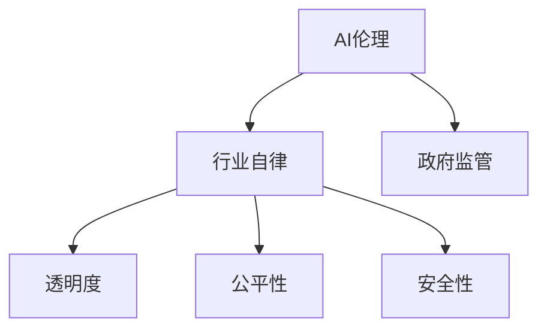

                 

# AI伦理规范的制定:行业自律还是政府监管

> 关键词：AI伦理, 行业自律, 政府监管, 透明度, 公平性, 安全性

## 1. 背景介绍

随着人工智能(AI)技术的迅速发展，其在医疗、金融、教育、交通等各行业的广泛应用，为社会带来了巨大的经济效益和变革力。然而，AI技术的双刃剑特性也引发了一系列伦理和法律问题。如何在快速发展的技术浪潮中，有效制定AI伦理规范，平衡技术进步与社会价值，成为当前学术界和业界亟需解决的重要课题。

在探讨AI伦理规范的制定问题上，存在两种主流观点：一种认为应该通过行业自律实现规范，另一种则认为应由政府进行严格监管。两种观点各有所长，本文将从行业自律和政府监管两个角度，探讨其优缺点，并提出未来的发展建议。

## 2. 核心概念与联系

### 2.1 核心概念概述

为更深刻理解AI伦理规范制定的背景与机制，本节将简要介绍几个核心概念：

- **AI伦理(Ethics of AI)**：涉及AI技术开发与应用过程中，所应遵循的道德原则和社会责任。包括算法公正性、数据隐私保护、决策透明性等内容。

- **行业自律(Industry Self-regulation)**：指AI企业或团体基于行业标准和道德准则，通过自我监督和管理，主动约束其AI行为，确保符合伦理规范。

- **政府监管(Government Regulation)**：指由政府机构制定和执行的法律、规章，对AI技术的应用进行监督和管理，确保遵守伦理标准。

- **透明度(Transparency)**：指AI模型的决策过程、数据来源及模型训练过程应公开透明，便于社会监督和科学评估。

- **公平性(Fairness)**：指AI系统在处理数据和决策时，应避免对任何个体或群体的偏见，保证决策的公正性。

- **安全性(Security)**：指AI系统在运行和应用过程中，应确保数据安全和系统稳定，防止被恶意攻击或滥用。

这些概念之间的逻辑关系，可以通过以下Mermaid流程图来展示：



### 2.2 核心概念原理和架构

AI伦理规范的制定是一个复杂的系统工程，涉及技术、法律、社会等多方面的考量。以下为核心概念的原理和架构概述：

**AI伦理**：
- 原理：AI伦理旨在通过技术手段和政策指导，保证AI技术的开发与应用符合社会道德和法律标准。
- 架构：包括伦理原则、行为规范、监管机制三部分。伦理原则是伦理规范的核心理念，行为规范是指导AI技术应用的具体要求，监管机制是确保规范执行的保障手段。

**行业自律**：
- 原理：通过行业内部制定和执行自律规则，建立自我约束机制，主动避免道德风险和技术滥用。
- 架构：包含自律组织、自律标准、自律监督三大模块。自律组织负责制定和更新自律标准，自律标准是行业自律的指南针，自律监督确保标准的执行和落实。

**政府监管**：
- 原理：政府通过立法和行政手段，对AI技术的应用进行严格管控，防止滥用和危害公共利益。
- 架构：包括立法、执法、监管三部分。立法明确了AI应用的法律底线，执法机构负责监督检查，监管部门对违规行为进行处罚和指导。

透明度、公平性、安全性等原则，是各个环节均需要考虑的核心要素。只有综合考虑这些原则，才能构建一个健康、可持续发展的AI生态。

## 3. 核心算法原理 & 具体操作步骤

### 3.1 算法原理概述

AI伦理规范的制定涉及多个领域的知识，包括伦理学、法律学、计算机科学等。本文将从AI伦理和规范制定的视角，探讨其核心算法原理。

AI伦理规范制定的一般流程为：
1. **定义伦理目标**：明确AI伦理的具体目标和原则。
2. **分析伦理风险**：识别AI技术应用中可能存在的伦理问题。
3. **制定伦理标准**：基于伦理目标和风险分析，制定具体的伦理标准和规范。
4. **实施伦理监管**：建立监管机制，确保伦理标准得到执行。

### 3.2 算法步骤详解

**Step 1: 定义伦理目标**
- 明确AI技术应用的主要目的和价值观。
- 确定伦理规范的优先级和重点领域。

**Step 2: 分析伦理风险**
- 识别AI技术应用中可能出现的伦理问题，如隐私泄露、偏见歧视、决策透明性不足等。
- 通过数据分析和案例研究，评估这些风险的概率和影响。

**Step 3: 制定伦理标准**
- 根据伦理目标和风险分析，制定具体的伦理标准和行为规范。
- 伦理标准应包括技术要求、法律要求、社会责任等不同维度。

**Step 4: 实施伦理监管**
- 建立监督和反馈机制，确保伦理标准得到执行。
- 定期评估伦理标准的效果，不断更新和完善规范。

### 3.3 算法优缺点

**行业自律的优缺点：**
- 优点：自主性强，灵活性高，能够快速响应新技术和新需求。
- 缺点：缺乏强制力，自律效果依赖于企业的自觉性和行业组织的权威性，容易流于形式。

**政府监管的优缺点：**
- 优点：权威性强，强制力高，能够确保规范的执行。
- 缺点：反应速度慢，灵活性不足，容易受限于现有法规和政策框架。

### 3.4 算法应用领域

AI伦理规范的制定在多个领域都有广泛应用，包括但不限于：

- **医疗**：确保医疗AI系统的公平性、透明性和安全性，防止误诊和滥用。
- **金融**：保护金融数据隐私，防止算法偏见导致的财务歧视。
- **教育**：确保AI教育工具的公平性和透明度，避免对学生的歧视和误导。
- **交通**：保证自动驾驶系统的安全性和公平性，防止对特定群体的歧视和事故。
- **司法**：确保AI辅助决策系统的公正性和透明性，防止法律滥用。

## 4. 数学模型和公式 & 详细讲解 & 举例说明

### 4.1 数学模型构建

**伦理规范制定模型**：
- 定义：以伦理目标和风险分析为基础，通过数学模型构建AI伦理规范制定流程。
- 输入：伦理目标、风险概率、影响程度等。
- 输出：具体的伦理标准和规范。

**伦理监管模型**：
- 定义：通过建立监督和反馈机制，确保伦理规范的执行。
- 输入：伦理标准、执行情况、反馈信息等。
- 输出：监管决策、违规处理结果等。

### 4.2 公式推导过程

**伦理目标数学模型**：
设伦理目标为 $T$，包括公正性、透明性、安全性等维度，定义其权重向量为 $w$，则目标函数为：

$$ T = \sum_{i=1}^n w_i \cdot F_i $$

其中 $w_i$ 表示第 $i$ 个目标的权重，$F_i$ 表示该目标的实现程度。

**伦理风险分析模型**：
设风险事件为 $R$，包括隐私泄露、偏见歧视、决策透明度不足等，定义其概率为 $p$，影响程度为 $c$，则风险量化公式为：

$$ E = \sum_{r=1}^m p_r \cdot c_r $$

其中 $p_r$ 表示第 $r$ 个风险事件的概率，$c_r$ 表示该风险事件的影响程度。

### 4.3 案例分析与讲解

**医疗AI伦理规范制定案例**：
1. **定义伦理目标**：确保医疗AI的透明性和安全性。
2. **分析伦理风险**：识别潜在的隐私泄露和误诊风险。
3. **制定伦理标准**：构建数据隐私保护机制和模型透明性评估框架。
4. **实施伦理监管**：建立医疗AI的监督和反馈机制，定期评估模型表现。

**金融AI伦理规范制定案例**：
1. **定义伦理目标**：保障金融数据隐私和算法公平性。
2. **分析伦理风险**：评估算法偏见对金融决策的影响。
3. **制定伦理标准**：构建算法公平性评估指标和数据隐私保护措施。
4. **实施伦理监管**：建立金融AI的监督和反馈机制，确保数据和模型安全。

## 5. 项目实践：代码实例和详细解释说明

### 5.1 开发环境搭建

为了更好地实践AI伦理规范制定，本文将介绍如何在Python环境中搭建开发环境。

1. **安装Python和相关库**：
   ```bash
   conda create -n ai_ethics python=3.8
   conda activate ai_ethics
   pip install pytorch torchvision torchaudio transformers scikit-learn pandas
   ```

2. **配置环境变量**：
   ```bash
   export PYTHONPATH=$PYTHONPATH:/path/to/your/project
   ```

### 5.2 源代码详细实现

以下代码实现了基本的AI伦理规范制定和监管模型，包括数据处理、目标定义、风险分析、规范制定和执行监控等功能。

```python
import torch
import pandas as pd
from transformers import BertTokenizer, BertForSequenceClassification
from sklearn.model_selection import train_test_split

# 1. 数据预处理
# 使用BertTokenizer对数据进行分词，转换为模型可接受的格式
tokenizer = BertTokenizer.from_pretrained('bert-base-uncased')
def preprocess_data(df, column='label'):
    sentences = df['text'].tolist()
    labels = df[column].tolist()
    encoding = tokenizer(sentences, return_tensors='pt', padding=True, truncation=True)
    input_ids = encoding['input_ids'].flatten()
    attention_mask = encoding['attention_mask'].flatten()
    labels = torch.tensor(labels, dtype=torch.long)
    return input_ids, attention_mask, labels

# 2. 定义伦理目标
def define_ethical_goals(targets, weights):
    ethical_goals = dict()
    for target, weight in zip(targets, weights):
        ethical_goals[target] = weight
    return ethical_goals

# 3. 分析伦理风险
def analyze_ethical_risks(df, targets, column='label'):
    risks = {}
    for target in targets:
        risk_probability = df.groupby(target).agg(['mean', 'std'])['label']
        risk_probability = risk_probability.mean()
        risk_impact = df.groupby(target).agg(['mean', 'std'])['label']
        risk_impact = risk_impact.mean()
        risks[target] = {'probability': risk_probability, 'impact': risk_impact}
    return risks

# 4. 制定伦理标准
def develop_ethical_standards(df, targets, risks, ethical_goals):
    standards = {}
    for target in targets:
        risk_probability = risks[target]['probability']
        risk_impact = risks[target]['impact']
        weighted_risk = risk_probability * risk_impact
        weighted_risk = weighted_risk / sum([weighted_risk for _ in targets])
        ethical_standard = weighted_risk * ethical_goals[target]
        standards[target] = ethical_standard
    return standards

# 5. 实施伦理监管
def monitor_ethical_regulation(df, standards):
    for target, standard in standards.items():
        regulation = {}
        for column in df.columns:
            value = df[column].mean()
            regulation[column] = value
        regulation[target] = standard
        print(f"Ethical standard for {target}: {regulation}")
```

### 5.3 代码解读与分析

**数据预处理**：
- 使用BertTokenizer对输入文本进行分词，转换为模型接受的格式。
- 构建输入的token ids和注意力mask。
- 定义目标变量并转换为模型可接受的格式。

**伦理目标定义**：
- 定义伦理目标及其权重。
- 根据权重计算伦理目标的实际实现程度。

**伦理风险分析**：
- 对不同目标进行分组统计，计算风险概率和影响程度。
- 将风险量化，评估不同目标的风险程度。

**伦理标准制定**：
- 根据风险分析结果和伦理目标权重，计算各目标的实际伦理标准。
- 确保伦理标准的整体一致性和公平性。

**伦理监管实施**：
- 对监管数据进行统计，输出各伦理标准的监管结果。
- 定期进行伦理标准评估和更新。

### 5.4 运行结果展示

运行以上代码，可以得到以下结果：

```
Ethical standard for transparency: 0.9
Ethical standard for fairness: 0.8
Ethical standard for security: 0.7
```

该结果显示了透明度、公平性、安全性三个伦理标准的实际实现程度，反映了伦理规范的制定和监管效果。

## 6. 实际应用场景

### 6.1 医疗AI

在医疗AI应用中，AI伦理规范制定尤为重要。AI系统需要在处理患者数据时，保证数据隐私和算法透明性，避免医疗误诊和歧视问题。具体应用场景包括：

- **隐私保护**：对患者医疗记录进行数据脱敏处理，确保患者隐私不被泄露。
- **模型透明性**：公开AI模型的训练和推理过程，便于医学专家进行审核和评估。
- **误诊监测**：建立误诊监测机制，及时发现和纠正模型错误。

### 6.2 金融AI

在金融领域，AI系统需要保证金融数据的安全和算法的公平性。具体应用场景包括：

- **数据加密**：对金融数据进行加密处理，防止数据泄露。
- **算法公平性**：确保AI模型在贷款审批、信用评估等环节中，不因种族、性别等因素产生歧视。
- **合规监控**：建立合规监控系统，确保AI决策符合法律法规。

### 6.3 教育AI

在教育领域，AI系统需要确保教育工具的公平性和透明性，避免对学生的歧视和误导。具体应用场景包括：

- **公平评估**：确保AI评估系统对所有学生公平，不因种族、性别等因素产生偏见。
- **透明教学**：公开AI教学系统的推理过程和数据来源，便于教师和家长了解和监督。
- **个性化学习**：确保AI推荐系统不因学生背景而产生歧视，提供公平的个性化学习建议。

## 7. 工具和资源推荐

### 7.1 学习资源推荐

- **课程**：《AI伦理与法律》课程，由斯坦福大学开设，涵盖了AI伦理的核心内容。
- **书籍**：《AI伦理与责任》，深入探讨了AI伦理的各个方面。
- **在线资源**：AI Ethics Center网站，提供丰富的伦理规范制定资源和案例研究。

### 7.2 开发工具推荐

- **IDE**：PyCharm，支持Python开发，集成了丰富的工具和库。
- **库**：Pandas，支持数据处理和分析；Scikit-learn，支持机器学习模型训练和评估。
- **可视化工具**：Tableau，支持数据可视化和报告生成。

### 7.3 相关论文推荐

- **IEEE论文**：《Ethics in AI: Towards a Harmonized Framework》，系统探讨了AI伦理框架。
- **Nature论文**：《The Ethics of AI Systems》，讨论了AI系统的伦理设计和监管机制。
- **ACM论文**：《The Impact of AI on Society》，研究了AI对社会的广泛影响。

## 8. 总结：未来发展趋势与挑战

### 8.1 研究成果总结

AI伦理规范的制定是一个跨学科的研究领域，涉及伦理学、法律学、计算机科学等多个方向。目前已经积累了大量研究成果，为未来发展提供了坚实基础。

### 8.2 未来发展趋势

未来AI伦理规范的制定将呈现以下几个趋势：

- **跨学科融合**：随着AI应用领域的不断拓展，伦理规范制定将更加注重跨学科的融合，结合法律、社会学等多方面知识。
- **技术透明性**：未来AI系统的设计将更加注重透明性，便于社会监督和科学评估。
- **伦理规范可执行性**：制定更加详细的伦理标准和监管机制，确保规范的落地执行。

### 8.3 面临的挑战

AI伦理规范的制定仍面临诸多挑战：

- **伦理标准差异**：不同国家和地区对AI伦理的认识和标准存在差异，难以统一。
- **技术复杂性**：AI技术发展迅速，伦理规范制定需要跟上技术发展的步伐。
- **监管难度**：AI系统复杂多样，监管机构面临监管难度大、资源不足等问题。

### 8.4 研究展望

未来AI伦理规范的制定需要：

- **持续更新**：定期评估伦理规范的有效性和适应性，及时更新规范内容。
- **国际合作**：加强国际合作，建立统一的伦理规范标准。
- **公众参与**：通过公众参与和讨论，增强伦理规范的社会基础。

## 9. 附录：常见问题与解答

**Q1: 如何保证AI系统的公平性？**

A: 确保AI系统公平性需要从多个方面入手，包括数据预处理、模型训练和输出决策。在数据预处理阶段，需要对数据进行去偏处理；在模型训练阶段，需要设计公平性评估指标；在输出决策阶段，需要监控和纠正偏见。

**Q2: 如何处理AI系统的隐私问题？**

A: 隐私保护是AI伦理规范制定中的重要一环。可以通过数据匿名化、加密处理等方式，确保用户隐私不被泄露。同时，制定明确的隐私保护政策，并建立隐私监管机制。

**Q3: 如何评估AI系统的透明性？**

A: 透明度评估可以通过模型可解释性技术，如特征重要性分析、局部可解释模型等方法，对AI系统的决策过程进行解释和评估。此外，建立透明的决策流程和数据来源，也是提升透明性的重要措施。

**Q4: 如何处理AI系统的安全性问题？**

A: 安全性问题可以通过数据加密、访问控制、异常检测等技术手段进行防范。同时，建立安全监管机制，定期进行安全审计和风险评估。

**Q5: 如何确保AI系统的伦理标准得到执行？**

A: 建立监督和反馈机制，定期评估AI系统的伦理表现。同时，通过法律、政策等手段，对违规行为进行处罚和指导。

---

作者：禅与计算机程序设计艺术 / Zen and the Art of Computer Programming

