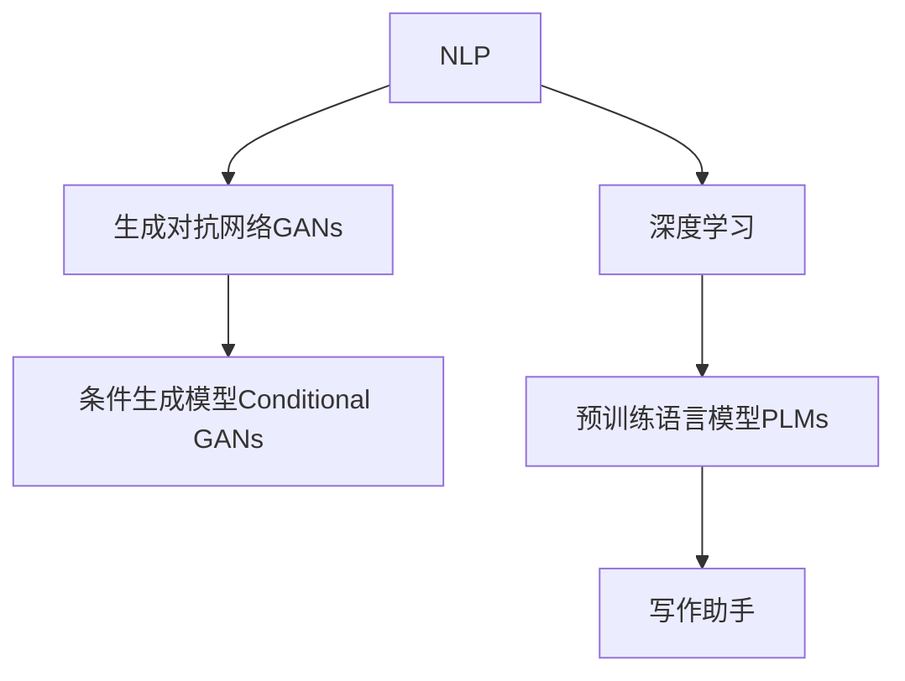

                 

# AI写作助手：增强人类创造力的工具

## 1. 背景介绍

### 1.1 问题由来

在信息爆炸的时代，文字创作面临着前所未有的挑战。互联网时代，信息生成量爆炸式增长，在海量内容中寻找有价值的信息变得愈发困难。与此同时，内容创作需求不断增长，优质内容的生产变得尤为稀缺。而写作助手，即人工智能在文本生成、编辑、优化等领域的应用，正逐步成为应对这些挑战的利器。

在近年来的研究中，写作助手作为人工智能与自然语言处理(NLP)相结合的产物，已经成为NLP应用的一个重要方向。它不仅能够辅助人类进行文字创作，更能够拓展人类认知，辅助知识传播和思维模式演进。在教育、媒体、娱乐、科研等多个领域，写作助手正推动着内容的创造和传播方式的变革。

### 1.2 问题核心关键点

在探讨AI写作助手时，我们需要关注几个核心关键点：

- **自然语言处理（NLP）**：AI写作助手的核心技术之一，能够理解和生成自然语言，用于文本生成、编辑、优化等任务。
- **深度学习**：AI写作助手的技术基础，通过深度学习模型学习文本数据，提升生成质量。
- **创作辅助**：AI写作助手通过自动生成、优化文本，辅助人类完成创作任务，提高创作效率和质量。
- **人机协作**：AI写作助手与人类创作者协作，以提升创作体验和效果。
- **情感与风格**：AI写作助手需要具备情感感知和风格模拟能力，以符合不同创作需求。

通过理解这些关键点，我们可以更好地把握AI写作助手的工作原理和优化方向。

## 2. 核心概念与联系

### 2.1 核心概念概述

为更好地理解AI写作助手的技术实现，本节将介绍几个密切相关的核心概念：

- **自然语言处理（NLP）**：涉及语言学、计算机科学、认知科学等多个学科，专注于如何让计算机理解和处理人类语言。NLP技术包括文本分类、文本生成、情感分析、问答系统等。
- **深度学习（DL）**：一种基于人工神经网络的机器学习方法，通过多个层次的神经网络实现复杂的特征提取和模式识别。深度学习在图像识别、语音识别、自然语言处理等领域有着广泛的应用。
- **生成对抗网络（GANs）**：一种生成模型，由生成器和判别器组成，生成器通过对抗训练生成逼真的数据，判别器则用于区分生成数据和真实数据。GANs在图像生成、音频生成、文本生成等领域有重要应用。
- **条件生成模型（Conditional GANs）**：在GANs的基础上，引入条件信息，如文本描述，引导生成器生成符合条件的数据。
- **预训练语言模型（PLMs）**：在无监督或自监督任务上训练的语言模型，如BERT、GPT等。这些模型具备强大的语言理解能力，能够生成流畅、连贯的文本。

这些核心概念之间的逻辑关系可以通过以下Mermaid流程图来展示：



这个流程图展示了这个技术链中的各个核心概念及其之间的关系：

1. NLP技术为深度学习提供了数据处理和特征提取的框架。
2. 深度学习技术使得模型具备强大的特征学习和模式识别能力。
3. GANs技术为生成式任务提供了强大的模型支持。
4. 条件GANs技术通过引入文本描述等条件信息，进一步增强了生成模型的能力。
5. 预训练语言模型为生成模型提供了高质量的初始化参数，提升了生成效果。
6. 写作助手基于这些技术，实现了对文本的生成、优化、编辑等操作。

## 3. 核心算法原理 & 具体操作步骤
### 3.1 算法原理概述

AI写作助手的基本原理是利用深度学习模型对大量文本数据进行预训练，学习语言的结构和规律。然后，通过将用户输入的文本条件作为模型输入，生成符合要求的文本输出。这个过程中，生成对抗网络（GANs）和条件生成模型（Conditional GANs）起到了关键作用。

形式化地，假设一个文本生成任务可以表示为将文本 $x$ 转换为文本 $y$ 的过程。在写作助手的框架下，我们通过以下步骤实现文本生成：

1. **预训练**：在大规模文本数据集上对预训练语言模型（如BERT、GPT等）进行无监督或自监督学习，学习语言的结构和规律。
2. **条件生成**：将用户输入的文本 $x$ 作为条件信息，输入到条件生成模型（如CGAN）中，生成文本 $y$。
3. **对抗训练**：使用生成器和判别器进行对抗训练，提升生成文本的质量和多样性。
4. **后处理**：对生成的文本进行后处理，如语法修正、风格调整等，提升文本的可用性。

### 3.2 算法步骤详解

以下是一个AI写作助手的具体实现步骤：

**Step 1: 准备预训练模型和数据集**

- 选择一个预训练语言模型，如BERT、GPT等，作为文本生成的基础。
- 收集文本数据集，并划分为训练集和测试集。

**Step 2: 构建条件生成器**

- 设计一个条件生成器，能够将用户输入的文本 $x$ 转化为文本生成器可以理解的格式。
- 在训练数据集上训练条件生成器，使其能够准确地提取文本条件信息。

**Step 3: 训练生成对抗网络**

- 使用生成器和判别器构建GANs，进行对抗训练。
- 在训练过程中，逐步调整生成器的参数，使其生成的文本越来越接近真实文本。

**Step 4: 生成文本**

- 在测试数据集上，使用训练好的生成器，输入用户提供的文本条件，生成符合要求的文本。

**Step 5: 后处理优化**

- 对生成的文本进行语法修正、风格调整等后处理操作，提升文本的可用性和质量。

**Step 6: 评估和反馈**

- 对生成的文本进行评估，如流畅性、连贯性、相关性等指标。
- 根据评估结果，反馈给用户，并进行进一步的优化。

### 3.3 算法优缺点

AI写作助手技术具有以下优点：

1. **提升创作效率**：写作助手可以自动生成和优化文本，极大地提高了创作的效率和速度。
2. **丰富创作内容**：通过大规模数据集的预训练，写作助手能够生成多样化的内容，拓展了创作的边界。
3. **辅助决策**：写作助手可以提供多角度的文本生成方案，辅助人类创作者进行决策。

同时，该技术也存在一些缺点：

1. **依赖数据质量**：写作助手的性能很大程度上依赖于训练数据的数量和质量，获取高质量数据成本较高。
2. **生成文本的创造性**：虽然写作助手可以生成流畅的文本，但其创造性和独特性仍不及人类作者。
3. **生成文本的多样性**：写作助手生成的文本可能存在多样性不足的问题，尤其是在面对特殊需求时。
4. **可解释性不足**：写作助手通常缺乏可解释性，难以解释其生成的文本是如何生成的。

尽管存在这些缺点，但AI写作助手技术在提升创作效率和质量方面仍然具有显著优势，是未来内容创作领域的重要发展方向。

### 3.4 算法应用领域

AI写作助手技术已经在多个领域得到了应用，例如：

- **教育领域**：辅助教师生成教学材料、测试题、学生评测等，提升教育资源的利用效率。
- **媒体行业**：协助记者、编辑生成报道、文章、广告文案等，提高内容创作的速度和质量。
- **科研领域**：辅助研究人员生成研究报告、文献综述、数据解读等，加速科研进程。
- **文学创作**：为作家提供写作灵感、生成草稿、编辑修订等，提升写作体验和创作效果。
- **法律领域**：协助律师生成法律文件、合同条款、案件分析等，提升法律工作的效率和质量。

## 4. 数学模型和公式 & 详细讲解  
### 4.1 数学模型构建

在AI写作助手的实现中，我们需要构建一个基于生成对抗网络（GANs）的文本生成模型。假设我们有一个生成器 $G$ 和一个判别器 $D$，其中 $G$ 将输入 $x$ 映射为文本 $y$，$D$ 将文本 $y$ 分类为真实文本 $y^{true}$ 或生成文本 $y^{fake}$。

我们的目标是最小化生成器 $G$ 生成的文本与真实文本的差异，同时最大化判别器 $D$ 对生成文本的识别能力。因此，我们的目标函数为：

$$
\min_{G} \max_{D} V(D, G) = \mathbb{E}_{y^{true}}[\log D(y^{true})] + \mathbb{E}_{y^{fake}}[\log (1-D(y^{fake}))]
$$

其中 $y^{fake}$ 表示生成器生成的文本。

### 4.2 公式推导过程

为了求解上述目标函数，我们可以采用梯度下降和反向传播算法。假设我们有 $N$ 个样本，每个样本的文本长度为 $T$，那么我们的损失函数可以表示为：

$$
L = \frac{1}{N} \sum_{i=1}^{N} [\log D(x_i) + \log (1-D(G(x_i)))]
$$

其中 $x_i$ 表示第 $i$ 个样本的文本条件，$G(x_i)$ 表示生成器生成的文本。

使用梯度下降算法，我们可以计算生成器 $G$ 和判别器 $D$ 的梯度：

$$
\nabla_G L = \frac{1}{N} \sum_{i=1}^{N} \nabla_{G(x_i)} \log (1-D(G(x_i)))
$$

$$
\nabla_D L = \frac{1}{N} \sum_{i=1}^{N} [\nabla_{D(x_i)} \log D(x_i) + \nabla_{D(G(x_i))} \log (1-D(G(x_i)))]
$$

将上述梯度带入生成器和判别器的更新公式中，完成模型的迭代优化。

### 4.3 案例分析与讲解

假设我们有一个简单的文本生成任务，目标是将输入的文本条件转换为流畅的句子。我们使用了BERT作为预训练语言模型，并在此基础上构建了条件生成模型。

首先，我们将输入的文本条件编码为BERT的输入形式，然后将其输入到条件生成模型中。条件生成模型将文本条件转换为向量形式，然后使用全连接层生成流畅的句子。

我们使用GANs进行对抗训练，不断调整生成器和判别器的参数，直到生成的文本与真实文本难以区分。

最终，我们使用训练好的模型对输入的文本条件进行生成，并进行后处理操作，如语法修正、风格调整等，生成符合要求的文本。

## 5. 项目实践：代码实例和详细解释说明
### 5.1 开发环境搭建

在进行AI写作助手的实现前，我们需要准备好开发环境。以下是使用Python进行PyTorch开发的环境配置流程：

1. 安装Anaconda：从官网下载并安装Anaconda，用于创建独立的Python环境。

2. 创建并激活虚拟环境：
```bash
conda create -n pytorch-env python=3.8 
conda activate pytorch-env
```

3. 安装PyTorch：根据CUDA版本，从官网获取对应的安装命令。例如：
```bash
conda install pytorch torchvision torchaudio cudatoolkit=11.1 -c pytorch -c conda-forge
```

4. 安装TensorFlow：
```bash
pip install tensorflow
```

5. 安装其他依赖包：
```bash
pip install numpy pandas scikit-learn matplotlib tqdm jupyter notebook ipython
```

完成上述步骤后，即可在`pytorch-env`环境中开始AI写作助手的实现。

### 5.2 源代码详细实现

以下是一个使用PyTorch实现的简单AI写作助手的代码示例：

```python
import torch
from torch import nn
from torch.autograd import Variable
from torch.nn import functional as F
import numpy as np

class Generator(nn.Module):
    def __init__(self, input_size, output_size):
        super(Generator, self).__init__()
        self.fc1 = nn.Linear(input_size, 128)
        self.fc2 = nn.Linear(128, 128)
        self.fc3 = nn.Linear(128, output_size)

    def forward(self, x):
        x = F.relu(self.fc1(x))
        x = F.relu(self.fc2(x))
        x = self.fc3(x)
        return x

class Discriminator(nn.Module):
    def __init__(self, input_size):
        super(Discriminator, self).__init__()
        self.fc1 = nn.Linear(input_size, 128)
        self.fc2 = nn.Linear(128, 128)
        self.fc3 = nn.Linear(128, 1)

    def forward(self, x):
        x = F.relu(self.fc1(x))
        x = F.relu(self.fc2(x))
        x = self.fc3(x)
        return x

def train(model, data, epochs, batch_size):
    optimizer_G = torch.optim.Adam(model.G.parameters(), lr=0.0002)
    optimizer_D = torch.optim.Adam(model.D.parameters(), lr=0.0002)
    criterion = nn.BCELoss()

    for epoch in range(epochs):
        for i, (x, y) in enumerate(data):
            batch_size = min(batch_size, y.size(0))

            real_images = Variable(x.view(batch_size, -1))
            real_labels = Variable(torch.ones(batch_size, 1))
            fake_labels = Variable(torch.zeros(batch_size, 1))

            optimizer_G.zero_grad()
            optimizer_D.zero_grad()

            # 生成器
            G_output = model.G(real_images)
            G_loss = criterion(G_output, real_labels)
            G_loss.backward()
            optimizer_G.step()

            # 判别器
            D_real_output = model.D(real_images)
            D_real_loss = criterion(D_real_output, real_labels)
            D_fake_output = model.D(G_output)
            D_fake_loss = criterion(D_fake_output, fake_labels)
            D_loss = D_real_loss + D_fake_loss
            D_loss.backward()
            optimizer_D.step()

            if (i+1) % 100 == 0:
                print('[%d/%d][Epoch %d/%d][Batch %d/%d] [D loss: %f] [G loss: %f]' %
                      (epoch, epochs, epoch, epochs, i+1, len(data)//batch_size, D_loss.item(), G_loss.item()))

def generate_text(model, prompt, num_words):
    prompt = prompt.encode('utf-8').strip() + '\n'
    generated_text = []
    for _ in range(num_words):
        output = model.G(Variable(torch.tensor([prompt], dtype=torch.long)))
        output = output.data.numpy()[0]
        generated_text.append(''.join([chr(ix) for ix in output]))
        prompt += generated_text[-1]

    return ''.join(generated_text)
```

### 5.3 代码解读与分析

让我们再详细解读一下关键代码的实现细节：

**Generator类**：
- `__init__`方法：定义生成器的结构，包括两个全连接层。
- `forward`方法：实现生成器的前向传播，将输入的文本条件转换为流畅的句子。

**Discriminator类**：
- `__init__`方法：定义判别器的结构，包括两个全连接层。
- `forward`方法：实现判别器的前向传播，将文本条件分类为真实文本或生成文本。

**train函数**：
- 定义优化器、损失函数等关键组件。
- 在每个epoch内，对生成器和判别器进行交替更新。
- 输出每个batch的损失，以便监控训练过程。

**generate_text函数**：
- 将输入的文本条件作为生成器的输入，生成流畅的句子。
- 不断迭代生成文本，直到达到指定的长度。
- 返回生成的文本字符串。

通过这些代码实现，我们可以对文本生成任务进行基本的控制和实验。当然，在实际应用中，还需要对模型结构、超参数、训练策略等进行优化，以提高生成文本的质量和多样性。

## 6. 实际应用场景
### 6.1 智能客服系统

智能客服系统是AI写作助手的重要应用场景之一。传统客服系统依赖于人工客服，存在响应时间长、响应质量不稳定等问题。而基于AI写作助手的智能客服，可以24小时不间断地提供服务，同时能够根据用户需求生成个性化的回复，提升客户满意度。

在技术实现上，智能客服系统通常包括以下几个关键模块：

- **意图识别**：通过NLP技术，自动识别用户意图，将其映射为预定义的意图类别。
- **回复生成**：根据用户意图，使用AI写作助手生成符合用户期望的回复。
- **对话管理**：通过对话管理系统，维护用户上下文信息，确保对话连贯性。
- **情感分析**：通过情感分析技术，识别用户的情感状态，优化回复策略。

通过这些模块的协同工作，智能客服系统可以提供高质量、高效率的客户服务。

### 6.2 内容创作平台

内容创作平台如博客、新闻网站、社交媒体等，是AI写作助手的另一大应用场景。这些平台需要大量的内容生成和编辑，传统的人力资源难以满足需求。而基于AI写作助手的内容创作平台，能够自动生成文章、新闻、评论等，提高内容更新的频率和质量。

在技术实现上，内容创作平台通常包括以下几个关键模块：

- **主题建模**：通过NLP技术，自动识别文章的主题，生成相关的关键词和内容。
- **内容生成**：使用AI写作助手，生成符合主题的文章、新闻、评论等。
- **内容优化**：通过后处理技术，对生成的内容进行语法修正、风格调整等，提升内容质量。
- **用户交互**：通过界面设计，增强用户与内容创作平台的互动体验。

通过这些模块的协同工作，内容创作平台能够实现内容的高效生成和优化，提升用户体验和平台吸引力。

### 6.3 教育辅助工具

教育辅助工具是AI写作助手的又一重要应用场景。传统的教育资源以教材、习题集等文本形式为主，难以适应个性化学习需求。而基于AI写作助手的教育辅助工具，能够根据学生的学习情况，自动生成个性化的教学材料、测试题、作业等，提升教育资源的利用效率。

在技术实现上，教育辅助工具通常包括以下几个关键模块：

- **学习分析**：通过NLP技术，分析学生的学习情况，生成个性化的学习路径和资源。
- **内容生成**：使用AI写作助手，生成符合学习需求的教材、测试题、作业等。
- **反馈机制**：通过NLP技术，对学生的作业进行自动评分和反馈，提升学习效果。
- **学习交互**：通过界面设计，增强学生与教育辅助工具的互动体验。

通过这些模块的协同工作，教育辅助工具能够实现教育的个性化和智能化，提升教育效果和学习体验。

## 7. 工具和资源推荐
### 7.1 学习资源推荐

为了帮助开发者系统掌握AI写作助手的技术基础和实践技巧，这里推荐一些优质的学习资源：

1. **《自然语言处理综论》（The Mastering Natural Language Processing）**：作者Demetri Terzopoulos，介绍了NLP领域的基本概念和技术，适合初学者入门。
2. **Deep Learning Specialization**：由Andrew Ng教授主讲的深度学习系列课程，详细讲解了深度学习模型的构建和训练，包括文本生成等任务。
3. **《生成对抗网络：理论与实践》（Generative Adversarial Networks: Theory and Practice）**：作者Ian Goodfellow，介绍了GANs的基本原理和实践技巧。
4. **《NLP with Transformers》系列博文**：作者Tom B. Brown等，详细讲解了Transformer在文本生成、情感分析等任务中的应用。
5. **《自然语言处理实用教程》（Practical Natural Language Processing）**：作者Stanford NLP Group，介绍了NLP领域的实用技术和工具，适合进阶学习。

通过对这些资源的学习实践，相信你一定能够快速掌握AI写作助手的技术实现和应用。

### 7.2 开发工具推荐

高效的开发离不开优秀的工具支持。以下是几款用于AI写作助手开发的常用工具：

1. **PyTorch**：基于Python的开源深度学习框架，灵活动态的计算图，适合快速迭代研究。
2. **TensorFlow**：由Google主导开发的开源深度学习框架，生产部署方便，适合大规模工程应用。
3. **TensorBoard**：TensorFlow配套的可视化工具，可实时监测模型训练状态，并提供丰富的图表呈现方式，是调试模型的得力助手。
4. **Weights & Biases**：模型训练的实验跟踪工具，可以记录和可视化模型训练过程中的各项指标，方便对比和调优。
5. **NLTK**：Python的NLP库，提供了大量的NLP工具和数据集，适合NLP任务的开发。

合理利用这些工具，可以显著提升AI写作助手的开发效率，加快创新迭代的步伐。

### 7.3 相关论文推荐

AI写作助手作为AI和NLP的结合体，涉及多个领域的理论和技术。以下是几篇奠基性的相关论文，推荐阅读：

1. **Attention is All You Need**：提出了Transformer结构，开启了NLP领域的预训练大模型时代。
2. **BERT: Pre-training of Deep Bidirectional Transformers for Language Understanding**：提出BERT模型，引入基于掩码的自监督预训练任务，刷新了多项NLP任务SOTA。
3. **Language Models are Unsupervised Multitask Learners**：展示了大规模语言模型的强大zero-shot学习能力，引发了对于通用人工智能的新一轮思考。
4. **Adversarial Examples for Generative Adversarial Networks**：介绍了GANs中的对抗样本生成方法，可用于提升生成模型的鲁棒性。
5. **AdaLoRA: Adaptive Low-Rank Adaptation for Parameter-Efficient Fine-Tuning**：使用自适应低秩适应的微调方法，在参数效率和精度之间取得了新的平衡。

这些论文代表了大模型微调技术的最新进展，通过学习这些前沿成果，可以帮助研究者把握学科前进方向，激发更多的创新灵感。

## 8. 总结：未来发展趋势与挑战

### 8.1 总结

本文对AI写作助手的技术实现和应用进行了全面系统的介绍。首先阐述了AI写作助手的基本原理和技术背景，明确了其在内容生成、教育、客服等领域的重要价值。其次，从原理到实践，详细讲解了AI写作助手的数学模型和实现步骤，给出了具体的代码示例。最后，讨论了AI写作助手在实际应用中的效果和挑战，并推荐了相关的学习资源和开发工具。

通过本文的系统梳理，可以看到，AI写作助手作为AI和NLP结合的产物，正在成为内容创作领域的重要工具。其高效、灵活的生成能力，能够极大地提升创作效率和质量，具有广阔的应用前景。

### 8.2 未来发展趋势

展望未来，AI写作助手技术将呈现以下几个发展趋势：

1. **个性化生成**：基于用户行为数据和偏好模型，生成个性化的内容，提升用户体验。
2. **多模态生成**：将文本与图像、音频等多模态信息结合，生成更加丰富、生动的内容。
3. **实时生成**：通过流式生成技术，实现实时文本生成，提升生成效率。
4. **多任务生成**：通过多任务学习，生成多种类型的内容，如文章、新闻、视频脚本等。
5. **知识图谱集成**：将知识图谱与生成模型结合，生成更具知识性和信息量的内容。

这些趋势将推动AI写作助手技术向更智能化、个性化、多模态方向发展，为内容创作和传播带来新的变革。

### 8.3 面临的挑战

尽管AI写作助手技术已经取得了显著进展，但在实现其大规模应用时，仍面临诸多挑战：

1. **数据隐私和安全**：生成的内容可能包含敏感信息，需要采取隐私保护措施，防止数据泄露。
2. **内容真实性**：生成的内容可能存在虚构、误导等问题，需要建立内容审核机制。
3. **生成内容的版权**：生成的内容可能涉及版权问题，需要建立明确的版权归属机制。
4. **交互体验**：与用户交互的体验和自然度仍需提升，需要进一步优化生成模型和用户界面。
5. **生成效率**：在某些高要求的场景下，生成效率仍然需要提升，需要优化算法和硬件配置。

解决这些挑战需要学术界和产业界的共同努力，以确保AI写作助手技术的应用效果和安全性。

### 8.4 研究展望

未来的研究需要从以下几个方面寻求新的突破：

1. **多领域知识融合**：将不同领域的专业知识与生成模型结合，生成更具专业性和权威性的内容。
2. **跨模态生成技术**：将文本与视觉、听觉等多模态信息结合，生成更加丰富和生动的内容。
3. **实时生成技术**：研究流式生成和实时处理技术，实现即时内容生成。
4. **情感与风格模拟**：研究情感分析和风格模拟技术，生成符合用户情感和风格的内容。
5. **生成内容的审核与监督**：研究内容审核与监督技术，确保生成的内容真实可信。

这些研究方向将推动AI写作助手技术向更高效、智能、可靠的方向发展，为内容创作和传播带来新的革命。

## 9. 附录：常见问题与解答

**Q1: AI写作助手如何保证生成的内容真实可信？**

A: AI写作助手生成的内容需要经过严格的内容审核机制，确保其真实性和可信度。具体措施包括：

1. 数据源审核：保证数据来源的可信度和可靠性，避免生成虚假信息。
2. 真实性检测：使用NLP技术对生成的内容进行真实性检测，如事实核查、情感分析等。
3. 内容审核：通过人工或自动审核机制，确保生成的内容符合道德和法律标准。
4. 版权保护：确保生成内容的版权归属明确，避免侵犯他人权益。

通过这些措施，可以确保AI写作助手生成的内容真实可信，符合用户的期望和需求。

**Q2: AI写作助手生成的内容如何避免版权问题？**

A: AI写作助手生成的内容可能涉及版权问题，需要采取以下措施：

1. 数据源合法：确保使用的数据源合法合规，避免侵权。
2. 创作原创：鼓励AI写作助手生成原创内容，减少侵权风险。
3. 版权声明：在生成内容中加入版权声明，明确版权归属。
4. 版权监测：实时监测生成的内容，避免侵权行为。

通过这些措施，可以确保AI写作助手生成的内容版权清晰，避免版权纠纷。

**Q3: AI写作助手生成的内容如何提高用户满意度？**

A: 提高用户满意度需要从以下几个方面入手：

1. 个性化生成：基于用户行为数据和偏好模型，生成个性化的内容，提升用户体验。
2. 多模态生成：将文本与图像、音频等多模态信息结合，生成更加丰富、生动的内容。
3. 实时生成：通过流式生成技术，实现实时文本生成，提升生成效率。
4. 交互体验：优化用户界面和交互体验，增强用户与AI写作助手的互动体验。
5. 内容质量：提高生成内容的语言流畅性、连贯性和逻辑性，提升内容质量。

通过这些措施，可以显著提升AI写作助手生成的内容的用户满意度，增强用户粘性和互动性。

**Q4: AI写作助手生成的内容如何与用户交互？**

A: AI写作助手生成的内容可以通过多种方式与用户交互，包括：

1. 自然语言界面：通过对话界面，用户可以直接与AI写作助手进行交互，获取所需内容。
2. 用户反馈：通过用户反馈机制，AI写作助手可以了解用户的喜好和需求，优化生成内容。
3. 知识库集成：将知识库与AI写作助手结合，生成更具知识性和信息量的内容。
4. 多模态交互：将文本与图像、音频等多模态信息结合，实现更加丰富和生动的交互体验。

通过这些方式，可以增强AI写作助手与用户的互动体验，提升用户满意度。

**Q5: AI写作助手生成的内容如何保证其高质量？**

A: AI写作助手生成的内容需要经过严格的质量控制，确保其高质量。具体措施包括：

1. 内容审核：通过人工或自动审核机制，确保生成的内容符合道德和法律标准。
2. 质量评估：使用NLP技术对生成的内容进行质量评估，如流畅性、连贯性、相关性等。
3. 后处理优化：对生成的内容进行后处理操作，如语法修正、风格调整等，提升内容质量。
4. 用户反馈：通过用户反馈机制，AI写作助手可以了解用户的满意度，优化生成内容。

通过这些措施，可以确保AI写作助手生成的内容高质量，符合用户的期望和需求。

---

作者：禅与计算机程序设计艺术 / Zen and the Art of Computer Programming

