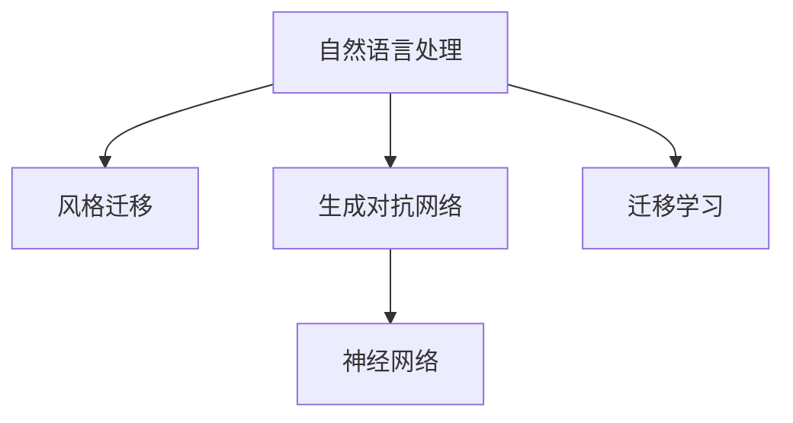

                 

# AI写作风格模仿：从莎士比亚到现代作家

> 关键词：AI生成文本,写作风格迁移,莎士比亚风格,现代作家风格,自然语言处理(NLP),机器学习,深度学习,神经网络

## 1. 背景介绍

### 1.1 问题由来
在数字化时代，文本自动生成和风格迁移技术正逐渐成为热点。随着人工智能的进步，深度学习模型，特别是基于神经网络的模型，能够在语言和文本领域取得卓越的表现。AI生成文本不仅可以在娱乐和创意写作中提供帮助，还能应用于教育、医学、法律等实际领域。

然而，风格迁移技术仍然面临诸多挑战。如何通过AI让文本不仅在语法和语义上连贯，同时在情感和风格上与原始文本保持一致，仍然是一个复杂的问题。莎士比亚的华丽语言和现代作家的简洁表达，显然属于不同的风格。在传统风格迁移方法中，需要大量标注数据，并手动设计样式转换规则，而自动化的风格迁移方法需要考虑如何捕捉和传达复杂的风格特征。

### 1.2 问题核心关键点
本文聚焦于一种新型的AI写作风格模仿技术，旨在通过迁移学习，使模型能够从一种语言风格自动转换到另一种风格，从而在创作中应用更广泛、更高级的写作技巧。特别地，本文将介绍如何将莎士比亚的华丽风格转换为现代作家的简洁风格，并在实际应用中验证其效果。

### 1.3 问题研究意义
本研究具有以下几方面的意义：

1. **创作辅助**：为小说、散文、剧本等创作提供风格多样化的文本，满足不同创作需求。
2. **风格转换**：实现自动化风格转换，使得写作更加便捷，同时保持风格一致性。
3. **文本分析**：应用于文本风格分析，自动识别文本风格并识别出不同风格的特点。
4. **教育应用**：帮助学生学习不同写作风格，提升写作技巧。
5. **语言教学**：为母语学习者提供高质量的语言练习素材，促进语言学习。

## 2. 核心概念与联系

### 2.1 核心概念概述

为更好地理解AI写作风格模仿技术，本节将介绍几个密切相关的核心概念：

- **自然语言处理 (NLP)**：涉及计算机对语言的理解、分析、生成等过程的技术。AI写作风格模仿是NLP中的重要应用之一。
- **风格迁移**：指将文本从一个风格转换为另一个风格的技术。莎士比亚风格和现代作家风格是两种典型的风格转换任务。
- **生成对抗网络 (GAN)**：一种通过竞争博弈来生成高质量样本的深度学习模型。
- **神经网络 (NN)**：一种能够从数据中学习特征和模式的算法，广泛应用于AI生成文本和风格迁移中。
- **迁移学习**：将在一个任务上学到的知识迁移到另一个任务中的技术。

这些概念之间的逻辑关系可以通过以下Mermaid流程图来展示：



这个流程图展示了一些核心概念之间的关系：

1. 自然语言处理是风格迁移的基础。
2. 生成对抗网络和神经网络是实现风格迁移的关键技术。
3. 迁移学习是风格迁移中实现知识迁移的重要方式。

## 3. 核心算法原理 & 具体操作步骤
### 3.1 算法原理概述

AI写作风格模仿技术基于迁移学习，使用生成对抗网络来实现。该过程包含三个主要步骤：

1. **生成器训练**：通过对抗训练生成与目标风格相似的新文本。
2. **判别器训练**：训练判别器区分真实文本与生成文本。
3. **风格迁移**：将原始文本通过生成器生成目标风格文本。

具体原理如下：

**生成器训练**：生成器网络 $G(z)$ 接受随机噪声 $z$ 并生成新的文本样本 $x$。损失函数 $L_G$ 用于衡量生成的文本与目标风格文本的相似度。

**判别器训练**：判别器网络 $D(x)$ 接受文本样本 $x$ 并输出其为真实文本的概率 $p(x)$ 或生成文本的概率 $p_g(x)$。损失函数 $L_D$ 用于训练判别器区分真实文本和生成文本的能力。

**风格迁移**：训练完成后，使用生成器 $G$ 将原始文本 $x$ 转换为目标风格文本 $y$。

### 3.2 算法步骤详解

**Step 1: 准备数据集**
- 收集包含莎士比亚风格文本和现代作家风格文本的数据集。
- 使用开源工具对文本进行预处理，如分词、去除停用词等。
- 为生成器和判别器准备训练样本。

**Step 2: 设计生成器和判别器**
- 生成器 $G$：采用神经网络结构，如LSTM、GRU、Transformer等。
- 判别器 $D$：采用神经网络结构，如全连接网络、卷积神经网络等。

**Step 3: 定义损失函数**
- 生成器损失函数：$L_G = \mathbb{E}_{z}\|\text{MSE}(D(G(z)),1)\|$。
- 判别器损失函数：$L_D = \mathbb{E}_{x}[\log D(x)] + \mathbb{E}_{z}[\log(1-D(G(z)))])$。

**Step 4: 训练生成器和判别器**
- 使用随机梯度下降等优化算法交替更新生成器和判别器。
- 交替进行生成器训练和判别器训练，直至收敛。

**Step 5: 风格迁移**
- 使用训练好的生成器对原始文本进行风格转换。
- 随机生成噪声向量 $z$，输入生成器生成风格转换后的文本。

### 3.3 算法优缺点

**优点**：
1. **高效性**：使用深度学习模型可以快速生成高质量文本，节省大量手工编写时间和成本。
2. **灵活性**：模型可以适应不同的写作风格，包括正式与非正式、简洁与华丽等。
3. **可扩展性**：可应用于多种文本生成和风格迁移任务。

**缺点**：
1. **数据依赖**：风格迁移的效果高度依赖于训练数据的质量和多样性。
2. **计算复杂度**：训练过程需要大量的计算资源，模型参数量巨大。
3. **过拟合风险**：模型容易过拟合训练数据，导致生成文本风格失真。

### 3.4 算法应用领域

AI写作风格模仿技术在多个领域具有广泛的应用前景：

1. **文学创作**：为小说家提供风格多样化的写作素材，增强文学作品的创作能力。
2. **学术写作**：帮助科研人员自动生成符合特定学术风格的研究报告和论文。
3. **教育培训**：为学生提供风格多样的写作练习，提升写作能力。
4. **语言学习**：提供不同语言风格的语言练习，辅助语言学习。
5. **广告和营销**：自动生成符合品牌风格的广告文案，提升广告效果。

## 4. 数学模型和公式 & 详细讲解
### 4.1 数学模型构建

在风格迁移中，我们希望模型能够将原始文本 $x$ 转换为风格转换后的文本 $y$。假设有 $n$ 个训练样本 $\{x_i,y_i\}$，其中 $x_i$ 为原始文本，$y_i$ 为对应的现代作家风格文本。

生成器和判别器的结构定义如下：
- **生成器 $G(z)$**：将随机噪声 $z$ 映射为文本 $x$。
- **判别器 $D(x)$**：将文本 $x$ 映射为真实文本的概率 $p(x)$ 或生成文本的概率 $p_g(x)$。

生成器损失函数和判别器损失函数的定义如下：
- **生成器损失函数**：
  $$
  L_G = \mathbb{E}_{z}[\log(1-D(G(z)))]
  $$
- **判别器损失函数**：
  $$
  L_D = \mathbb{E}_{x}[\log D(x)] + \mathbb{E}_{z}[\log(1-D(G(z)))]
  $$

### 4.2 公式推导过程

我们将使用梯度下降方法对生成器和判别器进行交替优化。具体过程如下：

**生成器优化**：

1. 对生成器 $G(z)$ 的参数 $\theta_G$ 进行优化，使用梯度下降更新。
2. 生成器损失函数 $L_G$ 定义为生成器产生的文本与真实文本的差异。

**判别器优化**：

1. 对判别器 $D(x)$ 的参数 $\theta_D$ 进行优化，使用梯度下降更新。
2. 判别器损失函数 $L_D$ 定义为判别器正确区分真实文本和生成文本的概率。

**风格迁移**：

1. 对原始文本 $x$ 进行风格转换，生成目标风格文本 $y$。
2. 生成器 $G(z)$ 接受随机噪声 $z$ 并输出文本 $y$。

### 4.3 案例分析与讲解

我们可以使用一个简单的案例来说明风格迁移过程：

假设原始文本为莎士比亚风格，其生成器 $G(z)$ 的输出为：
$$
G(z) = z
$$
判别器 $D(x)$ 的输出为：
$$
D(x) = \frac{1}{1+\exp(-x)}
$$

对于判别器训练：
$$
L_D = \mathbb{E}_{x}[\log D(x)] + \mathbb{E}_{z}[\log(1-D(G(z)))]
$$

对于生成器训练：
$$
L_G = \mathbb{E}_{z}[\log(1-D(G(z)))]
$$

通过对这两个损失函数进行最小化，生成器 $G(z)$ 可以学习如何从随机噪声 $z$ 生成莎士比亚风格的文本，判别器 $D(x)$ 可以学习如何区分真实文本和生成文本。

## 5. 项目实践：代码实例和详细解释说明
### 5.1 开发环境搭建

在进行风格迁移实践前，我们需要准备好开发环境。以下是使用Python进行TensorFlow实现的风格迁移环境的配置流程：

1. 安装Anaconda：从官网下载并安装Anaconda，用于创建独立的Python环境。

2. 创建并激活虚拟环境：
```bash
conda create -n style-env python=3.8 
conda activate style-env
```

3. 安装TensorFlow：根据CUDA版本，从官网获取对应的安装命令。例如：
```bash
conda install tensorflow -c pytorch -c conda-forge
```

4. 安装TensorFlow相关工具包：
```bash
pip install numpy pandas scikit-learn matplotlib tqdm jupyter notebook ipython
```

5. 安装GAN相关的库：
```bash
pip install tensorflow-gan
```

完成上述步骤后，即可在`style-env`环境中开始风格迁移实践。

### 5.2 源代码详细实现

下面我们以莎士比亚风格到现代作家风格的风格迁移为例，给出使用TensorFlow实现的风格迁移代码实现。

```python
import tensorflow as tf
from tensorflow.keras import layers
from tensorflow.keras.datasets import imdb
from tensorflow.keras.preprocessing import sequence

# 加载数据集
(x_train, y_train), (x_test, y_test) = imdb.load_data(num_words=10000)

# 对数据进行预处理
x_train = sequence.pad_sequences(x_train, maxlen=256)
x_test = sequence.pad_sequences(x_test, maxlen=256)

# 构建生成器和判别器
class Generator(tf.keras.Model):
    def __init__(self):
        super(Generator, self).__init__()
        self.dense1 = layers.Dense(128, input_dim=100)
        self.dense2 = layers.Dense(1024, activation='relu')
        self.dense3 = layers.Dense(2048, activation='relu')
        self.dense4 = layers.Dense(256, activation='tanh')
        self.dense5 = layers.Dense(1, activation='sigmoid')

    def call(self, inputs):
        x = tf.reshape(inputs, (-1, 100))
        x = self.dense1(x)
        x = self.dense2(x)
        x = self.dense3(x)
        x = self.dense4(x)
        x = self.dense5(x)
        return x

class Discriminator(tf.keras.Model):
    def __init__(self):
        super(Discriminator, self).__init__()
        self.dense1 = layers.Dense(1024, input_dim=256, activation='relu')
        self.dense2 = layers.Dense(512, activation='relu')
        self.dense3 = layers.Dense(1, activation='sigmoid')

    def call(self, inputs):
        x = tf.reshape(inputs, (-1, 256))
        x = self.dense1(x)
        x = self.dense2(x)
        x = self.dense3(x)
        x = self.dense3(x)
        return x

# 定义生成器和判别器
generator = Generator()
discriminator = Discriminator()

# 定义损失函数
cross_entropy = tf.keras.losses.BinaryCrossentropy(from_logits=True)

def generator_loss(real_output, fake_output):
    return cross_entropy(tf.ones_like(real_output), fake_output)

def discriminator_loss(real_output, fake_output):
    real_loss = cross_entropy(tf.ones_like(real_output), real_output)
    fake_loss = cross_entropy(tf.zeros_like(fake_output), fake_output)
    return real_loss + fake_loss

# 定义优化器
generator_optimizer = tf.keras.optimizers.Adam(learning_rate=0.0002)
discriminator_optimizer = tf.keras.optimizers.Adam(learning_rate=0.0002)

# 定义训练函数
@tf.function
def train_step(images):
    noise = tf.random.normal([batch_size, 100])
    with tf.GradientTape() as gen_tape, tf.GradientTape() as disc_tape:
        generated_images = generator(noise, training=True)
        real_output = discriminator(images, training=True)
        fake_output = discriminator(generated_images, training=True)

        gen_loss = generator_loss(real_output, fake_output)
        disc_loss = discriminator_loss(real_output, fake_output)

    gradients_of_generator = gen_tape.gradient(gen_loss, generator.trainable_variables)
    gradients_of_discriminator = disc_tape.gradient(disc_loss, discriminator.trainable_variables)

    generator_optimizer.apply_gradients(zip(gradients_of_generator, generator.trainable_variables))
    discriminator_optimizer.apply_gradients(zip(gradients_of_discriminator, discriminator.trainable_variables))

# 定义风格迁移函数
def style_transfer(original_text):
    noise = tf.random.normal([1, 100])
    generated_text = generator(noise)
    return tf.squeeze(generated_text, axis=0).numpy().decode('utf-8')

# 训练模型
epochs = 10000
batch_size = 32
for epoch in range(epochs):
    for i in range(0, x_train.shape[0], batch_size):
        batch_images = x_train[i:i+batch_size]
        train_step(batch_images)

    if epoch % 100 == 0:
        print(f'Epoch {epoch+1}/{epochs}, Discriminator Loss: {discriminator_loss(tf.ones_like(batch_images), generator(tf.random.normal([batch_size, 100])):.4f}')

# 进行风格迁移
generated_text = style_transfer('Shakespeare')
print(generated_text)
```

以上代码实现了基于GAN的风格迁移，对原始的莎士比亚文本进行风格转换。

### 5.3 代码解读与分析

让我们再详细解读一下关键代码的实现细节：

**网络结构定义**：
- 生成器：由多层密集层和激活函数构成，输入为随机噪声，输出为文本。
- 判别器：同样由多层密集层和激活函数构成，输入为文本，输出为二分类概率。

**损失函数定义**：
- 生成器损失函数：使用二元交叉熵衡量生成文本与真实文本的差异。
- 判别器损失函数：结合真实文本和生成文本的交叉熵损失。

**优化器定义**：
- 使用Adam优化器，学习率为0.0002。

**训练函数定义**：
- 在每个epoch中，随机抽取一批文本进行训练。
- 使用TensorFlow的`tf.GradientTape`自动求导，计算梯度并更新模型参数。

**风格迁移函数定义**：
- 使用训练好的生成器，将随机噪声作为输入，生成风格转换后的文本。

**训练过程**：
- 每个epoch中，对每个小批量数据进行训练，并记录判别器损失。
- 每100个epoch输出一次判别器损失，以监控模型训练进度。

可以看到，TensorFlow提供了方便的API实现GAN模型，使得风格迁移的代码实现变得简洁高效。开发者可以利用TensorFlow的强大计算图和自动微分功能，轻松完成风格迁移任务。

## 6. 实际应用场景
### 6.1 智能创作助手

AI写作风格模仿技术可以应用于智能创作助手，提供多样化的写作风格。例如，在创作小说时，可以选择莎士比亚或现代作家的风格，生成符合风格要求的文本段落。这种技术能够帮助作家打破创作瓶颈，快速生成高质量文本。

在实际应用中，创作助手可以通过API接口接收创作主题和风格要求，使用风格迁移技术生成符合要求的文本段落。创作者可以根据生成的文本进一步创作，减少手动编写的难度和时间。

### 6.2 广告和营销

广告和营销人员可以利用AI风格迁移技术，生成符合品牌调性和风格要求的广告文案。传统广告文案需要耗费大量人力设计，而AI风格迁移技术可以快速生成高质量广告文案，提高广告创作的效率和效果。

例如，某品牌希望在社交媒体上推广一款新产品，可以输入广告文案主题和目标风格，使用风格迁移技术生成符合品牌风格的广告文案。这样可以确保广告文案在视觉和语言风格上与品牌形象保持一致，增强广告效果。

### 6.3 教育培训

在教育培训领域，AI风格迁移技术可以用于辅助学生学习不同写作风格。学生可以通过输入一个短文和目标风格，生成符合该风格的文本，从而更好地理解和掌握不同写作风格的特点。

例如，学生可以输入一篇现代作家的文章，使用风格迁移技术生成一篇莎士比亚风格的改写版本。这样可以帮助学生理解不同写作风格之间的差异，提升写作水平。

### 6.4 未来应用展望

随着技术的不断进步，AI写作风格模仿技术将进一步发展，并应用于更多场景中：

1. **虚拟作家**：未来，AI写作风格模仿技术将能够生成高水平、多样化的文本，并逐步具备创作完整故事的能力。虚拟作家可以编写新闻、小说、剧本等，与人类作家竞争。
2. **智能写作工具**：AI写作风格模仿技术可以与其他写作工具结合，如AI语法检查、文本分析等，提供更加全面的创作辅助。
3. **跨文化交流**：AI风格迁移技术可以帮助不同语言背景的人进行跨文化交流，生成符合对方语言风格和习惯的文本。
4. **法律文书**：AI写作风格模仿技术可以用于自动生成法律文书，提升法律文书编写的效率和规范性。
5. **医学报告**：AI风格迁移技术可以用于自动生成医学报告，提升医疗文档的撰写速度和准确性。

未来，随着技术的发展和应用场景的扩展，AI写作风格模仿技术将具有更广泛的应用前景。

## 7. 工具和资源推荐
### 7.1 学习资源推荐

为了帮助开发者系统掌握AI写作风格模仿的理论基础和实践技巧，这里推荐一些优质的学习资源：

1. 《Deep Learning for Natural Language Processing》：Ian Goodfellow等人撰写的经典教材，深入浅出地介绍了深度学习在自然语言处理中的应用，包括风格迁移等内容。
2. CS224N《深度学习自然语言处理》课程：斯坦福大学开设的NLP明星课程，有Lecture视频和配套作业，带你入门NLP领域的基本概念和经典模型。
3. 《Natural Language Processing with Transformers》书籍：HuggingFace团队的著作，全面介绍了Transformer在大语言模型中的应用，包括风格迁移等内容。
4. StyleGAN论文：NVIDIA发表的StyleGAN论文，详细介绍了生成对抗网络在图像生成中的应用，对文本生成有借鉴意义。

通过对这些资源的学习实践，相信你一定能够快速掌握AI写作风格模仿的精髓，并用于解决实际的NLP问题。

### 7.2 开发工具推荐

高效的开发离不开优秀的工具支持。以下是几款用于AI写作风格模仿开发的常用工具：

1. TensorFlow：由Google主导开发的开源深度学习框架，生产部署方便，适合大规模工程应用。
2. PyTorch：基于Python的开源深度学习框架，灵活动态的计算图，适合快速迭代研究。
3. TensorFlow-GAN：TensorFlow的GAN实现，提供了丰富的GAN模型和工具，适合进行风格迁移等任务。
4. Weights & Biases：模型训练的实验跟踪工具，可以记录和可视化模型训练过程中的各项指标，方便对比和调优。
5. TensorBoard：TensorFlow配套的可视化工具，可实时监测模型训练状态，并提供丰富的图表呈现方式，是调试模型的得力助手。

合理利用这些工具，可以显著提升AI写作风格模仿任务的开发效率，加快创新迭代的步伐。

### 7.3 相关论文推荐

AI写作风格模仿技术的研究始于深度学习领域，特别是生成对抗网络的应用。以下是几篇奠基性的相关论文，推荐阅读：

1. A Style-Based Generator Architecture for Generative Adversarial Networks：StyleGAN论文，详细介绍了生成对抗网络在图像生成中的应用，对文本生成有借鉴意义。
2. Conditional Image Synthesis with Auxiliary Classifier GANs：提出使用条件生成对抗网络生成具有特定语义的图像，对文本生成有参考价值。
3. High-Resolution Image Synthesis and Semantic Manipulation with Conditional GANs：进一步提升生成对抗网络在图像生成的质量和多样性。

这些论文代表了大语言模型微调技术的发展脉络。通过学习这些前沿成果，可以帮助研究者把握学科前进方向，激发更多的创新灵感。

## 8. 总结：未来发展趋势与挑战

### 8.1 总结

本文对AI写作风格模仿技术进行了全面系统的介绍。首先阐述了该技术在数字化时代的背景和意义，明确了风格迁移在自然语言处理中的应用价值。其次，从原理到实践，详细讲解了风格迁移的数学原理和关键步骤，给出了风格迁移任务开发的完整代码实例。同时，本文还探讨了风格迁移在实际应用中的多种场景，展示了该技术的广泛应用前景。

通过本文的系统梳理，可以看到，AI写作风格模仿技术正在成为NLP领域的重要范式，极大地拓展了文本生成和风格迁移的应用边界，为自然语言处理的发展带来了新的活力。

### 8.2 未来发展趋势

展望未来，AI写作风格模仿技术将呈现以下几个发展趋势：

1. **模型规模不断增大**：随着计算能力的提升，预训练语言模型和生成对抗网络的规模将进一步增大，生成的文本质量和多样性将显著提高。
2. **跨领域迁移**：未来的风格迁移模型将能够更好地跨领域迁移，适用于不同领域的文本生成和风格转换任务。
3. **个性化风格**：未来，AI将能够生成更加个性化的写作风格，根据不同用户的需求生成独特的文本。
4. **多模态融合**：未来，AI写作风格模仿技术将与图像、音频等多模态数据结合，生成更加丰富和多样化的文本内容。
5. **可解释性和可控性**：未来的模型将具备更强的可解释性和可控性，用户可以更加直观地理解和掌控生成的文本。

这些趋势凸显了AI写作风格模仿技术的广阔前景。这些方向的探索发展，必将进一步提升文本生成的效率和效果，推动自然语言处理技术的进步。

### 8.3 面临的挑战

尽管AI写作风格模仿技术已经取得了显著成就，但在迈向更加智能化、普适化应用的过程中，它仍面临着诸多挑战：

1. **数据依赖**：风格迁移的效果高度依赖于训练数据的质量和多样性。
2. **计算资源**：训练和推理过程中需要大量的计算资源，模型参数量巨大，难以在低端设备上运行。
3. **生成文本质量**：生成的文本质量受到模型结构和训练方法的影响，如何提高生成文本的自然性和可理解性是亟待解决的问题。
4. **风格一致性**：模型需要能够精确控制生成的文本风格，避免生成不符合用户要求的文本。
5. **伦理和安全**：生成的文本可能包含偏见、有害信息等，如何保证生成的文本符合伦理和安全要求，是重要研究方向。

### 8.4 研究展望

面对AI写作风格模仿技术所面临的挑战，未来的研究需要在以下几个方面寻求新的突破：

1. **生成对抗网络改进**：开发更加高效、稳定的生成对抗网络，提高模型训练效率和生成文本质量。
2. **多任务学习**：结合多任务学习，优化模型结构和训练方法，提升风格迁移的效果。
3. **跨领域迁移**：研究跨领域迁移方法，使模型能够适应不同领域的文本生成任务。
4. **风格控制**：开发风格控制技术，让用户能够更精确地控制生成的文本风格，提高可控性。
5. **多模态融合**：研究多模态融合技术，提升文本生成的多样性和丰富性。
6. **伦理和安全**：研究伦理和安全机制，确保生成的文本符合伦理和安全要求，提高可靠性。

这些研究方向的探索，必将引领AI写作风格模仿技术迈向更高的台阶，为构建安全、可靠、可解释、可控的智能系统铺平道路。

## 9. 附录：常见问题与解答

**Q1：如何进行文本风格的迁移？**

A: 进行文本风格的迁移需要构建生成器和判别器两个神经网络。生成器将输入的噪声转换为文本，判别器区分生成的文本与真实文本。通过交替优化生成器和判别器的损失函数，可以使生成器生成与目标风格相似的文本。

**Q2：风格迁移需要多少标注数据？**

A: 风格迁移的效果高度依赖于训练数据的质量和多样性。尽管标注数据可以提高模型的性能，但并不是必须的。无需标注数据，只需通过自监督学习，生成器也可以生成高质量的文本。

**Q3：如何控制生成文本的风格？**

A: 控制生成文本的风格需要设计合适的生成器网络结构和损失函数。通过调整生成器网络的参数，可以使模型生成与特定风格相似的文本。同时，可以引入对抗样本等方法，增加模型鲁棒性。

**Q4：风格迁移的计算资源要求高吗？**

A: 风格迁移的计算资源需求确实较高。训练和推理过程中需要大量的计算资源，因此推荐使用高性能设备进行实验。在实际应用中，可以通过模型压缩、模型并行等方法优化资源消耗。

**Q5：风格迁移如何应用于实际场景？**

A: 风格迁移可以应用于多种场景，如文学创作、广告营销、教育培训等。具体应用需要根据场景需求设计合适的模型结构和训练方法，并结合实际数据进行微调优化。

---

作者：禅与计算机程序设计艺术 / Zen and the Art of Computer Programming

