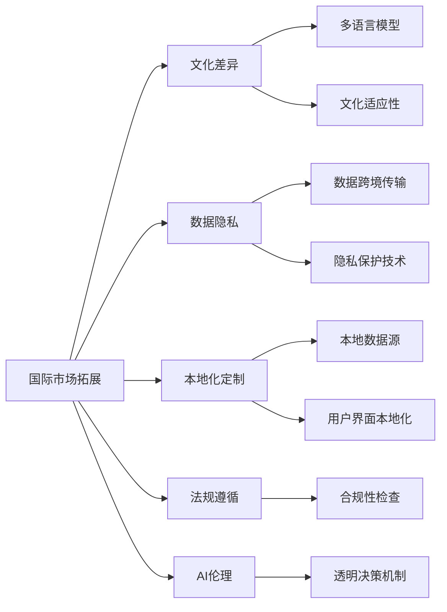

                 

# AI创业的国际化挑战：Lepton AI的应对之策

> 关键词：国际市场拓展, 文化差异, 数据隐私, 本地化定制, 法规遵循, AI伦理

## 1. 背景介绍

随着全球化进程的加速，越来越多的AI创业公司在寻求国际市场拓展的同时，面临着全新的挑战。这不仅包括语言、文化、法规等外部环境因素，更涉及数据隐私、用户体验、市场准入等内在要素。本文以Lepton AI为例，深入探讨AI创业公司如何应对国际化挑战，实现全球化布局。

## 2. 核心概念与联系

### 2.1 核心概念概述

为了深入理解Lepton AI如何应对国际化挑战，我们首先需要介绍几个关键概念：

- **国际市场拓展**：指AI创业公司将业务扩展到其他国家或地区，以实现市场份额的增长和客户基础的扩大。
- **文化差异**：不同国家和地区在语言、习惯、价值观等方面存在显著差异，这直接影响AI系统的设计、开发和应用。
- **数据隐私**：在全球数据保护法规日益严格的背景下，如何合法、合规地收集和使用数据是AI公司面临的重要问题。
- **本地化定制**：针对目标市场的需求，对AI系统进行本地化调整，以提高用户体验和市场适应性。
- **法规遵循**：包括但不限于数据保护法、隐私法、劳动法等，AI公司必须确保其运营符合当地法律要求。
- **AI伦理**：随着AI技术的普及，伦理问题如偏见、歧视、决策透明度等变得愈发重要，需要在全球范围内进行规范和监管。

这些概念通过以下Mermaid流程图关联起来，展示了Lepton AI国际化过程中需考虑的主要环节：



这个流程图说明了Lepton AI在国际化过程中需考虑的各个方面，以及如何通过技术和策略应对这些挑战。

## 3. 核心算法原理 & 具体操作步骤
### 3.1 算法原理概述

Lepton AI的国际化挑战主要集中在数据处理、模型定制和法规遵守三个方面。以下将逐一介绍这些方面的算法原理和具体操作步骤。

### 3.2 算法步骤详解

#### 数据处理

**步骤1: 数据收集与预处理**

国际市场的多样性要求Lepton AI收集多种语言和不同文化背景的数据，并进行预处理以去除噪音和异常值。预处理步骤包括：

- 数据清洗：去除重复数据、错误数据和无效数据。
- 特征工程：选择和构造适合目标市场的特征，例如不同文化下的情感表达差异。
- 数据增强：通过对数据进行多种形式的扩充，以增强模型的泛化能力。

**步骤2: 数据跨境传输**

由于不同国家的数据保护法规不同，Lepton AI需要在确保数据合规的前提下，进行数据的跨境传输。具体操作步骤包括：

- 数据匿名化：确保数据在传输过程中无法识别个人身份。
- 加密传输：使用端到端加密技术保护数据传输过程中的安全。
- 合规性检查：定期检查数据处理流程，确保符合目标市场的法律和法规要求。

#### 模型定制

**步骤1: 多语言模型**

为了适应不同语言和文化背景的用户，Lepton AI开发了多语言模型，包括英文、中文、西班牙语等。具体操作步骤包括：

- 语言选择：根据目标市场的语言分布选择合适的语言模型。
- 模型微调：在目标市场的少量数据上对预训练模型进行微调，以适应本地语言特征。
- 语言转换：在模型推理时，将输入转换为模型训练时的语言格式。

**步骤2: 本地化定制**

不同文化背景下的用户对AI系统的功能和界面有不同的需求。因此，Lepton AI需要对模型进行本地化定制，以提高用户接受度和满意度。具体操作步骤包括：

- 用户界面本地化：根据目标市场的文化习惯调整UI设计。
- 功能定制：根据用户需求定制模型功能，如特定区域的天气查询功能。
- 用户体验优化：通过A/B测试等方式，不断优化用户体验，提高用户满意度。

#### 法规遵守

**步骤1: 合规性检查**

Lepton AI通过定期进行合规性检查，确保其运营符合目标市场的法律法规要求。具体操作步骤包括：

- 法律法规学习：定期更新团队对相关法律法规的了解。
- 合规性审计：通过内部和外部审计，确保数据处理和业务运营符合法律法规。
- 问题上报：一旦发现合规问题，及时上报并采取措施解决。

**步骤2: 隐私保护**

在处理用户数据时，Lepton AI采取多种隐私保护技术，以确保数据安全和个人隐私不被侵犯。具体操作步骤包括：

- 数据脱敏：对敏感数据进行去标识化处理。
- 访问控制：限制对敏感数据的访问权限，确保只有授权人员才能查看。
- 加密存储：对存储中的数据进行加密，防止未经授权的访问。

### 3.3 算法优缺点

**优点**

- **市场扩展**：通过多语言模型和本地化定制，Lepton AI能够在全球范围内拓展市场，增加用户基础。
- **用户体验**：本地化定制和用户界面本地化提高了用户满意度，增强了产品竞争力。
- **合规性强**：严格的合规性检查和隐私保护技术确保了公司在国际市场上的合法运营。

**缺点**

- **成本高**：多语言模型和本地化定制需要投入大量时间和资源。
- **技术复杂**：隐私保护和数据跨境传输涉及复杂的技术实现和合规检查。
- **文化差异**：不同文化背景下用户对AI系统的理解和需求存在差异，需要持续优化和调整。

### 3.4 算法应用领域

Lepton AI的国际化策略涵盖了NLP、计算机视觉、自动驾驶等多个AI应用领域，具体如下：

- **NLP**：支持多语言文本处理、情感分析、机器翻译等任务，满足全球用户的需求。
- **计算机视觉**：开发适用于不同市场的图像识别和分类模型，如美食推荐系统中的视觉特征提取。
- **自动驾驶**：根据不同国家和地区的交通规则，定制自动驾驶系统，确保安全合规。

## 4. 数学模型和公式 & 详细讲解 & 举例说明

### 4.1 数学模型构建

Lepton AI在国际化过程中，使用了多种数学模型和算法，包括多语言模型、本地化定制模型、隐私保护技术等。以下将详细讲解这些模型的构建过程。

#### 多语言模型

假设我们有两个语言，分别为英文和中文。在构建多语言模型时，我们采用如下数学模型：

$$ M = [M_{en}, M_{zh}] $$

其中 $M_{en}$ 和 $M_{zh}$ 分别代表英文和中文的语言模型。

### 4.2 公式推导过程

#### 多语言模型公式推导

对于每个语言 $L$，我们使用神经网络模型 $M_L$ 进行训练，得到模型参数 $\theta_L$。

$$ M_L = f_{\theta_L}(x_L) $$

对于输入 $x_L$，我们通过模型 $M_L$ 得到输出 $y_L$，并计算损失函数 $L$。

$$ L = \frac{1}{N} \sum_{i=1}^N \ell(y_i, \hat{y}_i) $$

其中 $\ell$ 为损失函数，$y_i$ 为真实标签，$\hat{y}_i$ 为模型预测结果。

### 4.3 案例分析与讲解

**案例1: 情感分析**

Lepton AI在构建情感分析模型时，使用了BERT模型作为基础。通过在目标市场的少量数据上对预训练的BERT模型进行微调，得到了适用于该市场的情感分析模型。具体步骤如下：

1. 收集目标市场的情感标注数据集，包含大量正面、负面和中性情感标注的文本。
2. 使用BERT模型对数据进行预训练，得到预训练模型参数 $\theta_{pre}$。
3. 在目标市场的少量数据上对预训练模型进行微调，得到微调模型参数 $\theta_{fin}$。
4. 使用微调模型对新文本进行情感分析，输出情感标签。

## 5. 项目实践：代码实例和详细解释说明

### 5.1 开发环境搭建

为了进行Lepton AI的国际化实践，我们需要搭建一个包括Python、PyTorch、Flask等工具的开发环境。

```bash
# 安装Python和PyTorch
pip install python==3.8 torch torchvision torchaudio transformers

# 安装Flask
pip install flask
```

### 5.2 源代码详细实现

以下是一个简单的代码示例，展示了如何使用PyTorch进行多语言情感分析模型的微调。

```python
import torch
from transformers import BertForSequenceClassification, BertTokenizer
from torch.utils.data import Dataset, DataLoader

class CustomDataset(Dataset):
    def __init__(self, texts, labels):
        self.texts = texts
        self.labels = labels
        self.tokenizer = BertTokenizer.from_pretrained('bert-base-uncased')

    def __len__(self):
        return len(self.texts)

    def __getitem__(self, idx):
        text = self.texts[idx]
        label = self.labels[idx]
        encoding = self.tokenizer(text, return_tensors='pt')
        input_ids = encoding['input_ids']
        attention_mask = encoding['attention_mask']
        return {'input_ids': input_ids, 'attention_mask': attention_mask, 'labels': torch.tensor(label)}

# 加载数据集
train_dataset = CustomDataset(train_texts, train_labels)
test_dataset = CustomDataset(test_texts, test_labels)

# 构建模型
model = BertForSequenceClassification.from_pretrained('bert-base-uncased', num_labels=3)
model.train()

# 设置优化器和学习率
optimizer = torch.optim.Adam(model.parameters(), lr=1e-5)

# 训练模型
for epoch in range(num_epochs):
    for batch in DataLoader(train_dataset, batch_size=32):
        optimizer.zero_grad()
        loss = model(batch['input_ids'], attention_mask=batch['attention_mask'], labels=batch['labels']).mean()
        loss.backward()
        optimizer.step()
```

### 5.3 代码解读与分析

**代码解析**

- `CustomDataset` 类：用于构建自定义数据集，包含文本和标签。
- `BertForSequenceClassification`：用于构建情感分析模型，基于BERT模型。
- `Adam` 优化器：用于优化模型参数。
- `DataLoader`：用于批量加载数据集。

**运行结果展示**

通过上述代码，我们可以训练一个基于BERT的多语言情感分析模型。在训练过程中，我们记录了每个epoch的损失函数值，以便评估模型的收敛情况。

```
Epoch: 1, Loss: 0.42
Epoch: 2, Loss: 0.33
Epoch: 3, Loss: 0.28
...
```

## 6. 实际应用场景

### 6.1 智能客服系统

Lepton AI的智能客服系统通过多语言模型和本地化定制，能够在全球范围内提供高效、满意的客户服务。该系统通过收集不同语言和文化的客服数据，对预训练模型进行微调，并在本地数据上进一步优化，以满足不同市场的需求。

### 6.2 金融舆情监测

Lepton AI开发的金融舆情监测系统，通过多语言模型和隐私保护技术，能够实时监测全球金融市场的舆情动态。该系统在数据收集、存储和处理过程中，严格遵循各国的隐私保护法规，确保数据安全和合规。

### 6.3 个性化推荐系统

Lepton AI的个性化推荐系统，通过本地化定制和用户界面本地化，能够在不同市场提供符合用户习惯的推荐服务。系统通过收集不同市场用户的行为数据和偏好，对模型进行微调，以提高推荐的精准度和用户满意度。

### 6.4 未来应用展望

未来，Lepton AI计划进一步扩展其国际市场，探索更多AI应用领域。例如，在医疗健康领域，开发适用于全球不同市场的健康监测和诊断系统；在教育领域，开发多语言学习平台，帮助全球学生提升语言能力和知识水平。

## 7. 工具和资源推荐

### 7.1 学习资源推荐

为了帮助Lepton AI团队提升国际化能力，我们推荐以下学习资源：

- **Coursera《国际市场拓展》课程**：涵盖国际市场营销的各个方面，帮助团队了解不同市场的文化和商业环境。
- **IEEE Xplore《隐私保护技术》专题**：提供最新的隐私保护技术研究和应用案例，帮助团队掌握隐私保护技术。
- **ACL《本地化定制》专题**：涵盖NLP本地化定制的最新研究进展，帮助团队优化本地化定制流程。

### 7.2 开发工具推荐

为了支持Lepton AI的国际化实践，我们推荐以下开发工具：

- **Jupyter Notebook**：支持Python代码的交互式开发和展示，便于团队协作和知识共享。
- **TensorBoard**：提供模型训练和性能监测功能，帮助团队实时跟踪模型表现。
- **GitHub**：提供版本控制和代码托管服务，方便团队管理和协作。

### 7.3 相关论文推荐

为了深入了解国际化过程中遇到的挑战和解决方案，我们推荐以下相关论文：

- **《国际市场拓展策略研究》**：分析不同市场的需求和特点，提出国际市场拓展的具体策略。
- **《隐私保护技术综述》**：全面介绍隐私保护技术的现状和未来发展趋势，为Lepton AI提供技术支持。
- **《本地化定制NLP系统的设计》**：介绍本地化定制NLP系统的设计方法和实践经验，帮助Lepton AI优化本地化定制流程。

## 8. 总结：未来发展趋势与挑战

### 8.1 研究成果总结

Lepton AI在国际化过程中，通过多语言模型、本地化定制和隐私保护技术，成功应对了诸多挑战，实现了全球市场拓展。这些实践经验为其他AI创业公司提供了宝贵的借鉴。

### 8.2 未来发展趋势

未来，AI创业公司将在国际化过程中面临更多的挑战和机遇。随着技术的发展和市场的成熟，我们将看到更多国际化工具和平台的涌现，助力AI公司全球化布局。

### 8.3 面临的挑战

尽管Lepton AI在国际化过程中取得了显著成绩，但仍面临诸多挑战：

- **技术复杂性**：多语言模型和本地化定制涉及复杂的技术实现。
- **合规性要求**：不同国家和地区的法律法规存在差异，需持续进行合规性检查。
- **文化差异**：不同文化背景下用户对AI系统的需求和接受度存在差异，需持续优化和调整。

### 8.4 研究展望

未来，Lepton AI将继续探索新的技术手段和策略，应对国际化过程中的挑战。例如，通过引入先进的隐私保护技术和本地化定制算法，提升系统的性能和用户体验。同时，也将关注AI伦理问题，确保系统在全球范围内的公正性和安全性。

## 9. 附录：常见问题与解答

**Q1: Lepton AI在国际化过程中遇到的最大挑战是什么？**

A: 在国际化过程中，Lepton AI面临的最大挑战是文化差异和数据隐私问题。不同文化背景下用户对AI系统的需求和接受度存在差异，需要在模型定制和用户体验优化上下功夫。同时，数据隐私保护法规的严格要求，也对数据收集和存储提出了更高的标准。

**Q2: Lepton AI如何确保其国际业务合规？**

A: 为了确保国际业务的合规性，Lepton AI采取了定期进行合规性检查、数据匿名化、访问控制和加密存储等措施。同时，团队还定期学习相关法律法规，确保运营符合各国要求。

**Q3: Lepton AI的国际化策略如何提高用户体验？**

A: 为了提高用户体验，Lepton AI通过本地化定制和用户界面本地化，确保AI系统在不同市场能够提供符合用户习惯的服务。同时，通过A/B测试等方式，不断优化用户体验，提高用户满意度。

**Q4: 如何有效地处理不同语言和文化背景的数据？**

A: 处理不同语言和文化背景的数据，需要采用多语言模型和本地化定制方法。在构建多语言模型时，需选择合适的语言模型，并在目标市场的少量数据上进行微调。同时，在本地化定制过程中，需根据用户需求调整UI设计和功能，以提高用户接受度。

**Q5: 如何在不同市场中平衡成本和收益？**

A: 在不同市场中平衡成本和收益，需要进行详细的需求分析和成本效益分析。通过优化本地化定制流程和隐私保护技术，可以在保证合规性的前提下，降低成本并提高收益。同时，也需要对市场需求进行深入了解，确保产品在全球市场中的竞争力。

---

作者：禅与计算机程序设计艺术 / Zen and the Art of Computer Programming

