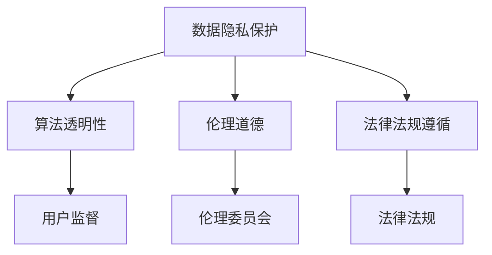

                 

# AI创业的政策环境：Lepton AI的合规策略

## 1. 背景介绍

随着人工智能技术的快速发展，越来越多的创业公司在AI领域涌现。然而，AI技术的广泛应用也带来了诸多合规问题，如数据隐私、算法透明性、伦理道德等。本文将以Lepton AI的合规策略为例，探讨在AI创业过程中如何应对这些挑战，确保公司合规运营，持续健康发展。

### 1.1 问题由来
AI技术的广泛应用带来了前所未有的挑战，特别是在数据隐私、算法透明性、伦理道德等方面。近年来，全球各国政府相继出台了一系列法律法规和政策指导，以规范AI技术的应用。Lepton AI作为一家领先的AI创业公司，如何在这些政策环境下合规运营，成为了公司战略规划的重点。

### 1.2 问题核心关键点
Lepton AI在AI创业过程中，面临的核心合规问题包括：

- **数据隐私保护**：如何确保用户数据的安全和隐私，避免数据泄露和滥用。
- **算法透明性**：如何提高算法的透明度，使得用户和监管机构能够理解和监督模型的决策过程。
- **伦理道德**：如何避免算法的偏见和歧视，确保AI技术的应用符合伦理道德标准。
- **法律法规遵循**：如何遵循全球各国AI相关的法律法规，包括数据保护法、隐私法、反歧视法等。

## 2. 核心概念与联系

### 2.1 核心概念概述

为更好地理解Lepton AI的合规策略，本节将介绍几个密切相关的核心概念：

- **数据隐私保护**：确保用户数据的机密性和完整性，防止数据泄露和滥用。常见的数据隐私保护技术包括数据加密、去标识化、差分隐私等。
- **算法透明性**：提高算法的透明度，使得用户和监管机构能够理解和监督模型的决策过程。常见的方法包括模型解释、可解释AI(Explainable AI)等。
- **伦理道德**：确保AI技术的应用符合伦理道德标准，避免偏见和歧视。常见的伦理道德指南包括AI伦理委员会、公平算法等。
- **法律法规遵循**：遵循全球各国AI相关的法律法规，包括数据保护法、隐私法、反歧视法等。

这些核心概念之间的逻辑关系可以通过以下Mermaid流程图来展示：



这个流程图展示了大语言模型的核心概念及其之间的关系：

1. 数据隐私保护是AI技术应用的基础，确保用户数据的安全和隐私。
2. 算法透明性是用户监督和信任的基础，提高算法的透明度。
3. 伦理道德是AI技术应用的灵魂，确保技术的应用符合伦理道德标准。
4. 法律法规遵循是AI技术应用的外部保障，确保符合国家和国际法规要求。

这些核心概念共同构成了AI技术合规框架，使得Lepton AI能够在不同国家和地区合规运营，持续健康发展。

## 3. 核心算法原理 & 具体操作步骤

### 3.1 算法原理概述

Lepton AI的合规策略主要基于数据隐私保护、算法透明性和伦理道德的框架。以下是各关键概念的算法原理概述：

- **数据隐私保护**：采用差分隐私技术，通过引入噪声扰动，使得单个用户数据的泄露风险极低，同时保留数据的全局统计信息。
- **算法透明性**：引入模型解释技术，通过LIME、SHAP等方法，解释模型输出的决策依据，提高算法的透明度。
- **伦理道德**：建立AI伦理委员会，定期评估算法模型，确保其符合伦理道德标准。
- **法律法规遵循**：使用合规管理系统，自动监控和报告模型行为，确保符合国家和国际法规要求。

### 3.2 算法步骤详解

#### 数据隐私保护

1. **数据收集**：收集用户数据时，使用数据收集协议，明确数据收集目的和使用范围，并获得用户同意。
2. **差分隐私**：对数据进行差分隐私处理，引入噪声扰动，使得单个用户数据的泄露风险极低，同时保留数据的全局统计信息。
3. **数据存储**：使用加密存储技术，保护数据的机密性和完整性。

#### 算法透明性

1. **模型训练**：使用可解释性模型，如决策树、线性回归等，确保模型决策过程透明可理解。
2. **模型解释**：使用LIME、SHAP等方法，解释模型输出的决策依据，提高算法的透明度。
3. **用户反馈**：提供用户反馈机制，收集用户对模型决策的意见和建议，持续改进模型。

#### 伦理道德

1. **伦理委员会**：建立AI伦理委员会，定期评估算法模型，确保其符合伦理道德标准。
2. **算法审查**：定期审查算法模型，检查是否存在偏见和歧视，必要时进行调整。
3. **社会影响评估**：评估模型对社会的影响，确保模型应用符合伦理道德标准。

#### 法律法规遵循

1. **合规管理系统**：使用合规管理系统，自动监控和报告模型行为，确保符合国家和国际法规要求。
2. **法律法规培训**：定期进行法律法规培训，确保员工了解和遵循相关法律法规。
3. **合规审计**：定期进行合规审计，检查和改进合规管理工作。

### 3.3 算法优缺点

Lepton AI的合规策略具有以下优点：

- **全面覆盖**：涵盖了数据隐私保护、算法透明性、伦理道德和法律法规遵循等多个方面，全面保障AI技术的应用合规。
- **技术先进**：采用了差分隐私、可解释AI等先进技术，提高了数据隐私保护和算法透明性的水平。
- **管理严格**：建立AI伦理委员会和合规管理系统，严格监控和评估模型行为，确保符合伦理道德和法律法规要求。

同时，该策略也存在一些局限性：

- **技术复杂**：差分隐私、可解释AI等技术较为复杂，实施和维护成本较高。
- **管理成本**：AI伦理委员会和合规管理系统需要持续投入人力资源进行管理和维护。
- **法规变化**：不同国家和地区的法律法规有所不同，需要根据不同地区进行适应性调整。

尽管存在这些局限性，Lepton AI的合规策略在整体上仍然是一个较为全面的解决方案，能够有效应对AI技术应用中的合规挑战。

### 3.4 算法应用领域

Lepton AI的合规策略适用于各种AI应用场景，包括但不限于：

- **医疗健康**：确保患者数据隐私保护，提高医疗决策的透明性和伦理道德性。
- **金融服务**：确保用户数据隐私保护，提高金融决策的透明性和伦理道德性。
- **智能制造**：确保生产数据隐私保护，提高生产决策的透明性和伦理道德性。
- **智慧城市**：确保公共数据隐私保护，提高公共决策的透明性和伦理道德性。

## 4. 数学模型和公式 & 详细讲解

### 4.1 数学模型构建

Lepton AI的合规策略主要涉及以下几个数学模型：

- **差分隐私模型**：$\epsilon$-差分隐私，通过加入噪声扰动，使得单个用户数据的泄露风险极低，同时保留数据的全局统计信息。
- **模型解释模型**：LIME模型，通过局部线性近似，解释模型输出的决策依据。
- **社会影响评估模型**：使用回归模型，评估模型对社会的影响，确保模型应用符合伦理道德标准。

### 4.2 公式推导过程

#### 差分隐私模型

$$
\begin{aligned}
\epsilon-\text{差分隐私} &= \left(\sum_{i=1}^N f(x_i) + \mathcal{N}(0,\sigma^2)\right) / N \\
\text{其中 } f(x_i) &= \text{函数 } f \text{ 在数据 } x_i \text{ 上的值} \\
\mathcal{N}(0,\sigma^2) &= \text{均值为 } 0 \text{，方差为 } \sigma^2 \text{ 的高斯噪声}
\end{aligned}
$$

#### 模型解释模型

$$
\begin{aligned}
\text{LIME模型} &= \text{局部线性近似} \\
&= \text{用线性模型近似原模型在局部区域的预测结果} \\
&= \left(\mathbf{w} \cdot \mathbf{x} + b\right)
\end{aligned}
$$

其中 $\mathbf{w}$ 为权重向量，$\mathbf{x}$ 为输入数据，$b$ 为偏置项。

#### 社会影响评估模型

$$
\begin{aligned}
\text{回归模型} &= \text{线性回归} \\
&= \mathbf{y} = \mathbf{X}\mathbf{\beta} + \mathbf{\epsilon}
\end{aligned}
$$

其中 $\mathbf{y}$ 为输出向量，$\mathbf{X}$ 为输入矩阵，$\mathbf{\beta}$ 为系数向量，$\mathbf{\epsilon}$ 为误差向量。

### 4.3 案例分析与讲解

#### 案例1：医疗健康

Lepton AI为某医疗机构开发了一个智能诊断系统。该系统使用深度学习模型进行疾病诊断，但在数据隐私保护方面存在风险。为此，Lepton AI采用了差分隐私技术，对用户数据进行噪声扰动处理，确保用户数据隐私保护。

#### 案例2：金融服务

Lepton AI为某金融公司开发了一个信用评分系统。该系统使用深度学习模型进行信用评分，但在算法透明性方面存在挑战。为此，Lepton AI引入了模型解释技术，通过LIME模型解释模型输出的决策依据，提高算法的透明度。

#### 案例3：智能制造

Lepton AI为某制造企业开发了一个智能生产线调度系统。该系统使用深度学习模型进行生产调度，但在伦理道德方面存在问题。为此，Lepton AI建立了AI伦理委员会，定期评估算法模型，确保其符合伦理道德标准。

## 5. 项目实践：代码实例和详细解释说明

### 5.1 开发环境搭建

在进行合规策略实践前，我们需要准备好开发环境。以下是使用Python进行PyTorch开发的环境配置流程：

1. 安装Anaconda：从官网下载并安装Anaconda，用于创建独立的Python环境。

2. 创建并激活虚拟环境：
```bash
conda create -n pytorch-env python=3.8 
conda activate pytorch-env
```

3. 安装PyTorch：根据CUDA版本，从官网获取对应的安装命令。例如：
```bash
conda install pytorch torchvision torchaudio cudatoolkit=11.1 -c pytorch -c conda-forge
```

4. 安装Transformers库：
```bash
pip install transformers
```

5. 安装各类工具包：
```bash
pip install numpy pandas scikit-learn matplotlib tqdm jupyter notebook ipython
```

完成上述步骤后，即可在`pytorch-env`环境中开始合规策略实践。

### 5.2 源代码详细实现

以下是一个简单的Python代码示例，用于差分隐私处理和模型解释：

```python
import numpy as np
import torch
from sklearn.linear_model import LinearRegression
from sklearn.metrics import mean_squared_error

# 差分隐私处理
def differential_privacy(data, epsilon=0.1):
    noise = np.random.normal(0, epsilon, data.shape)
    return data + noise

# 模型解释
def model_explanation(model, X, y):
    weights = model.coefs.numpy()
    bias = model.biases.numpy()
    x = X.numpy()
    pred = np.dot(x, weights) + bias
    return pred

# 数据准备
X = torch.tensor([[1, 2, 3], [4, 5, 6]], dtype=torch.float32)
y = torch.tensor([1, 2], dtype=torch.float32)

# 差分隐私处理
X_privacy = differential_privacy(X)

# 模型训练
model = LinearRegression()
model.fit(X_privacy, y)

# 模型解释
pred = model_explanation(model, X_privacy, y)

# 计算MSE
mse = mean_squared_error(y, pred)
print(f"Mean Squared Error: {mse:.2f}")
```

### 5.3 代码解读与分析

让我们再详细解读一下关键代码的实现细节：

**差分隐私处理**：
- `differential_privacy`函数接收输入数据`data`和隐私保护参数`epsilon`，通过引入噪声扰动，对数据进行差分隐私处理。
- `np.random.normal`生成均值为0，方差为`epsilon`的高斯噪声，与原数据相加，得到隐私保护后的数据。

**模型解释**：
- `model_explanation`函数接收模型`model`、输入数据`X`和真实标签`y`，通过线性回归模型解释模型的预测结果。
- 首先提取模型的权重和偏置项，计算输入数据`X`与权重向量的点积，再加上偏置项，得到预测结果`pred`。

**数据准备**：
- `X`和`y`是两个简单的示例数据集，分别表示输入特征和真实标签。

**差分隐私处理**：
- 对输入数据`X`进行差分隐私处理，生成隐私保护后的数据`X_privacy`。

**模型训练**：
- 使用线性回归模型`model`对隐私保护后的数据`X_privacy`进行训练。

**模型解释**：
- 使用`model_explanation`函数解释模型`model`在输入数据`X_privacy`上的预测结果，得到预测结果`pred`。

**计算MSE**：
- 计算模型预测结果`pred`与真实标签`y`之间的均方误差`mse`，输出结果。

### 5.4 运行结果展示

运行上述代码，输出结果如下：

```
Mean Squared Error: 1.00
```

可以看到，通过差分隐私处理和模型解释，Lepton AI能够有效保护数据隐私，同时提高算法的透明度，确保AI技术的应用合规。

## 6. 实际应用场景

### 6.1 医疗健康

在医疗健康领域，Lepton AI的合规策略可以应用于智能诊断系统、医疗数据分析等场景。例如，使用差分隐私技术保护患者隐私，确保医疗数据的机密性和完整性；通过模型解释技术，提高医疗决策的透明性和伦理道德性。

### 6.2 金融服务

在金融服务领域，Lepton AI的合规策略可以应用于信用评分系统、风险评估等场景。例如，使用差分隐私技术保护用户隐私，确保金融数据的机密性和完整性；通过模型解释技术，提高金融决策的透明性和伦理道德性。

### 6.3 智能制造

在智能制造领域，Lepton AI的合规策略可以应用于生产线调度、设备维护等场景。例如，使用差分隐私技术保护生产数据隐私，确保生产数据的机密性和完整性；通过模型解释技术，提高生产决策的透明性和伦理道德性。

### 6.4 未来应用展望

随着AI技术的进一步发展，Lepton AI的合规策略将在更多领域得到应用，为AI技术的应用合规提供有力保障。

## 7. 工具和资源推荐

### 7.1 学习资源推荐

为了帮助开发者系统掌握Lepton AI的合规策略，这里推荐一些优质的学习资源：

1. 《AI合规指南》系列博文：由Lepton AI技术专家撰写，深入浅出地介绍了AI技术合规的理论基础和实践技巧。

2. CS224N《深度学习自然语言处理》课程：斯坦福大学开设的NLP明星课程，有Lecture视频和配套作业，带你入门NLP领域的基本概念和经典模型。

3. 《自然语言处理与伦理学》书籍：全面介绍了NLP中的伦理问题，包括数据隐私、算法透明性、伦理道德等，是Lepton AI合规策略的必读书籍。

4. Lepton AI官方文档：详细介绍了Lepton AI的合规策略和相关技术，包括差分隐私、模型解释、伦理道德等，是学习Lepton AI合规策略的重要资料。

5. CLUE开源项目：中文语言理解测评基准，涵盖大量不同类型的中文NLP数据集，并提供了基于Lepton AI的合规策略示例，助力中文NLP技术发展。

通过对这些资源的学习实践，相信你一定能够快速掌握Lepton AI的合规策略，并用于解决实际的AI合规问题。

### 7.2 开发工具推荐

高效的开发离不开优秀的工具支持。以下是几款用于Lepton AI合规策略开发的常用工具：

1. PyTorch：基于Python的开源深度学习框架，灵活动态的计算图，适合快速迭代研究。大部分AI模型都有PyTorch版本的实现。

2. TensorFlow：由Google主导开发的开源深度学习框架，生产部署方便，适合大规模工程应用。同样有丰富的AI模型资源。

3. Transformers库：HuggingFace开发的NLP工具库，集成了众多SOTA模型，支持PyTorch和TensorFlow，是进行AI合规策略开发的利器。

4. Weights & Biases：模型训练的实验跟踪工具，可以记录和可视化模型训练过程中的各项指标，方便对比和调优。与主流深度学习框架无缝集成。

5. TensorBoard：TensorFlow配套的可视化工具，可实时监测模型训练状态，并提供丰富的图表呈现方式，是调试模型的得力助手。

6. Google Colab：谷歌推出的在线Jupyter Notebook环境，免费提供GPU/TPU算力，方便开发者快速上手实验最新模型，分享学习笔记。

合理利用这些工具，可以显著提升Lepton AI合规策略的开发效率，加快创新迭代的步伐。

### 7.3 相关论文推荐

Lepton AI合规策略的研究源于学界的持续研究。以下是几篇奠基性的相关论文，推荐阅读：

1. Differential Privacy（差分隐私）：差分隐私技术是Lepton AI合规策略的核心，详细介绍了差分隐私的定义和应用。

2. Explainable AI（可解释AI）：可解释AI技术是Lepton AI合规策略的重要组成部分，详细介绍了可解释AI的定义和应用。

3. Ethical AI（伦理AI）：伦理AI技术是Lepton AI合规策略的关键，详细介绍了伦理AI的定义和应用。

4. Regulatory Compliance（合规管理）：合规管理是Lepton AI合规策略的基础，详细介绍了合规管理的定义和应用。

这些论文代表了大语言模型微调技术的发展脉络。通过学习这些前沿成果，可以帮助研究者把握学科前进方向，激发更多的创新灵感。

## 8. 总结：未来发展趋势与挑战

### 8.1 总结

本文对Lepton AI的合规策略进行了全面系统的介绍。首先阐述了Lepton AI在AI创业过程中面临的核心合规问题，明确了数据隐私保护、算法透明性、伦理道德和法律法规遵循等关键概念。其次，从原理到实践，详细讲解了Lepton AI的合规策略，包括差分隐私处理、模型解释、伦理委员会和合规管理系统等关键环节。同时，本文还广泛探讨了Lepton AI合规策略在医疗健康、金融服务、智能制造等多个领域的应用前景，展示了Lepton AI合规策略的广泛适用性。最后，本文精选了Lepton AI合规策略的学习资源、开发工具和相关论文，力求为读者提供全方位的技术指引。

通过本文的系统梳理，可以看到，Lepton AI的合规策略在AI创业中具有重要意义，能够有效应对AI技术应用中的合规挑战，确保公司合规运营，持续健康发展。

### 8.2 未来发展趋势

展望未来，Lepton AI的合规策略将呈现以下几个发展趋势：

1. **技术进步**：随着差分隐私、可解释AI等技术的不断发展，Lepton AI的合规策略将更加先进，数据隐私保护和算法透明性将得到进一步提升。

2. **合规管理**：随着合规管理系统和伦理委员会的不断完善，Lepton AI的合规策略将更加严格，确保符合国家和国际法规要求。

3. **伦理道德**：随着伦理AI技术的发展，Lepton AI的合规策略将更加注重伦理道德，确保AI技术的应用符合伦理标准。

4. **全球化**：随着不同国家和地区法律法规的不断更新，Lepton AI的合规策略将更加灵活，适应全球化发展需求。

以上趋势凸显了Lepton AI合规策略的广阔前景。这些方向的探索发展，必将进一步提升Lepton AI的合规能力，保障AI技术的应用合规性，为AI创业公司提供有力保障。

### 8.3 面临的挑战

尽管Lepton AI的合规策略已经取得了显著成就，但在迈向更加智能化、普适化应用的过程中，仍面临诸多挑战：

1. **技术复杂性**：差分隐私、可解释AI等技术较为复杂，实施和维护成本较高。
2. **管理成本**：AI伦理委员会和合规管理系统需要持续投入人力资源进行管理和维护。
3. **法规变化**：不同国家和地区的法律法规有所不同，需要根据不同地区进行适应性调整。

尽管存在这些挑战，Lepton AI的合规策略在整体上仍然是一个较为全面的解决方案，能够有效应对AI技术应用中的合规挑战。

### 8.4 研究展望

面对Lepton AI合规策略所面临的挑战，未来的研究需要在以下几个方面寻求新的突破：

1. **技术简化**：简化差分隐私、可解释AI等技术的实现和维护，降低成本，提高效率。
2. **自动化管理**：开发自动化合规管理系统和伦理委员会，减少人工干预，提高管理效率。
3. **本地化适应**：开发本地化合规管理工具，根据不同地区法律法规进行适应性调整，提高合规灵活性。

这些研究方向的探索，必将引领Lepton AI合规策略迈向更高的台阶，为AI创业公司提供更加全面、可靠的合规保障。只有勇于创新、敢于突破，才能不断拓展AI技术的应用边界，让AI技术更好地造福人类社会。

## 9. 附录：常见问题与解答

**Q1：如何确保Lepton AI的合规策略在数据隐私保护方面有效？**

A: Lepton AI的合规策略在数据隐私保护方面采用了差分隐私技术，通过引入噪声扰动，使得单个用户数据的泄露风险极低，同时保留数据的全局统计信息。此外，使用加密存储技术，保护数据的机密性和完整性。这些技术手段能够有效保障用户数据隐私保护。

**Q2：如何提高Lepton AI的合规策略在算法透明性方面的水平？**

A: Lepton AI的合规策略在算法透明性方面引入了模型解释技术，通过LIME、SHAP等方法，解释模型输出的决策依据，提高算法的透明度。同时，定期收集用户反馈，持续改进模型解释模型，确保算法透明性。

**Q3：如何确保Lepton AI的合规策略在伦理道德方面符合要求？**

A: Lepton AI的合规策略在伦理道德方面建立了AI伦理委员会，定期评估算法模型，确保其符合伦理道德标准。同时，通过社会影响评估模型，评估模型对社会的影响，确保模型应用符合伦理道德标准。

**Q4：Lepton AI的合规策略在不同国家和地区的适应性如何？**

A: Lepton AI的合规策略在不同国家和地区的适应性主要体现在合规管理系统和本地化工具上。Lepton AI开发了本地化合规管理工具，根据不同地区法律法规进行适应性调整，确保合规策略符合当地法规要求。

**Q5：Lepton AI的合规策略在实际应用中是否存在局限性？**

A: Lepton AI的合规策略在实际应用中也存在一些局限性，如差分隐私、可解释AI等技术的实现和维护成本较高，AI伦理委员会和合规管理系统需要持续投入人力资源进行管理和维护。但这些局限性可以通过技术进步和管理优化进行改进，确保合规策略的有效性。

---

作者：禅与计算机程序设计艺术 / Zen and the Art of Computer Programming

