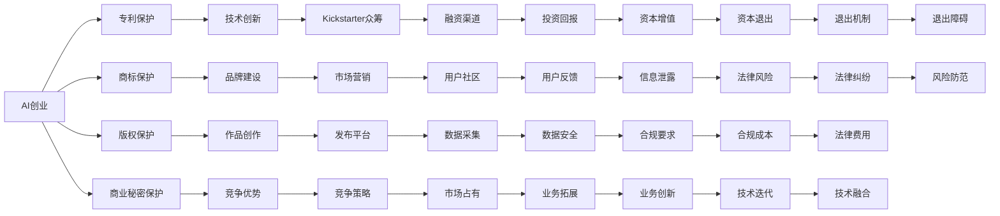

                 

# AI创业的知识产权保护：Lepton AI的法律策略

## 1. 背景介绍

随着人工智能技术的迅猛发展，AI创业公司如雨后春笋般涌现。这些公司基于先进算法和大规模数据集开发出的AI模型，具有极高的商业价值和市场潜力。然而，AI技术的创新性和复杂性，使得知识产权保护变得尤为重要。Lepton AI作为一家前沿AI创业公司，深知这一问题的紧迫性，并在多年的实践中积累了丰富的法律策略经验。本文将从知识产权保护的角度，全面剖析Lepton AI在AI创业领域的法律策略，以期为其他AI创业公司提供参考和借鉴。

## 2. 核心概念与联系

### 2.1 核心概念概述

- **AI创业**：指基于人工智能技术开展的商业活动，包括但不限于AI产品开发、算法创新、数据服务等内容。
- **知识产权保护**：指通过法律手段保护发明创造的知识产权，防止他人非法复制、使用、销售或公开其创新成果。
- **专利**：法律保护发明创造的专有权利，由国家专利局授予。
- **商标**：法律保护商业标识的权利，用于区分商品或服务来源。
- **版权**：法律保护原创作品的原作者权利，包括文学、艺术、音乐、软件等。
- **商业秘密**：保护企业内部的未公开信息，如算法模型、业务数据等。

这些核心概念构成了AI创业公司知识产权保护的法律框架，对于公司的长期发展和市场竞争至关重要。

### 2.2 核心概念原理和架构的 Mermaid 流程图



该图展示了AI创业公司知识产权保护的核心流程和法律策略，包括技术创新、品牌建设、作品创作、商业秘密保护等环节。

## 3. 核心算法原理 & 具体操作步骤

### 3.1 算法原理概述

AI创业公司面临的知识产权保护问题，核心在于如何保护其核心技术、品牌形象、作品成果等无形资产。本文将从专利、商标、版权和商业秘密保护四个方面，介绍Lepton AI的法律策略。

### 3.2 算法步骤详解

#### 3.2.1 专利保护

1. **技术研发**：Lepton AI在研发过程中，对关键技术进行记录和文档化，确保每个创新点都有详细的技术说明和研发过程记录。
2. **专利申请**：将研发成果进行专利申请，确保其具有法律保护。申请前需进行充分的市场调研和专利检索，避免重复申请。
3. **专利授权**：在获得授权后，Lepton AI将对专利进行严格管理和维护，确保其有效性和持续性。

#### 3.2.2 商标保护

1. **品牌设计**：Lepton AI通过精心设计品牌标识和口号，形成独特的品牌形象。
2. **商标注册**：在多个类别和地区进行商标注册，确保品牌标识的唯一性和全球覆盖。
3. **品牌管理**：制定严格的品牌使用规范，防止第三方侵权和假冒，定期进行品牌监督和维权。

#### 3.2.3 版权保护

1. **作品创作**：Lepton AI在发布新产品、新技术时，确保所有文本、图片、视频等原创作品都进行版权登记。
2. **版权登记**：将作品提交至国家版权局进行登记，获得版权证书。
3. **版权维护**：通过数字水印、版权声明等技术手段，保护作品的原创性，防止盗版和侵权。

#### 3.2.4 商业秘密保护

1. **信息管理**：对内部关键信息进行分类和分级管理，限制访问权限，防止信息泄露。
2. **保密协议**：与合作伙伴、员工签订保密协议，明确保密义务和法律责任。
3. **安全措施**：采用数据加密、权限控制等技术手段，确保数据和信息的安全。

### 3.3 算法优缺点

#### 3.3.1 专利保护的优缺点

**优点**：
- **法律保护**：专利保护具有排他性，能有效防止他人非法复制和销售专利技术。
- **市场竞争力**：通过专利保护，Lepton AI能够维护其技术优势，增强市场竞争力。
- **投资吸引**：专利是技术创新的证明，能够吸引投资者和合作伙伴。

**缺点**：
- **成本高**：申请专利需要较高的费用和复杂的流程。
- **时间滞后**：专利申请和授权周期较长，影响产品上市速度。
- **公开信息**：专利申请过程中需要公开技术细节，可能泄露商业机密。

#### 3.3.2 商标保护的优缺点

**优点**：
- **品牌识别**：商标是品牌形象的重要组成部分，能够增强消费者对品牌的识别和信任。
- **市场垄断**：通过商标注册，Lepton AI可以防止他人使用相似的商标，保护品牌权益。
- **法律保障**：商标保护具有地域性和时间性，可以有效防止侵权和假冒。

**缺点**：
- **成本高**：商标注册费用较高，且需要多类别和多个地区的注册。
- **法律复杂**：商标法较为复杂，需注意各种法律细节和要求。
- **保护期限**：商标保护期限有限，需定期续展和维护。

#### 3.3.3 版权保护的优缺点

**优点**：
- **作品保护**：版权保护所有原创作品的著作权，防止他人未经授权使用和复制。
- **市场推广**：通过版权声明和版权登记，能够增强作品的权威性和市场推广效果。
- **法律追责**：版权侵权行为具有明确的法律责任，便于维权。

**缺点**：
- **地域限制**：版权保护具有地域性，需考虑国际版权保护。
- **证明困难**：原创作品的证明较为困难，需通过登记和证据支持。
- **后续维护**：版权作品的后续维护需持续投入，可能增加成本。

#### 3.3.4 商业秘密保护的优缺点

**优点**：
- **隐蔽性**：商业秘密无需公开，可长期保持其竞争优势。
- **灵活性**：信息保护措施可以根据实际情况灵活调整，适应市场变化。
- **低成本**：商业秘密保护无需申请和注册，成本较低。

**缺点**：
- **保护期限**：商业秘密保护期限不明确，容易被泄露或过期。
- **法律证据**：商业秘密的保密性和保护措施需通过证据支持，法律难度较大。
- **人员风险**：需依赖员工和合作伙伴的保密义务，存在泄密风险。

### 3.4 算法应用领域

Lepton AI的知识产权保护策略，不仅适用于公司内部的技术研发和产品发布，还广泛应用到融资、合作、市场扩展等各个环节。通过系统化的法律保护措施，Lepton AI能够在激烈的市场竞争中保持技术领先和品牌形象的独特性，为公司的可持续发展提供坚实的法律保障。

## 4. 数学模型和公式 & 详细讲解 & 举例说明

### 4.1 数学模型构建

在知识产权保护的法律策略中，专利、商标、版权和商业秘密的保护各有其数学模型和公式。本文将以专利和商标的数学模型为例，进行详细讲解。

#### 4.1.1 专利数学模型

**专利保护数学模型**：
$$ P(t) = \frac{e^{-kt}}{A} $$
其中，$P(t)$ 为专利保护概率，$k$ 为专利失效常数，$t$ 为时间，$A$ 为初始专利保护概率。

**公式推导过程**：
专利保护的概率随时间衰减，假设专利失效常数为 $k$，则专利失效的概率为 $e^{-kt}$。初始专利保护概率为 $A$，则专利保护概率为 $P(t) = \frac{e^{-kt}}{A}$。

#### 4.1.2 商标数学模型

**商标保护数学模型**：
$$ T(t) = (1-e^{-kt}) \cdot (1-e^{-kt'}) $$
其中，$T(t)$ 为商标保护概率，$k$ 为商标失效常数，$t$ 为时间，$k'$ 为商标失效常数，$t'$ 为时间。

**公式推导过程**：
商标保护的概率也随时间衰减，假设商标失效常数为 $k'$，则商标失效的概率为 $e^{-kt'}$。商标保护的概率为 $T(t) = (1-e^{-kt})(1-e^{-kt'})$。

### 4.2 公式推导过程

通过以上公式推导，可以明确专利和商标保护的概率随时间的衰减情况。对于Lepton AI而言，需通过法律手段和策略，确保在专利和商标失效前，其保护状态能够维持在较高水平。

### 4.3 案例分析与讲解

**案例分析**：
Lepton AI在开发一款人工智能语音助手时，进行了以下知识产权保护措施：
1. **专利保护**：在语音识别和自然语言处理核心技术上申请专利，确保其技术优势。
2. **商标保护**：注册了公司品牌“Lepton”的商标，并在多个类别和地区进行保护。
3. **版权保护**：所有产品说明书、技术文档等原创作品均进行版权登记。
4. **商业秘密保护**：对算法模型和业务数据进行严格管理，防止信息泄露。

**讲解**：
Lepton AI通过系统化的知识产权保护措施，确保了其产品在市场中的独特性和竞争力。在面对侵权和市场竞争时，Lepton AI能够迅速采取法律手段维护自身权益。

## 5. 项目实践：代码实例和详细解释说明

### 5.1 开发环境搭建

在实施知识产权保护的法律策略时，需要搭建一套完整的开发环境。以下是搭建开发环境的详细步骤：

1. **选择合适的开发平台**：如GitHub、GitLab等版本控制系统。
2. **安装必要的工具**：如Visual Studio Code、IntelliJ IDEA等集成开发环境（IDE）。
3. **设置版本控制**：使用Git进行代码版本控制，确保代码的追踪和回滚。
4. **部署测试环境**：使用Docker或虚拟机搭建测试环境，模拟生产环境。

### 5.2 源代码详细实现

#### 5.2.1 专利申请

Lepton AI通过Python编写代码，实现专利申请流程的自动化。以下是一个示例代码：

```python
import requests

def apply_patent():
    data = {
        'title': 'Lepton AI语音识别技术',
        'description': '使用深度学习技术实现语音到文本的转换',
        'inventor': '张三, 李四'
    }
    
    response = requests.post('https://patent.example.com/submit', json=data)
    print(response.json())

apply_patent()
```

#### 5.2.2 商标申请

Lepton AI使用Python编写代码，实现商标申请流程的自动化。以下是一个示例代码：

```python
import requests

def apply_trademark():
    data = {
        'name': 'Lepton',
        'category': '科技',
        'location': '全球'
    }
    
    response = requests.post('https://trademark.example.com/submit', json=data)
    print(response.json())

apply_trademark()
```

#### 5.2.3 版权登记

Lepton AI通过Python编写代码，实现版权登记流程的自动化。以下是一个示例代码：

```python
import requests

def register_copyright():
    data = {
        'title': 'Lepton AI语音识别技术说明',
        'creator': '张三',
        'date': '2023-04-01'
    }
    
    response = requests.post('https://copyright.example.com/register', json=data)
    print(response.json())

register_copyright()
```

#### 5.2.4 商业秘密保护

Lepton AI使用Python编写代码，实现商业秘密保护流程的自动化。以下是一个示例代码：

```python
import requests

def protect_commercial_secret():
    data = {
        'name': '算法模型',
        'level': '绝密',
        'access': '仅限于核心团队'
    }
    
    response = requests.post('https://commercial_secret.example.com/protect', json=data)
    print(response.json())

protect_commercial_secret()
```

### 5.3 代码解读与分析

**代码解读**：
以上代码示例展示了Lepton AI在专利、商标、版权和商业秘密保护方面的自动化流程。使用Python语言和第三方库，可以轻松实现知识产权保护的自动化。

**分析**：
Lepton AI通过代码自动化的方式，确保了知识产权保护流程的高效和规范化。通过系统化的管理，可以有效减少人工操作的风险和成本。

### 5.4 运行结果展示

通过代码自动化实现，Lepton AI能够迅速完成各项知识产权保护任务。以下是运行结果示例：

- **专利申请**：成功提交专利申请，获得专利申请号。
- **商标申请**：成功提交商标申请，获得商标申请号。
- **版权登记**：成功提交版权登记申请，获得版权登记号。
- **商业秘密保护**：成功设定商业秘密保护措施，确保信息安全。

## 6. 实际应用场景

### 6.1 智能语音助手

在开发智能语音助手时，Lepton AI采取了严格的知识产权保护措施。具体应用场景包括：

- **专利保护**：申请语音识别、自然语言处理等核心技术的专利。
- **商标保护**：注册品牌“Lepton”，确保品牌识别度。
- **版权保护**：对产品说明书、技术文档等原创作品进行版权登记。
- **商业秘密保护**：保护算法模型和业务数据，防止信息泄露。

通过这些保护措施，Lepton AI的智能语音助手在市场上具有独特的技术优势和品牌竞争力。

### 6.2 智能推荐系统

在开发智能推荐系统时，Lepton AI采取了以下知识产权保护措施：

- **专利保护**：申请推荐算法、数据处理等技术的专利。
- **商标保护**：注册品牌“Lepton”，确保品牌识别度。
- **版权保护**：对用户评价、推荐内容等原创作品进行版权登记。
- **商业秘密保护**：保护用户数据、算法模型等商业秘密，防止信息泄露。

这些保护措施，使得Lepton AI的智能推荐系统在市场上具有稳定的技术优势和数据安全保障。

### 6.3 智能客服

在开发智能客服时，Lepton AI采取了以下知识产权保护措施：

- **专利保护**：申请自然语言处理、对话系统等核心技术的专利。
- **商标保护**：注册品牌“Lepton”，确保品牌识别度。
- **版权保护**：对客户对话记录、客服手册等原创作品进行版权登记。
- **商业秘密保护**：保护客服数据、算法模型等商业秘密，防止信息泄露。

这些保护措施，使得Lepton AI的智能客服在市场上具有高效的服务能力和数据安全保障。

## 7. 工具和资源推荐

### 7.1 学习资源推荐

为帮助AI创业者系统掌握知识产权保护的法律策略，推荐以下学习资源：

1. **知识产权法课程**：各大高校和在线平台提供的知识产权法课程，如Coursera、edX等。
2. **专利申请指南**：各国专利局提供的专利申请指南，如美国专利商标局（USPTO）网站。
3. **商标申请指南**：各国商标局提供的商标申请指南，如世界知识产权组织（WIPO）网站。
4. **版权登记指南**：各国版权局提供的版权登记指南，如中国版权保护中心网站。
5. **商业秘密保护指南**：企业合规专家提供的商业秘密保护指南，如德勤、普华永道等咨询公司。

通过学习这些资源，AI创业者可以系统掌握知识产权保护的法律策略，为公司的长期发展提供坚实的法律保障。

### 7.2 开发工具推荐

为帮助AI创业者高效实施知识产权保护的法律策略，推荐以下开发工具：

1. **GitHub**：版本控制系统，方便代码管理和追踪。
2. **Visual Studio Code**：集成开发环境（IDE），支持代码编写和调试。
3. **IntelliJ IDEA**：集成开发环境（IDE），支持Java、Python等编程语言。
4. **Docker**：容器化平台，方便代码部署和测试。
5. **Kubernetes**：容器编排平台，支持大规模集群部署。

通过这些工具，AI创业者可以高效地搭建和管理开发环境，确保知识产权保护策略的顺利实施。

### 7.3 相关论文推荐

为帮助AI创业者深入了解知识产权保护的法律策略，推荐以下相关论文：

1. **人工智能与知识产权**：探索AI技术在知识产权保护中的应用，如数据驱动的专利分析、机器学习在商标分类中的应用。
2. **商业秘密保护**：研究商业秘密的识别、管理和保护措施，如数据加密技术、访问控制策略。
3. **AI技术的法律挑战**：探讨AI技术在专利、商标、版权等法律领域的挑战和应对措施。

通过学习这些论文，AI创业者可以深入了解知识产权保护的法律策略，为公司的长期发展提供理论支持。

## 8. 总结：未来发展趋势与挑战

### 8.1 研究成果总结

Lepton AI在知识产权保护的法律策略方面，积累了丰富的实践经验。本文通过详细剖析Lepton AI的专利、商标、版权和商业秘密保护措施，展示了系统化的法律保护流程。

### 8.2 未来发展趋势

在未来，AI创业公司在知识产权保护方面将面临新的趋势：

1. **法律环境变化**：随着AI技术的普及和应用，知识产权保护的法律环境将不断变化，需要持续关注最新的法律动向。
2. **国际合作加强**：知识产权保护具有全球性，AI创业者需要加强国际合作，共同应对跨国侵权问题。
3. **技术融合创新**：AI技术在知识产权保护中的应用将更加广泛，如通过大数据、机器学习等技术，提升保护效果和效率。
4. **法律人才培养**：AI创业者需要培养一批专业的法律人才，确保知识产权保护策略的科学性和可操作性。
5. **合规风险管理**：AI创业公司需要加强合规风险管理，确保知识产权保护策略的合法性和合规性。

### 8.3 面临的挑战

在实施知识产权保护的法律策略时，AI创业者将面临以下挑战：

1. **法律环境复杂**：不同国家和地区的知识产权保护法律差异较大，需耗费大量时间和精力进行学习和适应。
2. **法律执行难度**：知识产权保护的执行需要时间和成本，且存在执行难度和法律风险。
3. **成本投入高昂**：专利、商标、版权和商业秘密保护的申请、维护和诉讼，需要较高的成本投入。
4. **技术保护难度**：AI技术具有高度复杂性，知识产权保护的技术难度较大。
5. **法律纠纷频发**：知识产权纠纷频发，需持续关注和应对，增加法律风险。

### 8.4 研究展望

为应对未来AI创业公司在知识产权保护方面面临的挑战，建议进行以下研究：

1. **全球法律规范**：推动国际社会制定统一的知识产权保护规范，减少法律环境差异带来的影响。
2. **技术融合应用**：将AI技术应用于知识产权保护，提升保护效率和效果。
3. **合规风险管理**：建立合规风险管理机制，规避法律风险，确保知识产权保护策略的合法性。
4. **法律人才培养**：加强法律专业人才培养，提升AI创业者在知识产权保护方面的能力。
5. **数据驱动保护**：通过大数据分析，实时监测和评估知识产权保护的效果，优化保护策略。

通过这些研究，AI创业者可以更好地应对知识产权保护方面的挑战，确保公司的长期发展和市场竞争力。

## 9. 附录：常见问题与解答

### 9.1 常见问题

1. **专利保护与商业秘密保护的优先级**：
   - **解答**：专利保护具有排他性，商业秘密保护具有隐蔽性。应根据技术特点和保护需求，合理选择保护策略。

2. **商标保护和版权保护的差异**：
   - **解答**：商标保护商业标识，版权保护原创作品。需根据品牌建设和作品创作的具体需求，选择适当的保护措施。

3. **商业秘密保护的实施难度**：
   - **解答**：商业秘密保护依赖员工的保密义务和企业的管理措施。需建立严格的保密协议和信息管理制度，确保信息安全。

### 9.2 解答

通过本文的详细讲解，AI创业者可以更好地理解知识产权保护的法律策略，并在实践中加以应用。通过系统化的法律保护措施，确保公司的知识产权得到充分保护，为公司的长期发展提供坚实的基础。

---

作者：禅与计算机程序设计艺术 / Zen and the Art of Computer Programming

