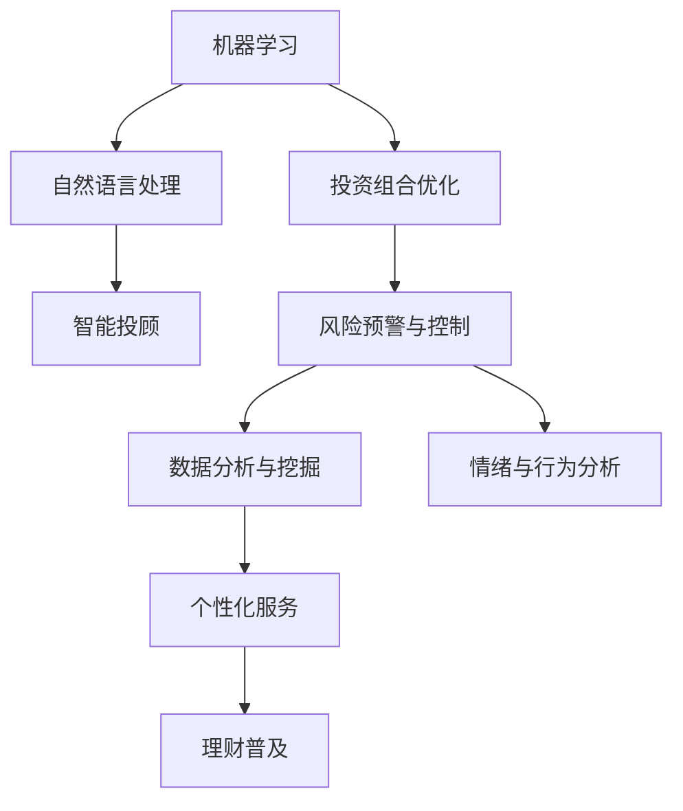

                 

## 1. 背景介绍

### 1.1 问题由来
随着个人财富的快速增长，越来越多的人开始关注理财和财富管理。传统的理财方法依赖于专家意见、报纸杂志等信息渠道，存在信息不对称、投资收益低、风险高的问题。而人工智能的兴起，为理财和财富管理带来了新的可能。利用大数据、机器学习、自然语言处理等技术，AI可以更准确地分析市场动态、预测风险、定制个性化投资方案，帮助个人理财实现更高效、更安全、更灵活。

### 1.2 问题核心关键点
AI在理财和财富管理中的应用，主要包括以下几个方面：

- 投资组合优化：利用机器学习算法，根据用户风险偏好、历史交易记录等信息，自动优化投资组合，提升投资回报。
- 风险预警与控制：通过数据分析、机器学习模型，实时监测市场风险，及时预警并采取措施，降低投资风险。
- 智能投顾：利用自然语言处理、智能推荐系统等技术，为个人提供智能理财顾问服务，提升投资体验。
- 数据分析与挖掘：通过大数据分析、可视化工具，深度挖掘历史数据中的隐藏规律，为投资决策提供支撑。
- 情绪与行为分析：利用自然语言处理技术，分析用户情绪、行为，及时调整理财策略，实现更好的人机交互。

这些核心技术构成了AI在理财和财富管理领域的应用基础，显著提升了个人理财的效率和准确性。

### 1.3 问题研究意义
AI在理财和财富管理领域的应用，具有以下重要意义：

1. **提高理财效率**：AI能够处理海量数据，快速分析市场趋势和风险，为个人理财提供高效支持。
2. **提升投资决策质量**：通过智能推荐、风险预警等手段，AI帮助投资者做出更合理的决策，减少投资失误。
3. **降低投资风险**：AI能够实时监测市场动态，及时预警风险，帮助投资者规避损失。
4. **实现个性化服务**：利用自然语言处理、推荐系统等技术，AI可以提供更个性化的理财顾问服务，满足不同用户的需求。
5. **推动理财普及**：AI的智能化应用，降低了理财门槛，使得更多人能够享受到专业理财服务。

## 2. 核心概念与联系

### 2.1 核心概念概述

要深入理解AI在理财和财富管理中的应用，首先需要了解几个核心概念：

- **机器学习（Machine Learning, ML）**：利用数据和算法，让计算机系统从经验中学习，提高预测和决策能力。
- **自然语言处理（Natural Language Processing, NLP）**：使计算机能够理解、解释和生成自然语言，实现人机交互。
- **深度学习（Deep Learning, DL）**：基于人工神经网络，通过多层非线性变换，从大量数据中提取高层次特征，用于复杂任务。
- **强化学习（Reinforcement Learning, RL）**：通过与环境交互，让智能体根据反馈逐步优化策略，实现自主学习。
- **投资组合优化（Portfolio Optimization）**：通过量化分析，构建多资产投资组合，实现风险与收益的平衡。
- **风险预警与控制（Risk预警与控制）**：利用数据分析和机器学习模型，实时监测和控制投资风险。

这些概念之间的联系可以通过以下Mermaid流程图来展示：



这个流程图展示了AI在理财和财富管理领域的主要应用方向及其相互关系：

1. 机器学习为投资组合优化、风险预警与控制等提供了技术支撑。
2. 自然语言处理使智能投顾等应用成为可能。
3. 数据分析与挖掘、情绪与行为分析等则提供了更丰富的决策信息。
4. 个性化服务、理财普及等应用，则体现了AI在实际业务中的具体落地。

## 3. 核心算法原理 & 具体操作步骤

### 3.1 算法原理概述

AI在理财和财富管理中的应用，主要基于以下几个算法原理：

- **监督学习（Supervised Learning）**：通过有标签数据，训练机器学习模型，进行预测和分类。
- **无监督学习（Unsupervised Learning）**：利用无标签数据，发现数据中的隐含结构，进行聚类、降维等任务。
- **强化学习（Reinforcement Learning）**：通过与环境的交互，智能体不断优化策略，实现最优决策。
- **深度学习（Deep Learning）**：利用多层次神经网络，从原始数据中提取高层次特征，用于复杂任务的建模。
- **时间序列分析（Time Series Analysis）**：通过时间序列模型，对市场数据进行预测和分析。
- **生成对抗网络（Generative Adversarial Networks, GANs）**：利用两个神经网络对抗生成，生成逼真的市场模拟数据，用于模型训练和测试。

### 3.2 算法步骤详解

AI在理财和财富管理中的应用，一般包括以下几个关键步骤：

**Step 1: 数据收集与预处理**

- 收集用户的历史交易记录、市场数据、财经新闻、社交媒体等各类数据。
- 对数据进行清洗、归一化、去重等预处理，确保数据质量。

**Step 2: 特征工程**

- 从原始数据中提取有意义的特征，如交易频率、市场波动、情绪指数等。
- 使用降维技术（如PCA）和特征选择算法，减少特征维度。

**Step 3: 模型训练与优化**

- 选择适合的机器学习模型，如随机森林、梯度提升树、神经网络等。
- 对模型进行训练，调整超参数，进行交叉验证。
- 对模型进行优化，如模型裁剪、量化加速、服务化封装等，提升模型效率。

**Step 4: 风险预警与控制**

- 构建风险预警模型，实时监测市场动态和用户行为。
- 设定预警阈值，当风险指标超过阈值时，自动发出预警。
- 根据预警信息，及时调整投资策略，降低风险。

**Step 5: 投资组合优化**

- 基于用户风险偏好和历史数据，构建多资产投资组合。
- 利用优化算法，如遗传算法、粒子群优化等，优化投资组合。
- 定期评估投资组合性能，进行调整优化。

**Step 6: 智能投顾与推荐**

- 利用自然语言处理技术，分析用户需求和情绪。
- 基于分析结果，生成个性化的投资建议和理财方案。
- 提供智能投顾服务，与用户互动，实时调整建议。

**Step 7: 数据分析与挖掘**

- 利用大数据分析工具，对历史数据进行挖掘，发现规律和趋势。
- 使用可视化工具，展示分析结果，帮助用户理解市场变化。

**Step 8: 情绪与行为分析**

- 使用自然语言处理技术，分析用户在社交媒体、评论等平台上的情绪和行为。
- 根据情绪和行为数据，调整投资策略，提升用户体验。

### 3.3 算法优缺点

AI在理财和财富管理中的应用，具有以下优点：

- **高效率**：AI能够处理大量数据，快速分析市场动态，提升理财效率。
- **高精度**：基于机器学习模型，AI能够更准确地预测市场趋势，降低投资风险。
- **个性化服务**：利用自然语言处理和推荐系统，AI能够提供更个性化的理财顾问服务，满足用户多样化需求。
- **实时性**：通过实时数据分析和风险预警，AI能够及时调整投资策略，提高市场响应速度。

同时，也存在一些缺点：

- **数据依赖**：AI的效果依赖于数据的质量和数量，数据不足可能影响模型性能。
- **模型复杂性**：复杂的AI模型可能存在黑盒问题，难以解释和调试。
- **系统风险**：AI系统可能受到恶意攻击或数据泄露，存在安全风险。
- **法律和伦理**：AI在理财和财富管理中的应用可能涉及法律和伦理问题，需要严格规范和监管。

### 3.4 算法应用领域

AI在理财和财富管理中的应用，主要集中在以下几个领域：

- **智能投顾与推荐**：利用自然语言处理和推荐系统，为用户提供个性化的理财顾问服务。
- **投资组合优化**：通过机器学习算法，优化多资产投资组合，实现风险与收益的平衡。
- **风险预警与控制**：利用数据分析和机器学习模型，实时监测市场风险，及时预警并采取措施。
- **情绪与行为分析**：通过自然语言处理技术，分析用户情绪和行为，优化理财策略。
- **数据分析与挖掘**：利用大数据分析工具，挖掘市场规律，为投资决策提供支撑。

## 4. 数学模型和公式 & 详细讲解 & 举例说明

### 4.1 数学模型构建

以投资组合优化为例，假设用户有 $n$ 种资产可供选择，每种资产的历史回报率为 $r_i$，权重为 $w_i$，投资组合的历史回报率为 $R$，优化目标为最大化组合回报率，最小化组合波动率。可以使用Markowitz模型来构建数学模型：

$$
\min \quad \sigma^2
$$
$$
\text{s.t.} \quad R = \sum_{i=1}^n w_ir_i
$$
$$
\sum_{i=1}^n w_i = 1
$$
$$
w_i \geq 0 \quad \forall i
$$

其中 $\sigma^2$ 为投资组合的波动率，$R$ 为组合的回报率，$w_i$ 为第 $i$ 种资产的权重。

### 4.2 公式推导过程

使用线性代数和统计学知识，可以将上述模型转化为线性规划问题：

1. 构建拉格朗日乘子向量 $\lambda$，将约束条件转化为等式约束：
$$
\mathcal{L}(w, \lambda) = \frac{1}{2}\sum_{i=1}^n w_ir_i^2 - \sum_{i=1}^n w_ir_i\lambda_i + \lambda_i\left(1 - \sum_{i=1}^n w_i\right) + \frac{1}{2}\sum_{i=1}^n w_i^2\sigma_i^2
$$

2. 对 $w_i$ 和 $\lambda_i$ 求偏导数，得到 KKT 条件：
$$
\frac{\partial \mathcal{L}}{\partial w_i} = r_i - \lambda_i - \sigma_i^2 w_i = 0
$$
$$
\frac{\partial \mathcal{L}}{\partial \lambda_i} = 1 - \sum_{i=1}^n w_i = 0
$$

3. 联立方程，解出 $w_i$ 和 $\lambda_i$，得到最优投资组合：
$$
w_i = \frac{r_i\sigma_i^2}{\sum_{j=1}^n r_j\sigma_j^2}
$$

通过上述推导，可以看到，投资组合优化的数学模型是基于线性代数和统计学的，能够有效地帮助用户找到最优的资产配置策略。

### 4.3 案例分析与讲解

以某用户投资组合优化为例，假设该用户有三种资产可供选择：股票 A、股票 B、债券 C。三种资产的历史回报率分别为 $r_A = 0.1, r_B = 0.2, r_C = 0.05$，年化波动率分别为 $\sigma_A = 0.2, \sigma_B = 0.3, \sigma_C = 0.1$。用户希望最大化组合回报率，最小化组合波动率。

1. 构建线性规划模型：
$$
\min \quad \sigma^2
$$
$$
\text{s.t.} \quad R = 0.1w_A + 0.2w_B + 0.05w_C
$$
$$
w_A + w_B + w_C = 1
$$
$$
w_A, w_B, w_C \geq 0
$$

2. 求解线性规划问题：
$$
w_A = \frac{0.1 \times 0.2^2}{0.1 \times 0.2^2 + 0.2 \times 0.3^2 + 0.05 \times 0.1^2} = 0.50
$$
$$
w_B = \frac{0.2 \times 0.3^2}{0.1 \times 0.2^2 + 0.2 \times 0.3^2 + 0.05 \times 0.1^2} = 0.30
$$
$$
w_C = \frac{0.05 \times 0.1^2}{0.1 \times 0.2^2 + 0.2 \times 0.3^2 + 0.05 \times 0.1^2} = 0.20
$$

3. 计算投资组合的回报率和波动率：
$$
R = 0.1 \times 0.50 + 0.2 \times 0.30 + 0.05 \times 0.20 = 0.15
$$
$$
\sigma^2 = 0.2^2 \times 0.50 + 0.3^2 \times 0.30 + 0.1^2 \times 0.20 = 0.165
$$

通过上述案例分析，可以看到，投资组合优化的数学模型在实际应用中具有很大的参考价值，能够帮助用户找到最优的资产配置策略，降低投资风险，提升投资回报。

## 5. 项目实践：代码实例和详细解释说明

### 5.1 开发环境搭建

在进行理财和财富管理应用的开发时，我们需要准备好开发环境。以下是使用Python进行PyTorch开发的环境配置流程：

1. 安装Anaconda：从官网下载并安装Anaconda，用于创建独立的Python环境。

2. 创建并激活虚拟环境：
```bash
conda create -n finance-env python=3.8 
conda activate finance-env
```

3. 安装PyTorch：根据CUDA版本，从官网获取对应的安装命令。例如：
```bash
conda install pytorch torchvision torchaudio cudatoolkit=11.1 -c pytorch -c conda-forge
```

4. 安装各类工具包：
```bash
pip install numpy pandas scikit-learn matplotlib tqdm jupyter notebook ipython
```

完成上述步骤后，即可在`finance-env`环境中开始理财和财富管理应用的开发。

### 5.2 源代码详细实现

下面以基于PyTorch构建的股票投资组合优化为例，给出源代码实现。

首先，定义优化目标函数：

```python
import torch
import numpy as np

def portfolio_optimization(cov_matrix, expected_return, weight):
    n = len(cov_matrix)
    weight = torch.tensor(weight, dtype=torch.float)
    expected_return = torch.tensor(expected_return, dtype=torch.float)
    risk = torch.sqrt(torch.dot(weight, torch.dot(cov_matrix, weight)))
    return -risk
```

然后，定义约束条件函数：

```python
def constraint_1(weight):
    return torch.sum(weight) - 1

def constraint_2(weight):
    return -torch.dot(weight, expected_return)
```

接着，定义优化器：

```python
from torch.optim import Sgd

optimizer = Sgd(weight.parameters(), lr=0.01)
```

最后，定义训练函数：

```python
def train_optimization(cov_matrix, expected_return, max_iter=1000):
    weight = torch.zeros(n)
    for i in range(max_iter):
        loss = portfolio_optimization(cov_matrix, expected_return, weight)
        optimizer.zero_grad()
        loss.backward()
        optimizer.step()
    return weight
```

使用上述代码，可以基于PyTorch实现股票投资组合优化模型的训练。训练完成后，即可得到最优资产配置权重。

### 5.3 代码解读与分析

让我们再详细解读一下关键代码的实现细节：

**portfolio_optimization函数**：
- 计算投资组合的波动率。
- 使用负波动率作为优化目标。

**constraint_1函数**：
- 定义约束条件，即资产权重之和必须为1。

**constraint_2函数**：
- 定义约束条件，即投资组合的回报率必须大于等于预期回报率。

**optimizer函数**：
- 选择随机梯度下降优化器，设置学习率。

**train_optimization函数**：
- 初始化资产权重。
- 循环迭代，使用优化目标函数和约束条件函数计算损失。
- 反向传播更新资产权重。
- 返回最优资产权重。

通过上述代码实现，可以看到，基于PyTorch的股票投资组合优化模型训练过程较为简单，易于理解和实现。

## 6. 实际应用场景

### 6.1 智能投顾与推荐

智能投顾与推荐系统是AI在理财和财富管理中最重要的应用之一。智能投顾系统通过分析用户的资产配置、风险偏好、历史交易记录等信息，提供个性化的理财顾问服务。

以某智能投顾系统为例，该系统利用深度学习模型对用户数据进行分析和建模，生成个性化的投资建议。在用户登录后，系统自动获取用户的历史交易数据、财务状况、风险偏好等信息，并根据这些信息生成投资组合和投资策略。用户可以根据系统的建议进行调整，或者进行手动干预。

### 6.2 投资组合优化

投资组合优化是AI在理财和财富管理中另一个重要应用。通过机器学习算法，AI可以自动构建最优资产配置方案，帮助用户实现投资回报的最大化和风险的最小化。

以某量化投资组合优化系统为例，该系统利用随机森林、梯度提升树等机器学习模型对历史市场数据进行分析，构建多资产投资组合。系统根据用户的风险偏好和历史交易数据，自动调整投资组合中的资产权重，实现最优配置。用户可以随时查看系统推荐的投资组合，并进行调整。

### 6.3 风险预警与控制

风险预警与控制是AI在理财和财富管理中不可或缺的功能。利用数据分析和机器学习模型，AI可以实时监测市场动态和用户行为，及时预警并采取措施，降低投资风险。

以某风险预警系统为例，该系统利用深度学习模型对市场数据进行分析和预测，实时监测市场波动和用户交易行为。当市场波动超出预设阈值，或者用户交易行为异常时，系统自动发出预警。用户可以根据预警信息进行调整，或者进行手动干预。

### 6.4 数据分析与挖掘

数据分析与挖掘是AI在理财和财富管理中的基础功能。通过大数据分析工具，AI可以深入挖掘市场数据中的隐藏规律，为投资决策提供支撑。

以某数据分析平台为例，该平台利用大数据分析工具对市场数据进行深度挖掘，发现价格趋势、市场波动、行业变化等规律。用户可以根据分析结果进行投资决策，或者进行风险管理。

### 6.5 情绪与行为分析

情绪与行为分析是AI在理财和财富管理中的一种新兴应用。通过自然语言处理技术，AI可以分析用户在社交媒体、评论等平台上的情绪和行为，优化理财策略，提升用户体验。

以某情绪与行为分析系统为例，该系统利用自然语言处理技术对用户评论进行情感分析，判断用户的情绪和态度。系统根据分析结果，生成个性化的投资建议，帮助用户优化投资策略。用户可以随时查看系统推荐的投资建议，并进行调整。

## 7. 工具和资源推荐

### 7.1 学习资源推荐

为了帮助开发者系统掌握理财和财富管理中的AI应用，这里推荐一些优质的学习资源：

1. 《深度学习》书籍：Ian Goodfellow等著，系统介绍了深度学习的基本理论和实践，适合入门学习。

2. 《Python金融数据分析》书籍：黄俊等人著，详细介绍Python在金融数据分析中的应用，包括NLP、机器学习等技术。

3. 《股票投资组合优化》书籍：Holger Kuhn等人著，深入讲解了投资组合优化的数学模型和算法。

4. Coursera的《Machine Learning》课程：Andrew Ng教授讲授的机器学习课程，详细介绍了机器学习的基本概念和算法。

5. Udacity的《深度学习基础》课程：Deeplearning.ai提供的基础深度学习课程，适合入门学习。

6. Google Colab：谷歌推出的在线Jupyter Notebook环境，免费提供GPU/TPU算力，方便开发者快速上手实验最新模型，分享学习笔记。

通过对这些资源的学习实践，相信你一定能够快速掌握理财和财富管理中的AI应用，并用于解决实际的投资问题。

### 7.2 开发工具推荐

高效的开发离不开优秀的工具支持。以下是几款用于理财和财富管理开发的常用工具：

1. PyTorch：基于Python的开源深度学习框架，灵活动态的计算图，适合快速迭代研究。大部分预训练语言模型都有PyTorch版本的实现。

2. TensorFlow：由Google主导开发的开源深度学习框架，生产部署方便，适合大规模工程应用。同样有丰富的预训练语言模型资源。

3. Jupyter Notebook：开源的交互式笔记本环境，支持Python、R等语言，便于编写和分享代码。

4. Weights & Biases：模型训练的实验跟踪工具，可以记录和可视化模型训练过程中的各项指标，方便对比和调优。与主流深度学习框架无缝集成。

5. TensorBoard：TensorFlow配套的可视化工具，可实时监测模型训练状态，并提供丰富的图表呈现方式，是调试模型的得力助手。

6. Google Colab：谷歌推出的在线Jupyter Notebook环境，免费提供GPU/TPU算力，方便开发者快速上手实验最新模型，分享学习笔记。

合理利用这些工具，可以显著提升理财和财富管理应用的开发效率，加快创新迭代的步伐。

### 7.3 相关论文推荐

理财和财富管理领域的研究主要集中在以下几个方面：

1. 《Deep Learning for Investment Management: A Review and Outlook》：这篇综述文章详细介绍了深度学习在投资管理中的应用，包括智能投顾、投资组合优化等。

2. 《A Deep Learning Framework for Portfolio Optimization》：该论文提出了一种基于深度学习的投资组合优化方法，利用多层神经网络对历史数据进行分析，构建最优投资组合。

3. 《Risk Management with Deep Learning》：该论文探讨了深度学习在风险管理中的应用，通过构建神经网络模型，实时监测市场风险，及时预警并采取措施。

4. 《Sentiment Analysis for Financial Risk Management》：该论文利用自然语言处理技术，分析金融市场情绪，实时监测市场波动，及时预警风险。

5. 《Reinforcement Learning in Portfolio Optimization》：该论文提出了一种基于强化学习的投资组合优化方法，利用智能体与环境的交互，动态调整投资策略。

这些论文代表了理财和财富管理领域的研究方向和前沿进展，通过学习这些论文，可以帮助研究者把握学科前进方向，激发更多的创新灵感。

## 8. 总结：未来发展趋势与挑战

### 8.1 总结

本文对AI在理财和财富管理中的应用进行了全面系统的介绍。首先阐述了AI在理财和财富管理中的核心概念和应用场景，明确了AI技术在提高理财效率、提升投资决策质量、降低投资风险等方面的独特价值。其次，从原理到实践，详细讲解了理财和财富管理中的AI应用的数学模型和算法流程，给出了理财和财富管理应用的代码实例，并详细解读了关键代码的实现细节。同时，本文还探讨了AI在理财和财富管理中的实际应用场景，并推荐了相关学习资源和工具。

通过本文的系统梳理，可以看到，AI在理财和财富管理领域的应用前景广阔，能够显著提升理财的效率和质量，降低投资风险，实现个性化服务，推动理财的普及。未来，随着AI技术的不断发展，理财和财富管理应用将进一步深化，成为智能金融的重要组成部分。

### 8.2 未来发展趋势

展望未来，AI在理财和财富管理领域的应用将呈现以下几个发展趋势：

1. **多模态融合**：AI将不仅仅局限于文本数据，而是结合图像、语音、视频等多模态数据，提升理财和财富管理系统的全面性。

2. **深度学习与传统方法结合**：AI将与传统金融模型结合，综合利用机器学习与统计学方法，提升系统的准确性和稳定性。

3. **个性化服务提升**：AI将进一步提升个性化服务水平，利用自然语言处理、推荐系统等技术，为用户提供更加精准的投资建议和理财方案。

4. **智能投顾普及**：智能投顾系统将逐渐普及，成为理财和财富管理的重要工具，为用户提供一站式的理财服务。

5. **隐私保护与合规**：随着数据隐私和安全问题日益突出，AI系统将更加注重数据保护和合规性，确保用户信息安全。

6. **实时化与自动化**：AI将实现实时化与自动化，利用大数据与机器学习模型，实时监测市场动态，自动生成投资建议。

这些趋势将推动理财和财富管理系统向更加智能化、个性化、安全化的方向发展，为投资者提供更优质的理财服务。

### 8.3 面临的挑战

尽管AI在理财和财富管理领域的应用前景广阔，但在实际应用中也面临诸多挑战：

1. **数据隐私与安全**：理财和财富管理涉及大量敏感数据，如何保护用户隐私和数据安全，是AI系统必须解决的问题。

2. **系统鲁棒性与稳定性**：AI系统面临多种风险，如数据噪声、市场波动等，如何提高系统的鲁棒性和稳定性，是AI系统必须解决的难题。

3. **模型透明性与解释性**：AI系统的决策过程往往难以解释，如何提高模型的透明性和可解释性，是AI系统必须解决的问题。

4. **法律法规与伦理**：AI在理财和财富管理中的应用涉及法律法规与伦理问题，如何规范AI行为，保护用户权益，是AI系统必须解决的问题。

5. **计算资源与效率**：AI系统需要大量计算资源，如何提高计算效率，降低系统成本，是AI系统必须解决的问题。

6. **用户体验与交互**：AI系统需要与用户进行良好交互，如何提高用户体验，提升系统易用性，是AI系统必须解决的问题。

这些挑战将直接影响AI在理财和财富管理中的应用效果和普及程度，需要在技术、法规、伦理等多个层面进行全面考虑和解决。

### 8.4 研究展望

面对AI在理财和财富管理中的挑战，未来的研究需要在以下几个方面寻求新的突破：

1. **隐私保护与数据安全**：研发更高效、更安全的数据保护和隐私保护技术，确保用户数据的安全性和隐私性。

2. **系统鲁棒性与稳定性**：开发更鲁棒、更稳定的AI系统，能够应对多种风险和异常情况，提高系统的可靠性。

3. **模型透明性与解释性**：提高AI系统的透明性和可解释性，让用户能够理解模型的决策过程和依据，增强系统的可信度。

4. **法律法规与伦理**：制定和完善法律法规与伦理规范，确保AI系统的合法合规性，保护用户权益。

5. **计算资源与效率**：开发更高效的计算资源管理与优化技术，降低系统成本，提升计算效率。

6. **用户体验与交互**：提升AI系统的用户交互体验，增强系统的易用性和便捷性，使用户能够轻松地使用AI系统。

这些研究方向的探索将引领AI在理财和财富管理中的进一步发展，推动AI技术在实际应用中的普及和深化。

## 9. 附录：常见问题与解答

**Q1：如何选择合适的AI算法？**

A: 选择AI算法需要考虑多个因素，如数据类型、数据量、任务目标等。对于理财和财富管理任务，可以优先考虑以下算法：

1. 随机森林、梯度提升树等决策树算法，适合处理非线性关系。
2. 深度学习算法，如卷积神经网络（CNN）、循环神经网络（RNN）、长短期记忆网络（LSTM）等，适合处理大规模数据。
3. 强化学习算法，如Q-learning、深度Q网络（DQN）等，适合动态优化投资策略。
4. 自然语言处理算法，如BERT、GPT等，适合处理文本数据。

**Q2：AI在理财和财富管理中的风险有哪些？**

A: AI在理财和财富管理中的风险主要包括以下几个方面：

1. 数据隐私风险：涉及用户隐私数据的收集、存储和处理，可能存在数据泄露的风险。

2. 模型鲁棒性风险：模型可能存在过拟合、欠拟合等问题，导致决策失误。

3. 计算资源风险：AI系统需要大量计算资源，可能存在系统崩溃的风险。

4. 法律法规风险：AI系统涉及法律法规与伦理问题，可能存在法律风险。

5. 系统安全风险：AI系统可能受到恶意攻击，存在安全风险。

6. 算法透明性风险：AI系统决策过程难以解释，可能存在算法透明性问题。

以上风险需要系统设计者在各个环节进行全面考虑和控制，确保AI系统的可靠性和安全性。

**Q3：如何提高AI在理财和财富管理中的性能？**

A: 提高AI在理财和财富管理中的性能，可以从以下几个方面进行优化：

1. 数据质量优化：提高数据质量，减少噪声，增强数据代表性。

2. 算法优化：选择适合的算法，并进行超参数调优，提高模型性能。

3. 特征工程：提取有意义的特征，进行特征降维和特征选择，提高模型泛化能力。

4. 模型集成：利用模型集成技术，如Bagging、Boosting等，提高模型的稳定性和准确性。

5. 实时化处理：采用实时化处理方法，提高系统的响应速度和效率。

6. 系统扩展：采用分布式计算、模型压缩等技术，提高系统的扩展性和资源利用率。

通过以上优化措施，可以显著提高AI在理财和财富管理中的性能，为用户提供更好的理财服务。

**Q4：AI在理财和财富管理中如何实现个性化服务？**

A: AI在理财和财富管理中实现个性化服务，可以通过以下几种方式：

1. 自然语言处理：利用自然语言处理技术，分析用户需求和情绪，生成个性化的投资建议和理财方案。

2. 推荐系统：利用推荐系统，根据用户历史交易数据和行为，推荐个性化的投资产品和服务。

3. 个性化模型：利用深度学习模型，根据用户历史数据和特征，生成个性化的投资组合和理财策略。

4. 智能投顾：利用智能投顾系统，实时与用户互动，根据用户反馈和行为，动态调整投资建议。

5. 场景模拟：利用仿真环境，模拟用户在不同场景下的行为和决策，生成个性化的投资方案。

通过以上方式，AI系统可以提供更精准、个性化的理财服务，满足不同用户的需求。

---

作者：禅与计算机程序设计艺术 / Zen and the Art of Computer Programming

