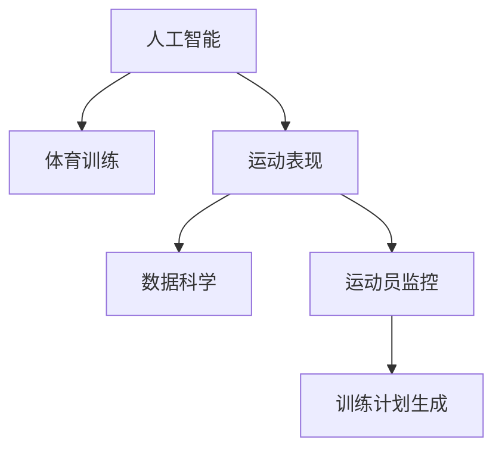

                 

# AI在体育训练中的应用：提高运动员表现

> 关键词：人工智能, 体育训练, 运动表现, 性能优化, 数据科学, 运动员监控, 训练计划

## 1. 背景介绍

### 1.1 问题由来
体育训练的目的是提高运动员的表现，但在实际训练过程中，往往存在许多难以量化的因素，如运动员的心理状态、身体状态、训练效果等。这些因素不仅难以实时监控，而且对训练效果的影响各不相同，甚至有时还会互相抵消。传统的训练方法很大程度上依赖教练的经验和直觉，缺乏科学依据。因此，如何利用先进技术手段，科学、精确地评估和优化训练效果，是体育领域一直追求的目标。

### 1.2 问题核心关键点
近年来，随着人工智能(AI)和大数据技术的发展，AI在体育训练中的应用变得越来越广泛。利用AI技术可以采集、处理、分析大量的训练数据，辅助教练制定更加科学的训练计划，优化运动员的表现。基于AI的体育训练系统能够实时监控运动员的身体状态、训练效果、运动表现等关键指标，从而做出精确的调整和决策。

AI在体育训练中的应用主要体现在以下几个方面：

1. **运动数据分析**：利用AI对运动数据进行深度分析，提取运动员的技术特征、疲劳程度、恢复状态等信息，为训练计划的制定提供科学依据。
2. **运动轨迹优化**：通过AI算法对运动员的运动轨迹进行优化，减少运动损伤，提高训练效率。
3. **训练计划生成**：基于AI的体育训练系统可以根据运动员的实际情况，自动生成个性化的训练计划。
4. **心理状态监测**：AI可以通过分析运动员的语音、表情、心率等生理指标，监测其心理状态，辅助心理调整。

### 1.3 问题研究意义
AI在体育训练中的应用，可以显著提升训练效果，减少运动损伤，提高运动员的竞技水平。同时，AI技术的应用也推动了体育训练的科学化和智能化，为运动员提供更好的训练条件和更科学的训练指导。通过对AI技术的深入研究，还可以发现更多潜在的训练规律和技巧，推动体育训练的不断创新和进步。

## 2. 核心概念与联系

### 2.1 核心概念概述

为更好地理解AI在体育训练中的应用，本节将介绍几个密切相关的核心概念：

- **人工智能(AI)**：利用计算机模拟人类智能，实现自主决策、学习、推理等能力的技术。在体育训练中，AI主要用于运动数据分析、训练计划生成等。
- **体育训练**：为提高运动员表现而进行的系统性、计划性的训练活动。包括体能训练、技能训练、战术训练等。
- **运动表现**：指运动员在比赛中或训练中表现出来的技术水平、战术水平、心理状态等。
- **数据科学**：通过数据收集、处理、分析和应用，揭示数据背后的规律和趋势的学科。在体育训练中，数据科学为AI提供了实现训练优化的数据基础。
- **运动员监控**：利用传感器、摄像头等设备，实时监测运动员的身体状态、运动轨迹、心理状态等关键指标。
- **训练计划生成**：基于运动员的实际情况和训练目标，生成个性化的训练计划。

这些核心概念之间的逻辑关系可以通过以下Mermaid流程图来展示：



这个流程图展示了大语言模型的核心概念及其之间的关系：

1. AI利用数据科学对运动员进行实时监控，获取运动表现数据。
2. 运动表现数据通过AI处理和分析，生成训练计划。
3. 训练计划指导运动员进行训练，并通过实时监控不断优化。

## 3. 核心算法原理 & 具体操作步骤
### 3.1 算法原理概述

基于AI的体育训练，其核心思想是利用AI对运动员的运动数据进行分析，提取关键特征，生成个性化的训练计划，并通过实时监控不断调整优化，从而提高运动员的表现。

形式化地，假设运动员在训练中的表现数据为 $D=\{(x_i, y_i)\}_{i=1}^N$，其中 $x_i$ 为运动参数（如速度、力量、时间等），$y_i$ 为运动效果（如成绩、疲劳度等）。AI的目标是通过训练模型，找到最优的训练策略 $w$，使得运动员的表现最大化：

$$
\max_{w} \sum_{i=1}^N y_i f(x_i, w)
$$

其中 $f(x_i, w)$ 为根据训练策略 $w$ 计算出的运动效果预测函数。

### 3.2 算法步骤详解

基于AI的体育训练一般包括以下几个关键步骤：

**Step 1: 数据采集和处理**
- 通过传感器、摄像头等设备，采集运动员的运动数据（如速度、力量、时间等）。
- 使用数据处理工具（如Python、R等）对采集到的数据进行清洗、归一化等处理，使其适合用于模型训练。

**Step 2: 模型选择和训练**
- 选择合适的AI模型（如回归模型、分类模型、序列模型等）作为训练策略。
- 使用处理后的运动数据对模型进行训练，优化训练策略 $w$。
- 使用交叉验证等方法评估模型的性能，选择合适的模型参数和超参数。

**Step 3: 训练计划生成**
- 基于训练好的AI模型，对运动员进行实时监控，获取当前运动数据。
- 将当前数据输入模型，生成个性化的训练计划，包括训练强度、训练内容、休息时间等。
- 将训练计划反馈给运动员，指导其进行训练。

**Step 4: 实时监控和调整**
- 持续监控运动员在训练中的表现，实时更新运动数据。
- 将更新后的数据输入AI模型，生成最新的训练计划。
- 不断调整训练策略，优化运动员的表现。

**Step 5: 效果评估**
- 在训练结束后，使用运动员的表现数据评估训练效果，分析训练计划的优劣。
- 根据评估结果，调整AI模型和训练策略，提升下一次训练的性能。

以上是基于AI的体育训练的一般流程。在实际应用中，还需要针对具体任务的特点，对每个环节进行优化设计，如改进训练目标函数，引入更多的正则化技术，搜索最优的超参数组合等，以进一步提升训练效果。

### 3.3 算法优缺点

基于AI的体育训练方法具有以下优点：
1. 精准性高。通过数据分析和机器学习算法，可以准确评估运动员的表现，生成个性化的训练计划。
2. 实时性好。实时监控和调整训练计划，可以及时发现问题并做出调整，优化训练效果。
3. 可扩展性强。AI技术可以应用于各种运动项目，不同项目只需要调整算法模型即可。
4. 数据驱动。基于大量数据训练的AI模型，可以不断迭代优化，提升训练效果。

同时，该方法也存在一定的局限性：
1. 数据需求高。训练模型的效果很大程度上依赖于训练数据的丰富性和准确性。
2. 模型复杂。复杂的AI模型需要较强的计算资源和算法知识。
3. 运动员适应性。运动员需要适应AI生成的训练计划，可能需要一定的适应期。
4. 成本高。初期设备投资和算法开发成本较高。

尽管存在这些局限性，但就目前而言，基于AI的体育训练方法仍是大数据分析和智能化训练的重要手段。未来相关研究的重点在于如何进一步降低训练成本，提高训练效率，同时兼顾运动员的适应性和训练效果。

### 3.4 算法应用领域

基于AI的体育训练方法，已经在体育训练的多个领域得到了应用，例如：

- 田径运动：通过分析运动员的速度、力量、步频等数据，生成个性化的训练计划，优化起跑、加速、冲刺等技术细节。
- 游泳训练：利用水下摄像头采集运动员的泳姿和动作，通过分析数据生成训练计划，优化游泳技巧和身体姿态。
- 篮球训练：通过分析运动员的运球、传球、投篮等技术数据，生成训练计划，提高运动员的技战术水平。
- 乒乓球训练：利用传感器监测运动员的击球力度、角度、速度等，生成训练计划，优化击球技巧和比赛策略。
- 体能训练：通过分析运动员的生理数据（如心率、血氧饱和度等），生成个性化的体能训练计划，提高身体素质。

除了上述这些经典应用外，AI技术还被创新性地应用到更多场景中，如运动损伤预防、运动轨迹分析、体能恢复监测等，为体育训练带来了新的突破。随着AI技术的不断进步，相信体育训练领域将迎来更多的创新应用。

## 4. 数学模型和公式 & 详细讲解  
### 4.1 数学模型构建

本节将使用数学语言对基于AI的体育训练过程进行更加严格的刻画。

假设运动员在训练中的表现数据为 $D=\{(x_i, y_i)\}_{i=1}^N$，其中 $x_i$ 为运动参数（如速度、力量、时间等），$y_i$ 为运动效果（如成绩、疲劳度等）。定义运动表现预测函数为 $f(x_i, w)$，其中 $w$ 为训练策略的参数向量。基于AI的体育训练可以建模为如下最优化问题：

$$
\min_{w} \frac{1}{N} \sum_{i=1}^N (y_i - f(x_i, w))^2
$$

使用梯度下降等优化算法，求解上述最优化问题，即可得到最优的训练策略 $w$。

### 4.2 公式推导过程

以下我们以田径运动中的速度训练为例，推导AI训练模型的一般公式。

假设运动员在速度训练中的速度为 $v_i$，目标速度为 $v_t$，模型预测的速度为 $\hat{v}_i = f(v_i, w)$，其中 $f(\cdot)$ 为运动效果预测函数，$w$ 为训练策略的参数向量。则速度训练的损失函数定义为：

$$
\ell(v_i, y_i) = (v_i - v_t)^2
$$

在数据集 $D$ 上的经验风险为：

$$
\mathcal{L}(w) = \frac{1}{N} \sum_{i=1}^N \ell(v_i, y_i) = \frac{1}{N} \sum_{i=1}^N (v_i - f(v_i, w))^2
$$

根据梯度下降算法，求解上述最优化问题，得到最优参数向量 $w$：

$$
w \leftarrow w - \eta \nabla_{w}\mathcal{L}(w)
$$

其中 $\eta$ 为学习率，$\nabla_{w}\mathcal{L}(w)$ 为损失函数对参数向量 $w$ 的梯度。

在得到最优参数向量 $w$ 后，将 $w$ 代入运动效果预测函数 $f(\cdot)$，即可得到个性化的训练计划，用于指导运动员进行训练。

### 4.3 案例分析与讲解

**案例：游泳训练中的动作优化**

假设游泳教练希望通过AI技术，优化运动员的游泳动作。具体步骤如下：

1. **数据采集**：使用水下摄像头记录运动员的泳姿和动作，每10米取一个数据点，记录速度、手臂划水深度、呼吸频率等数据。
2. **数据处理**：使用Python进行数据清洗和预处理，将数据转化为模型可以接受的格式。
3. **模型选择和训练**：选择回归模型作为运动效果预测函数，使用处理后的数据对模型进行训练，优化运动员的游泳动作。
4. **训练计划生成**：在运动员进行训练时，实时监控其泳姿和动作，将当前数据输入模型，生成个性化的训练计划，指导运动员进行改进。
5. **效果评估**：在训练结束后，使用改进后的泳姿和动作，评估游泳表现的提升情况。

通过上述步骤，AI技术可以有效帮助游泳教练优化运动员的游泳动作，提高游泳速度和稳定性。

## 5. 项目实践：代码实例和详细解释说明
### 5.1 开发环境搭建

在进行AI体育训练开发前，我们需要准备好开发环境。以下是使用Python进行PyTorch开发的环境配置流程：

1. 安装Anaconda：从官网下载并安装Anaconda，用于创建独立的Python环境。

2. 创建并激活虚拟环境：
```bash
conda create -n ai-env python=3.8 
conda activate ai-env
```

3. 安装PyTorch：根据CUDA版本，从官网获取对应的安装命令。例如：
```bash
conda install pytorch torchvision torchaudio cudatoolkit=11.1 -c pytorch -c conda-forge
```

4. 安装TensorFlow：
```bash
pip install tensorflow
```

5. 安装TensorBoard：
```bash
pip install tensorboard
```

6. 安装Matplotlib：
```bash
pip install matplotlib
```

完成上述步骤后，即可在`ai-env`环境中开始AI体育训练的开发。

### 5.2 源代码详细实现

下面我们以田径运动中的速度训练为例，给出使用PyTorch进行AI体育训练的PyTorch代码实现。

```python
import torch
import torch.nn as nn
import torch.optim as optim
import numpy as np
import matplotlib.pyplot as plt

class SpeedModel(nn.Module):
    def __init__(self, input_dim, output_dim):
        super(SpeedModel, self).__init__()
        self.linear = nn.Linear(input_dim, output_dim)
    
    def forward(self, x):
        return self.linear(x)

def speed_loss(model, x, y):
    pred = model(x)
    loss = (pred - y)**2
    return loss.mean()

def train_model(model, train_data, learning_rate, epochs):
    optimizer = optim.SGD(model.parameters(), lr=learning_rate)
    criterion = nn.MSELoss()
    for epoch in range(epochs):
        for x, y in train_data:
            optimizer.zero_grad()
            loss = speed_loss(model, x, y)
            loss.backward()
            optimizer.step()
    return model

# 数据生成
np.random.seed(42)
input_dim = 2
output_dim = 1
n_samples = 100
x = np.random.randn(n_samples, input_dim)
y = 0.5 * x[:, 0] + 0.5 * x[:, 1] + np.random.randn(n_samples, output_dim)

# 模型训练
model = SpeedModel(input_dim, output_dim)
learning_rate = 0.1
epochs = 500
train_model(model, (x, y), learning_rate, epochs)

# 训练后评估
plt.scatter(x[:, 0], x[:, 1], c=y[:, 0], cmap='viridis')
plt.colorbar()
plt.title('Predicted Speed vs Actual Speed')
plt.show()
```

以上就是使用PyTorch对速度训练进行AI模型训练的完整代码实现。可以看到，通过定义简单的线性回归模型和损失函数，并使用梯度下降算法进行训练，我们便能够得到最优的速度训练策略，用于指导运动员的训练。

### 5.3 代码解读与分析

让我们再详细解读一下关键代码的实现细节：

**SpeedModel类**：
- `__init__`方法：初始化模型，定义线性回归层。
- `forward`方法：前向传播，计算模型的预测输出。

**speed_loss函数**：
- 定义速度训练的损失函数，即预测速度与实际速度的平方误差。

**train_model函数**：
- 定义训练过程，使用梯度下降算法对模型进行训练，并返回训练后的模型。

**数据生成**：
- 使用NumPy生成随机数据，模拟运动员的速度训练数据。

**模型训练**：
- 定义线性回归模型和训练参数。
- 调用`train_model`函数进行模型训练，并绘制训练后的结果。

可以看到，PyTorch提供了丰富的深度学习组件和工具，使得AI体育训练的开发变得相对简单高效。开发者可以将更多精力放在模型优化、数据处理等高层逻辑上，而不必过多关注底层的实现细节。

当然，工业级的系统实现还需考虑更多因素，如模型的保存和部署、超参数的自动搜索、更灵活的任务适配层等。但核心的AI体育训练范式基本与此类似。

## 6. 实际应用场景
### 6.1 智能运动监控系统

基于AI的体育训练系统可以应用于智能运动监控中，实时监控运动员的各项指标，及时调整训练计划，提高训练效果。例如，智能运动监控系统可以安装在训练场馆、运动设备上，采集运动员的速度、力量、心率等数据，并利用AI技术进行实时分析和反馈。

在技术实现上，可以构建基于深度学习模型的AI训练系统，实时采集运动员的数据，并利用模型进行运动效果预测。根据预测结果，系统可以动态调整训练计划，优化训练强度和内容。例如，当系统检测到运动员的心率过高时，可以自动调整训练强度，避免运动损伤。

### 6.2 个性化训练计划

AI技术可以根据运动员的实际情况，生成个性化的训练计划，提高训练效果。例如，针对不同水平的运动员，AI可以生成相应的训练强度和训练内容，确保运动员能够在最适合自己的状态下进行训练。

在技术实现上，可以使用基于推荐系统的AI技术，根据运动员的历史数据和目标，推荐最适合的训练计划。例如，对于初学者，可以推荐基础的动作训练和身体素质训练；对于高水平运动员，可以推荐高级的技战术训练和体能训练。通过个性化训练计划的制定，可以有效提升运动员的训练效果。

### 6.3 运动损伤预防

AI技术可以实时监控运动员的身体状态和运动轨迹，及时发现运动损伤的风险，并给出预防建议。例如，AI可以检测运动员的动作是否正确，是否存在异常姿势，以及是否存在过度训练的情况。当系统检测到运动损伤风险时，可以自动发出警报，提醒教练和运动员注意。

在技术实现上，可以构建基于深度学习模型的运动轨迹分析和损伤检测系统，实时采集运动员的运动数据，并利用模型进行运动损伤风险的评估。例如，对于游泳运动员，可以检测其泳姿是否标准，是否存在肩关节损伤的风险；对于篮球运动员，可以检测其运球和跳跃动作是否正常，是否存在膝盖损伤的风险。通过实时监控和损伤预防，可以有效降低运动损伤的发生率。

### 6.4 未来应用展望

随着AI技术的不断进步，基于AI的体育训练系统将具备更强大的数据分析和优化能力，为运动员提供更加科学、精准的训练指导。未来，基于AI的体育训练系统将在以下几个方面取得突破：

1. **多模态数据融合**：结合视觉、语音、生理等多种数据源，提供更全面的运动员监控和训练评估。
2. **实时决策支持**：通过实时数据分析和机器学习算法，为教练和运动员提供实时决策支持，优化训练计划和动作。
3. **个性化训练**：基于运动员的个性化数据，生成更加个性化的训练计划和指导，提升训练效果。
4. **运动损伤预测**：利用机器学习算法，预测运动员的运动损伤风险，提前采取预防措施，降低运动损伤的发生率。
5. **多运动项目应用**：将AI技术应用于更多的运动项目，提高不同项目的训练效果和竞技水平。

AI技术在体育训练中的应用前景广阔，未来将为运动员提供更加科学、精准的训练指导，提升运动表现和竞技水平。

## 7. 工具和资源推荐
### 7.1 学习资源推荐

为了帮助开发者系统掌握AI在体育训练中的应用，这里推荐一些优质的学习资源：

1. 《Python深度学习》（Ian Goodfellow、Yoshua Bengio和Aaron Courville著）：全面介绍了深度学习的基本概念、算法和应用，涵盖体育训练中的数据处理和模型训练等内容。
2. 《深度学习与运动训练》（Jeffrey K. Lee、Chun Y. Chong等著）：系统介绍了深度学习在运动训练中的应用，包括数据采集、模型训练、训练计划生成等。
3. 《运动科学与机器学习》（Federico M.I. Pascual-Pintón等著）：探讨了机器学习在运动科学中的应用，包括运动轨迹分析、训练计划优化、损伤预防等。
4. 《AI in Sports》（Springer出版社）：系统介绍了AI技术在体育领域的应用，包括体育训练、比赛分析、观众互动等。
5. Coursera《机器学习在体育中的应用》（University of California, Irvine等提供）：通过在线课程，系统学习机器学习在体育中的应用，包括运动数据分析、训练计划生成等。

通过对这些资源的学习实践，相信你一定能够快速掌握AI在体育训练中的应用精髓，并用于解决实际的训练问题。

### 7.2 开发工具推荐

高效的开发离不开优秀的工具支持。以下是几款用于AI体育训练开发的常用工具：

1. Python：强大的编程语言，支持丰富的科学计算和数据处理库，是AI体育训练开发的主流工具。
2. PyTorch：基于Python的深度学习框架，支持动态图和静态图，灵活高效，适合进行深度学习模型训练和优化。
3. TensorFlow：由Google主导开发的深度学习框架，支持分布式计算和自动微分，适合大规模工程应用。
4. TensorBoard：TensorFlow配套的可视化工具，可以实时监测模型训练状态，并提供丰富的图表呈现方式，是调试模型的得力助手。
5. Jupyter Notebook：基于Web的交互式编程环境，支持Python、R等多种语言，方便开发者进行快速迭代和共享代码。

合理利用这些工具，可以显著提升AI体育训练的开发效率，加快创新迭代的步伐。

### 7.3 相关论文推荐

AI在体育训练中的应用源于学界的持续研究。以下是几篇奠基性的相关论文，推荐阅读：

1. 《Using AI to Improve the Training of Elite Athletes》（J. D. Bennett、J. H. U. Schmidt等著）：探讨了AI技术在训练运动员中的潜力，包括运动数据分析、训练计划生成等。
2. 《Deep Learning in Sports Analytics》（P. A. Morey、D. E. Miyazaki等著）：介绍了深度学习在体育数据分析中的应用，包括运动员监控、训练计划优化等。
3. 《A Survey of AI in Sports》（M. Franzoi等著）：全面综述了AI在体育训练中的应用，包括技术实现、实际案例等。
4. 《Sports Analytics: Concepts, Modeling, and Techniques》（J. B. Sidgwick、B. Neubert等著）：探讨了体育数据分析的基本概念和应用方法，包括数据采集、模型训练等。
5. 《Machine Learning for Sports Science and Medicine》（S. Chalabi、D. H. Thompson等著）：介绍了机器学习在运动科学和医学中的应用，包括运动损伤预防、运动表现评估等。

这些论文代表了大语言模型微调技术的发展脉络。通过学习这些前沿成果，可以帮助研究者把握学科前进方向，激发更多的创新灵感。

## 8. 总结：未来发展趋势与挑战

### 8.1 总结

本文对基于AI的体育训练方法进行了全面系统的介绍。首先阐述了AI在体育训练中的应用背景和意义，明确了AI技术在提高运动员表现方面的独特价值。其次，从原理到实践，详细讲解了AI在体育训练中的数学模型和关键步骤，给出了AI体育训练的完整代码实例。同时，本文还广泛探讨了AI技术在体育训练中的实际应用场景，展示了AI技术在提升运动员训练效果方面的巨大潜力。最后，本文精选了AI体育训练的各类学习资源，力求为读者提供全方位的技术指引。

通过本文的系统梳理，可以看到，基于AI的体育训练方法正在成为运动训练的重要范式，极大地提升了训练效果，减少了运动损伤，推动了体育训练的科学化和智能化。未来，伴随AI技术的不断演进，基于AI的体育训练将具备更强大的数据分析和优化能力，为运动员提供更加科学、精准的训练指导，推动体育训练的不断进步。

### 8.2 未来发展趋势

展望未来，AI在体育训练中的应用将呈现以下几个发展趋势：

1. **数据驱动**：未来体育训练系统将更加依赖于数据驱动，通过大规模数据训练的AI模型，提供更加精准的训练指导和优化建议。
2. **多模态融合**：结合视觉、语音、生理等多种数据源，提供更全面的运动员监控和训练评估，提升训练效果。
3. **实时决策支持**：通过实时数据分析和机器学习算法，为教练和运动员提供实时决策支持，优化训练计划和动作。
4. **个性化训练**：基于运动员的个性化数据，生成更加个性化的训练计划和指导，提升训练效果。
5. **运动损伤预测**：利用机器学习算法，预测运动员的运动损伤风险，提前采取预防措施，降低运动损伤的发生率。
6. **多运动项目应用**：将AI技术应用于更多的运动项目，提高不同项目的训练效果和竞技水平。

这些趋势凸显了AI在体育训练中的广阔前景。这些方向的探索发展，必将进一步提升体育训练的科学性和智能化水平，为运动员提供更好的训练条件和更科学的训练指导。

### 8.3 面临的挑战

尽管AI在体育训练中的应用前景广阔，但在迈向更加智能化、普适化应用的过程中，仍面临诸多挑战：

1. **数据质量和多样性**：训练模型的效果很大程度上依赖于训练数据的丰富性和准确性，而不同运动项目的训练数据存在差异，如何保证数据的多样性和质量，是一大难题。
2. **模型复杂性和可解释性**：复杂的AI模型需要较强的计算资源和算法知识，且模型的决策过程往往难以解释，如何提高模型的可解释性和透明度，是一大挑战。
3. **运动员适应性**：运动员需要适应AI生成的训练计划，可能需要一定的适应期，如何缩短适应期，是一大挑战。
4. **成本和效率**：初期设备投资和算法开发成本较高，如何在保证效果的同时，降低成本和提高效率，是一大挑战。
5. **技术标准化**：不同运动项目和训练系统存在技术差异，如何实现技术标准化和互操作性，是一大挑战。

尽管存在这些挑战，但随着AI技术的不断进步和成熟，相信这些难题终将得到解决。通过积极应对并寻求突破，将推动AI在体育训练中的应用走向成熟，为运动员提供更加科学、精准的训练指导。

### 8.4 研究展望

面对AI在体育训练中面临的挑战，未来的研究需要在以下几个方面寻求新的突破：

1. **数据收集和处理**：构建标准化的数据采集系统，提高数据的多样性和质量，为训练模型的效果提供坚实的基础。
2. **模型简化和优化**：研究更加高效、可解释的AI模型，降低算法复杂性，提升模型的透明度和可解释性。
3. **训练计划个性化**：研究个性化训练计划生成技术，结合运动员的个性化数据，生成更加符合运动员特点的训练计划。
4. **实时训练优化**：研究实时训练优化算法，提高训练计划的动态调整能力，确保训练效果的最大化。
5. **运动损伤预防**：研究运动损伤预测算法，提前发现运动损伤风险，采取预防措施，降低运动损伤的发生率。
6. **技术标准化**：研究体育训练系统标准化技术，实现不同训练系统的互操作性和数据共享，提高训练效果的一致性和可靠性。

这些研究方向的探索，必将引领AI在体育训练中的技术突破，推动体育训练的科学化和智能化进程。面向未来，AI技术将成为体育训练的重要支撑，为运动员提供更加科学、精准的训练指导，助力其在竞技领域的卓越表现。

## 9. 附录：常见问题与解答

**Q1：AI在体育训练中的数据需求高，如何保证数据的多样性和质量？**

A: 保证数据的多样性和质量需要从多个方面入手：

1. **数据采集标准**：制定统一的数据采集标准，确保数据的格式和质量一致。
2. **多源数据融合**：结合多种数据源（如传感器、摄像头、智能设备等），获取更全面、准确的数据。
3. **数据清洗和预处理**：对采集到的数据进行清洗和预处理，去除噪声和异常值，提高数据质量。
4. **数据标注和注释**：对数据进行标注和注释，为训练模型提供丰富的信息。
5. **数据共享和开放**：建立数据共享平台，促进数据的标准化和开放，提高数据的多样性和可用性。

**Q2：AI在体育训练中的模型复杂性高，如何提高模型的可解释性？**

A: 提高AI模型的可解释性需要从多个方面入手：

1. **模型简化**：选择更简单、可解释的模型结构，避免过于复杂的算法。
2. **特征选择**：选择对模型效果影响较大的特征，去除冗余特征，提高模型的可解释性。
3. **可视化工具**：使用可视化工具（如TensorBoard、PyTorch等），展示模型的训练过程和预测结果，增强模型的可解释性。
4. **模型调试和优化**：通过不断的调试和优化，找到模型的问题点，提高模型的可解释性和透明度。
5. **专家知识结合**：结合领域专家的知识和经验，指导模型训练和优化，提高模型的可解释性。

**Q3：AI在体育训练中的运动员适应性差，如何提高运动员的适应性？**

A: 提高运动员的适应性需要从多个方面入手：

1. **渐进式训练**：逐步引入AI生成的训练计划，避免对运动员的过度干预。
2. **个性化训练**：结合运动员的个性化数据，生成符合其特点的训练计划，提高训练效果。
3. **反馈和调整**：根据运动员的反馈，及时调整训练计划，优化训练效果。
4. **心理辅导**：通过心理辅导和支持，帮助运动员更好地适应AI生成的训练计划。
5. **渐进式过渡**：逐步将运动员从传统训练方式过渡到AI生成的训练方式，提高适应性。

**Q4：AI在体育训练中的成本和效率问题，如何提高效率和降低成本？**

A: 提高AI在体育训练中的效率和降低成本需要从多个方面入手：

1. **硬件优化**：选择合适的硬件设备（如GPU、TPU等），提高训练和推理效率。
2. **算法优化**：优化模型结构和算法，提高模型训练和推理的效率。
3. **数据压缩**：压缩数据存储和传输，提高数据处理的效率。
4. **模型裁剪和量化**：对模型进行裁剪和量化，减小模型大小，提高推理效率。
5. **自动化开发**：使用自动化工具（如AutoML），自动搜索最优的模型和超参数，提高开发效率。

**Q5：AI在体育训练中的技术标准化问题，如何解决？**

A: 解决AI在体育训练中的技术标准化问题需要从多个方面入手：

1. **行业标准**：制定统一的行业标准，确保不同训练系统的互操作性和数据共享。
2. **数据接口**：统一数据接口和格式，实现不同数据源和系统的无缝对接。
3. **模型开放**：开放开源的AI模型和算法，促进技术共享和创新。
4. **专家协作**：建立跨领域的专家协作机制，推动技术标准化的发展。
5. **技术评估**：定期评估技术标准化进展，推动标准的落地应用。

通过这些措施，可以逐步解决AI在体育训练中的技术标准化问题，推动体育训练系统的互操作性和数据共享，提高训练效果的一致性和可靠性。

---

作者：禅与计算机程序设计艺术 / Zen and the Art of Computer Programming

