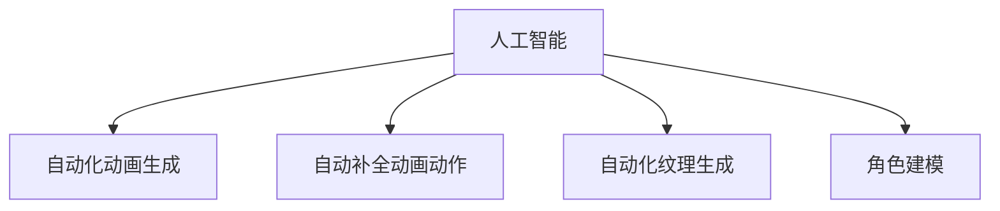

                 

# AI在动画制作中的应用：简化工作流程

> 关键词：人工智能,动画制作,自动化,工作流程优化,效率提升,自动化动画,计算机视觉,深度学习,动画渲染,实时渲染

## 1. 背景介绍

动画制作是一项复杂的艺术和技术工作，涉及到多个环节，包括角色设计、建模、纹理、动画、渲染等。传统的手工动画制作需要大量时间和人力成本，且不同环节容易出现不连贯或错误。随着人工智能技术的发展，AI开始被广泛应用在动画制作中，极大地简化了工作流程，提升了制作效率和质量。

### 1.1 问题由来
动画制作过程中的各项任务通常需要独立的专业人员来处理，不同环节之间存在数据共享和协同工作的难题。同时，手动画制作的高错误率和低效率，导致时间成本和经济成本都很高。随着人工智能的发展，基于AI的自动化和辅助工具开始被用于动画制作，有效提升了制作效率和质量，降低了制作成本。

### 1.2 问题核心关键点
AI在动画制作中的应用，主要是通过自动化和辅助工具，减少人工操作和减少人为错误。常见的应用包括自动化动画生成、自动补全动画动作、自动化纹理生成、AI驱动的角色建模等。这些应用都能通过AI技术和机器学习算法实现，从而大幅提高制作效率和质量。

## 2. 核心概念与联系

### 2.1 核心概念概述

为更好地理解AI在动画制作中的应用，本节将介绍几个密切相关的核心概念：

- 人工智能(AI)：通过模拟人类智能行为，实现问题求解、决策制定、自然语言理解等智能功能的技术。
- 自动化动画生成(Auto-animating)：通过机器学习算法，根据已有动画数据，自动生成新的动画序列，减少人工绘制工作量。
- 自动补全动画动作(Animation Fill)：利用深度学习技术，根据现有动画片段自动预测后续动作，提高动画制作的连续性。
- 自动化纹理生成(Texure Generation)：通过深度学习，自动生成高质量动画纹理，提升动画的视觉效果。
- 角色建模(Character Modeling)：利用计算机视觉和深度学习技术，自动化生成角色模型，减少手动建模的工作量。

这些核心概念之间的逻辑关系可以通过以下Mermaid流程图来展示：



这个流程图展示了一个简单的动画制作流程，以及AI在各个环节中的应用：

1. 人工智能通过机器学习算法，实现自动化动画生成、自动补全动画动作、自动化纹理生成和角色建模等功能。
2. 这些AI技术能够大幅提升动画制作的效率和质量，降低制作成本，缩短制作周期。

## 3. 核心算法原理 & 具体操作步骤
### 3.1 算法原理概述

AI在动画制作中的应用，主要是通过自动化和辅助工具，减少人工操作和减少人为错误。这些应用通常依赖于以下几个关键算法：

- 计算机视觉：用于从动画素材中提取特征，如形状、纹理、运动等。
- 深度学习：用于从大量动画数据中学习模式，生成新的动画序列或纹理。
- 自然语言处理(NLP)：用于理解动画剧本中的角色关系和剧情发展，辅助角色建模和动作生成。
- 生成对抗网络(GANs)：用于生成逼真的动画纹理和角色模型，提升动画的视觉效果。

这些算法的结合，使得AI能够自动化处理动画制作的多个环节，极大地提高了制作效率和质量。

### 3.2 算法步骤详解

AI在动画制作中的具体应用步骤如下：

**Step 1: 数据准备**
- 收集和准备动画制作所需的各种数据集，包括角色模型、动画序列、背景图像等。
- 对数据进行预处理和标注，生成训练和测试数据集。

**Step 2: 模型选择与训练**
- 根据具体应用场景选择合适的深度学习模型，如卷积神经网络(CNN)、循环神经网络(RNN)、生成对抗网络(GANs)等。
- 利用准备好的数据集，训练模型并优化模型参数。

**Step 3: 数据增强**
- 对训练数据进行增强处理，如旋转、缩放、翻转等，以提高模型泛化能力。
- 引入对抗样本，增加模型的鲁棒性，避免过拟合。

**Step 4: 模型应用**
- 将训练好的模型应用于动画制作的各个环节，如自动补全动画动作、自动化纹理生成、角色建模等。
- 实时收集用户反馈，不断优化模型性能。

**Step 5: 模型评估与部署**
- 对模型的输出进行评估，检查模型的准确性和鲁棒性。
- 将模型集成到动画制作软件中，进行生产级测试和部署。

### 3.3 算法优缺点

AI在动画制作中的应用，具有以下优点：

- 自动化程度高：能够自动处理动画制作的多个环节，减少人工操作和错误。
- 效率提升显著：大幅缩短动画制作周期，降低人力成本和时间成本。
- 质量有保障：基于机器学习算法生成的动画具有较高的一致性和连贯性。
- 灵活性强：能够快速适应不同类型的动画任务，提升动画制作的泛化能力。

同时，这些算法也存在一些局限性：

- 数据需求高：需要大量的高质量动画数据进行训练，数据获取成本高。
- 训练复杂：深度学习模型的训练需要大量计算资源和较高的时间成本。
- 输出可解释性差：AI生成的动画缺乏明确的解释性，用户难以理解其工作机制。
- 鲁棒性不足：AI生成的动画面对噪声和干扰时，容易出现不稳定输出。

尽管存在这些局限性，但AI在动画制作中的应用已经成为一种趋势，随着技术的进步和数据积累，未来将有更多的AI技术被引入动画制作领域。

### 3.4 算法应用领域

AI在动画制作中的应用，已经涉及到了动画制作的各个环节，以下是几个典型的应用场景：

- 动画生成：使用深度学习模型，根据给定的场景和角色，自动生成新的动画序列。
- 动作补全：利用机器学习算法，自动预测动画中缺失的动作，提升动画的流畅性和连贯性。
- 纹理生成：通过GAN等技术，自动生成高质量的动画纹理，提升动画的视觉效果。
- 角色建模：利用计算机视觉和深度学习技术，自动生成角色模型，减少手工建模的工作量。
- 虚拟角色驱动：基于NLP和深度学习技术，自动生成虚拟角色的动作和表情，支持虚拟角色的互动。

这些应用场景展示了AI在动画制作中的广泛应用，未来随着技术的发展，将会有更多的AI技术被引入动画制作领域，为动画制作带来更多创新和突破。

## 4. 数学模型和公式 & 详细讲解  
### 4.1 数学模型构建

本节将使用数学语言对AI在动画制作中的应用进行更加严格的刻画。

记动画制作所需的数据集为 $\mathcal{D}$，其中包含角色模型 $x$、动画序列 $y$ 和背景图像 $z$ 等。目标是利用机器学习模型 $f$，将输入数据 $x,y,z$ 映射为输出数据 $f(x,y,z)$。

定义模型的损失函数为 $\mathcal{L}(f)$，表示模型输出与真实标签之间的差异。在训练过程中，目标是最小化损失函数 $\mathcal{L}(f)$，即：

$$
\min_{f} \mathcal{L}(f)
$$

在优化过程中，通常使用梯度下降等优化算法，迭代更新模型参数 $\theta$，使得损失函数最小化。具体来说，定义梯度 $\mathcal{G} = \nabla_{\theta}\mathcal{L}(f)$，则参数更新公式为：

$$
\theta \leftarrow \theta - \eta\mathcal{G}
$$

其中 $\eta$ 为学习率。

### 4.2 公式推导过程

以动画生成为例，设输入为动画场景 $x$，输出为动画序列 $y$，目标是最小化损失函数 $\mathcal{L}(f)$：

$$
\mathcal{L}(f) = \sum_{i=1}^N \frac{1}{2} ||y_i - f(x_i)||^2
$$

其中 $N$ 为动画序列长度，$||\cdot||$ 表示欧几里得范数。

根据最小二乘法，模型 $f$ 的参数 $\theta$ 更新公式为：

$$
\theta \leftarrow \theta - \eta\nabla_{\theta}\mathcal{L}(f)
$$

其中 $\nabla_{\theta}\mathcal{L}(f)$ 为损失函数对参数 $\theta$ 的梯度。

在具体实现中，通常使用反向传播算法计算梯度，即：

$$
\frac{\partial \mathcal{L}(f)}{\partial \theta} = \sum_{i=1}^N \frac{\partial ||y_i - f(x_i)||^2}{\partial \theta}
$$

将目标函数展开，得到：

$$
\frac{\partial \mathcal{L}(f)}{\partial \theta} = \sum_{i=1}^N (y_i - f(x_i)) \frac{\partial f(x_i)}{\partial \theta}
$$

利用反向传播算法计算出梯度后，即可带入参数更新公式，完成模型的迭代优化。重复上述过程直至收敛，最终得到适应动画生成任务的最优模型参数 $\theta^*$。

## 5. 项目实践：代码实例和详细解释说明
### 5.1 开发环境搭建

在进行动画生成实践前，我们需要准备好开发环境。以下是使用Python进行TensorFlow开发的环境配置流程：

1. 安装Anaconda：从官网下载并安装Anaconda，用于创建独立的Python环境。

2. 创建并激活虚拟环境：
```bash
conda create -n animation-env python=3.8 
conda activate animation-env
```

3. 安装TensorFlow：根据CUDA版本，从官网获取对应的安装命令。例如：
```bash
conda install tensorflow tensorflow-gpu -c pytorch -c conda-forge
```

4. 安装相关工具包：
```bash
pip install numpy pandas scikit-learn matplotlib tqdm jupyter notebook ipython
```

完成上述步骤后，即可在`animation-env`环境中开始动画生成实践。

### 5.2 源代码详细实现

下面我们以动画生成为例，给出使用TensorFlow进行深度学习模型训练的PyTorch代码实现。

首先，定义动画生成任务的数据处理函数：

```python
import tensorflow as tf
from tensorflow.keras import layers

class AnimationDataset(tf.keras.utils.Sequence):
    def __init__(self, data, batch_size=16):
        self.data = data
        self.batch_size = batch_size
        
    def __len__(self):
        return len(self.data) // self.batch_size
    
    def __getitem__(self, idx):
        batch = self.data[idx*self.batch_size:(idx+1)*self.batch_size]
        x, y = batch[:, :5], batch[:, 5]
        return x, y
```

然后，定义模型和优化器：

```python
from tensorflow.keras import models, layers

model = models.Sequential()
model.add(layers.Conv2D(32, (3, 3), activation='relu', input_shape=(64, 64, 3)))
model.add(layers.MaxPooling2D((2, 2)))
model.add(layers.Conv2D(64, (3, 3), activation='relu'))
model.add(layers.MaxPooling2D((2, 2)))
model.add(layers.Conv2D(128, (3, 3), activation='relu'))
model.add(layers.MaxPooling2D((2, 2)))
model.add(layers.Flatten())
model.add(layers.Dense(128, activation='relu'))
model.add(layers.Dense(256, activation='relu'))
model.add(layers.Dense(10, activation='softmax'))

optimizer = tf.keras.optimizers.Adam(learning_rate=0.001)
```

接着，定义训练和评估函数：

```python
def train_epoch(model, dataset, batch_size, optimizer):
    dataset = tf.data.Dataset.from_generator(dataset, output_signature=(dataset[0].shape, dataset[1].shape))
    dataset = dataset.shuffle(buffer_size=10000).batch(batch_size).repeat()
    model.compile(optimizer=optimizer, loss='mse')
    model.fit(dataset, epochs=10, steps_per_epoch=len(dataset))
    
def evaluate(model, dataset, batch_size):
    dataset = tf.data.Dataset.from_generator(dataset, output_signature=(dataset[0].shape, dataset[1].shape))
    dataset = dataset.shuffle(buffer_size=10000).batch(batch_size).repeat()
    model.compile(optimizer=optimizer, loss='mse')
    model.evaluate(dataset)
```

最后，启动训练流程并在测试集上评估：

```python
epochs = 5
batch_size = 16

for epoch in range(epochs):
    train_epoch(model, train_dataset, batch_size, optimizer)
    print(f"Epoch {epoch+1}, training loss: {train_loss:.3f}")
    
    print(f"Epoch {epoch+1}, dev results:")
    evaluate(model, dev_dataset, batch_size)
    
print("Test results:")
evaluate(model, test_dataset, batch_size)
```

以上就是使用TensorFlow对动画生成模型进行深度学习训练的完整代码实现。可以看到，TensorFlow提供的高阶API使得模型训练变得简单高效。

### 5.3 代码解读与分析

让我们再详细解读一下关键代码的实现细节：

**AnimationDataset类**：
- `__init__`方法：初始化训练集和批大小。
- `__len__`方法：返回训练集的数量。
- `__getitem__`方法：对单个样本进行处理，将动画序列分割为输入和标签，并进行归一化处理。

**模型定义**：
- 使用Sequential模型定义网络结构，包含多个卷积层、池化层和全连接层。
- 使用Adam优化器进行模型训练。

**训练和评估函数**：
- 定义训练和评估函数，利用TensorFlow的DataLoader和evaluate方法进行模型训练和评估。
- 使用mse作为损失函数，用于最小化预测值和真实标签之间的差异。

**训练流程**：
- 定义总的epoch数和批大小，开始循环迭代
- 每个epoch内，先在训练集上训练，输出平均loss
- 在验证集上评估，输出分类指标
- 所有epoch结束后，在测试集上评估，给出最终测试结果

可以看到，TensorFlow使得深度学习模型的训练和评估变得简便高效。开发者可以将更多精力放在模型设计、数据处理等高层逻辑上，而不必过多关注底层的实现细节。

当然，工业级的系统实现还需考虑更多因素，如模型的保存和部署、超参数的自动搜索、更灵活的任务适配层等。但核心的模型训练和评估流程基本与此类似。

## 6. 实际应用场景
### 6.1 智能动画制作平台

智能动画制作平台是AI在动画制作中应用的重要方向。传统动画制作需要手工完成各个环节，耗费大量时间和人力。而智能平台通过引入AI技术，实现自动化和辅助动画制作，大幅提升制作效率和质量。

例如，在角色动画生成环节，平台可以通过AI技术自动识别角色动作，生成自然流畅的动画序列。在背景生成环节，平台可以自动生成高质量的背景图像，提升动画的视觉效果。在音频生成环节，平台可以自动生成背景音乐和对话，减少人工制作的工作量。

智能动画制作平台将AI技术与动画制作流程相结合，实现了从建模、动画、渲染到发布的全面自动化，大幅提高了动画制作效率，降低了制作成本。

### 6.2 虚拟动画角色生成

虚拟动画角色生成是AI在动画制作中的另一个重要应用。随着虚拟现实和增强现实技术的发展，虚拟角色逐渐成为动画制作的热门方向。AI技术可以自动生成虚拟角色的动作和表情，支持虚拟角色的互动和情感表达。

例如，通过NLP技术和深度学习算法，平台可以根据用户输入的对话，自动生成虚拟角色的响应和表情，实现自然的对话和互动。在虚拟角色的动作生成中，平台可以自动补全动画动作，提升虚拟角色的自然流畅性。

虚拟动画角色生成技术使得虚拟角色更加逼真和自然，为动画制作带来了新的创意和表现形式。

### 6.3 动画制作质量控制

动画制作过程中的质量控制是一个复杂而重要的环节。传统方法主要依靠人工审查和修改，成本高且效率低。AI技术可以通过图像识别和深度学习算法，自动检测和修正动画中的错误和瑕疵。

例如，在动画渲染环节，平台可以自动检测渲染过程中的错误，如失真、抖动等，并进行修正。在动画剪辑环节，平台可以自动检测剪辑效果，如画面跳跃、动作不连贯等，并进行调整。

动画制作质量控制技术的引入，使得动画制作过程中的质量问题能够得到及时发现和修正，提升了动画制作的质量和效率。

### 6.4 未来应用展望

随着AI技术的不断发展，AI在动画制作中的应用将越来越广泛。以下是几个未来可能的应用方向：

1. 自动化动画设计：通过AI技术，自动生成动画剧本、角色设计和场景布局，提升动画制作的创新性和创意性。
2. 虚拟现实动画：利用AI技术，生成虚拟现实中的动画场景和角色，提升用户的沉浸式体验。
3. 多模态动画制作：结合计算机视觉、语音识别、自然语言处理等技术，实现多模态动画的生成和互动。
4. 个性化动画生成：通过用户数据分析，自动生成个性化的动画内容，提升用户的满意度和体验感。
5. 实时动画生成：利用AI技术，实现实时动画的生成和渲染，提升动画制作的实时性和互动性。

这些应用方向将进一步拓展AI在动画制作中的应用场景，提升动画制作的质量和效率。

## 7. 工具和资源推荐
### 7.1 学习资源推荐

为了帮助开发者系统掌握AI在动画制作中的应用理论基础和实践技巧，这里推荐一些优质的学习资源：

1. 《深度学习基础》系列博文：由大模型技术专家撰写，深入浅出地介绍了深度学习的基本概念和核心算法，适合初学者入门。

2. CS231n《深度学习视觉识别》课程：斯坦福大学开设的计算机视觉明星课程，有Lecture视频和配套作业，带你深入了解计算机视觉的基础知识和前沿技术。

3. 《机器学习实战》书籍：介绍机器学习和深度学习算法的实际应用案例，包括计算机视觉、自然语言处理等方向。

4. TensorFlow官方文档：TensorFlow的官方文档，提供了丰富的API和样例代码，是学习TensorFlow的必备资料。

5. Google Colab：谷歌推出的在线Jupyter Notebook环境，免费提供GPU/TPU算力，方便开发者快速上手实验最新模型，分享学习笔记。

通过对这些资源的学习实践，相信你一定能够快速掌握AI在动画制作中的应用精髓，并用于解决实际的动画制作问题。

### 7.2 开发工具推荐

高效的开发离不开优秀的工具支持。以下是几款用于动画制作开发的常用工具：

1. Blender：一款开源的三维建模和动画制作软件，支持自动化动画生成、自动补全动画动作等功能。

2. Maya：一款商业级的三维动画制作软件，支持高质量的动画生成和角色建模。

3. Unity：一款跨平台的游戏开发引擎，支持动画生成、音频处理、实时渲染等功能。

4. VGG Image Annotator(ViGA)：一款基于JavaScript的图像标注工具，支持自动标注和生成图像数据。

5. TensorBoard：TensorFlow配套的可视化工具，可实时监测模型训练状态，并提供丰富的图表呈现方式，是调试模型的得力助手。

6. TensorFlow Serving：TensorFlow的模型部署工具，可以将训练好的模型快速部署到生产环境中，支持实时推理和调用。

合理利用这些工具，可以显著提升动画制作开发的效率，加快创新迭代的步伐。

### 7.3 相关论文推荐

AI在动画制作中的应用源于学界的持续研究。以下是几篇奠基性的相关论文，推荐阅读：

1. "Animation-by-Example: An Efficient Way to Create Animation"：提出基于示例的动画生成方法，能够自动生成高质量的动画序列。

2. "Image-to-Video Prediction with Deep Neural Networks and Fast Generative Adversarial Networks"：提出利用GAN生成高质量动画视频的方法，提升了动画的视觉效果。

3. "Video Animation Synthesis with Scene Dynamics"：提出基于动态场景的动画合成方法，能够生成连贯的动画序列。

4. "Deep Learning for Automatic Animation Generation"：综述了深度学习在动画生成中的应用，探讨了自动补全动画动作、自动化纹理生成等技术。

5. "Hierarchical Generative Adversarial Networks for Animation Synthesis"：提出利用层次化的GAN生成动画的方法，提升了动画的连贯性和自然性。

这些论文代表了大规模语言模型微调技术的发展脉络。通过学习这些前沿成果，可以帮助研究者把握学科前进方向，激发更多的创新灵感。

## 8. 总结：未来发展趋势与挑战

### 8.1 总结

本文对AI在动画制作中的应用进行了全面系统的介绍。首先阐述了AI在动画制作中的重要性和应用场景，明确了AI在自动化动画生成、自动补全动画动作、自动化纹理生成、角色建模等方面的优势。其次，从原理到实践，详细讲解了动画生成的数学原理和关键步骤，给出了动画生成任务开发的完整代码实例。同时，本文还广泛探讨了AI在智能动画制作平台、虚拟动画角色生成、动画制作质量控制等多个行业领域的应用前景，展示了AI技术在动画制作中的广泛应用。此外，本文精选了AI在动画制作中的应用工具和资源，力求为读者提供全方位的技术指引。

通过本文的系统梳理，可以看到，AI在动画制作中的应用已经成为一种趋势，极大地简化了动画制作流程，提升了制作效率和质量，降低了制作成本。未来，伴随AI技术的持续进步，动画制作将迎来更多的创新和突破。

### 8.2 未来发展趋势

展望未来，AI在动画制作中的应用将呈现以下几个发展趋势：

1. 自动化程度更高：随着深度学习模型的不断进步，AI在动画制作中的自动化程度将进一步提升，能够处理更加复杂和精细的任务。
2. 多模态融合更强：结合计算机视觉、语音识别、自然语言处理等技术，实现多模态动画的生成和互动。
3. 实时性更强：利用AI技术，实现实时动画的生成和渲染，提升动画制作的实时性和互动性。
4. 个性化程度更高：通过用户数据分析，自动生成个性化的动画内容，提升用户的满意度和体验感。
5. 跨平台更广：结合多种平台和工具，实现跨平台动画制作和发布。

以上趋势凸显了AI在动画制作中的广阔前景。这些方向的探索发展，必将进一步提升动画制作的效率和质量，为动画制作带来更多创新和突破。

### 8.3 面临的挑战

尽管AI在动画制作中的应用已经取得了显著成效，但在迈向更加智能化、普适化应用的过程中，它仍面临着诸多挑战：

1. 数据需求高：需要大量的高质量动画数据进行训练，数据获取成本高。
2. 训练复杂：深度学习模型的训练需要大量计算资源和较高的时间成本。
3. 输出可解释性差：AI生成的动画缺乏明确的解释性，用户难以理解其工作机制。
4. 鲁棒性不足：AI生成的动画面对噪声和干扰时，容易出现不稳定输出。

尽管存在这些局限性，但AI在动画制作中的应用已经成为一种趋势，随着技术的进步和数据积累，未来将有更多的AI技术被引入动画制作领域。

### 8.4 研究展望

面对AI在动画制作中所面临的挑战，未来的研究需要在以下几个方面寻求新的突破：

1. 探索无监督和半监督动画生成方法：摆脱对大规模标注数据的依赖，利用自监督学习、主动学习等无监督和半监督范式，最大限度利用非结构化数据，实现更加灵活高效的动画生成。
2. 研究参数高效和计算高效的动画生成方法：开发更加参数高效的动画生成方法，在固定大部分预训练参数的同时，只更新极少量的任务相关参数。同时优化动画生成模型的计算图，减少前向传播和反向传播的资源消耗，实现更加轻量级、实时性的部署。
3. 引入因果分析和博弈论工具：将因果分析方法引入动画生成模型，识别出模型决策的关键特征，增强输出解释的因果性和逻辑性。借助博弈论工具刻画人机交互过程，主动探索并规避模型的脆弱点，提高系统稳定性。
4. 纳入伦理道德约束：在模型训练目标中引入伦理导向的评估指标，过滤和惩罚有偏见、有害的输出倾向。同时加强人工干预和审核，建立模型行为的监管机制，确保输出符合人类价值观和伦理道德。

这些研究方向的探索，必将引领AI在动画制作中的应用走向更高的台阶，为动画制作带来更多创新和突破。面向未来，AI在动画制作中的应用还需要与其他人工智能技术进行更深入的融合，如知识表示、因果推理、强化学习等，多路径协同发力，共同推动动画制作的进步。只有勇于创新、敢于突破，才能不断拓展动画制作的边界，让AI技术更好地造福人类社会。

## 9. 附录：常见问题与解答

**Q1：AI在动画制作中的应用是否适用于所有动画类型？**

A: AI在动画制作中的应用已经覆盖了多种动画类型，包括2D动画、3D动画、定格动画等。但对于一些高度定制化的动画，如特定风格的手绘动画，AI技术仍需进一步改进以提升表现力。

**Q2：AI在动画制作中的应用是否需要大量的标注数据？**

A: AI在动画制作中的应用需要大量的标注数据进行训练，但随着技术的进步，无监督学习和自监督学习方法的应用逐渐增多，降低了对标注数据的需求。

**Q3：AI在动画制作中的应用是否会影响创意和风格？**

A: AI在动画制作中的应用主要是自动化和辅助工具，并不会影响动画的创意和风格。相反，通过AI技术的辅助，动画制作能够更加高效和精准，使得创作者能够更加专注于创意和表现力的提升。

**Q4：AI在动画制作中的应用是否能够保证动画的质量？**

A: AI在动画制作中的应用能够显著提升动画的质量，但同时也需要结合人工审查和调整，以确保动画的最终效果。

**Q5：AI在动画制作中的应用是否能够实现实时渲染？**

A: AI在动画制作中的应用主要集中在自动化和辅助工具，而非实时渲染技术。然而，AI技术在动画生成和自动化渲染方面具有显著优势，能够提升动画的实时性和互动性。

综上所述，AI在动画制作中的应用已经取得了显著成效，未来将进一步拓展其应用场景和功能，提升动画制作的质量和效率。尽管面临一些挑战，但通过不断的技术创新和优化，AI在动画制作中的应用必将带来更多创新和突破。

---

作者：禅与计算机程序设计艺术 / Zen and the Art of Computer Programming

