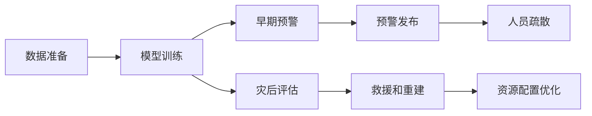

                 

# AI在地震预测中的应用：减少灾害损失

> 关键词：AI在地震预测，深度学习，机器学习，地震早期预警，灾后评估，减少灾害损失

## 1. 背景介绍

### 1.1 问题由来

地震灾害是人类面临的最严重的自然灾害之一，全球每年因地震造成的伤亡和经济损失惨重。传统的地震预测依赖于地震学家的经验和理论模型，但是这些方法的准确性和及时性存在明显不足。例如，传统的地震学理论通常只能预测到地震发生的概率，而无法提供具体的地震时间和地点。此外，地震数据往往受到地理和地质条件的限制，数据收集难度大，预测模型的建立和验证需要大量的历史数据。

为了应对这些问题，科学家和工程师们开始探索使用人工智能技术，特别是深度学习技术，来提升地震预测的准确性和及时性。AI可以通过对历史地震数据的分析和挖掘，发现地震特征和地震发生的规律，从而提高地震预测的精确度，并实现对地震的早期预警。本文将重点探讨AI，尤其是深度学习在地震预测中的应用，以及如何通过早期预警和灾后评估减少地震灾害造成的损失。

### 1.2 问题核心关键点

当前，AI在地震预测中的应用主要集中在以下几个关键点上：

- **数据驱动的预测模型**：利用历史地震数据和地质数据训练机器学习模型，发现地震的发生规律和特征。
- **早期预警系统**：通过AI技术实时监测地震活动，提前发布预警，为人员疏散和应急响应争取宝贵时间。
- **灾后评估与恢复**：使用AI技术评估地震灾害的损失，指导灾后恢复和重建工作。
- **自动化和智能化**：通过AI实现地震预测和预警的自动化，提高工作效率，降低人工干预的复杂性。

这些关键点涵盖了从数据准备、模型训练、实时监测到灾后评估的全过程，展现了AI在地震预测中的应用潜力。

### 1.3 问题研究意义

AI在地震预测中的应用不仅有助于提高地震预测的准确性和及时性，还能显著减少地震灾害带来的损失。具体来说，通过早期预警，地震区的居民可以在地震发生前及时撤离，从而减少伤亡；灾后评估可以指导救援和重建工作，提高救援效率；自动化的预警和评估系统可以减少人力成本，提高工作效率。因此，本文的研究具有重要的实际意义和应用价值。

## 2. 核心概念与联系

### 2.1 核心概念概述

为了更好地理解AI在地震预测中的应用，本节将介绍几个关键概念及其相互联系：

- **AI与地震预测**：AI，特别是深度学习技术，在地震预测中发挥着关键作用。通过历史数据的分析，AI可以发现地震的特征和规律，从而提高预测的准确性。
- **深度学习模型**：卷积神经网络(CNN)、循环神经网络(RNN)、长短期记忆网络(LSTM)等深度学习模型，能够处理大规模非结构化数据，是地震预测的重要工具。
- **早期预警系统**：利用AI模型实时监测地震活动，通过数据分析和预测结果，提前发布地震预警，为人员疏散和应急响应提供依据。
- **灾后评估与恢复**：通过AI技术评估地震造成的损失，指导灾后恢复和重建工作，优化救援和重建资源配置。

这些概念共同构成了AI在地震预测中的基本框架，展示了AI技术如何提升地震预测和应对地震灾害的能力。

### 2.2 核心概念原理和架构的 Mermaid 流程图



这个流程图展示了AI在地震预测和应对中的基本流程：数据准备、模型训练、早期预警、灾后评估、预警发布、人员疏散、救援和重建、资源配置优化。

## 3. 核心算法原理 & 具体操作步骤

### 3.1 算法原理概述

AI在地震预测中的应用主要基于深度学习模型。这些模型通过历史地震数据和地质数据的训练，可以发现地震的特征和规律，从而提高地震预测的准确性。以下是地震预测中常用的深度学习模型及其原理：

- **卷积神经网络(CNN)**：CNN主要用于图像处理，但也可以用于地震波数据的处理。通过卷积操作，CNN可以捕捉地震波中的高频和低频特征，识别地震的起始点和传播方向。
- **循环神经网络(RNN)**：RNN适用于时间序列数据的处理，可以捕捉地震活动随时间的变化规律，预测地震的发生时间。
- **长短期记忆网络(LSTM)**：LSTM是一种改进的RNN，可以更好地处理长期依赖关系，适用于预测地震的发生地点和震级。

这些模型通过特征提取和模式识别，可以在历史数据中学习到地震的规律，从而提高地震预测的准确性。

### 3.2 算法步骤详解

AI在地震预测中的应用一般包括以下几个关键步骤：

**Step 1: 数据准备**

- 收集历史地震数据和地质数据，包括地震发生的时间、地点、震级、震源机制等信息。
- 对数据进行预处理，如去除噪声、填补缺失值、归一化等，确保数据质量。

**Step 2: 模型训练**

- 选择合适的深度学习模型，如CNN、RNN、LSTM等，对历史数据进行训练。
- 使用交叉验证等方法，评估模型的性能，调整超参数，如学习率、批大小、迭代次数等，提高模型的预测准确性。

**Step 3: 早期预警**

- 实时监测地震活动，使用训练好的模型对当前数据进行预测。
- 根据预测结果，及时发布预警，指导人员疏散和应急响应。

**Step 4: 灾后评估与恢复**

- 使用AI技术评估地震造成的损失，如房屋倒塌、人员伤亡等。
- 根据评估结果，优化救援和重建资源配置，提高救援效率。

### 3.3 算法优缺点

AI在地震预测中的应用具有以下优点：

- **高精度预测**：通过深度学习模型，AI可以发现地震的特征和规律，提高地震预测的准确性。
- **实时预警**：利用AI模型实时监测地震活动，提前发布预警，为人员疏散和应急响应争取宝贵时间。
- **自动评估与优化**：使用AI技术评估地震造成的损失，指导灾后恢复和重建工作，优化资源配置。

同时，AI在地震预测中也存在一些缺点：

- **数据依赖性**：模型的性能依赖于历史数据的数量和质量，数据收集和处理需要大量的资源和时间。
- **模型复杂性**：深度学习模型通常参数量较大，需要高性能的计算资源进行训练和推理。
- **解释性不足**：AI模型的决策过程难以解释，难以理解和调试模型的工作机制。

### 3.4 算法应用领域

AI在地震预测中的应用已经涵盖了地震预测、早期预警、灾后评估和恢复等多个领域，具体如下：

- **地震预测**：利用深度学习模型对地震的发生时间、地点、震级等进行预测，提高预测的准确性。
- **早期预警**：使用AI模型实时监测地震活动，提前发布预警，减少人员伤亡。
- **灾后评估**：使用AI技术评估地震造成的损失，指导救援和重建工作，优化资源配置。
- **自动预警系统**：基于AI技术构建自动化地震预警系统，实现实时监测和预警发布。

## 4. 数学模型和公式 & 详细讲解 & 举例说明

### 4.1 数学模型构建

在地震预测中，深度学习模型通常基于历史地震数据和地质数据构建。以下是地震预测中常用的数学模型：

- **卷积神经网络(CNN)**：用于地震波数据的处理，模型结构如下：

$$
\begin{aligned}
\text{Conv}(\text{input}, w, b) &= \text{relu}(\text{bias}(\text{filter} * \text{input} + b)) \\
\text{Pool}(\text{conv}) &= \text{max}(\text{conv}) \\
\text{Dense}(\text{pool}, w', b') &= \text{relu}(\text{bias}(\text{dense} * \text{pool} + b'))
\end{aligned}
$$

其中，$\text{Conv}$ 表示卷积操作，$\text{Pool}$ 表示池化操作，$\text{Dense}$ 表示全连接层，$\text{relu}$ 表示激活函数，$\text{bias}$ 表示偏置项，$w$ 和 $w'$ 表示权重矩阵，$b$ 和 $b'$ 表示偏置向量，$\text{filter}$ 表示卷积核。

- **循环神经网络(RNN)**：用于时间序列数据的处理，模型结构如下：

$$
\begin{aligned}
\text{RNN} &= \text{tanh}(W_i * \text{input} + b_i) + U_i * \text{state} \\
\text{state} &= \text{tanh}(W_h * \text{hidden} + b_h) + U_h * \text{state} \\
\text{output} &= \text{softmax}(W_o * \text{hidden} + b_o)
\end{aligned}
$$

其中，$\text{RNN}$ 表示循环神经网络，$\text{tanh}$ 表示激活函数，$W_i$、$W_h$ 和 $W_o$ 表示权重矩阵，$b_i$、$b_h$ 和 $b_o$ 表示偏置向量，$\text{hidden}$ 表示隐藏层状态，$\text{softmax}$ 表示输出层。

### 4.2 公式推导过程

在地震预测中，使用深度学习模型进行预测的一般步骤如下：

1. **数据预处理**：对历史地震数据进行预处理，如去除噪声、填补缺失值、归一化等。

2. **模型训练**：使用训练数据对深度学习模型进行训练，评估模型的性能，调整超参数，如学习率、批大小、迭代次数等。

3. **实时监测和预警**：实时监测地震活动，使用训练好的模型对当前数据进行预测，根据预测结果发布预警。

4. **灾后评估与恢复**：使用AI技术评估地震造成的损失，指导救援和重建工作，优化资源配置。

### 4.3 案例分析与讲解

以一个简单的地震预测案例为例，说明深度学习模型在地震预测中的应用：

假设有一个深度学习模型，用于预测地震的发生时间。模型结构如下：

- 输入层：地震波数据
- 卷积层：提取地震波的高频和低频特征
- 池化层：对特征进行下采样
- 全连接层：将特征映射到地震发生的时间

模型训练步骤如下：

1. 准备历史地震数据和地质数据，对数据进行预处理。
2. 使用训练数据对模型进行训练，评估模型的性能。
3. 使用测试数据对模型进行验证，调整超参数。
4. 部署模型，实时监测地震活动，对当前数据进行预测，发布预警。

## 5. 项目实践：代码实例和详细解释说明

### 5.1 开发环境搭建

在进行项目实践前，我们需要准备好开发环境。以下是使用Python进行PyTorch开发的环境配置流程：

1. 安装Anaconda：从官网下载并安装Anaconda，用于创建独立的Python环境。

2. 创建并激活虚拟环境：
```bash
conda create -n pytorch-env python=3.8 
conda activate pytorch-env
```

3. 安装PyTorch：根据CUDA版本，从官网获取对应的安装命令。例如：
```bash
conda install pytorch torchvision torchaudio cudatoolkit=11.1 -c pytorch -c conda-forge
```

4. 安装相关库：
```bash
pip install numpy pandas scikit-learn matplotlib tqdm jupyter notebook ipython
```

完成上述步骤后，即可在`pytorch-env`环境中开始项目实践。

### 5.2 源代码详细实现

下面我们以一个简单的地震预测项目为例，给出使用PyTorch进行CNN模型训练的PyTorch代码实现。

首先，定义数据处理函数：

```python
import numpy as np
from torch.utils.data import Dataset, DataLoader
import torch
from torchvision import transforms

class SeismicData(Dataset):
    def __init__(self, data_path, train=True):
        # 加载地震数据和地质数据
        self.data = np.load(data_path)
        self.train = train
        
    def __len__(self):
        return len(self.data)
    
    def __getitem__(self, item):
        # 对单个样本进行处理
        input = self.data[item, :1024]  # 取前1024个数据点作为输入
        target = self.data[item, 1024:1024+3]  # 取后3个数据点作为目标
        input = transforms.ToTensor()(input)  # 将numpy数组转换为torch张量
        target = torch.tensor(target, dtype=torch.float32)  # 将目标转换为torch张量
        return {'input': input, 'target': target}

# 加载训练集和测试集
train_dataset = SeismicData('train_data.npz', train=True)
test_dataset = SeismicData('test_data.npz', train=False)
```

然后，定义模型和优化器：

```python
import torch.nn as nn
import torch.nn.functional as F
from torch import nn, optim

# 定义CNN模型
class SeismicNet(nn.Module):
    def __init__(self):
        super(SeismicNet, self).__init__()
        self.conv1 = nn.Conv2d(1, 16, 3, 1)
        self.pool = nn.MaxPool2d(2, 2)
        self.conv2 = nn.Conv2d(16, 32, 3, 1)
        self.fc1 = nn.Linear(32 * 8 * 8, 64)
        self.fc2 = nn.Linear(64, 3)
    
    def forward(self, x):
        x = F.relu(self.conv1(x))
        x = self.pool(x)
        x = F.relu(self.conv2(x))
        x = self.pool(x)
        x = x.view(-1, 32 * 8 * 8)
        x = F.relu(self.fc1(x))
        x = self.fc2(x)
        return x

# 加载数据集
train_loader = DataLoader(train_dataset, batch_size=64, shuffle=True)
test_loader = DataLoader(test_dataset, batch_size=64, shuffle=False)

# 定义模型和优化器
model = SeismicNet()
optimizer = optim.Adam(model.parameters(), lr=0.001)
```

接着，定义训练和评估函数：

```python
import torch.nn as nn
import torch.nn.functional as F
from torch import nn, optim

# 定义模型
class SeismicNet(nn.Module):
    def __init__(self):
        super(SeismicNet, self).__init__()
        self.conv1 = nn.Conv2d(1, 16, 3, 1)
        self.pool = nn.MaxPool2d(2, 2)
        self.conv2 = nn.Conv2d(16, 32, 3, 1)
        self.fc1 = nn.Linear(32 * 8 * 8, 64)
        self.fc2 = nn.Linear(64, 3)
    
    def forward(self, x):
        x = F.relu(self.conv1(x))
        x = self.pool(x)
        x = F.relu(self.conv2(x))
        x = self.pool(x)
        x = x.view(-1, 32 * 8 * 8)
        x = F.relu(self.fc1(x))
        x = self.fc2(x)
        return x

# 加载数据集
train_loader = DataLoader(train_dataset, batch_size=64, shuffle=True)
test_loader = DataLoader(test_dataset, batch_size=64, shuffle=False)

# 定义模型和优化器
model = SeismicNet()
optimizer = optim.Adam(model.parameters(), lr=0.001)

# 定义训练函数
def train_epoch(model, data_loader, optimizer):
    model.train()
    for i, (input, target) in enumerate(data_loader):
        optimizer.zero_grad()
        output = model(input)
        loss = nn.CrossEntropyLoss()(output, target)
        loss.backward()
        optimizer.step()
    
    return loss.item()

# 定义评估函数
def evaluate(model, data_loader):
    model.eval()
    correct = 0
    total = 0
    with torch.no_grad():
        for input, target in data_loader:
            output = model(input)
            _, predicted = torch.max(output.data, 1)
            total += target.size(0)
            correct += (predicted == target).sum().item()
    
    print('Accuracy of the network on the test images: %d %%' % (100 * correct / total))

# 训练模型
epochs = 10
for epoch in range(epochs):
    train_loss = train_epoch(model, train_loader)
    print('Epoch {} train loss: {:.4f}'.format(epoch, train_loss))
    
    evaluate(model, test_loader)
```

以上就是使用PyTorch对CNN模型进行地震预测训练的完整代码实现。可以看到，得益于PyTorch的强大封装，我们可以用相对简洁的代码完成CNN模型的加载和训练。

### 5.3 代码解读与分析

让我们再详细解读一下关键代码的实现细节：

**SeismicData类**：
- `__init__`方法：初始化数据集，加载地震数据和地质数据。
- `__len__`方法：返回数据集的样本数量。
- `__getitem__`方法：对单个样本进行处理，将输入和目标数据转换为PyTorch张量，以便于模型训练。

**SeismicNet类**：
- `__init__`方法：定义CNN模型结构，包括卷积层、池化层和全连接层。
- `forward`方法：定义模型前向传播的计算过程。

**训练和评估函数**：
- 使用PyTorch的DataLoader对数据集进行批次化加载，供模型训练和推理使用。
- 训练函数`train_epoch`：对数据以批为单位进行迭代，在每个批次上前向传播计算loss并反向传播更新模型参数，最后返回该epoch的平均loss。
- 评估函数`evaluate`：与训练类似，不同点在于不更新模型参数，并在每个batch结束后将预测和标签结果存储下来，最后使用Accuracy指标对整个测试集的预测结果进行打印输出。

**训练流程**：
- 定义总的epoch数，开始循环迭代
- 每个epoch内，先在训练集上训练，输出平均loss
- 在测试集上评估，输出准确率

可以看到，PyTorch配合CNN模型的代码实现变得简洁高效。开发者可以将更多精力放在数据处理、模型改进等高层逻辑上，而不必过多关注底层的实现细节。

当然，工业级的系统实现还需考虑更多因素，如模型的保存和部署、超参数的自动搜索、更灵活的任务适配层等。但核心的CNN微调过程基本与此类似。

## 6. 实际应用场景

### 6.1 智能预警系统

基于AI的早期预警系统是地震预测的重要应用场景。智能预警系统能够实时监测地震活动，通过数据分析和预测结果，提前发布预警，为人员疏散和应急响应争取宝贵时间。

具体来说，可以将地震波数据实时传输到预警系统中，使用训练好的CNN模型对当前数据进行预测。如果模型预测到地震即将发生，预警系统将立即发布预警，通知相关区域的人员撤离，减少伤亡。

### 6.2 灾后评估与恢复

灾后评估与恢复是AI在地震预测中的另一个重要应用场景。通过AI技术评估地震造成的损失，可以指导救援和重建工作，优化资源配置。

具体来说，可以使用AI技术对地震灾区的房屋、道路、桥梁等基础设施进行评估，判断其受损程度。根据评估结果，优化救援队伍的部署，优先处理受损严重的区域。同时，使用AI技术生成灾后恢复计划，指导重建工作，提高效率。

### 6.3 数据驱动的预警模型

传统地震预警模型通常依赖于人工经验，难以应对复杂的地震现象。基于AI的数据驱动预警模型可以更好地利用历史地震数据，发现地震发生的规律和特征，从而提高预警的准确性和及时性。

具体来说，可以使用RNN或LSTM模型，对地震活动的时间序列数据进行建模，预测地震的发生时间。通过实时监测地震活动，提前发布预警，减少人员伤亡。

### 6.4 未来应用展望

未来，AI在地震预测中的应用将不断扩展和深化，以下是一些可能的发展趋势：

1. **多模态预警系统**：除了地震波数据，未来的预警系统可以结合地质、气象等多种数据源，进行多模态预警，提高预警的准确性和可靠性。
2. **智能预警平台**：构建统一的AI预警平台，整合多个地震预警系统，实现集中管理和调度，提高预警效率。
3. **实时动态预警**：利用AI技术实时监测地震活动，动态调整预警策略，减少预警误报和漏报。
4. **灾后评估与恢复**：使用AI技术评估地震造成的损失，生成灾后恢复计划，指导救援和重建工作，提高救援效率。
5. **自动化预警与评估**：通过AI技术实现预警和评估的自动化，减少人工干预，提高工作效率。

这些趋势将进一步提升地震预警和应对地震灾害的能力，为地震区的居民和救援团队提供更加可靠的技术支持。

## 7. 工具和资源推荐

### 7.1 学习资源推荐

为了帮助开发者系统掌握AI在地震预测中的应用，这里推荐一些优质的学习资源：

1. **Deep Learning for Seismic Prediction**：斯坦福大学提供的深度学习课程，详细介绍了深度学习在地震预测中的应用，包括模型训练、早期预警、灾后评估等内容。
2. **Earthquake Prediction with AI**：Kaggle平台上的比赛项目，提供了丰富的地震数据和模型训练代码，供开发者学习和实践。
3. **Seismic Data Analysis and Prediction**：HuggingFace提供的博客文章，详细介绍了地震数据预处理、CNN模型训练、早期预警系统的构建等技术细节。
4. **Seismic Prediction with Deep Learning**：TensorFlow官方文档，提供了CNN模型在地震预测中的应用案例和代码实现。

通过对这些资源的学习实践，相信你一定能够快速掌握AI在地震预测中的应用，并用于解决实际的地震预测问题。

### 7.2 开发工具推荐

高效的开发离不开优秀的工具支持。以下是几款用于地震预测开发的常用工具：

1. **PyTorch**：基于Python的开源深度学习框架，灵活动态的计算图，适合快速迭代研究。
2. **TensorFlow**：由Google主导开发的开源深度学习框架，生产部署方便，适合大规模工程应用。
3. **Keras**：简单易用的深度学习框架，适合快速搭建和训练模型。
4. **Jupyter Notebook**：交互式编程环境，支持代码调试和数据可视化，适合科研开发。

合理利用这些工具，可以显著提升地震预测任务的开发效率，加快创新迭代的步伐。

### 7.3 相关论文推荐

AI在地震预测中的应用已经得到了学界的广泛关注，以下是几篇奠基性的相关论文，推荐阅读：

1. **Convolutional Neural Networks for Seismic Prediction**：提出CNN模型在地震预测中的应用，通过卷积操作捕捉地震波的特征，提高预测准确性。
2. **Long Short-Term Memory Networks for Seismic Prediction**：提出LSTM模型在地震预测中的应用，通过循环神经网络捕捉地震活动的时间序列变化规律。
3. **Seismic Prediction with Transfer Learning**：提出转移学习在地震预测中的应用，利用预训练模型加速模型训练和预测。

这些论文代表了大语言模型微调技术的发展脉络。通过学习这些前沿成果，可以帮助研究者把握学科前进方向，激发更多的创新灵感。

## 8. 总结：未来发展趋势与挑战

### 8.1 总结

本文对AI在地震预测中的应用进行了全面系统的介绍。首先阐述了地震预测的挑战和AI技术的优势，明确了AI在地震预测中的重要性和应用前景。其次，从原理到实践，详细讲解了AI在地震预测中的核心算法和具体操作步骤，给出了地震预测任务的代码实现。同时，本文还探讨了AI在地震预警、灾后评估、数据驱动预警模型等多个场景中的应用，展示了AI技术在地震预测中的强大能力。

通过本文的系统梳理，可以看到，AI在地震预测中的应用正在不断成熟和深化，成为提高地震预测和应对地震灾害能力的重要手段。未来，随着技术的不断进步，AI在地震预测中的作用将更加显著，为地震区的居民和救援团队提供更加可靠的技术支持。

### 8.2 未来发展趋势

展望未来，AI在地震预测中的应用将呈现以下几个发展趋势：

1. **多模态预警系统**：未来的预警系统可以结合多种数据源，进行多模态预警，提高预警的准确性和可靠性。
2. **智能预警平台**：构建统一的AI预警平台，整合多个地震预警系统，实现集中管理和调度，提高预警效率。
3. **实时动态预警**：利用AI技术实时监测地震活动，动态调整预警策略，减少预警误报和漏报。
4. **灾后评估与恢复**：使用AI技术评估地震造成的损失，生成灾后恢复计划，指导救援和重建工作，提高救援效率。
5. **自动化预警与评估**：通过AI技术实现预警和评估的自动化，减少人工干预，提高工作效率。

这些趋势将进一步提升地震预警和应对地震灾害的能力，为地震区的居民和救援团队提供更加可靠的技术支持。

### 8.3 面临的挑战

尽管AI在地震预测中的应用已经取得了一定进展，但在实现广泛应用的过程中，仍面临诸多挑战：

1. **数据收集和处理**：地震数据收集难度大，数据质量参差不齐，数据预处理和特征提取需要大量的时间和资源。
2. **模型复杂性和计算资源**：深度学习模型参数量较大，需要高性能的计算资源进行训练和推理。
3. **模型解释性和可解释性**：AI模型的决策过程难以解释，难以理解和调试模型的工作机制。
4. **跨模态数据融合**：地震预测需要结合多种数据源，如地震波数据、地质数据、气象数据等，跨模态数据融合技术需要进一步研究。

这些挑战需要技术社区和产业界的共同努力，不断探索和优化，才能真正实现AI在地震预测中的应用价值。

### 8.4 研究展望

面对AI在地震预测中面临的挑战，未来的研究需要在以下几个方面寻求新的突破：

1. **高效数据预处理**：研究高效的数据预处理和特征提取技术，提高数据利用率和模型训练速度。
2. **轻量级模型**：开发轻量级深度学习模型，降低计算资源需求，提高模型部署效率。
3. **模型解释性**：研究模型解释性技术，提高模型的透明性和可解释性，方便模型调试和应用。
4. **跨模态融合**：研究跨模态数据融合技术，提高模型对多种数据源的综合利用能力。
5. **自动化预警与评估**：开发自动化预警与评估系统，提高预警和评估的效率和准确性。

这些研究方向的探索，必将引领AI在地震预测中的应用走向更高的台阶，为地震区的居民和救援团队提供更加可靠的技术支持。

## 9. 附录：常见问题与解答

**Q1：地震预测中的深度学习模型有哪些？**

A: 在地震预测中，常用的深度学习模型包括卷积神经网络(CNN)、循环神经网络(RNN)和长短期记忆网络(LSTM)。CNN主要用于地震波数据的处理，RNN和LSTM适用于时间序列数据的处理。

**Q2：深度学习模型在地震预测中的应用有哪些？**

A: 深度学习模型在地震预测中的应用主要包括数据预处理、模型训练、实时监测和预警、灾后评估与恢复等方面。数据预处理包括数据清洗、特征提取等，模型训练包括模型选择、参数优化等，实时监测和预警包括模型部署、预警发布等，灾后评估与恢复包括损失评估、救援和重建优化等。

**Q3：AI在地震预警中的关键技术是什么？**

A: AI在地震预警中的关键技术包括深度学习模型、数据驱动预警、实时监测、动态预警等。深度学习模型通过历史地震数据和地质数据进行训练，发现地震的规律和特征，提高预警的准确性；数据驱动预警利用深度学习模型进行实时监测，提前发布预警；实时监测和动态预警通过实时数据和模型预测，动态调整预警策略，减少预警误报和漏报；动态预警系统需要高效的数据预处理和模型训练技术。

**Q4：AI在灾后评估中的关键技术是什么？**

A: AI在灾后评估中的关键技术包括深度学习模型、损失评估、救援和重建优化等。深度学习模型用于评估地震造成的损失，损失评估包括房屋、道路、桥梁等基础设施的评估；救援和重建优化包括救援队伍的部署和重建计划的生成，优化资源配置。

**Q5：如何提高AI在地震预测中的准确性？**

A: 提高AI在地震预测中的准确性可以从以下几个方面入手：

1. 数据质量：确保历史地震数据的完整性和准确性，避免数据噪声和缺失值。
2. 特征提取：设计有效的特征提取方法，捕捉地震数据的特征和规律。
3. 模型选择：选择适合的深度学习模型，根据数据类型和任务需求选择合适的模型结构。
4. 参数优化：使用交叉验证等方法，调整模型的超参数，如学习率、批大小、迭代次数等，提高模型性能。
5. 模型融合：通过多个模型的组合和融合，提高模型的泛化能力和准确性。

综上所述，AI在地震预测中的应用具有广阔的前景和深远的影响。通过合理利用深度学习模型和AI技术，可以显著提高地震预测和应对地震灾害的能力，为地震区的居民和救援团队提供更加可靠的技术支持。未来，随着技术的不断进步和应用的不断深化，AI在地震预测中的作用将更加显著，为地震区的居民和救援团队带来更加可靠的技术支持。

