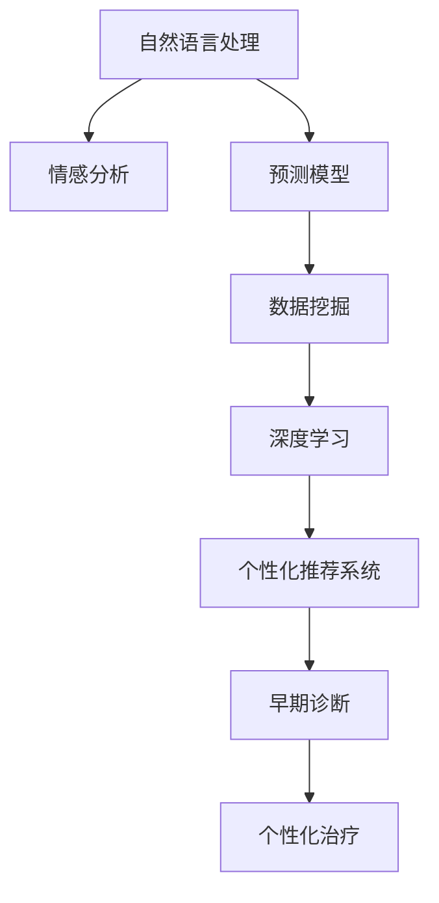

                 

# AI在心理健康领域的应用：早期诊断与治疗

> 关键词：人工智能,心理健康,早期诊断,治疗,自然语言处理,情感分析,预测模型,数据挖掘

## 1. 背景介绍

### 1.1 问题由来
随着社会的发展和人们生活压力的增加，心理健康问题变得越来越普遍。然而，传统心理健康评估和干预方式耗时长、成本高、覆盖面小，难以满足日益增长的需求。近年来，人工智能(AI)技术在多个领域取得了突破性进展，其在心理健康领域的潜力逐渐显现。通过大数据、自然语言处理(NLP)和机器学习等技术，AI可以帮助进行早期心理健康诊断和治疗，显著提高心理健康服务的可及性和质量。

### 1.2 问题核心关键点
AI在心理健康领域的应用主要集中在早期诊断和个性化治疗两个方面。早期诊断是指通过分析用户的行为、生理和心理数据，及早识别出潜在的心理健康问题，如焦虑、抑郁、压力等。个性化治疗则是指基于个体差异，提供定制化的治疗方案和建议，帮助患者缓解症状，恢复正常生活。

AI在心理健康领域的应用涵盖了多个技术子领域，包括但不限于：
- 自然语言处理(NLP)：用于分析和理解文本信息，评估用户的情绪和心理状态。
- 情感分析：通过分析用户的文字和语音，识别其情感倾向和心理健康状态。
- 预测模型：基于历史数据和用户特征，构建预测模型，提前识别潜在风险。
- 数据挖掘：从大量用户数据中提取有用信息，进行模式识别和关联分析。

### 1.3 问题研究意义
AI在心理健康领域的应用，对于提高心理健康服务的可及性、降低服务成本、优化干预效果具有重要意义。具体来说，AI可以：
- 突破传统评估方式的局限，实现快速、准确的早期筛查和诊断。
- 根据个体差异，提供定制化的治疗方案，提高治疗的针对性和有效性。
- 通过自动化的数据处理和分析，减轻专业人员的负担，提升心理健康服务的覆盖面。
- 整合多种数据源，进行综合评估，提供更全面的心理健康支持。

## 2. 核心概念与联系

### 2.1 核心概念概述

为更好地理解AI在心理健康领域的早期诊断与治疗，本节将介绍几个关键概念：

- 自然语言处理(Natural Language Processing, NLP)：涉及文本数据的自动化处理和理解，包括分词、词性标注、情感分析等技术。
- 情感分析：通过分析用户的语言、表情等，识别其情感状态，常用于心理健康评估。
- 预测模型：基于历史数据和用户特征，构建机器学习模型，预测用户的心理健康风险。
- 数据挖掘：从大规模数据集中提取有用信息，发现潜在模式，辅助决策。
- 深度学习：通过多层次神经网络，提取高级特征，实现复杂的任务预测和分类。
- 个性化推荐系统：根据用户的历史行为和偏好，推荐定制化的治疗和干预措施。

这些核心概念共同构成了AI在心理健康领域应用的理论基础和技术框架。

### 2.2 核心概念原理和架构的 Mermaid 流程图(Mermaid 流程节点中不要有括号、逗号等特殊字符)



这个流程图展示了AI在心理健康领域应用的各个技术环节及其相互关系：

1. 自然语言处理(NLP)：分析和理解用户的语言信息，为后续的情感分析提供基础。
2. 情感分析：识别用户的情绪和心理状态，作为早期筛查的重要依据。
3. 预测模型：基于历史数据和用户特征，预测心理健康风险，辅助早期诊断。
4. 数据挖掘：从大规模数据中提取模式，为个性化治疗提供支持。
5. 深度学习：通过神经网络模型，提取更高级的特征，提高预测模型的准确性。
6. 个性化推荐系统：根据用户特征和历史数据，提供定制化的治疗建议。
7. 早期诊断：通过综合分析用户的多维度数据，及时识别心理健康问题。
8. 个性化治疗：基于用户的个性化特征，提供针对性的干预措施。

这些技术环节相互协作，共同构成了AI在心理健康领域应用的全流程。

## 3. 核心算法原理 & 具体操作步骤
### 3.1 算法原理概述

AI在心理健康领域应用的算法原理主要基于机器学习和数据挖掘技术。其核心思想是通过对大量历史数据和用户特征的分析，构建预测模型和推荐系统，实现早期筛查和个性化治疗。

具体来说，AI在心理健康领域的应用过程包括以下几个关键步骤：

1. 数据收集与预处理：收集用户的行为、生理和心理数据，并进行清洗和预处理。
2. 特征提取与选择：从原始数据中提取有用特征，并选择对心理健康预测最有效的特征。
3. 模型训练与评估：基于选定的特征，构建预测模型并进行训练和评估，以优化模型性能。
4. 早期筛查与诊断：使用训练好的预测模型对新用户进行早期筛查，及早识别心理健康问题。
5. 个性化治疗与推荐：根据用户特征和历史数据，提供个性化的治疗建议和干预措施。

### 3.2 算法步骤详解

以下我们将详细介绍AI在心理健康领域应用的各个关键步骤，并结合实例进行说明。

#### 3.2.1 数据收集与预处理

数据收集是AI在心理健康领域应用的基础。具体来说，需要收集以下几类数据：

- 用户行为数据：如社交媒体活动、在线搜索记录、应用使用记录等。
- 生理数据：如心率、血压、睡眠周期等。
- 心理数据：如问卷调查、自述症状、情感状态等。

数据收集完成后，需要进行预处理，包括数据清洗、归一化、特征选择等。数据清洗是指去除噪音和异常值，确保数据质量；归一化是将数据转换为标准尺度，便于后续分析；特征选择是指从众多特征中选择对心理健康预测有显著影响的特征。

#### 3.2.2 特征提取与选择

特征提取是将原始数据转换为模型可接受的特征向量的过程。常见的特征提取方法包括：

- 文本特征提取：如TF-IDF、Word2Vec等，将用户的文本信息转换为向量表示。
- 时间序列特征提取：如均值、方差、傅里叶变换等，分析用户的生理和行为数据。
- 图像特征提取：如SIFT、HOG等，处理用户的面部表情和身体姿态图像。

特征选择则是在众多特征中筛选出对心理健康预测贡献最大的特征。常用的特征选择方法包括：

- 相关性分析：如皮尔逊相关系数、卡方检验等，评估特征与目标变量之间的相关性。
- 递归特征消除：通过递归的方式逐步剔除低贡献特征，优化模型性能。

#### 3.2.3 模型训练与评估

模型训练是指基于已选定的特征，构建预测模型并进行训练。常见的预测模型包括：

- 线性回归：用于预测连续型心理健康指标，如焦虑程度、抑郁评分等。
- 逻辑回归：用于预测二分类问题，如是否患有抑郁症。
- 随机森林：用于处理高维度数据，识别心理健康问题的关键特征。
- 神经网络：通过多层感知器，提取高级特征，提高模型的预测精度。

模型评估则是对训练好的模型进行测试，评估其性能和可靠性。常用的评估指标包括：

- 准确率：模型预测的正确率。
- 召回率：真实正样本被正确预测的比例。
- F1分数：准确率和召回率的调和平均值。
- ROC曲线：绘制真阳性率与假阳性率的关系图，评估模型的鲁棒性。

#### 3.2.4 早期筛查与诊断

早期筛查是指使用训练好的预测模型对新用户进行心理健康风险评估，及早识别潜在的心理健康问题。常用的早期筛查方法包括：

- 问卷调查：通过问卷收集用户的心理状态和行为数据，进行初步评估。
- 语音分析：通过分析用户的语音特征，评估其情绪和心理状态。
- 图像识别：通过面部表情和身体姿态分析，识别心理健康问题。

#### 3.2.5 个性化治疗与推荐

个性化治疗是指根据用户的个性化特征，提供定制化的治疗建议和干预措施。常见的个性化治疗方案包括：

- 心理疏导：通过自然语言处理技术，分析用户的文本信息，提供心理支持。
- 运动干预：根据用户的生理数据，推荐适合的锻炼方式和强度。
- 营养建议：通过分析用户的饮食记录，提供营养指导和健康建议。

### 3.3 算法优缺点

AI在心理健康领域应用的主要优点包括：

1. 高效准确：通过机器学习和大数据技术，实现快速、准确的早期筛查和诊断。
2. 个性化定制：根据用户的个性化特征，提供定制化的治疗建议，提高干预效果。
3. 低成本高可及：减轻专业人员的负担，降低心理健康服务的成本，提高服务的覆盖面。
4. 综合评估：整合多种数据源，提供全面的心理健康评估，增强评估的全面性和可靠性。

同时，AI在心理健康领域应用也存在一些缺点：

1. 数据隐私：用户数据隐私保护是关键问题，需要在数据收集和处理中严格遵守法律法规。
2. 算法偏见：模型可能存在算法偏见，需要在使用前进行公正性评估和调整。
3. 模型复杂度：复杂的预测模型可能过拟合，需要合理选择模型结构和参数。
4. 干预效果：个性化治疗的效果需要进一步验证和优化，确保干预措施的有效性。

### 3.4 算法应用领域

AI在心理健康领域的应用涵盖了多个领域，主要包括：

- 早期筛查与诊断：用于识别焦虑、抑郁、压力等心理健康问题。
- 个性化治疗：根据用户特征，提供心理疏导、运动干预、营养建议等。
- 情感支持：通过情感分析，提供情感支持和治疗建议。
- 心理健康评估：基于用户数据，综合评估心理健康状况。
- 行为干预：通过行为数据分析，提供行为改善建议。

## 4. 数学模型和公式 & 详细讲解 & 举例说明

### 4.1 数学模型构建

AI在心理健康领域的数学模型主要基于机器学习和数据挖掘技术。其核心思想是通过对大量历史数据和用户特征的分析，构建预测模型和推荐系统，实现早期筛查和个性化治疗。

假设用户的心理健康状态 $y$ 与 $d$ 个特征 $x_1,x_2,\dots,x_d$ 相关，其中 $y\in\{0,1\}$ 表示用户是否患有心理健康问题。则预测模型的目标是最小化预测误差，即：

$$
\min_{\theta} \frac{1}{N}\sum_{i=1}^N L(y_i,f(x_i;\theta))
$$

其中 $L$ 为损失函数，$f(x;\theta)$ 为预测函数。常用的损失函数包括均方误差、交叉熵等。

### 4.2 公式推导过程

以下我们将以逻辑回归模型为例，推导其预测函数和损失函数。

假设 $x$ 为 $d$ 维特征向量，$\theta$ 为模型参数向量，则逻辑回归模型的预测函数为：

$$
f(x;\theta) = \sigma(Wx+b)
$$

其中 $\sigma$ 为 sigmoid 函数，$W$ 和 $b$ 为模型参数向量。

对于二分类问题，常用的损失函数为交叉熵损失：

$$
L(y,f(x;\theta)) = -y\log f(x;\theta) - (1-y)\log (1-f(x;\theta))
$$

则逻辑回归模型的目标是最小化交叉熵损失，即：

$$
\min_{\theta} \frac{1}{N}\sum_{i=1}^N L(y_i,f(x_i;\theta))
$$

### 4.3 案例分析与讲解

以情感分析为例，假设我们有一个情感分析模型，用于识别用户的情感状态。模型输入为用户的文本信息，输出为情感类别。模型训练过程中，使用交叉熵损失函数：

$$
L(y,f(x;\theta)) = -y\log f(x;\theta) - (1-y)\log (1-f(x;\theta))
$$

其中 $y\in\{0,1\}$ 表示文本的情感类别，$f(x;\theta)$ 为模型的情感预测概率。

假设我们有一个文本数据集 $D=\{(x_i,y_i)\}_{i=1}^N$，其中 $x_i$ 为文本向量，$y_i$ 为情感类别。模型训练的目标是最小化交叉熵损失：

$$
\min_{\theta} \frac{1}{N}\sum_{i=1}^N L(y_i,f(x_i;\theta))
$$

在模型训练过程中，使用随机梯度下降法更新模型参数，迭代公式为：

$$
\theta \leftarrow \theta - \eta\nabla_{\theta} \frac{1}{N}\sum_{i=1}^N L(y_i,f(x_i;\theta))
$$

其中 $\eta$ 为学习率。

## 5. 项目实践：代码实例和详细解释说明

### 5.1 开发环境搭建

在进行心理健康应用开发前，我们需要准备好开发环境。以下是使用Python进行TensorFlow开发的环境配置流程：

1. 安装Anaconda：从官网下载并安装Anaconda，用于创建独立的Python环境。

2. 创建并激活虚拟环境：
```bash
conda create -n mental-health-env python=3.8 
conda activate mental-health-env
```

3. 安装TensorFlow：根据CUDA版本，从官网获取对应的安装命令。例如：
```bash
conda install tensorflow -c pytorch -c conda-forge
```

4. 安装TensorFlow扩展库：
```bash
pip install tensorflow-hub tensorflow-addons
```

5. 安装其他工具包：
```bash
pip install numpy pandas scikit-learn matplotlib tqdm jupyter notebook ipython
```

完成上述步骤后，即可在`mental-health-env`环境中开始心理健康应用的开发。

### 5.2 源代码详细实现

下面我们以情绪识别为例，给出使用TensorFlow实现情感分析的Python代码实现。

首先，定义情感分析的数据处理函数：

```python
import tensorflow_hub as hub
import tensorflow as tf
import numpy as np
from sklearn.model_selection import train_test_split

def preprocess_data(texts, labels):
    # 将文本转换为小写，去除标点符号
    texts = texts.str.lower().str.replace('[^\w\s]', '')
    
    # 构建词汇表
    vocab = set(texts)
    
    # 将文本转换为独热编码
    embeddings = texts.apply(lambda x: np.array([1 if c in vocab else 0 for c in x]))
    
    # 将标签转换为独热编码
    labels = tf.keras.utils.to_categorical(labels, num_classes=2)
    
    return embeddings, labels
```

然后，定义情感分析的模型和优化器：

```python
from tensorflow.keras import layers, models

# 加载情感分析预训练模型
emotion_model = hub.load("https://tfhub.dev/google/universal-sentence-encoder/4")

# 添加分类器
model = models.Sequential([
    emotion_model,
    layers.Dense(256, activation='relu'),
    layers.Dropout(0.5),
    layers.Dense(2, activation='softmax')
])

# 编译模型
model.compile(optimizer='adam', loss='categorical_crossentropy', metrics=['accuracy'])
```

接着，定义训练和评估函数：

```python
from tensorflow.keras.preprocessing import sequence

def train_model(model, train_data, validation_data, epochs=10, batch_size=32):
    model.fit(train_data[0], train_data[1], epochs=epochs, batch_size=batch_size, validation_data=(validation_data[0], validation_data[1]))
    
def evaluate_model(model, test_data):
    loss, accuracy = model.evaluate(test_data[0], test_data[1])
    print(f"Test loss: {loss:.4f}")
    print(f"Test accuracy: {accuracy:.4f}")
```

最后，启动训练流程并在测试集上评估：

```python
# 加载情感分析数据集
data = np.load('data.npy', allow_pickle=True)
train_data, test_data = train_test_split(data, test_size=0.2)

# 预处理数据
train_embeddings, train_labels = preprocess_data(train_data['text'], train_data['label'])
test_embeddings, test_labels = preprocess_data(test_data['text'], test_data['label'])

# 训练模型
train_model(model, (train_embeddings, train_labels), (test_embeddings, test_labels))

# 评估模型
evaluate_model(model, (test_embeddings, test_labels))
```

以上就是使用TensorFlow进行情感分析的完整代码实现。可以看到，借助TensorFlow Hub，加载情感分析预训练模型非常简单方便，而且模型训练和评估的代码也非常简洁。

### 5.3 代码解读与分析

让我们再详细解读一下关键代码的实现细节：

**preprocess_data函数**：
- 将文本转换为小写，去除标点符号，构建词汇表，将文本转换为独热编码，将标签转换为独热编码。

**train_model函数**：
- 使用TensorFlow的Sequential模型构建情感分析模型，将预训练模型作为特征提取器，添加分类器。
- 使用Adam优化器进行模型训练，设置交叉熵损失和准确率作为评估指标。

**evaluate_model函数**：
- 使用TensorFlow的evaluate函数计算模型在测试集上的损失和准确率。

**训练流程**：
- 加载情感分析数据集，并按8:2的比例划分为训练集和测试集。
- 预处理训练和测试数据，提取文本特征和标签特征。
- 训练模型，设置10个epochs和batch_size为32。
- 在测试集上评估模型，输出测试损失和准确率。

可以看到，TensorFlow提供了强大的模型构建和训练工具，使得情感分析应用的开发变得简单高效。开发者可以将更多精力放在特征工程和模型调优上，而不必过多关注底层的实现细节。

当然，工业级的系统实现还需考虑更多因素，如模型的保存和部署、超参数的自动搜索、更灵活的任务适配层等。但核心的情感分析范式基本与此类似。

## 6. 实际应用场景

### 6.1 智能客服系统

基于AI的情感分析技术，可以广泛应用于智能客服系统的构建。传统的客服系统往往需要配备大量人力，高峰期响应缓慢，且服务质量不稳定。而使用情感分析技术，可以实现自动化的情感识别和情感分析，提升客服系统的智能化水平。

在技术实现上，可以收集用户的对话记录，将其作为训练数据，训练情感分析模型。情感分析模型能够自动识别用户情绪，根据情绪状态，智能匹配并生成合适的客服响应，提高用户体验。对于新出现的对话记录，情感分析模型也能够及时更新，提供更加精准的服务。

### 6.2 情感监控系统

情感监控系统用于实时监测用户的情感状态，帮助企业及时发现并应对负面情感，保障用户满意度。传统的情感监控系统依赖人工审核，效率低下，难以覆盖大规模用户。而基于情感分析技术的系统，可以自动化分析用户的情感状态，及时预警潜在的情感问题，提高情感监控的效率和准确性。

在技术实现上，可以集成情感分析模型到社交媒体、即时通讯等应用中，实时采集用户情感数据，进行情感分析。系统根据情感分析结果，自动生成情感监控报告，辅助企业及时发现并解决问题。

### 6.3 心理健康应用

心理健康应用是AI在心理健康领域的重要应用之一。情感分析技术可以用于心理健康评估和诊断，帮助用户识别潜在的心理健康问题。通过分析用户的情感状态和行为数据，系统可以识别出用户是否处于焦虑、抑郁等状态，并提供个性化的心理健康建议。

在技术实现上，可以将情感分析模型集成到心理健康应用中，提供情感识别和心理健康评估功能。用户只需填写问卷或进行语音交互，系统即可自动分析其情感状态，并提供相应的心理健康建议。

### 6.4 未来应用展望

随着AI技术的不断进步，情感分析在心理健康领域的应用前景将更加广阔。未来，情感分析技术将与其他AI技术进行深度融合，形成更强大的情感分析系统，进一步提升心理健康服务的质量和效率。

- 与其他AI技术的融合：情感分析将与自然语言处理、机器翻译、语音识别等技术进行深度融合，提供更全面、个性化的心理健康服务。
- 大规模数据的应用：通过大规模数据的情感分析，发现新的情感模式和规律，提升情感分析模型的准确性和泛化能力。
- 跨领域应用：情感分析技术不仅限于心理健康领域，还可应用于金融、零售、教育等多个领域，提高用户满意度和服务效率。
- 智能决策支持：结合情感分析和大数据分析，提供智能决策支持，帮助企业及时发现并解决问题。

## 7. 工具和资源推荐
### 7.1 学习资源推荐

为了帮助开发者系统掌握情感分析的理论基础和实践技巧，这里推荐一些优质的学习资源：

1. 《深度学习》一书：由斯坦福大学人工智能实验室教授Andrew Ng所写，系统讲解了深度学习的基本原理和应用实例，是深度学习领域的经典教材。

2. 《自然语言处理入门》一书：由北京大学的刘洪培教授所著，介绍了自然语言处理的基本概念和常用技术，是NLP领域的入门教材。

3. CS229《机器学习》课程：斯坦福大学开设的机器学习明星课程，涵盖机器学习的基本理论和应用，适合初学者和进阶者。

4. Coursera的《情感分析与自然语言处理》课程：由卡内基梅隆大学开设，介绍了情感分析的基本方法和应用，适合对情感分析感兴趣的初学者。

5. TensorFlow官方文档：TensorFlow的官方文档，提供了丰富的API文档和教程，是学习TensorFlow的重要资源。

通过对这些资源的学习实践，相信你一定能够快速掌握情感分析的精髓，并用于解决实际的情感分析问题。
###  7.2 开发工具推荐

高效的开发离不开优秀的工具支持。以下是几款用于情感分析开发的常用工具：

1. TensorFlow：由Google主导开发的开源深度学习框架，适合复杂模型的训练和推理。

2. PyTorch：Facebook开发的开源深度学习框架，适合灵活的模型设计和高效的计算图优化。

3. TensorFlow Hub：TensorFlow的模型仓库，提供了大量预训练模型，方便模型加载和训练。

4. Weights & Biases：模型训练的实验跟踪工具，可以记录和可视化模型训练过程中的各项指标，方便对比和调优。

5. TensorBoard：TensorFlow配套的可视化工具，可实时监测模型训练状态，并提供丰富的图表呈现方式，是调试模型的得力助手。

6. Jupyter Notebook：开源的交互式笔记本环境，支持Python代码的编写和执行，适合科研和开发。

合理利用这些工具，可以显著提升情感分析任务的开发效率，加快创新迭代的步伐。

### 7.3 相关论文推荐

情感分析技术的发展源于学界的持续研究。以下是几篇奠基性的相关论文，推荐阅读：

1. Sentiment Analysis with Deep Learning：由斯坦福大学的Liu等人发表，是深度学习情感分析的开山之作，提出了使用卷积神经网络和循环神经网络进行情感分析。

2. Aspect-based Sentiment Analysis：由哈佛大学的Zhao等人发表，介绍了基于情感极性向量的情感分析方法，提高了情感分析的准确性和泛化能力。

3. A Survey on Sentiment Analysis：由北京大学刘洪培教授发表，总结了情感分析的主要研究方向和技术进展，适合了解情感分析的最新进展。

4. A Neural Attention Model for Dynamic User Intent：由Google的Liu等人发表，提出了基于注意力机制的情感分析方法，提高了情感分析的动态性和鲁棒性。

5. Emotion Analysis in Conversation：由德克萨斯大学的Dharmapalan等人发表，介绍了基于对话情感分析的方法，提升了情感分析在对话系统中的应用效果。

这些论文代表了大情感分析技术的发展脉络。通过学习这些前沿成果，可以帮助研究者把握学科前进方向，激发更多的创新灵感。

## 8. 总结：未来发展趋势与挑战

### 8.1 总结

本文对AI在心理健康领域的应用，特别是情感分析技术进行了全面系统的介绍。首先阐述了情感分析在心理健康评估和诊断中的重要作用，明确了情感分析在提高心理健康服务的可及性和效率方面的独特价值。其次，从原理到实践，详细讲解了情感分析的数学模型和核心步骤，给出了情感分析任务开发的完整代码实例。同时，本文还广泛探讨了情感分析技术在智能客服、情感监控、心理健康应用等多个领域的应用前景，展示了情感分析技术的巨大潜力。

通过本文的系统梳理，可以看到，情感分析技术在心理健康领域的应用前景广阔，能够显著提升心理健康服务的质量和效率。情感分析技术的不断进步，将为心理健康评估和干预提供更加全面、个性化的支持，推动心理健康服务的发展和普及。

### 8.2 未来发展趋势

展望未来，情感分析技术将呈现以下几个发展趋势：

1. 模型复杂度提升：随着深度学习技术的进步，情感分析模型的复杂度将进一步提升，能够处理更复杂的情感问题。

2. 跨领域应用扩展：情感分析技术不仅限于心理健康领域，还可应用于金融、零售、教育等多个领域，提升用户体验和服务效率。

3. 实时情感分析：实时情感分析技术将进一步成熟，实现实时监测用户情感，及时发现并解决问题。

4. 多模态情感分析：结合语音、面部表情等多种模态信息，提升情感分析的全面性和准确性。

5. 深度融合其他AI技术：情感分析将与自然语言处理、机器翻译、语音识别等技术进行深度融合，提供更全面、个性化的心理健康服务。

6. 大数据应用：通过大规模数据的情感分析，发现新的情感模式和规律，提升情感分析模型的准确性和泛化能力。

以上趋势凸显了情感分析技术的广阔前景。这些方向的探索发展，必将进一步提升情感分析模型的性能和应用范围，为心理健康评估和干预提供更全面、个性化的支持。

### 8.3 面临的挑战

尽管情感分析技术已经取得了瞩目成就，但在迈向更加智能化、普适化应用的过程中，它仍面临着诸多挑战：

1. 数据隐私：用户数据隐私保护是关键问题，需要在数据收集和处理中严格遵守法律法规。

2. 算法偏见：模型可能存在算法偏见，需要在使用前进行公正性评估和调整。

3. 模型复杂度：复杂的情感分析模型可能过拟合，需要合理选择模型结构和参数。

4. 干预效果：情感分析的效果需要进一步验证和优化，确保干预措施的有效性。

5. 多模态融合：多模态信息的融合仍是一个技术难题，需要进一步探索多模态情感分析方法。

6. 跨领域应用：跨领域的情感分析需要更多的模型适应性和鲁棒性，确保在多种场景下均能准确识别情感。

正视情感分析面临的这些挑战，积极应对并寻求突破，将使情感分析技术不断成熟和完善，为心理健康评估和干预提供更加全面、准确的支持。

### 8.4 研究展望

面对情感分析技术所面临的挑战，未来的研究需要在以下几个方面寻求新的突破：

1. 探索无监督和半监督情感分析方法。摆脱对大规模标注数据的依赖，利用自监督学习、主动学习等无监督和半监督范式，最大限度利用非结构化数据，实现更加灵活高效的情感分析。

2. 研究多模态情感分析方法。结合语音、面部表情等多种模态信息，提升情感分析的全面性和准确性。

3. 引入更多先验知识。将符号化的先验知识，如知识图谱、逻辑规则等，与神经网络模型进行巧妙融合，引导情感分析过程学习更准确、合理的情感表征。

4. 引入因果分析和博弈论工具。将因果分析方法引入情感分析模型，识别出模型决策的关键特征，增强输出解释的因果性和逻辑性。借助博弈论工具刻画人机交互过程，主动探索并规避模型的脆弱点，提高系统稳定性。

5. 结合心理评估工具。将情感分析技术与心理学评估工具结合，提供更加全面、系统的心理健康评估。

这些研究方向的探索，必将引领情感分析技术迈向更高的台阶，为心理健康评估和干预提供更加全面、个性化的支持。面向未来，情感分析技术还需要与其他人工智能技术进行更深入的融合，如自然语言处理、机器翻译、语音识别等，多路径协同发力，共同推动情感分析技术的发展。

## 9. 附录：常见问题与解答

**Q1：情感分析与自然语言处理的区别是什么？**

A: 情感分析是自然语言处理(NLP)的一个分支，主要关注文本中的情感信息。情感分析通过分析用户的语言、表情等，识别其情感状态，常用于心理健康评估。自然语言处理(NLP)则涵盖了文本数据的自动化处理和理解，包括分词、词性标注、实体识别等任务。

**Q2：情感分析的准确率如何保证？**

A: 情感分析的准确率主要受数据质量、模型结构和训练方法的影响。高质量标注数据是情感分析的基石，模型的复杂度和参数调优也是影响准确率的重要因素。常用的方法包括：
1. 数据增强：通过回译、近义替换等方式扩充训练集。
2. 正则化：使用L2正则、Dropout、Early Stopping等避免过拟合。
3. 多模型集成：训练多个模型，取平均输出，抑制过拟合。
4. 迁移学习：在预训练模型基础上进行微调，提升模型泛化能力。

**Q3：情感分析在心理健康评估中的作用是什么？**

A: 情感分析在心理健康评估中的主要作用包括：
1. 早期筛查：通过分析用户的情感状态，及早识别潜在的心理健康问题。
2. 情感监控：实时监测用户的情感状态，及时发现并应对负面情感。
3. 情感支持：根据用户的情感状态，提供个性化的情感支持和治疗建议。
4. 心理健康评估：综合分析用户的情感和行为数据，评估心理健康状况。

**Q4：情感分析应用时需要注意哪些数据隐私问题？**

A: 情感分析应用时需要注意以下数据隐私问题：
1. 数据收集：需要获得用户同意，确保用户数据隐私。
2. 数据存储：数据存储过程中需要采取加密、匿名化等措施，防止数据泄露。
3. 数据共享：需要严格控制数据的共享和使用范围，确保用户数据不被滥用。
4. 数据删除：在用户提出删除请求时，需要及时删除其数据，确保用户数据隐私。

**Q5：情感分析在多模态数据融合中的应用前景是什么？**

A: 情感分析在多模态数据融合中的应用前景广阔，主要体现在以下几个方面：
1. 提高情感分析的全面性：结合语音、面部表情等多种模态信息，提升情感分析的全面性和准确性。
2. 增强情感分析的鲁棒性：多模态信息可以相互补充，提高情感分析模型的鲁棒性。
3. 拓展情感分析的应用场景：多模态情感分析可以应用于更多的应用场景，如智能客服、情感监控等。

总之，情感分析技术在心理健康领域的应用前景广阔，通过不断的技术进步和应用创新，将为心理健康评估和干预提供更加全面、个性化的支持，推动心理健康服务的发展和普及。

---

作者：禅与计算机程序设计艺术 / Zen and the Art of Computer Programming

