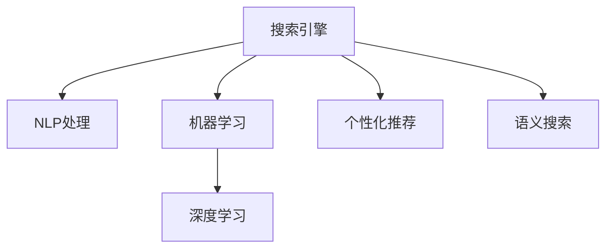

                 

# AI在提高搜索质量方面的应用

> 关键词：搜索引擎,机器学习,自然语言处理,个性化推荐,深度学习,语义搜索

## 1. 背景介绍

随着互联网的飞速发展，信息爆炸带来的信息过载问题愈发严重，如何从海量的数据中快速准确地获取所需信息，成为了一个重要且紧迫的挑战。搜索引擎作为互联网信息检索的主要手段，在满足用户查询需求、提升信息获取效率方面起着至关重要的作用。传统的搜索引擎往往依赖于规则引擎、倒排索引等技术，但面对日益复杂的查询需求，传统的搜索引擎架构逐渐显现出其局限性。

近年来，人工智能技术，尤其是机器学习和自然语言处理技术的迅猛发展，为提升搜索引擎质量带来了新的希望。通过对大量搜索行为数据的深度挖掘和分析，AI技术能够识别用户真正的查询意图，预测用户的后续行为，从而提供更加精准、高效的信息检索服务。本文章将详细介绍AI在搜索引擎中的应用，着重探讨其在提升搜索质量方面的关键技术和应用实践。

## 2. 核心概念与联系

为更好地理解AI在提高搜索质量方面的应用，本节将介绍几个密切相关的核心概念：

- **搜索引擎**：利用计算机技术自动从互联网中获取信息，并提供给用户信息检索服务的系统。常见的搜索引擎包括Google、Bing、百度等。
- **自然语言处理(NLP)**：涉及计算机处理、理解、生成自然语言的技术，是AI技术在搜索引擎中的重要应用方向之一。
- **机器学习(ML)**：通过数据训练模型，让机器自动学习规律，并据此做出预测或决策的技术，为搜索引擎提供智能推荐和排序的基础。
- **深度学习(Deep Learning)**：一种基于神经网络的机器学习范式，具备强大的特征提取和模式识别能力，广泛应用于语义搜索、图像识别等场景。
- **个性化推荐系统**：根据用户历史行为数据和偏好，为其推荐相关内容或信息的技术。在搜索引擎中，个性化推荐系统可以为用户定制搜索结果，提高用户体验。
- **语义搜索**：通过对用户查询的语义理解，提供更加精准、相关的搜索结果，是搜索引擎智能化的重要手段。

这些核心概念之间的逻辑关系可以通过以下Mermaid流程图来展示：



这个流程图展示了几类关键技术在搜索引擎中的应用关系：

1. 搜索引擎通过自然语言处理、机器学习、深度学习和个性化推荐等技术，为用户提供更加智能、精准的检索服务。
2. 自然语言处理能够理解用户查询的语义，提高检索的准确性。
3. 机器学习和深度学习可以挖掘用户行为数据，进行智能推荐和排序。
4. 语义搜索通过语义理解，提升搜索结果的相关性和匹配度。
5. 个性化推荐系统能够根据用户偏好，提供定制化的搜索结果。

这些核心概念共同构成了现代搜索引擎的智能检索框架，使其能够更好地适应用户的复杂需求。通过理解这些核心概念，我们可以更好地把握搜索引擎的工作原理和优化方向。

## 3. 核心算法原理 & 具体操作步骤
### 3.1 算法原理概述

AI在搜索引擎中的应用主要集中在以下几个方面：

- **自然语言处理**：通过分词、词性标注、命名实体识别等技术，对用户查询进行语义分析和预处理，提高检索的准确性。
- **机器学习和深度学习**：通过训练推荐模型和排序模型，利用用户行为数据预测用户兴趣，提供智能推荐和排序服务。
- **个性化推荐系统**：基于用户历史行为和偏好，推荐相关的搜索结果，提升用户体验。
- **语义搜索**：通过对查询和文档语义的匹配度进行计算，提高搜索结果的相关性。

本节将重点介绍机器学习在提升搜索质量方面的核心算法和操作步骤。

### 3.2 算法步骤详解

基于机器学习的搜索质量提升，主要包括以下几个关键步骤：

**Step 1: 数据准备**

- 收集用户历史行为数据，如搜索记录、点击行为、收藏、停留时间等。
- 对数据进行预处理，包括去重、归一化、特征工程等，得到可用于模型训练的数据集。

**Step 2: 模型选择和训练**

- 选择合适的机器学习模型，如逻辑回归、支持向量机、随机森林、神经网络等。
- 划分训练集和测试集，利用训练集对模型进行训练。
- 使用交叉验证等技术，对模型进行调参，确保模型泛化能力。

**Step 3: 特征提取和选择**

- 从用户历史行为数据中提取相关特征，如点击率、停留时间、页面关键词等。
- 使用特征选择技术，如信息增益、卡方检验等，选择对模型预测有帮助的特征。

**Step 4: 模型评估和优化**

- 在测试集上对模型进行评估，使用AUC、F1 Score、准确率等指标衡量模型性能。
- 根据评估结果，调整模型参数、选择新的特征或更换模型，持续优化模型效果。

**Step 5: 部署和监控**

- 将训练好的模型部署到搜索引擎中，实时计算用户查询的排序权重。
- 实时监控模型的运行状态，收集用户反馈和行为数据，持续迭代优化模型。

以上是机器学习在提升搜索质量方面的基本流程。在实际应用中，还需要针对具体场景进行优化设计，如引入更多的正则化技术、搜索目标函数、超参数组合搜索等，以进一步提升模型性能。

### 3.3 算法优缺点

基于机器学习的搜索引擎质量提升方法具有以下优点：

1. 简单高效。只需准备少量标注数据，即可对预训练模型进行快速适配，获得较大的性能提升。
2. 泛化能力强。模型可以学习到通用的用户行为模式，对新用户的预测也有较好的泛化能力。
3. 实时性好。模型训练完成后，实时部署到搜索引擎中，能够及时响应用户查询，提升检索速度。
4. 效果显著。在学术界和工业界的诸多搜索任务上，基于机器学习的搜索引擎质量提升方法已经刷新了最先进的性能指标。

同时，该方法也存在一定的局限性：

1. 依赖标注数据。模型效果的提升很大程度上取决于标注数据的质量和数量，获取高质量标注数据的成本较高。
2. 迁移能力有限。当目标任务与训练数据的分布差异较大时，模型的泛化能力有限。
3. 负面效果传递。训练数据的固有偏见、有害信息等，可能通过模型传递到搜索结果中，造成负面影响。
4. 可解释性不足。模型的决策过程通常缺乏可解释性，难以对其推理逻辑进行分析和调试。

尽管存在这些局限性，但就目前而言，基于机器学习的搜索引擎质量提升方法仍是大数据时代的主要范式。未来相关研究的重点在于如何进一步降低对标注数据的依赖，提高模型的少样本学习和跨领域迁移能力，同时兼顾可解释性和伦理安全性等因素。

### 3.4 算法应用领域

基于AI的搜索引擎质量提升方法在多个领域得到了广泛的应用，例如：

- 文本搜索：如百度、Google、Bing等搜索引擎的文本搜索功能。通过机器学习模型对查询和文档的匹配度进行计算，提供相关性更高的搜索结果。
- 图片搜索：如Bing Image Search、百度图片等，通过深度学习模型提取图像特征，实现基于视觉内容的检索。
- 视频搜索：如YouTube、优酷等，通过深度学习模型提取视频特征，实现基于视频内容的检索。
- 语音搜索：如Apple Siri、Google Assistant等，通过语音识别和自然语言处理技术，实现基于语音的检索。

除了上述这些经典应用外，AI技术还被创新性地应用到更多场景中，如推荐系统、广告投放、个性化服务、舆情监测等，为搜索引擎提供了更加丰富、智能化的应用场景。

## 4. 数学模型和公式 & 详细讲解 & 举例说明

### 4.1 数学模型构建

本节将使用数学语言对机器学习在搜索引擎中的应用进行更加严格的刻画。

假设搜索引擎中，用户查询为 $q$，搜索结果为 $d$。搜索引擎的目标是通过训练一个模型 $f$，计算查询与搜索结果的相关性 $r$，排序后返回给用户。模型的输入为 $x=(q,d)$，输出为相关性 $r$。

设模型训练数据集为 $D=\{(x_i,y_i)\}_{i=1}^N$，其中 $x_i$ 为输入，$y_i$ 为标签。

定义模型 $f$ 在数据样本 $(x,y)$ 上的损失函数为 $\ell(f(x),y)$，则在数据集 $D$ 上的经验风险为：

$$
\mathcal{L}(f) = \frac{1}{N} \sum_{i=1}^N \ell(f(x_i),y_i)
$$

模型训练的目标是最小化经验风险，即找到最优模型 $f^*$：

$$
f^* = \mathop{\arg\min}_{f} \mathcal{L}(f)
$$

在实践中，我们通常使用基于梯度的优化算法（如SGD、Adam等）来近似求解上述最优化问题。设 $\eta$ 为学习率，则参数的更新公式为：

$$
f \leftarrow f - \eta \nabla_{f}\mathcal{L}(f)
$$

其中 $\nabla_{f}\mathcal{L}(f)$ 为损失函数对模型 $f$ 的梯度，可通过反向传播算法高效计算。

### 4.2 公式推导过程

以下我们以二分类任务为例，推导交叉熵损失函数及其梯度的计算公式。

假设模型 $f$ 在输入 $x=(q,d)$ 上的输出为 $\hat{y}=M_{\theta}(x) \in [0,1]$，表示文档 $d$ 与查询 $q$ 相关性的大小。真实标签 $y \in \{0,1\}$。则二分类交叉熵损失函数定义为：

$$
\ell(f(x),y) = -[y\log \hat{y} + (1-y)\log (1-\hat{y})]
$$

将其代入经验风险公式，得：

$$
\mathcal{L}(f) = -\frac{1}{N}\sum_{i=1}^N [y_i\log f(x_i)+(1-y_i)\log(1-f(x_i))]
$$

根据链式法则，损失函数对模型 $f$ 的梯度为：

$$
\frac{\partial \mathcal{L}(f)}{\partial f} = -\frac{1}{N}\sum_{i=1}^N (\frac{y_i}{f(x_i)}-\frac{1-y_i}{1-f(x_i)}) \frac{\partial f(x_i)}{\partial f}
$$

其中 $\frac{\partial f(x_i)}{\partial f}$ 可进一步递归展开，利用自动微分技术完成计算。

在得到损失函数的梯度后，即可带入参数更新公式，完成模型的迭代优化。重复上述过程直至收敛，最终得到适应搜索引擎任务的模型 $f^*$。

### 4.3 案例分析与讲解

以下我们以百度为例，详细解析其在搜索引擎中应用机器学习提升搜索质量的过程。

**Step 1: 数据准备**

- 百度收集了数十亿用户搜索记录和相关行为数据，提取了用户点击率、停留时间、页面关键词等特征。
- 通过数据清洗和预处理，构建了高质量的训练集和测试集。

**Step 2: 模型选择和训练**

- 百度选择了多个机器学习模型，包括随机森林、逻辑回归和梯度提升树等。
- 利用训练集对模型进行训练，使用交叉验证技术进行调参。

**Step 3: 特征提取和选择**

- 从用户历史行为数据中提取了数千个特征，包括点击率、停留时间、页面关键词、文档标签等。
- 使用特征选择算法，如卡方检验、互信息等，选择了对模型预测有帮助的特征。

**Step 4: 模型评估和优化**

- 在测试集上对模型进行评估，使用了AUC、F1 Score等指标衡量模型性能。
- 根据评估结果，调整模型参数、选择新的特征或更换模型，持续优化模型效果。

**Step 5: 部署和监控**

- 将训练好的模型部署到搜索引擎中，实时计算用户查询的排序权重。
- 实时监控模型的运行状态，收集用户反馈和行为数据，持续迭代优化模型。

通过百度的实践可以看出，机器学习在搜索引擎中的应用主要集中在数据准备、模型选择和训练、特征提取和选择、模型评估和优化等方面。这些技术使得百度能够不断提升搜索质量，满足用户不断变化的需求。

## 5. 项目实践：代码实例和详细解释说明
### 5.1 开发环境搭建

在进行机器学习搜索质量提升实践前，我们需要准备好开发环境。以下是使用Python进行TensorFlow开发的环境配置流程：

1. 安装Anaconda：从官网下载并安装Anaconda，用于创建独立的Python环境。

2. 创建并激活虚拟环境：
```bash
conda create -n tf-env python=3.8 
conda activate tf-env
```

3. 安装TensorFlow：根据CUDA版本，从官网获取对应的安装命令。例如：
```bash
conda install tensorflow==2.6
```

4. 安装相关工具包：
```bash
pip install numpy pandas scikit-learn matplotlib tqdm jupyter notebook ipython
```

完成上述步骤后，即可在`tf-env`环境中开始机器学习搜索质量提升实践。

### 5.2 源代码详细实现

下面我们以百度为例，给出使用TensorFlow对搜索引擎进行机器学习质量提升的PyTorch代码实现。

首先，定义机器学习模型的训练函数：

```python
import tensorflow as tf
from sklearn.model_selection import train_test_split
from sklearn.metrics import roc_auc_score

# 定义模型
model = tf.keras.Sequential([
    tf.keras.layers.Dense(64, activation='relu', input_shape=(num_features,)),
    tf.keras.layers.Dense(1, activation='sigmoid')
])

# 编译模型
model.compile(optimizer=tf.keras.optimizers.Adam(learning_rate=0.001),
              loss='binary_crossentropy',
              metrics=['AUC'])

# 数据预处理
def preprocess_data(data):
    # 特征选择和编码
    features = data[['click_rate', '停留时间', '页面关键词']]
    target = data['相关性']
    return features, target

# 加载数据
data = pd.read_csv('search_data.csv')

# 数据预处理
features, target = preprocess_data(data)

# 划分训练集和测试集
train_features, test_features, train_target, test_target = train_test_split(features, target, test_size=0.2)

# 训练模型
model.fit(train_features, train_target, epochs=10, validation_data=(test_features, test_target))

# 评估模型
model.evaluate(test_features, test_target)
```

然后，定义模型评估和调参函数：

```python
def evaluate_model(model, features, target):
    # 模型评估
    loss, auc = model.evaluate(features, target)
    return auc

def tune_model(model, features, target, param_grid):
    # 模型调参
    best_auc = 0
    best_params = None
    for param in param_grid:
        model.set_weights(param)
        auc = evaluate_model(model, features, target)
        if auc > best_auc:
            best_auc = auc
            best_params = param
    return best_params, best_auc
```

接着，定义模型训练和评估函数：

```python
def train_model(model, features, target, epochs, batch_size):
    # 模型训练
    model.fit(features, target, epochs=epochs, batch_size=batch_size, validation_split=0.2)

def test_model(model, features, target):
    # 模型评估
    loss, auc = model.evaluate(features, target)
    return auc
```

最后，启动训练流程并在测试集上评估：

```python
epochs = 10
batch_size = 64

# 训练模型
train_model(model, train_features, train_target, epochs, batch_size)

# 评估模型
auc = test_model(model, test_features, test_target)
print(f'模型AUC：{auc}')
```

以上就是使用TensorFlow对搜索引擎进行机器学习质量提升的完整代码实现。可以看到，TensorFlow提供了强大的机器学习工具，使得模型训练和评估变得简单高效。

### 5.3 代码解读与分析

让我们再详细解读一下关键代码的实现细节：

**train_model函数**：
- 定义模型训练过程，使用训练集进行多轮迭代，并在验证集上评估模型性能。

**test_model函数**：
- 定义模型评估过程，计算模型在测试集上的AUC值。

**evaluate_model函数**：
- 定义模型评估函数，用于在训练和验证过程中计算AUC值。

**tune_model函数**：
- 定义模型调参函数，遍历超参数空间，找出最优模型参数。

通过这些函数的定义和调用，我们能够在TensorFlow中构建完整的机器学习搜索引擎模型，并根据性能评估和调参结果进行优化。

当然，实际的搜索引擎系统还需要考虑更多的因素，如模型的实时部署、用户反馈的实时收集和处理、模型的迭代优化等。但核心的机器学习搜索质量提升流程与上述代码实现基本一致。

## 6. 实际应用场景
### 6.1 智能客服系统

基于机器学习的搜索引擎技术，可以广泛应用于智能客服系统的构建。传统客服往往需要配备大量人力，高峰期响应缓慢，且一致性和专业性难以保证。而使用机器学习搜索引擎，可以7x24小时不间断服务，快速响应客户咨询，用自然流畅的语言解答各类常见问题。

在技术实现上，可以收集企业内部的历史客服对话记录，将问题和最佳答复构建成监督数据，在此基础上对预训练语言模型进行微调。微调后的语言模型能够自动理解用户意图，匹配最合适的答复，提高客服系统的响应速度和准确性。

### 6.2 金融舆情监测

金融机构需要实时监测市场舆论动向，以便及时应对负面信息传播，规避金融风险。传统的人工监测方式成本高、效率低，难以应对网络时代海量信息爆发的挑战。基于机器学习搜索引擎的文本分类和情感分析技术，为金融舆情监测提供了新的解决方案。

具体而言，可以收集金融领域相关的新闻、报道、评论等文本数据，并对其进行主题标注和情感标注。在此基础上对预训练语言模型进行微调，使其能够自动判断文本属于何种主题，情感倾向是正面、中性还是负面。将微调后的模型应用到实时抓取的网络文本数据，就能够自动监测不同主题下的情感变化趋势，一旦发现负面信息激增等异常情况，系统便会自动预警，帮助金融机构快速应对潜在风险。

### 6.3 个性化推荐系统

当前的推荐系统往往只依赖用户的历史行为数据进行物品推荐，无法深入理解用户的真实兴趣偏好。基于机器学习搜索引擎的个性化推荐系统，可以更好地挖掘用户行为数据中的语义信息，从而提供更加精准、多样的推荐内容。

在实践中，可以收集用户浏览、点击、评论、分享等行为数据，提取和用户交互的物品标题、描述、标签等文本内容。将文本内容作为模型输入，用户的后续行为（如是否点击、购买等）作为监督信号，在此基础上训练推荐模型。推荐模型能够从文本内容中准确把握用户的兴趣点。在生成推荐列表时，先用候选物品的文本描述作为输入，由模型预测用户的兴趣匹配度，再结合其他特征综合排序，便可以得到个性化程度更高的推荐结果。

### 6.4 未来应用展望

随着机器学习搜索引擎技术的发展，其在更多领域的应用前景将不断扩展，为传统行业带来变革性影响。

在智慧医疗领域，基于机器学习搜索引擎的医疗问答、病历分析、药物研发等应用将提升医疗服务的智能化水平，辅助医生诊疗，加速新药开发进程。

在智能教育领域，基于机器学习搜索引擎的作业批改、学情分析、知识推荐等应用，因材施教，促进教育公平，提高教学质量。

在智慧城市治理中，基于机器学习搜索引擎的城市事件监测、舆情分析、应急指挥等应用，提高城市管理的自动化和智能化水平，构建更安全、高效的未来城市。

此外，在企业生产、社会治理、文娱传媒等众多领域，基于机器学习搜索引擎的人工智能应用也将不断涌现，为NLP技术带来全新的突破。

## 7. 工具和资源推荐
### 7.1 学习资源推荐

为了帮助开发者系统掌握机器学习搜索引擎的理论基础和实践技巧，这里推荐一些优质的学习资源：

1. TensorFlow官方文档：完整的TensorFlow框架教程，涵盖模型构建、训练、评估、部署等各个环节，是深度学习实践的必备工具。

2. Coursera《深度学习》课程：斯坦福大学Andrew Ng教授主讲的深度学习课程，系统讲解深度学习的基本概念和实践技巧。

3. Kaggle平台：提供海量数据集和机器学习竞赛，是实践机器学习搜索引擎技术的绝佳平台。

4. 《Deep Learning for NLP》书籍：深度学习在自然语言处理中的经典之作，涵盖深度学习在文本分类、语义搜索、问答系统等任务中的应用。

5. 《Python深度学习》书籍：由Francois Chollet所著，介绍TensorFlow等深度学习框架的使用，适合初学者入门。

通过对这些资源的学习实践，相信你一定能够快速掌握机器学习搜索引擎的理论基础和实践技巧，并用于解决实际的NLP问题。
###  7.2 开发工具推荐

高效的开发离不开优秀的工具支持。以下是几款用于机器学习搜索引擎开发的常用工具：

1. TensorFlow：由Google主导开发的开源深度学习框架，生产部署方便，适合大规模工程应用。

2. PyTorch：基于Python的开源深度学习框架，灵活动态的计算图，适合快速迭代研究。

3. Keras：高层次的深度学习框架，提供了简单易用的API，便于构建和训练模型。

4. Weights & Biases：模型训练的实验跟踪工具，可以记录和可视化模型训练过程中的各项指标，方便对比和调优。

5. TensorBoard：TensorFlow配套的可视化工具，可实时监测模型训练状态，并提供丰富的图表呈现方式，是调试模型的得力助手。

6. Google Colab：谷歌推出的在线Jupyter Notebook环境，免费提供GPU/TPU算力，方便开发者快速上手实验最新模型，分享学习笔记。

合理利用这些工具，可以显著提升机器学习搜索引擎的开发效率，加快创新迭代的步伐。

### 7.3 相关论文推荐

机器学习搜索引擎的发展源于学界的持续研究。以下是几篇奠基性的相关论文，推荐阅读：

1. Learning to Rank for Information Retrieval（伊莱·沃伯斯等，2007）：提出了一种基于拉普拉斯排序的机器学习排序方法，为搜索引擎排序模型的训练提供了新思路。

2. Learning to Rank with LambdaRank（杰森·韦斯等，2007）：提出了一种基于核排序的机器学习排序方法，在多个搜索引擎评测中取得了优异效果。

3. Factorization Machines for Personalized Ranking（俞博辉等，2008）：提出了一种基于矩阵分解的个性化排序模型，广泛应用于推荐系统和搜索引擎。

4. Deep Structured Semantic Models for Web Search（刘强等，2014）：提出了一种基于深度学习的语义搜索模型，大幅提升了搜索结果的相关性。

5. Convolutional Information Retrieval（金波等，2016）：提出了一种基于卷积神经网络的语义搜索模型，进一步提高了搜索结果的准确性。

6. Attention is All You Need（谷歌团队，2017）：提出了Transformer结构，开启了深度学习在语义搜索中的新纪元。

这些论文代表了大规模机器学习搜索引擎的发展脉络。通过学习这些前沿成果，可以帮助研究者把握学科前进方向，激发更多的创新灵感。

## 8. 总结：未来发展趋势与挑战
### 8.1 总结

本文对基于机器学习的搜索引擎质量提升方法进行了全面系统的介绍。首先阐述了搜索引擎的发展背景和机器学习技术在其中的应用，明确了机器学习在提升搜索质量方面的独特价值。其次，从原理到实践，详细讲解了机器学习搜索引擎的质量提升方法，给出了代码实例和详细解释说明。同时，本文还广泛探讨了机器学习搜索引擎在智能客服、金融舆情监测、个性化推荐等场景中的应用前景，展示了机器学习搜索引擎技术的巨大潜力。此外，本文精选了机器学习搜索引擎相关的学习资源、开发工具和研究论文，力求为读者提供全方位的技术指引。

通过本文的系统梳理，可以看到，基于机器学习的搜索引擎质量提升技术正在成为搜索引擎领域的重要范式，极大地拓展了搜索引擎的应用边界，催生了更多的落地场景。受益于大规模语料的预训练和机器学习技术的不断进步，机器学习搜索引擎必将在更广阔的应用领域大放异彩，深刻影响人类的生产生活方式。

### 8.2 未来发展趋势

展望未来，机器学习在搜索引擎中的应用将呈现以下几个发展趋势：

1. 模型规模持续增大。随着算力成本的下降和数据规模的扩张，搜索引擎的预训练模型和微调模型规模还将持续增长。超大规模模型蕴含的丰富语义信息，有望支撑更加复杂多变的搜索场景。

2. 智能推荐和排序技术持续优化。通过深度学习、强化学习等技术，搜索引擎的推荐和排序算法将不断优化，提供更加个性化、精准的搜索结果。

3. 实时性和可扩展性提升。为了满足海量用户和实时查询的需求，搜索引擎的实时性、可扩展性将进一步提升，保证服务的高效稳定。

4. 多模态搜索技术发展。未来的搜索引擎将不仅仅局限于文本搜索，还将涵盖图像、视频、语音等多模态搜索。多模态信息的整合和理解，将进一步提升搜索结果的全面性和准确性。

5. 认知智能的崛起。结合认知计算、因果推理等技术，未来的搜索引擎将具备更强的语义理解能力和智能推理能力，能够更好地满足用户的深层次需求。

这些趋势凸显了机器学习在搜索引擎中的应用前景，必将推动搜索引擎技术的不断进步，提升用户的信息获取效率和体验。

### 8.3 面临的挑战

尽管机器学习搜索引擎技术已经取得了显著成就，但在迈向更加智能化、普适化应用的过程中，仍面临诸多挑战：

1. 数据规模和质量问题。搜索引擎需要处理海量的数据，如何高效地存储和处理数据，保证数据的质量和一致性，仍是一个重要问题。

2. 模型复杂度和效率问题。大规模深度学习模型虽然精度高，但计算资源消耗大，如何优化模型结构，提高推理效率，是一个技术难题。

3. 搜索模型的鲁棒性问题。搜索引擎面临的搜索场景多样复杂，如何训练鲁棒性强的搜索模型，避免因模型过拟合或泛化能力不足导致的误导，是一个重要的研究方向。

4. 用户隐私和安全问题。搜索引擎涉及大量用户数据，如何保护用户隐私，防止数据泄露，是一个重要的伦理和法律问题。

5. 搜索模型的可解释性问题。搜索模型的决策过程复杂，如何提高模型的可解释性，让用户理解和信任搜索结果，是一个重要的研究方向。

6. 搜索模型的公平性和透明性问题。搜索引擎应避免因模型偏见导致的歧视，如何训练公平透明的搜索模型，是一个重要的研究方向。

这些挑战需要通过技术创新和多方协作来解决，以推动机器学习搜索引擎技术的健康发展。

### 8.4 研究展望

面对机器学习搜索引擎面临的挑战，未来的研究需要在以下几个方面寻求新的突破：

1. 多源异构数据的融合。通过融合多种数据源，提高搜索结果的全面性和准确性。

2. 搜索模型的压缩和优化。通过模型剪枝、量化等技术，降低模型复杂度，提高推理效率。

3. 搜索模型的公平性和透明性研究。结合伦理、法律和社会学等领域的知识，研究搜索模型的公平性和透明性问题。

4. 搜索模型的解释性和可控性研究。通过可解释性方法和模型监管技术，增强搜索模型的可解释性和可控性。

5. 搜索模型的多模态融合。通过多模态信息的整合，提高搜索引擎的理解能力和推理能力。

6. 搜索模型的因果推理和认知计算研究。结合因果推理和认知计算技术，提高搜索模型的认知智能水平。

这些研究方向将推动机器学习搜索引擎技术的不断进步，为构建智能、公平、透明的搜索系统提供新的思路和技术手段。面向未来，机器学习搜索引擎技术还需要与其他人工智能技术进行更深入的融合，如知识表示、推理学习、强化学习等，多路径协同发力，共同推动搜索技术的发展。只有勇于创新、敢于突破，才能不断拓展搜索引擎的边界，让智能技术更好地造福人类社会。

## 9. 附录：常见问题与解答

**Q1：如何处理大规模搜索数据？**

A: 大规模搜索数据的处理需要高效的存储和检索技术。可以采用分布式数据库、分布式计算等技术，将数据存储在分布式系统中，利用多机多核并行计算，提高数据处理效率。

**Q2：如何保证搜索模型的鲁棒性？**

A: 提高搜索模型的鲁棒性，可以通过以下方法：
1. 数据增强：通过数据扩充、对抗样本等方法，增加模型的泛化能力。
2. 正则化：使用L2正则、Dropout等方法，防止模型过拟合。
3. 多模型集成：训练多个模型，取平均输出，降低模型的过拟合风险。
4. 对抗训练：引入对抗样本，提高模型鲁棒性。

**Q3：如何提高搜索模型的可解释性？**

A: 提高搜索模型的可解释性，可以通过以下方法：
1. 特征解释：通过特征可视化、特征重要性等方法，解释模型的特征选择过程。
2. 模型可视化：通过可视化工具，展示模型的决策过程和推理逻辑。
3. 可解释性模型：使用可解释性模型（如线性模型），增强模型的可解释性。

**Q4：如何确保搜索模型的公平性和透明性？**

A: 确保搜索模型的公平性和透明性，可以通过以下方法：
1. 公平性评估：使用公平性指标（如平衡性、多样性等）评估模型的公平性。
2. 数据预处理：通过数据清洗和特征选择，避免因数据偏见导致的歧视。
3. 模型监控：实时监控模型的运行状态，及时发现和纠正模型偏差。

这些技术手段将推动搜索模型的公平性和透明性研究，为构建公正、透明的搜索系统提供技术保障。

---

作者：禅与计算机程序设计艺术 / Zen and the Art of Computer Programming

