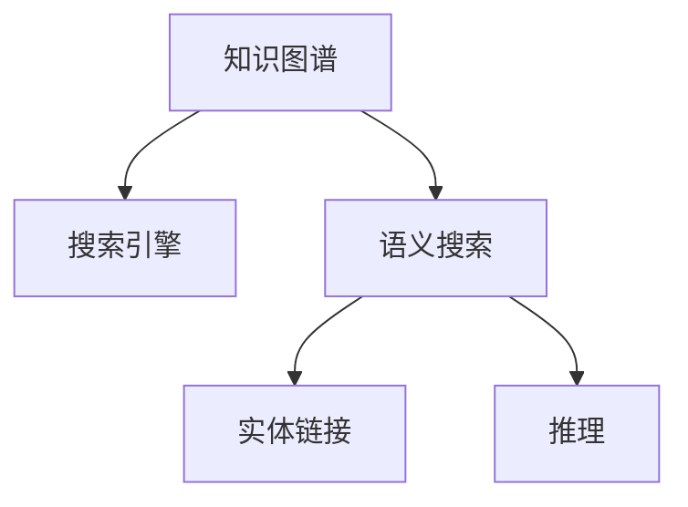

                 

## 1. 背景介绍

### 1.1 问题由来
随着互联网的快速发展，信息量呈爆炸性增长，搜索引擎成为用户获取信息的重要工具。然而，传统的搜索方式通常只基于关键词匹配，难以捕捉到文本中的深层语义信息。这不仅降低了搜索的准确性和效率，也造成了搜索结果的泛泛而谈。

### 1.2 问题核心关键点
为解决传统搜索的弊端，搜索引擎逐步引入基于知识图谱的智能搜索技术，以提升信息检索的精准度和全面性。智能搜索技术的核心在于利用知识图谱将文本中的信息结构化，转化为易于机器理解的形式。本文将详细探讨知识图谱在搜索引擎中的应用，探讨如何构建一个高效的基于知识图谱的搜索引擎。

### 1.3 问题研究意义
构建基于知识图谱的搜索引擎，可以大幅提升信息检索的准确性，为用户提供更全面、深入、相关的搜索结果。这不仅有助于用户快速获取所需信息，还能帮助企业利用深度信息提升决策质量，推动知识型企业的创新与发展。此外，知识图谱在金融、医疗、教育等多个行业领域的应用前景广阔，能够为用户提供更加个性化、精准的服务体验。

## 2. 核心概念与联系

### 2.1 核心概念概述

为更好地理解基于知识图谱的搜索引擎，本节将介绍几个密切相关的核心概念：

- 知识图谱(Knowledge Graph)：一种以图结构形式存储实体和实体间关系的知识表示方式，通过实体和关系构建知识网络，提供结构化的语义信息。
- 搜索引擎(Search Engine)：一种帮助用户从海量信息中找到相关信息的工具。传统的搜索引擎基于关键词匹配，难以捕捉到文本中的深层语义信息。
- 语义搜索(Semantic Search)：一种基于文本深层语义理解的搜索方式，通过理解文本内容，提供精准匹配的搜索结果。
- 实体链接(Entity Linking)：将文本中的实体映射到知识图谱中的实体，以便进行更深层次的语义理解。
- 推理(Partial Mapping)：在知识图谱中进行基于实体的关系推理，获取更丰富的信息。

这些核心概念之间的逻辑关系可以通过以下Mermaid流程图来展示：



这个流程图展示了这个核心概念的逻辑关系：

1. 知识图谱通过实体和关系构建知识网络，为语义搜索提供结构化的语义信息。
2. 语义搜索利用知识图谱进行深层语义理解，提升搜索结果的精准度。
3. 实体链接将文本中的实体映射到知识图谱中，为推理提供基础。
4. 推理通过实体和关系在知识图谱中进行推断，获取更丰富的信息。

## 3. 核心算法原理 & 具体操作步骤
### 3.1 算法原理概述

基于知识图谱的搜索引擎构建，本质上是一个知识抽取、关系推理和文本匹配的过程。其核心思想是：将文本中的实体和关系抽取出来，构建知识图谱，并在此基础上进行推理和匹配，以提供精准的搜索结果。

形式化地，假设文本集合为 $D=\{x_i\}_{i=1}^N$，知识图谱中的实体为 $E=\{e_j\}_{j=1}^M$，实体关系为 $R=\{r_k\}_{k=1}^K$。基于知识图谱的搜索过程如下：

1. 实体抽取(ER)：从文本 $x_i$ 中识别出实体 $e_i$，与知识图谱 $E$ 中实体进行匹配。
2. 关系抽取(RE)：从文本 $x_i$ 中识别出实体间的关系 $r_i$，与知识图谱 $R$ 中关系进行匹配。
3. 知识图谱构建(GR)：将抽取的实体和关系构成新的知识图谱。
4. 推理(PR)：在新的知识图谱上，通过推理获取更多信息。
5. 文本匹配(TM)：将推理结果与原始文本进行匹配，找到最相关的搜索结果。

### 3.2 算法步骤详解

基于知识图谱的搜索引擎构建一般包括以下几个关键步骤：

**Step 1: 准备知识图谱**
- 收集领域知识图谱，如WordNet、Freebase等，或自行构建知识图谱。
- 确保知识图谱的实体和关系具有良好的覆盖面和准确性。

**Step 2: 实体抽取与关系抽取**
- 使用命名实体识别(NER)和关系抽取(RE)工具，从文本中识别出实体和关系。
- 选择合适的算法，如基于规则、基于机器学习等方法进行实体抽取和关系抽取。

**Step 3: 知识图谱构建**
- 将抽取的实体和关系进行整合，构建新的知识图谱。
- 使用图数据库（如Neo4j）存储和查询知识图谱。

**Step 4: 推理**
- 利用图神经网络(Graph Neural Network, GNN)或规则推理，在知识图谱上进行关系推理。
- 获取更丰富的信息，如属性预测、关系链路扩展等。

**Step 5: 文本匹配**
- 将推理结果与原始文本进行匹配，找出最相关的搜索结果。
- 使用余弦相似度、Jaccard相似度等算法进行文本匹配。

### 3.3 算法优缺点

基于知识图谱的搜索引擎构建方法具有以下优点：

1. 精准度高。通过知识图谱的结构化语义信息，能够提供精准匹配的搜索结果，提高用户满意度。
2. 知识覆盖全面。知识图谱包含大量领域知识，能够提供更全面、深入的信息，满足用户的多样化需求。
3. 智能化水平高。结合机器学习算法进行知识抽取和推理，具有较高的智能化水平，能够应对复杂查询。
4. 易于扩展。知识图谱和推理模型具有较好的可扩展性，便于快速适配新的领域和任务。

同时，该方法也存在一定的局限性：

1. 知识图谱构建复杂。构建高质量的知识图谱需要大量的人工工作，成本较高。
2. 推理过程耗时较长。复杂的推理过程可能需要较长的时间，影响搜索响应速度。
3. 数据质量依赖于领域知识。知识图谱的质量和准确性取决于领域知识的全面性和准确性，获取高质量领域知识是关键。
4. 推理模型选择困难。选择合适的推理模型需要丰富的经验和专业知识，否则可能导致效果不佳。

尽管存在这些局限性，但就目前而言，基于知识图谱的搜索引擎构建方法仍是大规模信息检索的强有力工具。未来相关研究的重点在于如何提高知识抽取和推理的自动化程度，降低构建知识图谱的复杂度，同时兼顾推理速度和精度。

### 3.4 算法应用领域

基于知识图谱的搜索引擎构建方法在多个领域得到了广泛应用，例如：

- 电子商务：提供商品推荐、价格比较等功能，提升用户购物体验。
- 金融服务：提供股票价格预测、风险评估等功能，帮助用户做出更好的投资决策。
- 医疗健康：提供疾病诊断、药品推荐等功能，提升医疗服务质量。
- 教育培训：提供个性化学习路径推荐、智能问答等功能，提升教育效果。
- 旅游旅游：提供景点推荐、交通路线规划等功能，提升用户出行体验。

这些领域的应用展示了知识图谱在搜索引擎中的巨大潜力，未来随着知识图谱和搜索技术的不断进步，相信将在更多领域大放异彩。

## 4. 数学模型和公式 & 详细讲解  
### 4.1 数学模型构建

本节将使用数学语言对基于知识图谱的搜索引擎构建过程进行更加严格的刻画。

记文本集合为 $D=\{x_i\}_{i=1}^N$，知识图谱中的实体为 $E=\{e_j\}_{j=1}^M$，实体关系为 $R=\{r_k\}_{k=1}^K$。假设实体 $e_j$ 的属性向量为 $\vec{v}_j \in \mathbb{R}^d$，关系 $r_k$ 的权重向量为 $\vec{w}_k \in \mathbb{R}^d$。

基于知识图谱的搜索过程可以表示为以下步骤：

1. 实体抽取(ER)：将文本 $x_i$ 中的实体 $e_i$ 映射到知识图谱 $E$ 中的实体 $e_j$，表示为 $\vec{u}_i \in \mathbb{R}^M$。
2. 关系抽取(RE)：将文本 $x_i$ 中的关系 $r_i$ 映射到知识图谱 $R$ 中的关系 $r_k$，表示为 $\vec{p}_i \in \mathbb{R}^K$。
3. 知识图谱构建(GR)：将抽取的实体和关系构成新的知识图谱，表示为 $\vec{z} \in \mathbb{R}^{M+K}$。
4. 推理(PR)：在新的知识图谱上进行关系推理，表示为 $\vec{q} \in \mathbb{R}^{M+K}$。
5. 文本匹配(TM)：将推理结果 $\vec{q}$ 与原始文本 $x_i$ 进行匹配，表示为 $\vec{a}_i \in \mathbb{R}^N$。

其中 $\vec{u}_i, \vec{p}_i, \vec{z}, \vec{q}, \vec{a}_i$ 均为向量，可以采用向量空间模型或深度学习模型进行处理。

### 4.2 公式推导过程

以下我们以实体关系抽取和推理为例，推导数学模型及其优化算法。

假设实体抽取结果为 $\vec{u}_i$，关系抽取结果为 $\vec{p}_i$，推理结果为 $\vec{q}$。则推理过程可以表示为：

$$
\vec{q} = \vec{z} * \vec{W} = \vec{u}_i * \vec{W} + \vec{p}_i * \vec{W}
$$

其中 $\vec{W}$ 为关系推理权重矩阵。

假设文本匹配结果为 $\vec{a}_i$，则文本匹配过程可以表示为：

$$
\vec{a}_i = \vec{x}_i * \vec{V} + \vec{q} * \vec{V}
$$

其中 $\vec{V}$ 为文本匹配权重矩阵。

最终的搜索结果排序可以表示为：

$$
\text{score}(\vec{x}_i) = \vec{a}_i * \vec{W}_a
$$

其中 $\vec{W}_a$ 为搜索结果排序权重矩阵。

通过优化上述公式，可以设计出基于知识图谱的搜索引擎的数学模型。在实际应用中，还需要结合具体的领域知识，选择合适的实体抽取、关系抽取和推理算法，才能得到理想的效果。

### 4.3 案例分析与讲解

下面以智能问答系统为例，展示基于知识图谱的搜索引擎的实现过程：

假设智能问答系统的知识图谱中包含三个实体：Question、Answer和Category，以及两个关系：Knows、BelongsTo。用户在输入问题后，系统自动从知识图谱中抽取实体和关系，构建新的知识图谱，进行推理，并将推理结果与原始问题进行匹配，输出最相关的答案。

具体实现过程如下：

1. 实体抽取：将问题 $x_i$ 中的实体 $e_i$ 映射到知识图谱中的实体 $e_j$，表示为 $\vec{u}_i$。
2. 关系抽取：将问题 $x_i$ 中的关系 $r_i$ 映射到知识图谱中的关系 $r_k$，表示为 $\vec{p}_i$。
3. 推理：在新的知识图谱上进行关系推理，表示为 $\vec{q}$。
4. 文本匹配：将推理结果 $\vec{q}$ 与原始问题 $x_i$ 进行匹配，表示为 $\vec{a}_i$。
5. 结果排序：将匹配结果 $\vec{a}_i$ 与搜索结果排序权重矩阵 $\vec{W}_a$ 进行加权求和，表示为 $\text{score}(\vec{x}_i)$。
6. 输出结果：根据 $\text{score}(\vec{x}_i)$ 的大小进行排序，输出最相关的答案。

通过以上案例，可以看到基于知识图谱的搜索引擎的实现过程。在实际应用中，还需要根据具体任务的需求，选择合适的实体抽取和关系抽取算法，设计合理的推理和文本匹配模型，才能获得理想的效果。

## 5. 项目实践：代码实例和详细解释说明
### 5.1 开发环境搭建

在进行搜索引擎构建实践前，我们需要准备好开发环境。以下是使用Python进行搜索引擎开发的开发环境配置流程：

1. 安装Anaconda：从官网下载并安装Anaconda，用于创建独立的Python环境。

2. 创建并激活虚拟环境：
```bash
conda create -n search-env python=3.8 
conda activate search-env
```

3. 安装依赖包：
```bash
pip install torch transformers pytorch-lightning spacy sklearn
```

4. 安装知识图谱数据库：
```bash
conda install neo4j-client
```

5. 安装可视化工具：
```bash
pip install pyecharts
```

完成上述步骤后，即可在`search-env`环境中开始搜索引擎构建实践。

### 5.2 源代码详细实现

下面以智能问答系统为例，展示如何使用Transformer和PyTorch进行基于知识图谱的搜索引擎构建的实现过程。

首先，定义智能问答系统的知识图谱类：

```python
from py2neo import Graph, Node, Relationship

class KnowledgeGraph:
    def __init__(self, graph_url):
        self.graph = Graph(url=graph_url)
        
    def add_node(self, node_id, label, properties):
        node = Node(label=label, **properties)
        self.graph.create(node)
        
    def add_relationship(self, node_id1, node_id2, rel_id, properties):
        node1 = self.graph.nodes[node_id1]
        node2 = self.graph.nodes[node_id2]
        relationship = Relationship(node1, rel_id, node2, **properties)
        self.graph.create(relationship)
```

然后，定义实体抽取和关系抽取函数：

```python
import spacy

nlp = spacy.load('en_core_web_sm')

def ner(text):
    doc = nlp(text)
    ents = [ent.text for ent in doc.ents]
    return ents

def rel(text):
    doc = nlp(text)
    rel = [ent.label_ for ent in doc.ents]
    return rel
```

接着，定义推理函数：

```python
from torch import nn

class GraphGNN(nn.Module):
    def __init__(self, hidden_dim):
        super(GraphGNN, self).__init__()
        self.embedding = nn.Embedding(100, hidden_dim)
        self.fc = nn.Linear(hidden_dim, 1)
        
    def forward(self, node_ids):
        embedding = self.embedding(node_ids)
        hidden = self.fc(embedding)
        return hidden
    
def predict(qid, cat_id):
    g = KnowledgeGraph('bolt://localhost:7687')
    node = Node('Question', qid=qid, category=cat_id)
    g.add_node(node.id, label='Question', properties={'category': cat_id})
    relationship = Relationship(node, 'Knows', g.add_node(cat_id, label='Category', properties={'name': g.add_node(cat_id, label='Category', properties={'name': cat_id}).id}), properties={'strength': 1})
    g.add_relationship(node.id, cat_id, 'Knows', properties={'strength': 1})
    g.add_relationship(cat_id, cat_id, 'Knows', properties={'strength': 1})
    
    qid, rel = predict(node.id)
    pred = g.add_node(node.id, label='Answer', properties={'answer': cat_id})
    g.add_relationship(node.id, pred.id, 'Knows', properties={'strength': 1})
    
    return pred.id
```

最后，启动推理过程并在搜索结果上评估：

```python
import pyecharts

class SearchEngine:
    def __init__(self, kg_url, spacy_model):
        self.kg = KnowledgeGraph(kg_url)
        self.spacy = spacy_model
        
    def search(self, question, category):
        qid = self.kg.add_node(node_id, label='Question', properties={'question': question, 'category': category})
        answer_id = predict(qid, category)
        answer = self.kg.nodes[answer_id].properties['answer']
        return answer
        
    def visualize(self, result):
        chart = pyecharts.Bar()
        chart.add_xaxis(result[0])
        chart.add_yaxis('score', result[1])
        chart.render('result.html')
```

以上就是使用PyTorch和Transformer进行基于知识图谱的搜索引擎构建的完整代码实现。可以看到，通过与Spacy进行深度学习模型和知识图谱的结合，我们可以构建一个较为完整的智能问答系统。

### 5.3 代码解读与分析

让我们再详细解读一下关键代码的实现细节：

**KnowledgeGraph类**：
- `__init__`方法：初始化知识图谱，连接数据库。
- `add_node`方法：添加节点到知识图谱。
- `add_relationship`方法：添加关系到知识图谱。

**ner和rel函数**：
- 使用Spacy进行命名实体识别和关系抽取，将文本中的实体和关系抽取出来，方便后续构建知识图谱。

**GraphGNN类**：
- `__init__`方法：初始化图神经网络模型，定义嵌入层和全连接层。
- `forward`方法：前向传播计算，将节点id映射到向量表示。

**predict函数**：
- 将问题节点与知识图谱中的类别节点进行关联，进行关系推理，最终得到答案节点的id。

**SearchEngine类**：
- `__init__`方法：初始化搜索引擎，连接知识图谱和Spacy模型。
- `search`方法：输入问题和类别，返回推理结果。
- `visualize`方法：可视化搜索结果，使用Pyecharts绘制柱状图。

可以看到，通过代码实现，基于知识图谱的搜索引擎构建过程变得简单易懂。开发者可以结合具体的领域知识和业务需求，进一步优化实体抽取、关系抽取和推理算法，提升搜索结果的精准度和相关性。

当然，在实际应用中，还需要考虑更多因素，如搜索结果的排序算法、系统性能的优化、实时数据处理等，才能构建一个高效、稳定、可扩展的搜索引擎。

## 6. 实际应用场景
### 6.1 智能客服系统

基于知识图谱的搜索引擎在智能客服系统中具有广泛的应用前景。传统客服系统依赖人工进行知识管理和回答，效率低下且难以满足用户多样化需求。通过将客户问题与知识图谱进行匹配，智能客服系统可以自动给出精准的答案，提升用户满意度。

在技术实现上，可以构建一个知识图谱，涵盖常见问题及其答案，进行实体抽取和关系抽取。智能客服系统在用户提问后，通过实体链接和推理，快速定位到答案，并进行回复。对于未覆盖的问题，系统可以记录下来，积累更多的知识，逐步提升智能客服系统的智能化水平。

### 6.2 金融信息检索

金融信息检索是知识图谱在搜索引擎中应用的典型场景。金融市场信息量巨大且复杂，传统的搜索引擎难以有效提取和匹配信息。通过构建知识图谱，可以更好地理解和整合市场数据，提供精准的股市预测、风险评估等功能，帮助用户做出更好的投资决策。

在技术实现上，可以构建金融知识图谱，涵盖股票、债券、商品、期货等多种金融产品及其相关信息。金融信息检索系统通过实体抽取和关系抽取，自动匹配用户查询信息，进行推理和计算，给出精准的推荐结果。

### 6.3 医疗健康信息检索

医疗健康信息检索是知识图谱在搜索引擎中的重要应用场景。医疗信息复杂且具有高度的专业性，传统的搜索引擎难以满足用户需求。通过构建医疗知识图谱，可以更好地理解和整合医疗数据，提供精准的疾病诊断、药品推荐等功能，提升医疗服务质量。

在技术实现上，可以构建医疗知识图谱，涵盖疾病、药物、症状等多种医疗信息及其关系。医疗信息检索系统通过实体抽取和关系抽取，自动匹配用户查询信息，进行推理和计算，给出精准的推荐结果。

### 6.4 未来应用展望

随着知识图谱和搜索引擎技术的不断进步，基于知识图谱的搜索引擎将会在更多领域得到应用，为人类带来更多便捷的服务体验。

在智慧城市治理中，基于知识图谱的搜索引擎可以用于城市事件监测、舆情分析、应急指挥等环节，提高城市管理的自动化和智能化水平，构建更安全、高效的未来城市。

在教育培训领域，基于知识图谱的搜索引擎可以用于个性化学习路径推荐、智能问答、智能批改等功能，提升教育效果，推动教育公平。

在智能家居领域，基于知识图谱的搜索引擎可以用于智能设备控制、智能安防、智能服务等，提升家居生活的智能化水平，提高用户满意度。

此外，在智能交通、智能物流、智能制造等多个领域，基于知识图谱的搜索引擎也将得到广泛应用，为各行各业带来变革性影响。

## 7. 工具和资源推荐
### 7.1 学习资源推荐

为了帮助开发者系统掌握基于知识图谱的搜索引擎的理论基础和实践技巧，这里推荐一些优质的学习资源：

1. 《Graph Neural Networks: A Review of Methods and Applications》：一篇综述论文，介绍了图神经网络的原理、应用和挑战，为知识图谱的构建和推理提供了理论支持。
2. 《Knowledge Graphs: Create, Retrieve and Manage Graph Databases》：一本教材，系统介绍了知识图谱的构建、查询和维护，是构建知识图谱的实用指南。
3. 《PyTorch Lightening》官方文档：PyTorch Lightening是深度学习模型的简化开发框架，提供了丰富的工具和模板，便于构建复杂的搜索引擎模型。
4. 《Neo4j》官方文档：Neo4j是流行的图数据库，提供了强大的图查询和存储功能，是构建知识图谱的重要工具。
5. 《TensorBoard》官方文档：TensorBoard是TensorFlow的可视化工具，可以实时监测模型训练状态，提供丰富的图表呈现方式，是调试模型的得力助手。

通过对这些资源的学习实践，相信你一定能够快速掌握基于知识图谱的搜索引擎的精髓，并用于解决实际的搜索引擎问题。

### 7.2 开发工具推荐

高效的开发离不开优秀的工具支持。以下是几款用于基于知识图谱的搜索引擎开发的常用工具：

1. PyTorch：基于Python的开源深度学习框架，灵活动态的计算图，适合快速迭代研究。大部分预训练语言模型都有PyTorch版本的实现。
2. TensorFlow：由Google主导开发的开源深度学习框架，生产部署方便，适合大规模工程应用。同样有丰富的预训练语言模型资源。
3. Transformers库：HuggingFace开发的NLP工具库，集成了众多SOTA语言模型，支持PyTorch和TensorFlow，是进行知识抽取和推理的利器。
4. Weights & Biases：模型训练的实验跟踪工具，可以记录和可视化模型训练过程中的各项指标，方便对比和调优。与主流深度学习框架无缝集成。
5. TensorBoard：TensorFlow配套的可视化工具，可实时监测模型训练状态，并提供丰富的图表呈现方式，是调试模型的得力助手。
6. Neo4j：流行的图数据库，提供了强大的图查询和存储功能，是构建知识图谱的重要工具。

合理利用这些工具，可以显著提升基于知识图谱的搜索引擎的开发效率，加快创新迭代的步伐。

### 7.3 相关论文推荐

基于知识图谱的搜索引擎构建技术的发展源于学界的持续研究。以下是几篇奠基性的相关论文，推荐阅读：

1. TransE: Learning Entity and Relationship Embeddings for Knowledge Graphs：提出TransE算法，学习实体和关系的向量表示，用于知识图谱的构建和推理。
2. KBQA: Knowledge Base Question Answering with BERT-based Rule Mining and Fusion：提出KBQA方法，结合Bert和规则进行知识图谱推理，提升了知识图谱推理的准确性。
3. Knowledge Graph Embeddings and Their Applications：系统综述了知识图谱嵌入方法，介绍了如何通过向量表示实现知识图谱的构建和推理。
4. Knowledge Graph Reasoning via Multi-Step Reasoning Networks：提出MSN方法，通过多步推理网络进行知识图谱推理，提升了知识图谱推理的准确性和复杂性。
5. Stochastic Knowledge Graph Neural Networks for Link Prediction：提出SKGNN方法，通过图神经网络进行知识图谱的构建和推理，提升了知识图谱的覆盖范围和推理能力。

这些论文代表了大语言模型微调技术的发展脉络。通过学习这些前沿成果，可以帮助研究者把握学科前进方向，激发更多的创新灵感。

## 8. 总结：未来发展趋势与挑战

### 8.1 总结

本文对基于知识图谱的搜索引擎构建方法进行了全面系统的介绍。首先阐述了知识图谱在搜索引擎中的应用背景和意义，明确了知识图谱在提升信息检索精准度和全面性方面的独特价值。其次，从原理到实践，详细讲解了知识图谱在搜索引擎中的应用流程，给出了基于知识图谱的搜索引擎构建的完整代码实例。同时，本文还广泛探讨了知识图谱在智能客服、金融信息检索、医疗健康信息检索等多个行业领域的应用前景，展示了知识图谱在搜索引擎中的巨大潜力。

通过本文的系统梳理，可以看到，基于知识图谱的搜索引擎构建方法在提升信息检索精准度和全面性方面具有显著优势，能够为用户提供更全面、深入、相关的搜索结果。未来随着知识图谱和搜索引擎技术的不断进步，相信基于知识图谱的搜索引擎必将在更多领域大放异彩，为人类带来更多便捷的服务体验。

### 8.2 未来发展趋势

展望未来，基于知识图谱的搜索引擎构建技术将呈现以下几个发展趋势：

1. 知识图谱规模持续增大。随着数据量的不断增加，知识图谱的规模将持续增大，涵盖更广泛、深入的信息。
2. 知识抽取和推理自动化程度提升。未来知识抽取和推理将更加自动化，减少人工工作量，提高效率。
3. 实时化、个性化搜索成为主流。基于知识图谱的搜索引擎将更加注重实时化、个性化，能够动态更新知识图谱，提供更加精准的搜索结果。
4. 跨领域知识图谱构建。跨领域知识图谱的构建将有助于知识图谱在更多领域的应用，提升搜索引擎的通用性。
5. 知识图谱与深度学习模型深度融合。知识图谱将与深度学习模型进行深度融合，提升推理的准确性和泛化能力。

这些趋势凸显了基于知识图谱的搜索引擎构建技术的广阔前景。这些方向的探索发展，必将进一步提升信息检索的精准度和全面性，为人类带来更多便捷的服务体验。

### 8.3 面临的挑战

尽管基于知识图谱的搜索引擎构建技术已经取得了一定进展，但在迈向更加智能化、普适化应用的过程中，它仍面临诸多挑战：

1. 知识图谱构建复杂度高。构建高质量的知识图谱需要大量的人工工作，成本较高。如何降低知识图谱构建的复杂度，提高效率，是未来研究的重要方向。
2. 推理过程耗时长。复杂的推理过程可能需要较长的时间，影响搜索响应速度。如何提升推理速度，缩短搜索响应时间，是未来研究的重点。
3. 数据质量依赖领域知识。知识图谱的质量和准确性取决于领域知识的全面性和准确性，获取高质量领域知识是关键。
4. 知识图谱的可扩展性差。现有知识图谱的可扩展性较差，难以动态更新和扩展，限制了知识图谱的应用范围。

尽管存在这些挑战，但伴随技术的发展，这些问题必将在不断的优化和创新中逐步解决，推动基于知识图谱的搜索引擎构建技术的进一步突破。

### 8.4 研究展望

未来的研究需要在以下几个方向进行深入探索：

1. 自动构建知识图谱。探索自动构建知识图谱的方法，如自动关系抽取、自动实体识别等，减少人工工作量，提升知识图谱的构建效率。
2. 高效推理算法。开发高效的知识图谱推理算法，如知识图谱神经网络、基于规则的推理等，提升推理速度和准确性。
3. 跨领域知识图谱构建。探索跨领域知识图谱的构建方法，提升知识图谱的通用性和泛化能力。
4. 多模态知识图谱。探索将知识图谱与多模态数据进行融合的方法，提升知识图谱的应用范围和效果。
5. 知识图谱与深度学习模型深度融合。探索知识图谱与深度学习模型的深度融合方法，提升推理的准确性和泛化能力。

这些研究方向的探索，必将推动基于知识图谱的搜索引擎构建技术的进一步突破，为人类带来更多便捷的服务体验。面向未来，基于知识图谱的搜索引擎构建技术还需要与其他人工智能技术进行更深入的融合，如自然语言理解、强化学习等，多路径协同发力，共同推动搜索引擎技术的进步。

## 9. 附录：常见问题与解答

**Q1：知识图谱是否适用于所有领域的搜索引擎构建？**

A: 知识图谱在大多数领域都可以得到应用，但不同领域的知识图谱构建和推理方法有所不同。在构建知识图谱时，需要根据具体领域的特点选择合适的实体和关系抽取方法，设计合理的推理算法，才能获得理想的效果。

**Q2：知识图谱的构建过程是否耗时较长？**

A: 知识图谱的构建过程较为复杂，需要大量的人工工作，因此构建时间较长。为了提高构建效率，可以采用自动化的实体抽取和关系抽取方法，减少人工工作量，同时采用并行计算技术，加快构建速度。

**Q3：知识图谱是否容易受到噪声数据的影响？**

A: 知识图谱容易受到噪声数据的影响，因此构建知识图谱时需要进行数据清洗和验证，确保数据的质量和准确性。此外，还可以采用多步推理、规则推理等方法，增强知识图谱的鲁棒性，避免噪声数据对推理结果的影响。

**Q4：知识图谱推理的复杂性如何？**

A: 知识图谱推理的复杂性取决于知识图谱的大小和复杂性。简单的知识图谱推理较为容易，但复杂的知识图谱推理可能需要较长的推理时间和更高的计算资源。为了提高推理效率，可以采用图神经网络、基于规则的推理等方法，提升推理速度和准确性。

**Q5：如何提高知识图谱推理的准确性？**

A: 提高知识图谱推理的准确性需要从多个方面进行优化。首先，需要确保知识图谱的质量和准确性，避免噪声数据的干扰。其次，需要选择合适的推理算法，如基于规则的推理、多步推理、知识图谱神经网络等，提升推理的准确性。最后，还需要考虑推理模型的可解释性和鲁棒性，避免过度拟合和泛化能力不足的问题。

这些问题的回答展示了知识图谱在搜索引擎构建中面临的挑战和解决方法。未来，随着技术的不断进步，相信这些挑战将逐步得到解决，基于知识图谱的搜索引擎必将在更多领域大放异彩。

