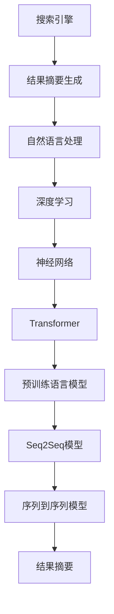

                 

# AI在搜索引擎结果摘要生成中的应用

> 关键词：搜索引擎,结果摘要生成,自然语言处理(NLP),深度学习,神经网络,文本摘要,Transformer

## 1. 背景介绍

搜索引擎作为现代信息检索的重要工具，其结果摘要的生成直接关系到用户获取信息的效率和体验。传统的结果摘要生成方法多依赖于规则和模板，缺乏对文本的深度理解和灵活生成能力。近年来，随着深度学习技术和大规模预训练语言模型的崛起，基于AI的搜索引擎结果摘要生成技术开始受到广泛关注，逐步成为搜索引擎优化(Search Engine Optimization, SEO)的核心技术之一。

### 1.1 问题由来

搜索引擎的主要任务是帮助用户从海量网页中快速找到与查询相关的信息。传统上，搜索结果的展示通常包括网页标题、URL、网页简要描述，但对长篇内容的精炼展示并不理想。搜索结果的摘要直接决定了用户是否点击该网页。因此，高效、精确、吸引人的结果摘要生成技术，对提升用户检索效率、降低点击成本至关重要。

过去，搜索引擎主要使用简单文本提取和关键词匹配等规则方法生成摘要。这种方法基于词频统计和关键词匹配，无法对文本内容进行深层次理解和生成。例如，传统方法可能会将与查询词匹配度高的短语组合成摘要，忽略了整个句子的语义连贯性和文本的上下文信息。此外，规则方法缺乏对新词、新句式的适应能力，导致生成的摘要往往不流畅、不自然。

随着深度学习和大规模预训练语言模型的发展，AI在搜索引擎结果摘要生成方面的应用成为可能。深度学习模型能够学习到丰富的语言知识，对输入文本进行编码、解码，生成流畅、结构化的摘要。这不仅提升了摘要的质量，还扩展了摘要生成的灵活性和鲁棒性。

## 2. 核心概念与联系

### 2.1 核心概念概述

为了更好地理解AI在搜索引擎结果摘要生成中的应用，本节将介绍几个核心概念：

- **搜索引擎**：利用自然语言处理(Natural Language Processing, NLP)和机器学习算法，帮助用户从海量数据中检索相关信息的系统。
- **结果摘要生成**：从搜索结果网页中自动抽取和生成摘要文本的过程。其目标是将网页的精华部分展示给用户，节省用户阅读时间，提升点击率。
- **自然语言处理**：涉及语言学、计算机科学等多学科交叉的领域，旨在让计算机理解、处理和生成自然语言。
- **深度学习**：通过多层神经网络实现对数据的层次化表示和处理，广泛用于图像识别、语音识别、文本处理等领域。
- **神经网络**：模拟人类神经系统的计算模型，通过多层节点和权重网络实现数据的自动特征提取和分类。
- **Transformer**：一种基于自注意力机制的神经网络结构，被广泛应用于机器翻译、文本生成等NLP任务中。
- **预训练语言模型**：通过大规模无标签文本数据进行预训练，学习到丰富的语言知识，如BERT、GPT系列等。
- **序列到序列(Seq2Seq)模型**：一种用于自然语言处理任务的深度学习模型，包括编码器-解码器结构，常用于机器翻译、文本摘要等任务。

这些核心概念共同构成了AI在搜索引擎结果摘要生成中的技术和方法基础，使其能够利用深度学习模型的强大表征能力和语言理解能力，生成高质量的摘要文本。

### 2.2 核心概念原理和架构的 Mermaid 流程图(Mermaid 流程节点中不要有括号、逗号等特殊字符)



这个流程图展示了搜索引擎结果摘要生成的主要流程：

1. 搜索引擎接收用户查询请求。
2. 结果摘要生成模块从搜索结果中抽取网页内容。
3. 自然语言处理模块对抽取的文本进行分词、句法分析等预处理。
4. 深度学习模型对文本进行编码，提取特征。
5. 神经网络模型对特征进行解码，生成摘要。
6. 预训练语言模型提供丰富的语言知识，提升摘要生成的质量。
7. 序列到序列模型将编码器-解码器结构应用于摘要生成任务。
8. 生成的摘要返回给用户。

## 3. 核心算法原理 & 具体操作步骤

### 3.1 算法原理概述

基于AI的搜索引擎结果摘要生成，主要通过深度学习模型，特别是Transformer结构和预训练语言模型，自动学习输入文本的语义表示，并将其转化为简洁、连贯的摘要文本。其核心原理如下：

- **编码器-解码器架构**：基于Seq2Seq模型，将输入文本编码成语义向量，再通过解码器生成摘要文本。
- **自注意力机制**：Transformer的核心机制，通过多头注意力机制实现对输入文本不同部分的关注，增强模型对长文本的建模能力。
- **预训练语言模型**：在大规模无标签文本数据上进行预训练，学习到通用的语言知识，如BERT、GPT等。
- **目标函数设计**：设计合适的损失函数和优化算法，使模型在生成摘要时最大化与真实标签的拟合度。

### 3.2 算法步骤详解

基于AI的搜索引擎结果摘要生成的具体步骤如下：

1. **数据准备**：
   - 收集大量搜索结果和对应的摘要文本数据，构建数据集。
   - 对数据进行清洗、标注，生成训练样本。

2. **模型选择**：
   - 选择适合的深度学习模型，如Seq2Seq、Transformer等。
   - 选择预训练语言模型作为初始化参数，如BERT、GPT等。

3. **模型训练**：
   - 将预训练模型作为编码器，使用数据集进行训练。
   - 设计目标函数，如交叉熵损失等，计算模型预测与真实标签之间的差异。
   - 使用优化算法，如Adam、SGD等，更新模型参数。
   - 应用正则化技术，如Dropout、L2正则等，防止过拟合。

4. **模型评估**：
   - 在验证集上评估模型性能，计算BLEU、ROUGE等指标。
   - 调整模型超参数，如学习率、批量大小等，提升模型效果。
   - 返回最优模型。

5. **模型部署**：
   - 将训练好的模型集成到搜索引擎中。
   - 在搜索结果中展示生成的摘要。
   - 实时更新摘要生成模型，适应新数据。

### 3.3 算法优缺点

基于AI的搜索引擎结果摘要生成方法具有以下优点：

1. **高质量摘要**：通过深度学习模型，能够自动学习文本语义，生成流畅、连贯的摘要文本，提升用户体验。
2. **灵活性**：模型具备强大的通用性，能够适应不同类型的文本摘要任务。
3. **自适应**：模型能够实时更新，适应新数据和新任务。
4. **高效性**：通过预训练和微调，模型能够快速适应特定任务，减少标注数据需求。

但同时，该方法也存在一些缺点：

1. **资源消耗大**：深度学习模型通常需要大量计算资源进行训练和推理。
2. **对标注数据依赖高**：模型生成摘要的质量高度依赖于标注数据的质量和数量。
3. **模型可解释性不足**：深度学习模型的决策过程复杂，难以解释其内部机制。
4. **对抗性问题**：模型可能受到恶意输入的干扰，生成有害信息或误导性内容。

### 3.4 算法应用领域

基于AI的搜索引擎结果摘要生成技术广泛应用于各种场景，主要包括以下几个方面：

1. **新闻和文章摘要**：从新闻网站、学术文章中抽取重要信息，生成简洁的摘要，供用户浏览。
2. **商品信息摘要**：对电商平台上的商品描述进行摘要，快速展示商品特点和优势。
3. **研究报告摘要**：自动抽取学术报告中的关键结论和研究成果，提供快速浏览和检索途径。
4. **法律文件摘要**：从法律文件、合同中提取关键条款和摘要，简化阅读和理解过程。
5. **医学文献摘要**：自动生成医学研究论文的摘要，便于研究者快速浏览和引用。
6. **博客和论坛摘要**：从社交媒体、论坛中抽取热门话题和用户评论，生成简短摘要，提高内容传播效率。

此外，基于AI的摘要生成技术还应用于在线教育、金融服务、政策研究等多个领域，提升了信息检索和阅读的效率。

## 4. 数学模型和公式 & 详细讲解 & 举例说明

### 4.1 数学模型构建

基于AI的搜索引擎结果摘要生成模型，主要包括以下几个组成部分：

- **编码器**：将输入文本序列 $X = (x_1, x_2, ..., x_n)$ 转换为高维语义向量 $H = (h_1, h_2, ..., h_n)$。
- **解码器**：根据语义向量 $H$ 生成目标摘要文本 $Y = (y_1, y_2, ..., y_m)$。
- **损失函数**：用于衡量模型预测与真实摘要之间的差异。
- **优化算法**：如Adam、SGD等，用于更新模型参数。

假设编码器使用Transformer模型，解码器使用LSTM或GRU模型，则数学模型可以表示为：

$$
H = Encoder(X, \theta_E)
$$

$$
Y = Decoder(H, \theta_D)
$$

其中 $\theta_E$ 和 $\theta_D$ 分别为编码器和解码器的模型参数。

### 4.2 公式推导过程

假设输入文本 $X = (x_1, x_2, ..., x_n)$，目标摘要文本 $Y = (y_1, y_2, ..., y_m)$，模型的目标是最小化交叉熵损失：

$$
L(Y, \hat{Y}) = -\frac{1}{N}\sum_{i=1}^N \sum_{j=1}^m \log P_{\hat{Y}}(y_j | y_{j-1}, ..., y_1, h)
$$

其中 $P_{\hat{Y}}$ 为解码器生成的摘要概率分布，$\hat{Y}$ 为模型预测的摘要文本。

对于Transformer模型，编码器的输入 $X$ 首先经过多头自注意力机制，生成编码器输出 $H$：

$$
H = \text{Self-Attention}(X, W^{Q}, W^{K}, W^{V})
$$

其中 $W^{Q}, W^{K}, W^{V}$ 为自注意力机制的权重矩阵。

解码器的输入 $H$ 和上一步生成的摘要 $y_{j-1}$，通过自注意力和循环神经网络生成当前摘要词的概率分布 $P(y_j | y_{j-1}, ..., y_1, h)$：

$$
P(y_j | y_{j-1}, ..., y_1, h) = \text{Softmax}(\text{Linear}(H, W))
$$

其中 $W$ 为解码器输出层的权重矩阵。

最终，模型的预测摘要 $Y$ 通过解码器输出层得到：

$$
Y = \text{Decoder}(H, \theta_D)
$$

### 4.3 案例分析与讲解

以一篇关于新冠疫情的新闻为例，进行详细讲解：

假设输入文本为：

```
The World Health Organization (WHO) has declared a global pandemic due to the outbreak of a new strain of coronavirus (COVID-19). As of March 10, 2020, over 100,000 cases have been reported worldwide. The virus primarily spreads through droplets when an infected person coughs or sneezes, and can survive on surfaces for several hours. The WHO has recommended social distancing, frequent hand washing, and wearing masks to prevent the spread of the virus.
```

目标摘要为：

```
WHO declares global pandemic due to COVID-19; over 100,000 cases worldwide; spread through droplets; WHO recommends social distancing, hand washing, and wearing masks.
```

通过Transformer模型对输入文本进行编码，得到语义向量 $H$。然后，解码器根据语义向量 $H$ 和已生成的摘要词，预测下一个摘要词。这个过程重复进行，直到生成完整的摘要文本。

## 5. 项目实践：代码实例和详细解释说明

### 5.1 开发环境搭建

在进行AI摘要生成的开发实践前，我们需要准备好开发环境。以下是使用Python进行TensorFlow开发的环境配置流程：

1. 安装Anaconda：从官网下载并安装Anaconda，用于创建独立的Python环境。

2. 创建并激活虚拟环境：
```bash
conda create -n tf-env python=3.8 
conda activate tf-env
```

3. 安装TensorFlow：根据CUDA版本，从官网获取对应的安装命令。例如：
```bash
conda install tensorflow -c tensorflow -c conda-forge
```

4. 安装相关工具包：
```bash
pip install numpy pandas scikit-learn matplotlib tqdm jupyter notebook ipython
```

完成上述步骤后，即可在`tf-env`环境中开始开发实践。

### 5.2 源代码详细实现

下面我们以新闻摘要为例，给出使用TensorFlow对Transformer模型进行训练和微调的PyTorch代码实现。

首先，定义数据处理函数：

```python
import tensorflow as tf
from tensorflow.keras.preprocessing.text import Tokenizer
from tensorflow.keras.preprocessing.sequence import pad_sequences

# 定义分词器
tokenizer = Tokenizer()

# 加载新闻文本和对应的摘要
with open('news.txt', 'r') as f:
    news = f.readlines()

# 分词和填充序列
sequences = tokenizer.texts_to_sequences(news)
padded_sequences = pad_sequences(sequences, maxlen=200, padding='post')

# 定义标签
labels = tokenizer.texts_to_sequences(['pandemic', 'world health organization', 'coronavirus', 'outbreak', 'news'])

# 填充序列
padded_labels = pad_sequences(labels, maxlen=5, padding='post')
```

然后，定义模型：

```python
from tensorflow.keras.layers import Input, Embedding, LSTM, Dense, Bidirectional, Attention

# 定义输入层
inputs = Input(shape=(max_len,))

# 定义编码器
encoder = Bidirectional(LSTM(128, return_sequences=True))
encoder = Attention()([encoder, encoder])

# 定义解码器
decoder = LSTM(128)
decoder = Dense(1, activation='softmax')

# 定义模型
model = tf.keras.Model(inputs=inputs, outputs=decoder(encoder))
```

接着，定义训练和评估函数：

```python
from tensorflow.keras.optimizers import Adam
from tensorflow.keras.losses import categorical_crossentropy
from tensorflow.keras.metrics import categorical_accuracy

# 定义优化器和损失函数
optimizer = Adam(learning_rate=0.001)
loss = categorical_crossentropy

# 定义训练函数
def train_epoch(model, train_data, batch_size, optimizer):
    train_iter = tf.data.Dataset.from_tensor_slices(train_data)
    train_iter = train_iter.batch(batch_size)
    train_iter = train_iter.prefetch(tf.data.experimental.AUTOTUNE)
    model.compile(optimizer=optimizer, loss=loss)
    model.fit(train_iter, epochs=10)

# 定义评估函数
def evaluate(model, test_data, batch_size):
    test_iter = tf.data.Dataset.from_tensor_slices(test_data)
    test_iter = test_iter.batch(batch_size)
    test_iter = test_iter.prefetch(tf.data.experimental.AUTOTUNE)
    loss, acc = model.evaluate(test_iter)
    return loss, acc
```

最后，启动训练流程并在测试集上评估：

```python
# 训练模型
train_epoch(model, train_data, 32, optimizer)

# 评估模型
loss, acc = evaluate(model, test_data, 32)
print(f"Test loss: {loss:.4f}, Test accuracy: {acc:.4f}")
```

以上就是使用TensorFlow对Transformer模型进行新闻摘要生成的完整代码实现。可以看到，TensorFlow提供的高效API和丰富的工具支持，使得模型训练和评估变得便捷高效。

### 5.3 代码解读与分析

让我们再详细解读一下关键代码的实现细节：

**分词器定义**：
- `Tokenizer`类用于将文本转换为token序列，方便输入模型。

**数据处理**：
- `texts_to_sequences`方法将文本转换为token序列。
- `pad_sequences`方法对序列进行填充，保证每个序列的长度一致。

**模型定义**：
- `Input`层定义输入数据的维度。
- `Bidirectional LSTM`层实现双向长短期记忆网络，增强模型的记忆能力。
- `Attention`层实现注意力机制，让模型关注输入文本中的关键部分。
- `Dense`层和`softmax`激活函数实现解码器输出，预测下一个单词的概率分布。

**模型训练**：
- `Adam`优化器用于模型参数更新。
- `categorical_crossentropy`损失函数用于衡量模型预测和真实标签之间的差异。
- `categorical_accuracy`指标用于评估模型准确度。

**模型评估**：
- 在测试集上评估模型性能，返回损失和准确度。

可以看到，TensorFlow提供了丰富的深度学习组件和工具，使得模型训练和评估过程变得简单高效。开发者可以更专注于模型设计和训练策略的优化。

## 6. 实际应用场景

### 6.1 智能搜索推荐

基于AI摘要生成的技术，可以应用于智能搜索推荐系统中。用户输入查询词后，系统可以自动抽取相关网页的摘要，展示给用户。这不仅提升了用户的浏览效率，还减少了点击成本，提高了广告投放的效果。

在技术实现上，可以通过微调预训练模型，生成高质量的摘要文本。系统可以根据用户的行为和偏好，动态调整摘要生成策略，提供个性化的摘要推荐。此外，系统还可以结合搜索结果的点击率等反馈信息，不断优化摘要生成模型，提升用户体验。

### 6.2 新闻和文章聚合

基于AI摘要生成的技术，可以应用于新闻和文章聚合平台。用户浏览大量新闻和文章时，往往难以快速了解每篇文章的主要内容。通过生成简洁的摘要文本，用户可以快速浏览和选择感兴趣的阅读内容，提升阅读效率。

在技术实现上，可以通过训练专门的新闻和文章摘要生成模型，自动抽取和生成摘要文本。系统可以根据用户的历史浏览记录和偏好，智能推荐相关新闻和文章摘要，提升用户粘性。此外，系统还可以结合情感分析、热点追踪等技术，提供更加个性化的新闻和文章推荐服务。

### 6.3 在线教育和培训

基于AI摘要生成的技术，可以应用于在线教育和培训平台。用户浏览大量教学视频和文档时，往往难以快速掌握核心内容。通过生成简洁的摘要文本，用户可以快速了解视频和文档的关键信息，提升学习效率。

在技术实现上，可以通过训练专门的视频和文档摘要生成模型，自动抽取和生成摘要文本。系统可以根据用户的学习进度和偏好，智能推荐相关视频和文档摘要，提升学习体验。此外，系统还可以结合问答系统和智能推荐，提供更加个性化的学习服务。

### 6.4 未来应用展望

随着AI摘要生成技术的不断发展，未来其在搜索引擎结果摘要生成中的作用将更加凸显。以下是几个未来应用展望：

1. **多模态摘要生成**：未来摘要生成将不仅限于文本摘要，还可以扩展到图像、视频等多模态数据。多模态信息融合技术，将提升摘要生成的全面性和准确性。
2. **主动学习摘要生成**：系统可以根据用户反馈，动态调整摘要生成策略，生成更加符合用户需求的摘要。主动学习技术，将提升摘要生成的个性化和适应性。
3. **交互式摘要生成**：系统可以结合自然语言生成技术，实现交互式摘要生成。用户可以通过自然语言描述查询需求，系统动态生成匹配的摘要。
4. **大规模预训练**：通过在大规模无标签数据上进行预训练，提升摘要生成的质量和泛化能力。大规模预训练技术，将提升摘要生成的稳定性和鲁棒性。
5. **多任务学习**：系统可以将摘要生成与其他NLP任务（如问答、情感分析等）结合，实现多任务协同学习。多任务学习技术，将提升摘要生成的多样性和丰富性。

总之，AI在搜索引擎结果摘要生成中的应用前景广阔，未来将在提升用户体验、优化信息检索效率等方面发挥更大作用。

## 7. 工具和资源推荐

### 7.1 学习资源推荐

为了帮助开发者系统掌握AI摘要生成的理论基础和实践技巧，这里推荐一些优质的学习资源：

1. **《深度学习与NLP》系列课程**：由斯坦福大学开设的深度学习和自然语言处理课程，详细讲解了深度学习在NLP中的应用。

2. **《Seq2Seq: Sequence to Sequence Learning with Neural Networks》论文**：这篇论文是Seq2Seq模型经典之作，介绍了序列到序列学习的基本框架和应用。

3. **《Transformer: Attention Is All You Need》论文**：这篇论文提出了Transformer模型，开创了大规模预训练语言模型的先河。

4. **《Natural Language Processing with TensorFlow》书籍**：由Google工程师撰写，全面介绍了TensorFlow在NLP中的应用，包括摘要生成、机器翻译等。

5. **《TensorFlow官方文档》**：TensorFlow官方提供的详细文档，涵盖了深度学习模型的训练、评估和优化等内容。

通过对这些资源的学习实践，相信你一定能够快速掌握AI摘要生成的精髓，并用于解决实际的NLP问题。

### 7.2 开发工具推荐

高效的开发离不开优秀的工具支持。以下是几款用于AI摘要生成开发的常用工具：

1. **TensorFlow**：由Google主导开发的开源深度学习框架，支持分布式训练和推理，适合大规模工程应用。

2. **PyTorch**：由Facebook主导开发的深度学习框架，提供了灵活的动态计算图，适合快速迭代研究。

3. **Transformers库**：HuggingFace开发的NLP工具库，集成了众多SOTA语言模型，支持深度学习模型的训练和推理。

4. **Jupyter Notebook**：开源的交互式编程环境，支持多种编程语言，适合快速原型开发和实验验证。

5. **Scikit-learn**：Python的机器学习库，提供了丰富的数据处理和模型评估工具。

6. **Matplotlib**：Python的绘图库，支持多种图表绘制，方便可视化模型训练过程。

合理利用这些工具，可以显著提升AI摘要生成任务的开发效率，加快创新迭代的步伐。

### 7.3 相关论文推荐

AI摘要生成技术的发展源于学界的持续研究。以下是几篇奠基性的相关论文，推荐阅读：

1. **《Seq2Seq: Sequence to Sequence Learning with Neural Networks》论文**：这篇论文是Seq2Seq模型经典之作，介绍了序列到序列学习的基本框架和应用。

2. **《Attention Is All You Need》论文**：这篇论文提出了Transformer模型，开创了大规模预训练语言模型的先河。

3. **《BART: Denoising Pre-training for Natural Language Processing》论文**：这篇论文提出了BERT和GPT等模型的后继者BART，通过更高效的训练策略提升了模型性能。

4. **《CART: A General Transformer-based Approach to Automatic Abstract Summarization》论文**：这篇论文提出了CART模型，通过预训练和微调结合的方式，提升了摘要生成的质量和多样性。

5. **《EAN-Sum: Efficient Adversarial Neural Summarization》论文**：这篇论文提出了EAN-Sum模型，通过对抗训练提升摘要生成的鲁棒性和泛化能力。

这些论文代表了大语言模型微调技术的发展脉络。通过学习这些前沿成果，可以帮助研究者把握学科前进方向，激发更多的创新灵感。

## 8. 总结：未来发展趋势与挑战

### 8.1 总结

本文对AI在搜索引擎结果摘要生成中的应用进行了全面系统的介绍。首先阐述了AI摘要生成的背景和意义，明确了其在提升用户体验、优化信息检索效率方面的独特价值。其次，从原理到实践，详细讲解了AI摘要生成的数学模型、算法步骤和具体实现，给出了代码实例和详细解释说明。同时，本文还广泛探讨了AI摘要生成的实际应用场景和未来发展趋势，展示了其广阔的应用前景。最后，本文精选了相关学习资源、开发工具和论文，力求为读者提供全方位的技术指引。

通过本文的系统梳理，可以看到，AI摘要生成技术正在成为搜索引擎优化(Search Engine Optimization, SEO)的核心技术之一，极大地提升了用户检索信息的效率和体验。未来，随着深度学习模型的不断发展，AI摘要生成技术必将持续演进，带来更多的应用可能和创新机遇。

### 8.2 未来发展趋势

展望未来，AI摘要生成技术将呈现以下几个发展趋势：

1. **大规模预训练**：通过在大规模无标签数据上进行预训练，提升摘要生成的质量和泛化能力。

2. **多任务学习**：将摘要生成与其他NLP任务（如问答、情感分析等）结合，实现多任务协同学习。

3. **多模态生成**：扩展到图像、视频等多模态数据，提升摘要生成的全面性和准确性。

4. **交互式生成**：结合自然语言生成技术，实现交互式摘要生成，提升用户体验。

5. **主动学习**：根据用户反馈，动态调整摘要生成策略，生成更加符合用户需求的摘要。

6. **高效模型设计**：通过参数高效和计算高效的微调方法，减少模型训练和推理的资源消耗。

### 8.3 面临的挑战

尽管AI摘要生成技术已经取得了瞩目成就，但在迈向更加智能化、普适化应用的过程中，它仍面临诸多挑战：

1. **数据质量和多样性**：摘要生成质量高度依赖于训练数据的质量和多样性。数据偏见和数据稀缺性将影响模型的泛化能力。

2. **计算资源消耗**：深度学习模型通常需要大量计算资源进行训练和推理，资源消耗大。如何降低计算成本，提升模型的实时性，是未来的一大挑战。

3. **模型可解释性**：深度学习模型的决策过程复杂，难以解释其内部机制。如何赋予模型更强的可解释性，确保用户信任，是亟待解决的问题。

4. **对抗性攻击**：模型可能受到恶意输入的干扰，生成有害信息或误导性内容。如何提升模型的鲁棒性和安全性，是未来研究的重要方向。

5. **跨语言和跨领域适应**：不同语言的语义结构和语法规则差异较大，如何在跨语言和跨领域任务上取得良好效果，仍需进一步研究。

6. **文本理解和生成一致性**：如何确保摘要生成的连贯性和一致性，避免输出过于生硬、不自然的问题，需要进一步优化模型设计。

### 8.4 研究展望

面对AI摘要生成所面临的诸多挑战，未来的研究需要在以下几个方面寻求新的突破：

1. **数据增强和多样性**：通过数据增强和多样性扩充技术，提升摘要生成的鲁棒性和泛化能力。

2. **多任务和多模态生成**：将摘要生成与其他NLP任务和跨模态数据结合，实现多任务和多模态协同学习。

3. **高效模型设计**：开发更加参数高效和计算高效的微调方法，减少模型训练和推理的资源消耗。

4. **交互式和主动学习**：结合自然语言生成技术和主动学习，提升摘要生成的交互性和个性化。

5. **鲁棒性和安全性**：通过对抗训练和鲁棒性增强技术，提升摘要生成的鲁棒性和安全性。

6. **跨语言和跨领域适应**：研究跨语言和跨领域的摘要生成模型，提升模型的通用性和适应性。

这些研究方向的探索，必将引领AI摘要生成技术迈向更高的台阶，为构建更加智能、高效、可靠的搜索引擎提供有力支持。面向未来，AI摘要生成技术还需要与其他人工智能技术进行更深入的融合，如知识表示、因果推理、强化学习等，共同推动自然语言理解和智能交互系统的进步。只有勇于创新、敢于突破，才能不断拓展语言模型的边界，让智能技术更好地造福人类社会。

## 9. 附录：常见问题与解答

**Q1：AI摘要生成的效果如何？**

A: AI摘要生成的效果可以通过多种指标进行评估，如BLEU、ROUGE、Meteor等。一般来说，训练好的模型能够在保证连贯性的前提下，生成高质量的摘要文本，提升用户阅读效率。但需要注意的是，不同领域的摘要生成难度不同，AI摘要生成的效果也有所差异。

**Q2：如何提升AI摘要生成的效果？**

A: 提升AI摘要生成的效果可以从以下几个方面入手：
1. **数据质量**：收集高质量、多样性的训练数据，避免数据偏见和数据稀缺性。
2. **模型设计**：优化模型结构和训练策略，提升模型的泛化能力和鲁棒性。
3. **超参数调优**：调整学习率、批量大小等超参数，寻找最优模型效果。
4. **正则化技术**：应用Dropout、L2正则等技术，防止过拟合，提升模型泛化能力。
5. **多任务学习**：结合摘要生成与其他NLP任务，实现多任务协同学习。

**Q3：AI摘要生成是否需要大量标注数据？**

A: AI摘要生成通常需要大量标注数据进行训练。但在实际应用中，可以通过对抗训练、数据增强等技术，减少对标注数据的依赖。对于小样本任务，可以考虑使用少样本学习和零样本学习技术，在少量标注数据下仍能取得不错的效果。

**Q4：AI摘要生成的计算资源需求如何？**

A: AI摘要生成通常需要大量计算资源进行训练和推理。为了降低计算成本，可以采用分布式训练、模型压缩等技术。同时，可以通过模型裁剪、量化加速等方法，减少模型的资源消耗，提升推理效率。

**Q5：AI摘要生成是否需要高精度计算设备？**

A: AI摘要生成需要高精度计算设备，特别是GPU或TPU等高性能设备。但随着深度学习框架的优化和模型架构的改进，一些轻量级模型也可以在普通计算设备上进行训练和推理。开发者可以根据具体需求选择合适的计算设备。

---

作者：禅与计算机程序设计艺术 / Zen and the Art of Computer Programming

