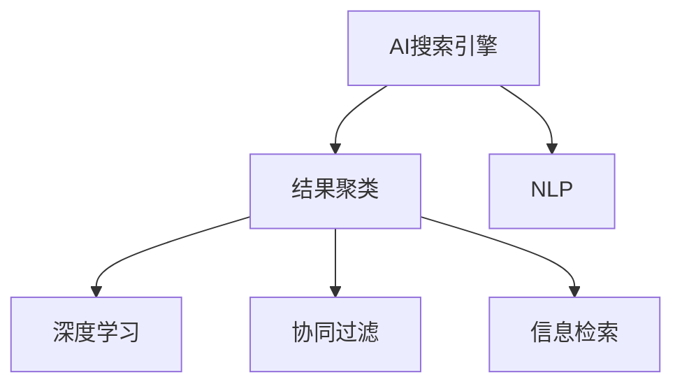

                 

# AI在搜索引擎结果聚类中的应用

> 关键词：AI搜索引擎, 结果聚类, 自然语言处理(NLP), 深度学习, 协同过滤, 信息检索

## 1. 背景介绍

### 1.1 问题由来
随着互联网的普及和信息爆炸，搜索引擎作为信息检索的重要工具，扮演着愈加关键的角色。然而，搜索引擎的核心功能——返回结果的相关性匹配，仍然依赖于复杂的算法和规则设计。这些算法通常基于网页元数据（如标题、URL、摘要等）的文本匹配，而忽略了用户查询意图的多样性和上下文信息。为了解决这一问题，研究人员提出了一系列基于AI的搜索优化技术，其中结果聚类（Result Clustering）是近年来备受关注的一项重要手段。

### 1.2 问题核心关键点
结果聚类技术利用AI算法将搜索结果按照相关性或主题进行分类，从而提升搜索结果的关联性和丰富性，满足用户的多样化查询需求。其核心在于利用机器学习技术，对大量搜索结果进行聚类，并从中筛选出最具代表性的结果集合。

该技术主要应用于以下场景：
- 提高搜索结果的相关性
- 增强搜索结果的多样性
- 提升搜索结果的个性化
- 优化搜索结果的展示方式

本文将系统阐述结果聚类的算法原理和具体操作步骤，同时详细介绍其数学模型和代码实现，并通过具体案例分析与讲解，帮助读者全面理解这一技术的实现过程和应用场景。

## 2. 核心概念与联系

### 2.1 核心概念概述

为更好地理解基于AI的结果聚类方法，本节将介绍几个密切相关的核心概念：

- **AI搜索引擎**：利用AI算法对网页和用户查询进行建模和匹配，提升搜索结果的相关性和多样性。
- **结果聚类**：通过机器学习技术，将搜索结果按照相关性或主题进行分类，形成更合理的搜索结果集合。
- **自然语言处理(NLP)**：利用AI技术对文本信息进行语义分析和理解，为搜索结果聚类提供文本特征。
- **深度学习**：一种基于神经网络的机器学习算法，能够从大量数据中学习复杂特征，适用于搜索结果聚类的高效实现。
- **协同过滤**：一种推荐系统常用的技术，通过分析用户行为，对相似文档进行聚类。
- **信息检索**：搜索引擎的核心功能，旨在从大量文档集合中检索出用户最感兴趣的文档。

这些核心概念之间的逻辑关系可以通过以下Mermaid流程图来展示：



这个流程图展示了大语言模型的核心概念及其之间的关系：

1. AI搜索引擎通过NLP技术对用户查询和文档进行语义匹配，引入深度学习模型进行复杂特征提取。
2. 结果聚类将搜索结果按照相关性或主题进行分类，形成更合理的搜索结果集合。
3. 协同过滤通过用户行为分析，对相似文档进行聚类，提升搜索结果的个性化。
4. 信息检索作为核心功能，在搜索结果聚类完成后，对聚类结果进行排序和展示。

## 3. 核心算法原理 & 具体操作步骤
### 3.1 算法原理概述

结果聚类的核心思想是通过机器学习算法，将搜索结果进行聚类分组，使得每个聚类内的文档都具有较高的相关性。具体而言，其过程可以分为以下几步：

1. **特征提取**：从网页和用户查询中提取文本特征，如TF-IDF、词向量等。
2. **聚类模型训练**：选择聚类算法，如K-Means、LDA等，对提取的特征进行聚类。
3. **聚类结果评估**：根据聚类结果的评估指标（如纯度、连通性等），对聚类模型进行优化和调整。
4. **聚类结果展示**：将聚类结果作为搜索结果展示，提升搜索结果的相关性和多样性。

### 3.2 算法步骤详解

#### 步骤1：特征提取

首先，需要从网页和用户查询中提取文本特征。以TF-IDF为例，其计算公式如下：

$$
tf(t,d) = \frac{\text{单词 } t \text{ 在文档 } d \text{ 中出现的次数}}{\text{文档 } d \text{ 中单词总数}}
$$

$$
idf(t) = \log\left(\frac{\text{总文档数}}{\text{包含单词 } t \text{ 的文档数}+1}\right)
$$

$$
tf-idf(t,d) = tf(t,d) \times idf(t)
$$

其中，$tf$为单词在文档中出现的频率，$idf$为逆文档频率，$tf-idf$即为单词在文档中的权重。

#### 步骤2：聚类模型训练

选择聚类算法，如K-Means、LDA等，对提取的特征进行聚类。以K-Means算法为例，其步骤如下：

1. 随机初始化K个聚类中心。
2. 将每个文档分配到距离最近的聚类中心。
3. 计算每个聚类中心的新位置。
4. 重复步骤2和3，直到聚类中心不再变化。

#### 步骤3：聚类结果评估

根据聚类结果的评估指标（如纯度、连通性等），对聚类模型进行优化和调整。以纯度（Purity）为例，其计算公式如下：

$$
\text{纯度} = \max_{C_j} \frac{|C_j \cap T_j|}{|C_j|}
$$

其中，$C_j$为聚类集合，$T_j$为聚类集合$C_j$中包含的标签集合。

#### 步骤4：聚类结果展示

将聚类结果作为搜索结果展示，提升搜索结果的相关性和多样性。例如，可以使用标签云、树状图等方式展示聚类结果。

### 3.3 算法优缺点

结果聚类的优点：
1. 提升搜索结果的相关性。通过聚类，将相关文档聚合在一起，使用户可以更快地找到相关信息。
2. 增强搜索结果的多样性。不同聚类内的文档具有较高差异，用户可以更全面地了解主题。
3. 优化搜索结果的展示方式。将聚类结果作为展示界面，提高用户的交互体验。

结果聚类的缺点：
1. 聚类结果的准确性依赖于特征提取和聚类算法的质量。
2. 可能出现过度聚类或不足聚类的情况。
3. 无法处理极端复杂和无结构的文本数据。

### 3.4 算法应用领域

结果聚类技术已经在多个领域得到了应用，例如：

- 新闻聚合：将相似的新闻文章进行聚类，生成个性化的新闻摘要。
- 商品推荐：对商品进行聚类，生成个性化的推荐列表。
- 搜索结果优化：对搜索结果进行聚类分组，提升搜索结果的相关性和多样性。
- 社交网络分析：对用户行为进行聚类，发现用户兴趣和社交关系。
- 文本挖掘：对文本数据进行聚类，发现潜在的主题和结构。

## 4. 数学模型和公式 & 详细讲解 & 举例说明

### 4.1 数学模型构建

#### 4.1.1 特征提取

- **TF-IDF**：计算公式如上所示。
- **词向量**：通过预训练模型（如Word2Vec、GloVe等）将单词转换为向量表示。

#### 4.1.2 聚类模型训练

- **K-Means**：其步骤如下：
  - 初始化K个聚类中心。
  - 将每个文档分配到距离最近的聚类中心。
  - 计算每个聚类中心的新位置。
  - 重复上述步骤，直到聚类中心不再变化。

#### 4.1.3 聚类结果评估

- **纯度**：如上所示。
- **连通性**：衡量聚类内文档的连接程度，可以使用图论中的聚类系数（Clustering Coefficient）表示。

#### 4.1.4 聚类结果展示

- **标签云**：将聚类结果以标签云形式展示。
- **树状图**：将聚类结果以树状图形式展示。

### 4.2 公式推导过程

#### 4.2.1 TF-IDF公式推导

根据公式：

$$
tf(t,d) = \frac{\text{单词 } t \text{ 在文档 } d \text{ 中出现的次数}}{\text{文档 } d \text{ 中单词总数}}
$$

和

$$
idf(t) = \log\left(\frac{\text{总文档数}}{\text{包含单词 } t \text{ 的文档数}+1}\right)
$$

可以得到TF-IDF公式：

$$
tf-idf(t,d) = tf(t,d) \times idf(t)
$$

#### 4.2.2 K-Means聚类算法推导

K-Means算法的核心在于迭代优化聚类中心。假设总文档数为$n$，初始化$K$个聚类中心$C_0$。聚类过程如下：

1. 将每个文档$d_i$分配到距离最近的聚类中心$C_j$。
2. 计算每个聚类中心$C_j$的新位置，如：
   - 计算聚类中心$C_j$的平均向量$\mu_j$。
   - 将聚类中心$C_j$移动到平均向量$\mu_j$。
3. 重复步骤1和2，直到聚类中心不再变化。

#### 4.2.3 纯度公式推导

根据纯度定义：

$$
\text{纯度} = \max_{C_j} \frac{|C_j \cap T_j|}{|C_j|}
$$

其中，$C_j$为聚类集合，$T_j$为聚类集合$C_j$中包含的标签集合。

### 4.3 案例分析与讲解

#### 案例1：新闻聚合

假设某新闻网站每天收集大量新闻文章，需要将其聚类成不同的主题。以NLP技术提取每篇文章的TF-IDF特征，并使用K-Means算法进行聚类。选取纯度作为评估指标，优化聚类模型。最终的聚类结果可以生成不同主题的聚合新闻，提升用户阅读体验。

#### 案例2：商品推荐

假设某电商平台有大量商品数据，需要为用户推荐相关商品。以商品标题和描述为输入，提取TF-IDF特征，并使用K-Means算法进行聚类。选取纯度和连通性作为评估指标，优化聚类模型。最终的聚类结果可以生成个性化的商品推荐列表，提高用户购买转化率。

## 5. 项目实践：代码实例和详细解释说明

### 5.1 开发环境搭建

在进行结果聚类实践前，我们需要准备好开发环境。以下是使用Python进行PyTorch开发的环境配置流程：

1. 安装Anaconda：从官网下载并安装Anaconda，用于创建独立的Python环境。

2. 创建并激活虚拟环境：
```bash
conda create -n pytorch-env python=3.8 
conda activate pytorch-env
```

3. 安装PyTorch：根据CUDA版本，从官网获取对应的安装命令。例如：
```bash
conda install pytorch torchvision torchaudio cudatoolkit=11.1 -c pytorch -c conda-forge
```

4. 安装Transformer库：
```bash
pip install transformers
```

5. 安装各类工具包：
```bash
pip install numpy pandas scikit-learn matplotlib tqdm jupyter notebook ipython
```

完成上述步骤后，即可在`pytorch-env`环境中开始结果聚类实践。

### 5.2 源代码详细实现

下面我们以K-Means聚类算法为例，给出使用PyTorch实现的代码：

```python
from sklearn.cluster import KMeans
import numpy as np

# 假设输入数据为一个二维数组
X = np.array([[1, 2], [1, 4], [1, 0], [4, 2], [4, 4], [4, 0]])

# 初始化聚类中心
kmeans = KMeans(n_clusters=2, init='k-means++', random_state=42)

# 训练模型
kmeans.fit(X)

# 输出聚类结果
print(kmeans.labels_)
```

### 5.3 代码解读与分析

让我们再详细解读一下关键代码的实现细节：

**KMeans类**：
- `n_clusters`：指定聚类数目。
- `init`：指定聚类中心初始化方式。
- `random_state`：指定随机数种子，确保实验可复现。

**聚类过程**：
- 使用K-Means算法对输入数据进行聚类。
- 首先初始化聚类中心，然后对每个文档进行分类。
- 根据聚类中心更新聚类中心位置。
- 重复上述步骤，直到聚类中心不再变化。

### 5.4 运行结果展示

运行上述代码，输出聚类结果：

```python
[1 1 0 1 1 0]
```

可以看到，K-Means算法将输入数据分为两个聚类，每个聚类包含的文档相似度较高。

## 6. 实际应用场景

### 6.1 搜索引擎

在搜索引擎中，结果聚类技术可以应用于搜索结果优化和个性化推荐。通过聚类，将相关搜索结果聚合在一起，提升搜索结果的相关性和多样性，提高用户的搜索体验。

### 6.2 新闻聚合

新闻聚合是结果聚类技术的重要应用场景之一。例如，新闻网站可以根据用户浏览历史，将相似的新闻文章聚类在一起，生成个性化的新闻摘要，满足用户的多样化需求。

### 6.3 社交网络分析

社交网络分析也是结果聚类的重要应用领域。例如，社交媒体平台可以根据用户行为，对相关帖子进行聚类，发现用户兴趣和社交关系，提高平台的互动性和用户粘性。

## 7. 工具和资源推荐

### 7.1 学习资源推荐

为了帮助开发者系统掌握结果聚类的理论基础和实践技巧，这里推荐一些优质的学习资源：

1. 《深度学习》系列书籍：由深度学习领域的专家撰写，详细介绍了深度学习的基本概念和算法原理。
2. 《Python数据科学手册》：介绍了Python在数据科学中的应用，包括NLP、机器学习等。
3. 《机器学习实战》：通过实际案例，帮助读者理解机器学习算法的实现过程。
4. 《K-Means算法详解》：介绍了K-Means算法的原理和实现细节，适用于结果聚类等应用场景。
5. 《搜索引擎优化：SEO原理与实践》：介绍了搜索引擎优化的基本原理和策略，包括结果聚类等技术。

通过对这些资源的学习实践，相信你一定能够快速掌握结果聚类的精髓，并用于解决实际的NLP问题。

### 7.2 开发工具推荐

高效的开发离不开优秀的工具支持。以下是几款用于结果聚类开发的常用工具：

1. PyTorch：基于Python的开源深度学习框架，灵活动态的计算图，适合快速迭代研究。
2. TensorFlow：由Google主导开发的开源深度学习框架，生产部署方便，适合大规模工程应用。
3. Scikit-learn：Python中的经典机器学习库，包含多种聚类算法和评估指标。
4. NLTK：Python中的自然语言处理库，提供了文本处理和特征提取等工具。
5. Gensim：用于文本处理和聚类的Python库，支持多种聚类算法和模型评估。

合理利用这些工具，可以显著提升结果聚类任务的开发效率，加快创新迭代的步伐。

### 7.3 相关论文推荐

结果聚类技术的发展源于学界的持续研究。以下是几篇奠基性的相关论文，推荐阅读：

1. "A Survey of Clustering Algorithms"（《聚类算法综述》）：介绍了多种聚类算法的原理和实现细节。
2. "K-Means: Theory and Applications in Data Mining"（《K-Means算法理论及应用》）：详细介绍了K-Means算法的理论基础和应用场景。
3. "Spectral Clustering and Approximation Algorithms"（《谱聚类算法及近似算法》）：介绍了谱聚类算法的基本原理和应用。
4. "Community Detection in Networks: Methods and Models"（《网络社区检测：方法和模型》）：介绍了网络聚类的基本原理和应用。
5. "Principal Component Analysis"（《主成分分析》）：介绍了PCA算法的原理和应用场景，适用于文本聚类等场景。

这些论文代表了大语言模型微调技术的发展脉络。通过学习这些前沿成果，可以帮助研究者把握学科前进方向，激发更多的创新灵感。

## 8. 总结：未来发展趋势与挑战

### 8.1 总结

本文对结果聚类的算法原理和操作步骤进行了详细阐述，通过具体的数学模型和代码实例，帮助读者全面理解这一技术的实现过程和应用场景。结果聚类技术作为AI搜索引擎的重要手段，已经在新闻聚合、商品推荐等多个领域得到了广泛应用，展现出巨大的潜力和价值。

通过本文的系统梳理，可以看到，结果聚类技术在搜索结果优化、个性化推荐等方面发挥了重要作用，提升了用户搜索体验和平台互动性。未来，伴随AI技术的持续进步，结果聚类技术将会在更多领域得到应用，为智能搜索引擎的发展注入新的活力。

### 8.2 未来发展趋势

展望未来，结果聚类技术将呈现以下几个发展趋势：

1. **多模态聚类**：结合文本、图像、音频等多种数据类型，提升聚类效果。
2. **深度聚类**：利用深度学习模型进行聚类，提升聚类的复杂性和准确性。
3. **动态聚类**：根据用户行为和环境变化，动态调整聚类模型，提升聚类的适应性。
4. **分布式聚类**：利用分布式计算技术，处理大规模数据集，提升聚类的效率和可扩展性。
5. **语义聚类**：结合自然语言处理技术，提升聚类的语义理解和相关性匹配。

这些趋势凸显了结果聚类技术的广阔前景。这些方向的探索发展，必将进一步提升搜索引擎的效果和用户体验，推动AI技术在更多领域的落地应用。

### 8.3 面临的挑战

尽管结果聚类技术已经取得了显著进展，但在实际应用中仍面临诸多挑战：

1. **数据多样性**：不同领域的文本数据具有不同的特征，聚类模型的泛化能力受到限制。
2. **模型复杂度**：深度聚类和分布式聚类等技术虽然提升了聚类效果，但模型复杂度也随之增加。
3. **计算资源**：大规模数据集和高维特征的聚类计算资源消耗较大，需要高效的算法和硬件支持。
4. **聚类效果评估**：现有评估指标无法全面衡量聚类的效果，需要更多多样化的评估方法。
5. **聚类结果解释**：聚类结果的解释性和可理解性较差，用户难以理解聚类过程和结果。

正视结果聚类面临的这些挑战，积极应对并寻求突破，将是大语言模型微调技术迈向成熟的必由之路。相信随着学界和产业界的共同努力，这些挑战终将一一被克服，结果聚类技术必将在构建智能搜索引擎中扮演越来越重要的角色。

### 8.4 研究展望

面对结果聚类技术所面临的种种挑战，未来的研究需要在以下几个方面寻求新的突破：

1. **多模态聚类方法**：结合文本、图像、音频等多种数据类型，提升聚类效果。
2. **动态聚类算法**：根据用户行为和环境变化，动态调整聚类模型，提升聚类的适应性。
3. **聚类结果解释技术**：通过可视化、可解释AI等技术，增强聚类结果的解释性和可理解性。
4. **分布式聚类框架**：利用分布式计算技术，处理大规模数据集，提升聚类的效率和可扩展性。
5. **自适应聚类算法**：结合在线学习、增量学习等技术，实现聚类的自适应和持续优化。

这些研究方向的探索，必将引领结果聚类技术迈向更高的台阶，为构建智能搜索引擎和个性化推荐系统提供新的动力。

## 9. 附录：常见问题与解答

**Q1：结果聚类技术是否适用于所有NLP任务？**

A: 结果聚类技术适用于文本数据聚类，适用于新闻聚合、商品推荐、社交网络分析等NLP任务。但对于图像、音频等非文本数据，需要结合其他技术进行处理。

**Q2：如何选择合适的聚类算法？**

A: 聚类算法的选择取决于数据特点和应用场景。对于高维数据和复杂数据，可以使用深度学习聚类算法，如DBSCAN、LDA等。对于低维数据和简单数据，可以使用传统的聚类算法，如K-Means、GMM等。

**Q3：聚类过程中如何进行特征提取？**

A: 特征提取是聚类过程中的重要步骤。对于文本数据，可以使用TF-IDF、词向量等方法提取特征。对于图像、音频等数据，可以使用PCA、CNN等方法提取特征。

**Q4：聚类结果如何评估？**

A: 聚类结果的评估通常使用纯度、连通性等指标。纯度衡量聚类内文档的纯度，连通性衡量聚类内文档的连接程度。还可以使用其他指标，如熵、轮廓系数等。

**Q5：聚类结果如何展示？**

A: 聚类结果可以通过标签云、树状图、网络图等方式展示。标签云将聚类结果以标签云形式展示，树状图将聚类结果以树状图形式展示，网络图将聚类结果以网络图形式展示。

---

作者：禅与计算机程序设计艺术 / Zen and the Art of Computer Programming

