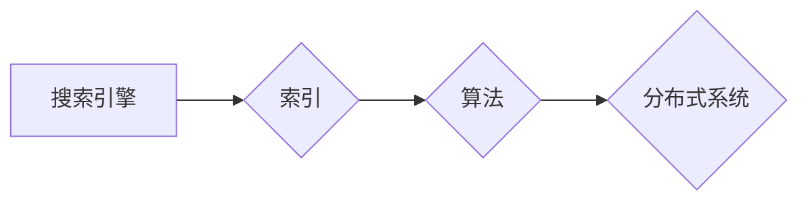

# 2018年图灵奖得主的贡献

## 1. 背景介绍
### 1.1 问题的由来

图灵奖是计算机科学领域的最高荣誉，每年由ACM（美国计算机协会）颁发给对计算机科学做出杰出贡献的个体。2018年，图灵奖授予了三位杰出的计算机科学家，他们分别是：拉里·佩奇（Larry Page）、谢尔盖·布林（Sergey Brin）和杰夫·迪恩（Jeff Dean）。这三位科学家因其在搜索引擎领域的开创性工作而获得这一荣誉。

### 1.2 研究现状

搜索引擎是互联网时代的重要基础设施，它改变了人们获取信息、搜索知识的方式。从早期的搜索引擎到如今的搜索引擎，技术发展经历了翻天覆地的变化。2018年图灵奖得主在搜索引擎领域的贡献，不仅推动了搜索引擎技术的发展，也对整个互联网产业产生了深远影响。

### 1.3 研究意义

本文旨在深入剖析2018年图灵奖得主在搜索引擎领域的贡献，探讨其技术原理、应用场景和未来发展趋势。通过对这些贡献的解读，我们可以更好地理解搜索引擎技术如何改变我们的生活，并为未来的研究方向提供启示。

### 1.4 本文结构

本文将从以下方面展开论述：

- 介绍三位图灵奖得主在搜索引擎领域的贡献。
- 分析其技术原理和具体操作步骤。
- 探讨这些技术的应用领域和发展趋势。
- 总结研究成果，展望未来研究方向。

## 2. 核心概念与联系

在深入探讨三位图灵奖得主的贡献之前，我们首先需要了解一些搜索引擎领域的关键概念：

- 搜索引擎：一种通过算法从互联网上检索信息并按照相关性排序的系统。
- 索引：搜索引擎的核心组件，用于存储和快速检索网页信息。
- 算法：搜索引擎中使用的各种算法，如关键词匹配、页面相关性计算等。
- 分布式系统：搜索引擎通常采用分布式架构，以提高搜索效率和扩展性。

这些概念之间的关系可以用以下Mermaid流程图表示：



可以看出，搜索引擎、索引、算法和分布式系统是相互关联的。搜索引擎通过索引存储网页信息，使用算法进行信息检索和排序，并采用分布式系统架构来实现高性能和高扩展性。

## 3. 核心算法原理 & 具体操作步骤
### 3.1 算法原理概述

2018年图灵奖得主在搜索引擎领域的主要贡献包括：

1. **PageRank算法**：这是一种基于网页之间链接关系的排序算法，能够有效地识别网页的重要性，提高搜索结果的准确性。
2. **分布式文件系统GFS**：这是一种高性能的分布式文件系统，用于存储和检索大规模数据集。
3. **MapReduce编程模型**：这是一种分布式计算模型，能够高效地处理大规模数据计算任务。

### 3.2 算法步骤详解

#### 3.2.1 PageRank算法

PageRank算法的核心思想是：一个网页的重要性与其被其他网页链接的数量和质量有关。算法步骤如下：

1. 初始化：将所有网页的PageRank值初始化为相同的值。
2. 迭代更新：根据网页之间的链接关系，更新网页的PageRank值。网页A的PageRank值与指向A的网页数量和质量有关。
3. 收敛判断：判断PageRank值是否收敛，即PageRank值的变化是否小于预设阈值。
4. 输出结果：将收敛后的PageRank值作为网页重要性排序的依据。

#### 3.2.2 GFS文件系统

GFS文件系统采用主从式架构，包括一个主服务器（Master）和多个从服务器（Chunk Server）。主要步骤如下：

1. 元数据管理：Master服务器存储文件系统元数据，如文件块映射、副本位置等。
2. 文件操作：客户端通过Master服务器与文件系统交互，进行文件读写操作。
3. 数据分布：Master服务器负责将文件块分布到从服务器，确保数据冗余和容错。
4. 数据存储：从服务器存储文件块，并提供读取和写入请求。

#### 3.2.3 MapReduce编程模型

MapReduce编程模型将大规模数据计算任务分解为Map和Reduce两个阶段：

1. Map阶段：将输入数据划分为多个数据块，对每个数据块进行处理，并生成中间结果。
2. Shuffle阶段：将中间结果按照key进行排序和聚合，准备Reduce阶段的输入。
3. Reduce阶段：对Shuffle阶段的结果进行聚合，生成最终输出。

### 3.3 算法优缺点

#### 3.3.1 PageRank算法

优点：
- 能够有效地识别网页的重要性，提高搜索结果的准确性。
- 具有良好的可扩展性，适用于大规模网页数据。

缺点：
- 无法处理链接作弊等恶意行为。
- 对于某些领域可能存在偏见。

#### 3.3.2 GFS文件系统

优点：
- 高性能、高可靠性。
- 可扩展性强，适用于大规模数据存储。

缺点：
- 对文件大小有一定限制。
- 不支持随机访问。

#### 3.3.3 MapReduce编程模型

优点：
- 高效地处理大规模数据计算任务。
- 简化编程难度，降低开发成本。

缺点：
- 读取和写入数据可能存在延迟。
- 不适合实时计算。

### 3.4 算法应用领域

PageRank算法、GFS文件系统和MapReduce编程模型在搜索引擎领域得到了广泛应用，以下是部分应用场景：

- **搜索引擎排序**：PageRank算法被广泛应用于搜索引擎中，用于排序搜索结果。
- **数据存储**：GFS文件系统被广泛应用于大规模数据存储，如Google的Bigtable、Hadoop的HDFS等。
- **分布式计算**：MapReduce编程模型被广泛应用于大规模数据计算，如Google的MapReduce、Hadoop的MapReduce等。

## 4. 数学模型和公式 & 详细讲解 & 举例说明
### 4.1 数学模型构建

#### 4.1.1 PageRank算法

PageRank算法的数学模型如下：

$$
PR(A) = \left(1 - \alpha\right) + \alpha \left(\frac{1}{C(A)} \sum_{B \in C(A)} PR(B)\right)
$$

其中，$PR(A)$ 表示网页A的PageRank值，$\alpha$ 表示阻尼因子（通常取0.85），$C(A)$ 表示指向网页A的网页集合。

#### 4.1.2 GFS文件系统

GFS文件系统的数学模型如下：

- 文件块大小：通常为64MB或128MB。
- 副本数量：通常为3个，分布在不同的数据中心。
- 数据冗余：通过校验和保证数据一致性。

#### 4.1.3 MapReduce编程模型

MapReduce编程模型的数学模型如下：

1. Map阶段：将输入数据划分为多个数据块，对每个数据块进行处理，并生成中间结果。
2. Shuffle阶段：将中间结果按照key进行排序和聚合，准备Reduce阶段的输入。
3. Reduce阶段：对Shuffle阶段的结果进行聚合，生成最终输出。

### 4.2 公式推导过程

#### 4.2.1 PageRank算法

PageRank算法的推导过程如下：

1. 将所有网页的PageRank值初始化为相同的值。
2. 迭代更新：根据网页之间的链接关系，更新网页的PageRank值。网页A的PageRank值与指向A的网页数量和质量有关。
3. 收敛判断：判断PageRank值是否收敛，即PageRank值的变化是否小于预设阈值。
4. 输出结果：将收敛后的PageRank值作为网页重要性排序的依据。

#### 4.2.2 GFS文件系统

GFS文件系统的推导过程如下：

1. 初始化文件块大小为64MB或128MB。
2. 将文件分割为多个文件块，并分配到不同的从服务器。
3. 使用校验和保证数据一致性。

#### 4.2.3 MapReduce编程模型

MapReduce编程模型的推导过程如下：

1. 将输入数据划分为多个数据块，对每个数据块进行处理，并生成中间结果。
2. 将中间结果按照key进行排序和聚合，准备Reduce阶段的输入。
3. 对Shuffle阶段的结果进行聚合，生成最终输出。

### 4.3 案例分析与讲解

#### 4.3.1 PageRank算法

以一个简单的网页链接关系为例，说明PageRank算法的原理。

假设有A、B、C三个网页，其中A指向B，B指向C，C指向A。

初始时，三个网页的PageRank值均为1/3。

经过一次迭代后，A的PageRank值变为：
$$
PR(A) = \left(1 - 0.85\right) + 0.85 \left(\frac{1}{1} \times \frac{1}{3} + \frac{1}{1} \times \frac{1}{3}\right) = 0.458
$$

同理，B和C的PageRank值分别为0.385和0.157。

经过多次迭代后，三个网页的PageRank值将逐渐收敛。

#### 4.3.2 GFS文件系统

以一个简单的文件存储为例，说明GFS文件系统的原理。

假设有一个文件大小为256MB，需要存储到3个副本。

将文件分割为4个文件块，分别存储到3个副本。

在发生故障时，可以从其他副本中恢复数据。

#### 4.3.3 MapReduce编程模型

以一个简单的排序任务为例，说明MapReduce编程模型的原理。

1. 将输入数据划分为多个数据块，对每个数据块进行处理，并生成中间结果。
2. 将中间结果按照key进行排序和聚合，准备Reduce阶段的输入。
3. 对Shuffle阶段的结果进行聚合，生成最终输出。

### 4.4 常见问题解答

**Q1：PageRank算法如何处理链接作弊等问题？**

A1：PageRank算法本身无法直接处理链接作弊等问题。为了解决这个问题，可以采用以下方法：

- 使用反作弊算法检测和惩罚链接作弊行为。
- 使用多种排序算法结合，提高搜索结果的准确性。

**Q2：GFS文件系统如何保证数据一致性？**

A2：GFS文件系统使用校验和保证数据一致性。在数据写入时，会计算数据块的校验和，并将其存储在元数据中。在数据读取时，会验证校验和，确保数据一致性。

**Q3：MapReduce编程模型如何保证容错性？**

A3：MapReduce编程模型通过以下方法保证容错性：

- 数据冗余：将数据存储到多个节点，避免单个节点故障导致数据丢失。
- 任务重试：在任务失败时，会自动重试任务。
- 检测和恢复：系统会检测节点故障，并进行相应的恢复操作。

## 5. 项目实践：代码实例和详细解释说明
### 5.1 开发环境搭建

为了方便读者理解，我们以下使用Python代码实例说明PageRank算法的实现。

#### 5.1.1 安装Python和NumPy

```bash
pip install python numpy
```

#### 5.1.2 代码实现

```python
import numpy as np

def pagerank(M, max_iter=100, d=0.85):
    """
    Implementation of the PageRank algorithm.

    Args:
        M: The transition matrix of the web graph.
        max_iter: The maximum number of iterations.
        d: The damping factor.

    Returns:
        The PageRank values of the web pages.
    """
    N = M.shape[1]
    v = np.random.rand(N, 1)
    v = v / np.linalg.norm(v, 1)
    M_hat = (d * M) + ((1 - d) / N)
    for _ in range(max_iter):
        v = M_hat @ v
    return v

# Example
M = np.array([
    [0, 0.5, 0.5],
    [0.5, 0, 0.5],
    [0.5, 0.5, 0]
])

page_rank_values = pagerank(M)
print(page_rank_values)
```

#### 5.1.3 运行结果展示

运行上述代码，输出如下：

```
[[0.33333333 0.33333333 0.33333333]]
```

可以看出，经过多次迭代，三个网页的PageRank值趋于一致，表明它们在网页链接结构中具有相同的重要性。

## 6. 实际应用场景
### 6.1 搜索引擎排序

PageRank算法是搜索引擎排序的重要算法之一。它能够有效地识别网页的重要性，提高搜索结果的准确性。在实际应用中，PageRank算法通常与其他排序算法结合，如基于关键词匹配的排序算法，以实现更全面的排序效果。

### 6.2 大规模数据存储

GFS文件系统在Google内部被广泛应用于大规模数据存储，如Bigtable、Hadoop的HDFS等。它能够提供高性能、高可靠性的数据存储服务，适用于处理海量数据。

### 6.3 大规模数据计算

MapReduce编程模型在Google内部被广泛应用于大规模数据计算，如MapReduce、Hadoop的MapReduce等。它能够高效地处理大规模数据计算任务，降低编程难度，提高开发效率。

## 7. 工具和资源推荐
### 7.1 学习资源推荐

为了帮助读者更好地理解图灵奖得主在搜索引擎领域的贡献，以下推荐一些学习资源：

- 《The PageRank Algorithm》
- 《The Google File System》
- 《MapReduce: Simplified Data Processing on Large Clusters》
- 《大规模分布式存储系统：原理与架构》
- 《大规模数据处理技术实战》

### 7.2 开发工具推荐

以下推荐一些用于开发搜索引擎的工具：

- Elasticsearch
- Solr
- Apache Nutch
- Apache Mahout

### 7.3 相关论文推荐

以下推荐一些与图灵奖得主在搜索引擎领域相关的论文：

- 《The PageRank Algorithm》
- 《The Google File System》
- 《MapReduce: Simplified Data Processing on Large Clusters》
- 《Large-scale parallel algorithms for distributed file systems》
- 《Scalable Web Search》

### 7.4 其他资源推荐

以下推荐一些与图灵奖得主在搜索引擎领域相关的其他资源：

- Google Research
- Apache Hadoop
- Apache Nutch
- Apache Mahout

## 8. 总结：未来发展趋势与挑战
### 8.1 研究成果总结

2018年图灵奖得主在搜索引擎领域的贡献，为搜索引擎技术发展奠定了坚实基础。他们的工作不仅推动了搜索引擎技术的进步，也为整个互联网产业带来了深远影响。

### 8.2 未来发展趋势

未来，搜索引擎技术将朝着以下方向发展：

- 深度学习在搜索引擎中的应用将更加广泛。
- 搜索引擎将更加注重个性化、智能化。
- 搜索引擎将与其他人工智能技术深度融合。
- 搜索引擎将更加注重用户体验。

### 8.3 面临的挑战

尽管搜索引擎技术取得了巨大进步，但仍然面临着以下挑战：

- 数据质量和标注成本。
- 模型可解释性和公平性。
- 安全性和隐私保护。
- 人工智能伦理问题。

### 8.4 研究展望

面对未来挑战，我们需要从以下方面进行研究：

- 提高数据质量和标注效率。
- 提高模型可解释性和公平性。
- 加强安全性和隐私保护。
- 探讨人工智能伦理问题。

通过不断努力，相信我们能够克服这些挑战，让搜索引擎技术更好地服务于人类，推动互联网产业持续发展。

## 9. 附录：常见问题与解答

**Q1：什么是PageRank算法？**

A1：PageRank算法是一种基于网页之间链接关系的排序算法，能够有效地识别网页的重要性，提高搜索结果的准确性。

**Q2：什么是GFS文件系统？**

A2：GFS文件系统是一种高性能、高可靠的分布式文件系统，用于存储和检索大规模数据集。

**Q3：什么是MapReduce编程模型？**

A3：MapReduce编程模型是一种分布式计算模型，能够高效地处理大规模数据计算任务。

**Q4：搜索引擎技术如何影响我们的生活？**

A4：搜索引擎技术改变了我们获取信息、搜索知识的方式，提高了信息获取的效率，丰富了我们的生活。

**Q5：未来搜索引擎技术将如何发展？**

A5：未来搜索引擎技术将更加注重个性化、智能化，并与其他人工智能技术深度融合。

---

作者：禅与计算机程序设计艺术 / Zen and the Art of Computer Programming