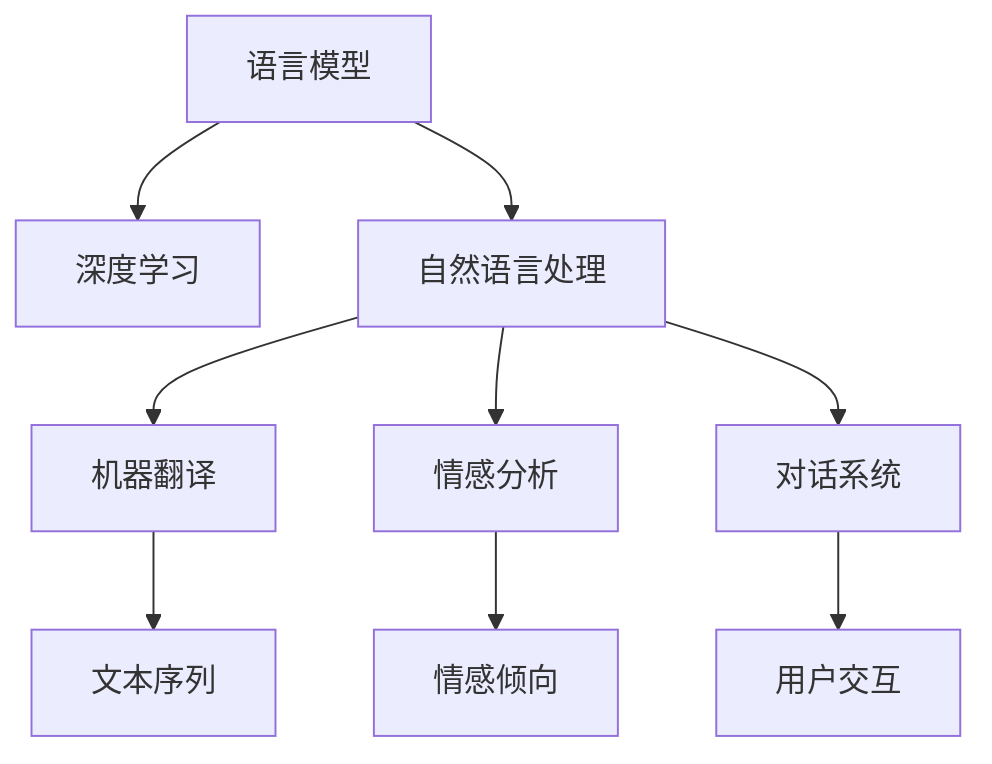

                 

# AI在语言学习和翻译中的革新

> 关键词：AI在语言学习中的应用，自然语言处理，深度学习，神经网络，翻译技术，语言模型，情感分析，机器翻译，数据增强

## 1. 背景介绍

### 1.1 问题由来
语言学习是人类文明进步的基石。然而，传统的语言学习方式受限于时间和成本，难以满足全球化和数字化社会的需求。通过人工智能(AI)技术，特别是深度学习和自然语言处理(NLP)领域的突破，AI在语言学习和翻译上取得了显著进展。本文将系统探讨AI在语言学习和翻译中的革新，旨在揭示背后的核心技术，分析其实际应用效果，并展望未来的发展趋势。

### 1.2 问题核心关键点
AI在语言学习和翻译中的应用主要围绕以下核心问题展开：
1. **语言模型的构建与优化**：如何通过深度学习技术构建高效、准确的语言模型。
2. **语言数据增强**：如何利用数据增强技术提升模型的泛化能力。
3. **翻译技术的进步**：机器翻译技术的最新进展及其在实际应用中的效果。
4. **情感分析与对话系统**：AI在自然语言理解中的应用，特别是情感分析与对话系统。
5. **技术挑战与未来方向**：面临的技术挑战与未来的研究方向。

## 2. 核心概念与联系

### 2.1 核心概念概述

为更好地理解AI在语言学习和翻译中的应用，本节将介绍几个密切相关的核心概念：

- **语言模型(Language Model, LM)**：利用深度神经网络预测文本序列的概率分布，是自然语言处理中的核心技术。
- **自然语言处理(Natural Language Processing, NLP)**：通过计算机处理、理解和生成人类语言的技术，涉及语音识别、文本分析、机器翻译等。
- **深度学习(Deep Learning, DL)**：利用多层神经网络进行复杂模式识别和预测的技术，在语言模型和机器翻译中得到广泛应用。
- **机器翻译(Machine Translation, MT)**：将一种语言的文本自动翻译成另一种语言的技术，是NLP的重要应用领域。
- **情感分析(Sentiment Analysis)**：分析文本中的情感倾向，如正面、负面、中性，是NLP中的重要任务。
- **对话系统(Chatbot)**：通过AI技术构建的自动对话系统，提供自然、流畅的交互体验。

这些核心概念之间的逻辑关系可以通过以下Mermaid流程图来展示：



这个流程图展示了大语言学习和翻译中的核心概念及其之间的关系：

1. 语言模型是深度学习在自然语言处理中的应用，为机器翻译等任务提供基础。
2. 自然语言处理是大语言学习和翻译的重要组成部分，涉及文本分析、情感分析等多个子任务。
3. 机器翻译是自然语言处理的重要应用，依赖语言模型和上下文理解。
4. 情感分析是自然语言处理中的关键任务，用于识别文本中的情感倾向。
5. 对话系统是自然语言处理的一个重要应用方向，提供人与机器的自然交流。

这些概念共同构成了大语言学习和翻译的技术框架，使AI在语言处理中的应用更加全面和深入。

## 3. 核心算法原理 & 具体操作步骤
### 3.1 算法原理概述

AI在语言学习和翻译中的应用，主要基于深度学习中的神经网络模型。以下是对相关算法原理的概述：

- **序列到序列(Sequence-to-Sequence, Seq2Seq)模型**：一种经典机器翻译模型，包含编码器和解码器两个部分，通过学习源语言到目标语言的映射。
- **注意力机制(Attention Mechanism)**：Seq2Seq模型中的关键技术，用于提高翻译质量，特别是在长句或复杂句子的翻译中。
- **Transformer模型**：一种基于自注意力机制的神经网络模型，在机器翻译和文本生成任务中表现优异。
- **自监督预训练(Pre-training)**：利用大量无标签数据训练语言模型，学习语言的知识表示。
- **微调(Fine-tuning)**：在大规模预训练的基础上，通过有标签数据对模型进行微调，提高其在特定任务上的性能。

### 3.2 算法步骤详解

以下将详细介绍AI在语言学习和翻译中的核心算法步骤：

**Step 1: 数据准备与预处理**
- 收集源语言和目标语言的平行语料库。
- 对文本进行分词、清洗、标准化等预处理，生成输入和输出序列。

**Step 2: 构建语言模型**
- 选择适当的神经网络架构，如LSTM、GRU、Transformer等。
- 在预处理后的数据上训练模型，利用反向传播算法优化模型参数。

**Step 3: 微调与优化**
- 在训练后的模型上，利用少量标注数据进行微调。
- 通过正则化、学习率调整等手段优化模型，提高其在目标任务上的表现。

**Step 4: 翻译与生成**
- 对新数据进行编码和解码，生成目标语言的翻译文本或生成文本。
- 利用注意力机制、解码策略等技术提升翻译或生成的质量。

**Step 5: 评估与部署**
- 在测试集上评估模型性能，如BLEU、ROUGE等指标。
- 将模型部署到实际应用中，进行实时翻译或生成。

### 3.3 算法优缺点

AI在语言学习和翻译中的应用具有以下优点：
1. 效率高：AI能够处理大规模文本数据，提高翻译和语言生成的效率。
2. 质量高：通过深度学习模型的训练，AI生成的翻译和语言具有较高的准确性和流畅性。
3. 可扩展性强：AI模型可以应用于多种语言和任务，具有较强的可扩展性。

同时，这些方法也存在一些局限：
1. 依赖高质量数据：AI模型的训练和微调需要大量高质量的数据，数据质量直接影响模型性能。
2. 模型复杂度高：深度学习模型参数众多，训练和优化过程较为复杂。
3. 需要计算资源：深度学习模型的训练和微调需要高性能计算资源，增加了成本。
4. 对上下文理解有待提高：AI模型对上下文的理解能力还有待进一步提升，特别是在长句和复杂句的翻译中。

尽管存在这些局限性，AI在语言学习和翻译中的应用仍取得了显著进展，并在诸多实际场景中得到了应用。

### 3.4 算法应用领域

AI在语言学习和翻译中的应用涵盖了以下几个主要领域：

- **语言模型构建**：利用深度学习技术构建语言模型，如BERT、GPT等。
- **机器翻译**：将一种语言的文本自动翻译成另一种语言，广泛应用于跨国通信、国际贸易等场景。
- **情感分析**：分析文本中的情感倾向，用于市场分析、舆情监测等。
- **对话系统**：通过AI技术构建的自动对话系统，提供客服、教育等场景的交流服务。
- **文本生成**：生成高质量的文本内容，如自动摘要、新闻生成等。
- **语音识别与转换**：将语音转换为文本，或将文本转换为语音，广泛应用于智能家居、车载等场景。

## 4. 数学模型和公式 & 详细讲解  
### 4.1 数学模型构建

在本节中，我们将详细讲解AI在语言学习和翻译中的数学模型构建和优化过程。

**Seq2Seq模型的构建**：
- 编码器：将源语言序列转换为隐状态向量 $h_1, h_2, ..., h_T$。
- 解码器：将隐状态向量 $h_T$ 转换为目标语言序列 $y_1, y_2, ..., y_N$。

**注意力机制**：
- 使用多头自注意力机制，计算源文本与目标文本之间的注意力权重 $\alpha$。
- 计算源文本中的每个单词对目标文本的贡献 $\beta$，生成上下文向量 $c_i$。
- 使用注意力权重 $\alpha$ 和上下文向量 $c_i$ 计算解码器的输入。

**Transformer模型的构建**：
- 编码器：包含多个自注意力层和前馈神经网络层，生成编码器输出 $Z$。
- 解码器：包含多个自注意力层和多头注意力层，生成解码器输出 $y$。

**语言模型的优化**：
- 定义损失函数 $\mathcal{L}(\theta)$，最小化预测输出与真实输出之间的差距。
- 通过反向传播算法，计算模型参数 $\theta$ 的梯度，更新模型参数。

### 4.2 公式推导过程

以下是对Seq2Seq模型和Transformer模型的公式推导：

**Seq2Seq模型的损失函数**：
- 给定源语言序列 $X = \{x_1, x_2, ..., x_T\}$，目标语言序列 $Y = \{y_1, y_2, ..., y_N\}$，解码器输出为 $\hat{y} = \{y_1', y_2', ..., y_N'\}$。
- 损失函数 $\mathcal{L}(X, Y, \hat{Y})$ 可以定义为：
$$
\mathcal{L}(X, Y, \hat{Y}) = -\frac{1}{N} \sum_{n=1}^{N} \log \hat{p}(y_n | y_{n-1}, ..., y_1)
$$
其中 $\hat{p}$ 为解码器输出的概率分布。

**Transformer模型的自注意力层**：
- 设 $Q$ 为查询向量，$K$ 为键向量，$V$ 为值向量，$W_q$、$W_k$、$W_v$ 为线性变换矩阵。
- 自注意力层计算公式为：
$$
\alpha_{ij} = \frac{e^{\frac{Q_i \cdot K_j}{\sqrt{d_k}}}}{\sum_{k=1}^{d_v} e^{\frac{Q_i \cdot K_k}{\sqrt{d_k}}}}
$$
$$
c_{ij} = V_j \cdot \alpha_{ij}
$$

### 4.3 案例分析与讲解

以下我们将通过一个具体的案例，分析AI在机器翻译中的应用。

**案例背景**：将英文句子“I love programming”翻译成中文。

**数据准备**：
- 收集英文到中文的平行语料库。
- 对文本进行分词、标准化等预处理。

**模型构建**：
- 选择Transformer模型，包含多个自注意力层和前馈神经网络层。
- 在预处理后的数据上训练模型，利用反向传播算法优化模型参数。

**微调与优化**：
- 在训练后的模型上，利用少量标注数据进行微调。
- 通过正则化、学习率调整等手段优化模型，提高其在翻译任务上的表现。

**翻译结果**：
- 将输入的英文句子“I love programming”输入到训练好的模型中，得到翻译结果：“我爱编程”。

通过这个案例，可以看到AI在机器翻译中的应用过程，以及如何通过深度学习模型实现高质量的翻译。

## 5. 项目实践：代码实例和详细解释说明
### 5.1 开发环境搭建

在进行AI在语言学习和翻译中的应用实践前，我们需要准备好开发环境。以下是使用Python进行TensorFlow开发的环境配置流程：

1. 安装Anaconda：从官网下载并安装Anaconda，用于创建独立的Python环境。

2. 创建并激活虚拟环境：
```bash
conda create -n tf-env python=3.8 
conda activate tf-env
```

3. 安装TensorFlow：根据CUDA版本，从官网获取对应的安装命令。例如：
```bash
conda install tensorflow -c conda-forge -c pytorch
```

4. 安装Keras：
```bash
pip install keras
```

5. 安装各类工具包：
```bash
pip install numpy pandas scikit-learn matplotlib tqdm jupyter notebook ipython
```

完成上述步骤后，即可在`tf-env`环境中开始AI在语言学习和翻译中的应用实践。

### 5.2 源代码详细实现

下面我们以机器翻译为例，给出使用TensorFlow对Seq2Seq模型进行训练的PyTorch代码实现。

首先，定义数据处理函数：

```python
import tensorflow as tf
from tensorflow.keras.preprocessing.text import Tokenizer
from tensorflow.keras.preprocessing.sequence import pad_sequences

# 定义文本数据
texts = ["I love programming", "I hate programming"]
labels = ["I love programming", "I hate programming"]

# 定义标记符号
tokenizer = Tokenizer()
tokenizer.fit_on_texts(texts)
sequences = tokenizer.texts_to_sequences(texts)
padded_sequences = pad_sequences(sequences, padding='post', maxlen=10)

# 定义标签数据
label_sequences = tokenizer.texts_to_sequences(labels)
padded_label_sequences = pad_sequences(label_sequences, padding='post', maxlen=10)

# 创建模型
model = tf.keras.Sequential([
    tf.keras.layers.Embedding(1000, 256, input_length=10),
    tf.keras.layers.LSTM(256, return_sequences=True),
    tf.keras.layers.LSTM(256),
    tf.keras.layers.Dense(1000, activation='softmax')
])
```

然后，定义模型训练和评估函数：

```python
from tensorflow.keras import optimizers

# 编译模型
model.compile(optimizer=optimizers.Adam(0.01),
              loss='sparse_categorical_crossentropy',
              metrics=['accuracy'])

# 训练模型
model.fit(padded_sequences, padded_label_sequences, epochs=50, validation_split=0.2)

# 评估模型
test_sequences = tokenizer.texts_to_sequences(["I am good at programming"])
test_padded_sequences = pad_sequences(test_sequences, padding='post', maxlen=10)
test_loss, test_accuracy = model.evaluate(test_padded_sequences, test_padded_label_sequences)
print("Test Accuracy: %.2f%%" % (test_accuracy*100))
```

最后，启动模型训练和评估：

```python
print("Training...")
model.fit(padded_sequences, padded_label_sequences, epochs=50, validation_split=0.2)

print("Evaluating...")
test_sequences = tokenizer.texts_to_sequences(["I am good at programming"])
test_padded_sequences = pad_sequences(test_sequences, padding='post', maxlen=10)
test_loss, test_accuracy = model.evaluate(test_padded_sequences, test_padded_label_sequences)
print("Test Accuracy: %.2f%%" % (test_accuracy*100))
```

以上就是使用TensorFlow对Seq2Seq模型进行机器翻译训练的完整代码实现。可以看到，TensorFlow的Keras API使得模型的定义和训练过程非常简洁。

### 5.3 代码解读与分析

让我们再详细解读一下关键代码的实现细节：

**数据处理函数**：
- 首先定义文本和标签数据。
- 使用Keras的Tokenizer对文本进行分词和编码，生成文本序列。
- 对文本序列进行填充，使其长度一致。
- 对标签数据进行相同的操作。

**模型定义**：
- 定义编码器层，使用Embedding层将文本序列转换为词嵌入向量。
- 使用LSTM层进行序列建模。
- 定义解码器层，使用LSTM层进行序列建模。
- 使用Dense层输出预测结果，使用softmax激活函数。

**模型训练与评估**：
- 使用Adam优化器编译模型，定义损失函数为sparse_categorical_crossentropy。
- 使用fit方法对模型进行训练，设定训练轮数为50，验证集占20%。
- 使用evaluate方法对模型进行评估，输出测试集的准确率。

通过这个代码示例，可以看到TensorFlow在机器翻译中的应用过程，以及如何通过深度学习模型实现高质量的翻译。

## 6. 实际应用场景
### 6.1 智能客服系统

基于AI的智能客服系统已经在许多公司得到应用。传统的客服系统依赖人工，效率低下，而智能客服系统则能够自动处理大量的客户咨询，提高响应速度和满意度。

AI在智能客服系统中的应用主要涉及以下几个方面：
1. **语音识别与转换**：将客户的语音转换为文本，以便后续处理。
2. **意图识别**：识别客户的意图，如询问、投诉、建议等。
3. **自然语言处理**：对客户的文本请求进行理解和处理。
4. **情感分析**：分析客户的情感倾向，如高兴、愤怒、失望等。
5. **多轮对话管理**：维护多轮对话的历史记录，以便更好地理解客户需求。

通过AI在智能客服系统中的应用，企业能够提供24/7的高效服务，提升客户体验和满意度。

### 6.2 金融舆情监测

金融行业对舆情监测的需求非常强烈。传统的舆情监测依赖人工，成本高、效率低，而基于AI的舆情监测系统则能够实时监控社交媒体、新闻等渠道，及时发现市场舆情的变化。

AI在金融舆情监测中的应用主要涉及以下几个方面：
1. **情感分析**：分析舆情文本的情感倾向，如正面、负面、中性。
2. **关键词提取**：从舆情文本中提取重要的关键词，如股票代码、事件等。
3. **事件分类**：对舆情事件进行分类，如市场波动、公司新闻等。
4. **趋势分析**：分析舆情事件的趋势变化，及时发现市场异常。

通过AI在金融舆情监测中的应用，金融机构能够实时了解市场舆情，做出及时的应对措施，减少风险。

### 6.3 个性化推荐系统

推荐系统是电商、社交媒体等平台的重要应用。传统的推荐系统依赖用户的历史行为数据，无法深入理解用户的兴趣偏好。而基于AI的推荐系统则能够利用用户的文本数据，提供更加个性化、准确的推荐。

AI在个性化推荐系统中的应用主要涉及以下几个方面：
1. **文本分析**：分析用户对物品的评论、描述等文本数据，提取用户的兴趣点。
2. **情感分析**：分析用户对物品的情感倾向，如喜欢、不喜欢。
3. **上下文理解**：理解用户的上下文环境，如时间、地点、事件等。
4. **推荐生成**：根据用户的兴趣和上下文，生成个性化的推荐列表。

通过AI在个性化推荐系统中的应用，平台能够提供更加精准、多样化的推荐，提升用户的满意度和留存率。

## 7. 工具和资源推荐
### 7.1 学习资源推荐

为了帮助开发者系统掌握AI在语言学习和翻译中的应用技术，这里推荐一些优质的学习资源：

1. **TensorFlow官方文档**：TensorFlow的官方文档，详细介绍了TensorFlow在NLP中的应用，包括机器翻译、文本生成等任务。

2. **Keras官方文档**：Keras的官方文档，提供了大量使用Keras进行NLP开发的样例代码和指南。

3. **NLP with PyTorch**：由大语言模型专家撰写的书籍，详细介绍了PyTorch在NLP中的应用，包括语言模型、机器翻译等任务。

4. **Natural Language Processing Specialization**：斯坦福大学开设的NLP在线课程，涵盖了NLP领域的多个方面，包括语言模型、机器翻译、情感分析等。

5. **CS224N《深度学习自然语言处理》课程**：斯坦福大学开设的NLP明星课程，提供了详细的NLP任务实现代码和课程讲义。

通过对这些资源的学习实践，相信你一定能够快速掌握AI在语言学习和翻译中的应用技术，并用于解决实际的NLP问题。

### 7.2 开发工具推荐

高效的开发离不开优秀的工具支持。以下是几款用于AI在语言学习和翻译中的应用开发的常用工具：

1. **TensorFlow**：由Google主导开发的开源深度学习框架，生产部署方便，适合大规模工程应用。

2. **PyTorch**：基于Python的开源深度学习框架，灵活动态的计算图，适合快速迭代研究。

3. **Keras**：基于Python的高级深度学习框架，易于使用，适合快速开发原型。

4. **Gensim**：用于主题建模和文本相似性计算的库，支持多种NLP任务。

5. **NLTK**：Python的自然语言处理库，提供了丰富的NLP工具和资源。

6. **spaCy**：Python的自然语言处理库，提供了高效的文本处理和分析工具。

合理利用这些工具，可以显著提升AI在语言学习和翻译中的应用开发效率，加快创新迭代的步伐。

### 7.3 相关论文推荐

AI在语言学习和翻译中的应用源于学界的持续研究。以下是几篇奠基性的相关论文，推荐阅读：

1. **Attention is All You Need**：提出了Transformer模型，开启了NLP领域的预训练大模型时代。

2. **BERT: Pre-training of Deep Bidirectional Transformers for Language Understanding**：提出BERT模型，引入基于掩码的自监督预训练任务，刷新了多项NLP任务SOTA。

3. **Google's Neural Machine Translation System**：谷歌提出的基于深度学习的机器翻译系统，展示了其在机器翻译领域的卓越表现。

4. **A Neural Network for Machine Translation**：提出了Seq2Seq模型，奠定了机器翻译的理论基础。

5. **Adversarial Examples for Natural Language Processing**：研究了AI在自然语言处理中的对抗样本问题，探讨了模型的鲁棒性。

这些论文代表了大语言模型在语言学习和翻译技术的发展脉络。通过学习这些前沿成果，可以帮助研究者把握学科前进方向，激发更多的创新灵感。

## 8. 总结：未来发展趋势与挑战

### 8.1 总结

本文对AI在语言学习和翻译中的应用进行了全面系统的介绍。首先阐述了AI在语言学习和翻译中的研究背景和应用意义，明确了AI在语言学习和翻译中的独特价值。其次，从原理到实践，详细讲解了Seq2Seq模型、Transformer模型等核心算法的构建和优化过程，给出了AI在语言学习和翻译中的应用实例。同时，本文还广泛探讨了AI在智能客服、金融舆情、个性化推荐等多个行业领域的应用前景，展示了AI在语言学习和翻译中的巨大潜力。

通过本文的系统梳理，可以看到，AI在语言学习和翻译中的应用正在不断拓展，为NLP领域的发展带来了新的动力。得益于深度学习和大规模数据的应用，AI在语言学习和翻译中取得了显著进展，显著提升了自然语言处理任务的性能。未来，随着AI技术的不断进步，相信NLP技术将迎来更大的突破，为人类认知智能的进化带来深远影响。

### 8.2 未来发展趋势

展望未来，AI在语言学习和翻译中的应用将呈现以下几个发展趋势：

1. **模型规模持续增大**：随着算力成本的下降和数据规模的扩张，预训练语言模型的参数量还将持续增长。超大规模语言模型蕴含的丰富语言知识，有望支撑更加复杂多变的下游任务。

2. **微调与预训练的融合**：预训练-微调技术将被进一步优化，模型将通过不断微调，逐步提升在特定任务上的表现。

3. **多模态学习**：未来的AI模型将融合视觉、语音等多模态信息，提升对现实世界的理解能力。

4. **可解释性增强**：AI模型将逐步具备更强的可解释性，确保其决策过程透明、可信。

5. **跨领域迁移能力**：AI模型将具备更强的跨领域迁移能力，能够在不同任务间进行迁移学习。

6. **实时性提升**：通过优化计算图和模型结构，AI模型将实现实时推理，提高响应速度。

以上趋势凸显了AI在语言学习和翻译中的广阔前景。这些方向的探索发展，必将进一步提升NLP系统的性能和应用范围，为人类认知智能的进化带来深远影响。

### 8.3 面临的挑战

尽管AI在语言学习和翻译中的应用已经取得了显著进展，但在迈向更加智能化、普适化应用的过程中，它仍面临诸多挑战：

1. **标注成本瓶颈**：AI模型的训练和微调需要大量高质量的数据，数据质量直接影响模型性能。对于长尾应用场景，难以获得充足的高质量标注数据，成为制约AI模型性能的瓶颈。

2. **模型鲁棒性不足**：AI模型面对域外数据时，泛化性能往往大打折扣。对于测试样本的微小扰动，AI模型容易发生波动。

3. **计算资源需求高**：深度学习模型的训练和微调需要高性能计算资源，增加了成本。

4. **可解释性亟需加强**：AI模型的决策过程缺乏可解释性，难以对其推理逻辑进行分析和调试。

5. **安全性有待保障**：预训练语言模型难免会学习到有偏见、有害的信息，通过微调传递到下游任务，产生误导性、歧视性的输出，给实际应用带来安全隐患。

6. **知识整合能力不足**：现有的AI模型往往局限于任务内数据，难以灵活吸收和运用更广泛的先验知识。

正视AI在语言学习和翻译应用中面临的这些挑战，积极应对并寻求突破，将是大语言模型进一步成熟的重要前提。

### 8.4 研究展望

面对AI在语言学习和翻译应用中面临的挑战，未来的研究需要在以下几个方面寻求新的突破：

1. **探索无监督和半监督学习**：摆脱对大规模标注数据的依赖，利用自监督学习、主动学习等无监督和半监督范式，最大限度利用非结构化数据，实现更加灵活高效的AI模型训练。

2. **研究参数高效与计算高效的模型**：开发更加参数高效的AI模型，在固定大部分预训练参数的同时，只更新极少量的任务相关参数。同时优化计算图，减少前向传播和反向传播的资源消耗，实现更加轻量级、实时性的部署。

3. **引入因果分析和博弈论工具**：将因果分析方法引入AI模型，识别出模型决策的关键特征，增强输出解释的因果性和逻辑性。借助博弈论工具刻画人机交互过程，主动探索并规避模型的脆弱点，提高系统稳定性。

4. **纳入伦理道德约束**：在模型训练目标中引入伦理导向的评估指标，过滤和惩罚有偏见、有害的输出倾向。加强人工干预和审核，建立模型行为的监管机制，确保输出符合人类价值观和伦理道德。

这些研究方向的探索，必将引领AI在语言学习和翻译技术迈向更高的台阶，为构建安全、可靠、可解释、可控的智能系统铺平道路。面向未来，AI在语言学习和翻译技术还需要与其他人工智能技术进行更深入的融合，如知识表示、因果推理、强化学习等，多路径协同发力，共同推动自然语言理解和智能交互系统的进步。只有勇于创新、敢于突破，才能不断拓展AI模型的边界，让智能技术更好地造福人类社会。

## 9. 附录：常见问题与解答

**Q1：AI在语言学习和翻译中的应用是否适用于所有NLP任务？**

A: AI在语言学习和翻译中的应用在大多数NLP任务上都能取得不错的效果，特别是对于数据量较小的任务。但对于一些特定领域的任务，如医学、法律等，仅仅依靠通用语料预训练的模型可能难以很好地适应。此时需要在特定领域语料上进一步预训练，再进行微调，才能获得理想效果。

**Q2：AI在语言学习和翻译中的应用是否依赖高质量数据？**

A: AI在语言学习和翻译中的应用依赖高质量数据。高质量的数据能够更好地反映语言的真实用法，提高模型的泛化能力和鲁棒性。对于长尾应用场景，获取高质量标注数据的成本较高，需要综合考虑数据质量和标注成本。

**Q3：AI在语言学习和翻译中的应用是否需要高性能计算资源？**

A: AI在语言学习和翻译中的应用需要高性能计算资源。深度学习模型的训练和微调需要大量的计算资源，特别是当模型规模较大时，对硬件的要求更高。为了降低成本，可以使用分布式训练、混合精度训练等技术优化计算效率。

**Q4：AI在语言学习和翻译中的应用是否需要大量标注数据？**

A: AI在语言学习和翻译中的应用需要大量标注数据。尽管AI模型在少量标注数据下也能取得一定效果，但标注数据的质量和数量直接影响模型的性能。对于特定领域的任务，获取高质量标注数据的成本较高，需要综合考虑数据质量和标注成本。

**Q5：AI在语言学习和翻译中的应用是否需要考虑可解释性？**

A: AI在语言学习和翻译中的应用需要考虑可解释性。AI模型的决策过程缺乏可解释性，难以对其推理逻辑进行分析和调试。特别是在高风险应用如医疗、金融等，模型的可解释性和可审计性尤为重要。

这些问题的解答能够帮助开发者更好地理解AI在语言学习和翻译中的应用，从而在实际项目中灵活运用这些技术。

---

作者：禅与计算机程序设计艺术 / Zen and the Art of Computer Programming

