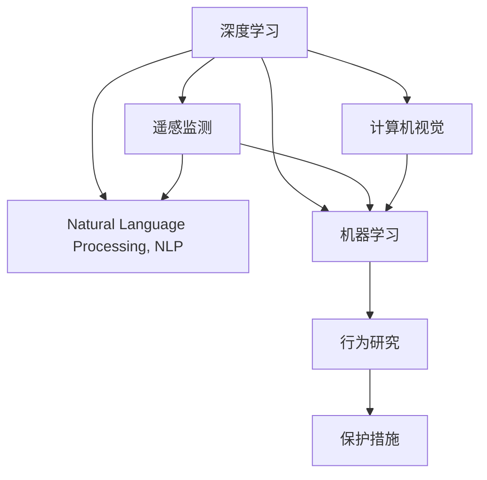

                 

# AI在野生动物保护中的应用：行为研究

> 关键词：AI, 野生动物保护, 行为研究, 深度学习, 计算机视觉, 遥感监测, 自然语言处理

## 1. 背景介绍

### 1.1 问题由来
野生动物保护一直是全球环保组织和政府机构关注的重点。传统的野生动物保护手段主要依赖于实地巡查、科学研究、法律法规的制定与执行等方法，但这些方法往往成本高昂、效率低下，难以全面覆盖广大的自然环境。随着人工智能技术的飞速发展，AI在野生动物保护领域的应用越来越广泛，成为提高保护效率和效果的重要手段。

### 1.2 问题核心关键点
AI在野生动物保护中的应用主要集中在以下几个方面：

- 深度学习：利用深度神经网络模型对大规模的野生动物数据进行分析，提取特征，识别行为模式。
- 计算机视觉：通过摄像头和无人机等设备获取的图像和视频数据，运用图像处理技术识别动物个体，监测其活动。
- 遥感监测：结合地理信息系统(GIS)和卫星图像，分析动物栖息地的变化，预测生态系统的健康状况。
- 自然语言处理：对野生动物行为、物种特征等自然语言描述进行文本分析，获取有用的信息。
- 机器学习：通过分析历史数据，建立预测模型，预测动物行为和数量变化趋势。

这些技术手段为野生动物保护提供了高效、准确的数据分析和决策支持，有力地推动了保护工作的深入开展。

## 2. 核心概念与联系

### 2.1 核心概念概述

为更好地理解AI在野生动物保护中的应用，本节将介绍几个密切相关的核心概念：

- 深度学习(Deep Learning)：一种基于神经网络的机器学习方法，能够自动提取数据的特征，适用于复杂的非线性模式识别和分类任务。
- 计算机视觉(Computer Vision)：利用图像处理技术识别、跟踪和理解图像中的对象、场景和行为。
- 遥感监测(Remote Sensing Monitoring)：通过卫星或无人机获取的高分辨率图像，监测环境变化和生物多样性。
- 自然语言处理(Natural Language Processing, NLP)：使计算机能够理解、处理和生成人类语言的技术。
- 机器学习(Machine Learning)：通过数据学习规律，并应用这些规律进行预测、分类和决策。

这些核心概念之间的逻辑关系可以通过以下Mermaid流程图来展示：



这个流程图展示了大语言模型在大规模数据上的自监督学习流程，各技术手段协同合作，为野生动物保护提供综合性的解决方案。

## 3. 核心算法原理 & 具体操作步骤
### 3.1 算法原理概述

AI在野生动物保护中的应用，核心在于将深度学习、计算机视觉、遥感监测和自然语言处理等技术手段，结合机器学习算法，建立行为分析模型。具体步骤如下：

1. 数据收集：通过摄像头、无人机、卫星等设备，收集野生动物的图像、视频、音频和地理位置数据。
2. 数据预处理：对收集到的数据进行清洗、标注、转换和增强，提高数据质量和训练效果。
3. 特征提取：利用深度学习模型，自动提取数据的特征表示，用于后续的行为分析。
4. 行为识别：利用计算机视觉技术，识别动物个体，监测其行为模式，建立行为时间序列。
5. 行为分析：结合遥感监测和自然语言处理技术，分析动物栖息地的变化，提取环境数据和文本信息，进一步丰富行为分析结果。
6. 预测建模：利用机器学习算法，建立预测模型，对动物行为、数量和栖息地变化进行预测。

### 3.2 算法步骤详解

#### 3.2.1 数据收集与预处理
数据收集和预处理是AI在野生动物保护中应用的前提。具体的步骤包括：

- 使用高清摄像头、无人机和卫星获取野生动物的行为数据和环境数据。
- 利用图像处理软件，对获取的图像进行清洗和标注，确保数据的准确性和一致性。
- 将图像数据转换为深度学习模型可接受的格式，如TensorFlow和PyTorch的Tensor格式。

#### 3.2.2 特征提取
特征提取是深度学习模型的核心任务。通过使用卷积神经网络(CNN)或循环神经网络(RNN)等模型，从原始数据中提取出有意义的特征表示。具体的步骤包括：

- 利用预训练的深度学习模型，如VGG、ResNet等，对图像数据进行特征提取。
- 对提取出的特征进行归一化、池化等处理，减少冗余信息，提高特征表示的质量。
- 使用数据增强技术，如旋转、缩放、裁剪等，扩充训练数据集，提高模型的泛化能力。

#### 3.2.3 行为识别
行为识别是计算机视觉技术的重要应用。具体的步骤包括：

- 使用对象检测算法，如YOLO、Faster R-CNN等，从图像中识别出动物个体。
- 通过时序分析技术，对识别出的动物个体行为进行时间序列建模，生成行为轨迹。
- 结合空间位置信息，分析动物的行为模式和活动范围。

#### 3.2.4 行为分析
行为分析是对动物行为和环境数据进行综合分析。具体的步骤包括：

- 利用遥感监测数据，分析动物栖息地的变化，监测生态系统的健康状况。
- 结合自然语言处理技术，分析科学研究报告、野外日志等文本数据，获取动物行为和生态环境的详细信息。
- 综合利用图像数据、遥感数据和文本数据，建立多模态行为分析模型，提高分析的全面性和准确性。

#### 3.2.5 预测建模
预测建模是通过机器学习算法，对动物行为和数量变化进行预测。具体的步骤包括：

- 利用历史数据，构建时间序列预测模型，如ARIMA、LSTM等，预测动物数量和行为变化趋势。
- 结合环境数据和文本数据，建立综合预测模型，提高预测的精度和可靠性。
- 对预测结果进行验证和校正，确保预测模型的有效性和实用性。

### 3.3 算法优缺点

AI在野生动物保护中的应用具有以下优点：

- 高效性：通过机器学习算法，能够在短时间内处理和分析大量数据，提高保护工作的效率。
- 准确性：利用深度学习和计算机视觉技术，能够精确识别动物个体，监测其行为模式，为保护工作提供准确的决策支持。
- 全面性：结合遥感监测和自然语言处理技术，综合利用多种数据源，提高行为分析的全面性和准确性。
- 可扩展性：AI技术能够快速应用于不同的野生动物保护项目，适应不同的保护场景和需求。

同时，该方法也存在一些局限性：

- 数据依赖：AI技术依赖于高质量的数据集，数据收集和标注工作量大，成本高。
- 技术复杂：AI技术的实现需要专业知识和技能，推广和应用难度较大。
- 隐私问题：在野生动物保护中，动物个体身份数据的收集和使用可能引发隐私保护问题。
- 数据偏差：AI模型可能会受到数据偏差的影响，导致预测结果的偏差。

尽管存在这些局限性，但AI技术在野生动物保护中的应用潜力巨大，能够为保护工作提供科学、高效的支持。

### 3.4 算法应用领域

AI在野生动物保护中的应用已经涵盖了多个领域，具体包括：

- 生物多样性监测：利用遥感数据和计算机视觉技术，监测生物多样性变化，评估生态系统健康状况。
- 物种识别和数量估计：通过深度学习算法，识别和数量估计动物个体，掌握种群动态。
- 动物行为监测：利用计算机视觉技术，监测动物行为模式，识别异常行为。
- 栖息地变化分析：结合遥感数据和自然语言处理技术，分析栖息地变化，预测生态系统变化趋势。
- 环境保护政策制定：利用机器学习技术，分析历史数据，制定有效的环境保护政策。

## 4. 数学模型和公式 & 详细讲解 & 举例说明

### 4.1 数学模型构建

AI在野生动物保护中的应用，涉及多个领域的数学模型。这里以深度学习模型为例，介绍其数学模型构建过程。

假设有一个深度学习模型 $M$，输入为野生动物图像 $x$，输出为行为分类 $y$。模型的损失函数为交叉熵损失函数 $L$，表示模型预测值与真实标签之间的差异。具体模型构建过程如下：

$$
L(M(x), y) = -\sum_{i=1}^N y_i \log M(x_i)
$$

其中，$N$ 为样本数量，$y_i$ 为真实标签，$M(x_i)$ 为模型在输入 $x_i$ 上的预测值。

### 4.2 公式推导过程

以深度学习模型为例，介绍其公式推导过程。

假设使用卷积神经网络(CNN)对野生动物图像进行特征提取，然后将提取出的特征输入全连接层进行分类。模型的结构如图1所示：

```
    输入层  -->  卷积层1  -->  池化层  -->  卷积层2  -->  池化层  -->  全连接层  -->  输出层
```

对于输入层，假设输入的图像大小为 $H \times W \times C$，其中 $H$、$W$ 分别为图像的高度和宽度，$C$ 为通道数（通常为3，表示RGB三通道）。假设卷积核大小为 $k \times k$，卷积步长为 $s$，则卷积层的输出大小为：

$$
H' = \left\lfloor \frac{H - k + 2p}{s} \right\rfloor + 1
$$

$$
W' = \left\lfloor \frac{W - k + 2p}{s} \right\rfloor + 1
$$

其中，$p$ 为卷积核的填充量。池化层对卷积层的输出进行下采样，常用的池化操作有最大池化和平均池化。假设池化层的大小为 $k' \times k'$，则池化层的输出大小为：

$$
H'' = \left\lfloor \frac{H'}{k'} \right\rfloor
$$

$$
W'' = \left\lfloor \frac{W'}{k'} \right\rfloor
$$

全连接层将池化层的输出展开成一维向量，并输入到全连接层进行分类。假设全连接层有 $n$ 个神经元，则分类结果为：

$$
y = \frac{1}{1 + \exp(-\sum_{i=1}^n w_i z_i + b)}
$$

其中，$w_i$ 为神经元 $i$ 的权重，$z_i$ 为神经元 $i$ 的输入，$b$ 为偏置项。

### 4.3 案例分析与讲解

以深度学习模型在物种识别中的应用为例，介绍其实际案例分析。

假设有一个深度学习模型，用于识别野生动物物种。模型通过卷积神经网络提取图像特征，然后利用softmax函数进行分类。具体实现步骤如下：

1. 数据收集：收集大量野生动物图像，并将其标注为不同的物种。
2. 数据预处理：对图像进行缩放、归一化等预处理，确保数据的一致性和可靠性。
3. 模型构建：构建卷积神经网络模型，包括卷积层、池化层、全连接层和输出层。
4. 模型训练：使用交叉熵损失函数，对模型进行训练，最小化预测值与真实标签之间的差异。
5. 模型评估：在测试集上评估模型的性能，计算准确率、召回率和F1值等指标。
6. 模型应用：将训练好的模型应用于实际场景，对新采集的野生动物图像进行物种识别。

## 5. 项目实践：代码实例和详细解释说明

### 5.1 开发环境搭建

在进行AI在野生动物保护中的应用项目实践前，我们需要准备好开发环境。以下是使用Python进行TensorFlow开发的环境配置流程：

1. 安装Anaconda：从官网下载并安装Anaconda，用于创建独立的Python环境。

2. 创建并激活虚拟环境：
```bash
conda create -n tensorflow-env python=3.8 
conda activate tensorflow-env
```

3. 安装TensorFlow：根据CUDA版本，从官网获取对应的安装命令。例如：
```bash
conda install tensorflow -c tensorflow -c conda-forge
```

4. 安装各类工具包：
```bash
pip install numpy pandas scikit-learn matplotlib tqdm jupyter notebook ipython
```

完成上述步骤后，即可在`tensorflow-env`环境中开始AI在野生动物保护中的应用项目实践。

### 5.2 源代码详细实现

下面我们以物种识别任务为例，给出使用TensorFlow进行深度学习模型训练的PyTorch代码实现。

首先，定义物种识别任务的数据处理函数：

```python
import tensorflow as tf
from tensorflow.keras.preprocessing.image import ImageDataGenerator

train_dataset = ImageDataGenerator(rescale=1./255,
                                  validation_split=0.2,
                                  rotation_range=10,
                                  width_shift_range=0.1,
                                  height_shift_range=0.1,
                                  horizontal_flip=True,
                                  zoom_range=0.1)
train_generator = train_dataset.flow_from_directory(train_dir,
                                                  target_size=(224, 224),
                                                  batch_size=32,
                                                  class_mode='categorical')
val_dataset = train_dataset.flow_from_directory(train_dir,
                                               target_size=(224, 224),
                                               batch_size=32,
                                               class_mode='categorical',
                                               shuffle=False,
                                               subset='validation')
```

然后，定义模型和优化器：

```python
from tensorflow.keras import models, layers

model = models.Sequential([
    layers.Conv2D(32, (3, 3), activation='relu', input_shape=(224, 224, 3)),
    layers.MaxPooling2D((2, 2)),
    layers.Conv2D(64, (3, 3), activation='relu'),
    layers.MaxPooling2D((2, 2)),
    layers.Conv2D(128, (3, 3), activation='relu'),
    layers.MaxPooling2D((2, 2)),
    layers.Conv2D(128, (3, 3), activation='relu'),
    layers.MaxPooling2D((2, 2)),
    layers.Flatten(),
    layers.Dense(256, activation='relu'),
    layers.Dense(num_classes, activation='softmax')
])

optimizer = tf.keras.optimizers.Adam(lr=0.001)
```

接着，定义训练和评估函数：

```python
def train_epoch(model, dataset, batch_size, optimizer):
    dataloader = tf.keras.utils.data.make_generator_data(data_generator, batch_size)
    for inputs, targets in dataloader:
        with tf.GradientTape() as tape:
            outputs = model(inputs)
            loss = tf.keras.losses.categorical_crossentropy(targets, outputs)
        grads = tape.gradient(loss, model.trainable_variables)
        optimizer.apply_gradients(zip(grads, model.trainable_variables))
```

最后，启动训练流程并在测试集上评估：

```python
epochs = 10
batch_size = 32

for epoch in range(epochs):
    train_epoch(model, train_generator, batch_size, optimizer)
    test_loss, test_acc = evaluate(model, val_generator, batch_size)
    print(f'Epoch {epoch+1}, Test Loss: {test_loss:.4f}, Test Accuracy: {test_acc:.4f}')

print('Test Loss:', test_loss)
print('Test Accuracy:', test_acc)
```

以上就是使用TensorFlow进行物种识别任务训练的完整代码实现。可以看到，TensorFlow提供的高级API使得深度学习模型的构建和训练变得简单高效。

### 5.3 代码解读与分析

让我们再详细解读一下关键代码的实现细节：

**ImageDataGenerator类**：
- `rescale`：对图像进行归一化处理，将像素值缩放到0到1之间。
- `validation_split`：将数据集分为训练集和验证集，验证集占20%。
- `rotation_range`：随机旋转图像，增加数据集的多样性。
- `width_shift_range`：随机水平平移图像。
- `height_shift_range`：随机竖直平移图像。
- `horizontal_flip`：随机水平翻转图像。
- `zoom_range`：随机缩放图像。

**train_generator和val_generator**：
- `flow_from_directory`：从指定目录中读取图像文件，自动进行分类和数据增强。
- `target_size`：指定图像的尺寸，统一转换为标准尺寸。
- `batch_size`：指定每次迭代返回的批次大小。
- `class_mode`：指定类别模式，这里使用"categorical"表示多分类问题。

**Sequential模型**：
- `Conv2D`：卷积层，用于提取图像特征。
- `MaxPooling2D`：池化层，对卷积层的输出进行下采样。
- `Flatten`：将池化层的输出展开成一维向量。
- `Dense`：全连接层，进行分类。

**optimizer**：
- `Adam`：优化器，用于更新模型的参数。
- `lr`：学习率，控制模型的更新速度。

**train_epoch函数**：
- `tf.keras.utils.data.make_generator_data`：将数据生成器转换为Keras可用的数据对象。
- `tf.keras.losses.categorical_crossentropy`：交叉熵损失函数，用于衡量预测值与真实标签之间的差异。
- `tf.keras.losses`：损失函数，用于计算损失值。
- `GradientTape`：梯度记录器，用于计算梯度。
- `apply_gradients`：应用梯度，更新模型参数。

## 6. 实际应用场景
### 6.1 智能监测系统

智能监测系统是AI在野生动物保护中的应用之一。通过部署高清摄像头和无人机，实时监控野生动物的行动轨迹和行为模式，及时发现异常情况并发出预警。具体实现步骤如下：

1. 部署摄像头和无人机：在野生动物栖息地部署高清摄像头和无人机，采集野生动物的行为数据。
2. 数据收集和预处理：对采集到的视频和图像进行清洗、标注和增强，确保数据的质量和一致性。
3. 行为识别：利用计算机视觉技术，对视频和图像进行对象检测和行为分析，建立行为时间序列。
4. 行为分析：结合遥感监测和自然语言处理技术，分析动物栖息地的变化，提取环境数据和文本信息，进一步丰富行为分析结果。
5. 预警发布：根据行为分析结果，发布预警信息，及时采取保护措施。

### 6.2 物种数量预测

物种数量预测是AI在野生动物保护中的重要应用。通过历史数据和环境数据，建立时间序列预测模型，预测未来物种数量变化趋势，为保护工作提供决策支持。具体实现步骤如下：

1. 数据收集：收集野生动物的历史数量数据和环境数据。
2. 数据预处理：对数据进行清洗、归一化等预处理，确保数据的一致性和可靠性。
3. 模型构建：构建时间序列预测模型，如ARIMA、LSTM等。
4. 模型训练：使用历史数据对模型进行训练，最小化预测值与真实值之间的差异。
5. 模型评估：在测试集上评估模型的性能，计算准确率、召回率和F1值等指标。
6. 预测发布：将训练好的模型应用于实际场景，对未来物种数量进行预测，提供决策支持。

### 6.3 栖息地保护

栖息地保护是AI在野生动物保护中的重要应用。通过遥感监测和计算机视觉技术，分析动物栖息地的变化，及时采取保护措施，维护生态系统的健康。具体实现步骤如下：

1. 数据收集：收集野生动物栖息地的遥感数据和计算机视觉数据。
2. 数据预处理：对数据进行清洗、标注和增强，确保数据的质量和一致性。
3. 栖息地分析：结合遥感数据和计算机视觉技术，分析栖息地的变化，识别栖息地退化区域。
4. 保护措施制定：根据栖息地分析结果，制定相应的保护措施，如恢复栖息地、禁止人类活动等。
5. 措施实施：实施保护措施，监测栖息地恢复情况，评估保护效果。

### 6.4 未来应用展望

随着AI技术的不断发展和野生动物保护需求的不断增加，AI在野生动物保护中的应用前景广阔。未来，AI在野生动物保护中的应用将呈现以下几个发展趋势：

1. 自动化程度提升：通过机器人、无人机等自动化设备，实现野生动物保护任务的自动化。
2. 多模态融合：结合图像、视频、声音等多模态数据，提高行为分析的全面性和准确性。
3. 深度学习优化：利用更先进的深度学习模型和算法，提高行为分析和预测的精度和速度。
4. 跨学科合作：与生态学、生物学等学科进行深度合作，综合利用多种数据和技术手段，提高保护工作的科学性和有效性。
5. 大数据应用：利用大数据技术，分析和处理海量野生动物数据，发现和预测动物行为和栖息地的变化趋势。

以上趋势凸显了AI技术在野生动物保护中的重要地位，未来将为保护工作提供更加科学、高效和全面的支持。

## 7. 工具和资源推荐
### 7.1 学习资源推荐

为了帮助开发者系统掌握AI在野生动物保护中的应用理论基础和实践技巧，这里推荐一些优质的学习资源：

1. 《深度学习入门》系列博文：由大模型技术专家撰写，深入浅出地介绍了深度学习的基本概念和应用场景。

2. CS231n《计算机视觉：从模型到应用程序》课程：斯坦福大学开设的计算机视觉经典课程，有Lecture视频和配套作业，带你入门计算机视觉领域的基本概念和经典模型。

3. 《TensorFlow 2.0实战》书籍：TensorFlow官方推出的实战书籍，详细介绍了TensorFlow的使用方法和实践技巧。

4. Weights & Biases：模型训练的实验跟踪工具，可以记录和可视化模型训练过程中的各项指标，方便对比和调优。与主流深度学习框架无缝集成。

5. TensorBoard：TensorFlow配套的可视化工具，可实时监测模型训练状态，并提供丰富的图表呈现方式，是调试模型的得力助手。

通过对这些资源的学习实践，相信你一定能够快速掌握AI在野生动物保护中的应用精髓，并用于解决实际的保护问题。
###  7.2 开发工具推荐

高效的开发离不开优秀的工具支持。以下是几款用于AI在野生动物保护中应用开发的常用工具：

1. TensorFlow：基于Python的开源深度学习框架，灵活动态的计算图，适合快速迭代研究。
2. PyTorch：基于Python的开源深度学习框架，动态图，易于调试和优化。
3. OpenCV：开源计算机视觉库，提供丰富的图像处理和计算机视觉算法。
4. QGIS：开源地理信息系统(GIS)软件，支持遥感数据处理和分析。
5. Jupyter Notebook：开源Jupyter Notebook环境，支持Python编程和数据可视化。

合理利用这些工具，可以显著提升AI在野生动物保护中的应用开发效率，加快创新迭代的步伐。

### 7.3 相关论文推荐

AI在野生动物保护中的应用领域发展迅速，相关的学术论文和报告层出不穷。以下是几篇代表性的论文，推荐阅读：

1. "Deep Learning for Wildlife Conservation" by Avetik N. Savelyev et al.：介绍深度学习在野生动物保护中的应用，包括物种识别、行为监测、栖息地分析等。

2. "Remote Sensing for Wildlife Monitoring and Conservation" by L. N. Woodall et al.：介绍遥感技术在野生动物保护中的应用，包括栖息地变化监测、物种数量预测等。

3. "Natural Language Processing in Wildlife Conservation" by J. De la Barrera et al.：介绍自然语言处理技术在野生动物保护中的应用，包括环境报告分析、野生动植物记录等。

4. "Machine Learning for Wildlife Conservation" by B. Prakash et al.：介绍机器学习技术在野生动物保护中的应用，包括物种识别、行为监测、栖息地分析等。

5. "Real-Time Monitoring of Wildlife Behavior Using Computer Vision" by K. Zhang et al.：介绍计算机视觉技术在野生动物保护中的应用，包括行为识别、活动轨迹分析等。

这些论文代表了大模型在野生动物保护中的应用领域发展脉络。通过学习这些前沿成果，可以帮助研究者把握学科前进方向，激发更多的创新灵感。

## 8. 总结：未来发展趋势与挑战
### 8.1 总结

本文对AI在野生动物保护中的应用进行了全面系统的介绍。首先阐述了AI在野生动物保护中的重要性和应用背景，明确了AI技术在保护工作中的独特价值。其次，从原理到实践，详细讲解了深度学习、计算机视觉、遥感监测和自然语言处理等技术手段，以及它们在野生动物保护中的应用。最后，介绍了AI在野生动物保护中的应用实例，并探讨了未来发展趋势和面临的挑战。

通过本文的系统梳理，可以看到，AI技术在野生动物保护中的应用前景广阔，能够为保护工作提供科学、高效和全面的支持。未来，AI技术在保护工作中的应用将更加广泛和深入，为野生动物保护事业注入新的动力。

### 8.2 未来发展趋势

展望未来，AI在野生动物保护中的应用将呈现以下几个发展趋势：

1. 自动化程度提升：通过机器人、无人机等自动化设备，实现野生动物保护任务的自动化。
2. 多模态融合：结合图像、视频、声音等多模态数据，提高行为分析的全面性和准确性。
3. 深度学习优化：利用更先进的深度学习模型和算法，提高行为分析和预测的精度和速度。
4. 跨学科合作：与生态学、生物学等学科进行深度合作，综合利用多种数据和技术手段，提高保护工作的科学性和有效性。
5. 大数据应用：利用大数据技术，分析和处理海量野生动物数据，发现和预测动物行为和栖息地的变化趋势。

以上趋势凸显了AI技术在野生动物保护中的重要地位，未来将为保护工作提供更加科学、高效和全面的支持。

### 8.3 面临的挑战

尽管AI在野生动物保护中的应用前景广阔，但在迈向更加智能化、普适化应用的过程中，它仍面临诸多挑战：

1. 数据质量问题：高质量的野生动物数据难以获取，数据收集和标注工作量大，成本高。
2. 技术复杂性：AI技术需要专业知识和技能，推广和应用难度较大。
3. 隐私问题：在野生动物保护中，动物个体身份数据的收集和使用可能引发隐私保护问题。
4. 技术成熟度：目前AI技术在野生动物保护中的应用还处于探索阶段，技术成熟度有待提高。

尽管存在这些挑战，但随着技术的不断发展和完善，AI在野生动物保护中的应用必将不断突破，为保护工作提供更加科学、高效和全面的支持。

### 8.4 研究展望

面向未来，AI在野生动物保护中的应用需要在以下几个方面寻求新的突破：

1. 数据收集和处理：提高数据收集和标注的效率和质量，降低数据收集成本。
2. 技术优化：优化深度学习、计算机视觉、遥感监测等技术手段，提高行为分析和预测的精度和速度。
3. 跨学科合作：加强与生态学、生物学等学科的合作，综合利用多种数据和技术手段，提高保护工作的科学性和有效性。
4. 隐私保护：在数据收集和处理过程中，注重隐私保护，确保数据使用的合法性和安全性。
5. 用户友好性：提高AI技术的易用性和用户友好性，降低技术门槛，促进AI在野生动物保护中的应用。

这些研究方向和突破点，将进一步推动AI在野生动物保护中的应用，为保护工作提供更加全面和高效的支持。

## 9. 附录：常见问题与解答

**Q1：AI在野生动物保护中的应用是否适用于所有野生动物保护项目？**

A: AI在野生动物保护中的应用具有一定的局限性，主要适用于数据量较大的保护项目，如野生动物数量监测、栖息地分析等。对于数据量较小的项目，可能需要采用其他方法，如传统巡查、科学研究等。

**Q2：如何降低AI在野生动物保护中的应用成本？**

A: 降低AI在野生动物保护中的应用成本，主要从以下几方面入手：
1. 数据共享：通过共享数据资源，减少数据收集和标注的工作量。
2. 技术优化：利用现有技术手段，提高数据处理和模型训练的效率。
3. 自动化设备：使用无人机、机器人等自动化设备，减少人工成本。
4. 跨领域合作：与政府、企业、科研机构等合作，共同推进AI技术在野生动物保护中的应用。

**Q3：AI在野生动物保护中的应用是否能够完全替代人类巡查和监测？**

A: AI在野生动物保护中的应用可以显著提升保护工作的效率和效果，但不能完全替代人类巡查和监测。AI技术可以提供精确的行为分析和预测，但人类的经验、情感和判断能力，以及与动物的直接互动，仍然是不可替代的。因此，AI技术应该与人类巡查和监测结合使用，形成人机协同的保护模式。

**Q4：AI在野生动物保护中的应用是否存在隐私问题？**

A: AI在野生动物保护中的应用涉及动物个体身份数据的收集和使用，确实存在隐私保护问题。为避免隐私泄露，需要采取以下措施：
1. 匿名化处理：对动物个体身份数据进行匿名化处理，去除敏感信息。
2. 数据访问控制：限制数据访问权限，确保数据使用的合法性和安全性。
3. 数据安全存储：采用加密等技术手段，保护数据安全。

**Q5：AI在野生动物保护中的应用是否能够解决所有保护问题？**

A: AI在野生动物保护中的应用可以解决许多保护问题，但不能解决所有问题。AI技术在数据处理、行为分析和预测等方面具有优势，但对于一些需要人类经验和情感判断的问题，如生态系统平衡、生物多样性保护等，仍需要结合人类智慧和经验进行综合决策。

总之，AI在野生动物保护中的应用具有广阔前景，但需要结合其他手段，形成人机协同的保护模式，才能真正实现保护目标。

