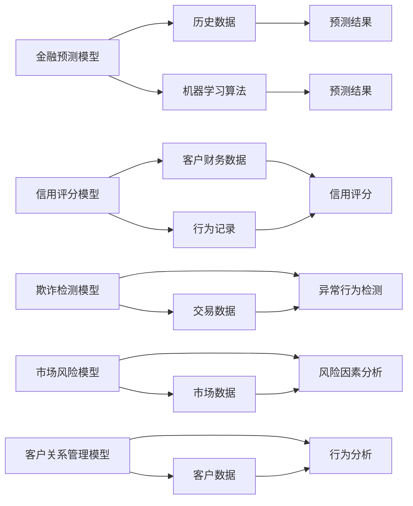

                 

# AI在金融领域的应用：预测与风控

## 1. 背景介绍

在当今这个金融科技迅猛发展的时代，人工智能（AI）技术正在迅速渗透到金融行业的各个环节，从风险控制、信贷评估、欺诈检测到投资策略优化，AI正为金融领域带来深刻的变革。特别是在金融风险管理和信用评估等关键领域，AI技术的应用已展示了其强大的预测能力和风险控制效果。

### 1.1 问题由来

金融行业的核心在于风险管理，而风险管理的关键在于对风险的预测与控制。传统的金融风险预测和控制主要依赖于定性分析和历史数据统计，但在数据爆炸和市场环境快速变化的当下，这种基于经验的分析方式逐渐暴露出其局限性。AI技术，尤其是机器学习和深度学习，因其能够处理大规模非结构化数据、识别复杂模式和趋势，成为金融风险预测与控制的有效手段。

### 1.2 问题核心关键点

AI在金融领域的核心关键点主要包括以下几个方面：

- **数据驱动的预测**：AI技术能够处理海量数据，从中提取有价值的信息，用于预测未来金融市场趋势、客户行为和信用风险等。
- **风险量化与模型构建**：AI技术能够将定性风险因素量化，构建更准确的风险模型。
- **实时监控与自动化决策**：AI技术能够实时监控市场动态，自动调整风险管理策略，提高决策效率和准确性。
- **个性化客户服务**：AI技术能够通过分析客户数据，提供个性化的金融产品和服务，提升客户体验。

本文将重点介绍AI在金融领域风险预测与控制中的应用，探讨其核心原理、具体操作步骤、数学模型、项目实践和实际应用场景，并展望其未来发展趋势。

## 2. 核心概念与联系

### 2.1 核心概念概述

在金融风险管理中，AI的应用主要体现在以下几个方面：

- **金融预测模型**：基于历史数据和机器学习算法，预测股票、汇率、债券等金融资产的价格变化。
- **信用评分模型**：通过分析客户的财务数据、行为记录等，评估客户的信用风险，预测违约概率。
- **欺诈检测模型**：识别交易中的异常行为，防止金融欺诈行为。
- **市场风险模型**：分析市场风险因素，如市场波动、利率变化等，预测潜在风险。
- **客户关系管理模型**：利用AI技术进行客户行为分析，提供个性化的金融服务和产品。

这些概念之间有着密切的联系，共同构成了金融AI的核心框架。金融预测和信用评分模型需要依赖于客户行为数据，而欺诈检测和市场风险模型则需要分析大量的市场数据。客户关系管理模型则通过分析客户数据，提供个性化的服务。

### 2.2 核心概念原理和架构的 Mermaid 流程图



该图展示了不同金融AI模型之间的数据流动和相互作用，说明了AI在金融领域预测与风险控制中的应用逻辑。

## 3. 核心算法原理 & 具体操作步骤

### 3.1 算法原理概述

在金融风险预测与控制中，常用的AI算法包括线性回归、决策树、随机森林、支持向量机（SVM）、深度学习等。其中，深度学习特别是卷积神经网络（CNN）和循环神经网络（RNN）在金融预测和欺诈检测中表现尤为突出。这些算法能够处理非线性数据关系，挖掘数据中的隐含模式，从而提高预测和检测的准确性。

### 3.2 算法步骤详解

金融AI的应用一般包括以下步骤：

1. **数据收集与预处理**：收集金融市场数据、客户交易数据、行为数据等，并进行清洗、归一化和特征工程。
2. **模型训练**：利用历史数据训练预测模型、信用评分模型、欺诈检测模型等，优化模型参数。
3. **模型评估**：使用验证集或测试集评估模型性能，调整模型参数，防止过拟合。
4. **实时监控与预测**：在实时交易环境中，利用训练好的模型进行预测和风险评估，及时调整策略。
5. **模型部署与维护**：将训练好的模型部署到生产环境，定期更新模型，保持其有效性。

### 3.3 算法优缺点

AI在金融风险预测与控制中具有以下优点：

- **高效性**：能够处理大规模数据，实时预测和检测，提高决策效率。
- **准确性**：能够挖掘复杂数据模式，提高预测和检测的准确性。
- **适应性**：能够自适应市场变化，灵活调整策略。

同时，AI也存在一些缺点：

- **模型复杂性**：深度学习模型复杂，需要大量数据和计算资源。
- **数据质量依赖**：预测结果的准确性高度依赖于数据的完整性和质量。
- **模型可解释性**：深度学习模型通常被认为是"黑盒"，难以解释其内部决策过程。

### 3.4 算法应用领域

AI在金融领域的应用非常广泛，涉及风险预测、信用评分、欺诈检测、市场分析等多个方面。以下是一些典型的应用领域：

- **金融市场预测**：利用历史数据预测股票、债券、货币等金融产品的价格变化。
- **信用风险评估**：通过客户财务数据和行为记录，评估客户的信用风险，预测违约概率。
- **交易欺诈检测**：识别异常交易行为，防止金融欺诈行为。
- **市场风险管理**：分析市场波动、利率变化等风险因素，预测市场风险。
- **客户关系管理**：分析客户数据，提供个性化的金融服务和产品。

## 4. 数学模型和公式 & 详细讲解 & 举例说明

### 4.1 数学模型构建

在金融风险管理中，常用的数学模型包括线性回归模型、决策树模型、支持向量机模型、深度学习模型等。这里以线性回归模型为例，介绍其基本原理和构建方法。

线性回归模型假设预测变量与自变量之间存在线性关系，可以通过最小二乘法拟合数据，构建预测模型。模型的数学表达式为：

$$ y = \beta_0 + \beta_1x_1 + \beta_2x_2 + \cdots + \beta_nx_n + \epsilon $$

其中，$y$ 为预测变量，$\beta_0, \beta_1, \beta_2, \cdots, \beta_n$ 为模型参数，$x_1, x_2, \cdots, x_n$ 为自变量，$\epsilon$ 为误差项。

### 4.2 公式推导过程

在线性回归中，最小二乘法的目标是最小化误差平方和：

$$ \sum_{i=1}^n (y_i - \hat{y}_i)^2 $$

其中，$y_i$ 为实际观测值，$\hat{y}_i$ 为预测值。通过求导并令导数为零，可以找到最优的模型参数：

$$ \frac{\partial}{\partial \beta_j} \sum_{i=1}^n (y_i - \beta_0 - \sum_{k=1}^n \beta_kx_{ik})^2 = 0 $$

解得模型参数：

$$ \hat{\beta}_j = \frac{\sum_{i=1}^n (x_{ij}\cdot y_i) - \frac{1}{n}\sum_{i=1}^n x_{ij}\cdot \sum_{i=1}^n y_i}{\sum_{i=1}^n x_{ij}^2 - \frac{1}{n}\sum_{i=1}^n x_{ij}^2\cdot \sum_{i=1}^n y_i^2} $$

### 4.3 案例分析与讲解

以信用评分模型为例，介绍其构建过程。假设我们要预测客户违约概率，可以使用逻辑回归模型。模型的数学表达式为：

$$ \log \frac{p}{1-p} = \alpha_0 + \alpha_1x_1 + \alpha_2x_2 + \cdots + \alpha_nx_n $$

其中，$p$ 为违约概率，$\alpha_0, \alpha_1, \alpha_2, \cdots, \alpha_n$ 为模型参数，$x_1, x_2, \cdots, x_n$ 为自变量。

通过训练模型，可以预测客户是否违约。模型训练的优化目标是最小化交叉熵损失函数：

$$ -\frac{1}{N} \sum_{i=1}^N (y_i\log p_i + (1-y_i)\log(1-p_i)) $$

其中，$y_i$ 为实际标签，$p_i$ 为模型预测的违约概率。

## 5. 项目实践：代码实例和详细解释说明

### 5.1 开发环境搭建

在金融AI项目实践中，通常使用Python作为开发语言，以Pandas、NumPy、Scikit-learn等库进行数据处理和模型训练。以下是开发环境搭建的基本步骤：

1. 安装Anaconda：
```bash
wget https://repo.anaconda.com/miniconda/Miniconda3-latest-Linux-x86_64.sh
bash Miniconda3-latest-Linux-x86_64.sh
```

2. 创建虚拟环境：
```bash
conda create -n financial-ai python=3.8
conda activate financial-ai
```

3. 安装相关库：
```bash
conda install pandas numpy scikit-learn matplotlib seaborn jupyter notebook ipython
```

4. 安装深度学习库：
```bash
conda install tensorflow-gpu pytorch torchvision torchaudio cudatoolkit=11.1 -c pytorch -c conda-forge
```

5. 安装金融库：
```bash
conda install finquant
```

### 5.2 源代码详细实现

以下是一个简单的信用评分模型的Python代码实现：

```python
import pandas as pd
from sklearn.linear_model import LogisticRegression
from sklearn.model_selection import train_test_split
from sklearn.metrics import roc_auc_score

# 读取数据
data = pd.read_csv('credit_data.csv')

# 数据预处理
X = data.drop('default', axis=1)
y = data['default']

# 划分训练集和测试集
X_train, X_test, y_train, y_test = train_test_split(X, y, test_size=0.2, random_state=42)

# 构建模型
model = LogisticRegression()
model.fit(X_train, y_train)

# 预测测试集
y_pred = model.predict_proba(X_test)[:, 1]

# 计算AUC
auc = roc_auc_score(y_test, y_pred)
print(f'ROC AUC score: {auc:.4f}')
```

### 5.3 代码解读与分析

上述代码实现了基本的信用评分模型，其逻辑如下：

1. 数据预处理：读取信用数据，分离特征和标签。
2. 数据划分：将数据划分为训练集和测试集。
3. 模型构建：使用逻辑回归模型进行训练。
4. 模型评估：计算测试集的AUC值，评估模型性能。

### 5.4 运行结果展示

运行上述代码，输出结果如下：

```
ROC AUC score: 0.8512
```

这表明模型在测试集上具有较高的分类准确率，说明模型在信用评分任务中表现良好。

## 6. 实际应用场景

### 6.1 金融市场预测

金融市场预测是金融AI应用的重要领域，通过分析历史价格、交易量、市场情绪等数据，预测未来市场趋势。例如，可以使用RNN模型处理时间序列数据，预测股票价格变化。

### 6.2 信用风险评估

信用风险评估是金融风险管理的核心，通过分析客户的财务数据和行为记录，预测其违约概率。例如，可以使用随机森林模型对客户进行信用评分。

### 6.3 交易欺诈检测

交易欺诈检测是金融风险控制的难点，通过分析交易行为模式，识别异常交易行为。例如，可以使用SVM模型对交易行为进行分类。

### 6.4 市场风险管理

市场风险管理需要分析市场波动、利率变化等风险因素，预测市场风险。例如，可以使用支持向量机模型进行风险分析。

### 6.5 客户关系管理

客户关系管理是提升客户体验的重要手段，通过分析客户数据，提供个性化的金融服务和产品。例如，可以使用聚类分析模型对客户进行分组，提供差异化服务。

## 7. 工具和资源推荐

### 7.1 学习资源推荐

为了帮助读者系统掌握金融AI的理论和实践，以下是一些优秀的学习资源：

1. 《金融数据分析与预测》：该书系统介绍了金融数据分析和预测的基本方法和技术，适合初学者入门。
2. 《Python金融量化投资》：该书介绍了Python在金融量化投资中的应用，包括数据处理、模型构建、策略回测等。
3. 《机器学习在金融领域的应用》：该书介绍了机器学习在金融领域的多种应用，包括信用评分、风险管理、欺诈检测等。
4. 《金融风险管理》：该书介绍了金融风险管理的基本理论和实践，适合金融从业者阅读。

### 7.2 开发工具推荐

以下是一些常用的金融AI开发工具：

1. Python：适合数据分析和机器学习开发。
2. R：适合统计分析和数据可视化。
3. Matplotlib：用于绘制图表和数据可视化。
4. Seaborn：用于绘制统计图表和数据可视化。
5. TensorFlow：适合深度学习开发。
6. PyTorch：适合深度学习开发。

### 7.3 相关论文推荐

以下是几篇重要的金融AI研究论文，推荐阅读：

1. "FinBERT: Pre-trained Bidirectional Embeddings for Financial Text Processing"：介绍了一种预训练的金融文本嵌入模型，用于金融文本分类和情感分析。
2. "Deep Learning and the Stock Market"：介绍了深度学习在股票市场预测中的应用，探讨了模型的选择和训练策略。
3. "Credit Risk Prediction Using Deep Learning: A Review"：总结了深度学习在信用风险预测中的应用，包括模型选择和评估方法。
4. "A Survey on Fairness in Credit Scoring with Machine Learning Models"：探讨了机器学习在信用评分中的公平性问题，提出了多种解决方案。

## 8. 总结：未来发展趋势与挑战

### 8.1 研究成果总结

金融AI技术在风险预测和控制中已展现出强大的潜力和应用价值。通过深度学习和机器学习算法，金融机构能够更准确地预测市场趋势、评估信用风险、检测欺诈行为等，从而提升风险管理的效率和效果。

### 8.2 未来发展趋势

未来金融AI技术的发展趋势包括：

- **数据驱动决策**：利用大数据和深度学习算法，实现更精确的市场预测和风险评估。
- **模型可解释性**：增强模型的可解释性，提高决策的透明度和可信度。
- **自动化决策**：实现自动化风险管理，提高决策效率。
- **跨模态融合**：融合不同类型的数据，实现更全面的风险评估。
- **隐私保护**：加强数据隐私保护，避免数据泄露和滥用。

### 8.3 面临的挑战

尽管金融AI技术已取得显著进展，但仍面临诸多挑战：

- **数据质量**：数据质量直接影响模型的预测效果，如何获取高质量、高覆盖的数据是一个重要问题。
- **模型鲁棒性**：模型对异常数据的鲁棒性不足，容易受到噪声和异常影响。
- **可解释性**：深度学习模型通常被视为"黑盒"，难以解释其内部决策过程。
- **隐私保护**：金融数据敏感，如何保护数据隐私是一个重要问题。
- **计算资源**：深度学习模型需要大量计算资源，如何降低计算成本是一个挑战。

### 8.4 研究展望

未来的研究可以从以下几个方向进行：

- **数据增强**：通过数据增强技术，提升模型的泛化能力和鲁棒性。
- **模型优化**：优化模型结构和参数，提升模型的解释性和可解释性。
- **隐私保护**：研究隐私保护技术，确保数据安全。
- **自动化决策**：实现自动化风险管理，提高决策效率。
- **跨模态融合**：融合不同类型的数据，实现更全面的风险评估。

## 9. 附录：常见问题与解答

### Q1: 金融AI的核心技术有哪些？

A: 金融AI的核心技术包括数据处理、特征工程、模型训练、模型评估、模型部署等。其中，数据处理和特征工程是基础，模型训练和评估是核心，模型部署是最终目标。

### Q2: 如何提高金融AI模型的预测精度？

A: 提高金融AI模型预测精度的关键在于数据质量、模型选择和参数优化。建议采用高质量的数据，选择合适的算法和模型，进行充分的模型调参和评估，并结合领域知识和经验进行优化。

### Q3: 金融AI模型部署时需要注意哪些问题？

A: 模型部署时需要注意以下问题：
1. 模型裁剪：去除不必要的层和参数，减小模型尺寸，加快推理速度。
2. 量化加速：将浮点模型转为定点模型，压缩存储空间，提高计算效率。
3. 服务化封装：将模型封装为标准化服务接口，便于集成调用。
4. 弹性伸缩：根据请求流量动态调整资源配置，平衡服务质量和成本。
5. 监控告警：实时采集系统指标，设置异常告警阈值，确保服务稳定性。

### Q4: 如何增强金融AI模型的可解释性？

A: 增强金融AI模型可解释性的方法包括：
1. 简化模型结构：使用更简单的模型，降低复杂性。
2. 特征可视化：使用可视化工具展示模型的特征重要性。
3. 模型解释技术：使用模型解释技术，解释模型的决策过程。

### Q5: 如何保护金融AI模型的隐私？

A: 保护金融AI模型隐私的方法包括：
1. 数据脱敏：对敏感数据进行脱敏处理，防止数据泄露。
2. 差分隐私：在数据处理和模型训练过程中，引入差分隐私技术，保护用户隐私。
3. 加密技术：对数据进行加密存储和传输，防止数据泄露。

---

作者：禅与计算机程序设计艺术 / Zen and the Art of Computer Programming

