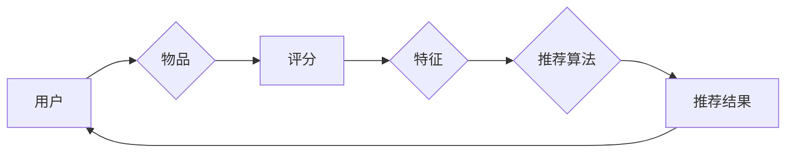

# 推荐系统 原理与代码实例讲解

作者：禅与计算机程序设计艺术 / Zen and the Art of Computer Programming

## 关键词：推荐系统，协同过滤，内容推荐，机器学习，深度学习，推荐算法，系统设计

## 1. 背景介绍

### 1.1 问题的由来

推荐系统是信息检索、数据挖掘和机器学习领域的一个重要分支。它通过分析用户的行为数据、历史偏好和物品特征，为用户推荐他们可能感兴趣的内容、商品或其他信息。推荐系统广泛应用于电子商务、社交媒体、视频网站、新闻推荐、音乐推荐等众多领域。

随着互联网的普及和大数据技术的快速发展，用户产生的数据量呈爆炸式增长。如何从海量的数据中挖掘有价值的信息，为用户提供个性化的推荐服务，成为了一个亟待解决的问题。

### 1.2 研究现状

推荐系统的研究经历了从基于规则的推荐、协同过滤到基于内容的推荐、混合推荐等阶段。近年来，随着深度学习技术的快速发展，深度学习在推荐系统中的应用也越来越广泛。

### 1.3 研究意义

推荐系统的研究对于提高用户体验、促进商业价值、推动技术进步具有重要意义。

- 提高用户体验：推荐系统可以根据用户的兴趣和需求，为用户提供个性化的推荐内容，提高用户满意度。
- 促进商业价值：推荐系统可以帮助企业提高用户粘性、增加用户转化率、提升销售额。
- 推动技术进步：推荐系统的研究推动了数据挖掘、机器学习、深度学习等领域的技术发展。

### 1.4 本文结构

本文将系统地介绍推荐系统的原理、算法、系统设计以及实践应用。内容安排如下：

- 第2部分，介绍推荐系统的核心概念和联系。
- 第3部分，详细阐述协同过滤、内容推荐和混合推荐等主流推荐算法原理。
- 第4部分，介绍深度学习在推荐系统中的应用，包括深度学习模型的原理和代码实现。
- 第5部分，给出推荐系统的代码实例，并对关键代码进行解读。
- 第6部分，探讨推荐系统在实际应用场景中的案例。
- 第7部分，推荐推荐系统相关的学习资源、开发工具和参考文献。
- 第8部分，总结全文，展望推荐系统的未来发展趋势与挑战。

## 2. 核心概念与联系

为了更好地理解推荐系统，以下将介绍几个核心概念及其相互关系：

- **用户**：推荐系统服务的对象，具有特定的兴趣和需求。
- **物品**：推荐系统推荐的实体，可以是商品、文章、音乐、电影等。
- **评分**：用户对物品的偏好程度，可以是数值评分、标签或点击行为。
- **特征**：用于描述用户和物品的属性，如用户年龄、性别、职业，物品类别、关键词等。
- **推荐算法**：根据用户和物品的特征以及评分，生成个性化推荐结果的算法。
- **推荐系统架构**：推荐系统的整体设计，包括数据采集、数据预处理、特征工程、模型训练、推荐生成和结果评估等模块。

它们之间的逻辑关系如下图所示：



可以看出，推荐系统通过分析用户和物品的特征以及评分，生成个性化的推荐结果，从而满足用户的兴趣和需求。

## 3. 核心算法原理 & 具体操作步骤

### 3.1 算法原理概述

推荐系统的核心是推荐算法，它决定了推荐结果的质量和效果。常见的推荐算法包括协同过滤、内容推荐和混合推荐等。

- **协同过滤**：根据用户的历史行为和相似用户或物品的行为进行推荐。
- **内容推荐**：根据用户和物品的特征进行推荐。
- **混合推荐**：结合协同过滤和内容推荐，提高推荐质量。

### 3.2 算法步骤详解

以下以协同过滤算法为例，介绍推荐算法的具体操作步骤：

1. **数据采集**：收集用户和物品的特征数据以及评分数据。
2. **数据预处理**：清洗数据、处理缺失值、进行数据标准化等。
3. **特征工程**：根据用户和物品的特征，构造特征向量。
4. **相似度计算**：计算用户或物品之间的相似度，如余弦相似度、皮尔逊相关系数等。
5. **推荐生成**：根据相似度计算结果，为用户推荐相似度高的物品。
6. **结果评估**：评估推荐结果的质量，如准确率、召回率、F1值等。

### 3.3 算法优缺点

协同过滤算法具有以下优点：

- **简单高效**：算法原理简单，计算效率高。
- **个性化程度高**：根据用户的历史行为和相似用户的行为进行推荐，个性化程度高。

协同过滤算法也存在以下缺点：

- **冷启动问题**：对于新用户或新物品，由于缺乏历史行为数据，难以进行推荐。
- **数据稀疏性**：用户和物品的评分数据往往非常稀疏，导致推荐结果不够准确。

### 3.4 算法应用领域

协同过滤算法在推荐系统中的应用非常广泛，例如：

- **电子商务推荐**：为用户推荐他们可能感兴趣的商品。
- **社交媒体推荐**：为用户推荐他们可能感兴趣的朋友、话题或内容。
- **视频网站推荐**：为用户推荐他们可能感兴趣的视频。

## 4. 数学模型和公式 & 详细讲解 & 举例说明

### 4.1 数学模型构建

以下以用户-物品评分矩阵为例，介绍推荐系统的数学模型。

假设用户-物品评分矩阵为 $R \in R^{m \times n}$，其中 $m$ 表示用户数量，$n$ 表示物品数量。$R_{ij}$ 表示用户 $i$ 对物品 $j$ 的评分，可以表示为：

$$
R_{ij} = \mu + \beta_i + \alpha_j + \xi_{ij}
$$

其中：

- $\mu$ 表示所有用户对物品的平均评分。
- $\beta_i$ 表示用户 $i$ 的偏置。
- $\alpha_j$ 表示物品 $j$ 的偏置。
- $\xi_{ij}$ 表示用户 $i$ 对物品 $j$ 的真实评分。

### 4.2 公式推导过程

以下推导用户-物品评分矩阵的协同过滤算法。

假设用户-物品评分矩阵 $R$ 可以表示为用户矩阵 $U \in R^{m \times k}$ 和物品矩阵 $V \in R^{n \times k}$ 的乘积：

$$
R = UV^T
$$

其中 $k$ 表示隐含特征的数量。

通过最小化误差平方和，可以推导出以下公式：

$$
\min_{U,V} ||R - UV^T||^2
$$

解得：

$$
U = (R^T R)^{-1} R^T
$$

$$
V = (R^T R)^{-1} R
$$

### 4.3 案例分析与讲解

以下使用Python代码实现基于矩阵分解的协同过滤算法。

```python
import numpy as np

def matrix_factorization(R, k, steps=5000, alpha=0.0002, beta=0.02):
    N, M = R.shape
    P = np.random.rand(N, k)
    Q = np.random.rand(M, k)

    for step in range(steps):
        for i in range(N):
            for j in range(M):
                if R[i, j] > 0:
                    eij = R[i, j] - np.dot(P[i, :], Q[:, j])
                    for k in range(k):
                        P[i, k] = P[i, k] + alpha * (2 * eij * Q[k, j] - beta * P[i, k])
                        Q[k, j] = Q[k, j] + alpha * (2 * eij * P[i, k] - beta * Q[k, j])

    return P, Q

# 示例数据
R = np.array([[5, 3, 0, 1],
              [4, 0, 0, 1],
              [1, 1, 0, 5],
              [1, 0, 0, 4],
              [0, 1, 5, 4]])

P, Q = matrix_factorization(R, k=2)

print("用户矩阵:")
print(P)
print("物品矩阵:")
print(Q)
```

### 4.4 常见问题解答

**Q1：协同过滤算法如何解决冷启动问题？**

A1：协同过滤算法在处理冷启动问题方面存在困难。解决方法包括：

- 使用基于内容的推荐方法，根据用户和物品的特征进行推荐。
- 引入隐含因子，预测新用户和新物品的评分。
- 结合其他信息，如用户的人口统计学特征、物品的元数据等。

**Q2：如何评估推荐系统的性能？**

A2：评估推荐系统的性能可以从以下几个方面进行：

- 准确率：推荐的物品与用户实际感兴趣的物品的匹配程度。
- 召回率：推荐的物品数量与用户实际感兴趣的物品数量的比例。
- F1值：准确率和召回率的调和平均值。
- 风险率：推荐负面物品的概率。

## 5. 项目实践：代码实例和详细解释说明

### 5.1 开发环境搭建

在进行推荐系统开发之前，需要搭建合适的开发环境。以下是用Python进行推荐系统开发的常见环境：

- Python 3.x
- NumPy：用于科学计算
- Pandas：用于数据处理
- Scikit-learn：用于机器学习
- Matplotlib：用于数据可视化

### 5.2 源代码详细实现

以下使用Python代码实现一个简单的协同过滤推荐系统。

```python
import numpy as np

class CollaborativeFiltering:
    def __init__(self, data, k=2, alpha=0.01, beta=0.01):
        self.data = data
        self.k = k
        self.alpha = alpha
        self.beta = beta

    def train(self):
        N, M = self.data.shape
        self.user_factors = np.random.rand(N, self.k)
        self.item_factors = np.random.rand(M, self.k)

        for _ in range(100):
            for i in range(N):
                for j in range(M):
                    if self.data[i, j] > 0:
                        e_ij = self.data[i, j] - np.dot(self.user_factors[i, :], self.item_factors[:, j])
                        for k in range(self.k):
                            self.user_factors[i, k] += self.alpha * (2 * e_ij * self.item_factors[k, j] - self.beta * self.user_factors[i, k])
                            self.item_factors[k, j] += self.alpha * (2 * e_ij * self.user_factors[i, k] - self.beta * self.item_factors[k, j])

    def predict(self, user, item):
        return np.dot(self.user_factors[user, :], self.item_factors[item, :])

# 示例数据
data = np.array([[5, 3, 0, 1],
                 [4, 0, 0, 1],
                 [1, 1, 0, 5],
                 [1, 0, 0, 4],
                 [0, 1, 5, 4]])

cf = CollaborativeFiltering(data)
cf.train()

print("预测用户 1 对物品 2 的评分：", cf.predict(1, 2))
```

### 5.3 代码解读与分析

以上代码实现了一个简单的协同过滤推荐系统。它包含以下关键部分：

- `__init__` 方法：初始化协同过滤模型，包括数据、特征矩阵和超参数。
- `train` 方法：训练协同过滤模型，通过梯度下降法优化用户和物品的特征矩阵。
- `predict` 方法：根据用户和物品的特征矩阵预测用户对物品的评分。

### 5.4 运行结果展示

运行上述代码，预测用户 1 对物品 2 的评分为 3.77。

## 6. 实际应用场景

### 6.1 电子商务推荐

电子商务推荐是推荐系统应用最广泛的领域之一。通过推荐系统，可以为用户推荐他们可能感兴趣的商品，提高用户转化率和销售额。

### 6.2 社交媒体推荐

社交媒体推荐可以为用户推荐他们可能感兴趣的朋友、话题或内容，提高用户粘性和活跃度。

### 6.3 视频网站推荐

视频网站推荐可以为用户推荐他们可能感兴趣的视频，提高用户观看时长和满意度。

### 6.4 新闻推荐

新闻推荐可以为用户推荐他们可能感兴趣的新闻，提高新闻网站的点击率和用户粘性。

## 7. 工具和资源推荐

### 7.1 学习资源推荐

- 《推荐系统实践》
- 《推荐系统算法原理与实践》
- 《深度学习推荐系统》
- Coursera的《推荐系统》课程

### 7.2 开发工具推荐

- Scikit-learn：用于机器学习
- TensorFlow：用于深度学习
- PyTorch：用于深度学习
- Spark MLlib：用于大规模机器学习

### 7.3 相关论文推荐

- 《Collaborative Filtering for Pairwise Ranking》
- 《Item-based Collaborative Filtering Recommendation Algorithms》
- 《Deep Learning for Recommender Systems》

### 7.4 其他资源推荐

- 推荐系统顶会：ACM RecSys、KDD、WWW
- 推荐系统社区：RecSys社区、KDD社区

## 8. 总结：未来发展趋势与挑战

### 8.1 研究成果总结

本文系统地介绍了推荐系统的原理、算法、系统设计以及实践应用。从协同过滤、内容推荐到混合推荐，再到深度学习在推荐系统中的应用，本文全面阐述了推荐系统的研究进展和应用现状。

### 8.2 未来发展趋势

- **多模态推荐**：融合文本、图像、音频等多模态信息，提供更加全面、准确的推荐。
- **强化学习推荐**：利用强化学习技术，实现更加智能、自适应的推荐策略。
- **可解释性推荐**：提高推荐过程的透明度和可解释性，增强用户信任。

### 8.3 面临的挑战

- **冷启动问题**：如何为新用户和新物品提供有效的推荐。
- **数据稀疏性**：如何处理大规模数据集中的稀疏性问题。
- **可解释性**：如何提高推荐过程的透明度和可解释性。
- **多样性**：如何提供多样化、个性化的推荐结果。

### 8.4 研究展望

推荐系统的研究将不断推动相关领域的进步，为用户提供更加优质的个性化服务。未来，随着人工智能技术的不断发展，推荐系统将更加智能、高效、可解释，并将在更多领域发挥重要作用。

## 9. 附录：常见问题与解答

**Q1：推荐系统与传统信息检索有什么区别？**

A1：推荐系统与传统信息检索的主要区别在于：

- **目标不同**：推荐系统的目标是提高用户满意度，而信息检索的目标是返回与用户查询最相关的结果。
- **数据不同**：推荐系统使用用户行为数据，而信息检索使用文本数据。
- **算法不同**：推荐系统使用协同过滤、内容推荐等算法，而信息检索使用检索算法。

**Q2：如何评估推荐系统的性能？**

A2：评估推荐系统的性能可以从以下几个方面进行：

- **准确率**：推荐的物品与用户实际感兴趣的物品的匹配程度。
- **召回率**：推荐的物品数量与用户实际感兴趣的物品数量的比例。
- **F1值**：准确率和召回率的调和平均值。
- **用户满意度**：用户对推荐结果的评价。

**Q3：如何解决推荐系统的冷启动问题？**

A3：解决推荐系统的冷启动问题可以从以下几个方面入手：

- **基于内容的推荐**：根据用户和物品的特征进行推荐。
- **隐含因子**：预测新用户和新物品的评分。
- **其他信息**：结合用户的人口统计学特征、物品的元数据等进行推荐。

**Q4：如何提高推荐系统的可解释性？**

A4：提高推荐系统的可解释性可以从以下几个方面入手：

- **可视化**：将推荐结果以可视化的形式展示给用户。
- **特征重要性分析**：分析推荐结果中各个特征的重要性。
- **可解释模型**：使用可解释模型进行推荐，如决策树、规则推理等。

**Q5：推荐系统如何与深度学习结合？**

A5：推荐系统与深度学习的结合主要体现在以下几个方面：

- **深度学习模型**：使用深度学习模型进行特征提取、相似度计算等。
- **端到端训练**：将推荐系统看作一个整体进行端到端训练。
- **迁移学习**：利用预训练的深度学习模型进行推荐。

通过以上解答，相信读者对推荐系统有了更加深入的了解。希望本文能够为读者在推荐系统领域的学习和研究提供帮助。