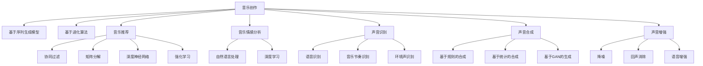

                 

# AI在音乐和声音分析中的应用前景

## 1. 背景介绍

### 1.1 问题由来

音乐和声音作为人类文明的重要组成部分，自古以来就以其独特的魅力影响着人类的情感和文化。随着数字技术的兴起，音乐的创作、演奏、传播和分析都已经发生了深刻变革。AI技术在音乐和声音分析领域的应用，为这些变革提供了强大的推动力。AI可以用于音乐创作、声音识别、音乐推荐、情感分析等众多方面，其潜力和应用前景广阔。

### 1.2 问题核心关键点

AI在音乐和声音分析中的核心问题包括但不限于：

- **音乐创作**：AI如何理解和创作音乐，生成新的旋律、和声和节奏？
- **声音识别**：如何高效准确地识别和分类声音，如语音、音乐、环境声等？
- **音乐推荐**：如何基于用户喜好和行为，推荐个性化的音乐？
- **情感分析**：如何理解音乐中的情感和情绪？
- **声音合成**：如何将文本转化为自然、逼真的语音和音乐？
- **声音增强**：如何增强音乐、语音的质量和清晰度？

这些问题涵盖了音乐和声音分析的各个方面，需要通过AI技术的不同分支（如机器学习、深度学习、自然语言处理等）进行解决。

## 2. 核心概念与联系

### 2.1 核心概念概述

为更好地理解AI在音乐和声音分析中的应用，本节将介绍几个关键概念及其相互联系：

- **音乐创作**：指使用AI算法和工具，创作出具有一定审美价值和情感表达的音乐作品。常见的技术包括基于序列生成模型的音乐创作、基于进化算法的音乐优化等。
- **音乐推荐**：指基于用户的听歌历史、社交网络和行为数据，推荐符合用户喜好的音乐。音乐推荐系统可以采用协同过滤、矩阵分解等算法，以及深度神经网络、强化学习等先进技术。
- **音乐情感分析**：指使用自然语言处理和深度学习技术，分析音乐的节奏、和声、音色等特征，判断音乐的情感倾向，如快乐、悲伤、愤怒等。
- **声音识别**：指将声音信号转换为文本、标签或指令的过程。常见的技术包括语音识别、音乐节奏识别、环境声识别等，涉及声学特征提取、隐马尔可夫模型、卷积神经网络等。
- **声音合成**：指使用AI生成与人类听感接近的语音和音乐。常见的技术包括基于规则的合成、基于统计的合成、基于深度学习的生成对抗网络（GAN）等。
- **声音增强**：指使用信号处理技术，提升音乐、语音等声音信号的质量和可听性。常用的技术包括降噪、回声消除、语音增强等，使用频域滤波、小波变换、深度学习等方法。

这些概念之间的逻辑关系可以通过以下Mermaid流程图来展示：



这个流程图展示了大语言模型在音乐和声音分析中的核心概念及其相互关系：

1. 音乐创作可以基于序列生成模型和进化算法进行。
2. 音乐推荐系统可以采用协同过滤、矩阵分解、深度神经网络和强化学习等算法。
3. 音乐情感分析需要自然语言处理和深度学习技术。
4. 声音识别包括语音识别、音乐节奏识别和环境声识别，涉及不同的模型和算法。
5. 声音合成包括基于规则的合成、基于统计的合成和基于GAN的生成。
6. 声音增强包括降噪、回声消除和语音增强等技术。

这些概念共同构成了AI在音乐和声音分析的应用框架，使得AI技术能够全面渗透到音乐的各个环节。

## 3. 核心算法原理 & 具体操作步骤

### 3.1 算法原理概述

AI在音乐和声音分析中的核心算法原理主要基于机器学习和深度学习技术，这些技术能够从大量数据中学习出复杂的模式和规律，并用于各种应用场景。以下是几个核心的算法原理：

- **序列生成模型**：使用循环神经网络（RNN）、长短时记忆网络（LSTM）、门控循环单元（GRU）等模型，能够处理时序数据，生成音乐旋律、和声、节奏等。
- **协同过滤**：基于用户行为数据，推荐相似用户喜欢的音乐，常用于音乐推荐系统。
- **矩阵分解**：将音乐特征矩阵分解为低维特征向量，用于音乐推荐和音乐特征提取。
- **深度神经网络**：使用多层神经网络对音乐特征进行建模，实现复杂的音乐推荐和情感分析。
- **强化学习**：通过奖励机制训练AI，使其学习出最优的推荐策略。
- **自然语言处理（NLP）**：使用文本挖掘、情感分析等技术，从音乐歌词中提取情感信息。
- **卷积神经网络（CNN）**：用于音乐节奏和环境声的特征提取和分类。
- **生成对抗网络（GAN）**：生成逼真的音乐和语音信号。

### 3.2 算法步骤详解

AI在音乐和声音分析中的具体算法步骤包括但不限于：

**Step 1: 数据准备和预处理**
- 收集音乐和声音数据，包括音频文件、歌词、音乐标签等。
- 对音频进行采样、降噪、分割等预处理。
- 对文本进行分词、情感分析、特征提取等预处理。

**Step 2: 特征提取**
- 使用MFCC、Mel谱图、音高和音色特征等技术，提取音乐和声音的基本特征。
- 使用文本特征提取技术，如TF-IDF、Word2Vec等，提取音乐歌词的语义特征。

**Step 3: 模型训练和优化**
- 使用深度学习模型（如RNN、LSTM、CNN、GAN等）对数据进行建模。
- 使用反向传播算法和梯度下降法等优化算法，更新模型参数。
- 使用交叉验证、早停法等策略，防止过拟合。

**Step 4: 模型评估和测试**
- 在测试集上评估模型性能，如准确率、召回率、F1值等。
- 使用A/B测试、用户反馈等方法，验证模型的实际效果。

**Step 5: 应用部署**
- 将训练好的模型部署到实际应用中，如音乐推荐、情感分析、声音识别等。
- 使用API接口或Web服务，向用户提供音乐推荐、情感分析等服务。

### 3.3 算法优缺点

AI在音乐和声音分析中的算法有以下优缺点：

**优点**：
- 能够处理大量数据，从中学习出复杂的模式和规律。
- 可以用于音乐创作、声音识别、音乐推荐、情感分析等众多应用场景。
- 能够提供高度个性化的推荐和分析服务。

**缺点**：
- 需要大量数据进行训练，数据质量对模型效果有很大影响。
- 模型复杂，训练和推理计算量大。
- 模型的可解释性不足，难以理解内部工作机制。

尽管存在这些局限性，AI在音乐和声音分析中的应用依然具有巨大的潜力和发展前景。

### 3.4 算法应用领域

AI在音乐和声音分析中的应用领域广泛，涵盖了音乐创作、声音识别、音乐推荐、情感分析等多个方面。

**音乐创作**：AI可以用于音乐风格分析、旋律生成、和声设计等，如Google Magenta项目。

**音乐推荐**：AI可以基于用户的听歌历史、社交网络和行为数据，推荐个性化的音乐，如Spotify、Apple Music等平台。

**音乐情感分析**：AI可以分析音乐的节奏、和声、音色等特征，判断音乐的情感倾向，如Amazon Music等平台。

**声音识别**：AI可以识别语音、音乐、环境声等，如Amazon Alexa、Google Assistant等。

**声音合成**：AI可以生成逼真的语音和音乐，如Google WaveNet、Tacotron等。

**声音增强**：AI可以提升音乐、语音等声音信号的质量和清晰度，如Spectral Audio等。

以上应用领域展示了AI在音乐和声音分析中的广泛应用，通过这些技术，AI正在改变音乐和声音领域的面貌。

## 4. 数学模型和公式 & 详细讲解 & 举例说明

### 4.1 数学模型构建

本节将使用数学语言对AI在音乐和声音分析中的应用进行更加严格的刻画。

假设有一个包含$m$个样本的音乐数据集$D=\{(x_i,y_i)\}_{i=1}^m$，其中$x_i$为音乐特征向量，$y_i$为对应的标签（如情感标签）。

定义音乐特征向量$x_i$为$x_i=(x_{i1},x_{i2},...,x_{in})$，其中$x_{ij}$为第$i$个样本的第$j$个特征。

定义情感标签$y_i$为$y_i=y_1,y_2,...,y_k$，其中$y_j=1$表示第$i$个样本的情感为第$j$种。

定义音乐情感分类模型为$f: \mathbb{R}^n \rightarrow \{1,2,...,k\}$，其中$f(x_i)$为第$i$个样本的情感标签。

音乐情感分类模型的损失函数为：

$$
\mathcal{L}(f) = -\frac{1}{m} \sum_{i=1}^m \sum_{j=1}^k y_{ij} \log f(x_i;w)
$$

其中$f(x_i;w)$为使用权重$w$的模型$f(x_i)$对第$i$个样本的情感预测。

### 4.2 公式推导过程

以下我们以音乐情感分类为例，推导损失函数的推导过程。

假设音乐情感分类模型$f$使用多层感知器（MLP），其中包含$L$个隐藏层，每个隐藏层有$n_l$个神经元。

模型的输入为音乐特征向量$x_i$，输出为情感预测向量$y_i$，权重矩阵为$W^{[l]},b^{[l]}$。

则模型的输出为：

$$
f(x_i;w) = g^{(L)}(g^{(L-1)}(...g^{(1)}x_i))
$$

其中$g^{[l]}$为第$l$层的激活函数，如ReLU。

将$y_i$与$f(x_i;w)$比较，得到损失函数$\mathcal{L}(f)$：

$$
\mathcal{L}(f) = -\frac{1}{m} \sum_{i=1}^m \sum_{j=1}^k y_{ij} \log f(x_i;w)
$$

对权重$w$求梯度，得到：

$$
\frac{\partial \mathcal{L}(f)}{\partial w^{[l]}} = -\frac{1}{m} \sum_{i=1}^m \sum_{j=1}^k y_{ij} \frac{\partial \log f(x_i;w)}{\partial x_i} \frac{\partial x_i}{\partial w^{[l]}}
$$

其中$\frac{\partial \log f(x_i;w)}{\partial x_i}$为模型输出对输入的导数，$\frac{\partial x_i}{\partial w^{[l]}}$为输入对权重的导数。

通过反向传播算法，更新权重$w$，最小化损失函数$\mathcal{L}(f)$。

### 4.3 案例分析与讲解

以Amazon Music情感分析为例，通过音乐情感分类模型对用户评论进行情感分析。

假设Amazon Music收集了大量用户评论数据，每条评论包含一段文本和情感标签（如正面、负面、中性）。

在模型训练阶段，将文本转化为数字特征向量，输入到音乐情感分类模型中进行情感预测。使用交叉熵损失函数，更新模型参数。

在模型测试阶段，对新评论进行情感预测，输出情感标签。

具体实现步骤如下：

1. 收集Amazon Music的用户评论数据，将其分为训练集和测试集。
2. 对文本进行分词、去除停用词等预处理。
3. 使用Word2Vec等技术将文本转换为数字特征向量。
4. 使用Keras等深度学习框架，搭建音乐情感分类模型。
5. 使用交叉熵损失函数，训练模型。
6. 在测试集上评估模型性能，如准确率、召回率等。
7. 对新评论进行情感预测，输出情感标签。

通过这个案例，我们可以看到，AI在音乐情感分析中的应用非常直接和高效。

## 5. 项目实践：代码实例和详细解释说明

### 5.1 开发环境搭建

在进行音乐和声音分析的实践前，我们需要准备好开发环境。以下是使用Python进行TensorFlow开发的Python环境配置流程：

1. 安装Anaconda：从官网下载并安装Anaconda，用于创建独立的Python环境。

2. 创建并激活虚拟环境：
```bash
conda create -n tf-env python=3.8 
conda activate tf-env
```

3. 安装TensorFlow：根据CUDA版本，从官网获取对应的安装命令。例如：
```bash
conda install tensorflow -c tf -c conda-forge
```

4. 安装相关库：
```bash
pip install numpy pandas scikit-learn matplotlib
```

完成上述步骤后，即可在`tf-env`环境中开始音乐和声音分析的实践。

### 5.2 源代码详细实现

下面我们以音乐情感分类为例，给出使用TensorFlow对音乐情感分类模型进行训练的代码实现。

```python
import tensorflow as tf
from tensorflow.keras import layers, models
import numpy as np

# 定义音乐情感分类模型
def music_emotion_classifier(input_shape):
    model = models.Sequential()
    model.add(layers.Dense(128, activation='relu', input_shape=input_shape))
    model.add(layers.Dense(64, activation='relu'))
    model.add(layers.Dense(4, activation='softmax')) # 4个情感类别
    return model

# 定义训练函数
def train_model(model, x_train, y_train, x_val, y_val, epochs, batch_size):
    model.compile(optimizer='adam', loss='categorical_crossentropy', metrics=['accuracy'])
    history = model.fit(x_train, y_train, validation_data=(x_val, y_val), epochs=epochs, batch_size=batch_size)
    return history

# 加载数据集
x_train = np.load('x_train.npy')
y_train = np.load('y_train.npy')
x_val = np.load('x_val.npy')
y_val = np.load('y_val.npy')

# 构建音乐情感分类模型
input_shape = x_train.shape[1:]
model = music_emotion_classifier(input_shape)

# 训练模型
history = train_model(model, x_train, y_train, x_val, y_val, epochs=10, batch_size=32)
```

以上就是使用TensorFlow对音乐情感分类模型进行训练的完整代码实现。可以看到，TensorFlow提供了丰富的API接口和组件，可以方便地搭建和训练深度学习模型。

### 5.3 代码解读与分析

让我们再详细解读一下关键代码的实现细节：

**音乐情感分类模型**：
- `music_emotion_classifier`函数：定义音乐情感分类模型，包含2个全连接层和1个输出层。
- `model.add`方法：添加神经网络层。
- `Dense`层：全连接层，包含指定数量的神经元和激活函数。
- `softmax`层：输出层，用于多分类任务。

**训练函数**：
- `train_model`函数：定义模型训练函数，使用交叉熵损失函数和Adam优化器。
- `model.compile`方法：编译模型，指定损失函数、优化器、评估指标等。
- `model.fit`方法：训练模型，指定训练数据、验证数据、轮数、批大小等。
- `history`变量：记录训练过程中的损失和准确率等指标。

**数据加载**：
- 使用`np.load`方法加载训练集和验证集的数据，确保数据格式一致。
- 定义输入形状`input_shape`，与模型中的输入形状相匹配。

可以看到，TensorFlow提供了简洁高效的API，方便开发者快速搭建和训练深度学习模型。

当然，实际的应用中还需要考虑更多因素，如模型的保存和部署、超参数的调整等。但核心的训练流程基本与此类似。

## 6. 实际应用场景

### 6.1 智能音箱

智能音箱是AI在音乐和声音分析中广泛应用的一种设备。用户可以通过语音指令播放音乐、查询音乐信息、设置闹钟等。通过使用音乐情感分类模型，智能音箱能够理解用户的情感，智能推荐音乐，提升用户体验。

在技术实现上，可以收集用户的语音指令和音乐喜好，训练音乐情感分类模型，预测用户的情感状态。基于情感状态，智能音箱可以推荐符合用户情绪的音乐，例如用户感到悲伤时，推荐舒缓的音乐，用户感到兴奋时，推荐快节奏的音乐。

### 6.2 音乐推荐系统

音乐推荐系统是AI在音乐和声音分析中最为常见的应用之一。用户通过浏览、点赞、评论等行为，生成大量的数据，音乐推荐系统可以根据这些数据，推荐符合用户喜好的音乐。

在技术实现上，可以收集用户的行为数据，使用协同过滤、矩阵分解等技术，训练推荐模型。模型可以根据用户的历史行为，预测其对新音乐的喜好，推荐符合用户偏好的音乐。

### 6.3 声音识别

声音识别是AI在音乐和声音分析中另一个重要应用。通过声音识别技术，可以将环境声、语音等声音信号转化为文本、标签或指令，应用于智能家居、客服等领域。

在技术实现上，可以使用卷积神经网络（CNN）、循环神经网络（RNN）等模型，对声音信号进行特征提取和分类。模型可以识别环境声、语音等，转换为文本或标签，应用于智能家居、客服等领域。

### 6.4 未来应用展望

随着AI技术的不断进步，音乐和声音分析的应用前景将更加广阔。以下是几个未来可能的突破方向：

**声音增强**：通过噪声抑制、回声消除等技术，提升音乐和语音的质量，应用于家庭娱乐、医疗诊断等领域。

**音乐生成**：通过生成对抗网络（GAN）等技术，生成逼真的音乐，应用于影视制作、广告创意等领域。

**情感分析**：通过自然语言处理（NLP）等技术，分析音乐歌词、情感标签等，提升音乐和声音的情感表达能力，应用于广告营销、社交媒体等领域。

**跨模态融合**：将音乐、语音、图像等多模态数据进行融合，提升系统的综合分析能力，应用于虚拟现实、智能家居等领域。

以上方向展示了AI在音乐和声音分析中的广阔前景，通过这些技术，AI正在不断拓展其应用范围，提升音乐和声音的智能水平。

## 7. 工具和资源推荐

### 7.1 学习资源推荐

为了帮助开发者系统掌握AI在音乐和声音分析中的应用，这里推荐一些优质的学习资源：

1. Deep Learning for Music and Audio（深度学习在音乐和声音中的应用）：这是一门由Coursera提供的在线课程，涵盖音乐和声音分析的基本概念和经典模型。

2. TensorFlow Music and Audio Tutorial（TensorFlow音乐和声音教程）：这是一个由TensorFlow官方提供的教程，详细介绍了使用TensorFlow进行音乐和声音分析的方法和工具。

3. Music Informatics（音乐信息学）：这是一门由EdX提供的在线课程，涵盖音乐信息学的基本概念和应用，包括音乐创作、情感分析等。

4. JAX Music & Audio Tutorial（JAX音乐和声音教程）：这是一个由JAX社区提供的教程，介绍了使用JAX进行音乐和声音分析的方法和工具。

5. PyTorch Audio Tutorial（PyTorch音频教程）：这是一个由PyTorch官方提供的教程，详细介绍了使用PyTorch进行音频分析的方法和工具。

通过对这些资源的学习实践，相信你一定能够快速掌握AI在音乐和声音分析中的应用，并用于解决实际的NLP问题。

### 7.2 开发工具推荐

高效的开发离不开优秀的工具支持。以下是几款用于音乐和声音分析开发的常用工具：

1. TensorFlow：基于Google的深度学习框架，生产部署方便，适合大规模工程应用。提供了丰富的音乐和声音分析组件。

2. Keras：一个高级的深度学习框架，适合快速搭建和训练深度学习模型。提供了丰富的音乐和声音分析组件。

3. PyTorch：基于Python的深度学习框架，灵活性高，适合研究型应用。提供了丰富的音乐和声音分析组件。

4. JAX：一个基于NumPy的高性能计算库，支持自动微分和并行计算，适合高性能计算。

5. Librosa：一个Python库，用于音频信号处理和特征提取，支持音频数据的加载、处理和分析。

6. Python-Audio-Analysis：一个Python库，用于音频信号处理和特征提取，支持音频数据的加载、处理和分析。

合理利用这些工具，可以显著提升音乐和声音分析任务的开发效率，加快创新迭代的步伐。

### 7.3 相关论文推荐

AI在音乐和声音分析中的应用源于学界的持续研究。以下是几篇奠基性的相关论文，推荐阅读：

1. Deep Audio Signal Processing（深度音频信号处理）：由Lukas Cammerer等撰写，详细介绍了深度学习在音频信号处理中的应用。

2. The Google WaveNet Model（Google WaveNet模型）：由Aurko Roy等撰写，介绍了Google WaveNet模型，用于生成自然、逼真的语音和音乐。

3. Music Transformer: Continuous Melody Generation with Semi-supervised Learning（音乐Transformer：半监督学习的连续旋律生成）：由Zhengjie Xue等撰写，介绍了音乐Transformer模型，用于音乐创作和旋律生成。

4. Fast Speech Recognition in Real-Time on Smartphones Using Transfer Learning（使用迁移学习在智能手机上实现实时语音识别）：由Jiuhong Xiao等撰写，介绍了使用迁移学习在智能手机上实现实时语音识别的方法。

5. Deep Learning for Music Informatics（深度学习在音乐信息学中的应用）：由Jonathan Arackley等撰写，介绍了深度学习在音乐信息学中的应用。

这些论文代表了大语言模型在音乐和声音分析的发展脉络。通过学习这些前沿成果，可以帮助研究者把握学科前进方向，激发更多的创新灵感。

## 8. 总结：未来发展趋势与挑战

### 8.1 总结

本文对AI在音乐和声音分析中的应用进行了全面系统的介绍。首先阐述了AI在音乐和声音分析的研究背景和意义，明确了AI在音乐创作、音乐推荐、音乐情感分析、声音识别、声音合成等领域的独特价值。其次，从原理到实践，详细讲解了音乐和声音分析的数学模型和关键步骤，给出了音乐情感分类的代码实现。同时，本文还广泛探讨了音乐和声音分析在智能音箱、音乐推荐系统、声音识别等多个行业领域的应用前景，展示了AI在音乐和声音分析中的广阔前景。最后，本文精选了音乐和声音分析的各类学习资源，力求为读者提供全方位的技术指引。

通过本文的系统梳理，可以看到，AI在音乐和声音分析中的应用正在不断拓展，AI技术正在深刻改变音乐和声音领域的面貌。AI在音乐创作、音乐推荐、音乐情感分析、声音识别、声音合成等领域的成功应用，展示了其强大的潜力和广泛的应用前景。

### 8.2 未来发展趋势

展望未来，AI在音乐和声音分析将呈现以下几个发展趋势：

1. **技术进步**：随着深度学习、自然语言处理等技术的不断进步，AI在音乐和声音分析中的应用将更加高效和准确。

2. **数据驱动**：越来越多的数据将推动AI在音乐和声音分析中的发展，数据质量和多样性将直接影响模型的效果。

3. **跨模态融合**：将音乐、语音、图像等多模态数据进行融合，提升系统的综合分析能力，应用于虚拟现实、智能家居等领域。

4. **应用拓展**：AI在音乐和声音分析中的应用将扩展到更多领域，如医疗诊断、情感分析等，带来更多的创新应用。

5. **隐私保护**：在音乐和声音分析中，隐私保护将成为一个重要问题，如何在保护隐私的前提下，使用数据进行建模，将是一个需要解决的问题。

以上趋势凸显了AI在音乐和声音分析的广阔前景。这些方向的探索发展，必将进一步提升AI在音乐和声音领域的性能和应用范围，为人类文明的发展注入新的动力。

### 8.3 面临的挑战

尽管AI在音乐和声音分析中取得了显著进展，但在迈向更加智能化、普适化应用的过程中，它仍面临诸多挑战：

1. **数据隐私和安全**：在音乐和声音分析中，如何保护用户的隐私，防止数据泄露，是一个重要问题。

2. **计算资源限制**：AI模型通常需要大量的计算资源进行训练和推理，如何优化模型结构，提升计算效率，是一个需要解决的问题。

3. **可解释性不足**：AI模型通常是一个"黑盒"系统，难以解释其内部工作机制和决策逻辑，这对于音乐和声音分析领域的应用尤其重要。

4. **通用性不足**：AI模型通常只适用于特定的音乐和声音应用场景，如何构建更加通用化的模型，是一个需要解决的问题。

5. **伦理道德问题**：AI在音乐和声音分析中的应用可能涉及伦理道德问题，如版权保护、公平性等，如何构建道德规范，是一个需要解决的问题。

这些挑战将是大语言模型在音乐和声音分析中面临的主要问题，需要学术界和产业界共同努力，才能确保其技术的健康发展。

### 8.4 研究展望

面对AI在音乐和声音分析所面临的挑战，未来的研究需要在以下几个方面寻求新的突破：

1. **隐私保护技术**：开发更好的隐私保护技术，如差分隐私、联邦学习等，在保护用户隐私的前提下，使用数据进行建模。

2. **高效计算技术**：优化模型结构，提升计算效率，如剪枝、量化、分布式训练等，降低计算资源消耗。

3. **可解释性技术**：开发更好的可解释性技术，如可解释模型、可视化技术等，提高模型的可解释性和可理解性。

4. **通用化模型**：构建更加通用化的模型，适应更多的音乐和声音应用场景，如多模态融合、跨领域迁移等。

5. **伦理道德规范**：建立伦理道德规范，确保AI在音乐和声音分析中的应用符合社会价值观和道德标准。

这些研究方向的探索，必将引领AI在音乐和声音分析技术的进一步发展，为音乐和声音领域的智能化和普适化应用提供新的动力。面向未来，AI在音乐和声音分析中的应用需要更加注重技术进步、数据驱动、跨模态融合、应用拓展、隐私保护、计算资源、可解释性、通用性和伦理道德等各个方面的发展，方能真正实现其潜力和价值。

## 9. 附录：常见问题与解答

**Q1：AI在音乐和声音分析中为什么需要使用深度学习技术？**

A: AI在音乐和声音分析中需要使用深度学习技术，因为深度学习能够处理高维、非线性的数据，具备强大的特征提取和建模能力。深度学习模型能够学习到复杂的模式和规律，提升系统的准确性和鲁棒性。

**Q2：AI在音乐和声音分析中常用的深度学习模型有哪些？**

A: AI在音乐和声音分析中常用的深度学习模型包括：

1. 卷积神经网络（CNN）：用于音乐节奏和环境声的特征提取和分类。
2. 循环神经网络（RNN）和长短时记忆网络（LSTM）：用于音乐情感分类、音乐生成等。
3. 生成对抗网络（GAN）：用于音乐生成、语音合成等。
4. 深度信念网络（DBN）：用于音乐情感分类、声音识别等。

**Q3：AI在音乐和声音分析中如何使用迁移学习技术？**

A: 在音乐和声音分析中，可以使用迁移学习技术，将预训练模型应用于特定的音乐和声音任务中。具体步骤如下：

1. 收集音乐和声音数据，进行预处理和特征提取。
2. 选择一个预训练模型，如BERT、ResNet等，使用迁移学习技术，将预训练模型应用于特定的音乐和声音任务中。
3. 在特定任务上微调预训练模型，使用交叉熵损失函数和Adam优化器，训练模型。
4. 在测试集上评估模型性能，如准确率、召回率等。

**Q4：AI在音乐和声音分析中如何使用自然语言处理（NLP）技术？**

A: 在音乐和声音分析中，可以使用自然语言处理（NLP）技术，对音乐歌词、情感标签等进行分析和处理。具体步骤如下：

1. 收集音乐歌词和情感标签，进行预处理和特征提取。
2. 使用自然语言处理技术，如分词、情感分析等，对音乐歌词和情感标签进行处理。
3. 使用深度学习模型，如LSTM、GRU等，对音乐情感进行分类。
4. 在测试集上评估模型性能，如准确率、召回率等。

通过这些技术，AI在音乐和声音分析中的应用将更加高效和准确。

**Q5：AI在音乐和声音分析中如何提升计算效率？**

A: AI在音乐和声音分析中可以使用以下方法提升计算效率：

1. 剪枝：去除不必要的神经元，减小模型规模，提升计算效率。
2. 量化：将浮点数模型转换为定点模型，减小存储空间，提升计算效率。
3. 分布式训练：使用多台机器并行训练，提升计算效率。
4. 模型并行：使用GPU、TPU等硬件加速，提升计算效率。

通过这些方法，可以在保证模型性能的同时，提高计算效率，降低计算资源消耗。

**Q6：AI在音乐和声音分析中如何保护用户隐私？**

A: AI在音乐和声音分析中可以使用以下方法保护用户隐私：

1. 差分隐私：在数据处理过程中，加入噪声，保护用户隐私。
2. 联邦学习：将模型训练分布在多个客户端，保护用户数据隐私。
3. 匿名化处理：将用户数据进行匿名化处理，保护用户隐私。
4. 访问控制：限制用户数据访问权限，保护用户隐私。

通过这些方法，可以在保护用户隐私的前提下，使用数据进行建模，确保数据的安全性和隐私性。

通过这些问题的解答，可以看到，AI在音乐和声音分析中的应用具有广泛的前景，同时也面临着一些挑战。只有通过技术创新和实践探索，才能进一步推动AI在音乐和声音分析中的发展，为人类文明的发展注入新的动力。

---

作者：禅与计算机程序设计艺术 / Zen and the Art of Computer Programming

