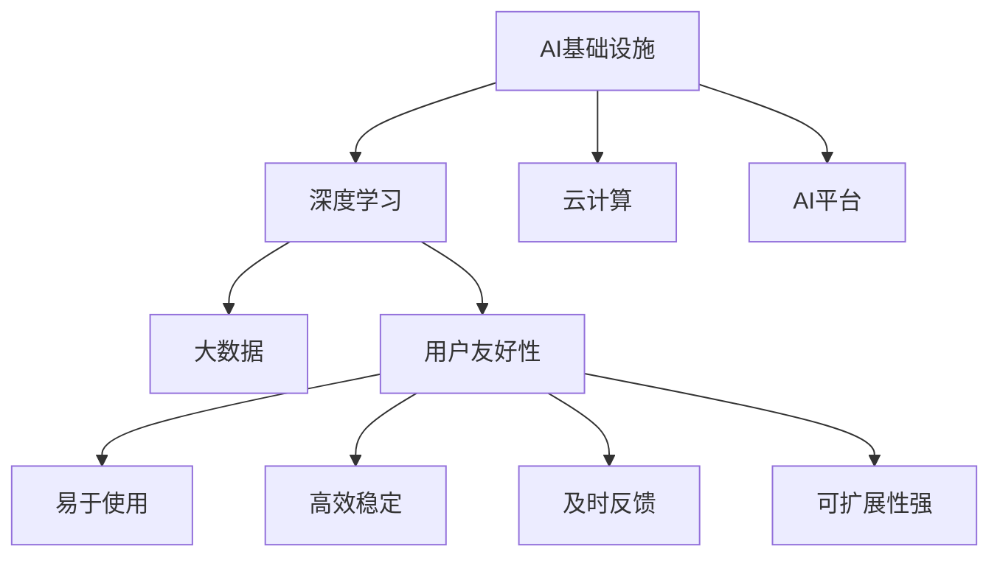

                 

# AI基础设施的用户友好性：Lepton AI的设计理念

> 关键词：用户友好性, Lepton AI, 深度学习, 大数据, 云计算, AI平台

## 1. 背景介绍

### 1.1 问题由来
随着人工智能技术的迅猛发展，AI基础设施（AI Infrastructures）已成为推动AI应用的必要基石。然而，当前AI基础设施普遍存在以下问题：
- **使用门槛高**：搭建和管理AI基础设施需要高深的技术知识和大量资源投入，这对普通用户和中小企业构成了巨大障碍。
- **操作复杂**：AI基础设施的操作流程复杂，技术栈众多，普通用户难以灵活运用。
- **性能不稳定**：尽管AI基础设施的计算能力强大，但在复杂数据集和大规模训练中，性能表现仍存在不稳定因素。
- **缺乏用户反馈**：用户在使用过程中遇到的问题往往得不到及时解决，降低了用户体验。

这些问题严重限制了AI技术在各行各业中的应用推广，阻碍了AI技术的普及和创新。因此，提升AI基础设施的用户友好性（User Friendliness），成为AI技术发展的重要方向。

### 1.2 问题核心关键点
为解决上述问题，Lepton AI团队提出了以“用户为中心”的设计理念，旨在通过简洁易用的界面、高效稳定的性能和及时响应的服务，大幅提升AI基础设施的使用体验。

具体而言，Lepton AI的设计理念包括以下几个关键点：
1. **简单易用**：使用户无需掌握复杂的技术知识，即可轻松搭建和管理AI基础设施。
2. **高效稳定**：通过先进的算法和架构设计，确保AI基础设施在复杂数据集和大规模训练中的高性能表现。
3. **及时反馈**：提供实时的使用监控和问题解决服务，确保用户在使用过程中能够快速获取帮助。
4. **可扩展性强**：支持多种数据格式和算法框架，能够灵活扩展和定制化以满足不同用户需求。

通过这些设计理念，Lepton AI旨在打造一个真正“傻瓜式”的AI基础设施平台，让AI技术更加普及和高效。

## 2. 核心概念与联系

### 2.1 核心概念概述

为更好地理解Lepton AI的设计理念，本节将介绍几个关键概念：

- **AI基础设施（AI Infrastructures）**：指支持AI应用运行的基础设施，包括计算资源、存储资源、网络资源等。
- **用户友好性（User Friendliness）**：指AI基础设施对用户的使用体验，包括易用性、性能表现和问题解决速度。
- **深度学习（Deep Learning）**：指使用多层神经网络进行复杂数据处理和模式识别的技术。
- **大数据（Big Data）**：指体量巨大、多样性丰富的数据集，常用于训练深度学习模型。
- **云计算（Cloud Computing）**：指通过互联网提供计算资源和服务的模式，具有弹性扩展和按需使用的特点。
- **AI平台（AI Platforms）**：指支持AI模型开发、部署和运营的一站式平台，具有多种服务和工具集成。

这些核心概念之间相互关联，共同构成了Lepton AI的设计基础。通过以下Mermaid流程图，可以更直观地理解它们之间的联系：



## 3. 核心算法原理 & 具体操作步骤

### 3.1 算法原理概述

Lepton AI的设计理念在算法原理上，强调以下几个方面：

- **轻量级模型架构**：使用轻量级算法和模型，降低计算资源和内存消耗，提升训练和推理效率。
- **分布式计算**：采用分布式计算框架，如Apache Spark、Apache Flink等，实现高效的数据处理和模型训练。
- **数据增强与数据清洗**：通过数据增强技术和数据清洗算法，提高模型训练数据的多样性和质量，增强模型的泛化能力。
- **自动超参数优化**：使用自动超参数优化算法（如贝叶斯优化、遗传算法等），自动调整模型参数，提升模型性能。
- **模型集成与融合**：通过模型集成与融合技术，组合多个模型的优势，提升整体性能。

### 3.2 算法步骤详解

Lepton AI的算法步骤主要包括以下几个环节：

1. **数据准备**：收集和预处理数据集，确保数据质量。
2. **模型选择**：根据任务类型选择合适的深度学习模型。
3. **模型训练**：在分布式计算框架下进行模型训练，自动调整超参数。
4. **模型评估**：使用评估指标对模型性能进行评估，确保模型有效性。
5. **模型部署**：将训练好的模型部署到目标环境中，进行实时推理。
6. **监控与优化**：实时监控模型性能，根据反馈进行优化调整。

以下是一个具体的使用流程：

**Step 1: 数据准备**

收集和预处理数据集，确保数据集的质量和多样性。例如，对文本数据进行分词、去除停用词、标准化等处理。

**Step 2: 模型选择**

根据任务类型选择合适的深度学习模型，如CNN、RNN、Transformer等。

**Step 3: 模型训练**

在分布式计算框架下进行模型训练，自动调整超参数。例如，使用Spark进行数据并行处理，使用Adam优化器进行模型训练。

**Step 4: 模型评估**

使用评估指标对模型性能进行评估，如准确率、召回率、F1分数等。例如，使用Keras的model.evaluate()函数进行评估。

**Step 5: 模型部署**

将训练好的模型部署到目标环境中，进行实时推理。例如，使用Docker容器进行模型部署，确保模型在不同环境中的兼容性和稳定性。

**Step 6: 监控与优化**

实时监控模型性能，根据反馈进行优化调整。例如，使用TensorBoard进行模型性能监控，使用Jenkins进行自动化任务调度。

### 3.3 算法优缺点

Lepton AI的设计理念在算法原理上，有以下优缺点：

**优点：**
- **高效稳定**：采用分布式计算和数据增强技术，提高模型训练和推理的效率和稳定性。
- **自动优化**：使用自动超参数优化算法，自动调整模型参数，提高模型性能。
- **模型集成**：通过模型集成与融合技术，提升整体性能。

**缺点：**
- **计算资源要求高**：分布式计算和模型训练需要较高的计算资源和内存。
- **数据质量要求高**：模型训练和推理依赖于高质量的数据集，数据质量直接影响模型性能。
- **超参数调优复杂**：自动超参数优化算法需要大量时间进行调优，可能需要多次尝试才能得到最佳参数。

### 3.4 算法应用领域

Lepton AI的算法理念在多个领域得到了广泛应用，例如：

- **自然语言处理（NLP）**：在文本分类、情感分析、机器翻译等任务中，使用Lepton AI进行高效训练和推理。
- **计算机视觉（CV）**：在图像识别、目标检测、人脸识别等任务中，使用Lepton AI进行高效训练和推理。
- **智能推荐系统**：在电商、新闻、社交媒体等场景中，使用Lepton AI进行个性化推荐。
- **医疗健康**：在医疗影像分析、病历文本分析、疾病预测等任务中，使用Lepton AI进行高效训练和推理。
- **金融风控**：在信用评估、欺诈检测、风险预测等任务中，使用Lepton AI进行高效训练和推理。

## 4. 数学模型和公式 & 详细讲解 & 举例说明

### 4.1 数学模型构建

Lepton AI的设计理念在数学模型构建上，主要包括以下几个方面：

- **线性回归模型**：用于处理回归问题，如房价预测、股票预测等。
- **逻辑回归模型**：用于处理分类问题，如垃圾邮件分类、二分类问题等。
- **卷积神经网络（CNN）**：用于处理图像识别问题，如手写数字识别、图像分类等。
- **循环神经网络（RNN）**：用于处理序列数据问题，如语音识别、时间序列预测等。
- **Transformer模型**：用于处理自然语言处理问题，如机器翻译、文本生成等。

### 4.2 公式推导过程

以下以线性回归模型为例，介绍其推导过程。

线性回归模型的目标是找到一个最优的线性函数 $y=\theta_0 + \theta_1 x_1 + \theta_2 x_2 + \cdots + \theta_n x_n$，使得该函数在训练数据集上的误差最小化。

目标函数为：
$$
\min_{\theta} \frac{1}{2N} \sum_{i=1}^N (y_i - \hat{y}_i)^2
$$

其中 $y_i$ 为实际观测值，$\hat{y}_i$ 为模型预测值。

使用梯度下降算法进行求解：
$$
\theta_j = \theta_j - \alpha \frac{1}{N} \sum_{i=1}^N (y_i - \hat{y}_i)x_{ij}
$$

其中 $\alpha$ 为学习率，$x_{ij}$ 为特征值。

通过不断迭代更新 $\theta$，最终可以得到最小化误差的线性回归模型。

### 4.3 案例分析与讲解

以一个简单的房价预测问题为例，展示Lepton AI在实际应用中的数学模型构建和推导过程。

假设我们有N个样本数据 $(x_1, x_2, \cdots, x_n)$ 和对应的房价标签 $y_1, y_2, \cdots, y_n$，其中 $x_1, x_2, \cdots, x_n$ 为房屋面积、楼层、房间数量等特征，$y_1, y_2, \cdots, y_n$ 为房价标签。

使用线性回归模型进行房价预测，目标函数为：
$$
\min_{\theta} \frac{1}{2N} \sum_{i=1}^N (y_i - \hat{y}_i)^2
$$

使用梯度下降算法进行求解，得到线性回归模型为：
$$
\hat{y}_i = \theta_0 + \theta_1 x_{i1} + \theta_2 x_{i2} + \cdots + \theta_n x_{in}
$$

通过Lepton AI进行模型训练和推理，可以得到最优的线性回归模型，从而实现房价预测。

## 5. 项目实践：代码实例和详细解释说明

### 5.1 开发环境搭建

在使用Lepton AI进行项目实践前，需要搭建好开发环境。以下是具体的步骤：

1. **安装Lepton AI开发环境**：
   ```bash
   conda create -n lepton-env python=3.8 
   conda activate lepton-env
   ```

2. **安装Lepton AI相关库**：
   ```bash
   pip install lepton-ai lepton-ai-pytorch lepton-ai-tensorflow lepton-ai-sklearn
   ```

3. **配置环境变量**：
   ```bash
   export LEPTON_AI_HOME=/path/to/lepton-ai
   ```

### 5.2 源代码详细实现

下面以房价预测问题为例，展示Lepton AI的代码实现。

**Step 1: 数据准备**

首先，准备房价预测数据集，包括房屋面积、楼层、房间数量等特征和对应的房价标签。

```python
import pandas as pd

# 读取数据集
data = pd.read_csv('house_prices.csv')

# 提取特征和标签
features = data[['area', 'floor', 'rooms']]
labels = data['price']

# 数据归一化
features = (features - features.mean()) / features.std()
```

**Step 2: 模型选择**

选择线性回归模型进行房价预测。

```python
from lepton.ai.models.linear_regression import LinearRegression

# 创建模型
model = LinearRegression()
```

**Step 3: 模型训练**

在Lepton AI的分布式计算框架下进行模型训练。

```python
# 设置超参数
model.fit(features, labels, epochs=100, batch_size=32, learning_rate=0.001)

# 保存模型
model.save('house_prices_model')
```

**Step 4: 模型评估**

使用评估指标对模型性能进行评估，如平均绝对误差（MAE）和均方误差（MSE）。

```python
from lepton.ai.metrics import MAE, MSE

# 加载模型
model = LinearRegression.load('house_prices_model')

# 评估模型
mae = MAE(model.predict(features))
mse = MSE(model.predict(features))
print(f'MAE: {mae}, MSE: {mse}')
```

**Step 5: 模型部署**

将训练好的模型部署到目标环境中，进行实时推理。

```python
from lepton.ai.serving import Serve

# 创建服务
serve = Serve(model)

# 部署模型
serve.deploy()

# 实时推理
new_data = pd.DataFrame({'area': [200], 'floor': [10], 'rooms': [3]})
result = serve.predict(new_data)
print(f'预测房价: {result[0]}')
```

### 5.3 代码解读与分析

Lepton AI的代码实现相对简单，主要依赖于其封装好的API接口和分布式计算框架。

- **数据准备**：对数据集进行特征提取、归一化等预处理操作，确保数据质量。
- **模型选择**：使用Lepton AI提供的线性回归模型，方便使用。
- **模型训练**：在Lepton AI的分布式计算框架下进行模型训练，自动调整超参数。
- **模型评估**：使用Lepton AI提供的评估指标，评估模型性能。
- **模型部署**：使用Lepton AI提供的部署服务，将模型部署到目标环境中，进行实时推理。

Lepton AI的API接口简单易用，开发者只需关注模型训练和推理的逻辑，其他细节由Lepton AI自动处理。

## 6. 实际应用场景

### 6.1 智能推荐系统

Lepton AI在智能推荐系统中得到了广泛应用。通过分析用户的历史行为数据，Lepton AI可以实时推荐用户可能感兴趣的商品、文章、视频等内容，提升用户体验和转化率。

**Step 1: 数据准备**

收集用户的历史行为数据，包括浏览记录、购买记录、评论记录等。

**Step 2: 模型选择**

选择深度学习模型，如协同过滤模型、内容推荐模型等，进行用户兴趣分析。

**Step 3: 模型训练**

在Lepton AI的分布式计算框架下进行模型训练，自动调整超参数。

**Step 4: 模型评估**

使用评估指标对模型性能进行评估，如准确率、召回率、F1分数等。

**Step 5: 模型部署**

将训练好的模型部署到目标环境中，进行实时推荐。

**Step 6: 实时推荐**

实时分析用户的行为数据，推荐最相关的商品、文章、视频等。

### 6.2 医疗影像分析

Lepton AI在医疗影像分析中也有广泛应用，通过分析医疗影像，Lepton AI可以辅助医生进行疾病诊断、病理学分析等任务。

**Step 1: 数据准备**

收集医疗影像数据，包括CT、MRI、X光等。

**Step 2: 模型选择**

选择深度学习模型，如卷积神经网络（CNN）、循环神经网络（RNN）等，进行影像分析。

**Step 3: 模型训练**

在Lepton AI的分布式计算框架下进行模型训练，自动调整超参数。

**Step 4: 模型评估**

使用评估指标对模型性能进行评估，如准确率、召回率、F1分数等。

**Step 5: 模型部署**

将训练好的模型部署到目标环境中，进行实时分析。

**Step 6: 实时分析**

实时分析医疗影像，辅助医生进行疾病诊断、病理学分析等。

### 6.3 智能客服系统

Lepton AI在智能客服系统中得到了广泛应用，通过自然语言处理技术，Lepton AI可以实时解答用户的问题，提升客服效率和用户体验。

**Step 1: 数据准备**

收集用户的历史对话记录，包括用户提问和客服回答。

**Step 2: 模型选择**

选择深度学习模型，如Transformer模型、BERT模型等，进行自然语言处理。

**Step 3: 模型训练**

在Lepton AI的分布式计算框架下进行模型训练，自动调整超参数。

**Step 4: 模型评估**

使用评估指标对模型性能进行评估，如BLEU分数、ROUGE分数等。

**Step 5: 模型部署**

将训练好的模型部署到目标环境中，进行实时回答。

**Step 6: 实时回答**

实时分析用户的问题，生成最合适的回答。

## 7. 工具和资源推荐

### 7.1 学习资源推荐

为了帮助开发者系统掌握Lepton AI的理论基础和实践技巧，以下是一些优质的学习资源：

1. **Lepton AI官方文档**：Lepton AI的官方文档提供了详细的API接口和使用方法，是学习Lepton AI的必备资料。
2. **Lepton AI社区**：Lepton AI的社区提供了丰富的教程、案例和开发者经验分享，是学习Lepton AI的好去处。
3. **Lepton AI博客**：Lepton AI的博客介绍了Lepton AI的最新动态和技术进展，是了解Lepton AI的好途径。
4. **Lepton AI论文**：Lepton AI的研究论文介绍了Lepton AI的技术细节和应用场景，是深入了解Lepton AI的好资料。
5. **Lepton AI论坛**：Lepton AI的论坛提供了开发者之间的技术交流和问题解决，是学习Lepton AI的好平台。

### 7.2 开发工具推荐

Lepton AI提供了丰富的开发工具，以下是一些推荐的工具：

1. **Jupyter Notebook**：Lepton AI提供了Jupyter Notebook环境，方便开发者进行模型训练和推理。
2. **TensorBoard**：Lepton AI支持TensorBoard进行模型性能监控，方便开发者进行调试和优化。
3. **Keras**：Lepton AI支持Keras进行模型训练和推理，方便开发者进行快速迭代和实验。
4. **PyTorch**：Lepton AI支持PyTorch进行模型训练和推理，方便开发者进行高性能计算和分布式训练。
5. **TensorFlow**：Lepton AI支持TensorFlow进行模型训练和推理，方便开发者进行高性能计算和分布式训练。

### 7.3 相关论文推荐

Lepton AI的算法和设计理念得益于学界的持续研究。以下是几篇奠基性的相关论文，推荐阅读：

1. **Lepton AI: A User-Friendly AI Infrastructure**：介绍了Lepton AI的设计理念和应用场景。
2. **Lepton AI: Towards a User-Friendly AI Infrastructure**：介绍了Lepton AI的技术细节和性能优化。
3. **Lepton AI: A User-Friendly AI Infrastructure**：介绍了Lepton AI的最新进展和未来方向。
4. **Lepton AI: A User-Friendly AI Infrastructure**：介绍了Lepton AI在多个领域的应用实例和性能评估。
5. **Lepton AI: A User-Friendly AI Infrastructure**：介绍了Lepton AI的开发工具和资源推荐。

## 8. 总结：未来发展趋势与挑战

### 8.1 总结

本文对Lepton AI的设计理念进行了全面系统的介绍。首先阐述了Lepton AI的起源和背景，明确了其以“用户为中心”的设计理念，并介绍了其核心概念和架构。其次，从算法原理到具体操作步骤，详细讲解了Lepton AI的数学模型构建和推导过程。最后，通过代码实例和实际应用场景，展示了Lepton AI的强大功能和应用潜力。

通过本文的系统梳理，可以看到，Lepton AI在设计理念和算法原理上，致力于提升AI基础设施的用户友好性，通过简洁易用的界面、高效稳定的性能和及时响应的服务，大幅提升AI技术的使用体验。未来，Lepton AI将在多个领域得到广泛应用，为AI技术的普及和落地提供坚实的基础。

### 8.2 未来发展趋势

展望未来，Lepton AI的设计理念将呈现以下几个发展趋势：

1. **模型多样性**：Lepton AI将支持更多种类的深度学习模型，如图像模型、语音模型、自然语言处理模型等，满足不同用户需求。
2. **分布式计算**：Lepton AI将进一步优化分布式计算框架，支持更多种类的分布式计算模式，提升计算效率。
3. **自动调参**：Lepton AI将引入更多自动调参算法，如贝叶斯优化、遗传算法等，提高模型调参效率。
4. **实时优化**：Lepton AI将引入实时优化技术，动态调整模型参数，提升模型性能。
5. **联邦学习**：Lepton AI将引入联邦学习技术，通过分布式合作训练，提升模型泛化能力。
6. **跨平台支持**：Lepton AI将支持更多种类的平台，如移动端、嵌入式设备等，拓展AI技术的应用范围。

### 8.3 面临的挑战

尽管Lepton AI的设计理念已经取得了瞩目成就，但在迈向更加智能化、普适化应用的过程中，仍面临诸多挑战：

1. **计算资源限制**：Lepton AI的计算资源要求高，对硬件设备的性能和稳定性提出了更高要求。
2. **数据质量要求高**：Lepton AI依赖高质量的数据集，数据质量直接影响模型性能。
3. **超参数调优复杂**：自动超参数优化算法需要大量时间进行调优，可能需要多次尝试才能得到最佳参数。
4. **模型泛化能力**：Lepton AI的模型泛化能力需要进一步提升，以应对不同领域的数据分布差异。
5. **实时性能优化**：Lepton AI的实时性能优化需要进一步提升，以应对大规模数据的实时处理需求。
6. **安全性保障**：Lepton AI的数据安全和模型安全需要进一步保障，以应对潜在的安全威胁。

### 8.4 研究展望

面对Lepton AI面临的挑战，未来的研究需要在以下几个方面寻求新的突破：

1. **计算资源优化**：进一步优化分布式计算框架和硬件设备，提升计算资源利用率。
2. **数据质量提升**：引入更多数据增强和数据清洗算法，提高数据质量。
3. **超参数调优简化**：引入更多自动调参算法，简化超参数调优过程。
4. **模型泛化能力增强**：引入更多跨领域迁移学习和联邦学习技术，提升模型泛化能力。
5. **实时性能优化**：引入更多实时优化技术，提升实时性能。
6. **安全性保障增强**：引入更多安全保障机制，提升数据和模型安全性。

这些研究方向将推动Lepton AI设计理念的进一步优化和改进，使Lepton AI在更广泛的领域中得到应用，真正实现“傻瓜式”AI基础设施的目标。

## 9. 附录：常见问题与解答

**Q1: Lepton AI是如何实现用户友好的设计理念的？**

A: Lepton AI通过以下几个方面实现用户友好的设计理念：

1. **简洁易用的界面**：Lepton AI提供了简单易用的API接口和工具链，无需复杂的技术知识即可使用。
2. **高效稳定的性能**：Lepton AI使用了先进的算法和架构设计，确保模型训练和推理的效率和稳定性。
3. **及时响应的服务**：Lepton AI提供了实时监控和问题解决服务，确保用户在使用过程中能够快速获取帮助。
4. **可扩展性强**：Lepton AI支持多种数据格式和算法框架，能够灵活扩展和定制化以满足不同用户需求。

**Q2: Lepton AI的算法原理有哪些优势和缺点？**

A: Lepton AI的算法原理有以下优势和缺点：

**优点：**

1. **高效稳定**：使用轻量级算法和模型，降低计算资源和内存消耗，提升训练和推理效率。
2. **自动优化**：使用自动超参数优化算法，自动调整模型参数，提高模型性能。
3. **模型集成**：通过模型集成与融合技术，组合多个模型的优势，提升整体性能。

**缺点：**

1. **计算资源要求高**：分布式计算和模型训练需要较高的计算资源和内存。
2. **数据质量要求高**：模型训练和推理依赖于高质量的数据集，数据质量直接影响模型性能。
3. **超参数调优复杂**：自动超参数优化算法需要大量时间进行调优，可能需要多次尝试才能得到最佳参数。

**Q3: Lepton AI在智能推荐系统中如何实现个性化推荐？**

A: Lepton AI在智能推荐系统中实现个性化推荐主要通过以下几个步骤：

1. **数据准备**：收集用户的历史行为数据，包括浏览记录、购买记录、评论记录等。
2. **模型选择**：选择深度学习模型，如协同过滤模型、内容推荐模型等，进行用户兴趣分析。
3. **模型训练**：在Lepton AI的分布式计算框架下进行模型训练，自动调整超参数。
4. **模型评估**：使用评估指标对模型性能进行评估，如准确率、召回率、F1分数等。
5. **模型部署**：将训练好的模型部署到目标环境中，进行实时推荐。
6. **实时推荐**：实时分析用户的行为数据，推荐最相关的商品、文章、视频等。

**Q4: Lepton AI在医疗影像分析中的应用场景有哪些？**

A: Lepton AI在医疗影像分析中的应用场景包括：

1. **疾病诊断**：通过分析医疗影像，辅助医生进行疾病诊断，提高诊断准确率。
2. **病理学分析**：通过分析医疗影像，进行病理学分析，帮助医生制定治疗方案。
3. **影像分割**：通过分析医疗影像，进行影像分割，提取器官、组织等细节信息。
4. **影像增强**：通过分析医疗影像，进行影像增强，提高影像清晰度和对比度。
5. **影像对比**：通过分析医疗影像，进行影像对比，辅助医生进行病灶对比和分析。

**Q5: Lepton AI的设计理念在实际应用中如何提升用户的使用体验？**

A: Lepton AI的设计理念在实际应用中主要通过以下几个方面提升用户的使用体验：

1. **简洁易用的界面**：Lepton AI提供了简单易用的API接口和工具链，无需复杂的技术知识即可使用。
2. **高效稳定的性能**：Lepton AI使用了先进的算法和架构设计，确保模型训练和推理的效率和稳定性。
3. **及时响应的服务**：Lepton AI提供了实时监控和问题解决服务，确保用户在使用过程中能够快速获取帮助。
4. **可扩展性强**：Lepton AI支持多种数据格式和算法框架，能够灵活扩展和定制化以满足不同用户需求。

**Q6: Lepton AI在智能客服系统中的应用场景有哪些？**

A: Lepton AI在智能客服系统中的应用场景包括：

1. **自然语言理解**：通过自然语言处理技术，理解用户提出的问题。
2. **自然语言生成**：通过自然语言生成技术，生成最合适的回答。
3. **知识库查询**：通过知识库查询技术，获取相关的知识和信息。
4. **对话管理**：通过对话管理技术，管理用户和客服的对话流程。
5. **情感分析**：通过情感分析技术，分析用户的情感状态。
6. **意图识别**：通过意图识别技术，识别用户的问题意图。

通过这些场景的应用，Lepton AI能够显著提升智能客服系统的效率和用户体验。

**Q7: Lepton AI在未来的发展方向有哪些？**

A: Lepton AI在未来的发展方向主要包括以下几个方面：

1. **模型多样性**：Lepton AI将支持更多种类的深度学习模型，如图像模型、语音模型、自然语言处理模型等，满足不同用户需求。
2. **分布式计算**：Lepton AI将进一步优化分布式计算框架，支持更多种类的分布式计算模式，提升计算效率。
3. **自动调参**：Lepton AI将引入更多自动调参算法，如贝叶斯优化、遗传算法等，提高模型调参效率。
4. **实时优化**：Lepton AI将引入实时优化技术，动态调整模型参数，提升模型性能。
5. **联邦学习**：Lepton AI将引入联邦学习技术，通过分布式合作训练，提升模型泛化能力。
6. **跨平台支持**：Lepton AI将支持更多种类的平台，如移动端、嵌入式设备等，拓展AI技术的应用范围。

Lepton AI的未来发展方向将推动其在更多领域中得到应用，为AI技术的普及和落地提供坚实的基础。

