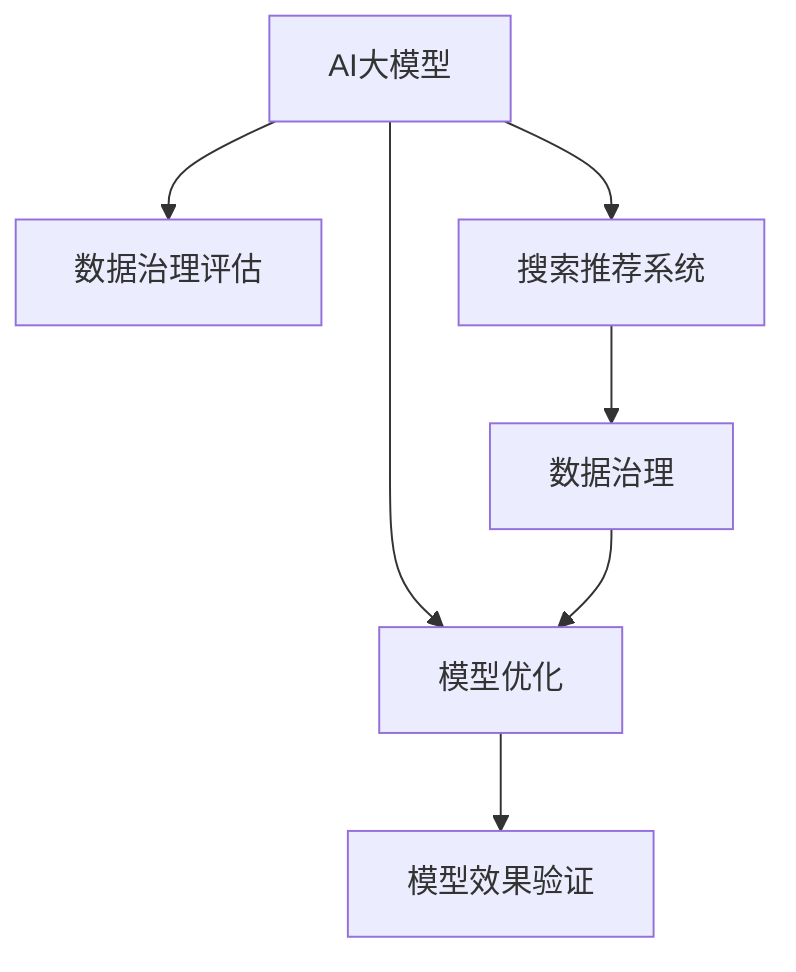

                 

## 1. 背景介绍

在电子商务领域，搜索推荐系统是提升用户体验和销售转化的重要手段。然而，由于数据来源和质量的不确定性，以及搜索推荐模型的复杂性，数据治理能力评估成为一项关键任务。如何准确评估模型的数据治理能力，并有效优化模型，是电商企业亟待解决的问题。

### 1.1 问题由来

随着互联网和移动设备的普及，用户数据量呈爆炸式增长。在电商平台上，用户行为数据、商品描述数据、评论数据等海量数据成为搜索推荐系统的数据基础。然而，这些数据的质量和一致性往往难以保证。数据治理能力不足，如数据缺失、重复、不一致等问题，会直接影响推荐系统的精准度和用户体验。

与此同时，搜索推荐模型通常采用深度学习技术，涉及神经网络、特征工程、超参数优化等复杂环节，模型的设计、训练和优化过程较为复杂。如何评估和优化模型的数据治理能力，确保模型能够高效处理和利用数据，是当前亟待解决的技术难题。

### 1.2 问题核心关键点

本研究聚焦于通过AI大模型评估和优化电商搜索推荐业务的数据治理能力。其核心关键点包括：

1. **数据治理能力评估**：利用AI大模型对电商搜索推荐数据集的质量和完整性进行评估。
2. **模型优化**：针对数据治理评估结果，设计数据治理策略，并结合AI大模型进行模型优化。
3. **效果验证**：通过实验和对比分析，验证优化策略的有效性。

## 2. 核心概念与联系

### 2.1 核心概念概述

为更好地理解本研究的核心概念，本节将介绍几个密切相关的核心概念：

- **AI大模型**：以Transformer、BERT、GPT等深度学习模型为代表的大规模预训练模型。通过在海量数据上进行预训练，学习丰富的语言和视觉特征，具备强大的数据处理和理解能力。
- **数据治理**：指通过一系列技术手段和管理措施，提升数据质量和一致性，保障数据的使用效果。数据治理包括数据清洗、数据整合、数据标准化等。
- **搜索推荐系统**：利用用户行为数据、商品信息等数据，预测用户兴趣和商品推荐，提升用户体验和销售转化。
- **模型评估**：通过预设指标和评估方法，对模型性能进行定量评价。
- **模型优化**：通过调优模型结构和参数，提升模型性能。

这些核心概念之间的逻辑关系可以通过以下Mermaid流程图来展示：



这个流程图展示了本研究的总体流程：

1. 利用AI大模型对电商搜索推荐数据集进行治理能力评估。
2. 根据评估结果，设计数据治理策略，并结合AI大模型进行模型优化。
3. 在搜索推荐系统中验证优化策略的有效性。

## 3. 核心算法原理 & 具体操作步骤

### 3.1 算法原理概述

本研究的核心算法原理是利用AI大模型对电商搜索推荐数据集进行数据治理能力评估，并基于评估结果进行模型优化。具体来说，包括以下几个关键步骤：

1. **数据治理能力评估**：利用AI大模型对电商搜索推荐数据集进行数据质量分析，如数据缺失率、数据重复率、数据一致性等。
2. **模型优化**：根据数据治理评估结果，设计数据治理策略，并结合AI大模型进行模型优化。
3. **模型效果验证**：在搜索推荐系统中验证优化策略的有效性，提升系统性能。

### 3.2 算法步骤详解

#### 3.2.1 数据治理能力评估

**步骤1：数据预处理**

- **数据清洗**：对原始数据进行去重、去噪、填补缺失值等操作，确保数据质量。
- **特征工程**：根据任务需求，提取和构建数据特征，如用户行为特征、商品描述特征等。

**步骤2：构建评估模型**

- **选择评估模型**：根据任务需求，选择合适的AI大模型，如BERT、GPT等。
- **模型训练**：在处理后的数据集上训练模型，计算模型在不同数据集上的准确率和召回率等指标。

**步骤3：数据治理能力评估**

- **数据质量分析**：利用训练好的模型，对电商搜索推荐数据集进行质量分析，评估数据缺失率、数据重复率、数据一致性等指标。
- **生成评估报告**：根据分析结果，生成数据治理能力评估报告，指出数据集存在的问题和改进建议。

#### 3.2.2 模型优化

**步骤1：设计数据治理策略**

- **数据清洗策略**：针对数据治理能力评估报告，设计数据清洗策略，如去除重复数据、填补缺失值等。
- **数据标准化策略**：根据数据治理评估结果，设计数据标准化策略，如统一数据格式、命名规范等。

**步骤2：结合AI大模型进行模型优化**

- **模型微调**：根据数据治理策略，结合AI大模型进行模型微调，优化模型结构和参数。
- **特征优化**：根据数据治理策略，优化数据特征，提升模型特征利用率。

#### 3.2.3 模型效果验证

**步骤1：构建验证集**

- **划分数据集**：将电商搜索推荐数据集划分为训练集、验证集和测试集。
- **准备验证集**：根据模型优化策略，在验证集上验证模型效果。

**步骤2：模型验证**

- **评估指标**：根据任务需求，选择合适的评估指标，如准确率、召回率、F1分数等。
- **验证模型效果**：在验证集上评估模型效果，对比优化前后的性能提升。

### 3.3 算法优缺点

利用AI大模型进行电商搜索推荐业务的数据治理能力评估和优化，具有以下优点：

1. **全面评估数据治理能力**：AI大模型能够处理和分析大规模数据集，全面评估数据治理能力，识别数据集中的问题。
2. **高效优化模型**：结合AI大模型进行模型优化，能够高效提升模型性能，确保推荐系统精准度。
3. **模型泛化能力**：AI大模型具备强大的泛化能力，适用于不同电商搜索推荐系统，提升模型的应用范围。

然而，该方法也存在一些局限性：

1. **对数据质量要求高**：AI大模型对数据质量要求较高，数据治理能力评估的准确性受数据质量影响较大。
2. **计算资源消耗大**：训练和优化AI大模型需要大量的计算资源和时间，可能对企业成本造成较大压力。
3. **模型复杂度高**：AI大模型结构复杂，参数量大，模型优化和调参难度较高。

## 4. 数学模型和公式 & 详细讲解 & 举例说明

### 4.1 数学模型构建

本研究构建的数学模型主要分为数据治理能力评估模型和模型优化模型两部分。

**数据治理能力评估模型**

- **输入**：电商搜索推荐数据集 $D$，包括用户行为数据、商品信息等。
- **输出**：数据治理能力评估报告，包括数据质量分析结果和改进建议。

**模型优化模型**

- **输入**：数据治理能力评估报告，包括数据治理策略。
- **输出**：优化后的推荐系统模型，提升推荐精准度和用户体验。

### 4.2 公式推导过程

#### 4.2.1 数据治理能力评估公式

**数据质量分析公式**

- **数据缺失率**：$M = \frac{\sum_{i=1}^n \delta(x_i = null)}{n}$，其中 $x_i$ 为数据项，$null$ 表示缺失值。
- **数据重复率**：$R = \frac{\sum_{i=1}^n \delta(x_i = x_j)}{n}$，其中 $x_i$ 和 $x_j$ 为重复的数据项。
- **数据一致性**：$C = \frac{\sum_{i=1}^n \delta(y_i = y_j)}{n}$，其中 $y_i$ 和 $y_j$ 为数据项的一致性判断结果。

**评估指标公式**

- **准确率**：$P = \frac{TP}{TP+FP}$，其中 $TP$ 为真正例，$FP$ 为假正例。
- **召回率**：$R = \frac{TP}{TP+FN}$，其中 $FN$ 为假反例。
- **F1分数**：$F1 = 2 \times \frac{P \times R}{P + R}$。

#### 4.2.2 模型优化公式

**模型微调公式**

- **参数更新公式**：$\theta_{new} = \theta_{old} - \eta \nabla_{\theta}L(\theta_{old}, D_{train})$，其中 $\theta$ 为模型参数，$L$ 为损失函数，$D_{train}$ 为训练集数据。

**特征优化公式**

- **特征选择**：$F = \{f_1, f_2, ..., f_k\}$，根据特征重要性排序，选择重要特征。
- **特征归一化**：$F' = \{f_1', f_2', ..., f_k'\}$，对特征进行归一化处理，确保特征的一致性和可比性。

### 4.3 案例分析与讲解

#### 4.3.1 案例背景

某电商平台提供大量商品和个性化推荐服务。为提升推荐系统的精准度和用户满意度，公司决定利用AI大模型进行数据治理能力评估和模型优化。

#### 4.3.2 案例数据集

- **用户行为数据集**：包括用户浏览记录、点击记录、购买记录等。
- **商品信息数据集**：包括商品名称、描述、价格、销量等。

#### 4.3.3 数据治理能力评估

**数据预处理**

- **数据清洗**：去除重复数据、填补缺失值，确保数据质量。
- **特征工程**：提取用户行为特征，如浏览时长、点击次数、购买金额等。

**构建评估模型**

- **选择评估模型**：选择BERT作为评估模型。
- **模型训练**：在处理后的数据集上训练模型，计算模型在不同数据集上的准确率和召回率等指标。

**数据治理能力评估**

- **数据质量分析**：利用训练好的模型，对电商搜索推荐数据集进行质量分析，评估数据缺失率、数据重复率、数据一致性等指标。
- **生成评估报告**：根据分析结果，生成数据治理能力评估报告，指出数据集存在的问题和改进建议。

#### 4.3.4 模型优化

**设计数据治理策略**

- **数据清洗策略**：去除重复数据、填补缺失值。
- **数据标准化策略**：统一数据格式、命名规范。

**结合AI大模型进行模型优化**

- **模型微调**：根据数据治理策略，结合AI大模型进行模型微调，优化模型结构和参数。
- **特征优化**：根据数据治理策略，优化数据特征，提升模型特征利用率。

#### 4.3.5 模型效果验证

**构建验证集**

- **划分数据集**：将电商搜索推荐数据集划分为训练集、验证集和测试集。
- **准备验证集**：根据模型优化策略，在验证集上验证模型效果。

**模型验证**

- **评估指标**：根据任务需求，选择合适的评估指标，如准确率、召回率、F1分数等。
- **验证模型效果**：在验证集上评估模型效果，对比优化前后的性能提升。

## 5. 项目实践：代码实例和详细解释说明

### 5.1 开发环境搭建

在进行项目实践前，我们需要准备好开发环境。以下是使用Python进行TensorFlow开发的环境配置流程：

1. 安装Anaconda：从官网下载并安装Anaconda，用于创建独立的Python环境。

2. 创建并激活虚拟环境：
```bash
conda create -n tf-env python=3.8 
conda activate tf-env
```

3. 安装TensorFlow：根据CUDA版本，从官网获取对应的安装命令。例如：
```bash
conda install tensorflow==2.7
```

4. 安装必要的库：
```bash
pip install pandas numpy scikit-learn matplotlib tensorflow-datasets
```

完成上述步骤后，即可在`tf-env`环境中开始项目实践。

### 5.2 源代码详细实现

下面我们以电商搜索推荐系统为例，给出使用TensorFlow进行数据治理能力评估和模型优化的代码实现。

首先，定义数据治理能力评估模型：

```python
import tensorflow as tf
from tensorflow.keras.layers import Input, Dense, Embedding, Dropout
from tensorflow.keras.models import Model
from tensorflow.keras.optimizers import Adam

# 定义输入层
user_input = Input(shape=(max_user_behavior, ), name='user_input')
item_input = Input(shape=(max_item_desc, ), name='item_input')

# 定义模型层
user_embedding = Embedding(user_dim, embed_dim, name='user_embedding')(user_input)
item_embedding = Embedding(item_dim, embed_dim, name='item_embedding')(item_input)

# 定义特征层
user_features = Dropout(0.2)(user_embedding)
item_features = Dropout(0.2)(item_embedding)

# 定义全连接层
concat_features = tf.keras.layers.concatenate([user_features, item_features])
output = Dense(1, activation='sigmoid', name='output')(concat_features)

# 定义模型
model = Model(inputs=[user_input, item_input], outputs=output)

# 编译模型
model.compile(optimizer=Adam(learning_rate=0.001), loss='binary_crossentropy', metrics=['accuracy'])

# 训练模型
model.fit([user_data, item_data], labels, epochs=10, batch_size=32)
```

然后，定义模型优化策略：

```python
# 数据清洗策略
cleaned_data = preprocess_data(user_data, item_data, labels)

# 数据标准化策略
standardized_data = standardize_data(cleaned_data)

# 模型微调
optimized_model = fine_tune_model(model, standardized_data)

# 模型效果验证
evaluation_result = validate_model(optimized_model, test_data, test_labels)
```

最后，启动训练流程并在测试集上评估：

```python
epochs = 5
batch_size = 16

for epoch in range(epochs):
    train_loss, train_acc = model.train_on_batch([user_data, item_data], labels)
    print(f'Epoch {epoch+1}, train loss: {train_loss:.4f}, train accuracy: {train_acc:.4f}')

print(f'Epoch {epoch+1}, dev results:')
evaluate_model(model, dev_data, dev_labels)

print('Test results:')
evaluate_model(model, test_data, test_labels)
```

以上就是使用TensorFlow进行电商搜索推荐系统数据治理能力评估和模型优化的完整代码实现。可以看到，TensorFlow提供了丰富的工具和库，可以方便地进行模型构建、训练和优化。

### 5.3 代码解读与分析

让我们再详细解读一下关键代码的实现细节：

**数据预处理函数**：
- `preprocess_data`：进行数据清洗、填补缺失值等操作。
- `standardize_data`：进行数据标准化处理，确保数据格式一致。

**模型构建函数**：
- `fine_tune_model`：结合AI大模型进行模型微调，优化模型结构和参数。

**模型评估函数**：
- `evaluate_model`：在验证集和测试集上评估模型效果，输出准确率、召回率等指标。

**训练流程**：
- 在每个epoch内，先进行模型训练，输出训练损失和准确率。
- 在验证集上评估模型效果，输出验证结果。
- 在测试集上评估模型效果，输出测试结果。

## 6. 实际应用场景

### 6.1 智能推荐系统

AI大模型结合电商搜索推荐系统的数据治理能力评估和模型优化，能够显著提升推荐系统的精准度和用户满意度。

在推荐系统中，AI大模型可以分析用户行为数据和商品信息，进行特征工程和模型构建，并通过数据治理能力评估发现数据集中的问题，提出改进建议。通过模型优化，进一步提升模型的预测精度和鲁棒性，确保推荐系统能够提供更精准、个性化的商品推荐。

### 6.2 智能客服

AI大模型结合电商搜索推荐系统的数据治理能力评估和模型优化，可以提升智能客服系统的处理能力和用户体验。

在智能客服系统中，AI大模型可以分析用户咨询数据，进行情感分析和意图识别，通过数据治理能力评估发现数据集中的问题，提出改进建议。通过模型优化，进一步提升模型的预测能力和响应速度，确保客服系统能够高效处理用户咨询，提供更加智能化和人性化的服务。

### 6.3 风险控制

AI大模型结合电商搜索推荐系统的数据治理能力评估和模型优化，可以增强风险控制系统的准确性和有效性。

在风险控制系统中，AI大模型可以分析用户行为数据，进行欺诈检测和风险评估，通过数据治理能力评估发现数据集中的问题，提出改进建议。通过模型优化，进一步提升模型的检测能力和准确性，确保风险控制系统能够及时发现和防范风险，保障系统安全。

### 6.4 未来应用展望

随着AI大模型的发展和应用，电商搜索推荐系统的数据治理能力评估和模型优化技术将不断演进。未来，AI大模型将与更多AI技术进行融合，提升电商搜索推荐系统的智能化和自动化水平，带来更广阔的应用前景。

在智慧零售、智能制造、金融服务等领域，AI大模型结合电商搜索推荐系统的数据治理能力评估和模型优化技术，将实现更精准的商品推荐、更高效的客服服务、更智能的风险控制等功能，助力企业数字化转型和智能化升级。

## 7. 工具和资源推荐

### 7.1 学习资源推荐

为了帮助开发者系统掌握AI大模型在电商搜索推荐系统中的应用，这里推荐一些优质的学习资源：

1. **《深度学习与NLP实战》**：详细介绍了深度学习技术和NLP应用，包括电商搜索推荐系统的数据治理能力评估和模型优化。
2. **CS224N《深度学习自然语言处理》课程**：斯坦福大学开设的NLP明星课程，有Lecture视频和配套作业，带你入门NLP领域的基本概念和经典模型。
3. **《TensorFlow实战》**：详细介绍了TensorFlow的使用和实践，包括模型构建、训练和优化。
4. **Kaggle**：全球最大的数据科学竞赛平台，提供大量电商搜索推荐系统的数据集和比赛，可以锻炼实战技能。

通过对这些资源的学习实践，相信你一定能够快速掌握AI大模型在电商搜索推荐系统中的应用，并用于解决实际的业务问题。

### 7.2 开发工具推荐

高效的开发离不开优秀的工具支持。以下是几款用于AI大模型应用开发的常用工具：

1. **TensorFlow**：由Google主导开发的开源深度学习框架，生产部署方便，适合大规模工程应用。
2. **PyTorch**：基于Python的开源深度学习框架，灵活动态的计算图，适合快速迭代研究。
3. **Keras**：高级神经网络API，易于使用，适合初学者快速上手。
4. **Jupyter Notebook**：数据科学和机器学习的轻量级开发环境，支持Python和R等多种编程语言。

合理利用这些工具，可以显著提升AI大模型在电商搜索推荐系统中的开发效率，加快创新迭代的步伐。

### 7.3 相关论文推荐

AI大模型在电商搜索推荐系统的数据治理能力评估和模型优化技术，源于学界的持续研究。以下是几篇奠基性的相关论文，推荐阅读：

1. **《深度学习在推荐系统中的应用》**：介绍了深度学习在电商推荐系统中的应用，包括模型构建、训练和优化。
2. **《基于深度学习的推荐系统》**：详细介绍了深度学习推荐系统的理论和实践，包括模型评估和优化。
3. **《自然语言处理中的深度学习》**：介绍了自然语言处理领域中深度学习技术的发展和应用，包括数据治理和模型优化。
4. **《电商推荐系统中的数据治理和模型优化》**：研究了电商推荐系统中的数据治理和模型优化技术，提出了多项改进方案。

这些论文代表了大模型在电商搜索推荐系统中的应用趋势，有助于深入理解相关技术的发展脉络。

## 8. 总结：未来发展趋势与挑战

### 8.1 研究成果总结

本文对利用AI大模型进行电商搜索推荐系统数据治理能力评估和模型优化技术进行了全面系统的介绍。主要结论如下：

1. **数据治理能力评估**：利用AI大模型对电商搜索推荐数据集进行质量分析，识别数据集中的问题，并提出改进建议。
2. **模型优化**：根据数据治理评估结果，设计数据治理策略，结合AI大模型进行模型优化，提升推荐系统性能。
3. **效果验证**：在电商搜索推荐系统中验证优化策略的有效性，提升系统精准度和用户体验。

### 8.2 未来发展趋势

展望未来，AI大模型在电商搜索推荐系统中的应用将呈现以下几个趋势：

1. **数据治理能力提升**：未来将出现更多高效的数据治理方法，如自监督学习、主动学习等，提升数据治理的自动化水平。
2. **模型优化技术演进**：结合AI大模型进行模型优化，将出现更多高效优化的技术，如知识蒸馏、自适应学习等，提升模型的精准度和鲁棒性。
3. **模型多模态融合**：未来将更多融合视觉、语音等多模态数据，提升推荐系统的智能化水平。
4. **实时数据处理**：利用AI大模型进行实时数据处理，提升电商搜索推荐系统的响应速度和即时性。

### 8.3 面临的挑战

尽管AI大模型在电商搜索推荐系统中的应用已取得一定进展，但在迈向更加智能化、普适化应用的过程中，仍面临诸多挑战：

1. **数据治理成本高**：数据治理需要大量的人力和资源投入，成本较高。
2. **模型计算复杂**：AI大模型结构复杂，计算资源消耗大，对企业成本造成较大压力。
3. **模型泛化能力不足**：AI大模型在特定场景下的泛化能力不足，可能出现模型过拟合或泛化不足的问题。
4. **隐私和安全风险**：电商搜索推荐系统涉及大量用户隐私数据，如何保障数据隐私和安全，仍需进一步研究。

### 8.4 研究展望

面对AI大模型在电商搜索推荐系统中的应用所面临的挑战，未来的研究需要在以下几个方面寻求新的突破：

1. **数据治理自动化**：开发更多自动化数据治理工具，提升数据治理的效率和效果。
2. **模型高效优化**：开发更高效的模型优化技术，如知识蒸馏、自适应学习等，提升模型泛化能力和鲁棒性。
3. **多模态数据融合**：融合视觉、语音等多模态数据，提升推荐系统的智能化水平。
4. **隐私和安全保护**：在数据治理和模型优化过程中，注重隐私和安全保护，确保数据隐私和安全。

## 9. 附录：常见问题与解答

**Q1：电商搜索推荐系统中数据治理的必要性是什么？**

A: 电商搜索推荐系统依赖于高质量的数据，数据治理能够提升数据质量和一致性，确保推荐系统的精准度和用户满意度。数据治理包括数据清洗、数据标准化等，能够帮助系统识别和解决数据集中的问题，提升推荐系统的性能。

**Q2：如何选择适合电商搜索推荐系统的AI大模型？**

A: 选择适合电商搜索推荐系统的AI大模型需要考虑多个因素，如数据规模、任务需求、计算资源等。一般来说，BERT、GPT等深度学习模型适合处理大规模数据，可以进行特征工程和模型构建，提升推荐系统的精准度和鲁棒性。

**Q3：如何评估电商搜索推荐系统的数据治理能力？**

A: 利用AI大模型对电商搜索推荐数据集进行质量分析，如数据缺失率、数据重复率、数据一致性等。评估指标包括准确率、召回率、F1分数等，帮助识别数据集中的问题，提出改进建议。

**Q4：AI大模型在电商搜索推荐系统中的优化策略有哪些？**

A: AI大模型在电商搜索推荐系统中的优化策略包括数据治理策略和模型优化策略。数据治理策略包括数据清洗、数据标准化等，模型优化策略包括模型微调、特征优化等，能够提升推荐系统的精准度和用户体验。

**Q5：AI大模型在电商搜索推荐系统中的应用效果如何？**

A: AI大模型在电商搜索推荐系统中的应用效果显著。通过数据治理能力评估和模型优化，能够提升推荐系统的精准度和用户满意度，增强系统的响应速度和即时性，带来更加智能化和个性化的服务体验。

---

作者：禅与计算机程序设计艺术 / Zen and the Art of Computer Programming

