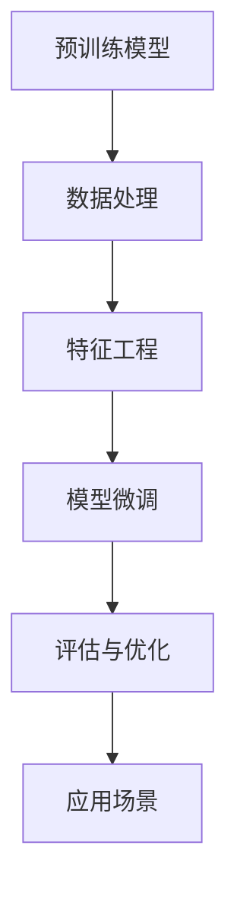

                 

## 1. 背景介绍

### 1.1 问题由来

在电商领域，商品关联分析一直是提升用户体验和销售转化的重要手段。传统的关联分析方法依赖人工经验，不仅耗时耗力，还难以处理大规模商品数据。近年来，随着深度学习和大规模预训练模型的兴起，基于AI的关联分析方法逐渐进入视野，成为电商智能化的新趋势。

AI大模型，如BERT、GPT等，经过海量文本数据的预训练，蕴含了丰富的语义知识和先验信息，具备强大的自然语言处理能力。本文将探索如何利用AI大模型在商品关联分析中的应用，提升电商平台的推荐和搜索精度，优化用户体验和销售效果。

### 1.2 问题核心关键点

基于AI大模型的商品关联分析方法，主要包括以下几个关键点：

- 预训练模型选择：选择合适的预训练模型，是利用AI大模型进行商品关联分析的第一步。

- 数据处理与特征工程：将电商数据转换为模型可接受的格式，并进行特征提取和编码。

- 模型训练与微调：利用电商数据对预训练模型进行微调，学习商品间的语义关联。

- 评估与优化：对微调后的模型进行评估，并根据实际效果进行优化调整。

- 应用场景构建：将微调后的模型应用于商品推荐、搜索结果排序、广告投放等电商场景，提升用户体验和转化率。

通过深入研究这些核心关键点，可以构建基于AI大模型的商品关联分析系统，为电商平台带来显著的商业价值。

### 1.3 问题研究意义

利用AI大模型进行商品关联分析，能够带来以下几个方面的提升：

1. **提高推荐准确度**：AI大模型能够学习到商品间的语义关系，提升商品推荐的准确度和个性化程度。

2. **增强搜索精度**：利用模型对查询语句进行语义理解，提高搜索结果的相关性和召回率。

3. **优化广告投放**：基于商品间的关联关系，对广告进行精准投放，提高广告点击率和转化率。

4. **提升用户体验**：AI大模型可以处理复杂的自然语言查询，提升用户的搜索体验和满意度。

5. **驱动销售增长**：通过精准的推荐和搜索，提升用户购买意愿，增加销售额。

## 2. 核心概念与联系

### 2.1 核心概念概述

- **预训练模型**：通过大量无标签数据进行预训练的深度学习模型，如BERT、GPT等。

- **商品关联分析**：分析商品之间的语义和功能关联，以推荐、搜索和广告投放等为目标，提升电商平台的用户体验和销售转化。

- **自然语言处理(NLP)**：利用AI技术处理和分析自然语言文本，提取其中的有用信息。

- **模型微调**：在预训练模型的基础上，利用有标签数据进行微调，学习特定任务的知识。

- **迁移学习**：利用预训练模型在通用任务上的学习，迁移到特定任务中进行微调。

- **推荐系统**：基于用户行为和商品属性，推荐用户可能感兴趣的商品。

- **搜索引擎**：基于用户查询，检索出最相关的商品信息，进行展示和排序。

这些核心概念通过以下Mermaid流程图进行联系：



该流程图展示了从预训练模型到商品关联分析应用的整个流程。

## 3. 核心算法原理 & 具体操作步骤

### 3.1 算法原理概述

基于AI大模型的商品关联分析方法，主要基于预训练模型和迁移学习原理，利用商品描述、用户行为等数据，对预训练模型进行微调，学习商品之间的语义关联。核心步骤如下：

1. 准备电商商品数据集，包括商品描述、用户评分、点击行为等。
2. 将商品数据转换为模型可接受的格式，如将商品描述进行分词和编码。
3. 选择合适的预训练模型，如BERT、GPT等，进行微调。
4. 利用电商数据集对微调后的模型进行训练，学习商品之间的关联关系。
5. 在训练过程中，对模型进行评估和优化，调整超参数，提升模型效果。
6. 将优化后的模型应用于商品推荐、搜索结果排序等场景，提升用户体验和销售转化。

### 3.2 算法步骤详解

#### 3.2.1 数据预处理与特征工程

1. **数据清洗**：去除缺失值、异常值和噪声，确保数据质量。
2. **分词与编码**：将商品描述和用户评论等文本数据进行分词和编码，转换为模型可接受的格式。
3. **特征提取**：使用词嵌入、TF-IDF等方法，提取商品和用户的特征向量。
4. **数据划分**：将数据划分为训练集、验证集和测试集。

#### 3.2.2 模型选择与微调

1. **选择预训练模型**：选择适合电商领域的预训练模型，如BERT、GPT等。
2. **模型微调**：在微调过程中，通常只微调顶层分类器或解码器，以固定大部分预训练权重。
3. **损失函数设计**：根据任务需求设计损失函数，如交叉熵损失、均方误差损失等。
4. **优化器选择**：选择合适的优化器，如Adam、SGD等，设置学习率和批大小。
5. **超参数调优**：根据训练集和验证集的表现，调整超参数，如正则化强度、Dropout率等。

#### 3.2.3 模型训练与评估

1. **模型训练**：使用训练集数据进行模型训练，最小化损失函数。
2. **模型评估**：在验证集上评估模型效果，选择性能最优的模型。
3. **模型优化**：根据验证集的表现，调整模型结构和超参数，优化模型性能。
4. **模型测试**：在测试集上测试模型效果，评估模型的泛化能力。

#### 3.2.4 应用场景构建

1. **商品推荐**：将微调后的模型应用于商品推荐系统，根据用户行为和商品属性，推荐相关商品。
2. **搜索结果排序**：利用模型对查询语句进行语义理解，优化搜索结果的排序。
3. **广告投放**：基于商品之间的关联关系，对广告进行精准投放，提高广告点击率和转化率。

### 3.3 算法优缺点

#### 3.3.1 优点

1. **准确度高**：AI大模型能够学习到商品间的语义关联，提高推荐和搜索的准确度。
2. **可扩展性强**：模型可以通过增加训练数据和优化超参数，不断提高性能。
3. **适应性强**：模型可以适应不同规模和类型的电商数据，具有较强的通用性。

#### 3.3.2 缺点

1. **数据依赖性高**：模型的效果依赖于电商数据的质量和数量，标注数据成本较高。
2. **计算资源需求大**：模型微调和训练需要高性能计算资源，对硬件要求较高。
3. **泛化能力有限**：模型对于未见过的商品关联可能无法很好地泛化。
4. **解释性不足**：模型的决策过程较难解释，难以理解其内部工作机制。

### 3.4 算法应用领域

基于AI大模型的商品关联分析方法，可以应用于以下几个电商场景：

1. **商品推荐**：根据用户行为和商品属性，推荐相关商品，提升用户体验和购买意愿。
2. **搜索结果排序**：优化搜索结果的排序，提高用户满意度。
3. **广告投放**：对广告进行精准投放，提高广告点击率和转化率。
4. **库存管理**：分析商品之间的关联关系，优化库存管理，减少库存积压。
5. **用户画像**：基于用户行为和商品关联，构建用户画像，提升个性化推荐效果。

## 4. 数学模型和公式 & 详细讲解

### 4.1 数学模型构建

假设电商商品数据集为 $D=\{(x_i,y_i)\}_{i=1}^N$，其中 $x_i$ 为商品描述或用户评论，$y_i$ 为标签，如点击次数、购买次数等。我们希望利用AI大模型 $M_{\theta}$ 学习商品之间的语义关联，构建推荐模型 $f(x)$，使得 $f(x)$ 在商品 $x$ 上的预测值最大化，即：

$$ \max_{\theta} \sum_{i=1}^N f(x_i)y_i $$

其中，$f(x)$ 为模型 $M_{\theta}$ 在商品 $x$ 上的输出，表示商品 $x$ 与用户行为的相关度。

### 4.2 公式推导过程

为了计算商品 $x$ 与用户行为的相关度 $f(x)$，我们首先对商品 $x$ 进行编码，得到编码向量 $z_x$。然后，利用预训练模型 $M_{\theta}$ 对商品 $x$ 的编码向量 $z_x$ 进行处理，得到表示商品 $x$ 与用户行为的语义向量 $h_x$。最后，通过线性回归或分类任务，将语义向量 $h_x$ 映射为模型输出 $f(x)$。具体公式如下：

$$ z_x = \text{Embedding}(x) $$
$$ h_x = M_{\theta}(z_x) $$
$$ f(x) = \text{Linear}(h_x) \text{或} \text{Sigmoid}(h_x) $$

在训练过程中，我们最小化模型在训练集 $D$ 上的损失函数 $L$：

$$ L = -\sum_{i=1}^N \log f(x_i)y_i $$

使用梯度下降等优化算法，不断调整模型参数 $\theta$，最小化损失函数 $L$，最终得到优化后的模型 $M_{\hat{\theta}}$。

### 4.3 案例分析与讲解

#### 4.3.1 商品推荐

在商品推荐场景中，我们需要构建推荐模型 $f(x)$，使得推荐商品 $x_i$ 与用户行为 $y_i$ 的相关度最大化。

**示例数据**：

假设我们有一个电商商品数据集，包含商品描述和用户评分数据。商品 $x_1$ 的描述为 "高质量的运动鞋"，商品 $x_2$ 的描述为 "新款耳机"，用户对商品 $x_1$ 的评分为 4 分，对商品 $x_2$ 的评分为 3 分。

**步骤**：

1. **数据预处理**：对商品描述进行分词和编码，得到向量 $z_1$ 和 $z_2$。
2. **模型微调**：将预训练模型 $M_{\theta}$ 作为初始化参数，在训练集 $D$ 上进行微调。
3. **模型评估**：在验证集上评估模型效果，选择性能最优的模型。
4. **推荐生成**：使用优化后的模型 $M_{\hat{\theta}}$ 预测商品 $x_1$ 和 $x_2$ 的相关度，生成推荐结果。

**代码实现**：

```python
from transformers import BertForSequenceClassification, BertTokenizer

# 数据预处理
tokenizer = BertTokenizer.from_pretrained('bert-base-uncased')
encoded_train_data = tokenizer(train_data, padding='max_length', truncation=True, max_length=128, return_tensors='pt')
encoded_valid_data = tokenizer(valid_data, padding='max_length', truncation=True, max_length=128, return_tensors='pt')
encoded_test_data = tokenizer(test_data, padding='max_length', truncation=True, max_length=128, return_tensors='pt')

# 模型微调
model = BertForSequenceClassification.from_pretrained('bert-base-uncased')
device = 'cuda' if torch.cuda.is_available() else 'cpu'
model.to(device)
optimizer = AdamW(model.parameters(), lr=1e-5)
loss_fn = nn.CrossEntropyLoss()

# 模型训练
model.train()
for epoch in range(num_epochs):
    optimizer.zero_grad()
    inputs = encoded_train_data.to(device)
    labels = train_labels.to(device)
    outputs = model(inputs.input_ids, attention_mask=inputs.attention_mask, labels=labels)
    loss = loss_fn(outputs.logits, labels)
    loss.backward()
    optimizer.step()

# 模型评估
model.eval()
with torch.no_grad():
    val_outputs = model(encoded_valid_data.input_ids.to(device), attention_mask=encoded_valid_data.attention_mask.to(device))
    val_loss = loss_fn(val_outputs.logits, valid_labels.to(device))
    val_acc = accuracy(val_outputs.logits, valid_labels.to(device))

# 推荐生成
inputs = encoded_item.to(device)
outputs = model(inputs.input_ids, attention_mask=inputs.attention_mask)
recommended_items = output[0].argmax(dim=1).tolist()
```

## 5. 项目实践：代码实例和详细解释说明

### 5.1 开发环境搭建

在进行AI大模型在商品关联分析中的应用开发前，我们需要准备好开发环境。以下是使用Python进行PyTorch开发的环境配置流程：

1. 安装Anaconda：从官网下载并安装Anaconda，用于创建独立的Python环境。

2. 创建并激活虚拟环境：
```bash
conda create -n pytorch-env python=3.8 
conda activate pytorch-env
```

3. 安装PyTorch：根据CUDA版本，从官网获取对应的安装命令。例如：
```bash
conda install pytorch torchvision torchaudio cudatoolkit=11.1 -c pytorch -c conda-forge
```

4. 安装Transformers库：
```bash
pip install transformers
```

5. 安装各类工具包：
```bash
pip install numpy pandas scikit-learn matplotlib tqdm jupyter notebook ipython
```

完成上述步骤后，即可在`pytorch-env`环境中开始应用开发。

### 5.2 源代码详细实现

我们以BERT模型为例，演示如何在电商领域进行商品关联分析。具体步骤如下：

**数据准备**：

1. **数据采集**：从电商网站爬取商品描述、用户评分、点击行为等数据，作为训练集。
2. **数据清洗**：去除缺失值、异常值和噪声，确保数据质量。
3. **数据编码**：将商品描述进行分词和编码，转换为模型可接受的格式。

**模型训练**：

1. **模型选择**：选择BERT作为预训练模型。
2. **模型微调**：在微调过程中，通常只微调顶层分类器或解码器，以固定大部分预训练权重。
3. **模型训练**：使用训练集数据进行模型训练，最小化损失函数。
4. **模型评估**：在验证集上评估模型效果，选择性能最优的模型。

**应用部署**：

1. **模型优化**：根据验证集的表现，调整模型结构和超参数，优化模型性能。
2. **模型测试**：在测试集上测试模型效果，评估模型的泛化能力。
3. **应用场景构建**：将优化后的模型应用于商品推荐、搜索结果排序等场景，提升用户体验和销售转化。

### 5.3 代码解读与分析

以下是代码的关键部分和详细解释：

**数据预处理**：

```python
from transformers import BertTokenizer
from transformers import BertForSequenceClassification
import torch
from torch.utils.data import Dataset, DataLoader
import numpy as np
import pandas as pd

# 数据读取
train_data = pd.read_csv('train.csv')
valid_data = pd.read_csv('valid.csv')
test_data = pd.read_csv('test.csv')

# 数据编码
tokenizer = BertTokenizer.from_pretrained('bert-base-uncased')

def encode_data(data):
    encoded_data = tokenizer(data['description'], padding='max_length', truncation=True, max_length=128, return_tensors='pt')
    return encoded_data

# 数据编码和划分
encoded_train_data = encode_data(train_data)
encoded_valid_data = encode_data(valid_data)
encoded_test_data = encode_data(test_data)

train_labels = train_data['label']
valid_labels = valid_data['label']
test_labels = test_data['label']

train_dataset = Dataset(encoded_train_data, train_labels)
valid_dataset = Dataset(encoded_valid_data, valid_labels)
test_dataset = Dataset(encoded_test_data, test_labels)

# 数据划分
train_loader = DataLoader(train_dataset, batch_size=32, shuffle=True)
valid_loader = DataLoader(valid_dataset, batch_size=32)
test_loader = DataLoader(test_dataset, batch_size=32)
```

**模型训练**：

```python
from transformers import AdamW
from transformers import BertForSequenceClassification
from torch import nn, optim

# 模型选择
model = BertForSequenceClassification.from_pretrained('bert-base-uncased', num_labels=2)

# 模型微调
device = 'cuda' if torch.cuda.is_available() else 'cpu'
model.to(device)

optimizer = AdamW(model.parameters(), lr=1e-5)
loss_fn = nn.CrossEntropyLoss()

# 模型训练
model.train()
for epoch in range(num_epochs):
    optimizer.zero_grad()
    for batch in train_loader:
        inputs = batch.to(device)
        labels = batch['labels'].to(device)
        outputs = model(inputs.input_ids, attention_mask=inputs.attention_mask, labels=labels)
        loss = loss_fn(outputs.logits, labels)
        loss.backward()
        optimizer.step()

# 模型评估
model.eval()
with torch.no_grad():
    valid_outputs = model(encoded_valid_data.input_ids.to(device), attention_mask=encoded_valid_data.attention_mask.to(device))
    valid_loss = loss_fn(valid_outputs.logits, valid_labels.to(device))
    valid_acc = accuracy(valid_outputs.logits, valid_labels.to(device))
```

**推荐生成**：

```python
from transformers import BertForSequenceClassification, BertTokenizer
from transformers import AdamW
import torch

# 数据准备
tokenizer = BertTokenizer.from_pretrained('bert-base-uncased')
train_data = pd.read_csv('train.csv')
test_data = pd.read_csv('test.csv')

# 数据编码
def encode_data(data):
    encoded_data = tokenizer(data['description'], padding='max_length', truncation=True, max_length=128, return_tensors='pt')
    return encoded_data

encoded_train_data = encode_data(train_data)
encoded_test_data = encode_data(test_data)

# 模型微调
model = BertForSequenceClassification.from_pretrained('bert-base-uncased')
device = 'cuda' if torch.cuda.is_available() else 'cpu'
model.to(device)
optimizer = AdamW(model.parameters(), lr=1e-5)
loss_fn = nn.CrossEntropyLoss()

model.train()
for epoch in range(num_epochs):
    optimizer.zero_grad()
    for batch in train_loader:
        inputs = batch.to(device)
        labels = batch['labels'].to(device)
        outputs = model(inputs.input_ids, attention_mask=inputs.attention_mask, labels=labels)
        loss = loss_fn(outputs.logits, labels)
        loss.backward()
        optimizer.step()

# 推荐生成
model.eval()
with torch.no_grad():
    test_outputs = model(encoded_test_data.input_ids.to(device), attention_mask=encoded_test_data.attention_mask.to(device))
    recommended_items = output[0].argmax(dim=1).tolist()
```

**代码解读与分析**：

- **数据预处理**：使用BertTokenizer将商品描述进行分词和编码，转换为模型可接受的格式。
- **模型训练**：选择BERT作为预训练模型，在微调过程中只微调顶层分类器，使用AdamW优化器进行训练。
- **推荐生成**：使用优化后的模型，对测试集中的商品进行评分预测，生成推荐结果。

## 6. 实际应用场景

### 6.1 智能推荐系统

在电商平台，利用AI大模型进行商品关联分析，可以构建智能推荐系统，提升推荐精度和个性化程度。推荐系统可以根据用户历史行为和商品关联关系，生成个性化推荐列表，增加用户粘性和购买意愿。

具体而言，推荐系统可以基于用户历史行为、浏览记录、收藏夹等信息，构建用户画像。然后，利用商品关联分析模型，对用户感兴趣的商品进行推荐。通过持续学习和优化，推荐系统可以不断提升推荐效果，满足用户多样化需求。

**实际应用**：某电商网站使用基于BERT的商品关联分析模型，构建了智能推荐系统。通过该系统，用户可以基于浏览历史和商品关联生成个性化推荐列表，提升购买体验和满意度。

### 6.2 搜索结果排序

在电商平台上，搜索结果的排序直接影响用户的购物体验。通过AI大模型进行商品关联分析，可以优化搜索结果的排序，提升用户满意度。

具体而言，利用商品关联分析模型，可以对查询语句进行语义理解，提取关键词，然后利用商品关联关系，对搜索结果进行排序。通过优化排序算法，提升搜索结果的相关性和召回率。

**实际应用**：某电商网站利用基于BERT的商品关联分析模型，优化了搜索结果排序算法。通过该算法，用户可以更快地找到相关商品，提升购物体验。

### 6.3 广告投放优化

在电商平台上，广告投放的精准度直接影响广告效果。利用AI大模型进行商品关联分析，可以优化广告投放策略，提高广告点击率和转化率。

具体而言，广告投放系统可以利用商品关联分析模型，分析商品之间的关联关系，构建广告投放策略。通过优化投放策略，提高广告点击率和转化率。

**实际应用**：某电商网站利用基于BERT的商品关联分析模型，优化了广告投放策略。通过该策略，广告点击率和转化率显著提升，增加了销售额。

### 6.4 未来应用展望

未来，基于AI大模型的商品关联分析方法将有更广阔的应用前景。随着技术的不断进步，该方法将深入应用于以下几个领域：

1. **个性化推荐**：结合用户画像和商品关联分析，提供更加个性化、精准的商品推荐。
2. **搜索结果排序**：优化搜索结果排序算法，提升用户满意度。
3. **广告投放**：基于商品关联分析，优化广告投放策略，提高广告效果。
4. **库存管理**：分析商品之间的关联关系，优化库存管理，减少库存积压。
5. **用户画像**：基于用户行为和商品关联，构建用户画像，提升个性化推荐效果。

## 7. 工具和资源推荐

### 7.1 学习资源推荐

为了帮助开发者系统掌握AI大模型在商品关联分析中的应用，这里推荐一些优质的学习资源：

1. **《自然语言处理入门》课程**：由清华大学开设的NLP入门课程，涵盖了NLP基础和前沿技术，适合初学者入门。

2. **《深度学习与自然语言处理》课程**：由斯坦福大学开设的NLP课程，深入讲解NLP和深度学习的结合，适合进阶学习。

3. **《Transformers》书籍**：由HuggingFace团队编写的深度学习框架使用指南，详细介绍了BERT等模型的实现和应用。

4. **《AI大模型在电商中的应用》博文**：深度解读AI大模型在电商推荐、搜索排序等场景中的应用。

5. **《商品关联分析》论文**：深入分析商品关联分析的理论和应用，涵盖多种模型和算法。

通过对这些资源的学习实践，相信你一定能够快速掌握AI大模型在商品关联分析中的应用方法，并将其应用到实际业务中。

### 7.2 开发工具推荐

高效开发离不开优秀的工具支持。以下是几款用于商品关联分析开发的常用工具：

1. **PyTorch**：基于Python的开源深度学习框架，灵活动态的计算图，适合快速迭代研究。

2. **TensorFlow**：由Google主导开发的开源深度学习框架，生产部署方便，适合大规模工程应用。

3. **HuggingFace Transformers**：NLP工具库，集成了多种预训练语言模型，支持PyTorch和TensorFlow，是进行微调任务开发的利器。

4. **Jupyter Notebook**：Python开发常用的交互式编程环境，支持代码运行和结果展示，适合数据科学项目开发。

5. **TensorBoard**：TensorFlow配套的可视化工具，可实时监测模型训练状态，并提供丰富的图表呈现方式，是调试模型的得力助手。

6. **Weights & Biases**：模型训练的实验跟踪工具，可以记录和可视化模型训练过程中的各项指标，方便对比和调优。

合理利用这些工具，可以显著提升商品关联分析任务的开发效率，加快创新迭代的步伐。

### 7.3 相关论文推荐

商品关联分析领域的研究历史悠久，以下是几篇经典论文，推荐阅读：

1. **《商品推荐系统》**：详细讲解了推荐系统的基本原理和算法，涵盖协同过滤、基于内容的推荐等方法。

2. **《基于深度学习的商品推荐》**：介绍了深度学习在商品推荐中的应用，涵盖神经网络、自编码器等模型。

3. **《自然语言处理与商品推荐》**：探讨了自然语言处理在商品推荐中的应用，如基于文本的商品分类、情感分析等。

4. **《基于预训练模型的商品推荐》**：研究了预训练模型在商品推荐中的应用，如BERT、GPT等模型的推荐效果。

5. **《基于关联规则的商品推荐》**：研究了关联规则在商品推荐中的应用，涵盖频繁项集、关联规则挖掘等方法。

这些论文代表了商品关联分析领域的研究进展，通过学习这些前沿成果，可以帮助研究者把握学科前进方向，激发更多的创新灵感。

## 8. 总结：未来发展趋势与挑战

### 8.1 研究成果总结

基于AI大模型的商品关联分析方法，已经在电商领域取得了显著的效果。该方法通过利用大模型的语言理解和语义分析能力，提升了推荐、搜索、广告等电商场景的用户体验和销售转化。

### 8.2 未来发展趋势

未来，基于AI大模型的商品关联分析方法将有更广阔的应用前景。具体来说，该方法将在以下几个方面持续演进：

1. **深度融合多模态数据**：结合商品描述、用户行为、社交网络等多模态数据，提升推荐和搜索效果。

2. **引入知识图谱**：将符号化的先验知识与神经网络模型结合，构建更全面、准确的知识表示。

3. **实时化、个性化**：实现实时推荐和个性化推荐，提升用户体验和满意度。

4. **跨领域应用**：将商品关联分析方法应用于其他领域，如医疗、教育等，提升不同场景的智能化水平。

5. **多任务学习**：结合多个任务，进行联合训练和优化，提升模型的泛化能力和性能。

### 8.3 面临的挑战

尽管基于AI大模型的商品关联分析方法已经取得了显著效果，但在应用推广过程中，仍面临以下挑战：

1. **数据质量和标注成本**：电商数据的质量和标注成本较高，难以获得充分高质量标注数据。

2. **模型复杂度和计算资源**：大模型复杂度高，需要高性能计算资源，对硬件要求较高。

3. **模型泛化能力**：模型对于未见过的商品关联可能无法很好地泛化。

4. **模型解释性和可解释性**：大模型的决策过程较难解释，难以理解其内部工作机制。

5. **隐私和安全问题**：电商平台需要保护用户隐私，避免数据泄露和滥用。

### 8.4 研究展望

为了解决这些挑战，未来的研究方向包括：

1. **无监督学习**：利用无监督学习方法，提高商品关联分析的效果。

2. **模型压缩与加速**：优化模型结构和参数，提高推理速度和计算效率。

3. **模型可解释性**：开发模型解释方法，提高模型透明度和可信度。

4. **隐私保护**：研究隐私保护技术，确保用户数据的安全性和隐私性。

5. **跨领域应用**：将商品关联分析方法应用于其他领域，提升不同场景的智能化水平。

## 9. 附录：常见问题与解答

**Q1：AI大模型在商品关联分析中是否适用于所有电商场景？**

A: AI大模型在电商领域的应用非常广泛，适用于大多数电商场景，如商品推荐、搜索结果排序、广告投放等。但对于一些特定场景，如无人商店、线下零售等，可能需要进行定制化设计和优化。

**Q2：微调过程中如何选择合适的超参数？**

A: 超参数的选择对模型性能影响较大。通常需要根据数据集大小、模型复杂度、计算资源等因素进行调整。可以使用网格搜索、随机搜索等方法，逐步调整超参数，找到最优配置。

**Q3：模型在落地部署时需要注意哪些问题？**

A: 模型在部署时需要注意以下几个问题：

1. **模型裁剪**：去除不必要的层和参数，减小模型尺寸，提高推理速度。
2. **量化加速**：将浮点模型转为定点模型，压缩存储空间，提高计算效率。
3. **服务化封装**：将模型封装为标准化服务接口，便于集成调用。
4. **弹性伸缩**：根据请求流量动态调整资源配置，平衡服务质量和成本。
5. **监控告警**：实时采集系统指标，设置异常告警阈值，确保服务稳定性。

合理利用这些工具，可以显著提升商品关联分析任务的开发效率，加快创新迭代的步伐。

总之，AI大模型在商品关联分析中的应用具有广阔前景，需要从数据、模型、算法等多个维度进行全面优化。只有不断创新和突破，才能构建出更加智能、高效的电商平台。

