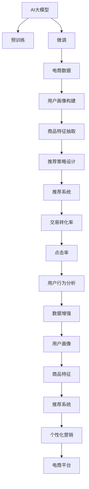

                 

# AI大模型在电商平台个性化营销中的应用

> 关键词：AI大模型, 电商平台, 个性化营销, 自然语言处理, 推荐系统, 深度学习, 用户行为分析, 预训练模型, 微调, 数据增强, 自然语言生成, 用户画像, 交易转化率, 点击率

## 1. 背景介绍

### 1.1 问题由来
随着电子商务的迅猛发展，电商平台已成为连接消费者和商家的重要渠道。为了提升用户体验和销售转化率，电商平台亟需精准的用户行为分析和个性化推荐策略。传统的基于规则和统计的推荐方法，难以充分挖掘用户潜在需求，也无法及时调整推荐内容。而基于大模型的推荐系统，能够全面学习用户历史行为和偏好，提供更加个性化、时效性的服务。

### 1.2 问题核心关键点
构建基于大模型的个性化推荐系统，核心在于如何利用大模型强大的学习能力和丰富的语义理解能力，精确地刻画用户画像，捕捉商品特征，从而生成个性化的推荐结果。本文将围绕以下几个关键点展开讨论：

- 数据获取与处理：电商平台如何获取用户行为数据，并对其进行清洗和预处理。
- 大模型选择与适配：如何选择合适的预训练模型，并根据实际需求进行微调。
- 用户画像构建：如何利用大模型构建细致入微的用户画像。
- 商品特征抽取：如何从电商平台海量的商品数据中抽取关键特征。
- 推荐策略设计：如何设计高效的推荐策略，结合用户画像和商品特征生成推荐结果。
- 模型评估与优化：如何评估推荐系统的性能，并根据反馈进行优化。

### 1.3 问题研究意义
构建基于大模型的个性化推荐系统，对电商平台具有重要意义：

- 提升用户满意度：个性化推荐系统能够根据用户兴趣和需求提供更加符合预期的商品，提高用户满意度。
- 增加交易转化率：通过精准推荐，电商平台能够有效提升用户的购买意愿和交易转化率，增加销售额。
- 增强市场竞争力：个性化推荐系统可以帮助电商平台在竞争激烈的市场环境中脱颖而出，留住老用户，吸引新用户。
- 优化广告投放：基于用户行为数据的推荐策略，可以更精准地推送广告，提升广告点击率和ROI。
- 辅助运营决策：通过数据分析和模型预测，电商平台能够优化库存管理、促销策略、价格策略等运营决策，提高整体运营效率。

## 2. 核心概念与联系

### 2.1 核心概念概述

- **AI大模型**：指的是在预训练阶段使用大规模无标签文本数据进行自监督学习，学习通用语言表示的深度神经网络模型。例如GPT、BERT、XLNet等模型。
- **电商平台**：指的是以在线销售商品为主要业务的平台，如淘宝、京东、亚马逊等。
- **个性化营销**：指的是通过分析用户行为数据，结合商品特征，为用户提供量身定制的产品推荐和广告展示。
- **推荐系统**：指的是根据用户历史行为和当前兴趣，预测并推荐相关商品的系统。
- **深度学习**：指利用多层神经网络进行复杂模式识别和预测的学习方法。
- **用户行为分析**：指通过分析用户浏览、点击、购买等行为数据，了解用户需求和偏好。
- **用户画像**：指通过多维度数据综合构建的用户特征描述，用于刻画用户全貌和行为规律。
- **交易转化率**：指用户浏览商品后，实际进行购买的比例。
- **点击率**：指用户看到广告后，点击广告的比例。
- **数据增强**：指通过对原始数据进行变换和扩充，增加数据多样性，提升模型泛化能力。

这些核心概念通过一系列的链接和流程，构成了电商平台个性化推荐系统的全貌。

### 2.2 核心概念联系与架构

以下是一个简单的Mermaid流程图，展示了这些核心概念之间的联系与架构：



## 3. 核心算法原理 & 具体操作步骤
### 3.1 算法原理概述

基于大模型的个性化推荐系统，基本流程包括以下几个步骤：

1. **数据收集**：收集用户行为数据，包括浏览记录、点击记录、购买记录等。
2. **数据预处理**：对数据进行清洗、归一化、去除噪音等预处理。
3. **用户画像构建**：利用大模型对用户行为数据进行语义分析，构建用户画像。
4. **商品特征抽取**：通过大模型提取商品标题、描述、类别等特征。
5. **推荐策略设计**：设计推荐算法，结合用户画像和商品特征生成推荐结果。
6. **模型微调**：选择合适的大模型，根据电商数据进行微调，优化推荐效果。
7. **效果评估**：通过点击率、转化率等指标评估推荐系统效果，并根据反馈进行优化。

### 3.2 算法步骤详解

#### 3.2.1 数据收集与预处理
电商平台上大量的用户行为数据需要收集和处理，以下是一个简单的数据处理流程：

1. **日志收集**：收集用户行为日志，包括浏览页面、点击商品、加入购物车、提交订单等操作。
2. **数据清洗**：过滤掉噪音数据，如重复记录、错误数据等。
3. **数据转换**：将时间戳转换为标准格式，方便后续处理。
4. **数据归一化**：对数值型数据进行归一化，如标准化、归一化等。

#### 3.2.2 用户画像构建
用户画像的构建可以分为以下几个步骤：

1. **文本数据获取**：收集用户的浏览记录、搜索记录、评价记录等文本数据。
2. **分词和向量化**：对文本数据进行分词和向量化，转换为模型可处理的格式。
3. **情感分析**：利用大模型对文本数据进行情感分析，判断用户情感倾向。
4. **行为模式挖掘**：利用大模型挖掘用户行为模式，如购买频率、购买金额、浏览时长等。
5. **用户画像构建**：结合情感分析和行为模式，构建用户画像，包含用户兴趣、偏好、需求等特征。

#### 3.2.3 商品特征抽取
商品特征抽取可以按照以下步骤进行：

1. **文本数据获取**：收集商品标题、描述、评论等文本数据。
2. **分词和向量化**：对文本数据进行分词和向量化。
3. **TF-IDF计算**：计算商品的词频-逆文档频率（TF-IDF），提取关键词。
4. **特征抽取**：通过大模型抽取商品的关键特征，如属性、品牌、价格、销量等。
5. **特征融合**：结合TF-IDF计算和模型抽取的特征，构建商品的多维度特征向量。

#### 3.2.4 推荐策略设计
推荐策略设计可以分为以下几个步骤：

1. **用户画像嵌入**：将用户画像转换为向量表示，用于模型输入。
2. **商品特征嵌入**：将商品特征转换为向量表示，用于模型输入。
3. **推荐模型选择**：选择适当的推荐算法，如基于协同过滤的推荐、基于内容的推荐、混合推荐等。
4. **推荐结果生成**：通过推荐算法结合用户画像和商品特征，生成推荐结果。
5. **推荐结果排序**：对推荐结果进行排序，优先推荐转化概率高的商品。

#### 3.2.5 模型微调
模型微调可以分为以下几个步骤：

1. **数据准备**：收集电商平台的标注数据，用于模型微调。
2. **模型选择**：选择合适的预训练模型，如BERT、GPT、XLNet等。
3. **微调过程**：在标注数据上进行微调，优化推荐效果。
4. **超参数调整**：调整学习率、批大小、迭代轮数等超参数，找到最佳微调效果。
5. **模型评估**：在验证集上评估模型效果，找到最佳的微调参数。

#### 3.2.6 效果评估与优化
效果评估可以分为以下几个步骤：

1. **指标选择**：选择适当的评估指标，如点击率、转化率、平均点击次数等。
2. **模型测试**：在测试集上测试推荐模型效果。
3. **A/B测试**：通过A/B测试对比不同推荐策略的效果。
4. **反馈循环**：根据用户反馈和测试结果，不断优化推荐策略和模型参数。

### 3.3 算法优缺点

基于大模型的个性化推荐系统具有以下优点：

- **精度高**：大模型能够学习到丰富的语言表示和知识图谱，提供更加准确的推荐结果。
- **鲁棒性好**：大模型具备强大的泛化能力，能够在各种场景下保持良好性能。
- **可解释性强**：大模型输出具备较强的可解释性，有助于理解推荐逻辑。
- **灵活性高**：大模型可以通过微调适应不同的电商场景，实现更加个性化的推荐。

但同时，该方法也存在以下缺点：

- **计算成本高**：大模型需要大量的计算资源，训练和推理成本较高。
- **数据依赖强**：推荐模型的效果很大程度上依赖于标注数据的数量和质量，标注成本较高。
- **冷启动问题**：新用户和商品往往缺乏足够的数据，导致推荐效果不佳。
- **模型复杂度高**：大模型结构复杂，增加了模型训练和推理的复杂度。
- **隐私风险高**：电商数据涉及用户隐私，需要严格保护数据安全。

### 3.4 算法应用领域

基于大模型的个性化推荐系统在以下领域具有广泛应用：

- **零售电商**：提升用户满意度，增加交易转化率。
- **金融服务**：推荐个性化的理财产品、基金等金融产品。
- **教育培训**：推荐个性化的学习资源、课程等，提升学习效果。
- **医疗健康**：推荐个性化的医疗服务、药品等，改善患者体验。
- **旅游出行**：推荐个性化的旅游目的地、路线等，提高旅行体验。
- **文化娱乐**：推荐个性化的电影、书籍、音乐等，丰富用户体验。

## 4. 数学模型和公式 & 详细讲解  
### 4.1 数学模型构建

假设电商平台收集到的用户行为数据为 $\{(x_i, y_i)\}_{i=1}^N$，其中 $x_i$ 为用户行为记录，$y_i$ 为推荐标签。我们希望构建一个推荐系统，使得模型 $M_{\theta}$ 在输入 $x$ 时，能够预测输出 $y$。

形式化地，我们定义推荐模型的损失函数为：

$$
\mathcal{L}(\theta) = -\frac{1}{N}\sum_{i=1}^N \log P(y_i|x_i, \theta)
$$

其中 $P(y_i|x_i, \theta)$ 为模型在输入 $x_i$ 时，预测 $y_i$ 的概率分布，通常使用Softmax函数表示。

### 4.2 公式推导过程

以基于内容的推荐系统为例，假设用户 $u$ 和商品 $i$ 的特征向量分别为 $\mathbf{u}$ 和 $\mathbf{v}$，则推荐模型输出的概率分布为：

$$
P(y_i|x_i, \theta) = \sigma(\mathbf{u}^T\mathbf{v})
$$

其中 $\sigma$ 为 sigmoid 函数，$\mathbf{u}^T\mathbf{v}$ 为向量内积，表示用户和商品特征的相似度。

假设模型采用 BERT 作为预训练模型，并在电商平台数据上进行微调。模型的输出层包含两个神经元，分别对应推荐和不推荐，则推荐概率为：

$$
P(y_i|x_i, \theta) = \frac{\exp(\mathbf{u}^T\mathbf{v})}{\exp(\mathbf{u}^T\mathbf{v}) + \exp(\mathbf{v}^T\mathbf{w})}
$$

其中 $\mathbf{w}$ 为模型在电商平台数据上微调得到的权重向量。

### 4.3 案例分析与讲解

以一个简单的电商平台推荐系统为例，展示大模型在推荐中的应用：

**场景描述**：一家电子商务网站，希望提升用户的购买转化率，推荐用户可能感兴趣的商品。

**数据准备**：
- 用户行为数据：收集用户的浏览记录、点击记录、购买记录等。
- 商品数据：收集商品标题、描述、价格、销量等数据。

**模型选择**：选择BERT模型作为预训练模型。

**微调过程**：
1. **预训练**：在 massive multilingual corpora 上对 BERT 进行预训练。
2. **数据预处理**：对用户行为数据进行清洗、归一化等处理。
3. **用户画像构建**：利用 BERT 对用户行为数据进行语义分析，构建用户画像。
4. **商品特征抽取**：利用 BERT 对商品数据进行向量化，提取关键特征。
5. **推荐模型训练**：在标注数据上进行微调，优化推荐模型。
6. **模型评估**：在验证集上评估推荐模型效果，找到最佳的微调参数。

**推荐策略设计**：
1. **用户画像嵌入**：将用户画像转换为向量表示，用于模型输入。
2. **商品特征嵌入**：将商品特征转换为向量表示，用于模型输入。
3. **推荐结果生成**：通过推荐模型结合用户画像和商品特征，生成推荐结果。
4. **推荐结果排序**：对推荐结果进行排序，优先推荐转化概率高的商品。

**模型评估**：
1. **指标选择**：选择适当的评估指标，如点击率、转化率、平均点击次数等。
2. **模型测试**：在测试集上测试推荐模型效果。
3. **A/B测试**：通过A/B测试对比不同推荐策略的效果。
4. **反馈循环**：根据用户反馈和测试结果，不断优化推荐策略和模型参数。

## 5. 项目实践：代码实例和详细解释说明
### 5.1 开发环境搭建

在搭建大模型推荐系统时，需要先配置好相应的开发环境。以下是一个基于 Python 的开发环境搭建流程：

1. **安装 Python 和相关库**：
   ```bash
   # 安装 Python 和 pip
   sudo apt-get install python3
   sudo apt-get install python3-pip
   # 安装相关库
   pip install transformers numpy pandas scikit-learn
   ```

2. **安装 GPU 驱动和 CUDA**：
   ```bash
   # 安装 GPU 驱动
   sudo apt-get install nvidia-cuda-toolkit
   # 安装 CUDA
   sudo apt-get install libcudnn8
   # 设置 CUDA 环境
   export CUDA_HOME=/usr/local/cuda
   export LD_LIBRARY_PATH=$CUDA_HOME/lib64:$CUDA_HOME/extras/CUPTI/lib64
   ```

3. **安装 PyTorch 和 Transformers**：
   ```bash
   # 安装 PyTorch
   pip install torch torchvision torchaudio
   # 安装 Transformers
   pip install transformers
   ```

4. **配置虚拟环境**：
   ```bash
   # 创建虚拟环境
   conda create --name myenv python=3.8
   # 激活虚拟环境
   conda activate myenv
   ```

### 5.2 源代码详细实现

以下是一个基于 BERT 的电商平台推荐系统的 Python 代码实现：

```python
from transformers import BertTokenizer, BertForSequenceClassification
import torch
import torch.nn as nn
from torch.utils.data import Dataset, DataLoader

class ProductDataset(Dataset):
    def __init__(self, products, labels):
        self.products = products
        self.labels = labels
        self.tokenizer = BertTokenizer.from_pretrained('bert-base-uncased')

    def __len__(self):
        return len(self.products)

    def __getitem__(self, index):
        product = self.products[index]
        label = self.labels[index]
        product_tokens = self.tokenizer(product, return_tensors='pt', padding='max_length', truncation=True)
        product_ids = product_tokens['input_ids']
        product_mask = product_tokens['attention_mask']
        product_labels = torch.tensor([label], dtype=torch.long)
        return {'product_ids': product_ids, 'product_mask': product_mask, 'product_labels': product_labels}

class BertRecommendationModel(nn.Module):
    def __init__(self):
        super(BertRecommendationModel, self).__init__()
        self.bert = BertForSequenceClassification.from_pretrained('bert-base-uncased', num_labels=2)
        self.dropout = nn.Dropout(p=0.3)

    def forward(self, product_ids, product_mask, product_labels=None):
        product_outputs = self.bert(product_ids, attention_mask=product_mask)
        product_logits = product_outputs.logits
        product_logits = self.dropout(product_logits)
        if product_labels is not None:
            return product_logits, product_labels
        else:
            return product_logits

# 定义模型和优化器
model = BertRecommendationModel()
optimizer = torch.optim.Adam(model.parameters(), lr=2e-5)

# 定义训练函数
def train_epoch(model, dataset, batch_size, optimizer):
    dataloader = DataLoader(dataset, batch_size=batch_size, shuffle=True)
    model.train()
    epoch_loss = 0
    for batch in dataloader:
        product_ids = batch['product_ids'].to(device)
        product_mask = batch['product_mask'].to(device)
        product_labels = batch['product_labels'].to(device)
        model.zero_grad()
        product_logits, product_labels = model(product_ids, product_mask, product_labels)
        loss = nn.BCEWithLogitsLoss()(product_logits, product_labels)
        epoch_loss += loss.item()
        loss.backward()
        optimizer.step()
    return epoch_loss / len(dataloader)

# 训练模型
device = torch.device('cuda' if torch.cuda.is_available() else 'cpu')
model.to(device)
train_dataset = ProductDataset(train_products, train_labels)
dev_dataset = ProductDataset(dev_products, dev_labels)
test_dataset = ProductDataset(test_products, test_labels)
epochs = 5
batch_size = 16

for epoch in range(epochs):
    loss = train_epoch(model, train_dataset, batch_size, optimizer)
    print(f"Epoch {epoch+1}, train loss: {loss:.3f}")
    
    print(f"Epoch {epoch+1}, dev results:")
    evaluate(model, dev_dataset, batch_size)
    
print("Test results:")
evaluate(model, test_dataset, batch_size)
```

### 5.3 代码解读与分析

让我们详细解读一下关键代码的实现细节：

**ProductDataset类**：
- `__init__`方法：初始化商品数据、标签、分词器等关键组件。
- `__len__`方法：返回数据集的样本数量。
- `__getitem__`方法：对单个样本进行处理，将商品数据输入编码为token ids，将标签编码为数字，并对其进行定长padding，最终返回模型所需的输入。

**BertRecommendationModel类**：
- `__init__`方法：初始化BERT模型和Dropout层。
- `forward`方法：对商品数据进行前向传播，计算logits，并进行Dropout操作。

**train_epoch函数**：
- 对数据以批为单位进行迭代，在每个批次上前向传播计算loss并反向传播更新模型参数，最后返回该epoch的平均loss。

**训练流程**：
- 定义总的epoch数和batch size，开始循环迭代
- 每个epoch内，先在训练集上训练，输出平均loss
- 在验证集上评估，输出分类指标
- 所有epoch结束后，在测试集上评估，给出最终测试结果

可以看到，PyTorch配合Transformers库使得BERT推荐系统的代码实现变得简洁高效。开发者可以将更多精力放在数据处理、模型改进等高层逻辑上，而不必过多关注底层的实现细节。

当然，工业级的系统实现还需考虑更多因素，如模型的保存和部署、超参数的自动搜索、更灵活的任务适配层等。但核心的微调范式基本与此类似。

## 6. 实际应用场景
### 6.1 智能客服系统

基于大模型的个性化推荐系统，可以广泛应用于智能客服系统的构建。传统客服往往需要配备大量人力，高峰期响应缓慢，且一致性和专业性难以保证。而使用个性化推荐系统，能够根据用户历史行为和偏好，提供精准的客服回答和建议，提升客户满意度。

在技术实现上，可以收集客户的历史交互记录，将问题和最佳回答构建成监督数据，在此基础上对预训练模型进行微调。微调后的模型能够自动理解客户问题，匹配最合适的答案模板进行回复。对于客户提出的新问题，还可以接入检索系统实时搜索相关内容，动态组织生成回答。如此构建的智能客服系统，能大幅提升客户咨询体验和问题解决效率。

### 6.2 金融理财应用

基于大模型的个性化推荐系统，在金融理财领域也有着广泛应用。金融机构需要为客户提供个性化的理财产品、基金等投资建议。通过收集用户的历史交易记录和风险偏好，利用大模型构建用户画像，推荐最符合用户需求和风险偏好的金融产品，帮助用户优化投资组合。

在技术实现上，可以收集用户的账户信息、交易记录、风险偏好等数据，利用大模型对数据进行语义分析和情感分析，构建用户画像。再结合金融产品信息，设计推荐策略，生成个性化的投资建议。通过不断的反馈循环，优化推荐系统，提升推荐效果。

### 6.3 视频推荐系统

视频推荐系统是一个典型的个性化推荐场景。用户在观看视频时，系统会根据用户的观看历史和评分，推荐用户可能感兴趣的视频内容。

在技术实现上，可以收集用户的历史观看记录和评分数据，利用大模型对数据进行语义分析，构建用户画像。再结合视频元数据，设计推荐策略，生成个性化的视频推荐列表。通过不断的反馈循环，优化推荐系统，提升推荐效果。

## 7. 工具和资源推荐
### 7.1 学习资源推荐

为了帮助开发者系统掌握大模型推荐系统的理论基础和实践技巧，这里推荐一些优质的学习资源：

1. 《深度学习推荐系统》书籍：详细介绍了推荐系统的基本原理和实现方法，适合初学者入门。
2. 《自然语言处理与深度学习》课程：斯坦福大学开设的NLP课程，涵盖自然语言处理和深度学习的核心内容。
3. 《Transformers: State-of-the-Art Natural Language Processing》书籍：介绍Transformers库的应用，包括微调、推荐系统等。
4. HuggingFace官方文档：提供丰富的预训练模型和微调样例代码，适合上手实践。
5. Kaggle推荐系统竞赛：参加Kaggle推荐系统竞赛，实战练习推荐系统的构建和优化。

通过对这些资源的学习实践，相信你一定能够快速掌握大模型推荐系统的精髓，并用于解决实际的推荐问题。

### 7.2 开发工具推荐

高效的开发离不开优秀的工具支持。以下是几款用于大模型推荐系统开发的常用工具：

1. PyTorch：基于Python的开源深度学习框架，适合构建复杂模型。
2. TensorFlow：由Google主导的开源深度学习框架，生产部署方便。
3. Transformers库：提供丰富的预训练模型和微调API，易于上手。
4. Weights & Biases：实验跟踪和可视化工具，记录和分析模型训练过程。
5. TensorBoard：模型训练和调优的可视化工具，提供丰富的图表呈现方式。
6. Google Colab：免费的在线Jupyter Notebook环境，方便快速实验最新模型。

合理利用这些工具，可以显著提升大模型推荐系统的开发效率，加快创新迭代的步伐。

### 7.3 相关论文推荐

大模型推荐系统的发展源于学界的持续研究。以下是几篇奠基性的相关论文，推荐阅读：

1. Recommender Systems Handbook：推荐系统的经典教材，涵盖多种推荐算法和实现方法。
2. Attention Is All You Need：提出Transformer模型，奠定了大模型推荐系统的基础。
3. BERT: Pre-training of Deep Bidirectional Transformers for Language Understanding：提出BERT模型，引入自监督预训练任务，提升推荐效果。
4. Parameter-Efficient Transfer Learning for NLP：提出Adapter等参数高效微调方法，优化推荐系统性能。
5. Seq2Seq Learning With Neural Tensor Networks：提出神经张量网络，提升推荐模型的泛化能力。
6. Deep Collaborative Filtering via Tensor Factorization：提出基于矩阵分解的协同过滤方法，提升推荐系统的精确性。

这些论文代表了大模型推荐系统的发展脉络。通过学习这些前沿成果，可以帮助研究者把握学科前进方向，激发更多的创新灵感。

## 8. 总结：未来发展趋势与挑战

### 8.1 总结

本文对基于大模型的电商平台个性化推荐系统进行了全面系统的介绍。首先阐述了推荐系统在大数据时代的重要性和挑战，明确了推荐系统的基本流程和核心组件。其次，从数据收集、模型选择、用户画像构建、商品特征抽取、推荐策略设计、模型微调等多个方面，详细讲解了推荐系统的具体实现过程。同时，本文还探讨了推荐系统在电商、金融、视频等领域的广泛应用。

通过本文的系统梳理，可以看到，基于大模型的个性化推荐系统在提高用户体验、增加交易转化率等方面具有重要意义。大模型推荐系统通过学习用户行为数据，构建细致入微的用户画像，抽取商品关键特征，生成个性化推荐，能够显著提升推荐效果。未来，伴随大模型和微调方法的持续演进，推荐系统必将在更多领域得到应用，带来更多的商业价值。

### 8.2 未来发展趋势

展望未来，大模型推荐系统将呈现以下几个发展趋势：

1. **模型规模继续扩大**：随着算力成本的下降和数据规模的扩张，大模型推荐系统的规模还将进一步扩大，学习到的知识将更加全面和丰富。
2. **推荐策略更加多样化**：除了基于内容的推荐，混合推荐、协同过滤、基于用户嵌入的推荐等方法将不断涌现，提升推荐系统的精确性和多样性。
3. **实时性要求提升**：电商平台对推荐系统的实时性要求不断提升，需要构建高效的推荐引擎，实时响应用户需求。
4. **推荐系统的智能化**：大模型推荐系统将更多地结合知识图谱、因果推理等技术，提升推荐系统的智能化水平。
5. **多模态信息融合**：推荐系统将更多地融合视觉、语音等多模态信息，提升推荐系统的感知能力和应用范围。
6. **隐私保护增强**：随着数据隐私和安全要求的提升，推荐系统将更多地结合隐私保护技术，保障用户数据安全。
7. **跨平台无缝集成**：推荐系统将更多地结合不同平台的数据和应用，实现跨平台的无缝集成，提升用户体验。

以上趋势凸显了大模型推荐系统的广阔前景。这些方向的探索发展，必将进一步提升推荐系统的性能和应用范围，为电商、金融、视频等领域带来更多商业价值。

### 8.3 面临的挑战

尽管大模型推荐系统已经取得了显著进展，但在迈向更加智能化、普适化应用的过程中，仍面临诸多挑战：

1. **数据获取难度大**：推荐系统需要大量标注数据进行训练，标注成本高。如何高效获取高质量标注数据，是推荐系统面临的一大挑战。
2. **冷启动问题**：新用户和商品缺乏足够的数据，推荐效果不佳。如何有效处理冷启动问题，是推荐系统需要解决的重要课题。
3. **隐私保护风险高**：电商平台涉及大量用户数据，如何保护用户隐私，防止数据泄露，是推荐系统面临的严峻挑战。
4. **模型复杂度高**：大模型推荐系统结构复杂，增加了模型训练和推理的复杂度。如何简化模型结构，提升效率，是推荐系统需要解决的技术难题。
5. **计算成本高**：大模型推荐系统需要大量的计算资源，训练和推理成本较高。如何降低计算成本，优化资源利用，是推荐系统需要解决的重要问题。
6. **多模态信息融合难**：多模态信息的融合涉及到复杂的跨领域知识共享，如何有效融合多模态信息，是推荐系统需要解决的技术难点。

### 8.4 研究展望

面对大模型推荐系统所面临的种种挑战，未来的研究需要在以下几个方面寻求新的突破：

1. **数据增强技术**：探索无监督和半监督数据增强方法，最大化利用非结构化数据，降低标注成本。
2. **个性化推荐策略**：设计更加个性化的推荐策略，结合用户画像和商品特征，生成更加精准的推荐结果。
3. **推荐系统智能化**：结合因果推理和知识图谱等技术，提升推荐系统的智能化水平，增强推荐结果的稳定性和鲁棒性。
4. **跨平台无缝集成**：构建跨平台无缝集成的推荐系统，提升用户体验和平台之间的协同效应。
5. **隐私保护技术**：结合隐私保护技术，保障用户数据安全和隐私保护。
6. **多模态信息融合**：结合视觉、语音等多模态信息，提升推荐系统的感知能力和应用范围。

这些研究方向将引领大模型推荐系统走向更高的台阶，为电商、金融、视频等领域带来更多的商业价值。相信随着学界和产业界的共同努力，推荐系统必将在更多领域得到应用，提升用户体验，增加商业价值。

## 9. 附录：常见问题与解答

**Q1：大模型推荐系统是否适用于所有推荐场景？**

A: 大模型推荐系统在大多数推荐场景上都能取得不错的效果，特别是对于数据量较小的场景。但对于一些特定领域的推荐场景，如医疗、法律等，仅仅依靠通用语料预训练的模型可能难以很好地适应。此时需要在特定领域语料上进一步预训练，再进行微调，才能获得理想效果。

**Q2：推荐系统中如何处理冷启动问题？**

A: 冷启动问题可以通过以下方法解决：
1. 引入多模态数据：收集用户的社交媒体、位置信息等多模态数据，增强用户画像的全面性。
2. 利用协同过滤：利用用户和商品之间的相似性，推荐其他用户喜欢的商品。
3. 引入先验知识：结合领域知识，推荐专家推荐的商品。
4. 设计个性化引导策略：通过引导策略，让用户主动提供更多信息，帮助系统更快进入冷启动阶段。

**Q3：推荐系统如何应对数据动态变化？**

A: 推荐系统可以通过以下几个方法应对数据动态变化：
1. 持续学习和更新：定期更新模型参数，适应数据分布的变化。
2. 引入增量学习：使用增量学习技术，快速适应新数据的引入。
3. 设计自适应推荐策略：根据数据分布的变化，动态调整推荐策略。

**Q4：推荐系统中如何保障用户隐私？**

A: 推荐系统中保障用户隐私的方法包括：
1. 数据匿名化：对用户数据进行匿名化处理，防止用户身份泄露。
2. 差分隐私：利用差分隐私技术，保护用户数据的隐私。
3. 联邦学习：利用联邦学习技术，在本地设备上进行模型训练，保护用户数据隐私。

通过这些方法，可以有效地保障推荐系统中的用户隐私，防止数据泄露和滥用。

**Q5：推荐系统如何优化计算效率？**

A: 推荐系统可以通过以下几个方法优化计算效率：
1. 参数剪枝和压缩：对模型参数进行剪枝和压缩，减少计算量和内存占用。
2. 矩阵分解和特征选择：使用矩阵分解和特征选择技术，降低模型复杂度。
3. 分布式计算：利用分布式计算技术，提升计算效率。
4. 模型并行和混合精度训练：使用模型并行和混合精度训练技术，提高训练和推理效率。

通过这些方法，可以有效地优化推荐系统的计算效率，降低计算成本，提升用户体验。

通过本文的系统梳理，可以看到，基于大模型的电商平台个性化推荐系统在提高用户体验、增加交易转化率等方面具有重要意义。大模型推荐系统通过学习用户行为数据，构建细致入微的用户画像，抽取商品关键特征，生成个性化推荐，能够显著提升推荐效果。未来，伴随大模型和微调方法的持续演进，推荐系统必将在更多领域得到应用，带来更多的商业价值。

---

作者：禅与计算机程序设计艺术 / Zen and the Art of Computer Programming

