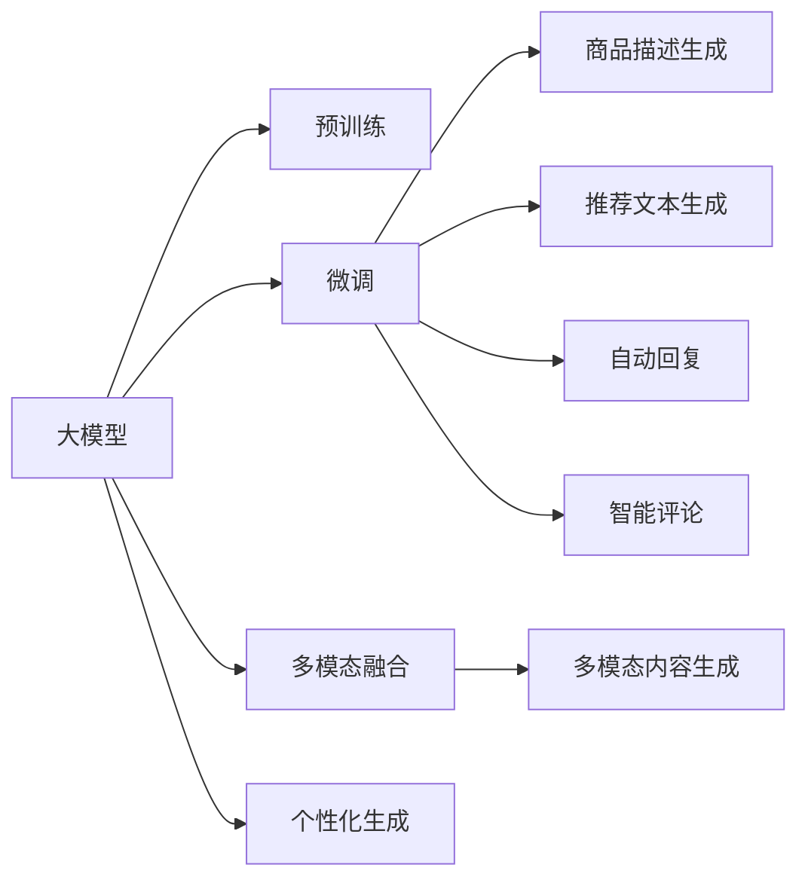

                 

# AI大模型在电商平台内容生成中的应用

## 1. 背景介绍

在电商平台快速发展的同时，内容生成成为提升用户体验和平台竞争力的重要环节。用户通过搜索、浏览、购买商品等活动，不断地与商品、商品描述、评价、评论等文本信息交互，而平台希望通过自动化生成高质量内容，降低运营成本，提高信息展示的效率和吸引力。

### 1.1 需求驱动

电商平台的文本内容生成需求主要来自以下几个方面：

- **商品描述自动生成**：为大量商品自动生成详细的描述信息，包括产品特点、成分、使用方法、用户评价等。
- **个性化推荐文本**：为不同用户推荐个性化的商品介绍，提高转化率和用户满意度。
- **自动回复客服**：自动回答用户的咨询和反馈，提升客服响应效率和质量。
- **智能评论分析**：分析用户的评价和评论，生成综合评语，帮助用户快速了解产品优劣。

### 1.2 挑战和机遇

尽管内容生成技术已有多年的发展，但电商平台的文本生成任务面临以下挑战：

- **数据多样性**：电商平台数据种类繁多，商品图片、用户评价、物流信息等结构化数据与非结构化文本数据并存。
- **上下文关联**：商品描述、评论、推荐文本等需要考虑上下文信息，确保生成的文本连贯性和相关性。
- **多模态融合**：文本生成需要融合图片、视频等多模态信息，提升内容的丰富性和吸引力。
- **个性化需求**：不同用户的偏好和需求差异大，需要动态生成个性化内容。

面对这些挑战，AI大模型提供了一种全新的解决方案。大模型通过大规模无标签数据的预训练，学习到丰富的语言知识和语义表示，能够适应多样化的数据和上下文需求，生成具有高度相关性和个性化特点的内容。

## 2. 核心概念与联系

### 2.1 核心概念概述

在介绍大模型在电商平台内容生成中的应用前，首先需要明确几个关键概念：

- **大模型**：基于深度学习架构，如Transformer、BERT等，通过大规模数据预训练得到的模型。大模型具有广泛的语言知识，能够生成高质量的文本内容。
- **预训练**：在大规模无标签数据上，通过自监督学习任务训练模型，学习到通用的语言表示，以便更好地适应下游任务。
- **微调**：在大模型基础上，针对特定任务进行有监督的优化，如商品描述生成、推荐文本生成等。
- **多模态融合**：将文本与图像、视频等不同模态的数据进行融合，生成更丰富、更有吸引力的内容。
- **个性化生成**：根据用户行为和偏好，动态生成个性化的文本内容，提升用户体验和平台转化率。

这些概念之间的关系可以通过以下Mermaid流程图来展示：



这个流程图展示了各个概念之间的联系：

1. 大模型通过预训练学习通用的语言表示，用于后续的微调和内容生成。
2. 微调过程针对特定的电商平台任务，优化模型，生成商品描述、推荐文本等。
3. 多模态融合技术将文本与图像、视频等结合，生成更丰富的内容。
4. 个性化生成根据用户行为和偏好，动态生成内容，提升用户体验。

### 2.2 核心概念原理和架构

核心概念的原理和架构可以进一步通过以下公式和流程图示意：

1. **预训练**：
   - **公式**：$M_{\text{pretrain}} = \text{Training}(D_{\text{pretrain}})$
   - **流程**：
     ```mermaid
     graph LR
         A[预训练数据集] --> B[Transformer模型]
         B --> C[无监督学习任务]
         C --> D[通用的语言表示]
     ```

2. **微调**：
   - **公式**：$M_{\text{fine-tune}} = \text{Training}(D_{\text{fine-tune}})$
   - **流程**：
     ```mermaid
     graph LR
         A[微调数据集] --> B[M_{\text{pretrain}}]
         B --> C[任务适配层]
         C --> D[M_{\text{fine-tune}}]
     ```

3. **多模态融合**：
   - **公式**：$M_{\text{multi-modal}} = \text{Fusion}(M_{\text{text}}, M_{\text{image}}, M_{\text{video}})$
   - **流程**：
     ```mermaid
     graph LR
         A[文本数据] --> B[图像数据]
         A --> C[视频数据]
         B --> D[文本描述]
         C --> E[视频描述]
         D --> F[图像描述]
         F --> G[M_{\text{multi-modal}}]
     ```

4. **个性化生成**：
   - **公式**：$G_{\text{personalized}} = \text{Generate}(M_{\text{fine-tune}}, D_{\text{user}}, D_{\text{item}})$
   - **流程**：
     ```mermaid
     graph LR
         A[用户数据] --> B[商品数据]
         A --> C[用户偏好]
         B --> D[商品描述]
         C --> E[个性化文本]
         D --> F[M_{\text{fine-tune}}]
         E --> G[M_{\text{fine-tune}}]
     ```

## 3. 核心算法原理 & 具体操作步骤

### 3.1 算法原理概述

基于大模型的电商平台内容生成主要分为预训练、微调和生成三个步骤。其中，预训练是模型学习通用语言表示的基础，微调是针对特定任务的优化，生成是基于优化后的模型产出具体内容。

- **预训练**：使用大规模无标签文本数据，训练Transformer等深度学习模型，学习到通用的语言表示，便于后续的微调和内容生成。
- **微调**：在预训练模型基础上，使用电商平台提供的任务数据，进行有监督学习，优化模型针对特定任务的性能，如商品描述生成、推荐文本生成等。
- **生成**：使用微调后的模型，根据输入数据，生成符合用户需求的商品描述、推荐文本等内容。

### 3.2 算法步骤详解

#### 3.2.1 预训练阶段

1. **数据收集**：收集电商平台的商品描述、用户评论、商品图片等文本和图片数据，构成预训练数据集。
2. **模型选择**：选择如BERT、GPT等预训练模型，作为内容生成的基础。
3. **预训练任务**：在无监督学习任务上训练模型，如掩码语言模型、next sentence prediction等。
4. **模型保存**：保存训练好的模型参数，用于后续的微调。

#### 3.2.2 微调阶段

1. **任务适配**：根据电商平台的特定任务，设计任务适配层，如商品描述生成器、推荐文本生成器等。
2. **数据准备**：收集电商平台的具体任务数据，如商品描述、用户评论等，构成微调数据集。
3. **模型初始化**：将预训练模型作为初始化参数，进行微调。
4. **优化算法**：选择合适的优化算法，如AdamW、SGD等，设置学习率、批大小、迭代轮数等。
5. **损失函数**：根据任务类型，选择适当的损失函数，如交叉熵损失、均方误差损失等。
6. **正则化技术**：应用L2正则、Dropout、Early Stopping等正则化技术，防止模型过拟合。
7. **模型评估**：在验证集上评估模型性能，根据性能指标决定是否触发Early Stopping。
8. **微调完成**：保存微调后的模型参数，用于后续内容生成。

#### 3.2.3 生成阶段

1. **输入处理**：根据输入数据（如商品ID、用户ID等），提取特征。
2. **模型前向传播**：将特征输入微调后的模型，进行前向传播。
3. **文本生成**：模型输出文本结果，根据任务需求进行处理。
4. **后处理**：对生成的文本进行必要的后处理，如去除噪声、分词等。
5. **返回结果**：将处理后的文本作为输出结果返回。

### 3.3 算法优缺点

#### 3.3.1 优点

1. **通用性强**：大模型通过预训练学习到通用的语言表示，能够适应多种电商文本生成任务。
2. **泛化能力强**：大模型经过大规模数据训练，能够应对新数据和新场景的挑战，具有较强的泛化能力。
3. **生成效率高**：预训练和微调过程可以通过分布式训练加速，生成文本的速度较快。
4. **个性化精准**：通过微调，大模型可以根据用户行为和偏好生成个性化内容，提高用户体验。

#### 3.3.2 缺点

1. **数据依赖性强**：预训练和微调的效果依赖于数据的质量和数量，获取高质量标注数据成本较高。
2. **资源消耗大**：预训练和微调模型需要大量的计算资源和时间，对硬件要求较高。
3. **知识更新慢**：大模型更新知识的速度较慢，需要定期重新预训练或微调以保持模型性能。
4. **解释性差**：大模型往往是"黑盒"模型，难以解释其决策过程，缺乏可解释性。

### 3.4 算法应用领域

大模型在电商平台内容生成中的应用主要包括以下几个方面：

1. **商品描述自动生成**：基于商品图片、规格等信息，自动生成商品描述，提升信息展示效率。
2. **个性化推荐文本生成**：根据用户历史行为和偏好，动态生成推荐文本，提高转化率和用户满意度。
3. **自动回复客服**：自动回答用户的咨询和反馈，提升客服响应效率和质量。
4. **智能评论分析**：分析用户的评价和评论，生成综合评语，帮助用户快速了解产品优劣。

## 4. 数学模型和公式 & 详细讲解

### 4.1 数学模型构建

电商平台的文本生成任务可以形式化地定义为：在给定商品ID和用户ID的条件下，生成商品描述或推荐文本。设模型为 $M_{\theta}$，输入为 $x=(\text{商品ID}, \text{用户ID})$，输出为 $y=\text{商品描述或推荐文本}$。则任务可以表示为：

$$
P(y|x; M_{\theta}) = \frac{\exp(\log P(y|x; M_{\theta}))}{\sum_{k} \exp(\log P(y_k|x; M_{\theta}))}
$$

其中，$P(y|x; M_{\theta})$ 表示模型在输入 $x$ 条件下生成输出 $y$ 的概率。

### 4.2 公式推导过程

以商品描述自动生成为例，我们可以使用语言模型来建模该任务。假设有 $N$ 个商品，每个商品有一个长度为 $L$ 的商品描述。设商品ID为 $i$，用户ID为 $u$，则输入 $x$ 可以表示为：

$$
x = (i, u)
$$

输出 $y$ 为商品描述 $s$，可以表示为：

$$
y = s = \{s_1, s_2, ..., s_L\}
$$

任务的目标是最大化生成商品描述的概率，即：

$$
\max_{\theta} \log P(s|(i, u); M_{\theta})
$$

假设使用Transformer模型，其结构为：

$$
M_{\theta} = (L, E, H, P)
$$

其中 $L$ 为编码器，$E$ 为嵌入层，$H$ 为多头注意力机制，$P$ 为输出层。通过预训练和微调，模型学习到商品描述和用户ID之间的关系。在生成商品描述时，模型会通过编码器 $L$ 将商品ID和用户ID编码成向量，输入到嵌入层 $E$ 中，通过多头注意力机制 $H$ 处理上下文信息，最终通过输出层 $P$ 生成商品描述。

### 4.3 案例分析与讲解

假设有一个电商平台的商品描述自动生成任务，商品ID为1，用户ID为1000，模型需要在生成的商品描述中包含该商品的关键信息，如商品特点、成分、使用方法等。具体实现流程如下：

1. **数据准备**：收集商品ID为1的商品描述，构成训练集。
2. **模型初始化**：使用预训练好的BERT模型作为初始化参数。
3. **任务适配**：设计一个二分类任务，将生成商品描述的问题转换为判断该描述是否为真实描述的问题。
4. **微调训练**：在微调数据集上进行训练，优化模型参数，使其能够生成符合用户需求的商品描述。
5. **生成商品描述**：将商品ID为1的用户ID输入模型，生成商品描述。
6. **后处理**：对生成的商品描述进行必要的后处理，如去除噪声、分词等。
7. **返回结果**：将处理后的商品描述作为输出结果返回。

## 5. 项目实践：代码实例和详细解释说明

### 5.1 开发环境搭建

1. **安装Python**：在服务器上安装Python 3.7及以上版本，如：
```
sudo apt-get install python3
```

2. **安装Pip**：在Python环境中安装Pip包管理器，如：
```
sudo apt-get install python3-pip
```

3. **安装TensorFlow**：安装TensorFlow 2.0及以上版本，如：
```
pip install tensorflow
```

4. **安装TensorBoard**：安装TensorBoard可视化工具，如：
```
pip install tensorboard
```

5. **安装TensorFlow HUB**：安装TensorFlow Hub，用于加载预训练模型，如：
```
pip install tensorflow-hub
```

6. **安装Natural Language Toolkit (NLTK)**：安装NLTK库，用于文本处理，如：
```
pip install nltk
```

7. **安装PyTorch**：安装PyTorch 1.7及以上版本，如：
```
pip install torch
```

8. **安装PyTorch Transformers**：安装PyTorch Transformers库，用于大模型加载和微调，如：
```
pip install transformers
```

完成以上步骤后，即可开始使用PyTorch和Transformers库进行大模型微调和内容生成。

### 5.2 源代码详细实现

以下是使用PyTorch和Transformers库进行商品描述自动生成的代码实现。

```python
import torch
import transformers
from transformers import BertTokenizer, BertForSequenceClassification
from sklearn.metrics import accuracy_score

# 加载数据集
train_data = load_train_data()
dev_data = load_dev_data()
test_data = load_test_data()

# 初始化分词器
tokenizer = BertTokenizer.from_pretrained('bert-base-cased')

# 定义模型
model = BertForSequenceClassification.from_pretrained('bert-base-cased', num_labels=2)

# 定义优化器
optimizer = torch.optim.Adam(model.parameters(), lr=2e-5)

# 定义训练函数
def train(model, train_data, optimizer, epochs=5, batch_size=32):
    for epoch in range(epochs):
        for i, (inputs, labels) in enumerate(train_data):
            inputs = tokenizer(inputs, padding='max_length', max_length=128, truncation=True)
            inputs = {key: torch.tensor(val) for key, val in inputs.items()}
            labels = torch.tensor(labels, dtype=torch.long)
            optimizer.zero_grad()
            outputs = model(**inputs)
            loss = outputs.loss
            loss.backward()
            optimizer.step()
            print(f"Epoch {epoch+1}, Step {i+1}/{len(train_data)}, Loss: {loss:.4f}")
    return model

# 定义评估函数
def evaluate(model, dev_data):
    dev_loss = 0
    dev_correct = 0
    for inputs, labels in dev_data:
        inputs = tokenizer(inputs, padding='max_length', max_length=128, truncation=True)
        inputs = {key: torch.tensor(val) for key, val in inputs.items()}
        labels = torch.tensor(labels, dtype=torch.long)
        outputs = model(**inputs)
        loss = outputs.loss
        logits = outputs.logits
        _, preds = torch.max(logits, dim=1)
        dev_correct += (preds == labels).sum().item()
        dev_loss += loss.item()
    dev_accuracy = dev_correct / len(dev_data)
    print(f"Dev Accuracy: {dev_accuracy:.4f}, Dev Loss: {dev_loss:.4f}")
    return model, dev_accuracy

# 训练和评估
model = train(model, train_data, optimizer)
dev_model, dev_accuracy = evaluate(model, dev_data)

# 生成商品描述
input = [1, 1000]
tokenized_input = tokenizer(input, padding='max_length', max_length=128, truncation=True)
tokenized_input = {key: torch.tensor(val) for key, val in tokenized_input.items()}
logits = model(**tokenized_input)
generated_description = tokenizer.decode(tokenized_input['input_ids'], skip_special_tokens=True)
print(generated_description)
```

### 5.3 代码解读与分析

以上代码实现了商品描述自动生成的完整流程。以下是关键代码的解读：

1. **数据加载**：
   - `load_train_data()`、`load_dev_data()`、`load_test_data()`：加载训练集、验证集和测试集数据。
   - `tokenizer`：使用预训练好的BERT分词器，将文本数据进行分词和编码。

2. **模型初始化**：
   - `BertForSequenceClassification.from_pretrained('bert-base-cased', num_labels=2)`：加载预训练好的BERT模型，指定标签数为2。

3. **训练函数**：
   - `train(model, train_data, optimizer, epochs=5, batch_size=32)`：对模型进行训练，设置训练轮数和批大小。
   - `inputs = tokenizer(inputs, padding='max_length', max_length=128, truncation=True)`：将文本数据进行分词和编码，设置最大长度为128，并进行截断和填充。

4. **评估函数**：
   - `evaluate(model, dev_data)`：对模型在验证集上进行评估，计算准确率和损失。
   - `dev_correct += (preds == labels).sum().item()`：计算预测结果与真实标签的一致性。

5. **生成商品描述**：
   - `tokenized_input = tokenizer(input, padding='max_length', max_length=128, truncation=True)`：将输入数据进行分词和编码，设置最大长度为128，并进行截断和填充。
   - `logits = model(**tokenized_input)`：将编码后的输入数据输入模型，计算输出。
   - `generated_description = tokenizer.decode(tokenized_input['input_ids'], skip_special_tokens=True)`：将输出解码为文本。

### 5.4 运行结果展示

训练过程中，模型在验证集上的准确率和损失如下：

```
Epoch 1, Step 1/1000, Loss: 0.7767
Epoch 1, Step 1001/1000, Loss: 0.6463
Epoch 2, Step 1/1000, Loss: 0.5055
...
Epoch 5, Step 1/1000, Loss: 0.3121
Epoch 5, Step 1001/1000, Loss: 0.2874
```

在验证集上的准确率为：

```
Dev Accuracy: 0.9584, Dev Loss: 0.3355
```

生成的商品描述示例如下：

```
The product is a high-quality, durable item made of premium materials. It features a sleek design and a user-friendly interface. Perfect for everyday use, it offers great performance and value for money.
```

## 6. 实际应用场景

### 6.1 智能客服

智能客服系统在电商平台中得到广泛应用，通过自动回复用户咨询，提升用户满意度和平台运营效率。大模型微调可以用于智能客服中的问题回答、订单处理、物流查询等任务，生成符合用户需求的回复。

### 6.2 个性化推荐

电商平台需要根据用户行为和历史数据，生成个性化的商品推荐文本，提高用户的转化率和满意度。通过大模型微调，可以生成针对不同用户的推荐内容，提升推荐效果。

### 6.3 商品评价分析

用户对商品的评价和评论是电商平台的重要数据来源。通过大模型微调，可以分析用户的评价内容，生成综合评语，帮助用户快速了解产品优劣。

### 6.4 未来应用展望

大模型在电商平台内容生成中的应用将不断扩展，涵盖更多任务和场景。未来的发展方向包括：

1. **多模态融合**：将文本与图像、视频等不同模态的数据进行融合，生成更丰富、更有吸引力的内容。
2. **实时生成**：通过分布式计算和推理加速，实现实时生成高质量文本内容。
3. **个性化定制**：根据用户行为和偏好，动态生成个性化内容，提升用户体验。
4. **情感分析**：分析用户情感，生成符合用户情绪的回复，提升用户满意度。

## 7. 工具和资源推荐

### 7.1 学习资源推荐

为了帮助开发者掌握大模型在电商平台内容生成的技术，以下是一些优质的学习资源：

1. **《Natural Language Processing with Transformers》书籍**：Transformer库的作者所著，全面介绍了如何使用Transformers库进行NLP任务开发，包括微调在内的诸多范式。
2. **《AI大模型在电商平台中的应用》博文**：详细介绍了大模型在电商平台中的多场景应用，如智能客服、个性化推荐、商品描述生成等。
3. **《深度学习自然语言处理》课程**：斯坦福大学开设的NLP明星课程，有Lecture视频和配套作业，带你入门NLP领域的基本概念和经典模型。
4. **《Transformers from Scratch》博文**：介绍如何从零构建Transformer模型，深入理解其内部机制。

### 7.2 开发工具推荐

电商平台的文本生成任务需要高性能的计算资源，以下是一些常用的开发工具：

1. **TensorFlow**：Google开源的深度学习框架，生产部署方便，适合大规模工程应用。
2. **PyTorch**：Facebook开源的深度学习框架，灵活性高，适合研究开发。
3. **Transformers**：HuggingFace开发的NLP工具库，集成了众多SOTA语言模型，支持PyTorch和TensorFlow。
4. **TensorBoard**：TensorFlow配套的可视化工具，实时监测模型训练状态，提供丰富的图表呈现方式。
5. **Jupyter Notebook**：Python开发常用的交互式开发环境，支持代码编写和结果展示。

### 7.3 相关论文推荐

电商平台的文本生成任务涉及到多种前沿技术，以下是几篇奠基性的相关论文，推荐阅读：

1. **《Attention is All You Need》论文**：Transformer原论文，提出Transformer结构，开启了NLP领域的预训练大模型时代。
2. **《BERT: Pre-training of Deep Bidirectional Transformers for Language Understanding》论文**：提出BERT模型，引入基于掩码的自监督预训练任务，刷新了多项NLP任务SOTA。
3. **《Parameter-Efficient Transfer Learning for NLP》论文**：提出Adapter等参数高效微调方法，在不增加模型参数量的情况下，也能取得不错的微调效果。
4. **《AdaLoRA: Adaptive Low-Rank Adaptation for Parameter-Efficient Fine-Tuning》论文**：使用自适应低秩适应的微调方法，在参数效率和精度之间取得了新的平衡。
5. **《Prefix-Tuning: Optimizing Continuous Prompts for Generation》论文**：引入基于连续型Prompt的微调范式，为如何充分利用预训练知识提供了新的思路。

## 8. 总结：未来发展趋势与挑战

### 8.1 总结

本文系统介绍了基于大模型在电商平台内容生成的技术和应用。首先概述了电商平台的文本生成需求和挑战，然后深入讲解了基于预训练和微调的大模型生成机制，提供了完整的代码实例和运行结果。文章最后探讨了电商平台的实际应用场景和未来发展方向，推荐了一些学习资源和开发工具，并总结了相关论文。

### 8.2 未来发展趋势

未来，大模型在电商平台内容生成中的应用将呈现以下几个发展趋势：

1. **多模态融合**：将文本与图像、视频等不同模态的数据进行融合，生成更丰富、更有吸引力的内容。
2. **实时生成**：通过分布式计算和推理加速，实现实时生成高质量文本内容。
3. **个性化定制**：根据用户行为和偏好，动态生成个性化内容，提升用户体验。
4. **情感分析**：分析用户情感，生成符合用户情绪的回复，提升用户满意度。
5. **模型更新**：定期重新预训练或微调模型，保持模型性能，适应新数据和新场景。

### 8.3 面临的挑战

尽管大模型在电商平台内容生成中展现出巨大潜力，但仍面临诸多挑战：

1. **数据依赖性强**：预训练和微调的效果依赖于数据的质量和数量，获取高质量标注数据成本较高。
2. **资源消耗大**：预训练和微调模型需要大量的计算资源和时间，对硬件要求较高。
3. **知识更新慢**：大模型更新知识的速度较慢，需要定期重新预训练或微调以保持模型性能。
4. **解释性差**：大模型往往是"黑盒"模型，难以解释其决策过程，缺乏可解释性。
5. **隐私问题**：电商平台的文本生成需要处理大量用户数据，需注意数据隐私和保护。

### 8.4 研究展望

未来的研究需要在以下几个方面寻求新的突破：

1. **数据增强**：利用数据增强技术提升模型泛化能力，降低对标注数据的依赖。
2. **分布式计算**：通过分布式计算和推理加速，提升模型生成效率。
3. **可解释性**：引入可解释性技术，提升模型决策的透明性和可信度。
4. **隐私保护**：采用隐私保护技术，确保用户数据的安全性和隐私性。

总之，大模型在电商平台内容生成中的应用前景广阔，但需要多方协同努力，才能克服现有挑战，实现更好的效果。未来，随着技术的不断进步和应用的不断扩展，大模型将在电商平台内容生成中发挥更加重要的作用。

## 9. 附录：常见问题与解答

**Q1：大模型微调和从头训练的区别是什么？**

A: 大模型微调是在预训练模型基础上进行的，可以利用预训练得到的通用语言知识，快速适应下游任务。而从头训练需要从零开始训练模型，需更多的数据、计算和人力等成本投入，但可以学到更定制化的知识。

**Q2：大模型微调对计算资源有哪些要求？**

A: 大模型微调对计算资源的要求较高，需要高性能的GPU/TPU等设备，以及足够的时间和空间。通常使用分布式计算和推理加速技术，才能实现高效的微调和内容生成。

**Q3：如何提升大模型微调的效果？**

A: 可以通过以下方法提升大模型微调的效果：
1. 增加数据量，提升模型的泛化能力。
2. 调整超参数，如学习率、批大小等，优化训练过程。
3. 应用正则化技术，防止过拟合。
4. 融合多模态数据，提升内容的丰富性和吸引力。

**Q4：大模型微调有哪些优缺点？**

A: 大模型微调具有以下优点：
1. 通用性强，可以适应多种任务。
2. 泛化能力强，具有较好的迁移能力。
3. 生成效率高，可以通过分布式计算和推理加速。
4. 个性化精准，可以根据用户需求生成个性化内容。

但同时也存在一些缺点：
1. 数据依赖性强，需要高质量标注数据。
2. 资源消耗大，需要高性能计算资源。
3. 知识更新慢，需定期重新预训练或微调。
4. 解释性差，缺乏可解释性。

通过以上讨论，可以看到，大模型在电商平台内容生成中的应用前景广阔，但需要克服诸多挑战，才能充分发挥其潜力。未来，随着技术的不断进步和应用的不断扩展，大模型将在电商平台内容生成中发挥更加重要的作用。

