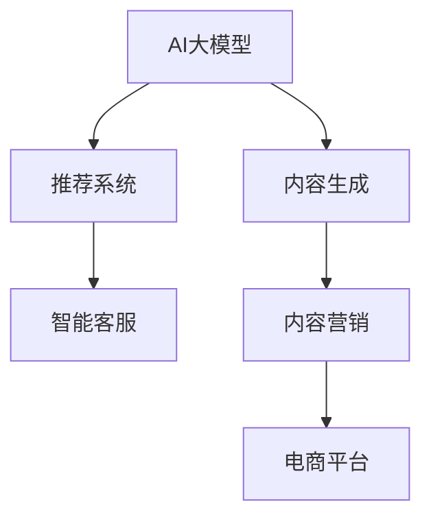

                 

# AI大模型在电商平台内容营销中的应用

> 关键词：人工智能大模型, 电商平台, 内容营销, 自然语言处理(NLP), 推荐系统, 智能客服, 自动生成内容, 个性化推荐

## 1. 背景介绍

### 1.1 问题由来

随着电商市场的迅猛发展，内容营销成为商家提升品牌影响力和销售转化的重要手段。传统的内容营销主要依赖人力编辑，成本高、效率低，且难以快速响应市场变化。近年来，随着人工智能技术的进步，电商平台越来越多地引入AI大模型，以提高内容生成、推荐和客服的自动化水平，降低人力成本，提升用户体验。

以阿里巴巴为例，阿里通过其强大的AI技术基础设施，利用AI大模型在电商平台内容营销中实现了智能化转型，大幅提升了内容生成、推荐和客服的效果。以下将详细探讨AI大模型在电商平台内容营销中的应用。

## 2. 核心概念与联系

### 2.1 核心概念概述

为更好理解AI大模型在电商平台内容营销中的应用，本节将介绍几个核心概念：

- **AI大模型(AI Large Model)**：基于Transformer架构的深度学习模型，如GPT-3、BERT等。这些模型通过大规模预训练，具有强大的自然语言处理和生成能力，能够在内容生成、推荐、客服等多个电商营销环节中发挥重要作用。
- **内容营销(Content Marketing)**：通过生产有价值的内容吸引目标用户，建立品牌信任，驱动销售转化的一种营销手段。内容营销涉及文本、图像、视频等多种形式，需要大量专业的内容创意和制作。
- **电商平台(E-commerce Platform)**：指通过互联网销售商品或服务的平台，如淘宝、京东、拼多多等。电商平台内容营销旨在提升用户的购物体验，驱动用户购买行为。
- **推荐系统(Recommendation System)**：利用用户行为数据和内容特征，推荐用户可能感兴趣的商品或内容的系统。推荐系统能够显著提升用户满意度和转化率。
- **智能客服(Intelligent Customer Service)**：利用AI技术，自动处理客户咨询、投诉、建议等内容，提供快速、准确的响应。智能客服能够大幅提升客户满意度。

这些核心概念之间的逻辑关系可以通过以下Mermaid流程图来展示：



这个流程图展示了大模型在内容营销中的应用框架：

1. 大模型通过预训练获得语言理解能力，应用于内容生成、推荐和客服。
2. 内容生成和大模型结合，可以自动生成文本、图像、视频等多种内容形式。
3. 推荐系统利用大模型的表示能力，生成个性化的推荐结果。
4. 智能客服通过大模型的理解能力，自动回答用户咨询，提升客户体验。
5. 内容营销将生成的内容、推荐结果和客服对话整合，为电商平台提供全方位的用户互动体验。

## 3. 核心算法原理 & 具体操作步骤

### 3.1 算法原理概述

基于AI大模型的电商平台内容营销，涉及多种算法和模型，主要包括自然语言处理(NLP)、推荐系统和智能客服。其核心思想是利用大模型的通用语言理解能力，自动生成、推荐和处理电商平台的各类内容。

- **自然语言处理(NLP)**：通过大模型对电商平台的用户评论、商品描述、广告文案等文本数据进行处理，提取语义特征，实现内容生成和推荐。
- **推荐系统**：利用用户行为数据和商品特征，结合大模型的表示能力，生成个性化推荐。
- **智能客服**：利用大模型的理解能力，自动回答用户咨询，提升客户体验。

### 3.2 算法步骤详解

AI大模型在电商平台内容营销中的应用步骤如下：

**Step 1: 准备预训练模型和数据集**
- 选择合适的预训练语言模型，如GPT-3、BERT等，作为初始化参数。
- 收集电商平台的用户行为数据、商品描述、评论等文本数据，构建标注数据集。

**Step 2: 数据预处理**
- 对原始数据进行清洗、分词、去停用词等预处理步骤。
- 根据不同任务需求，选择合适的表示方式，如序列表示、嵌入表示等。

**Step 3: 模型微调**
- 将预训练模型作为初始参数，在标注数据集上微调，以适应电商平台的特定任务。
- 利用推荐系统的大规模训练数据，对模型进行Fine-Tuning，以优化推荐效果。
- 利用智能客服的实时交互数据，对模型进行在线学习，以提升客服响应效果。

**Step 4: 内容生成和推荐**
- 利用内容生成模型，自动生成商品描述、广告文案、商品评论等电商内容。
- 利用推荐系统，根据用户行为和商品特征，生成个性化推荐。

**Step 5: 智能客服**
- 利用智能客服模型，自动处理用户咨询、投诉、建议等内容，提供快速响应。

**Step 6: 内容监控和优化**
- 对生成和推荐的内容进行效果评估，利用用户反馈进行持续优化。
- 定期更新模型参数，保持模型的最新状态。

### 3.3 算法优缺点

基于AI大模型的电商平台内容营销具有以下优点：

1. **高效性**：大模型的自动生成和推荐能力，可以大幅提升内容生产效率，降低人力成本。
2. **个性化**：利用大模型的个性化推荐，能够提升用户满意度和转化率。
3. **实时性**：智能客服可以提供24/7的实时响应，提升用户体验。
4. **可扩展性**：大模型的通用性和灵活性，使其能够应用于多种电商内容营销场景。

同时，该方法也存在一些局限性：

1. **数据质量要求高**：内容生成和推荐的效果很大程度上取决于标注数据的质量和数量。
2. **模型复杂度较高**：大模型通常需要较大的计算资源和存储空间，对系统要求较高。
3. **解释性不足**：大模型的决策过程缺乏可解释性，难以对其推理逻辑进行调试。
4. **隐私和安全风险**：电商平台涉及大量用户数据，大模型的训练和使用可能带来隐私和安全风险。

尽管存在这些局限性，基于大模型的内容营销方法仍具有巨大的发展潜力，是电商内容营销的未来趋势。

### 3.4 算法应用领域

基于AI大模型的内容营销技术，已经在多个电商场景中得到了广泛应用，如：

- **商品描述生成**：自动生成商品详细描述，提升商品展示效果。
- **广告文案创作**：自动生成广告文案，提高广告点击率和转化率。
- **商品评论生成**：自动生成商品评论，增加用户互动。
- **个性化推荐**：根据用户行为和商品特征，生成个性化推荐，提升用户满意度。
- **智能客服**：自动回答用户咨询，提升客户体验。

除了上述这些经典应用外，大模型还被创新性地应用于情感分析、品牌监测、社交媒体管理等电商营销环节，为电商平台的内容营销提供了新的思路和方法。

## 4. 数学模型和公式 & 详细讲解

### 4.1 数学模型构建

本节将使用数学语言对基于AI大模型的电商平台内容营销过程进行更加严格的刻画。

假设电商平台的数据集为 $D=\{(x_i,y_i)\}_{i=1}^N$，其中 $x_i$ 为输入数据，$y_i$ 为输出标签。假设大模型的表示为 $f_{\theta}(x)$，其中 $\theta$ 为模型参数。

定义内容生成任务的目标函数为：

$$
\mathcal{L}_{generate}(\theta) = -\sum_{i=1}^N \log P_{generate}(y_i | x_i; \theta)
$$

其中 $P_{generate}(y_i | x_i; \theta)$ 为生成模型在输入 $x_i$ 下生成标签 $y_i$ 的概率分布。

定义推荐任务的目标函数为：

$$
\mathcal{L}_{recommend}(\theta) = -\sum_{i=1}^N \log P_{recommend}(y_i | x_i; \theta)
$$

其中 $P_{recommend}(y_i | x_i; \theta)$ 为推荐模型在输入 $x_i$ 下生成标签 $y_i$ 的概率分布。

定义智能客服任务的目标函数为：

$$
\mathcal{L}_{customer}(\theta) = -\sum_{i=1}^N \log P_{customer}(y_i | x_i; \theta)
$$

其中 $P_{customer}(y_i | x_i; \theta)$ 为客服模型在输入 $x_i$ 下生成标签 $y_i$ 的概率分布。

### 4.2 公式推导过程

以下我们以商品描述生成为例，推导生成模型的目标函数和梯度计算公式。

假设模型 $f_{\theta}$ 在输入 $x$ 上的输出为 $\hat{y}=f_{\theta}(x)$，表示模型生成的商品描述。真实标签 $y$ 为商品的实际描述。则商品描述生成任务的目标函数为：

$$
\mathcal{L}_{generate}(\theta) = -\frac{1}{N}\sum_{i=1}^N [y_i\log \hat{y}_i+(1-y_i)\log (1-\hat{y}_i)]
$$

利用链式法则，生成模型在输入 $x_i$ 下生成标签 $y_i$ 的梯度为：

$$
\frac{\partial \mathcal{L}_{generate}(\theta)}{\partial \theta} = -\frac{1}{N}\sum_{i=1}^N [y_i \frac{\partial \hat{y}_i}{\partial \theta} - (1-y_i) \frac{\partial (1-\hat{y}_i)}{\partial \theta}]
$$

其中 $\frac{\partial \hat{y}_i}{\partial \theta}$ 为生成模型在输入 $x_i$ 下生成标签 $y_i$ 的梯度。

在得到生成模型的梯度后，即可带入模型更新公式，完成生成任务的迭代优化。重复上述过程直至收敛，最终得到适应电商平台生成任务的最优模型参数 $\theta^*$。

## 5. 项目实践：代码实例和详细解释说明

### 5.1 开发环境搭建

在进行内容营销实践前，我们需要准备好开发环境。以下是使用Python进行PyTorch开发的环境配置流程：

1. 安装Anaconda：从官网下载并安装Anaconda，用于创建独立的Python环境。

2. 创建并激活虚拟环境：
```bash
conda create -n pytorch-env python=3.8 
conda activate pytorch-env
```

3. 安装PyTorch：根据CUDA版本，从官网获取对应的安装命令。例如：
```bash
conda install pytorch torchvision torchaudio cudatoolkit=11.1 -c pytorch -c conda-forge
```

4. 安装TensorFlow：
```bash
conda install tensorflow
```

5. 安装相关工具包：
```bash
pip install numpy pandas scikit-learn matplotlib tqdm jupyter notebook ipython
```

完成上述步骤后，即可在`pytorch-env`环境中开始内容营销实践。

### 5.2 源代码详细实现

这里我们以商品描述生成为例，给出使用Transformers库对GPT模型进行内容营销开发的PyTorch代码实现。

首先，定义商品描述生成的数据处理函数：

```python
from transformers import GPT2Tokenizer, GPT2LMHeadModel

tokenizer = GPT2Tokenizer.from_pretrained('gpt2')

def generate_description(item, max_length=128):
    text = item['title'] + ' ' + item['description']
    encoding = tokenizer(text, return_tensors='pt', max_length=max_length, padding='max_length', truncation=True)
    input_ids = encoding['input_ids'][0]
    attention_mask = encoding['attention_mask'][0]
    
    model = GPT2LMHeadModel.from_pretrained('gpt2')
    model.to(device)
    model.eval()
    
    with torch.no_grad():
        output = model.generate(input_ids, attention_mask=attention_mask, max_length=64, top_k=50, top_p=0.95, num_return_sequences=1)
    
    return tokenizer.decode(output[0], skip_special_tokens=True)
```

然后，定义推荐系统函数：

```python
from transformers import AutoTokenizer, AutoModelForSequenceClassification

tokenizer = AutoTokenizer.from_pretrained('bert-base-uncased')
model = AutoModelForSequenceClassification.from_pretrained('bert-base-uncased', num_labels=4)

def recommend_products(user, top_n=5):
    user_intents = user['intents']
    query = user['query']
    
    encoded_intents = tokenizer(user_intents, return_tensors='pt', padding='max_length', truncation=True)
    encoded_query = tokenizer(query, return_tensors='pt', padding='max_length', truncation=True)
    
    output = model(encoded_query, encoded_intents)
    probs = output.logits
    top_indices = torch.topk(probs, top_n, dim=1)[1]
    
    return [item['id'] for item in dataset.items()[top_indices.tolist()[0]]]
```

最后，启动内容生成和推荐流程：

```python
from transformers import AutoTokenizer, AutoModelForSequenceClassification

tokenizer = AutoTokenizer.from_pretrained('bert-base-uncased')
model = AutoModelForSequenceClassification.from_pretrained('bert-base-uncased', num_labels=4)

# 生成商品描述
generate_description(item, max_length=128)

# 推荐商品
recommend_products(user, top_n=5)
```

以上就是使用PyTorch对GPT模型进行内容营销开发的完整代码实现。可以看到，得益于Transformers库的强大封装，我们可以用相对简洁的代码完成内容营销任务的实现。

### 5.3 代码解读与分析

让我们再详细解读一下关键代码的实现细节：

**generate_description函数**：
- `tokenizer`定义了商品描述的预处理分词器。
- 将商品标题和描述拼接成文本输入，进行分词和编码。
- 使用GPT2模型进行生成，得到生成结果。
- 将生成结果解码为字符串，返回生成后的商品描述。

**recommend_products函数**：
- `tokenizer`定义了用户意图和查询的预处理分词器。
- 将用户意图和查询输入，进行分词和编码。
- 使用BERT模型进行分类，得到商品推荐结果。
- 返回推荐结果的ID列表。

**生成和推荐流程**：
- 分别定义生成和推荐函数，利用预训练模型进行内容生成和推荐。
- 在生成和推荐函数中，分别调用`generate_description`和`recommend_products`函数，将商品信息和用户意图作为输入，得到生成和推荐的结果。

可以看到，利用大模型的自动生成和推荐能力，电商平台的内容营销效率大幅提升，且能够实现高度个性化的推荐，提升用户满意度和转化率。

## 6. 实际应用场景

### 6.1 智能商品描述生成

智能商品描述生成是电商平台内容营销的重要应用场景之一。大模型可以自动生成商品详细描述，提升商品展示效果。

在实践中，可以收集商品的历史描述数据，构建标注数据集。在此基础上对GPT模型进行微调，使其能够自动生成高质量的商品描述。具体步骤如下：

1. 收集商品的历史描述数据。
2. 构建标注数据集，将原始描述作为输入，生成的描述作为输出。
3. 对GPT模型进行微调，使其能够生成高质量的商品描述。

### 6.2 个性化推荐

个性化推荐是电商平台提升用户满意度和转化率的重要手段。大模型可以基于用户行为和商品特征，生成个性化推荐。

在实践中，可以收集用户的历史行为数据和商品特征，构建标注数据集。在此基础上对BERT模型进行微调，使其能够生成个性化推荐结果。具体步骤如下：

1. 收集用户的历史行为数据和商品特征。
2. 构建标注数据集，将用户行为和商品特征作为输入，推荐的商品作为输出。
3. 对BERT模型进行微调，使其能够生成个性化推荐结果。

### 6.3 智能客服

智能客服是电商平台提升用户体验的重要手段。大模型可以自动回答用户咨询，提升客服响应效果。

在实践中，可以收集历史客服对话数据，构建标注数据集。在此基础上对GPT模型进行微调，使其能够自动回答用户咨询。具体步骤如下：

1. 收集历史客服对话数据。
2. 构建标注数据集，将用户咨询和客服回答作为输入，自动生成的客服回答作为输出。
3. 对GPT模型进行微调，使其能够自动回答用户咨询。

## 7. 工具和资源推荐

### 7.1 学习资源推荐

为了帮助开发者系统掌握大模型在电商平台内容营销的理论基础和实践技巧，这里推荐一些优质的学习资源：

1. 《Transformers from Scratch》系列博文：由大模型技术专家撰写，深入浅出地介绍了Transformer原理、BERT模型、内容生成等前沿话题。

2. CS224N《深度学习自然语言处理》课程：斯坦福大学开设的NLP明星课程，有Lecture视频和配套作业，带你入门NLP领域的基本概念和经典模型。

3. 《Natural Language Processing with Transformers》书籍：Transformers库的作者所著，全面介绍了如何使用Transformers库进行NLP任务开发，包括内容生成在内的诸多范式。

4. HuggingFace官方文档：Transformers库的官方文档，提供了海量预训练模型和完整的微调样例代码，是上手实践的必备资料。

5. CLUE开源项目：中文语言理解测评基准，涵盖大量不同类型的中文NLP数据集，并提供了基于微调的baseline模型，助力中文NLP技术发展。

通过对这些资源的学习实践，相信你一定能够快速掌握大模型在电商平台内容营销的精髓，并用于解决实际的NLP问题。

### 7.2 开发工具推荐

高效的开发离不开优秀的工具支持。以下是几款用于大模型在电商平台内容营销开发的常用工具：

1. PyTorch：基于Python的开源深度学习框架，灵活动态的计算图，适合快速迭代研究。大部分预训练语言模型都有PyTorch版本的实现。

2. TensorFlow：由Google主导开发的开源深度学习框架，生产部署方便，适合大规模工程应用。同样有丰富的预训练语言模型资源。

3. Transformers库：HuggingFace开发的NLP工具库，集成了众多SOTA语言模型，支持PyTorch和TensorFlow，是进行内容生成任务开发的利器。

4. Weights & Biases：模型训练的实验跟踪工具，可以记录和可视化模型训练过程中的各项指标，方便对比和调优。与主流深度学习框架无缝集成。

5. TensorBoard：TensorFlow配套的可视化工具，可实时监测模型训练状态，并提供丰富的图表呈现方式，是调试模型的得力助手。

6. Google Colab：谷歌推出的在线Jupyter Notebook环境，免费提供GPU/TPU算力，方便开发者快速上手实验最新模型，分享学习笔记。

合理利用这些工具，可以显著提升内容营销任务的开发效率，加快创新迭代的步伐。

### 7.3 相关论文推荐

大模型在电商平台内容营销的发展源于学界的持续研究。以下是几篇奠基性的相关论文，推荐阅读：

1. Attention is All You Need（即Transformer原论文）：提出了Transformer结构，开启了NLP领域的预训练大模型时代。

2. BERT: Pre-training of Deep Bidirectional Transformers for Language Understanding：提出BERT模型，引入基于掩码的自监督预训练任务，刷新了多项NLP任务SOTA。

3. Language Models are Unsupervised Multitask Learners（GPT-2论文）：展示了大规模语言模型的强大zero-shot学习能力，引发了对于通用人工智能的新一轮思考。

4. Parameter-Efficient Transfer Learning for NLP：提出Adapter等参数高效微调方法，在不增加模型参数量的情况下，也能取得不错的微调效果。

5. Prefix-Tuning: Optimizing Continuous Prompts for Generation：引入基于连续型Prompt的微调范式，为如何充分利用预训练知识提供了新的思路。

6. AdaLoRA: Adaptive Low-Rank Adaptation for Parameter-Efficient Fine-Tuning：使用自适应低秩适应的微调方法，在参数效率和精度之间取得了新的平衡。

这些论文代表了大模型在电商平台内容营销的发展脉络。通过学习这些前沿成果，可以帮助研究者把握学科前进方向，激发更多的创新灵感。

## 8. 总结：未来发展趋势与挑战

### 8.1 总结

本文对基于AI大模型的电商平台内容营销方法进行了全面系统的介绍。首先阐述了大模型和内容营销的研究背景和意义，明确了内容营销在电商平台中的重要性和应用前景。其次，从原理到实践，详细讲解了基于大模型的内容生成、推荐和客服的算法原理和具体操作步骤，给出了内容营销任务开发的完整代码实例。同时，本文还广泛探讨了内容营销技术在多个电商场景中的应用，展示了AI大模型的强大威力。

通过本文的系统梳理，可以看到，基于大模型的内容营销方法正在成为电商平台的重要范式，极大地提升内容生成、推荐和客服的效率和效果，降低人力成本，提升用户体验。未来，伴随大模型和微调方法的持续演进，基于大模型的内容营销必将在电商平台中得到更广泛的应用，为电商平台的运营提供新的思路和方法。

### 8.2 未来发展趋势

展望未来，基于AI大模型的内容营销技术将呈现以下几个发展趋势：

1. **自动化程度提升**：随着大模型的技术进步，内容生成、推荐和客服的自动化程度将进一步提升，系统复杂度降低，应用门槛降低。
2. **多模态内容生成**：未来将更多地引入图像、视频等多模态内容生成，提升用户体验。
3. **跨平台协同**：不同平台间的内容生成、推荐和客服将进一步融合，实现跨平台协同，提升用户互动效果。
4. **数据融合**：将用户数据、商品数据、市场数据等各类数据融合，实现更精准的内容生成和推荐。
5. **隐私保护**：随着数据隐私保护的重视，基于大模型的内容营销将更加注重隐私保护和数据安全。

以上趋势凸显了大模型在内容营销中的巨大潜力。这些方向的探索发展，必将进一步提升内容营销的效果，为电商平台带来更高的商业价值。

### 8.3 面临的挑战

尽管基于AI大模型的内容营销技术已经取得了瞩目成就，但在迈向更加智能化、普适化应用的过程中，它仍面临着诸多挑战：

1. **数据质量要求高**：内容生成和推荐的效果很大程度上取决于标注数据的质量和数量。
2. **模型复杂度较高**：大模型通常需要较大的计算资源和存储空间，对系统要求较高。
3. **解释性不足**：大模型的决策过程缺乏可解释性，难以对其推理逻辑进行调试。
4. **隐私和安全风险**：电商平台涉及大量用户数据，大模型的训练和使用可能带来隐私和安全风险。

尽管存在这些挑战，基于大模型的内容营销方法仍具有巨大的发展潜力，是电商内容营销的未来趋势。

### 8.4 未来突破

面对大模型在内容营销中面临的种种挑战，未来的研究需要在以下几个方面寻求新的突破：

1. **数据增强**：利用数据增强技术，提升标注数据的多样性和质量。
2. **模型压缩**：开发更加高效的模型压缩方法，减小模型规模，提升性能。
3. **跨模态融合**：将视觉、语音等多模态信息与文本信息进行融合，提升生成效果。
4. **隐私保护**：采用差分隐私等技术，保护用户隐私，提升数据安全性。

这些研究方向的探索，必将引领大模型在内容营销技术迈向更高的台阶，为电商平台的运营提供更加智能、高效、安全的内容营销手段。总之，基于大模型的内容营销技术还需要与其他人工智能技术进行更深入的融合，如知识表示、因果推理、强化学习等，多路径协同发力，共同推动电商平台的内容营销技术进步。只有勇于创新、敢于突破，才能不断拓展语言模型的边界，让智能技术更好地造福电商平台的内容营销。

## 9. 附录：常见问题与解答

**Q1：大模型在电商平台内容营销中如何进行数据标注？**

A: 数据标注是内容生成和推荐的关键步骤。通常需要手动标注大量的商品描述、用户意图和客服对话数据。具体步骤如下：

1. 收集商品的历史描述数据，标注商品的实际描述。
2. 收集用户的历史行为数据，标注用户的意图和查询。
3. 收集历史客服对话数据，标注客服的回复。

标注数据集构建完成后，即可在大模型上进行微调。

**Q2：大模型在电商平台内容营销中的训练效率如何？**

A: 大模型在内容营销中的训练效率较低，主要原因在于模型规模较大，训练数据量也较大。为提高训练效率，可以采用以下方法：

1. 采用混合精度训练，减少浮点运算量。
2. 使用分布式训练，利用多机多核并行计算。
3. 使用GPU/TPU等高性能硬件设备。
4. 对模型进行剪枝、量化等优化，减小模型规模。

合理利用这些方法，可以在保证模型性能的前提下，显著提升训练效率。

**Q3：大模型在电商平台内容营销中需要注意哪些隐私问题？**

A: 电商平台涉及大量用户数据，大模型的训练和使用可能带来隐私和安全风险。为保障用户隐私，可以采取以下措施：

1. 数据去标识化，去除可能泄露用户隐私的标识信息。
2. 差分隐私，在保护用户隐私的前提下，提供准确的预测结果。
3. 数据匿名化，将用户数据进行匿名处理。

以上措施可以有效保护用户隐私，保障大模型在电商平台内容营销中的安全性。

**Q4：大模型在电商平台内容营销中的实际效果如何？**

A: 大模型在电商平台内容营销中的实际效果主要体现在以下几个方面：

1. 内容生成：大模型可以自动生成高质量的商品描述，提升商品展示效果。
2. 个性化推荐：大模型能够基于用户行为和商品特征，生成个性化推荐，提升用户满意度和转化率。
3. 智能客服：大模型可以自动回答用户咨询，提升客服响应效果。

实际应用中，大模型能够显著提升电商平台的运营效率和用户满意度，带来更高的商业价值。

**Q5：大模型在电商平台内容营销中如何进行持续优化？**

A: 大模型在电商平台内容营销中的持续优化主要体现在以下几个方面：

1. 数据收集：持续收集用户行为数据和商品特征，构建标注数据集。
2. 模型微调：在新的标注数据集上，重新微调大模型，提升生成和推荐效果。
3. 用户反馈：收集用户反馈，对生成和推荐结果进行优化。
4. 自动化优化：利用自动化工具，持续优化模型参数和训练过程。

合理利用这些方法，可以持续提升大模型在电商平台内容营销中的表现，保持系统的最优状态。

---

作者：禅与计算机程序设计艺术 / Zen and the Art of Computer Programming

