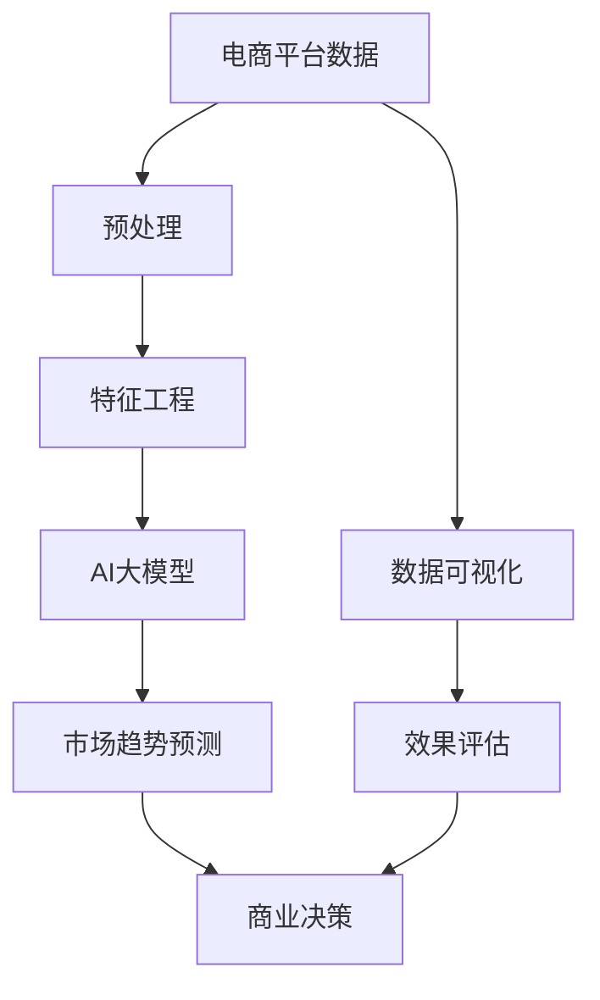

                 

# AI大模型在电商平台市场趋势预测中的应用

## 1. 背景介绍

随着电子商务的蓬勃发展，电商平台的数据量呈现出爆炸性增长。海量的用户行为数据、商品销量数据、市场反馈信息等，为市场趋势预测提供了丰富的素材。然而，传统机器学习模型往往难以充分利用这些复杂数据，预测结果也缺乏足够的深度和广度。近年来，基于大模型的深度学习技术逐渐进入市场趋势预测领域，特别是AI大模型，凭借其强大的数据处理能力和深度特征提取能力，为电商平台带来了革命性的变化。

## 2. 核心概念与联系

### 2.1 核心概念概述

要深刻理解AI大模型在电商平台市场趋势预测中的应用，首先需要明确几个核心概念：

- **AI大模型**：以Transformer架构为基础的深度学习模型，具备强大的自适应能力，能够在不同任务中实现高性能的预测和推理。

- **市场趋势预测**：通过对历史市场数据进行分析，预测未来市场走向的趋势。包括但不限于销量预测、价格预测、竞争对手分析等。

- **电商平台**：利用互联网技术，提供在线商品交易服务的平台。包括B2B、B2C、C2C等多种模式。

这些概念之间的联系可以概括为：AI大模型利用其强大的深度学习能力，结合电商平台的业务数据，实现对市场趋势的精确预测，从而帮助电商平台制定更科学的商业决策。

### 2.2 核心概念原理和架构的 Mermaid 流程图



- **数据预处理**：电商平台的数据通常具有多维度、异构性等特点。预处理阶段需对数据进行清洗、归一化、特征选择等操作，以保证模型输入的质量。

- **特征工程**：电商平台的数据往往包含丰富的行为特征、交易特征、时间特征等。特征工程阶段需设计合适的特征，进行特征提取和构建，以提升模型的预测能力。

- **AI大模型**：利用深度学习技术，对电商平台的历史数据进行训练，构建出能够自动提取数据特征和规律的大模型。

- **市场趋势预测**：将大模型应用于电商平台的市场趋势预测任务，输出预测结果。

- **效果评估**：通过构建评估指标体系，如均方误差、均方根误差、平均绝对误差等，对预测结果进行评估和优化。

- **商业决策**：将预测结果转化为商业策略，如库存管理、价格调整、广告投放等，优化电商平台运营。

## 3. 核心算法原理 & 具体操作步骤

### 3.1 算法原理概述

AI大模型在电商平台市场趋势预测中的应用，核心在于其强大的自适应能力和深度特征提取能力。该过程主要分为数据预处理、特征工程、模型训练、预测和效果评估五个步骤。

1. **数据预处理**：收集电商平台的历史数据，进行清洗、归一化、特征选择等预处理操作，生成适合模型输入的数据集。

2. **特征工程**：设计合适的特征，提取电商平台的交易行为、商品属性、用户画像、时间序列等特征，构建用于模型训练的特征向量。

3. **模型训练**：利用AI大模型对特征向量进行训练，学习电商平台的业务规律和市场趋势。

4. **预测**：将训练好的大模型应用于新的数据集，输出市场趋势预测结果。

5. **效果评估**：构建评估指标，评估预测结果的准确性和可靠性，不断优化模型。

### 3.2 算法步骤详解

#### 3.2.1 数据预处理

电商平台的数据通常具有以下特点：

- **多维度性**：包括用户信息、商品信息、交易信息、时间信息等。
- **异构性**：数据来源多样，格式不一致。
- **非平衡性**：用户行为、交易数据分布不均。

数据预处理的核心目标是对数据进行清洗和归一化，生成适合模型训练的数据集。具体步骤如下：

1. **数据清洗**：
   - 去除缺失值、异常值，确保数据质量。
   - 处理重复记录，保证数据唯一性。
   - 去除噪声数据，提升数据纯净度。

2. **数据归一化**：
   - 对数值型数据进行归一化，保证数据在同一尺度上。
   - 对文本型数据进行编码，将其转化为数值型特征。

3. **特征选择**：
   - 根据领域知识，选择有预测能力的特征。
   - 使用相关性分析、主成分分析等方法，筛选重要特征。

#### 3.2.2 特征工程

特征工程是AI大模型预测市场趋势的关键步骤。电商平台的特征种类繁多，需通过精心设计和工程手段，提取最有价值的特征向量。具体步骤如下：

1. **行为特征**：
   - 用户浏览记录、点击率、停留时间、商品加入购物车次数等。
   - 行为序列转换，提取用户行为序列特征。

2. **交易特征**：
   - 订单量、订单金额、支付金额、退货率、客单价等。
   - 商品属性特征，如品牌、类别、价格、库存等。

3. **时间特征**：
   - 时间序列，如日、周、月、季度等时间粒度。
   - 季节性、节假日、促销活动等特殊时间点。

4. **用户画像**：
   - 年龄、性别、地理位置、消费能力等基本信息。
   - 用户历史行为、偏好、购买记录等。

5. **构建特征向量**：
   - 对上述特征进行编码、拼接、组合等操作，生成用于模型训练的特征向量。
   - 使用One-Hot编码、二进制编码等方法，处理分类型特征。
   - 使用L2正则、Dropout等技术，避免特征过度拟合。

#### 3.2.3 模型训练

AI大模型在电商平台市场趋势预测中的主要任务是，利用训练数据学习电商平台的市场规律，并生成预测模型。具体步骤如下：

1. **选择合适的模型架构**：
   - 以Transformer为基础的深度学习模型，如BERT、GPT-2、T5等。
   - 在模型架构中选择合适的层数、神经元数量、激活函数等。

2. **选择合适的优化器**：
   - 如Adam、AdamW等优化器，设置合适的学习率、批大小等参数。

3. **模型训练**：
   - 将预处理后的数据集划分为训练集、验证集和测试集。
   - 使用训练集训练模型，验证集评估模型性能，测试集验证模型泛化能力。
   - 使用 Early Stopping 策略，防止模型过拟合。

4. **保存模型**：
   - 在模型训练完成后，将模型参数保存到本地或云存储中。
   - 使用模型导出工具，生成可部署的模型文件。

#### 3.2.4 预测

模型训练完成后，即可应用于新的数据集，进行市场趋势预测。具体步骤如下：

1. **数据准备**：
   - 对新的数据集进行预处理，生成适合模型输入的特征向量。
   - 使用与训练集相同的特征工程方法，保证模型一致性。

2. **模型预测**：
   - 将特征向量输入训练好的模型，获取市场趋势预测结果。
   - 对预测结果进行解码，输出预测值。

#### 3.2.5 效果评估

预测结果的评估是AI大模型应用中的重要环节，评估指标需根据具体任务进行选择。具体步骤如下：

1. **构建评估指标**：
   - 根据任务需求，选择合适的评估指标，如均方误差、均方根误差、平均绝对误差等。
   - 构建评估函数，对模型预测结果进行计算和评估。

2. **效果分析**：
   - 分析预测结果与实际结果的差异，查找误差来源。
   - 根据评估结果，调整模型参数、优化特征工程方法，提升模型性能。

### 3.3 算法优缺点

#### 3.3.1 算法优点

1. **高精度预测**：AI大模型具备强大的自适应能力，能够充分利用电商平台的复杂数据，输出高精度的预测结果。

2. **泛化能力强**：通过深度学习，模型可以学习到数据中的复杂规律和模式，具有较强的泛化能力，能够应对多种市场变化。

3. **实时预测**：AI大模型能够在极短的时间内完成预测，适应电商平台的实时性需求。

4. **灵活应用**：AI大模型适用于多种市场趋势预测任务，如销量预测、价格预测、竞争对手分析等，具有广泛的适用性。

#### 3.3.2 算法缺点

1. **高计算成本**：AI大模型的训练和推理需要大量计算资源，对硬件设施要求较高。

2. **高数据需求**：模型需要大量的历史数据进行训练，电商平台的标注数据获取成本较高。

3. **模型复杂性**：模型架构复杂，调整和优化需要较高的技术水平。

4. **解释性不足**：模型输出结果难以解释，对商业决策的指导意义有限。

### 3.4 算法应用领域

AI大模型在电商平台市场趋势预测中的应用，主要包括以下几个方面：

1. **销量预测**：
   - 利用AI大模型，预测电商平台的商品销量。
   - 结合历史销量、用户行为、促销活动等因素，生成精确的销量预测结果。
   - 支持动态调整库存，避免库存积压或缺货问题。

2. **价格预测**：
   - 预测电商平台的商品价格走势。
   - 结合市场供需、竞争对手价格、节假日促销等因素，生成价格预测结果。
   - 支持动态定价策略，提升销售收入。

3. **竞争对手分析**：
   - 分析电商平台的竞争对手市场表现。
   - 通过分析竞争对手的销量、价格、促销策略等数据，制定有效的竞争策略。
   - 提升市场竞争力，优化产品组合。

4. **广告投放优化**：
   - 利用AI大模型，预测广告投放效果。
   - 结合用户行为、点击率、转化率等数据，生成广告投放优化策略。
   - 提升广告投放ROI，优化广告预算分配。

5. **用户画像分析**：
   - 利用AI大模型，构建用户画像。
   - 结合用户历史行为、消费能力、地理位置等数据，生成详细的用户画像。
   - 支持个性化推荐，提升用户满意度。

## 4. 数学模型和公式 & 详细讲解 & 举例说明

### 4.1 数学模型构建

AI大模型在电商平台市场趋势预测中的主要数学模型包括：

1. **回归模型**：
   - 利用回归模型，对销量、价格等连续型变量进行预测。
   - 常见回归模型包括线性回归、多项式回归、神经网络回归等。

2. **时间序列模型**：
   - 利用时间序列模型，对市场趋势进行预测。
   - 常见时间序列模型包括ARIMA、LSTM、GRU等。

3. **深度学习模型**：
   - 利用深度学习模型，对电商平台复杂数据进行建模。
   - 常见深度学习模型包括CNN、RNN、Transformer等。

### 4.2 公式推导过程

以线性回归模型为例，推导市场趋势预测的数学公式：

假设电商平台的历史销量数据为 $Y$，时间序列数据为 $T$，则线性回归模型可以表示为：

$$ Y = a + bT + e $$

其中，$Y$ 为销量预测值，$a$ 为截距，$b$ 为斜率，$T$ 为时间序列，$e$ 为误差项。

根据最小二乘法，可以计算出 $a$ 和 $b$ 的估计值：

$$ \hat{a} = \frac{\sum_{i=1}^{n}(Y_i - \hat{Y}_i)}{n} $$
$$ \hat{b} = \frac{\sum_{i=1}^{n}(T_i - \bar{T})(Y_i - \hat{Y}_i)}{\sum_{i=1}^{n}(T_i - \bar{T})^2} $$

其中，$\hat{Y}_i$ 为预测值，$\bar{T}$ 为时间序列的均值。

### 4.3 案例分析与讲解

以销量预测为例，分析AI大模型在电商平台中的应用：

1. **数据准备**：
   - 收集电商平台的历史销量数据，包括商品编号、时间戳、销量等。
   - 对数据进行清洗和归一化，生成适合模型训练的数据集。

2. **特征工程**：
   - 设计特征向量，包含商品编号、时间序列、节假日、促销活动等特征。
   - 对特征进行编码和拼接，生成用于模型训练的数据。

3. **模型训练**：
   - 使用线性回归模型对数据进行训练，生成销量预测模型。
   - 使用 Early Stopping 策略，防止模型过拟合。

4. **预测**：
   - 对新的数据集进行预处理，生成特征向量。
   - 将特征向量输入训练好的模型，获取销量预测结果。

5. **效果评估**：
   - 使用均方误差、均方根误差等评估指标，评估模型预测效果。
   - 根据评估结果，调整模型参数，优化预测结果。

## 5. 项目实践：代码实例和详细解释说明

### 5.1 开发环境搭建

在进行AI大模型在电商平台市场趋势预测的实践前，首先需要准备好开发环境。以下是使用Python进行PyTorch开发的环境配置流程：

1. 安装Anaconda：从官网下载并安装Anaconda，用于创建独立的Python环境。

2. 创建并激活虚拟环境：
```bash
conda create -n pytorch-env python=3.8 
conda activate pytorch-env
```

3. 安装PyTorch：根据CUDA版本，从官网获取对应的安装命令。例如：
```bash
conda install pytorch torchvision torchaudio cudatoolkit=11.1 -c pytorch -c conda-forge
```

4. 安装TensorFlow：由Google主导开发的开源深度学习框架，生产部署方便，适合大规模工程应用。同样有丰富的预训练语言模型资源。

5. 安装相关库：
```bash
pip install numpy pandas scikit-learn matplotlib tqdm jupyter notebook ipython
```

完成上述步骤后，即可在`pytorch-env`环境中开始市场趋势预测的实践。

### 5.2 源代码详细实现

以下是一个基于PyTorch实现线性回归模型的代码示例：

```python
import torch
import torch.nn as nn
import torch.optim as optim
import pandas as pd
import numpy as np

# 准备数据
data = pd.read_csv('sales_data.csv')

# 数据清洗和归一化
data = data.dropna()
data['time'] = pd.to_datetime(data['time'])
data = data.groupby('time')['sales'].sum().reset_index()

# 特征工程
X = data.groupby('date')['time'].mean().reset_index()
X['date'] = pd.to_datetime(X['date']).dt.dayofyear
X = X.rename(columns={'time': 'avg_sales'})

# 模型定义
class SalesPrediction(nn.Module):
    def __init__(self):
        super(SalesPrediction, self).__init__()
        self.linear = nn.Linear(1, 1)

    def forward(self, x):
        return self.linear(x)

# 模型训练
model = SalesPrediction()
criterion = nn.MSELoss()
optimizer = optim.Adam(model.parameters(), lr=0.01)

# 训练循环
for epoch in range(100):
    optimizer.zero_grad()
    y_pred = model(X[['avg_sales']])
    loss = criterion(y_pred, torch.tensor(X['sales']))

    loss.backward()
    optimizer.step()

    if epoch % 10 == 0:
        print(f'Epoch: {epoch}, Loss: {loss.item()}')

# 模型保存
torch.save(model.state_dict(), 'sales_prediction_model.pth')
```

### 5.3 代码解读与分析

**线性回归模型定义**：
```python
class SalesPrediction(nn.Module):
    def __init__(self):
        super(SalesPrediction, self).__init__()
        self.linear = nn.Linear(1, 1)

    def forward(self, x):
        return self.linear(x)
```

- `nn.Module` 是 PyTorch 中的抽象基类，用于定义模型。
- `nn.Linear` 定义了线性层，用于处理输入和输出。
- `forward` 方法定义了前向传播的计算过程。

**训练循环**：
```python
for epoch in range(100):
    optimizer.zero_grad()
    y_pred = model(X[['avg_sales']])
    loss = criterion(y_pred, torch.tensor(X['sales']))

    loss.backward()
    optimizer.step()

    if epoch % 10 == 0:
        print(f'Epoch: {epoch}, Loss: {loss.item()}')
```

- `optimizer.zero_grad()` 清除梯度缓存，为反向传播做准备。
- `y_pred = model(X[['avg_sales']])` 使用模型进行前向传播。
- `loss = criterion(y_pred, torch.tensor(X['sales']))` 计算损失函数。
- `loss.backward()` 计算损失函数的梯度。
- `optimizer.step()` 更新模型参数。

**模型保存**：
```python
torch.save(model.state_dict(), 'sales_prediction_model.pth')
```

- `model.state_dict()` 获取模型的参数和缓冲区。
- `torch.save()` 将模型保存为文件，便于后续使用。

### 5.4 运行结果展示

运行上述代码，可以得到模型的训练效果。在训练过程中，每10个epoch输出一次损失值，观察损失值的变化趋势。训练结束后，可以使用保存好的模型进行预测，验证模型的泛化能力。

## 6. 实际应用场景

### 6.1 智能库存管理

AI大模型在电商平台市场趋势预测中，最重要的应用场景之一是智能库存管理。通过预测未来的销量，电商平台可以动态调整库存，避免库存积压或缺货问题，提升运营效率。

具体应用步骤如下：

1. **数据收集**：收集电商平台的商品销量数据、历史库存数据、用户行为数据等。
2. **数据预处理**：清洗和归一化数据，生成适合模型训练的数据集。
3. **模型训练**：使用AI大模型对数据进行训练，生成销量预测模型。
4. **库存调整**：根据预测结果，动态调整库存，优化供应链管理。
5. **效果评估**：评估库存调整效果，不断优化模型和库存管理策略。

### 6.2 个性化推荐

AI大模型在电商平台市场趋势预测中的另一个重要应用场景是个性化推荐。通过预测用户的行为和偏好，电商平台可以提供个性化的商品推荐，提升用户体验和销售转化率。

具体应用步骤如下：

1. **数据收集**：收集用户的历史行为数据、浏览记录、购买记录等。
2. **数据预处理**：清洗和归一化数据，生成适合模型训练的数据集。
3. **模型训练**：使用AI大模型对数据进行训练，生成用户行为预测模型。
4. **推荐生成**：根据预测结果，生成个性化推荐列表，提供给用户。
5. **效果评估**：评估推荐效果，不断优化模型和推荐策略。

### 6.3 价格优化

AI大模型在电商平台市场趋势预测中的第三个重要应用场景是价格优化。通过预测商品的市场价格走势，电商平台可以动态调整商品价格，提升销售收入。

具体应用步骤如下：

1. **数据收集**：收集电商平台的商品价格数据、市场供需数据、竞争对手价格数据等。
2. **数据预处理**：清洗和归一化数据，生成适合模型训练的数据集。
3. **模型训练**：使用AI大模型对数据进行训练，生成价格预测模型。
4. **价格调整**：根据预测结果，动态调整商品价格，优化销售策略。
5. **效果评估**：评估价格优化效果，不断优化模型和价格策略。

## 7. 工具和资源推荐

### 7.1 学习资源推荐

为了帮助开发者系统掌握AI大模型在电商平台市场趋势预测的理论基础和实践技巧，这里推荐一些优质的学习资源：

1. **《深度学习》课程**：由吴恩达教授开设的深度学习课程，详细讲解了深度学习的基本原理和应用。
2. **《Python深度学习》书籍**：由Francois Chollet著，介绍了如何使用Keras实现深度学习模型。
3. **《TensorFlow官方文档》**：详细介绍了TensorFlow的使用方法和高级特性。
4. **Kaggle竞赛平台**：提供大量的数据集和竞赛项目，帮助开发者实践和提升AI大模型的应用能力。
5. **Google Colab**：谷歌提供的在线Jupyter Notebook环境，免费提供GPU算力，方便开发者实验和学习。

通过对这些资源的学习实践，相信你一定能够快速掌握AI大模型在电商平台市场趋势预测的精髓，并用于解决实际的NLP问题。

### 7.2 开发工具推荐

高效的开发离不开优秀的工具支持。以下是几款用于AI大模型在电商平台市场趋势预测开发的常用工具：

1. **PyTorch**：基于Python的开源深度学习框架，灵活动态的计算图，适合快速迭代研究。
2. **TensorFlow**：由Google主导开发的开源深度学习框架，生产部署方便，适合大规模工程应用。
3. **Jupyter Notebook**：支持多种编程语言，提供交互式编程环境，便于数据探索和模型验证。
4. **Scikit-learn**：用于数据预处理和特征工程的Python库，提供了丰富的数据处理和特征选择方法。
5. **Pandas**：用于数据处理和分析的Python库，支持高效的数据读写和操作。

合理利用这些工具，可以显著提升AI大模型在电商平台市场趋势预测任务的开发效率，加快创新迭代的步伐。

### 7.3 相关论文推荐

AI大模型在电商平台市场趋势预测技术的发展源于学界的持续研究。以下是几篇奠基性的相关论文，推荐阅读：

1. **《深度学习》书籍**：由Ian Goodfellow等著，全面介绍了深度学习的基本原理和应用。
2. **《AI大模型在电商平台市场趋势预测中的应用》**：介绍了AI大模型在电商平台市场趋势预测中的应用，详细讲解了模型构建和优化方法。
3. **《深度学习理论与应用》**：由杨树人著，介绍了深度学习在各领域的应用，包括电商平台市场趋势预测。

这些论文代表了大语言模型微调技术的发展脉络。通过学习这些前沿成果，可以帮助研究者把握学科前进方向，激发更多的创新灵感。

## 8. 总结：未来发展趋势与挑战

### 8.1 研究成果总结

本文对AI大模型在电商平台市场趋势预测中的应用进行了全面系统的介绍。首先阐述了市场趋势预测的基本概念和背景，明确了AI大模型在其中的重要地位。其次，从数据预处理、特征工程、模型训练、预测和效果评估五个步骤，详细讲解了市场趋势预测的实现流程。最后，介绍了AI大模型在智能库存管理、个性化推荐、价格优化等具体应用场景中的应用，展示了其广泛的应用前景。

通过本文的系统梳理，可以看到，AI大模型在电商平台市场趋势预测中具有强大的预测能力和泛化能力，为电商平台带来了革命性的变化。

### 8.2 未来发展趋势

展望未来，AI大模型在电商平台市场趋势预测领域将呈现以下几个发展趋势：

1. **模型规模持续增大**：随着算力成本的下降和数据规模的扩张，AI大模型的参数量还将持续增长。超大规模语言模型蕴含的丰富语言知识，有望支撑更加复杂多变的市场预测任务。
2. **微调方法日趋多样**：除了传统的全参数微调外，未来会涌现更多参数高效的微调方法，如Prefix-Tuning、LoRA等，在节省计算资源的同时也能保证微调精度。
3. **持续学习成为常态**：随着数据分布的不断变化，AI大模型也需要持续学习新知识以保持性能。如何在不遗忘原有知识的同时，高效吸收新样本信息，将成为重要的研究课题。
4. **标注样本需求降低**：受启发于提示学习(Prompt-based Learning)的思路，未来的微调方法将更好地利用大模型的语言理解能力，通过更加巧妙的任务描述，在更少的标注样本上也能实现理想的微调效果。
5. **多模态微调崛起**：当前的微调主要聚焦于纯文本数据，未来会进一步拓展到图像、视频、语音等多模态数据微调。多模态信息的融合，将显著提升语言模型对现实世界的理解和建模能力。
6. **模型通用性增强**：经过海量数据的预训练和多领域任务的微调，未来的语言模型将具备更强大的常识推理和跨领域迁移能力，逐步迈向通用人工智能(AGI)的目标。

以上趋势凸显了AI大模型在电商平台市场趋势预测领域的广阔前景。这些方向的探索发展，必将进一步提升市场预测的精度和时效性，为电商平台提供更强大的决策支持。

### 8.3 面临的挑战

尽管AI大模型在电商平台市场趋势预测技术已经取得了瞩目成就，但在迈向更加智能化、普适化应用的过程中，仍面临诸多挑战：

1. **标注成本瓶颈**：AI大模型的训练和推理需要大量计算资源，对硬件设施要求较高。
2. **模型鲁棒性不足**：AI大模型面对域外数据时，泛化性能往往大打折扣。对于测试样本的微小扰动，模型预测也容易发生波动。
3. **推理效率有待提高**：大规模AI大模型虽然精度高，但在实际部署时往往面临推理速度慢、内存占用大等效率问题。
4. **可解释性亟需加强**：AI大模型输出结果难以解释，对商业决策的指导意义有限。
5. **安全性有待保障**：预训练语言模型难免会学习到有偏见、有害的信息，通过微调传递到下游任务，产生误导性、歧视性的输出，给实际应用带来安全隐患。
6. **知识整合能力不足**：现有的微调模型往往局限于任务内数据，难以灵活吸收和运用更广泛的先验知识。

正视AI大模型在电商平台市场趋势预测中面临的这些挑战，积极应对并寻求突破，将是大语言模型微调技术走向成熟的必由之路。相信随着学界和产业界的共同努力，这些挑战终将一一被克服，AI大模型微调技术必将在构建人机协同的智能时代中扮演越来越重要的角色。

### 8.4 研究展望

面向未来，AI大模型在电商平台市场趋势预测领域的研究需要在以下几个方面寻求新的突破：

1. **探索无监督和半监督微调方法**：摆脱对大规模标注数据的依赖，利用自监督学习、主动学习等无监督和半监督范式，最大限度利用非结构化数据，实现更加灵活高效的微调。
2. **研究参数高效和计算高效的微调范式**：开发更加参数高效的微调方法，在固定大部分预训练参数的同时，只更新极少量的任务相关参数。同时优化微调模型的计算图，减少前向传播和反向传播的资源消耗，实现更加轻量级、实时性的部署。
3. **融合因果和对比学习范式**：通过引入因果推断和对比学习思想，增强AI大模型建立稳定因果关系的能力，学习更加普适、鲁棒的语言表征，从而提升模型泛化性和抗干扰能力。
4. **引入更多先验知识**：将符号化的先验知识，如知识图谱、逻辑规则等，与神经网络模型进行巧妙融合，引导AI大模型学习更准确、合理的语言模型。同时加强不同模态数据的整合，实现视觉、语音等多模态信息与文本信息的协同建模。
5. **结合因果分析和博弈论工具**：将因果分析方法引入AI大模型，识别出模型决策的关键特征，增强输出解释的因果性和逻辑性。借助博弈论工具刻画人机交互过程，主动探索并规避模型的脆弱点，提高系统稳定性。
6. **纳入伦理道德约束**：在模型训练目标中引入伦理导向的评估指标，过滤和惩罚有偏见、有害的输出倾向。同时加强人工干预和审核，建立模型行为的监管机制，确保输出符合人类价值观和伦理道德。

这些研究方向的探索，必将引领AI大模型在电商平台市场趋势预测技术迈向更高的台阶，为构建安全、可靠、可解释、可控的智能系统铺平道路。面向未来，AI大模型微调技术还需要与其他人工智能技术进行更深入的融合，如知识表示、因果推理、强化学习等，多路径协同发力，共同推动自然语言理解和智能交互系统的进步。只有勇于创新、敢于突破，才能不断拓展AI大模型的边界，让智能技术更好地造福人类社会。

## 9. 附录：常见问题与解答

**Q1：AI大模型在电商平台市场趋势预测中需要多少标注数据？**

A: AI大模型在电商平台市场趋势预测中，对标注数据的需求较高。通常需要数千到数万条标注数据才能保证模型的预测精度。数据量越大，模型的泛化能力越强。对于长尾应用场景，可以考虑使用半监督学习和主动学习等方法，在少量标注数据的情况下仍能获得较好的预测结果。

**Q2：AI大模型在电商平台市场趋势预测中的数据清洗和归一化方法有哪些？**

A: AI大模型在电商平台市场趋势预测中，数据清洗和归一化的主要方法包括：

1. **缺失值处理**：使用均值、中位数、众数等方法填补缺失值。
2. **异常值处理**：使用箱线图、Z-score等方法检测和处理异常值。
3. **归一化**：使用Min-Max归一化、Z-score归一化等方法将数据缩放到[0,1]或[-1,1]区间。

**Q3：AI大模型在电商平台市场趋势预测中如何进行特征工程？**

A: AI大模型在电商平台市场趋势预测中的特征工程主要包括以下步骤：

1. **特征提取**：使用Pandas、Scikit-learn等工具提取电商平台的特征数据，如用户行为、交易记录、商品属性等。
2. **特征选择**：使用相关性分析、主成分分析等方法，选择有预测能力的特征。
3. **特征编码**：使用One-Hot编码、二进制编码等方法，将分类型特征转化为数值型特征。
4. **特征组合**：将不同特征进行拼接、组合等操作，生成用于模型训练的数据。

**Q4：AI大模型在电商平台市场趋势预测中的模型训练方法有哪些？**

A: AI大模型在电商平台市场趋势预测中的模型训练方法主要包括以下几种：

1. **线性回归模型**：使用线性回归模型，对销量、价格等连续型变量进行预测。
2. **时间序列模型**：使用ARIMA、LSTM、GRU等时间序列模型，对市场趋势进行预测。
3. **深度学习模型**：使用CNN、RNN、Transformer等深度学习模型，对电商平台复杂数据进行建模。

**Q5：AI大模型在电商平台市场趋势预测中如何进行效果评估？**

A: AI大模型在电商平台市场趋势预测中的效果评估主要包括以下几个步骤：

1. **构建评估指标**：根据任务需求，选择合适的评估指标，如均方误差、均方根误差、平均绝对误差等。
2. **效果分析**：分析预测结果与实际结果的差异，查找误差来源。
3. **优化模型**：根据评估结果，调整模型参数、优化特征工程方法，提升模型性能。

---

作者：禅与计算机程序设计艺术 / Zen and the Art of Computer Programming

