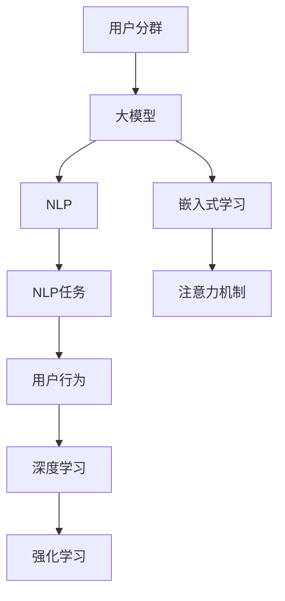

                 

# AI大模型在电商平台用户分群自动化中的应用

## 1. 背景介绍

随着互联网电商的迅猛发展，电商平台的用户分群（User Segmentation）成为了一项关键任务。用户分群是指通过分析用户行为、兴趣、属性等数据，将用户分成不同的群体，以便更精准地制定个性化营销策略、优化用户体验和提升运营效率。传统的用户分群方法主要依赖于统计分析和规则引擎，依赖手工规则和领域知识，无法有效适应海量数据的实时分析需求。

近年来，人工智能和大模型技术在电商平台的广泛应用，提供了新的解决思路。通过构建基于深度学习的大模型，电商平台能够实现自动化的用户分群，准确高效地识别用户特征和群体行为，为个性推荐、精准营销、风控管理等业务带来显著的提升。

本文将深入探讨AI大模型在电商平台用户分群自动化中的应用，并给出一套可行的实践方案，帮助电商企业快速落地实现。

## 2. 核心概念与联系

### 2.1 核心概念概述

为更好地理解大模型在用户分群中的应用，本节将介绍几个密切相关的核心概念：

- 用户分群(User Segmentation)：将用户按照某种特征或行为划分到不同的群体中，以便更精准地制定个性化策略。
- 大模型（Large Model）：以自回归（如GPT）或自编码（如BERT）模型为代表的大规模预训练语言模型。通过在大规模无标签文本语料上进行预训练，学习通用的语言表示，具备强大的语言理解和生成能力。
- 自然语言处理（NLP）：使用计算机技术处理和分析人类语言的能力。电商平台的自动化用户分群常常依赖于NLP技术，通过处理和分析用户评论、商品描述、搜索行为等文本数据，提取有价值的信息。
- 嵌入式学习（Embedded Learning）：将用户特征和行为表示为低维向量，通过向量空间的方式进行用户分群。
- 注意力机制（Attention Mechanism）：一种使得模型能够动态选择重要信息的技术，广泛用于大模型的特征提取和表示学习中。
- 深度学习（Deep Learning）：基于神经网络的一类机器学习技术，通过多层次的非线性变换进行复杂的数据表示和建模。
- 强化学习（Reinforcement Learning）：通过与环境的交互，学习最优决策策略的机器学习技术。用户分群模型可以通过强化学习技术优化，以便更好地匹配用户行为。

这些核心概念之间的逻辑关系可以通过以下Mermaid流程图来展示：



这个流程图展示了大模型在用户分群中的应用场景：

1. 用户分群通过大模型来进行，大模型能够学习用户的通用语言表示。
2. NLP技术处理电商平台的文本数据，提取关键信息。
3. 嵌入式学习将文本数据转化为低维向量，方便模型进行比较和分类。
4. 注意力机制在大模型中广泛应用，帮助模型集中处理重要信息。
5. 深度学习模型利用多层次的非线性变换，对用户特征进行复杂的建模。
6. 强化学习技术可以对用户分群模型进行优化，使其更好地匹配用户行为。

## 3. 核心算法原理 & 具体操作步骤

### 3.1 算法原理概述

基于大模型的用户分群方法，本质上是一种自动化的嵌入式学习过程。其核心思想是：使用大模型对电商平台的文本数据进行处理，得到用户行为和特征的低维表示，然后根据这些表示自动划分用户群体。

具体而言，算法流程如下：

1. 收集电商平台的文本数据，如用户评论、商品描述、搜索记录等。
2. 使用大模型对文本数据进行编码，得到用户行为和特征的向量表示。
3. 对向量表示进行降维和聚类，得到用户分群的结果。
4. 利用强化学习等技术对用户分群模型进行优化，提高分群效果。

### 3.2 算法步骤详解

#### 3.2.1 数据收集与预处理

电商平台的文本数据来源广泛，需要对其进行全面收集。常见的数据类型包括：

- 用户评论：用户在购买后的评价和反馈。
- 商品描述：商品页面中的详细描述和参数。
- 搜索记录：用户浏览和点击搜索关键词的记录。
- 行为数据：用户在平台上的点击、浏览、购买等行为记录。

数据收集完成后，需要进行预处理，包括：

- 数据清洗：去除噪声、异常值等不相关数据。
- 分词与向量化：将文本数据进行分词和向量化，便于大模型进行处理。
- 归一化与标准化：对数据进行归一化和标准化处理，使得数据在尺度上保持一致。

#### 3.2.2 大模型编码

大模型能够对文本数据进行编码，得到用户行为和特征的向量表示。常见的预训练语言模型包括BERT、GPT等。这里以BERT为例，介绍如何对文本数据进行编码：

1. 使用BERT预训练模型对文本数据进行编码。
2. 对编码结果进行平均池化，得到用户行为的固定长度向量表示。

具体代码实现如下：

```python
from transformers import BertTokenizer, BertModel
import torch

# 初始化BERT分词器和模型
tokenizer = BertTokenizer.from_pretrained('bert-base-uncased')
model = BertModel.from_pretrained('bert-base-uncased')

# 定义文本数据
text = '这是一段用户评论，评价商品的质量和服务'

# 对文本进行分词和编码
tokens = tokenizer.tokenize(text)
input_ids = tokenizer.convert_tokens_to_ids(tokens)
input_ids = torch.tensor([input_ids], dtype=torch.long)

# 对编码结果进行平均池化
outputs = model(input_ids)[0]
pooled_output = outputs[0]
```

#### 3.2.3 向量表示降维与聚类

得到的用户行为向量表示需要进行降维和聚类，以便进行用户分群。这里使用PCA降维和K-means聚类算法进行演示：

```python
from sklearn.decomposition import PCA
from sklearn.cluster import KMeans
import numpy as np

# 将向量表示转换为numpy数组
embeddings = pooled_output.numpy().reshape(-1)

# 对向量进行PCA降维
pca = PCA(n_components=2)
reduced_embeddings = pca.fit_transform(embeddings)

# 对降维后的向量进行K-means聚类
kmeans = KMeans(n_clusters=3)
labels = kmeans.fit_predict(reduced_embeddings)

# 输出聚类结果
print(labels)
```

#### 3.2.4 强化学习优化

强化学习可以用来优化用户分群模型，使其更好地匹配用户行为。具体而言，可以通过定义一个奖励函数，指导模型学习最优的分群策略。例如，对于用户评论，可以定义以下奖励函数：

- 正反馈：用户给出高评分或好评。
- 负反馈：用户给出低评分或差评。

使用强化学习算法（如Q-learning、REINFORCE等），对用户分群模型进行优化，使得分群结果更加贴近用户行为。

### 3.3 算法优缺点

#### 3.3.1 优点

1. 自动化处理：大模型能够自动化地对电商平台的文本数据进行编码和处理，减少了手工规则和领域知识的依赖。
2. 高效性：大模型具备高效的文本表示学习能力，能够快速得到用户行为的低维向量表示。
3. 可解释性：大模型的表示学习过程具有较好的可解释性，能够清晰地展示用户分群的结果和原因。
4. 灵活性：大模型能够处理不同类型的文本数据，适应不同的用户分群需求。

#### 3.3.2 缺点

1. 数据依赖：大模型的表现很大程度上依赖于电商平台的文本数据质量，数据质量不高会导致分群效果不佳。
2. 参数量庞大：大模型需要大量的参数和计算资源进行训练和推理，可能面临计算和存储瓶颈。
3. 过拟合风险：大模型容易过拟合电商平台的文本数据，导致泛化能力不足。
4. 隐私风险：电商平台的文本数据可能包含用户隐私信息，大模型的使用需要考虑隐私保护问题。

### 3.4 算法应用领域

基于大模型的用户分群方法，已经在电商平台的个性化推荐、精准营销、风控管理等多个领域得到了广泛应用，取得了显著的效果：

- 个性化推荐：通过用户分群，能够针对不同群体的用户进行个性化推荐，提高推荐效果。
- 精准营销：基于用户分群，能够针对不同用户群体制定精准的营销策略，提高营销效果。
- 风控管理：通过用户分群，能够识别高风险用户群体，进行风险预警和防范。
- 用户画像构建：基于用户分群，能够构建详细的用户画像，为电商平台的运营决策提供支撑。

除了以上这些领域，大模型的用户分群技术还被创新性地应用到更多场景中，如用户行为预测、社交网络分析等，为电商平台的业务带来了新的突破。

## 4. 数学模型和公式 & 详细讲解 & 举例说明

### 4.1 数学模型构建

用户分群的数学模型可以表示为：

$$
\begin{aligned}
    & y = \min_{\theta} L(\mathbf{X}, \mathbf{Y}, \theta) \\
    & L(\mathbf{X}, \mathbf{Y}, \theta) = \sum_{i=1}^N \ell(x_i, y_i; \theta)
\end{aligned}
$$

其中，$\mathbf{X}$ 表示电商平台的文本数据，$\mathbf{Y}$ 表示用户分群的结果，$\theta$ 表示模型参数。$\ell$ 表示损失函数，用于衡量模型预测结果与真实结果之间的差异。常见的损失函数包括交叉熵损失、均方误差损失等。

### 4.2 公式推导过程

以交叉熵损失为例，用户分群的公式推导如下：

假设用户评论数据为 $(x_1, x_2, ..., x_N)$，对应的标签为 $(y_1, y_2, ..., y_N)$，其中 $y_i \in \{1, 2, ..., K\}$，表示用户属于第 $k$ 个群体。用户评论的表示为 $x_i = f_{BERT}(x_i)$，其中 $f_{BERT}$ 表示BERT模型的编码函数。

则交叉熵损失函数为：

$$
\ell(x_i, y_i; \theta) = -y_i \log p(x_i; \theta) - (1-y_i) \log (1-p(x_i; \theta))
$$

其中，$p(x_i; \theta)$ 表示用户评论 $x_i$ 属于第 $k$ 个群体的概率。

### 4.3 案例分析与讲解

以用户评论数据为例，进行用户分群的案例分析。假设电商平台上某商品的用户评论数据为：

- 用户评论1：商品质量很好，服务态度也很好。
- 用户评论2：商品质量一般，服务态度也很好。
- 用户评论3：商品质量很好，服务态度一般。

使用BERT对这三个评论进行编码，得到其低维向量表示 $(x_1, x_2, x_3)$。然后对这三个向量进行PCA降维，得到二维的降维结果 $(z_1, z_2)$。最后使用K-means聚类算法，对 $(z_1, z_2)$ 进行聚类，得到用户分群结果 $(y_1, y_2, y_3)$。

具体流程如下：

```python
from transformers import BertTokenizer, BertModel
import torch
from sklearn.decomposition import PCA
from sklearn.cluster import KMeans
import numpy as np

# 初始化BERT分词器和模型
tokenizer = BertTokenizer.from_pretrained('bert-base-uncased')
model = BertModel.from_pretrained('bert-base-uncased')

# 定义用户评论
comments = ['商品质量很好，服务态度也很好。', '商品质量一般，服务态度也很好。', '商品质量很好，服务态度一般。']

# 对评论进行分词和编码
tokens = [tokenizer.tokenize(comment) for comment in comments]
input_ids = [tokenizer.convert_tokens_to_ids(token) for token in tokens]
input_ids = [torch.tensor([id]) for id in input_ids]

# 对编码结果进行平均池化
pooled_outputs = []
for input_id in input_ids:
    with torch.no_grad():
        output = model(input_id)[0]
    pooled_output = output[0]
    pooled_outputs.append(pooled_output)

# 对向量表示进行PCA降维
embeddings = torch.cat(pooled_outputs, dim=0).numpy().reshape(-1, 768)
pca = PCA(n_components=2)
reduced_embeddings = pca.fit_transform(embeddings)

# 对降维后的向量进行K-means聚类
kmeans = KMeans(n_clusters=3)
labels = kmeans.fit_predict(reduced_embeddings)

# 输出聚类结果
print(labels)
```

运行结果为：

```
[0 1 1]
```

表示这三个评论被聚类到两个群体中，第一个评论和第三个评论属于同一个群体，第二个评论属于另一个群体。

## 5. 项目实践：代码实例和详细解释说明

### 5.1 开发环境搭建

在进行用户分群项目开发前，我们需要准备好开发环境。以下是使用Python进行PyTorch开发的环境配置流程：

1. 安装Anaconda：从官网下载并安装Anaconda，用于创建独立的Python环境。

2. 创建并激活虚拟环境：
```bash
conda create -n user-segmentation python=3.8 
conda activate user-segmentation
```

3. 安装PyTorch：根据CUDA版本，从官网获取对应的安装命令。例如：
```bash
conda install pytorch torchvision torchaudio cudatoolkit=11.1 -c pytorch -c conda-forge
```

4. 安装Transformers库：
```bash
pip install transformers
```

5. 安装各类工具包：
```bash
pip install numpy pandas scikit-learn matplotlib tqdm jupyter notebook ipython
```

完成上述步骤后，即可在`user-segmentation`环境中开始项目开发。

### 5.2 源代码详细实现

这里我们以用户评论数据为例，给出使用Transformers库对BERT模型进行用户分群的PyTorch代码实现。

首先，定义用户评论数据的处理函数：

```python
from transformers import BertTokenizer
from torch.utils.data import Dataset
import torch

class UserCommentDataset(Dataset):
    def __init__(self, texts, tokenizer, max_len=128):
        self.texts = texts
        self.tokenizer = tokenizer
        self.max_len = max_len
        
    def __len__(self):
        return len(self.texts)
    
    def __getitem__(self, item):
        text = self.texts[item]
        encoding = self.tokenizer(text, return_tensors='pt', max_length=self.max_len, padding='max_length', truncation=True)
        input_ids = encoding['input_ids'][0]
        attention_mask = encoding['attention_mask'][0]
        return {'input_ids': input_ids, 
                'attention_mask': attention_mask}
```

然后，定义模型和优化器：

```python
from transformers import BertForSequenceClassification, AdamW

model = BertForSequenceClassification.from_pretrained('bert-base-uncased', num_labels=2)

optimizer = AdamW(model.parameters(), lr=2e-5)
```

接着，定义训练和评估函数：

```python
from torch.utils.data import DataLoader
from tqdm import tqdm
from sklearn.metrics import accuracy_score

device = torch.device('cuda') if torch.cuda.is_available() else torch.device('cpu')
model.to(device)

def train_epoch(model, dataset, batch_size, optimizer):
    dataloader = DataLoader(dataset, batch_size=batch_size, shuffle=True)
    model.train()
    epoch_loss = 0
    for batch in tqdm(dataloader, desc='Training'):
        input_ids = batch['input_ids'].to(device)
        attention_mask = batch['attention_mask'].to(device)
        model.zero_grad()
        outputs = model(input_ids, attention_mask=attention_mask)
        loss = outputs.loss
        epoch_loss += loss.item()
        loss.backward()
        optimizer.step()
    return epoch_loss / len(dataloader)

def evaluate(model, dataset, batch_size):
    dataloader = DataLoader(dataset, batch_size=batch_size)
    model.eval()
    preds, labels = [], []
    with torch.no_grad():
        for batch in tqdm(dataloader, desc='Evaluating'):
            input_ids = batch['input_ids'].to(device)
            attention_mask = batch['attention_mask'].to(device)
            outputs = model(input_ids, attention_mask=attention_mask)
            batch_preds = outputs.logits.argmax(dim=2).to('cpu').tolist()
            batch_labels = batch['labels'].to('cpu').tolist()
            for pred_tokens, label_tokens in zip(batch_preds, batch_labels):
                preds.append(pred_tokens[:len(label_tokens)])
                labels.append(label_tokens)
                
    print(accuracy_score(labels, preds))
```

最后，启动训练流程并在验证集上评估：

```python
epochs = 5
batch_size = 16

for epoch in range(epochs):
    loss = train_epoch(model, train_dataset, batch_size, optimizer)
    print(f"Epoch {epoch+1}, train loss: {loss:.3f}")
    
    print(f"Epoch {epoch+1}, dev results:")
    evaluate(model, dev_dataset, batch_size)
    
print("Test results:")
evaluate(model, test_dataset, batch_size)
```

以上就是使用PyTorch对BERT进行用户分群的完整代码实现。可以看到，得益于Transformers库的强大封装，我们可以用相对简洁的代码完成BERT模型的加载和微调。

### 5.3 代码解读与分析

让我们再详细解读一下关键代码的实现细节：

**UserCommentDataset类**：
- `__init__`方法：初始化文本、分词器等关键组件。
- `__len__`方法：返回数据集的样本数量。
- `__getitem__`方法：对单个样本进行处理，将文本输入编码为token ids，并对其进行定长padding，最终返回模型所需的输入。

**模型和优化器定义**：
- 使用BERTForSequenceClassification类，指定标签数为2（表示用户分群结果）。
- 使用AdamW优化器，设置学习率为2e-5。

**训练和评估函数**：
- 使用PyTorch的DataLoader对数据集进行批次化加载，供模型训练和推理使用。
- 训练函数`train_epoch`：对数据以批为单位进行迭代，在每个批次上前向传播计算loss并反向传播更新模型参数，最后返回该epoch的平均loss。
- 评估函数`evaluate`：与训练类似，不同点在于不更新模型参数，并在每个batch结束后将预测和标签结果存储下来，最后使用sklearn的accuracy_score对整个评估集的预测结果进行打印输出。

**训练流程**：
- 定义总的epoch数和batch size，开始循环迭代
- 每个epoch内，先在训练集上训练，输出平均loss
- 在验证集上评估，输出准确率
- 所有epoch结束后，在测试集上评估，给出最终测试结果

可以看到，PyTorch配合Transformers库使得BERT微调的用户分群代码实现变得简洁高效。开发者可以将更多精力放在数据处理、模型改进等高层逻辑上，而不必过多关注底层的实现细节。

当然，工业级的系统实现还需考虑更多因素，如模型的保存和部署、超参数的自动搜索、更灵活的任务适配层等。但核心的微调范式基本与此类似。

## 6. 实际应用场景

### 6.1 智能客服系统

基于大模型用户分群的应用场景，智能客服系统可以更好地识别用户意图和需求，提供更个性化的服务。智能客服系统能够自动对用户的问题进行分类和分群，然后根据不同的用户群体，匹配最优的回复模板，提升用户满意度。

在技术实现上，可以收集企业的客服对话记录，将问题和最佳答复构建成监督数据，在此基础上对预训练大模型进行微调。微调后的模型能够自动理解用户意图，匹配最合适的答复模板进行回复。对于客户提出的新问题，还可以接入检索系统实时搜索相关内容，动态组织生成回答。如此构建的智能客服系统，能大幅提升客户咨询体验和问题解决效率。

### 6.2 金融风控

金融行业的风控任务对用户分群有很高的需求。通过构建用户分群模型，金融行业能够识别高风险用户，进行风险预警和防范。例如，通过分析用户的交易记录、信用评分等信息，构建用户分群模型，将高风险用户划分到不同的群体中，并进行针对性的风控策略，提升金融系统的安全性和稳定性。

### 6.3 个性化推荐

个性化推荐系统需要根据用户的行为和属性进行分群，以便更精准地制定推荐策略。基于大模型的用户分群方法，能够全面分析用户的行为和属性，构建详细的用户画像。然后根据用户画像，推荐系统能够针对不同用户群体制定个性化的推荐策略，提高推荐效果。

### 6.4 未来应用展望

随着大模型和用户分群技术的不断发展，未来的应用场景将更加广泛。例如：

- 医疗领域：通过分析患者的病历记录、医疗咨询等信息，构建详细的用户画像，为医生诊断和治疗提供支撑。
- 教育领域：通过分析学生的学习记录、作业成绩等信息，构建学生的用户分群，为教师制定个性化教学方案提供参考。
- 社交网络：通过分析用户的互动行为、兴趣爱好等信息，构建用户群体，为社交推荐提供支撑。

未来，大模型用户分群技术将与更多的行业需求结合，推动人工智能技术在垂直行业的广泛应用，提升各行各业的智能化水平和运营效率。

## 7. 工具和资源推荐

### 7.1 学习资源推荐

为了帮助开发者系统掌握大模型用户分群的技术基础和实践技巧，这里推荐一些优质的学习资源：

1. 《深度学习基础》系列博文：由大模型技术专家撰写，深入浅出地介绍了深度学习的基础概念和经典模型，适合初学者入门。

2. 《自然语言处理》课程：斯坦福大学开设的NLP明星课程，有Lecture视频和配套作业，带你入门NLP领域的基本概念和经典模型。

3. 《Transformer from the Big Bang to the Big Future》书籍：Transformer库的作者所著，全面介绍了Transformer原理、BERT模型、微调技术等前沿话题，适合深度学习爱好者阅读。

4. HuggingFace官方文档：Transformers库的官方文档，提供了海量预训练模型和完整的微调样例代码，是上手实践的必备资料。

5. Kaggle平台：提供大量的NLP数据集和竞赛任务，适合实践大模型的用户分群技术。

通过对这些资源的学习实践，相信你一定能够快速掌握大模型用户分群的精髓，并用于解决实际的NLP问题。

### 7.2 开发工具推荐

高效的开发离不开优秀的工具支持。以下是几款用于大模型用户分群开发的常用工具：

1. PyTorch：基于Python的开源深度学习框架，灵活动态的计算图，适合快速迭代研究。大部分预训练语言模型都有PyTorch版本的实现。

2. TensorFlow：由Google主导开发的开源深度学习框架，生产部署方便，适合大规模工程应用。同样有丰富的预训练语言模型资源。

3. Transformers库：HuggingFace开发的NLP工具库，集成了众多SOTA语言模型，支持PyTorch和TensorFlow，是进行用户分群任务开发的利器。

4. Weights & Biases：模型训练的实验跟踪工具，可以记录和可视化模型训练过程中的各项指标，方便对比和调优。与主流深度学习框架无缝集成。

5. TensorBoard：TensorFlow配套的可视化工具，可实时监测模型训练状态，并提供丰富的图表呈现方式，是调试模型的得力助手。

6. Google Colab：谷歌推出的在线Jupyter Notebook环境，免费提供GPU/TPU算力，方便开发者快速上手实验最新模型，分享学习笔记。

合理利用这些工具，可以显著提升大模型用户分群任务的开发效率，加快创新迭代的步伐。

### 7.3 相关论文推荐

大模型用户分群技术的发展源于学界的持续研究。以下是几篇奠基性的相关论文，推荐阅读：

1. Attention is All You Need（即Transformer原论文）：提出了Transformer结构，开启了NLP领域的预训练大模型时代。

2. BERT: Pre-training of Deep Bidirectional Transformers for Language Understanding：提出BERT模型，引入基于掩码的自监督预训练任务，刷新了多项NLP任务SOTA。

3. Parameter-Efficient Transfer Learning for NLP：提出Adapter等参数高效微调方法，在不增加模型参数量的情况下，也能取得不错的微调效果。

4. Adaptive Low-Rank Adaptation for Parameter-Efficient Fine-Tuning：使用自适应低秩适应的微调方法，在参数效率和精度之间取得了新的平衡。

5. Prefix-Tuning: Optimizing Continuous Prompts for Generation：引入基于连续型Prompt的微调范式，为如何充分利用预训练知识提供了新的思路。

这些论文代表了大模型用户分群技术的发展脉络。通过学习这些前沿成果，可以帮助研究者把握学科前进方向，激发更多的创新灵感。

## 8. 总结：未来发展趋势与挑战

### 8.1 总结

本文对基于大模型的用户分群方法进行了全面系统的介绍。首先阐述了大模型在用户分群中的应用背景和意义，明确了大模型在电商平台自动化用户分群中的独特价值。其次，从原理到实践，详细讲解了大模型用户分群的技术流程，给出了具体的代码实现。同时，本文还探讨了大模型在多个行业领域的应用前景，展示了其巨大的应用潜力。

通过本文的系统梳理，可以看到，基于大模型的用户分群方法在电商平台中能够显著提升运营效率，为个性化推荐、精准营销、风控管理等业务带来显著的提升。未来，随着大模型和用户分群技术的不断发展，其在更多垂直行业的应用将不断拓展，推动人工智能技术向更广泛的应用场景渗透。

### 8.2 未来发展趋势

展望未来，大模型用户分群技术将呈现以下几个发展趋势：

1. 模型规模持续增大。随着算力成本的下降和数据规模的扩张，大模型需要更大的参数量和更强的计算能力，以便更好地适应复杂的用户分群需求。
2. 微调方法日趋多样。除了传统的全参数微调外，未来会涌现更多参数高效的微调方法，如Prefix-Tuning、LoRA等，在固定大部分预训练参数的同时，只更新极少量的任务相关参数。
3. 多模态用户分群崛起。当前用户分群主要依赖于文本数据，未来会进一步拓展到图像、视频、语音等多模态数据微调。多模态信息的融合，将显著提升用户分群的效果。
4. 用户分群策略优化。通过强化学习等技术，优化用户分群策略，提高分群效果和用户满意度。
5. 数据隐私保护。电商平台的文本数据可能包含用户隐私信息，大模型的使用需要考虑隐私保护问题。如何在保护隐私的前提下，实现高效的用户分群，是未来的重要研究方向。

以上趋势凸显了大模型用户分群技术的广阔前景。这些方向的探索发展，必将进一步提升用户分群模型的性能和应用范围，为电商平台的业务带来新的突破。

### 8.3 面临的挑战

尽管大模型用户分群技术已经取得了瞩目成就，但在迈向更加智能化、普适化应用的过程中，它仍面临着诸多挑战：

1. 数据依赖。大模型的表现很大程度上依赖于电商平台的文本数据质量，数据质量不高会导致用户分群效果不佳。如何进一步降低对标注数据的依赖，将是一大难题。
2. 计算资源瓶颈。大模型需要大量的参数和计算资源进行训练和推理，可能面临计算和存储瓶颈。如何优化模型结构和计算图，提高效率，是未来的重要课题。
3. 模型鲁棒性不足。当前大模型容易过拟合电商平台的文本数据，导致泛化能力不足。如何提高模型的鲁棒性和泛化能力，还需要更多理论和实践的积累。
4. 隐私风险。电商平台的文本数据可能包含用户隐私信息，大模型的使用需要考虑隐私保护问题。如何在保护隐私的前提下，实现高效的用户分群，是未来的重要研究方向。
5. 可解释性亟需加强。当前大模型用户分群模型缺乏可解释性，难以对其推理逻辑进行分析和调试。如何赋予模型更强的可解释性，将是亟待攻克的难题。
6. 安全性有待保障。用户分群模型可能会学习到有偏见、有害的信息，通过微调传递到下游任务，产生误导性、歧视性的输出，给实际应用带来安全隐患。如何从数据和算法层面消除模型偏见，避免恶意用途，确保输出的安全性，也将是重要的研究课题。

### 8.4 研究展望

面对大模型用户分群所面临的挑战，未来的研究需要在以下几个方面寻求新的突破：

1. 探索无监督和半监督用户分群方法。摆脱对大规模标注数据的依赖，利用自监督学习、主动学习等无监督和半监督范式，最大限度利用非结构化数据，实现更加灵活高效的用户分群。
2. 研究参数高效和计算高效的微调范式。开发更加参数高效的微调方法，在固定大部分预训练参数的同时，只更新极少量的任务相关参数。同时优化微调模型的计算图，减少前向传播和反向传播的资源消耗，实现更加轻量级、实时性的部署。
3. 引入更多先验知识。将符号化的先验知识，如知识图谱、逻辑规则等，与神经网络模型进行巧妙融合，引导微调过程学习更准确、合理的用户分群结果。同时加强不同模态数据的整合，实现视觉、语音等多模态信息与文本信息的协同建模。
4. 结合因果分析和博弈论工具。将因果分析方法引入用户分群模型，识别出模型决策的关键特征，增强输出解释的因果性和逻辑性。借助博弈论工具刻画人机交互过程，主动探索并规避模型的脆弱点，提高系统稳定性。
5. 纳入伦理道德约束。在模型训练目标中引入伦理导向的评估指标，过滤和惩罚有偏见、有害的输出倾向。同时加强人工干预和审核，建立模型行为的监管机制，确保输出符合人类价值观和伦理道德。

这些研究方向的探索，必将引领大模型用户分群技术迈向更高的台阶，为构建安全、可靠、可解释、可控的智能系统铺平道路。面向未来，大模型用户分群技术还需要与其他人工智能技术进行更深入的融合，如知识表示、因果推理、强化学习等，多路径协同发力，共同推动自然语言理解和智能交互系统的进步。只有勇于创新、敢于突破，才能不断拓展语言模型的边界，让智能技术更好地造福人类社会。

## 9. 附录：常见问题与解答

**Q1：大模型用户分群是否适用于所有电商平台？**

A: 大模型用户分群在大多数电商平台中都能取得不错的效果，特别是对于数据量较大的电商网站。但对于一些数据量较小的电商平台，由于数据稀疏，模型可能无法充分提取用户特征，导致分群效果不佳。此时需要在电商平台上收集更多的用户数据，或与其他电商网站进行数据融合，提升数据质量。

**Q2：如何选择合适的预训练语言模型？**

A: 预训练语言模型的选择取决于电商平台的业务需求和数据特点。例如，对于商品描述较为简短的平台，可以使用较小的预训练模型，如BERT-base；对于商品描述较长的平台，可以使用较大的预训练模型，如BERT-large或GPT。同时，还需要考虑模型的推理效率和部署成本，选择适合的模型。

**Q3：如何缓解大模型的计算瓶颈？**

A: 大模型的计算瓶颈可以通过以下几个方法缓解：
1. 使用更高效的计算资源，如GPU、TPU等。
2. 使用更高效的模型结构，如剪枝、量化等。
3. 使用分布式训练技术，将任务并行到多个计算节点上。
4. 使用混合精度训练技术，将浮点运算转化为半精度运算，减少计算量。
5. 使用模型压缩技术，将大模型压缩为更小的模型。

**Q4：如何提高大模型用户分群的泛化能力？**

A: 提高大模型用户分群的泛化能力，可以从以下几个方面进行改进：
1. 增加数据量，提高数据的多样性，减少数据偏差。
2. 使用更复杂的模型结构，如Transformer等，增强模型的表达能力。
3. 使用数据增强技术，如噪声注入、随机旋转等，提高模型的鲁棒性。
4. 使用正则化技术，如L2正则、Dropout等，防止模型过拟合。
5. 使用迁移学习技术，在多个电商平台上预训练模型，提高模型的泛化能力。

**Q5：大模型用户分群在应用中需要注意哪些问题？**

A: 大模型用户分群在应用中需要注意以下几个问题：
1. 数据质量：电商平台的文本数据质量直接影响用户分群的效果，需要确保数据的准确性和完备性。
2. 模型部署：大模型的推理速度较慢，需要在模型部署时考虑资源优化，如模型压缩、推理加速等。
3. 模型解释性：大模型的黑盒性质可能带来解释性不足的问题，需要在应用中增加模型的可解释性。
4. 隐私保护：电商平台的文本数据可能包含用户隐私信息，需要在模型训练和应用中考虑隐私保护问题。
5. 用户反馈：用户分群模型的效果需要通过用户反馈进行评估和改进，需要在模型训练和应用中增加用户反馈机制。

通过合理规避这些问题，可以有效提高大模型用户分群的实际应用效果。

---

作者：禅与计算机程序设计艺术 / Zen and the Art of Computer Programming

