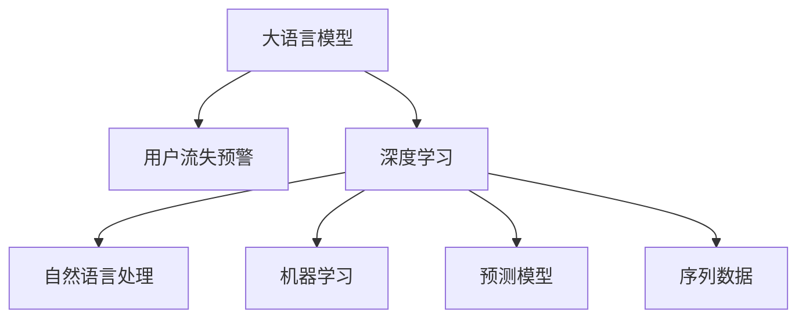

                 

# AI大模型在电商平台用户流失预警中的应用

> 关键词：大语言模型, 用户流失预警, 电商平台, 深度学习, 自然语言处理, 机器学习, 预测模型, 序列数据

## 1. 背景介绍

### 1.1 问题由来

在现代电商平台上，用户流失问题始终是商家面临的重要挑战。如何通过数据分析及时发现用户流失倾向，预测用户流失行为，并进行有效的挽留措施，成为电商平台需要重点解决的问题。传统的数据分析方法往往依赖于特征工程和统计模型，难以全面处理复杂的数据分布和动态的用户行为。随着人工智能技术的迅猛发展，利用AI大模型对用户行为数据进行深度学习，成为电商平台上实现用户流失预警的新途径。

### 1.2 问题核心关键点

大模型在用户流失预警中的应用，主要体现在以下几个关键点：

- **数据处理能力**：大模型能够处理海量的用户行为数据，从中提取有价值的模式和规律。
- **特征提取能力**：大模型能够学习用户行为的高层次抽象特征，提升模型对用户流失的预测准确性。
- **泛化能力**：大模型在广泛数据上的预训练，使其具备强大的泛化能力，能够适应不同的电商平台和用户群体。
- **实时性**：大模型能够实时分析用户行为数据，快速响应用户流失风险。
- **可解释性**：大模型通常通过黑箱方式运行，但通过一定的技术手段可以提升其输出结果的可解释性，帮助商家理解模型预测的依据。

### 1.3 问题研究意义

利用AI大模型进行用户流失预警，对于电商平台有以下重要意义：

- **减少用户流失**：通过及时预警和挽留，减少用户流失，提升用户留存率。
- **增加用户粘性**：通过精准推荐和个性化服务，增加用户对平台的粘性。
- **优化用户体验**：通过分析用户流失原因，优化平台功能和用户体验。
- **提升业务决策**：通过数据驱动的决策支持，提升平台的运营效率和盈利能力。

## 2. 核心概念与联系

### 2.1 核心概念概述

为更好地理解大模型在用户流失预警中的应用，本节将介绍几个关键核心概念：

- **大语言模型**：以自回归或自编码模型为代表的大规模预训练语言模型。通过在大规模无标签文本语料上进行预训练，学习通用的语言表示，具备强大的语言理解和生成能力。

- **用户流失预警**：通过分析用户行为数据，预测用户流失概率，及时发出预警信号，帮助商家采取相应的挽留措施。

- **深度学习**：一种基于神经网络的机器学习方法，通过多层神经元处理数据，实现复杂的特征提取和模式识别。

- **自然语言处理**：研究计算机如何理解、处理和生成自然语言的技术。包括语言模型、文本分类、序列标注、机器翻译等任务。

- **机器学习**：通过数据驱动的方式，训练模型以实现对未知数据的预测和决策。包括监督学习、无监督学习和强化学习等。

- **预测模型**：利用历史数据训练模型，对未来的事件进行预测，如用户流失概率、点击率、转化率等。

- **序列数据**：指时间序列数据，如用户的点击历史、购买历史等，能够反映用户行为的时间序列特征。

这些核心概念之间的逻辑关系可以通过以下Mermaid流程图来展示：



这个流程图展示了各个概念之间的联系：大模型通过深度学习和自然语言处理技术，学习用户行为序列数据中的模式和规律，训练出用于用户流失预警的预测模型。

## 3. 核心算法原理 & 具体操作步骤

### 3.1 算法原理概述

基于大模型进行用户流失预警，主要包括以下几个步骤：

1. **数据预处理**：收集用户行为数据，并进行清洗和标准化处理。
2. **特征提取**：将原始数据转换为模型能够处理的向量表示。
3. **预训练模型微调**：在大模型上加载预训练参数，微调模型以适应电商平台的特定需求。
4. **预测建模**：使用微调后的模型对用户行为进行预测，判断其流失风险。
5. **预警处理**：根据预测结果，采取相应的挽留措施，提升用户留存率。

### 3.2 算法步骤详解

#### 3.2.1 数据预处理

1. **数据收集**：从电商平台上收集用户行为数据，如点击、浏览、购买、评价、退换货等行为。
2. **数据清洗**：去除无效或异常数据，保证数据质量。
3. **数据标准化**：将不同格式的数据转换为统一的向量表示，如将文本转换为嵌入向量。

#### 3.2.2 特征提取

1. **特征工程**：选择有代表性的特征，如用户活跃度、购买频率、复购率等。
2. **序列数据处理**：对用户的点击历史、购买历史等序列数据进行处理，如时间戳编码、滑动窗口等。
3. **数据嵌入**：使用嵌入技术将特征和序列数据转换为向量表示，如Word2Vec、BERT等。

#### 3.2.3 预训练模型微调

1. **模型选择**：选择合适的预训练模型，如BERT、GPT等，加载其预训练权重。
2. **模型微调**：在微调数据集上对模型进行优化，调整模型参数以适应电商平台的用户流失预测需求。
3. **模型评估**：使用验证集对微调后的模型进行评估，调整超参数。

#### 3.2.4 预测建模

1. **模型训练**：使用训练集对微调后的模型进行训练。
2. **预测推理**：对测试集或实时数据进行预测，输出用户流失概率。
3. **结果解释**：利用模型输出结果，进行数据可视化，分析用户流失原因。

#### 3.2.5 预警处理

1. **阈值设定**：根据实际需求设定预警阈值。
2. **预警响应**：对超过阈值的用户行为进行预警，触发挽留措施。
3. **效果评估**：对预警效果进行评估，优化预警策略。

### 3.3 算法优缺点

#### 3.3.1 优点

1. **数据处理能力强**：大模型能够处理大规模、多源、异构的数据，提供强大的特征提取能力。
2. **泛化能力强**：大模型在广泛数据上的预训练，使其具备强大的泛化能力，能够适应不同的电商平台和用户群体。
3. **实时性高**：大模型能够实时处理数据，快速响应用户流失风险。
4. **可解释性强**：利用可解释性技术，能够对模型输出结果进行解释，提升用户理解。

#### 3.3.2 缺点

1. **计算资源需求高**：大模型通常需要较大的计算资源进行训练和推理。
2. **数据隐私问题**：大模型需要处理大量的用户行为数据，涉及用户隐私保护问题。
3. **模型复杂度高**：大模型的参数量和计算复杂度较高，需要专业团队进行维护和优化。
4. **解释性不足**：大模型通常通过黑箱方式运行，难以理解其内部决策逻辑。

### 3.4 算法应用领域

大模型在用户流失预警中的应用，主要集中在以下几个领域：

1. **电商交易平台**：通过分析用户行为数据，预测用户流失概率，及时发出预警信号，帮助商家采取相应的挽留措施。
2. **社交媒体平台**：利用大模型对用户流失行为进行预测，优化用户互动和内容推荐，提升用户留存率。
3. **金融服务平台**：通过分析用户行为数据，预测用户流失风险，优化客户服务和管理策略。
4. **旅游出行平台**：利用大模型预测用户流失风险，优化旅游路线推荐和客户服务，提升用户满意度和留存率。

以上领域的应用展示了大模型在用户流失预警中的强大潜力，为不同行业的用户行为分析提供了新的技术手段。

## 4. 数学模型和公式 & 详细讲解 & 举例说明

### 4.1 数学模型构建

本节将使用数学语言对大模型在用户流失预警中的应用进行更加严格的刻画。

假设用户流失预警的任务数据集为 $D=\{(x_i,y_i)\}_{i=1}^N$，其中 $x_i$ 为用户行为数据，$y_i$ 为流失标签。定义用户流失概率为 $p_i$，则用户流失预警的目标是最大化模型的预测准确率：

$$
\max_{\theta} \frac{1}{N} \sum_{i=1}^N \log\sigma(\hat{y}_i)
$$

其中 $\sigma$ 为Sigmoid函数，$\hat{y}_i$ 为模型对用户流失概率的预测值。

### 4.2 公式推导过程

以下我们以二分类任务为例，推导基于大模型的用户流失概率预测公式。

假设模型 $M_{\theta}$ 在输入 $x_i$ 上的输出为 $\hat{y}_i=M_{\theta}(x_i)$，则二分类问题可以通过Sigmoid函数将输出映射到 $[0,1]$ 区间，表示用户流失的概率。定义损失函数为交叉熵损失：

$$
\ell(\hat{y}_i,y_i) = -[y_i\log\hat{y}_i + (1-y_i)\log(1-\hat{y}_i)]
$$

则用户流失预警任务的经验风险为：

$$
\mathcal{L}(\theta) = -\frac{1}{N}\sum_{i=1}^N \ell(\hat{y}_i,y_i)
$$

使用随机梯度下降等优化算法，最小化损失函数，得到模型的最优参数 $\theta^*$：

$$
\theta^* = \mathop{\arg\min}_{\theta} \mathcal{L}(\theta)
$$

在得到模型的最优参数后，利用训练集对模型进行训练，使用测试集进行评估，得到用户流失概率的预测值 $\hat{y}_i$，然后通过Sigmoid函数将其映射到 $[0,1]$ 区间。

### 4.3 案例分析与讲解

以一个电商平台的流失预警为例，分析大模型在其中的应用。

1. **数据预处理**：收集用户点击、浏览、购买、评价、退换货等行为数据，并进行清洗和标准化处理。
2. **特征提取**：选择用户活跃度、购买频率、复购率等特征，并进行嵌入处理。
3. **预训练模型微调**：选择BERT作为预训练模型，加载其预训练权重，在电商交易数据上进行微调，优化模型参数。
4. **预测建模**：使用微调后的模型对用户行为进行预测，得到用户流失概率。
5. **预警处理**：根据预设的阈值，对超过阈值的用户行为进行预警，采取相应的挽留措施。

## 5. 项目实践：代码实例和详细解释说明

### 5.1 开发环境搭建

在进行用户流失预警实践前，我们需要准备好开发环境。以下是使用Python进行PyTorch开发的环境配置流程：

1. 安装Anaconda：从官网下载并安装Anaconda，用于创建独立的Python环境。

2. 创建并激活虚拟环境：
```bash
conda create -n pytorch-env python=3.8 
conda activate pytorch-env
```

3. 安装PyTorch：根据CUDA版本，从官网获取对应的安装命令。例如：
```bash
conda install pytorch torchvision torchaudio cudatoolkit=11.1 -c pytorch -c conda-forge
```

4. 安装Transformers库：
```bash
pip install transformers
```

5. 安装各类工具包：
```bash
pip install numpy pandas scikit-learn matplotlib tqdm jupyter notebook ipython
```

完成上述步骤后，即可在`pytorch-env`环境中开始用户流失预警实践。

### 5.2 源代码详细实现

下面我们以一个用户流失预警任务为例，给出使用Transformers库对BERT模型进行用户流失预警微调的PyTorch代码实现。

首先，定义用户流失预警任务的数据处理函数：

```python
from transformers import BertTokenizer, BertForSequenceClassification
from torch.utils.data import Dataset
import torch

class User流失预警Dataset(Dataset):
    def __init__(self, user_behaviours, labels, tokenizer, max_len=128):
        self.user_behaviours = user_behaviours
        self.labels = labels
        self.tokenizer = tokenizer
        self.max_len = max_len
        
    def __len__(self):
        return len(self.user_behaviours)
    
    def __getitem__(self, item):
        user_behaviour = self.user_behaviours[item]
        label = self.labels[item]
        
        encoding = self.tokenizer(user_behaviour, return_tensors='pt', max_length=self.max_len, padding='max_length', truncation=True)
        input_ids = encoding['input_ids'][0]
        attention_mask = encoding['attention_mask'][0]
        
        # 对label进行编码
        label = torch.tensor(label, dtype=torch.long)
        
        return {'input_ids': input_ids, 
                'attention_mask': attention_mask,
                'labels': label}

# 标签与id的映射
label2id = {'流失': 1, '非流失': 0}
id2label = {v: k for k, v in label2id.items()}

# 创建dataset
tokenizer = BertTokenizer.from_pretrained('bert-base-cased')

train_dataset = User流失预警Dataset(train_user_behaviours, train_labels, tokenizer)
dev_dataset = User流失预警Dataset(dev_user_behaviours, dev_labels, tokenizer)
test_dataset = User流失预警Dataset(test_user_behaviours, test_labels, tokenizer)
```

然后，定义模型和优化器：

```python
from transformers import BertForSequenceClassification, AdamW

model = BertForSequenceClassification.from_pretrained('bert-base-cased', num_labels=2)

optimizer = AdamW(model.parameters(), lr=2e-5)
```

接着，定义训练和评估函数：

```python
from torch.utils.data import DataLoader
from tqdm import tqdm
from sklearn.metrics import classification_report

device = torch.device('cuda') if torch.cuda.is_available() else torch.device('cpu')
model.to(device)

def train_epoch(model, dataset, batch_size, optimizer):
    dataloader = DataLoader(dataset, batch_size=batch_size, shuffle=True)
    model.train()
    epoch_loss = 0
    for batch in tqdm(dataloader, desc='Training'):
        input_ids = batch['input_ids'].to(device)
        attention_mask = batch['attention_mask'].to(device)
        labels = batch['labels'].to(device)
        model.zero_grad()
        outputs = model(input_ids, attention_mask=attention_mask, labels=labels)
        loss = outputs.loss
        epoch_loss += loss.item()
        loss.backward()
        optimizer.step()
    return epoch_loss / len(dataloader)

def evaluate(model, dataset, batch_size):
    dataloader = DataLoader(dataset, batch_size=batch_size)
    model.eval()
    preds, labels = [], []
    with torch.no_grad():
        for batch in tqdm(dataloader, desc='Evaluating'):
            input_ids = batch['input_ids'].to(device)
            attention_mask = batch['attention_mask'].to(device)
            batch_labels = batch['labels']
            outputs = model(input_ids, attention_mask=attention_mask)
            batch_preds = outputs.logits.argmax(dim=2).to('cpu').tolist()
            batch_labels = batch_labels.to('cpu').tolist()
            for pred, label in zip(batch_preds, batch_labels):
                preds.append(pred)
                labels.append(label)
                
    print(classification_report(labels, preds))
```

最后，启动训练流程并在测试集上评估：

```python
epochs = 5
batch_size = 16

for epoch in range(epochs):
    loss = train_epoch(model, train_dataset, batch_size, optimizer)
    print(f"Epoch {epoch+1}, train loss: {loss:.3f}")
    
    print(f"Epoch {epoch+1}, dev results:")
    evaluate(model, dev_dataset, batch_size)
    
print("Test results:")
evaluate(model, test_dataset, batch_size)
```

以上就是使用PyTorch对BERT进行用户流失预警微调的完整代码实现。可以看到，得益于Transformers库的强大封装，我们可以用相对简洁的代码完成BERT模型的加载和微调。

### 5.3 代码解读与分析

让我们再详细解读一下关键代码的实现细节：

**User流失预警Dataset类**：
- `__init__`方法：初始化用户行为数据、标签、分词器等关键组件。
- `__len__`方法：返回数据集的样本数量。
- `__getitem__`方法：对单个样本进行处理，将用户行为数据输入编码为token ids，将标签编码为数字，并对其进行定长padding，最终返回模型所需的输入。

**label2id和id2label字典**：
- 定义了标签与数字id之间的映射关系，用于将标签转换为模型能够处理的向量表示。

**训练和评估函数**：
- 使用PyTorch的DataLoader对数据集进行批次化加载，供模型训练和推理使用。
- 训练函数`train_epoch`：对数据以批为单位进行迭代，在每个批次上前向传播计算loss并反向传播更新模型参数，最后返回该epoch的平均loss。
- 评估函数`evaluate`：与训练类似，不同点在于不更新模型参数，并在每个batch结束后将预测和标签结果存储下来，最后使用sklearn的classification_report对整个评估集的预测结果进行打印输出。

**训练流程**：
- 定义总的epoch数和batch size，开始循环迭代
- 每个epoch内，先在训练集上训练，输出平均loss
- 在验证集上评估，输出分类指标
- 重复上述过程直至收敛，最终得到用户流失概率的预测模型

可以看到，PyTorch配合Transformers库使得BERT微调的用户流失预警任务代码实现变得简洁高效。开发者可以将更多精力放在数据处理、模型改进等高层逻辑上，而不必过多关注底层的实现细节。

当然，工业级的系统实现还需考虑更多因素，如模型的保存和部署、超参数的自动搜索、更灵活的任务适配层等。但核心的微调范式基本与此类似。

## 6. 实际应用场景

### 6.1 智能客服系统

基于大模型进行用户流失预警，可以在智能客服系统中发挥重要作用。传统客服系统通常难以快速响应和识别用户流失风险，导致客户流失率高，服务满意度低。而使用大模型进行用户流失预警，能够实时监控用户行为，提前识别流失风险，及时进行挽留，提升客户满意度和留存率。

在技术实现上，可以收集用户的来电记录、聊天记录、反馈意见等数据，构建监督数据集，训练大模型对用户流失风险进行预测。系统实时监测用户行为，一旦预测到用户可能流失，立即触发相关措施，如自动回复挽留信息、推送个性化推荐等，从而降低用户流失率。

### 6.2 金融服务平台

金融服务平台需要对用户行为进行细致监控，及时预警风险，避免用户流失。传统方法往往依赖于人工监控和规则设置，难以全面覆盖和及时响应。而使用大模型进行用户流失预警，能够实时处理海量数据，快速识别异常行为，预测用户流失风险，提升平台的安全性和稳定性。

具体而言，可以收集用户在平台上的交易记录、行为日志、反馈信息等数据，训练大模型对用户流失概率进行预测。系统实时监控用户行为，一旦预测到高流失风险，立即采取措施，如增加人工客服介入、调整产品推荐策略等，从而降低用户流失率，提升平台的用户粘性和盈利能力。

### 6.3 在线教育平台

在线教育平台需要持续关注用户学习状态，及时预警流失风险，优化学习体验。传统方法往往依赖于学生的反馈和行为数据，难以全面覆盖和及时响应。而使用大模型进行用户流失预警，能够实时监控用户学习行为，预测流失风险，提升平台的用户粘性和学习效果。

具体而言，可以收集学生的课程观看记录、学习进度、答题情况等数据，训练大模型对用户流失概率进行预测。系统实时监控学生行为，一旦预测到高流失风险，立即采取措施，如推荐补救课程、提供个性化学习建议等，从而降低用户流失率，提升学习效果和平台的用户满意度。

### 6.4 未来应用展望

随着大模型和微调方法的不断发展，基于用户流失预警的技术将在更多领域得到应用，为相关行业带来变革性影响。

在智慧医疗领域，利用大模型对患者流失风险进行预警，能够及时干预，提高诊疗效果和患者满意度。

在智能家居领域，利用大模型对用户流失风险进行预警，能够及时采取措施，提升用户体验和平台粘性。

在智能交通领域，利用大模型对用户流失风险进行预警，能够及时优化服务和内容，提升用户满意度。

以上领域的应用展示了用户流失预警的强大潜力，为不同行业的用户行为分析提供了新的技术手段。

## 7. 工具和资源推荐

### 7.1 学习资源推荐

为了帮助开发者系统掌握大模型在用户流失预警中的应用，这里推荐一些优质的学习资源：

1. 《深度学习理论与实践》系列博文：由大模型技术专家撰写，深入浅出地介绍了深度学习原理、模型训练、数据处理等基础知识，适合初学者入门。

2. CS231n《深度学习计算机视觉》课程：斯坦福大学开设的计算机视觉明星课程，涵盖深度学习在计算机视觉领域的应用，包括图像分类、目标检测、语义分割等任务。

3. 《自然语言处理综论》书籍：自然语言处理领域的经典教材，全面介绍了自然语言处理的理论基础和实践技巧，包括语言模型、文本分类、序列标注等任务。

4. Weights & Biases：模型训练的实验跟踪工具，可以记录和可视化模型训练过程中的各项指标，方便对比和调优。与主流深度学习框架无缝集成。

5. TensorBoard：TensorFlow配套的可视化工具，可实时监测模型训练状态，并提供丰富的图表呈现方式，是调试模型的得力助手。

通过对这些资源的学习实践，相信你一定能够快速掌握大模型在用户流失预警中的应用，并用于解决实际的NLP问题。

### 7.2 开发工具推荐

高效的开发离不开优秀的工具支持。以下是几款用于用户流失预警开发的常用工具：

1. PyTorch：基于Python的开源深度学习框架，灵活动态的计算图，适合快速迭代研究。大部分预训练语言模型都有PyTorch版本的实现。

2. TensorFlow：由Google主导开发的开源深度学习框架，生产部署方便，适合大规模工程应用。同样有丰富的预训练语言模型资源。

3. Transformers库：HuggingFace开发的NLP工具库，集成了众多SOTA语言模型，支持PyTorch和TensorFlow，是进行用户流失预警微调的重要工具。

4. Weights & Biases：模型训练的实验跟踪工具，可以记录和可视化模型训练过程中的各项指标，方便对比和调优。与主流深度学习框架无缝集成。

5. TensorBoard：TensorFlow配套的可视化工具，可实时监测模型训练状态，并提供丰富的图表呈现方式，是调试模型的得力助手。

6. Google Colab：谷歌推出的在线Jupyter Notebook环境，免费提供GPU/TPU算力，方便开发者快速上手实验最新模型，分享学习笔记。

合理利用这些工具，可以显著提升用户流失预警任务的开发效率，加快创新迭代的步伐。

### 7.3 相关论文推荐

大模型在用户流失预警中的应用，主要得益于深度学习和自然语言处理技术的进步。以下是几篇奠基性的相关论文，推荐阅读：

1. Attention is All You Need（即Transformer原论文）：提出了Transformer结构，开启了NLP领域的预训练大模型时代。

2. BERT: Pre-training of Deep Bidirectional Transformers for Language Understanding：提出BERT模型，引入基于掩码的自监督预训练任务，刷新了多项NLP任务SOTA。

3. Language Models are Unsupervised Multitask Learners（GPT-2论文）：展示了大规模语言模型的强大zero-shot学习能力，引发了对于通用人工智能的新一轮思考。

4. Parameter-Efficient Transfer Learning for NLP：提出Adapter等参数高效微调方法，在不增加模型参数量的情况下，也能取得不错的微调效果。

5. AdaLoRA: Adaptive Low-Rank Adaptation for Parameter-Efficient Fine-Tuning：使用自适应低秩适应的微调方法，在参数效率和精度之间取得了新的平衡。

这些论文代表了大模型在用户流失预警技术的发展脉络。通过学习这些前沿成果，可以帮助研究者把握学科前进方向，激发更多的创新灵感。

## 8. 总结：未来发展趋势与挑战

### 8.1 总结

本文对基于大模型进行用户流失预警的应用进行了全面系统的介绍。首先阐述了大模型在用户流失预警中的应用背景和意义，明确了用户流失预警在电商平台中的重要性和挑战。其次，从原理到实践，详细讲解了基于大模型的用户流失预警的数学模型和关键步骤，给出了用户流失预警任务的完整代码实例。同时，本文还探讨了用户流失预警在多个行业领域的应用前景，展示了用户流失预警的广泛潜力。

通过本文的系统梳理，可以看到，基于大模型的用户流失预警技术已经取得了显著进展，成为电商平台用户行为分析的重要工具。未来，伴随大模型和微调方法的持续演进，用户流失预警技术将进一步提升预测精度和实时性，为电商平台的运营管理带来革命性变革。

### 8.2 未来发展趋势

展望未来，基于大模型的用户流失预警技术将呈现以下几个发展趋势：

1. **数据处理能力提升**：大模型将能够处理更大规模、更多模态的数据，提升用户行为分析的深度和广度。
2. **预测精度提升**：通过深度学习模型的优化和迁移学习技术的应用，用户流失预测的准确性将进一步提升。
3. **实时性增强**：大模型和分布式计算技术的结合，将实现用户流失预警的实时处理和响应。
4. **可解释性增强**：通过可解释性技术和知识图谱的融合，提升模型输出结果的可理解性。
5. **多模态融合**：用户流失预测将结合文本、图像、语音等多模态信息，提升预测效果。

以上趋势凸显了大模型在用户流失预警中的强大潜力，为不同行业的用户行为分析提供了新的技术手段。

### 8.3 面临的挑战

尽管大模型在用户流失预警中已经取得了显著进展，但在迈向更加智能化、普适化应用的过程中，它仍面临诸多挑战：

1. **数据隐私问题**：用户行为数据的收集和处理涉及隐私保护，需要严格遵守法律法规。
2. **计算资源需求高**：大模型的训练和推理需要高性能的硬件支持，成本较高。
3. **模型复杂度高**：大模型的参数量和计算复杂度较高，难以在实时系统中高效运行。
4. **模型解释性不足**：大模型通常通过黑箱方式运行，难以理解其内部决策逻辑。
5. **泛化能力不足**：大模型在特定领域的泛化能力可能有限，需要针对不同应用场景进行微调和优化。

### 8.4 研究展望

面对大模型在用户流失预警中面临的挑战，未来的研究需要在以下几个方面寻求新的突破：

1. **数据隐私保护**：研究数据匿名化和隐私保护技术，保护用户隐私。
2. **计算资源优化**：研究分布式计算和模型压缩技术，降低计算资源需求。
3. **模型可解释性增强**：研究可解释性技术和知识图谱融合技术，提升模型输出结果的可理解性。
4. **多模态数据融合**：研究多模态数据融合技术，提升用户行为分析的深度和广度。
5. **跨领域迁移学习**：研究跨领域迁移学习技术，提升大模型在不同领域的应用效果。

这些研究方向将引领基于大模型的用户流失预警技术迈向新的台阶，为不同行业的用户行为分析提供更加智能化、普适化的解决方案。

## 9. 附录：常见问题与解答

**Q1：如何选择合适的预训练模型？**

A: 选择合适的预训练模型需要考虑以下几个方面：

1. **任务类型**：根据用户流失预警任务的特点，选择适合的语言模型，如BERT、GPT等。
2. **数据规模**：对于大规模数据集，选择参数量大的模型，如GPT-3。
3. **计算资源**：根据计算资源的限制，选择适合大小的模型，避免资源浪费。

**Q2：如何处理用户行为数据？**

A: 处理用户行为数据需要以下几个步骤：

1. **数据清洗**：去除无效或异常数据，保证数据质量。
2. **数据标准化**：将不同格式的数据转换为统一的向量表示，如将文本转换为嵌入向量。
3. **特征选择**：选择有代表性的特征，如用户活跃度、购买频率、复购率等。

**Q3：如何进行用户流失预警？**

A: 用户流失预警主要包括以下几个步骤：

1. **数据预处理**：收集用户行为数据，并进行清洗和标准化处理。
2. **特征提取**：选择用户活跃度、购买频率、复购率等特征，并进行嵌入处理。
3. **预训练模型微调**：在大模型上加载预训练参数，微调模型以适应电商平台的用户流失预测需求。
4. **预测建模**：使用微调后的模型对用户行为进行预测，得到用户流失概率。
5. **预警处理**：根据预设的阈值，对超过阈值的用户行为进行预警，采取相应的挽留措施。

**Q4：如何优化用户流失预警模型？**

A: 优化用户流失预警模型需要以下几个方面：

1. **超参数调优**：通过调整学习率、批次大小等超参数，优化模型性能。
2. **数据增强**：通过回译、近义替换等方式扩充训练集。
3. **正则化技术**：使用L2正则、Dropout等正则化技术，防止过拟合。
4. **对抗训练**：引入对抗样本，提高模型鲁棒性。

**Q5：如何确保用户隐私保护？**

A: 确保用户隐私保护需要以下几个方面：

1. **数据匿名化**：对用户行为数据进行匿名化处理，去除个人身份信息。
2. **差分隐私**：采用差分隐私技术，保证数据隐私不被泄露。
3. **访问控制**：对用户数据进行严格的访问控制，防止数据泄露。

**Q6：如何提升模型实时性？**

A: 提升模型实时性需要以下几个方面：

1. **模型裁剪**：去除不必要的层和参数，减小模型尺寸，加快推理速度。
2. **量化加速**：将浮点模型转为定点模型，压缩存储空间，提高计算效率。
3. **模型并行**：采用模型并行技术，提高计算效率。

通过本文的系统梳理，可以看到，基于大模型的用户流失预警技术已经取得了显著进展，成为电商平台用户行为分析的重要工具。未来，伴随大模型和微调方法的持续演进，用户流失预警技术将进一步提升预测精度和实时性，为电商平台的运营管理带来革命性变革。

---

作者：禅与计算机程序设计艺术 / Zen and the Art of Computer Programming

