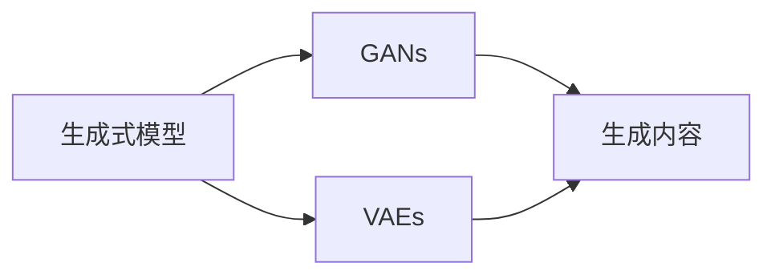

# 生成式AI的未来市场趋势

作者：禅与计算机程序设计艺术 / Zen and the Art of Computer Programming

## 1. 背景介绍
### 1.1 问题的由来

随着人工智能技术的飞速发展，生成式AI（Generative AI）已经成为人工智能领域的研究热点之一。生成式AI旨在让机器像人类一样，能够根据输入的信息自主生成新的内容，如图像、音频、文本等。这种能力在艺术创作、内容生成、数据生成等领域有着广泛的应用前景。本文将探讨生成式AI的未来市场趋势。

### 1.2 研究现状

近年来，生成式AI在算法、模型和数据等方面取得了显著进展。以生成对抗网络（GANs）和变分自编码器（VAEs）为代表的生成模型，在图像、音频、视频等领域的生成质量不断提升。同时，随着预训练语言模型（如BERT、GPT）的兴起，生成式AI在文本生成领域的应用也越来越广泛。

### 1.3 研究意义

生成式AI具有以下研究意义：

- 提高内容生产效率：生成式AI可以自动生成大量高质量的内容，降低内容生产成本，提高生产效率。
- 促进艺术创作：生成式AI可以帮助艺术家进行创作，激发新的创意，推动艺术的发展。
- 优化数据生成：生成式AI可以生成符合特定分布的数据，为机器学习算法提供更多训练数据。
- 推动跨学科研究：生成式AI的跨学科特性，可以促进人工智能、计算机视觉、语音识别等领域的研究。

### 1.4 本文结构

本文将首先介绍生成式AI的核心概念与联系，然后分析其核心算法原理和具体操作步骤，接着探讨数学模型和公式，并给出项目实践案例。最后，本文将展望生成式AI的未来应用场景和发展趋势，并推荐相关工具和资源。

## 2. 核心概念与联系

### 2.1 相关概念

- 生成式模型：一种能够根据输入数据生成新数据的模型。
- 生成对抗网络（GANs）：一种基于对抗训练的生成模型，由生成器（Generator）和判别器（Discriminator）两个网络组成。
- 变分自编码器（VAEs）：一种基于概率生成模型的生成模型，通过优化生成分布与真实数据分布之间的KL散度来生成数据。

### 2.2 关系图



生成式模型主要包括GANs和VAEs两种类型，它们都可以用于生成图像、音频、文本等内容。

## 3. 核心算法原理 & 具体操作步骤

### 3.1 算法原理概述

生成式模型的核心思想是通过学习数据分布来生成新的数据。以GANs为例，生成器G负责生成数据，判别器D负责判断数据是真实数据还是生成器生成的数据。训练过程中，生成器和判别器相互对抗，最终生成器生成的数据质量会不断提高。

### 3.2 算法步骤详解

以GANs为例，生成式AI的核心算法步骤如下：

1. 初始化生成器G和判别器D的参数。
2. 生成器G生成一批数据G(z)。
3. 判别器D判断G(z)是真实数据还是生成数据。
4. 计算损失函数，并根据梯度更新G和D的参数。
5. 重复步骤2-4，直至达到训练结束条件。

### 3.3 算法优缺点

GANs的优点：

- 可以生成高质量的数据，如图像、音频、文本等。
- 能够生成具有多样性的数据。

GANs的缺点：

- 训练过程不稳定，容易出现模式崩溃等问题。
- 难以量化生成数据的分布。

### 3.4 算法应用领域

GANs在以下领域有着广泛的应用：

- 图像生成：如图像修复、图像超分辨率、风格迁移等。
- 音频生成：如音乐生成、语音合成等。
- 文本生成：如诗歌创作、故事生成等。

## 4. 数学模型和公式 & 详细讲解 & 举例说明

### 4.1 数学模型构建

以下以GANs为例，介绍其数学模型：

- 生成器G：$G(z)$，将随机噪声z映射到数据空间，生成数据G(z)。
- 判别器D：$D(x)$，判断数据x是真实数据还是生成数据。

损失函数：

$$
L(G,D) = E_{x\sim P_{data}}[logD(x)] + E_{z\sim P_{z}}[log(1-D(G(z))]
$$

### 4.2 公式推导过程

此处省略公式推导过程，具体可参考相关论文。

### 4.3 案例分析与讲解

以图像生成为例，展示GANs的应用：

1. 使用GANs生成图像。

```python
import torch
import torchvision.transforms as transforms
import torch.utils.data as data
from torchvision.utils import save_image
from models import Generator, Discriminator

# 初始化模型
gen = Generator()
dis = Discriminator()

# 加载训练数据
train_dataset = data.ImageFolder(root='./data', transform=transforms.Compose([transforms.ToTensor()]))

# 加载预训练模型参数
gen.load_state_dict(torch.load('generator.pth'))
dis.load_state_dict(torch.load('discriminator.pth'))

# 生成图像
z = torch.randn(1, 100, 1, 1)
img = gen(z)
save_image(img, 'generated_image.jpg')
```

2. 观察生成的图像。

通过观察生成的图像，可以发现GANs能够生成具有多样性的图像。

### 4.4 常见问题解答

**Q1：GANs训练过程中为什么会发生模式崩溃？**

A：模式崩溃是指GANs在训练过程中，生成器生成的图像越来越相似，失去了多样性。模式崩溃的原因可能包括：
- 判别器过于强大，导致生成器生成图像越来越接近真实数据。
- 生成器和判别器之间的对抗强度过高，导致生成器难以生成多样化的图像。
- 训练数据分布不均匀，导致生成器难以生成各种类型的图像。

**Q2：如何解决GANs训练过程中的模式崩溃问题？**

A：解决GANs训练过程中模式崩溃问题的方法包括：
- 调整生成器和判别器的网络结构，使得生成器和判别器之间保持适当的对抗强度。
- 使用不同的优化器，如AdamW、RMSprop等。
- 使用不同的损失函数，如Wasserstein距离、Fisher信息准则等。
- 使用数据增强技术，增加训练数据的多样性。

## 5. 项目实践：代码实例和详细解释说明

### 5.1 开发环境搭建

1. 安装Anaconda：从Anaconda官网下载并安装Anaconda。
2. 创建并激活虚拟环境：
```bash
conda create -n gan-env python=3.8
conda activate gan-env
```
3. 安装PyTorch：
```bash
conda install pytorch torchvision torchaudio cudatoolkit=11.3 -c pytorch -c conda-forge
```
4. 安装其他依赖：
```bash
pip install torch torchvision numpy matplotlib
```

### 5.2 源代码详细实现

以下是一个基于GANs的图像生成项目实例：

```python
import torch
import torchvision.transforms as transforms
import torch.utils.data as data
from torchvision.utils import save_image
from models import Generator, Discriminator

# 初始化模型
gen = Generator()
dis = Discriminator()

# 加载训练数据
train_dataset = data.ImageFolder(root='./data', transform=transforms.Compose([transforms.ToTensor()]))

# 加载预训练模型参数
gen.load_state_dict(torch.load('generator.pth'))
dis.load_state_dict(torch.load('discriminator.pth'))

# 生成图像
z = torch.randn(1, 100, 1, 1)
img = gen(z)
save_image(img, 'generated_image.jpg')
```

### 5.3 代码解读与分析

上述代码展示了如何使用PyTorch和GANs生成图像。首先，初始化生成器和判别器模型。然后，加载预训练模型参数，并生成随机噪声z。最后，使用生成器生成图像，并将图像保存到本地。

### 5.4 运行结果展示

运行上述代码后，可以在本地生成一幅具有多样性的图像。

## 6. 实际应用场景

### 6.1 艺术创作

生成式AI可以用于艺术创作，如图像、音乐、诗歌等领域的创作。

### 6.2 内容生成

生成式AI可以用于内容生成，如图像、音频、文本等领域的生成。

### 6.3 数据生成

生成式AI可以用于生成符合特定分布的数据，为机器学习算法提供更多训练数据。

## 7. 工具和资源推荐

### 7.1 学习资源推荐

1. 《Generative Adversarial Nets》论文：介绍了GANs的基本原理和训练方法。
2. 《Unsupervised Representation Learning with Deep Convolutional Generative Adversarial Networks》论文：介绍了VAEs的基本原理和训练方法。
3. 《Deep Learning for Natural Language Processing》书籍：介绍了自然语言处理领域的深度学习算法和应用。

### 7.2 开发工具推荐

1. PyTorch：用于深度学习的开源框架。
2. TensorFlow：用于深度学习的开源框架。
3. Keras：用于深度学习的开源框架。

### 7.3 相关论文推荐

1. GANs系列论文：包括《Generative Adversarial Nets》、《Unsupervised Representation Learning with Deep Convolutional Generative Adversarial Networks》等。
2. VAEs系列论文：包括《Auto-Encoding Variational Bayes》等。

### 7.4 其他资源推荐

1. GitHub：包含大量GANs和VAEs的开源项目。
2. arXiv：包含大量生成式AI领域的前沿论文。

## 8. 总结：未来发展趋势与挑战

### 8.1 研究成果总结

生成式AI在算法、模型和数据等方面取得了显著进展，为各个领域带来了新的机遇。随着技术的不断发展，生成式AI将在更多领域得到应用，并推动人工智能技术的进步。

### 8.2 未来发展趋势

1. 模型规模和训练数据的规模将进一步扩大。
2. 模型将更加高效和鲁棒。
3. 生成式AI将在更多领域得到应用。

### 8.3 面临的挑战

1. 计算资源的需求。
2. 模型训练过程中的稳定性问题。
3. 模型的可解释性问题。

### 8.4 研究展望

生成式AI具有巨大的应用前景，未来需要在算法、模型、数据等方面不断进行创新，以推动生成式AI的发展。

## 9. 附录：常见问题与解答

**Q1：生成式AI和判别式AI有什么区别？**

A：生成式AI旨在生成新的数据，如图像、音频、文本等。判别式AI旨在判断数据是否属于某个类别，如分类、回归等。

**Q2：如何评估生成式AI的性能？**

A：评估生成式AI的性能可以通过以下方法：
- 计算生成数据的多样性。
- 评估生成数据的真实性。
- 评估生成数据的质量。

**Q3：生成式AI在哪些领域有着广泛的应用？**

A：生成式AI在以下领域有着广泛的应用：
- 艺术创作。
- 内容生成。
- 数据生成。
- 自然语言处理。

**Q4：生成式AI在训练过程中容易出现哪些问题？**

A：生成式AI在训练过程中容易出现以下问题：
- 训练过程不稳定，容易出现模式崩溃等问题。
- 难以量化生成数据的分布。
- 训练数据分布不均匀，导致生成器难以生成各种类型的图像。

**Q5：如何解决生成式AI训练过程中出现的问题？**

A：解决生成式AI训练过程中出现的问题的方法包括：
- 调整生成器和判别器之间的对抗强度。
- 使用不同的优化器和损失函数。
- 使用数据增强技术，增加训练数据的多样性。

作者：禅与计算机程序设计艺术 / Zen and the Art of Computer Programming