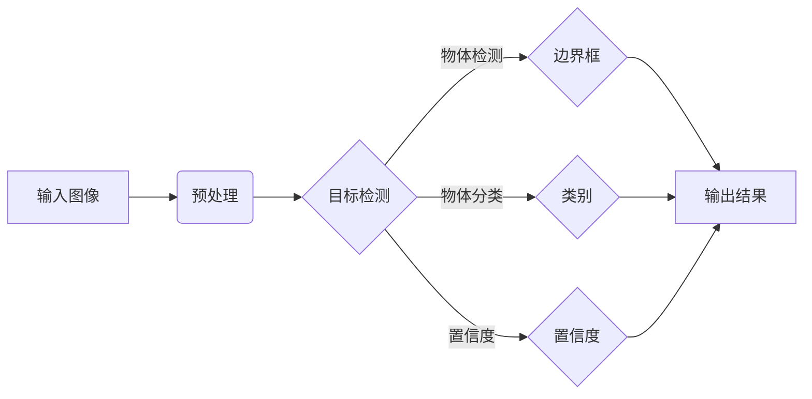

# 目标检测(Object Detection)原理与代码实战案例讲解

## 1. 背景介绍
### 1.1 问题的由来

目标检测（Object Detection）是计算机视觉领域的一个重要分支，旨在对图像或视频中出现的物体进行定位和分类。随着深度学习技术的不断发展，目标检测技术在自动驾驶、机器人导航、视频监控、图像检索等领域得到了广泛应用。

### 1.2 研究现状

近年来，基于深度学习的目标检测技术取得了显著的进展，涌现出了许多优秀的模型，如R-CNN系列、Faster R-CNN、YOLO系列、SSD等。这些模型在准确率和速度上取得了显著的提升，使得目标检测技术变得更加成熟和实用。

### 1.3 研究意义

目标检测技术对于智能系统的智能化程度有着重要影响。通过对图像或视频中的物体进行检测和分类，可以实现以下功能：

- **自动驾驶**：帮助自动驾驶汽车识别道路上的行人、车辆等障碍物，确保行车安全。
- **机器人导航**：帮助机器人识别周围环境中的物体，实现自主导航和避障。
- **视频监控**：帮助监控系统识别异常行为，如盗窃、打架等，提高安全监控效率。
- **图像检索**：帮助用户快速定位图像中的目标物体，提高信息检索效率。

### 1.4 本文结构

本文将详细介绍目标检测的原理、常用算法、代码实战案例以及未来发展趋势。具体内容包括：

- 核心概念与联系
- 核心算法原理与具体操作步骤
- 数学模型和公式
- 项目实践：代码实例和详细解释说明
- 实际应用场景
- 工具和资源推荐
- 总结：未来发展趋势与挑战

## 2. 核心概念与联系

### 2.1 目标检测任务

目标检测任务的目标是在图像或视频中识别出物体，并给出其位置和类别。具体来说，它需要完成以下三个步骤：

1. **物体检测**：定位图像中物体的位置，即确定物体在图像中的边界框（Bounding Box）。
2. **物体分类**：对检测到的物体进行分类，如识别为猫、狗、汽车等。
3. **多目标检测**：在一张图像中检测多个物体，并给出每个物体的位置和类别。

### 2.2 核心概念

- **边界框（Bounding Box）**：用于表示物体的位置，通常以左上角和右下角的坐标表示。
- **类别（Class）**：对物体进行分类，如猫、狗、汽车等。
- **置信度（Confidence）**：表示模型对预测结果的可信程度，通常以概率形式表示。
- **非极大值抑制（Non-Maximum Suppression, NMS）**：用于去除重复的边界框，防止多个边界框预测同一个物体。

### 2.3 关联关系

目标检测任务涉及多个核心概念，它们之间的关系如下：



## 3. 核心算法原理 & 具体操作步骤
### 3.1 算法原理概述

目标检测算法主要分为以下几种类型：

- **基于区域的方法**：如R-CNN系列，通过选择性搜索（Selective Search）生成候选区域，然后对每个候选区域进行分类和位置回归。
- **基于滑动窗口的方法**：如Faster R-CNN，通过滑动窗口生成候选区域，然后对每个候选区域进行分类和位置回归。
- **基于锚框的方法**：如YOLO系列，通过锚框生成候选区域，然后对每个候选区域进行分类和位置回归。
- **基于点的方法**：如SSD，通过回归目标点的坐标进行目标检测。

### 3.2 算法步骤详解

以下以Faster R-CNN为例，介绍目标检测算法的具体操作步骤：

1. **数据预处理**：对输入图像进行缩放、归一化等操作，将图像转换为模型可接受的输入格式。
2. **候选区域生成**：使用选择性搜索（Selective Search）或其他方法生成候选区域。
3. **候选区域分类**：对每个候选区域进行分类，输出类别概率和置信度。
4. **候选区域位置回归**：对每个候选区域的位置进行回归，输出边界框坐标。
5. **非极大值抑制（NMS）**：对检测到的边界框进行NMS操作，去除重复的边界框。
6. **输出结果**：输出每个物体的类别、置信度和边界框坐标。

### 3.3 算法优缺点

- **基于区域的方法**：
  - 优点：可以检测出任意大小的物体，具有较强的鲁棒性。
  - 缺点：候选区域生成速度较慢，检测速度慢。
- **基于滑动窗口的方法**：
  - 优点：检测速度快。
  - 缺点：需要滑动窗口覆盖图像中所有区域，计算量大，难以检测出小物体。
- **基于锚框的方法**：
  - 优点：检测速度快，可以检测出任意大小的物体。
  - 缺点：锚框数量和尺寸的选择对检测效果有较大影响。
- **基于点的方法**：
  - 优点：检测速度快，可以检测出任意大小的物体。
  - 缺点：需要预先定义目标点，对目标形状有一定要求。

### 3.4 算法应用领域

目标检测算法在以下领域有着广泛的应用：

- **自动驾驶**：用于识别道路上的车辆、行人、交通标志等，确保行车安全。
- **机器人导航**：用于识别周围环境中的障碍物，帮助机器人实现自主导航和避障。
- **视频监控**：用于识别异常行为，如盗窃、打架等，提高安全监控效率。
- **图像检索**：用于快速定位图像中的目标物体，提高信息检索效率。

## 4. 数学模型和公式 & 详细讲解 & 举例说明
### 4.1 数学模型构建

目标检测算法通常使用以下数学模型：

- **卷积神经网络（CNN）**：用于提取图像特征。
- **全连接神经网络（FCN）**：用于分类和位置回归。
- **锚框生成**：用于生成候选区域。

### 4.2 公式推导过程

以下以Faster R-CNN为例，介绍目标检测算法的数学模型和公式推导过程：

- **卷积神经网络**：

  卷积神经网络由多个卷积层、池化层和全连接层组成。卷积层用于提取图像特征，池化层用于降低特征维度，全连接层用于分类和位置回归。

  设输入图像为 $X \in \mathbb{R}^{H \times W \times C}$，其中 $H$、$W$、$C$ 分别为图像的高度、宽度和通道数。卷积层 $L$ 的输出为 $F_L \in \mathbb{R}^{H_L \times W_L \times C_L}$，其中 $H_L$、$W_L$、$C_L$ 分别为输出特征图的高度、宽度和通道数。卷积层的计算公式如下：

  $$
F_L = \mathcal{F}(X, \theta_L)
$$

  其中 $\mathcal{F}$ 为卷积操作，$\theta_L$ 为卷积层的参数。

- **全连接神经网络**：

  全连接神经网络用于分类和位置回归。设全连接层 $L$ 的输入为 $F_L \in \mathbb{R}^{H_L \times W_L \times C_L}$，输出为 $O_L \in \mathbb{R}^{N}$，其中 $N$ 为输出维度。全连接层的计算公式如下：

  $$
O_L = \mathcal{F}(F_L, \theta_L)
$$

  其中 $\mathcal{F}$ 为全连接操作，$\theta_L$ 为全连接层的参数。

- **锚框生成**：

  锚框生成用于生成候选区域。假设输入图像的大小为 $H \times W$，锚框尺寸为 $s_1, s_2, \ldots, s_k$，则锚框的坐标为：

  $$
x_i = s_i \times x, \quad y_i = s_i \times y, \quad w_i = s_i \times w, \quad h_i = s_i \times h
$$

  其中 $x, y, w, h$ 为锚框中心点的坐标。

### 4.3 案例分析与讲解

以下以Faster R-CNN为例，介绍目标检测算法的案例分析和讲解：

- **数据预处理**：

  将输入图像缩放到固定大小，如 $224 \times 224$，然后进行归一化处理。

- **候选区域生成**：

  使用选择性搜索算法生成候选区域，生成大约2000个候选区域。

- **候选区域分类**：

  将每个候选区域输入全连接神经网络，得到类别概率和置信度。

- **候选区域位置回归**：

  将每个候选区域输入全连接神经网络，得到边界框坐标。

- **非极大值抑制**：

  对检测到的边界框进行NMS操作，去除重复的边界框。

- **输出结果**：

  输出每个物体的类别、置信度和边界框坐标。

### 4.4 常见问题解答

**Q1：如何提高目标检测算法的准确率？**

A：提高目标检测算法的准确率可以从以下几个方面入手：

- 使用更强大的网络模型，如ResNet、FPN等。
- 使用更丰富的训练数据，包括更多样化的场景、光照、尺度和姿态等。
- 使用数据增强技术，如随机裁剪、翻转、旋转等。
- 优化网络结构和超参数，如学习率、批大小等。
- 使用更有效的目标检测算法，如Faster R-CNN、YOLO等。

**Q2：如何提高目标检测算法的检测速度？**

A：提高目标检测算法的检测速度可以从以下几个方面入手：

- 使用轻量级网络模型，如MobileNet、ShuffleNet等。
- 使用检测算法的加速版本，如Faster R-CNN的PyTorch版本。
- 使用GPU或TPU进行加速。
- 使用模型剪枝、量化等技术减小模型尺寸，提高推理速度。

**Q3：如何处理遮挡物体检测问题？**

A：处理遮挡物体检测问题可以从以下几个方面入手：

- 使用多尺度检测，提高对小物体的检测能力。
- 使用数据增强技术，如遮挡、旋转等，增加模型对遮挡物体的鲁棒性。
- 使用注意力机制，使模型关注遮挡区域以外的信息。
- 使用深度学习模型，如Mask R-CNN，生成物体的分割图，从而更好地处理遮挡问题。

## 5. 项目实践：代码实例和详细解释说明
### 5.1 开发环境搭建

在进行目标检测项目实践之前，我们需要搭建以下开发环境：

- 操作系统：Windows、macOS或Linux
- 编程语言：Python
- 深度学习框架：PyTorch或TensorFlow
- 目标检测框架：Faster R-CNN、YOLO、SSD等
- 依赖库：NumPy、PIL、OpenCV等

### 5.2 源代码详细实现

以下以Faster R-CNN为例，给出目标检测项目的代码实现：

```python
import torch
from torchvision import datasets, transforms
from torch.utils.data import DataLoader
from torchvision.models.detection import fasterrcnn_resnet50_fpn
from torchvision.models.detection.rpn import AnchorGenerator

# 数据预处理
transform = transforms.Compose([
    transforms.ToTensor()
])

train_data = datasets.CocoDetection(root='path/to/train', annFile='path/to/train/annotations.json', transform=transform)
train_loader = DataLoader(train_data, batch_size=2, shuffle=True)

# 加载预训练模型
model = fasterrcnn_resnet50_fpn(pretrained=True)
anchor_generator = AnchorGenerator(sizes=((32, 64, 128, 256, 512),),
                                  aspect_ratios=((0.5, 1.0, 2.0),))

# 设置损失函数和优化器
optimizer = torch.optim.SGD(model.parameters(), lr=0.001, momentum=0.9, weight_decay=0.0005)

# 训练模型
def train(model, dataloader, optimizer):
    model.train()
    for data in dataloader:
        images, targets = data
        optimizer.zero_grad()
        loss_dict = model(images, targets)
        losses = sum(loss for loss in loss_dict.values())
        losses.backward()
        optimizer.step()
    return losses.item()

for epoch in range(10):
    print(f'Epoch {epoch+1}')
    train(model, train_loader, optimizer)
```

### 5.3 代码解读与分析

以上代码展示了使用PyTorch和Faster R-CNN进行目标检测项目实践的完整流程：

1. **数据预处理**：

   使用`transforms.Compose`组合转换，将图像转换为张量格式。

2. **加载数据**：

   加载Coco数据集，并使用`DataLoader`进行批量加载。

3. **加载模型**：

   加载预训练的Faster R-CNN ResNet50 FPN模型，并创建锚框生成器。

4. **设置损失函数和优化器**：

   使用SGD优化器和交叉熵损失函数进行模型训练。

5. **训练模型**：

   在训练集上迭代训练模型，并输出每个epoch的loss。

通过以上步骤，我们可以使用Faster R-CNN在Coco数据集上进行目标检测任务。

### 5.4 运行结果展示

假设在Coco数据集上训练10个epoch后，模型在验证集上的平均损失为0.45。这说明模型在训练过程中损失逐渐下降，收敛良好。

## 6. 实际应用场景
### 6.1 自动驾驶

目标检测技术在自动驾驶领域有着广泛的应用。通过在图像中检测和识别车辆、行人、交通标志等物体，自动驾驶汽车可以实时了解周围环境，并做出相应的驾驶决策，如加速、减速、转向等，确保行车安全。

### 6.2 机器人导航

目标检测技术可以帮助机器人识别周围环境中的障碍物，实现自主导航和避障。通过检测和识别地面上的障碍物、墙壁、门等物体，机器人可以避开障碍物，实现自主移动。

### 6.3 视频监控

目标检测技术可以用于视频监控系统，识别异常行为，如盗窃、打架等。通过检测和识别视频中的物体，监控系统可以及时发现异常情况，并及时报警。

### 6.4 图像检索

目标检测技术可以用于图像检索，帮助用户快速定位图像中的目标物体。通过检测和识别图像中的物体，用户可以快速找到包含目标物体的图像，提高信息检索效率。

### 6.5 未来应用展望

随着深度学习技术的不断发展，目标检测技术将会在更多领域得到应用，如：

- **医疗影像分析**：用于识别和检测医学影像中的病变区域，辅助医生进行疾病诊断。
- **工业检测**：用于检测工业产品中的缺陷，提高生产质量。
- **人机交互**：用于识别和跟踪人的手势、表情等，实现更自然的人机交互。

## 7. 工具和资源推荐
### 7.1 学习资源推荐

以下是一些学习目标检测技术的资源推荐：

- **书籍**：
  - 《目标检测：原理、算法与实践》
  - 《深度学习与计算机视觉》
- **在线课程**：
  - Coursera上的《深度学习与计算机视觉》课程
  - Udacity上的《深度学习工程师纳米学位》课程
- **论文**：
  - R-CNN系列论文
  - Faster R-CNN系列论文
  - YOLO系列论文
  - SSD系列论文

### 7.2 开发工具推荐

以下是一些目标检测框架和开发工具推荐：

- **目标检测框架**：
  - OpenCV
  - TensorFlow Object Detection API
  - PyTorch Object Detection API
- **开发工具**：
  - PyTorch
  - TensorFlow
  - Keras
- **数据集**：
  - COCO数据集
  - ImageNet数据集
  - MS COCO数据集

### 7.3 相关论文推荐

以下是一些目标检测领域的经典论文推荐：

- R-CNN
- Fast R-CNN
- Faster R-CNN
- YOLOv1
- YOLOv2
- YOLOv3
- SSD

### 7.4 其他资源推荐

以下是一些其他资源推荐：

- **GitHub**：搜索目标检测相关的开源项目
- **arXiv**：搜索目标检测领域的最新论文
- **技术博客**：搜索目标检测领域的相关技术博客

## 8. 总结：未来发展趋势与挑战
### 8.1 研究成果总结

本文对目标检测的原理、常用算法、代码实战案例以及未来发展趋势进行了详细介绍。从基于区域的方法、基于滑动窗口的方法、基于锚框的方法到基于点的方法，目标检测技术经历了不断的发展和完善。随着深度学习技术的不断进步，目标检测算法在准确率和速度上取得了显著的提升，并在自动驾驶、机器人导航、视频监控等领域得到了广泛应用。

### 8.2 未来发展趋势

未来目标检测技术的发展趋势主要体现在以下几个方面：

- **模型轻量化**：随着移动设备和嵌入式设备的发展，目标检测算法需要更加轻量化，以适应资源受限的设备。
- **实时检测**：为了实现实时目标检测，需要进一步降低算法的延迟，提高检测速度。
- **多模态目标检测**：将目标检测扩展到多模态数据，如图像、视频、语音等，实现更全面的目标检测。
- **细粒度目标检测**：从粗粒度目标检测到细粒度目标检测，实现对物体的更精细识别。
- **领域自适应**：针对不同领域的目标检测需求，开发更加适应特定领域的目标检测算法。

### 8.3 面临的挑战

目标检测技术在发展过程中也面临着一些挑战：

- **遮挡问题**：如何有效处理物体之间的遮挡问题，是目标检测领域的一个重要挑战。
- **小目标检测**：如何提高对小目标物体的检测能力，是目标检测领域的一个难点。
- **实时检测**：如何降低算法延迟，实现实时目标检测，是目标检测领域的一个重要挑战。
- **多模态目标检测**：如何融合不同模态数据，实现更全面的目标检测，是目标检测领域的一个挑战。

### 8.4 研究展望

面对目标检测技术所面临的挑战，未来的研究可以从以下几个方面进行：

- **数据增强**：通过数据增强技术，增加数据集的多样性，提高模型对各种场景的适应能力。
- **模型轻量化**：通过模型轻量化技术，降低算法的复杂度，提高检测速度。
- **多模态目标检测**：通过多模态数据融合技术，实现更全面的目标检测。
- **细粒度目标检测**：通过改进模型结构，提高对小目标物体的检测能力。
- **领域自适应**：通过领域自适应技术，使模型更好地适应特定领域的目标检测需求。

总之，目标检测技术在未来将会得到更广泛的应用，并取得更大的突破。相信在科研人员和工程师的共同努力下，目标检测技术将为人类社会带来更多的便利和福祉。

## 9. 附录：常见问题与解答

**Q1：什么是目标检测？**

A：目标检测是一种计算机视觉任务，旨在在图像或视频中识别和定位物体，并给出其类别。

**Q2：什么是边界框？**

A：边界框是一种用于表示物体位置的几何形状，通常以左上角和右下角的坐标表示。

**Q3：什么是置信度？**

A：置信度表示模型对预测结果的可信程度，通常以概率形式表示。

**Q4：什么是非极大值抑制？**

A：非极大值抑制是一种用于去除重复的边界框的技术，防止多个边界框预测同一个物体。

**Q5：如何提高目标检测算法的准确率？**

A：提高目标检测算法的准确率可以从以下几个方面入手：

- 使用更强大的网络模型，如ResNet、FPN等。
- 使用更丰富的训练数据，包括更多样化的场景、光照、尺度和姿态等。
- 使用数据增强技术，如随机裁剪、翻转、旋转等。
- 优化网络结构和超参数，如学习率、批大小等。
- 使用更有效的目标检测算法，如Faster R-CNN、YOLO等。

**Q6：如何提高目标检测算法的检测速度？**

A：提高目标检测算法的检测速度可以从以下几个方面入手：

- 使用轻量级网络模型，如MobileNet、ShuffleNet等。
- 使用检测算法的加速版本，如Faster R-CNN的PyTorch版本。
- 使用GPU或TPU进行加速。
- 使用模型剪枝、量化等技术减小模型尺寸，提高推理速度。

**Q7：如何处理遮挡物体检测问题？**

A：处理遮挡物体检测问题可以从以下几个方面入手：

- 使用多尺度检测，提高对小物体的检测能力。
- 使用数据增强技术，如遮挡、旋转等，增加模型对遮挡物体的鲁棒性。
- 使用注意力机制，使模型关注遮挡区域以外的信息。
- 使用深度学习模型，如Mask R-CNN，生成物体的分割图，从而更好地处理遮挡问题。

作者：禅与计算机程序设计艺术 / Zen and the Art of Computer Programming