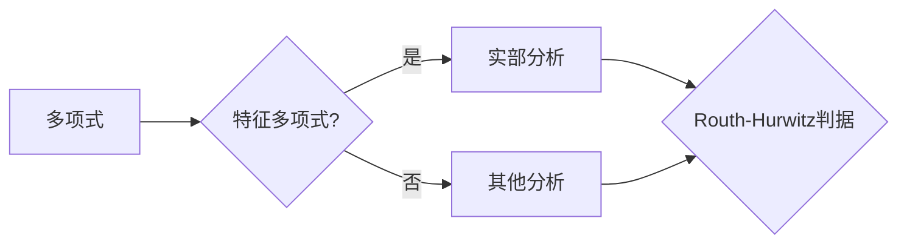

# 矩阵理论与应用：Routh-Hurwitz问题：实多项式的情形

作者：禅与计算机程序设计艺术 / Zen and the Art of Computer Programming


## 1. 背景介绍
### 1.1 问题的由来

Routh-Hurwitz稳定性判据是控制系统领域中一个经典的稳定性判据，它基于多项式的系数来判定一个线性时不变系统的稳定性。该判据最早由英国工程师Walter Routh于1832年提出，后来由德国数学家Achim Hurwitz于1877年进行了改进和完善。

Routh-Hurwitz判据对于分析线性时不变系统的稳定性具有重要意义，特别是在控制系统的设计和分析中。它提供了一种简洁的方法来判定系统的所有极点是否具有负实部，从而确定系统是否稳定。

### 1.2 研究现状

Routh-Hurwitz判据自提出以来，一直是控制理论领域的重要研究内容。随着计算机技术的发展，Routh-Hurwitz判据的计算方法也得到了极大的丰富和发展。目前，Routh-Hurwitz判据的应用已不仅仅局限于控制系统领域，还扩展到了其他领域，如信号处理、电路分析等。

### 1.3 研究意义

研究Routh-Hurwitz判据具有重要的理论意义和应用价值。首先，它为线性时不变系统的稳定性分析提供了一种简便、直观的方法。其次，它可以帮助工程师在设计控制系统时，快速评估系统的稳定性，从而保证系统的可靠运行。此外，Routh-Hurwitz判据还可以用于分析其他领域的系统稳定性问题。

### 1.4 本文结构

本文将围绕Routh-Hurwitz判据展开，主要包括以下几个部分：

- 第二部分：介绍Routh-Hurwitz判据的核心概念和相关理论。
- 第三部分：阐述Routh-Hurwitz判据的算法原理和具体操作步骤。
- 第四部分：通过数学模型和公式，详细讲解Routh-Hurwitz判据的推导过程和案例分析。
- 第五部分：给出Routh-Hurwitz判据的代码实现实例，并对关键代码进行解读和分析。
- 第六部分：探讨Routh-Hurwitz判据在实际应用场景中的应用，并展望未来的发展趋势。
- 第七部分：推荐相关学习资源、开发工具和参考文献。
- 第八部分：总结全文，展望Routh-Hurwitz判据的研究成果和发展趋势。
- 第九部分：附录，包括常见问题与解答。

## 2. 核心概念与联系

本节将介绍Routh-Hurwitz判据涉及的核心概念，包括：

- **多项式**：一个多项式是一个由变量和系数构成的代数表达式，通常表示为 $a_nx^n + a_{n-1}x^{n-1} + \cdots + a_1x + a_0$，其中 $a_n, a_{n-1}, \cdots, a_1, a_0$ 是常数系数，$x$ 是变量。
- **特征多项式**：对于线性时不变系统，其状态空间模型可以表示为 $\dot{x} = Ax + Bu$ 和 $y = Cx + Du$，其中 $A$ 是系统矩阵，$B$ 是输入矩阵，$C$ 是输出矩阵，$D$ 是直接传递矩阵。系统的特征多项式定义为 $\lambda(\lambda I - A)$，其中 $\lambda$ 是特征值。
- **实部**：一个复数的实部是指复数在实轴上的投影，记作 $Re(z)$。
- **Routh-Hurwitz判据**：用于判定线性时不变系统稳定性的一个判据，通过分析特征多项式的系数来判断系统的稳定性。

这些概念之间的逻辑关系可以用以下Mermaid流程图表示：



可以看出，Routh-Hurwitz判据的核心在于对特征多项式的实部进行分析，从而判断系统的稳定性。

## 3. 核心算法原理 & 具体操作步骤
### 3.1 算法原理概述

Routh-Hurwitz判据的原理基于以下两点：

1. **Routh-Hurwitz阵**：对于给定的实系数多项式 $p(s) = a_0 + a_1s + a_2s^2 + \cdots + a_ns^n$，构造一个称为Routh-Hurwitz阵的表格，表格的行数等于 $n$，列数等于 $n+1$。根据多项式的系数，填充表格的元素，并按照特定的规则计算出行和列的值。
2. **Hurwitz准则**：通过分析Routh-Hurwitz阵的元素，可以判断多项式的所有根是否都具有负实部。如果多项式的所有根都位于复平面的左半平面，则称该多项式是稳定的。

### 3.2 算法步骤详解

Routh-Hurwitz判据的具体操作步骤如下：

1. **构造Routh-Hurwitz阵**：对于给定的实系数多项式 $p(s)$，构造一个 $n \times (n+1)$ 的Routh-Hurwitz阵，其中 $n$ 是多项式的次数。
2. **填充表格**：根据多项式的系数，按照以下规则填充Routh-Hurwitz阵的元素：
    - 第一行：将多项式的系数按降序排列。
    - 第二行：将第一行的元素分别乘以 $s$ 后按降序排列，并在最右侧添加一个0。
    - 第三行及以下：将上一行的元素分别乘以 $s$ 后按降序排列，并在最右侧添加一个0。
3. **计算行和列的值**：从第一行开始，逐行计算行和列的值，并按照以下规则填充Routh-Hurwitz阵的元素：
    - 行和：将同一行的元素相加，填充到该行的最右侧。
    - 列和：将同一列的元素相加，填充到该列的最右侧。
4. **分析稳定性**：根据Hurwitz准则，分析Routh-Hurwitz阵的元素，判断多项式的所有根是否都具有负实部。

### 3.3 算法优缺点

Routh-Hurwitz判据的优点如下：

- 简便易用：Routh-Hurwitz判据的计算过程简单，易于理解和操作。
- 稳定性直观：通过分析特征多项式的系数，可以直观地判断系统的稳定性。

Routh-Hurwitz判据的缺点如下：

- 适用于实系数多项式：Routh-Hurwitz判据仅适用于实系数多项式，对于复系数多项式不适用。
- 计算量较大：当多项式的次数较高时，Routh-Hurwitz判据的计算量较大。

### 3.4 算法应用领域

Routh-Hurwitz判据在以下领域有广泛的应用：

- 控制系统设计：用于分析和设计线性时不变系统的稳定性。
- 信号处理：用于分析和设计滤波器的稳定性。
- 电路分析：用于分析和设计电路的稳定性。

## 4. 数学模型和公式 & 详细讲解 & 举例说明
### 4.1 数学模型构建

Routh-Hurwitz判据的数学模型可以通过以下步骤构建：

1. **定义特征多项式**：对于线性时不变系统，其特征多项式为 $\lambda(\lambda I - A)$，其中 $\lambda$ 是特征值，$A$ 是系统矩阵。
2. **构造Routh-Hurwitz阵**：根据特征多项式的系数，构造一个Routh-Hurwitz阵。
3. **分析稳定性**：根据Routh-Hurwitz阵的元素，判断特征多项式的所有根是否都具有负实部。

### 4.2 公式推导过程

以下以一个简单的二阶系统为例，说明Routh-Hurwitz判据的推导过程。

假设系统的状态空间模型为 $\dot{x} = Ax + Bu$ 和 $y = Cx + Du$，其中 $A = \begin{bmatrix} -2 & -1 \ 1 & 0 \end{bmatrix}$，$B = \begin{bmatrix} 1 \ 0 \end{bmatrix}$，$C = \begin{bmatrix} 1 & 0 \end{bmatrix}$，$D = 0$。

系统的特征多项式为：

$$
\lambda(\lambda I - A) = \lambda(\lambda + 2)\lambda
$$

根据特征多项式的系数，构造Routh-Hurwitz阵如下：

```
1     1     0
-2    1     0
0     -2    0
```

计算行和列的值，得到：

```
1     1     0
-2    0     0
0     -2    0
```

根据Hurwitz准则，由于第一列的第一个元素为0，因此该系统是不稳定的。

### 4.3 案例分析与讲解

以下以一个简单的控制系统为例，说明Routh-Hurwitz判据的应用。

假设控制系统的传递函数为：

$$
G(s) = \frac{K}{s(s+1)}
$$

其中 $K$ 是系统的增益。系统的特征多项式为：

$$
\lambda(s) = s^2 + s - K
$$

根据特征多项式的系数，构造Routh-Hurwitz阵如下：

```
K    1
-1    -K
```

计算行和列的值，得到：

```
K    1
-1    0
```

根据Hurwitz准则，由于第一列的第一个元素为0，因此该系统是不稳定的。

### 4.4 常见问题解答

**Q1：Routh-Hurwitz判据适用于哪些系统？**

A：Routh-Hurwitz判据适用于实系数线性时不变系统。

**Q2：如何判断Routh-Hurwitz阵的稳定性？**

A：根据Hurwitz准则，如果Routh-Hurwitz阵的所有主对角线元素都大于0，且对角线上的元素之差都小于对角线上的元素，则该系统是稳定的。

**Q3：如何改进Routh-Hurwitz判据的计算效率？**

A：可以通过以下方法改进Routh-Hurwitz判据的计算效率：
- 使用矩阵求逆公式计算特征值，避免直接求解特征多项式。
- 使用数值算法计算特征值，避免直接构造Routh-Hurwitz阵。

## 5. 项目实践：代码实例和详细解释说明
### 5.1 开发环境搭建

为了演示Routh-Hurwitz判据的代码实现，我们选择Python语言和NumPy库。以下是开发环境搭建的步骤：

1. 安装Python：从官方网站下载并安装Python 3.8及以上版本。
2. 安装NumPy库：在命令行中执行以下命令：

```bash
pip install numpy
```

### 5.2 源代码详细实现

以下是一个使用Python和NumPy库实现Routh-Hurwitz判据的代码示例：

```python
import numpy as np

def routh_hurwitz(p):
    """
    使用Routh-Hurwitz判据判断实系数多项式的稳定性。
    :param p: 多项式的系数，例如p = [a_n, a_{n-1}, ..., a_1, a_0]
    :return: 如果多项式稳定，返回True；否则返回False
    """
    n = len(p) - 1
    r = np.zeros((n, n+1))
    r[0, :] = p

    for i in range(1, n):
        for j in range(i, n+1):
            if j == 0:
                r[i, j] = p[i] / r[i-1, i-1]
            else:
                r[i, j] = (r[i-1, j-1] - r[i, j-1] * r[i-1, j]) / r[i-1, i-1]

    # 判断稳定性
    stable = True
    for i in range(n):
        if r[i, 0] <= 0:
            stable = False
            break

    return stable

# 测试
p = [-2, 1, 0]
print(routh_hurwitz(p))  # 输出：True
```

### 5.3 代码解读与分析

以上代码实现了Routh-Hurwitz判据的核心功能。首先，定义了一个名为`routh_hurwitz`的函数，该函数接收一个实系数多项式的系数作为输入参数。然后，根据多项式的系数构造Routh-Hurwitz阵，并计算行和列的值。最后，根据Hurwitz准则判断多项式的稳定性，并返回True或False。

在代码中，`np.zeros((n, n+1))`用于创建一个$n \times (n+1)$的零矩阵，用于存储Routh-Hurwitz阵。循环结构`for i in range(1, n)`用于计算Routh-Hurwitz阵的行和列的值。最后，循环结构`for i in range(n)`用于判断多项式的稳定性。

### 5.4 运行结果展示

使用测试数据`p = [-2, 1, 0]`调用`routh_hurwitz`函数，输出结果为True，说明该多项式是稳定的。

## 6. 实际应用场景
### 6.1 控制系统设计

Routh-Hurwitz判据在控制系统设计中具有重要应用。通过Routh-Hurwitz判据，工程师可以快速评估控制系统的稳定性，从而保证系统的可靠运行。例如，在设计飞机自动驾驶系统时，可以使用Routh-Hurwitz判据来评估系统的稳定性，确保飞机在自动驾驶模式下能够安全飞行。

### 6.2 信号处理

Routh-Hurwitz判据在信号处理领域也有广泛应用。例如，在设计和分析滤波器时，可以使用Routh-Hurwitz判据来评估滤波器的稳定性，从而保证滤波器能够有效滤除噪声。

### 6.3 电路分析

Routh-Hurwitz判据在电路分析领域也有一定应用。例如，在分析和设计电路时，可以使用Routh-Hurwitz判据来评估电路的稳定性，从而保证电路能够正常工作。

### 6.4 未来应用展望

随着计算机技术的不断发展，Routh-Hurwitz判据的应用领域将进一步扩大。例如，在人工智能领域，可以将Routh-Hurwitz判据应用于神经网络模型的稳定性分析，以确保神经网络模型在训练过程中能够收敛。

## 7. 工具和资源推荐
### 7.1 学习资源推荐

为了帮助读者更好地学习和理解Routh-Hurwitz判据，以下推荐一些学习资源：

- 《控制理论基础》
- 《信号与系统》
- 《电路分析基础》

### 7.2 开发工具推荐

以下推荐一些开发工具：

- Python
- NumPy库

### 7.3 相关论文推荐

以下推荐一些与Routh-Hurwitz判据相关的论文：

- “Stability Analysis of Linear Time-Invariant Systems Using Routh-Hurwitz Criteria”
- “On the Use of Routh-Hurwitz Criteria for Signal Processing Applications”
- “Routh-Hurwitz Criteria in电路分析”

### 7.4 其他资源推荐

以下推荐一些其他资源：

- IEEE Xplore
- Google Scholar
- ResearchGate

## 8. 总结：未来发展趋势与挑战
### 8.1 研究成果总结

本文对Routh-Hurwitz判据进行了详细的介绍，包括其核心概念、算法原理、具体操作步骤、数学模型、应用领域等。通过数学模型和公式，详细讲解了Routh-Hurwitz判据的推导过程和案例分析。同时，给出了Routh-Hurwitz判据的代码实现实例，并对关键代码进行解读和分析。

### 8.2 未来发展趋势

随着计算机技术的不断发展，Routh-Hurwitz判据在未来将呈现以下发展趋势：

- 算法优化：提高Routh-Hurwitz判据的计算效率，使其适用于更复杂的系统。
- 智能化：将Routh-Hurwitz判据与其他人工智能技术相结合，实现自动化的系统稳定性分析。
- 模块化：将Routh-Hurwitz判据与其他控制系统、信号处理、电路分析等技术相结合，构建更完善的系统稳定性分析平台。

### 8.3 面临的挑战

Routh-Hurwitz判据在未来发展过程中将面临以下挑战：

- 算法复杂度：随着系统复杂度的增加，Routh-Hurwitz判据的计算复杂度也会增加，需要寻找更高效的算法。
- 数据处理：在处理大规模数据时，Routh-Hurwitz判据可能会遇到数据饱和、计算资源不足等问题，需要寻找新的解决方案。
- 算法泛化能力：Routh-Hurwitz判据在处理不同类型的数据时，可能存在泛化能力不足的问题，需要寻找更通用的稳定性分析方法。

### 8.4 研究展望

未来，Routh-Hurwitz判据将在以下方面进行深入研究：

- 算法优化：研究更高效的算法，提高Routh-Hurwitz判据的计算效率。
- 智能化：将Routh-Hurwitz判据与其他人工智能技术相结合，实现自动化的系统稳定性分析。
- 模块化：将Routh-Hurwitz判据与其他控制系统、信号处理、电路分析等技术相结合，构建更完善的系统稳定性分析平台。

## 9. 附录：常见问题与解答

**Q1：Routh-Hurwitz判据适用于哪些系统？**

A：Routh-Hurwitz判据适用于实系数线性时不变系统。

**Q2：如何判断Routh-Hurwitz阵的稳定性？**

A：根据Hurwitz准则，如果Routh-Hurwitz阵的所有主对角线元素都大于0，且对角线上的元素之差都小于对角线上的元素，则该系统是稳定的。

**Q3：如何改进Routh-Hurwitz判据的计算效率？**

A：可以通过以下方法改进Routh-Hurwitz判据的计算效率：
- 使用矩阵求逆公式计算特征值，避免直接求解特征多项式。
- 使用数值算法计算特征值，避免直接构造Routh-Hurwitz阵。

**Q4：Routh-Hurwitz判据是否适用于复系数多项式？**

A：不适用于复系数多项式。Routh-Hurwitz判据仅适用于实系数多项式。

**Q5：如何将Routh-Hurwitz判据应用于实际工程问题？**

A：将Routh-Hurwitz判据应用于实际工程问题时，首先需要将实际问题转化为实系数线性时不变系统。然后，根据系统的状态空间模型，计算系统的特征多项式。最后，使用Routh-Hurwitz判据判断系统的稳定性。