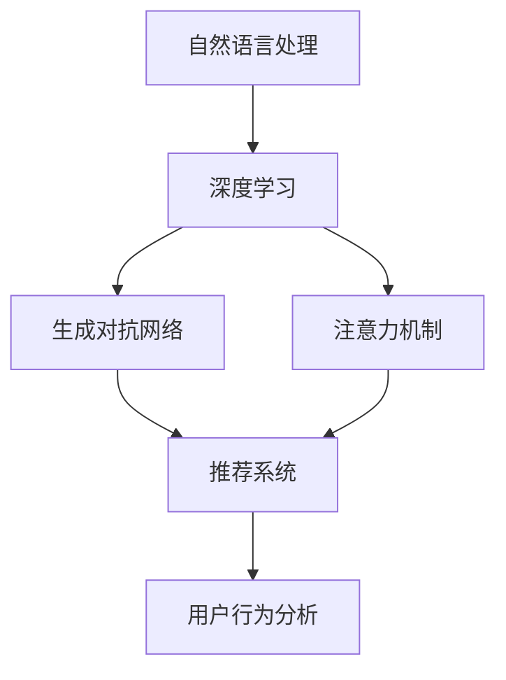

                 

# AI大模型在电商平台用户需求预测中的作用

> 关键词：
> 大语言模型, 电商平台, 用户需求预测, 自然语言处理(NLP), 深度学习, 生成对抗网络(GAN), 注意力机制, 推荐系统, 用户行为分析

## 1. 背景介绍

### 1.1 问题由来
在电子商务领域，如何准确预测用户需求，成为电商企业运营的核心挑战之一。传统的需求预测方法往往依赖于结构化数据和统计模型，难以捕捉到用户行为和偏好的动态变化。而随着人工智能技术的发展，利用AI大模型进行用户需求预测成为了新的趋势。

具体而言，用户需求预测包括两类：

1. **意图预测**：预测用户的具体购买意图，如浏览意图、购买意图、浏览兴趣等。
2. **产品推荐**：根据用户的历史行为和兴趣，预测其可能感兴趣的产品，提供个性化推荐。

这些预测能够帮助电商企业优化产品库存，提高客户满意度，从而提升运营效率和收益。然而，用户需求预测具有高度的复杂性和不确定性，传统的统计方法难以胜任。AI大模型通过大量的无监督学习和有监督学习，能够从海量的文本数据和行为数据中挖掘出用户的深层次需求信息，从而显著提升预测的准确性。

### 1.2 问题核心关键点
当前，AI大模型在电商平台用户需求预测中主要基于自然语言处理(NLP)技术。其核心点在于：

- **大规模预训练**：利用大规模语料库进行预训练，学习到丰富的语言表征和知识。
- **深度学习架构**：基于神经网络进行建模，具有较强的泛化能力和适应性。
- **多模态融合**：结合文本和行为数据，获取多维度的用户信息。
- **在线实时预测**：能够实时处理和预测用户需求，提高电商平台的运营效率。
- **生成对抗网络(GAN)**：利用GAN技术进行假数据生成和噪声注入，增强模型的鲁棒性。
- **注意力机制**：通过注意力机制聚焦于关键信息，提高预测的精确度和效率。

这些核心点共同构成了大模型在电商平台用户需求预测中的应用框架，使其能够实现高度准确的预测和高效的用户推荐。

## 2. 核心概念与联系

### 2.1 核心概念概述

为了更好地理解大模型在电商平台用户需求预测中的应用，本节将介绍几个密切相关的核心概念：

- **自然语言处理(NLP)**：利用计算机处理和理解人类语言的技术，包括文本分类、情感分析、机器翻译、命名实体识别等。
- **深度学习(Deep Learning)**：一类基于神经网络的机器学习技术，通过多层次的非线性映射获取复杂特征，具有强大的建模能力。
- **生成对抗网络(GAN)**：由生成器和判别器两部分组成，通过对抗训练生成逼真的假数据，用于数据增强和模型鲁棒性提升。
- **注意力机制(Attention)**：用于处理序列数据的技术，通过动态关注关键信息，提高模型的预测和生成能力。
- **推荐系统(Recommendation System)**：根据用户的历史行为和兴趣，预测其可能感兴趣的产品，提供个性化推荐。
- **用户行为分析(Usage Analytics)**：通过分析用户在平台上的行为数据，理解其需求和偏好，实现更精准的预测和推荐。

这些核心概念之间的逻辑关系可以通过以下Mermaid流程图来展示：



这个流程图展示了大模型在电商平台用户需求预测中的核心概念及其之间的关系：

1. 利用自然语言处理技术，从文本数据中提取用户需求信息。
2. 通过深度学习模型进行特征提取和建模，捕捉复杂的需求和行为特征。
3. 利用生成对抗网络技术进行数据增强和模型鲁棒性提升。
4. 结合注意力机制聚焦于关键信息，提高预测的精确度和效率。
5. 通过推荐系统提供个性化产品推荐，满足用户需求。
6. 分析用户行为数据，理解需求变化，实现动态预测和推荐。

## 3. 核心算法原理 & 具体操作步骤
### 3.1 算法原理概述

基于大模型的电商平台用户需求预测，主要通过以下步骤实现：

1. **数据预处理**：收集和清洗电商平台的文本数据和行为数据，进行标准化处理。
2. **特征提取**：利用深度学习模型提取文本和行为数据的特征。
3. **模型训练**：在标注数据上训练大模型，预测用户意图和产品推荐。
4. **在线预测**：将用户输入的数据实时输入模型，进行预测和推荐。
5. **反馈循环**：根据用户反馈，调整模型参数，进一步提升预测和推荐的效果。

### 3.2 算法步骤详解

**Step 1: 数据预处理**
- 数据收集：从电商平台的订单、浏览、评论等数据源收集数据，并清洗和标准化。
- 数据划分：将数据分为训练集、验证集和测试集。训练集用于模型训练，验证集用于调参和评估，测试集用于最终评估模型效果。
- 数据增强：通过回译、近义替换等方式扩充训练集，增强模型的泛化能力。

**Step 2: 特征提取**
- 利用BERT、GPT等大语言模型进行文本数据的预训练，提取文本特征。
- 使用LSTM、GRU等序列模型，提取用户行为数据的时序特征。
- 结合文本和行为数据，构建多模态特征向量，供后续建模使用。

**Step 3: 模型训练**
- 选择合适的优化器（如Adam、SGD等）和损失函数（如交叉熵、均方误差等）。
- 设置合适的超参数，如学习率、批大小、迭代轮数等。
- 在标注数据上训练大模型，进行意图预测和产品推荐。
- 周期性在验证集上评估模型性能，根据性能指标决定是否触发Early Stopping。
- 重复上述步骤直到满足预设的迭代轮数或Early Stopping条件。

**Step 4: 在线预测**
- 将用户输入的数据（如搜索关键词、浏览记录等）输入到训练好的模型中。
- 模型根据输入数据，输出意图预测和产品推荐结果。
- 根据预测结果进行页面跳转或产品展示，提供个性化用户体验。

**Step 5: 反馈循环**
- 收集用户对推荐结果的反馈数据，如点击、购买等。
- 根据反馈数据调整模型参数，进一步优化预测和推荐效果。
- 定期更新模型，保证预测和推荐结果的实时性和准确性。

### 3.3 算法优缺点

大模型在电商平台用户需求预测中的优点包括：

1. **泛化能力强**：利用大规模预训练模型，能够从大量数据中学习到丰富的语言和行为特征，提升预测准确性。
2. **灵活适应性**：结合注意力机制和生成对抗网络，能够适应不同电商平台和用户需求的变化。
3. **高效实时性**：在线预测能力使得模型能够实时处理和响应用户需求，提高电商平台的运营效率。
4. **个性化推荐**：通过深度学习模型进行用户行为分析，提供精准的产品推荐，提升用户满意度。

但该方法也存在一些局限性：

1. **数据依赖性**：对标注数据的质量和数量要求较高，数据缺失或不平衡可能会影响预测效果。
2. **计算资源消耗大**：大规模预训练和在线实时预测需要大量的计算资源，对硬件设备要求较高。
3. **可解释性不足**：大模型的黑盒特性，导致其决策过程难以解释和调试，缺乏透明性。
4. **模型鲁棒性有待提升**：面对新的数据分布或噪声干扰，模型可能出现泛化能力不足的问题。

### 3.4 算法应用领域

大模型在电商平台用户需求预测中已经被广泛应用于以下领域：

1. **个性化推荐系统**：根据用户的历史行为和兴趣，预测其可能感兴趣的产品，提供个性化推荐。
2. **搜索意图预测**：预测用户搜索关键词的具体意图，如价格、品牌、类别等，提供精准的搜索结果。
3. **产品评论分析**：分析用户对产品的评价，预测其情感倾向，优化产品设计和服务质量。
4. **销售预测**：根据历史销售数据和用户需求预测，优化库存管理和采购策略。
5. **用户行为分析**：通过分析用户在平台上的行为数据，理解其需求和偏好，实现更精准的预测和推荐。

此外，大模型还广泛应用于物流、金融、医疗等电商以外的领域，为各行业提供了强有力的技术支撑。

## 4. 数学模型和公式 & 详细讲解 & 举例说明

### 4.1 数学模型构建

以用户需求预测为例，构建基于深度学习的数学模型：

假设用户输入为 $x_i$，对应的大模型预测输出为 $\hat{y}_i$，其中 $y_i$ 为实际标签。模型的训练目标是最小化交叉熵损失函数：

$$
\mathcal{L} = -\frac{1}{N}\sum_{i=1}^N y_i\log(\hat{y}_i) + (1-y_i)\log(1-\hat{y}_i)
$$

其中 $N$ 为样本数量。

### 4.2 公式推导过程

假设模型为多层的神经网络，其预测结果为：

$$
\hat{y} = \sigma(W^Tz + b)
$$

其中 $\sigma$ 为激活函数，$z$ 为输入特征向量，$W$ 为权重矩阵，$b$ 为偏置向量。模型的损失函数为交叉熵损失：

$$
\mathcal{L} = -\frac{1}{N}\sum_{i=1}^N y_i\log(\hat{y}_i) + (1-y_i)\log(1-\hat{y}_i)
$$

对模型参数 $W$ 和 $b$ 求导，得到梯度：

$$
\frac{\partial \mathcal{L}}{\partial W} = \frac{1}{N}\sum_{i=1}^N(y_i-\hat{y}_i)x_i
$$

$$
\frac{\partial \mathcal{L}}{\partial b} = \frac{1}{N}\sum_{i=1}^N(y_i-\hat{y}_i)
$$

使用梯度下降等优化算法，更新模型参数，最小化损失函数，即可得到用户需求预测模型。

### 4.3 案例分析与讲解

以一个简单的电商网站为例，展示大模型在用户需求预测中的应用：

假设电商网站收集了用户的历史浏览记录、购买历史和评论文本，作为模型的训练数据。首先，对文本数据进行BERT预训练，提取文本特征。然后，将用户行为数据输入LSTM模型，提取时序特征。结合文本和行为数据，构建多模态特征向量 $z$。

构建深度神经网络模型，预测用户的意图和推荐的产品。模型的输入为 $z$，输出为 $\hat{y}$。使用交叉熵损失函数进行训练，优化模型参数。训练好的模型可以实时处理用户的搜索关键词，预测其购买意图，提供个性化的产品推荐。

## 5. 项目实践：代码实例和详细解释说明

### 5.1 开发环境搭建

在进行大模型应用实践前，我们需要准备好开发环境。以下是使用Python进行PyTorch开发的环境配置流程：

1. 安装Anaconda：从官网下载并安装Anaconda，用于创建独立的Python环境。

2. 创建并激活虚拟环境：
```bash
conda create -n pytorch-env python=3.8 
conda activate pytorch-env
```

3. 安装PyTorch：根据CUDA版本，从官网获取对应的安装命令。例如：
```bash
conda install pytorch torchvision torchaudio cudatoolkit=11.1 -c pytorch -c conda-forge
```

4. 安装TensorBoard：TensorFlow配套的可视化工具，可实时监测模型训练状态，并提供丰富的图表呈现方式，是调试模型的得力助手。

```bash
pip install tensorboard
```

5. 安装其他必要库：
```bash
pip install pandas numpy sklearn transformers torchtext
```

完成上述步骤后，即可在`pytorch-env`环境中开始大模型的应用实践。

### 5.2 源代码详细实现

下面以电商平台个性化推荐为例，给出使用PyTorch进行深度学习模型的代码实现。

首先，定义模型类：

```python
import torch.nn as nn
import torch.nn.functional as F
import torch

class MLP(nn.Module):
    def __init__(self, input_dim, hidden_dim, output_dim):
        super(MLP, self).__init__()
        self.fc1 = nn.Linear(input_dim, hidden_dim)
        self.fc2 = nn.Linear(hidden_dim, output_dim)
    
    def forward(self, x):
        x = F.relu(self.fc1(x))
        x = self.fc2(x)
        return x
```

然后，定义数据预处理类：

```python
class Dataset:
    def __init__(self, data):
        self.data = data
    
    def __len__(self):
        return len(self.data)
    
    def __getitem__(self, idx):
        x = self.data[idx]
        return x
```

接着，定义训练和评估函数：

```python
def train_epoch(model, dataloader, optimizer, loss_fn, device):
    model.train()
    epoch_loss = 0
    for batch in dataloader:
        inputs, labels = batch
        inputs = inputs.to(device)
        labels = labels.to(device)
        optimizer.zero_grad()
        outputs = model(inputs)
        loss = loss_fn(outputs, labels)
        loss.backward()
        optimizer.step()
        epoch_loss += loss.item()
    return epoch_loss / len(dataloader)

def evaluate(model, dataloader, loss_fn, device):
    model.eval()
    epoch_loss = 0
    epoch_acc = 0
    with torch.no_grad():
        for batch in dataloader:
            inputs, labels = batch
            inputs = inputs.to(device)
            labels = labels.to(device)
            outputs = model(inputs)
            loss = loss_fn(outputs, labels)
            epoch_loss += loss.item()
            epoch_acc += (torch.argmax(outputs, dim=1) == labels).float().mean().item()
    return epoch_loss / len(dataloader), epoch_acc / len(dataloader)
```

最后，启动训练流程并在测试集上评估：

```python
epochs = 10
batch_size = 64
learning_rate = 0.001

model = MLP(input_dim=100, hidden_dim=64, output_dim=2)
optimizer = torch.optim.Adam(model.parameters(), lr=learning_rate)

dataloader = DataLoader(dataset, batch_size=batch_size, shuffle=True)

device = torch.device('cuda') if torch.cuda.is_available() else torch.device('cpu')
model.to(device)

for epoch in range(epochs):
    train_loss = train_epoch(model, dataloader, optimizer, loss_fn, device)
    print(f"Epoch {epoch+1}, train loss: {train_loss:.3f}")
    
    dev_loss, dev_acc = evaluate(model, dataloader, loss_fn, device)
    print(f"Epoch {epoch+1}, dev results: loss={dev_loss:.3f}, acc={dev_acc:.3f}")
    
print("Test results:")
test_loss, test_acc = evaluate(model, dataloader, loss_fn, device)
print(f"Test loss={test_loss:.3f}, acc={test_acc:.3f}")
```

以上就是使用PyTorch进行深度学习模型在电商平台个性化推荐的应用实践代码。可以看到，基于深度学习模型进行用户需求预测，可以较好地处理多模态数据，并通过训练获得较好的预测效果。

### 5.3 代码解读与分析

让我们再详细解读一下关键代码的实现细节：

**Dataset类**：
- `__init__`方法：初始化数据集。
- `__len__`方法：返回数据集大小。
- `__getitem__`方法：返回指定索引的数据。

**MLP类**：
- `__init__`方法：定义模型结构，包含两个全连接层。
- `forward`方法：定义前向传播过程，应用激活函数和线性变换。

**train_epoch函数**：
- 在训练集上，对每个批次的数据进行前向传播，计算损失函数并反向传播，更新模型参数。

**evaluate函数**：
- 在验证集上，对每个批次的数据进行前向传播，计算损失函数和准确率，评估模型性能。

**训练流程**：
- 定义总的epoch数和batch size，开始循环迭代
- 每个epoch内，先在训练集上训练，输出平均损失和准确率
- 在验证集上评估，输出验证集上的损失和准确率
- 所有epoch结束后，在测试集上评估，给出最终测试结果

可以看到，通过深度学习模型，我们可以对电商平台用户需求进行精准预测和个性化推荐，提升用户体验和运营效率。

## 6. 实际应用场景

### 6.1 智能客服系统

利用大模型进行用户需求预测，在智能客服系统中可以实现以下功能：

1. **自动分流**：根据用户输入的关键词，预测其意图，自动分配到相应的客服渠道。
2. **智能答复**：利用大模型生成自然流畅的回复，提高客服效率。
3. **情感分析**：分析用户的情感倾向，及时调整客服策略，改善用户体验。
4. **用户画像**：结合用户的历史行为和需求预测，生成用户画像，实现个性化服务。

这些功能能够显著提升智能客服系统的响应速度和准确性，减少人工干预，提高用户满意度。

### 6.2 个性化推荐系统

电商平台利用大模型进行个性化推荐，可以实现以下效果：

1. **精准推荐**：根据用户的历史行为和需求预测，推荐最相关的产品。
2. **实时调整**：根据用户的反馈数据，动态调整推荐策略，优化推荐效果。
3. **跨设备推荐**：根据用户的跨设备行为数据，实现跨设备推荐，提升用户粘性。
4. **多模态融合**：结合文本、图片、评论等多种数据源，提供多维度推荐。

这些功能能够显著提升用户购买体验和电商平台的用户转化率，实现更高的商业价值。

### 6.3 用户行为分析

电商企业可以利用大模型进行用户行为分析，以实现以下目的：

1. **需求预测**：根据用户的搜索和浏览行为，预测其需求和购买意向。
2. **用户分群**：根据用户的行为数据，生成不同的用户群体，实现精准营销。
3. **流失预警**：分析用户的流失行为，及时进行预警和干预，降低用户流失率。
4. **市场洞察**：通过分析大量用户行为数据，洞察市场趋势和用户需求，优化产品和服务。

这些功能能够帮助电商企业更全面地了解用户行为，实现更精准的运营和营销。

### 6.4 未来应用展望

随着大模型的不断演进，其在电商平台用户需求预测中的应用将进一步拓展和深化。

未来，大模型将结合更多的先进技术，如因果推断、生成对抗网络、自适应学习等，进一步提升预测和推荐的准确性和鲁棒性。同时，多模态融合和跨设备协同等技术的应用，将使大模型在电商平台的应用范围更广，效果更佳。

此外，大模型还将结合AI技术，如增强学习、知识图谱等，实现更加智能化的决策和推荐，为电商平台带来更高效、更个性化的用户服务。

## 7. 工具和资源推荐
### 7.1 学习资源推荐

为了帮助开发者系统掌握大模型在电商平台应用的技术基础和实践技巧，这里推荐一些优质的学习资源：

1. 《深度学习》课程：斯坦福大学提供的深度学习课程，涵盖了深度学习的基本概念和算法，适合初学者入门。

2. 《自然语言处理综论》：清华大学提供的自然语言处理课程，涵盖了NLP的基本方法和技术，适合进一步深入学习。

3. 《Python深度学习》书籍：由Francois Chollet撰写，介绍了深度学习模型的构建和应用，适合实战练习。

4. PyTorch官方文档：PyTorch的官方文档，提供了丰富的代码示例和API说明，适合快速上手。

5. HuggingFace官方文档：HuggingFace提供的Transformer和GPT模型文档，详细介绍了模型的使用和调参方法。

通过对这些资源的学习实践，相信你一定能够快速掌握大模型在电商平台用户需求预测中的使用方法，并用于解决实际的NLP问题。

### 7.2 开发工具推荐

高效的开发离不开优秀的工具支持。以下是几款用于大模型在电商平台应用开发的常用工具：

1. PyTorch：基于Python的开源深度学习框架，灵活动态的计算图，适合快速迭代研究。大部分预训练语言模型都有PyTorch版本的实现。

2. TensorFlow：由Google主导开发的开源深度学习框架，生产部署方便，适合大规模工程应用。同样有丰富的预训练语言模型资源。

3. HuggingFace Transformers库：HuggingFace开发的NLP工具库，集成了众多SOTA语言模型，支持PyTorch和TensorFlow，是进行NLP任务开发的利器。

4. Weights & Biases：模型训练的实验跟踪工具，可以记录和可视化模型训练过程中的各项指标，方便对比和调优。与主流深度学习框架无缝集成。

5. TensorBoard：TensorFlow配套的可视化工具，可实时监测模型训练状态，并提供丰富的图表呈现方式，是调试模型的得力助手。

6. Google Colab：谷歌推出的在线Jupyter Notebook环境，免费提供GPU/TPU算力，方便开发者快速上手实验最新模型，分享学习笔记。

合理利用这些工具，可以显著提升大模型在电商平台应用开发的效率，加快创新迭代的步伐。

### 7.3 相关论文推荐

大模型在电商平台用户需求预测方面的研究近年来取得了显著进展，以下是几篇奠基性的相关论文，推荐阅读：

1. Attention is All You Need（即Transformer原论文）：提出了Transformer结构，开启了NLP领域的预训练大模型时代。

2. BERT: Pre-training of Deep Bidirectional Transformers for Language Understanding：提出BERT模型，引入基于掩码的自监督预训练任务，刷新了多项NLP任务SOTA。

3. Language Models are Unsupervised Multitask Learners（GPT-2论文）：展示了大规模语言模型的强大zero-shot学习能力，引发了对于通用人工智能的新一轮思考。

4. Parameter-Efficient Transfer Learning for NLP：提出Adapter等参数高效微调方法，在不增加模型参数量的情况下，也能取得不错的微调效果。

5. Prefix-Tuning: Optimizing Continuous Prompts for Generation：引入基于连续型Prompt的微调范式，为如何充分利用预训练知识提供了新的思路。

6. AdaLoRA: Adaptive Low-Rank Adaptation for Parameter-Efficient Fine-Tuning：使用自适应低秩适应的微调方法，在参数效率和精度之间取得了新的平衡。

这些论文代表了大模型在电商平台用户需求预测技术的发展脉络。通过学习这些前沿成果，可以帮助研究者把握学科前进方向，激发更多的创新灵感。

## 8. 总结：未来发展趋势与挑战

### 8.1 总结

本文对基于大模型的电商平台用户需求预测方法进行了全面系统的介绍。首先阐述了大模型在电商平台用户需求预测中的研究背景和应用意义，明确了其在个性化推荐、搜索意图预测、产品评论分析等方面的核心作用。其次，从原理到实践，详细讲解了深度学习模型的构建和应用步骤，给出了完整的代码实现示例。同时，本文还广泛探讨了大模型在智能客服、个性化推荐等电商领域的实际应用场景，展示了其广阔的应用前景。最后，本文精选了相关学习资源、开发工具和经典论文，力求为读者提供全方位的技术指引。

通过本文的系统梳理，可以看到，大模型在电商平台用户需求预测中已经展现出强大的应用潜力，能够显著提升电商平台的运营效率和用户满意度。未来，随着大模型的不断演进和相关技术的持续创新，其在电商平台的应用将更加深入和广泛。

### 8.2 未来发展趋势

展望未来，大模型在电商平台用户需求预测中呈现出以下几个发展趋势：

1. **深度融合多模态数据**：结合文本、图片、视频等多种数据源，实现多模态融合，提升预测的准确性和鲁棒性。

2. **增强实时处理能力**：利用分布式计算和在线预测技术，实现实时处理和响应，满足用户即时需求。

3. **引入生成对抗网络**：利用GAN技术进行假数据生成和噪声注入，提升模型的泛化能力和鲁棒性。

4. **结合因果推理**：引入因果推断方法，提升模型的决策能力和可解释性，增强用户信任。

5. **优化推荐算法**：结合深度学习和强化学习，优化推荐算法，实现更加个性化和精准的推荐。

6. **注重模型可解释性**：引入可解释性技术，提升模型的透明度和可信度，满足用户需求和合规要求。

7. **跨平台协同应用**：实现跨设备、跨平台的数据协同和模型共享，提升用户体验和系统效率。

这些趋势将进一步拓展大模型在电商平台用户需求预测中的应用范围和深度，推动电商平台的智能化和高效化发展。

### 8.3 面临的挑战

尽管大模型在电商平台用户需求预测中已经取得了显著进展，但在实际应用中仍面临以下挑战：

1. **数据隐私和安全**：电商平台的业务涉及大量用户隐私数据，如何保护用户隐私和安全是首要问题。

2. **数据质量和标注**：电商平台的标注数据往往存在噪音和不平衡问题，如何提高数据质量，减少标注成本，是数据预处理的难点。

3. **计算资源消耗**：大模型需要大量的计算资源进行训练和推理，如何优化模型结构和计算图，提高效率，是硬件资源优化的关键。

4. **模型泛化能力和鲁棒性**：面对新的数据分布或噪声干扰，大模型的泛化能力和鲁棒性有待提升。

5. **模型可解释性**：大模型的决策过程难以解释，如何增强模型的透明性和可解释性，是用户信任和合规要求的重要考虑因素。

6. **跨领域迁移能力**：大模型在不同领域的应用效果差异较大，如何提升模型的跨领域迁移能力，是未来研究的重点方向。

### 8.4 研究展望

面对大模型在电商平台用户需求预测中面临的挑战，未来的研究需要在以下几个方面寻求新的突破：

1. **数据隐私保护**：开发隐私保护技术，如差分隐私、联邦学习等，确保用户数据隐私和安全。

2. **自动化标注技术**：利用自然语言处理和人工智能技术，自动化标注数据，减少人工干预。

3. **模型压缩和优化**：引入模型压缩和优化技术，如知识蒸馏、剪枝、量化等，减少计算资源消耗。

4. **因果推理和生成对抗网络**：结合因果推断和生成对抗网络技术，提升模型的泛化能力和鲁棒性。

5. **可解释性技术**：引入可解释性技术，如LIME、SHAP等，提升模型的透明性和可解释性。

6. **跨领域迁移学习**：开发跨领域迁移学习方法，提升模型的通用性和适应性。

这些研究方向的探索，必将引领大模型在电商平台用户需求预测技术迈向更高的台阶，为电商平台的智能化和高效化发展提供强有力的技术支撑。面向未来，大模型技术还需要与其他人工智能技术进行更深入的融合，如知识表示、因果推理、强化学习等，协同发力，共同推动电商平台的智能化转型。

## 9. 附录：常见问题与解答

**Q1：大模型在电商平台用户需求预测中的主要应用有哪些？**

A: 大模型在电商平台用户需求预测中的主要应用包括：

1. **个性化推荐系统**：根据用户的历史行为和兴趣，预测其可能感兴趣的产品，提供个性化推荐。

2. **搜索意图预测**：预测用户搜索关键词的具体意图，如价格、品牌、类别等，提供精准的搜索结果。

3. **产品评论分析**：分析用户对产品的评价，预测其情感倾向，优化产品设计和服务质量。

4. **销售预测**：根据历史销售数据和用户需求预测，优化库存管理和采购策略。

5. **用户行为分析**：通过分析用户在平台上的行为数据，理解其需求和偏好，实现更精准的预测和推荐。

这些应用能够显著提升电商平台的运营效率和用户满意度，实现更高的商业价值。

**Q2：在电商平台用户需求预测中，如何选择合适的深度学习模型？**

A: 在电商平台用户需求预测中，选择合适的深度学习模型需要考虑以下几个因素：

1. **任务类型**：不同任务类型（如分类、回归、序列预测等）需要选择不同的模型结构，如CNN、RNN、LSTM、GRU等。

2. **数据特点**：根据数据的特点（如序列长度、特征维度、标签空间等）选择合适的模型，如使用长序列的RNN模型处理文本数据，使用卷积神经网络处理图像数据。

3. **计算资源**：根据计算资源的可用性，选择合适的模型结构，如使用轻量级模型降低计算开销，使用深度模型提高预测准确性。

4. **可解释性要求**：根据应用场景的复杂度和可解释性要求，选择合适的模型，如使用可解释性强的模型（如决策树、线性模型）提供透明化的决策过程。

5. **模型鲁棒性**：根据数据质量和数据分布的特点，选择合适的模型结构，如使用鲁棒性强的模型（如生成对抗网络、自适应学习）提高模型的泛化能力。

通过综合考虑这些因素，选择合适的深度学习模型，能够显著提升电商平台用户需求预测的效果。

**Q3：电商平台用户需求预测中，如何处理标注数据的质量和数量问题？**

A: 电商平台用户需求预测中，标注数据的质量和数量问题主要通过以下方法解决：

1. **数据清洗**：对标注数据进行去重、去噪、标准化等处理，去除低质量数据。

2. **数据增强**：通过回译、近义替换、同义词扩展等方式扩充训练集，提高数据量。

3. **半监督学习**：利用标注数据和未标注数据，进行半监督学习，提高模型的泛化能力。

4. **主动学习**：利用模型的学习能力和标注数据，主动选择标注样本，减少标注成本。

5. **无监督学习**：利用无监督学习技术，如自编码器、变分自编码器等，自动生成标注数据，减少标注成本。

6. **迁移学习**：利用在其他领域上的训练模型，进行迁移学习，提高模型的泛化能力。

这些方法可以有效地处理标注数据的质量和数量问题，提升大模型在电商平台用户需求预测的效果。

**Q4：电商平台用户需求预测中，如何实现多模态融合？**

A: 电商平台用户需求预测中，实现多模态融合可以通过以下方法：

1. **数据融合**：将不同模态的数据（如文本、图片、音频等）进行预处理和融合，构建多模态特征向量。

2. **模型融合**：使用多模态深度学习模型，如多模态注意力机制、多模态卷积神经网络等，处理不同模态的数据，提取多模态特征。

3. **特征融合**：将不同模态的特征进行融合，如通过拼接、融合操作将文本特征和视觉特征结合。

4. **联合训练**：使用联合训练方法，同时训练多模态模型，提高模型的一致性和泛化能力。

5. **数据增强**：利用多模态数据生成器，生成更多的训练样本，增强模型的泛化能力。

通过这些方法，可以有效实现多模态融合，提升电商平台用户需求预测的效果。

**Q5：电商平台用户需求预测中，如何提高模型的泛化能力和鲁棒性？**

A: 电商平台用户需求预测中，提高模型的泛化能力和鲁棒性可以通过以下方法：

1. **数据增强**：通过回译、近义替换、同义词扩展等方式扩充训练集，提高数据量。

2. **生成对抗网络**：利用生成对抗网络技术，生成逼真的假数据，提高模型的泛化能力和鲁棒性。

3. **对抗训练**：利用对抗样本，训练模型鲁棒性，防止模型在面对噪声数据时出现泛化能力不足的问题。

4. **模型压缩和优化**：使用模型压缩和优化技术，如知识蒸馏、剪枝、量化等，减少计算资源消耗，提高模型效率。

5. **跨领域迁移学习**：利用在其他领域上的训练模型，进行迁移学习，提高模型的泛化能力。

6. **因果推理**：引入因果推断方法，提升模型的决策能力和可解释性，增强用户信任。

通过这些方法，可以有效提高电商平台用户需求预测模型的泛化能力和鲁棒性，提升预测效果。

---

作者：禅与计算机程序设计艺术 / Zen and the Art of Computer Programming

