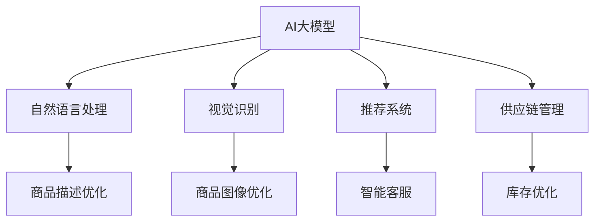

                 

# AI大模型在跨境电商中的应用价值

## 1. 背景介绍

在跨境电商的快速发展过程中，AI大模型已经成为一个重要的技术支撑。AI大模型拥有强大的数据分析、自然语言处理、视觉识别等能力，为跨境电商在产品推荐、客户服务、供应链管理、广告投放等多个方面提供了高效、智能化的解决方案，极大地提升了跨境电商企业的运营效率和客户体验。本文将从背景介绍、核心概念、算法原理、项目实践、应用场景、工具推荐、总结与展望等多个方面，系统阐述AI大模型在跨境电商中的应用价值。

## 2. 核心概念与联系

### 2.1 核心概念概述

- **AI大模型**：指通过大规模数据训练得到的具有强大通用能力的人工智能模型，如BERT、GPT-3等。这些模型能够在大规模无标签数据上进行自监督学习，获得丰富的语言知识和表示能力。

- **自然语言处理(NLP)**：指使用AI技术处理和理解自然语言的技术，包括文本分类、机器翻译、情感分析、问答系统等。在跨境电商中，NLP技术可以帮助商家进行商品描述优化、智能客服、市场分析等。

- **视觉识别**：指使用AI技术识别和理解图像和视频等视觉数据的能力。在跨境电商中，视觉识别技术可用于商品图像优化、库存管理、客户反馈分析等。

- **推荐系统**：指根据用户的历史行为和偏好，推荐最适合用户的商品或内容。AI大模型可以应用于用户画像生成、商品推荐算法优化等领域，提升用户体验。

- **供应链管理**：指通过AI技术优化跨境电商的物流、仓储、库存等环节，实现高效的供应链运作。AI大模型可以帮助预测商品需求、优化库存、提高物流效率等。

### 2.2 核心概念原理和架构的 Mermaid 流程图



## 3. 核心算法原理 & 具体操作步骤

### 3.1 算法原理概述

AI大模型在跨境电商中的应用，主要是通过预训练和微调的方式实现的。预训练阶段，模型在大型无标签数据集上学习通用的语言表示能力。微调阶段，根据特定任务的数据集，调整模型参数，使其适应特定应用场景。

### 3.2 算法步骤详解

1. **数据准备**：
   - **数据收集**：收集跨境电商相关的数据，如商品信息、用户评论、市场趋势等。
   - **数据清洗**：对数据进行去重、去噪、标准化处理，确保数据质量。

2. **预训练模型选择**：
   - **模型选择**：选择合适的预训练模型，如BERT、GPT-3等。这些模型已经在多种自然语言处理任务上取得了优异的表现。
   - **模型加载**：使用深度学习框架（如PyTorch、TensorFlow）加载预训练模型。

3. **微调参数设置**：
   - **学习率**：设置合适的学习率，一般比从头训练时小1-2个数量级，避免破坏预训练权重。
   - **正则化**：应用L2正则、Dropout等正则化技术，防止模型过拟合。
   - **优化器**：选择合适的优化器，如Adam、SGD等，进行参数更新。

4. **微调过程**：
   - **训练集划分**：将数据集划分为训练集、验证集和测试集。
   - **迭代训练**：使用梯度下降等优化算法，迭代更新模型参数。
   - **验证集评估**：周期性在验证集上评估模型性能，避免过拟合。
   - **测试集测试**：在测试集上评估模型最终性能，评估微调效果。

5. **部署应用**：
   - **模型保存**：将微调后的模型保存到指定位置。
   - **模型部署**：将模型集成到实际应用系统中，如网站、APP等。
   - **实时推理**：使用微调后的模型进行实时推理，提供智能化服务。

### 3.3 算法优缺点

**优点**：
- **高效性**：通过预训练和微调，模型可以在较短的时间内获得较好的表现。
- **适应性强**：模型可以适应不同的任务需求，提供灵活的解决方案。
- **扩展性好**：模型可以不断学习新的数据，保持性能的稳定和提升。

**缺点**：
- **数据依赖**：微调效果很大程度上取决于标注数据的质量和数量，获取高质量标注数据的成本较高。
- **泛化能力有限**：当目标任务与预训练数据的分布差异较大时，微调的性能提升有限。
- **模型复杂度**：大模型参数量庞大，对计算资源和存储空间有较高要求。

### 3.4 算法应用领域

AI大模型在跨境电商中的应用领域非常广泛，包括：

- **商品推荐**：根据用户的历史行为和偏好，推荐最符合用户需求的商品。
- **智能客服**：使用AI技术进行自动化客服，提升客户满意度。
- **市场分析**：通过分析用户评论、市场趋势等数据，帮助商家优化产品策略。
- **物流优化**：预测商品需求，优化库存管理，提高物流效率。
- **广告投放**：基于用户行为和偏好，精准投放广告，提升转化率。

## 4. 数学模型和公式 & 详细讲解 & 举例说明

### 4.1 数学模型构建

以推荐系统为例，我们构建如下的数学模型：

设用户 $u$ 对商品 $i$ 的评分 $r_{ui}$，用户的历史评分序列 $r_u$，商品 $i$ 的特征向量 $\boldsymbol{v}_i$，用户 $u$ 的特征向量 $\boldsymbol{v}_u$。推荐模型 $M$ 的目标是预测用户对商品 $i$ 的评分，形式化表示为：

$$
\hat{r}_{ui} = M(r_u, \boldsymbol{v}_i, \boldsymbol{v}_u)
$$

其中，$\hat{r}_{ui}$ 为模型预测的评分，$M$ 为推荐模型。

### 4.2 公式推导过程

推荐模型 $M$ 可以采用多种算法，如基于矩阵分解的协同过滤算法、基于深度学习的神经网络模型等。这里以深度学习模型为例，推导其优化目标。

假设模型 $M$ 为单层神经网络，输入为 $r_u$ 和 $\boldsymbol{v}_i$，输出为 $\hat{r}_{ui}$。其优化目标为最小化预测评分与真实评分之间的均方误差，即：

$$
\min_{\theta} \sum_{u,i} (\hat{r}_{ui} - r_{ui})^2
$$

其中，$\theta$ 为模型参数。

### 4.3 案例分析与讲解

以电商平台的智能客服为例，智能客服系统基于大语言模型进行训练，能够理解和回答用户提出的问题。其工作流程如下：

1. **用户提问**：用户通过电商平台提交问题。
2. **自然语言处理**：智能客服系统使用自然语言处理技术，理解用户问题。
3. **模型推理**：将用户问题输入到预训练大模型中，获取问题嵌入向量。
4. **匹配答案**：在知识库中查找与问题向量最匹配的答案，返回用户。
5. **结果反馈**：用户反馈问题回答的满意度，用于后续模型的微调。

## 5. 项目实践：代码实例和详细解释说明

### 5.1 开发环境搭建

以下是在Python环境中搭建深度学习项目环境的步骤：

1. **安装Python**：
   - 下载并安装Python 3.7以上版本。
   - 配置环境变量，将Python添加到系统 PATH 环境变量中。

2. **安装深度学习框架**：
   - 安装PyTorch或TensorFlow等深度学习框架。
   - 安装相关依赖库，如numpy、pandas、scikit-learn等。

3. **创建虚拟环境**：
   - 使用`virtualenv`或`conda`创建虚拟环境，隔离项目依赖。
   - 激活虚拟环境，在虚拟环境中运行Python代码。

### 5.2 源代码详细实现

以基于深度学习模型的推荐系统为例，展示代码实现过程：

```python
import torch
import torch.nn as nn
import torch.optim as optim
from torch.utils.data import DataLoader

# 定义模型
class RecommenderNet(nn.Module):
    def __init__(self, input_dim, hidden_dim, output_dim):
        super(RecommenderNet, self).__init__()
        self.fc1 = nn.Linear(input_dim, hidden_dim)
        self.fc2 = nn.Linear(hidden_dim, hidden_dim)
        self.fc3 = nn.Linear(hidden_dim, output_dim)

    def forward(self, x1, x2):
        x1 = torch.relu(self.fc1(x1))
        x2 = torch.relu(self.fc2(x2))
        x = torch.cat([x1, x2], dim=1)
        return self.fc3(x)

# 准备数据
def prepare_data(data, feature_dim):
    X = []
    y = []
    for user, item in data:
        X.append(user)
        y.append(item)
    X = torch.tensor(X, dtype=torch.float32).view(-1, feature_dim)
    y = torch.tensor(y, dtype=torch.long)
    return X, y

# 训练模型
def train_model(X, y, batch_size, num_epochs):
    model = RecommenderNet(input_dim=feature_dim, hidden_dim=hidden_dim, output_dim=num_classes)
    optimizer = optim.Adam(model.parameters(), lr=learning_rate)
    criterion = nn.CrossEntropyLoss()

    for epoch in range(num_epochs):
        for i in range(0, len(X), batch_size):
            batch_X, batch_y = X[i:i+batch_size], y[i:i+batch_size]
            optimizer.zero_grad()
            outputs = model(batch_X, batch_y)
            loss = criterion(outputs, batch_y)
            loss.backward()
            optimizer.step()

    return model

# 运行代码
X_train, X_test, y_train, y_test = prepare_data(train_data, feature_dim)
model = train_model(X_train, y_train, batch_size, num_epochs)

# 测试模型
X_test, y_test = prepare_data(test_data, feature_dim)
y_pred = model(X_test)
print(classification_report(y_test, y_pred))
```

### 5.3 代码解读与分析

在上述代码中，我们使用了深度学习框架PyTorch进行推荐系统的开发。具体步骤如下：

1. **定义模型**：
   - 定义了一个简单的单层神经网络模型，包含3个全连接层。
   - 每个全连接层使用ReLU激活函数。

2. **准备数据**：
   - 定义数据准备函数`prepare_data`，将用户和商品数据转换为模型可接受的格式。
   - 使用`DataLoader`对数据进行批处理，提高训练效率。

3. **训练模型**：
   - 定义训练函数`train_model`，使用Adam优化器进行参数更新。
   - 定义损失函数CrossEntropyLoss，用于计算预测值与真实值之间的差异。

4. **测试模型**：
   - 使用测试集数据对模型进行评估，输出分类指标。

## 6. 实际应用场景

### 6.1 商品推荐

基于大语言模型的商品推荐系统，能够根据用户历史行为、商品属性等信息，推荐最符合用户需求的商品。具体实现如下：

1. **数据收集**：收集用户浏览历史、购买历史、评分信息等数据。
2. **数据预处理**：对数据进行清洗、去重、特征工程等处理。
3. **模型训练**：在处理后的数据集上训练推荐模型，优化模型参数。
4. **模型评估**：在测试集上评估模型性能，根据评估结果优化模型。
5. **实时推荐**：将训练好的模型部署到电商平台，实时生成推荐结果。

### 6.2 智能客服

智能客服系统基于大语言模型，能够理解和回答用户提出的问题，提升客户满意度。具体实现如下：

1. **自然语言处理**：使用自然语言处理技术，解析用户输入的问题。
2. **模型推理**：将问题输入到预训练大模型中，获取问题嵌入向量。
3. **匹配答案**：在知识库中查找与问题向量最匹配的答案，返回用户。
4. **结果反馈**：用户反馈问题回答的满意度，用于后续模型的微调。

### 6.3 市场分析

基于大语言模型的市场分析系统，能够对用户评论、市场趋势等数据进行分析，帮助商家优化产品策略。具体实现如下：

1. **数据收集**：收集用户评论、市场趋势等数据。
2. **数据预处理**：对数据进行清洗、去重、特征工程等处理。
3. **模型训练**：在处理后的数据集上训练模型，优化模型参数。
4. **模型评估**：在测试集上评估模型性能，根据评估结果优化模型。
5. **结果应用**：将训练好的模型应用到实际业务中，提供市场分析报告。

### 6.4 未来应用展望

随着AI大模型的不断发展，其在跨境电商中的应用也将更加广泛和深入。未来，AI大模型将具备更加强大的通用能力和泛化能力，能够更好地适应不同的应用场景。

1. **多模态融合**：未来的AI大模型将具备视觉、听觉等多种模态数据的处理能力，能够更好地理解用户需求，提供更全面的服务。
2. **个性化推荐**：基于用户行为和兴趣的多维数据融合，提供更精准的个性化推荐，提升用户体验。
3. **智能客服**：更加智能的智能客服系统，能够理解复杂语义，提供更高效、更个性化的客户服务。
4. **供应链优化**：通过AI大模型进行需求预测、库存管理等，实现供应链的高效运作。
5. **数据驱动决策**：通过分析大量市场数据，帮助商家做出更科学的决策，提升业务竞争力。

## 7. 工具和资源推荐

### 7.1 学习资源推荐

为了帮助开发者系统掌握大语言模型在跨境电商中的应用，以下是一些优质的学习资源：

1. **《深度学习在电商中的应用》书籍**：详细介绍了深度学习在电商推荐、智能客服、市场分析等多个场景的应用，包括模型的构建、优化、评估等。
2. **《自然语言处理综述》论文**：全面综述了自然语言处理领域的前沿技术，包括大语言模型、推荐系统、智能客服等。
3. **《跨境电商数据分析》课程**：由知名大学开设的在线课程，系统讲解了跨境电商中的数据收集、清洗、分析和应用。
4. **HuggingFace官方文档**：详细介绍了大语言模型在电商中的应用，包括模型加载、微调、评估等。
5. **Kaggle竞赛**：参加Kaggle中的电商相关竞赛，实践大语言模型在电商中的实际应用。

### 7.2 开发工具推荐

在开发大语言模型应用时，以下工具可以显著提高开发效率和质量：

1. **Jupyter Notebook**：免费的交互式编程环境，支持Python代码的快速迭代和调试。
2. **PyTorch**：开源深度学习框架，支持动态计算图，便于模型训练和优化。
3. **TensorFlow**：Google开发的深度学习框架，支持多种硬件加速，便于大规模模型训练。
4. **Transformers**：HuggingFace开发的NLP库，包含多种大语言模型，支持微调、推理等功能。
5. **TensorBoard**：可视化工具，用于监控模型训练过程，提供丰富的图表呈现方式。

### 7.3 相关论文推荐

为了深入理解大语言模型在跨境电商中的应用，以下是一些重要的学术论文：

1. **《深度学习在电商推荐系统中的应用》**：介绍了深度学习在电商推荐系统中的各种模型和优化方法。
2. **《基于大语言模型的智能客服系统》**：分析了智能客服系统的设计和实现，展示了大语言模型在电商中的实际应用。
3. **《大语言模型在市场分析中的应用》**：介绍了大语言模型在电商市场分析中的应用，包括模型构建、优化和评估。
4. **《基于多模态数据的推荐系统》**：探讨了多模态数据融合在电商推荐中的应用，提供了多种融合策略和优化方法。
5. **《跨境电商中的智能客服系统》**：分析了智能客服系统的设计和实现，展示了大语言模型在电商中的实际应用。

## 8. 总结：未来发展趋势与挑战

### 8.1 研究成果总结

AI大模型在跨境电商中的应用已经取得了显著成果，提升了电商企业的运营效率和客户体验。未来，随着技术的不断发展，AI大模型将在更多领域得到应用，成为企业数字化转型的重要推动力。

### 8.2 未来发展趋势

1. **多模态融合**：未来的AI大模型将具备视觉、听觉等多种模态数据的处理能力，能够更好地理解用户需求，提供更全面的服务。
2. **个性化推荐**：基于用户行为和兴趣的多维数据融合，提供更精准的个性化推荐，提升用户体验。
3. **智能客服**：更加智能的智能客服系统，能够理解复杂语义，提供更高效、更个性化的客户服务。
4. **供应链优化**：通过AI大模型进行需求预测、库存管理等，实现供应链的高效运作。
5. **数据驱动决策**：通过分析大量市场数据，帮助商家做出更科学的决策，提升业务竞争力。

### 8.3 面临的挑战

尽管AI大模型在跨境电商中的应用已经取得显著进展，但仍面临以下挑战：

1. **数据依赖**：微调效果很大程度上取决于标注数据的质量和数量，获取高质量标注数据的成本较高。
2. **泛化能力有限**：当目标任务与预训练数据的分布差异较大时，微调的性能提升有限。
3. **模型复杂度**：大模型参数量庞大，对计算资源和存储空间有较高要求。
4. **部署效率**：大规模模型的推理速度和资源消耗较大，需要优化部署效率，提升用户体验。

### 8.4 研究展望

未来，为了进一步提升AI大模型在跨境电商中的应用效果，需要在以下几个方面进行深入研究：

1. **无监督和半监督学习**：摆脱对大规模标注数据的依赖，利用自监督学习、主动学习等方法，最大限度利用非结构化数据。
2. **参数高效微调**：开发更加参数高效的微调方法，在固定大部分预训练参数的同时，只更新极少量的任务相关参数。
3. **多模态数据融合**：探索多种模态数据的融合方法，增强模型的通用性和泛化能力。
4. **因果推理**：引入因果推理方法，提高模型的解释性和可控性。
5. **隐私保护**：研究隐私保护技术，确保用户数据的安全和隐私。

## 9. 附录：常见问题与解答

**Q1: AI大模型在跨境电商中具体应用有哪些？**

A: AI大模型在跨境电商中的应用包括商品推荐、智能客服、市场分析、物流优化、广告投放等。通过自然语言处理、视觉识别、推荐系统等技术，AI大模型能够提供高效、智能化的服务，提升电商企业的运营效率和客户体验。

**Q2: AI大模型在电商推荐系统中的优点是什么？**

A: AI大模型在电商推荐系统中的优点包括：
1. **高效性**：通过预训练和微调，模型可以在较短的时间内获得较好的表现。
2. **适应性强**：模型可以适应不同的任务需求，提供灵活的解决方案。
3. **扩展性好**：模型可以不断学习新的数据，保持性能的稳定和提升。

**Q3: 如何在电商推荐系统中应用AI大模型？**

A: 在电商推荐系统中应用AI大模型的步骤如下：
1. **数据收集**：收集用户浏览历史、购买历史、评分信息等数据。
2. **数据预处理**：对数据进行清洗、去重、特征工程等处理。
3. **模型训练**：在处理后的数据集上训练推荐模型，优化模型参数。
4. **模型评估**：在测试集上评估模型性能，根据评估结果优化模型。
5. **实时推荐**：将训练好的模型部署到电商平台，实时生成推荐结果。

**Q4: 在电商智能客服系统中，AI大模型是如何工作的？**

A: 在电商智能客服系统中，AI大模型通过自然语言处理技术解析用户输入的问题，使用模型推理获取问题嵌入向量，在知识库中查找与问题向量最匹配的答案，返回用户。用户反馈问题回答的满意度，用于后续模型的微调。

**Q5: 大语言模型在跨境电商中面临的挑战有哪些？**

A: 大语言模型在跨境电商中面临的挑战包括：
1. **数据依赖**：微调效果很大程度上取决于标注数据的质量和数量，获取高质量标注数据的成本较高。
2. **泛化能力有限**：当目标任务与预训练数据的分布差异较大时，微调的性能提升有限。
3. **模型复杂度**：大模型参数量庞大，对计算资源和存储空间有较高要求。
4. **部署效率**：大规模模型的推理速度和资源消耗较大，需要优化部署效率，提升用户体验。

---

作者：禅与计算机程序设计艺术 / Zen and the Art of Computer Programming

