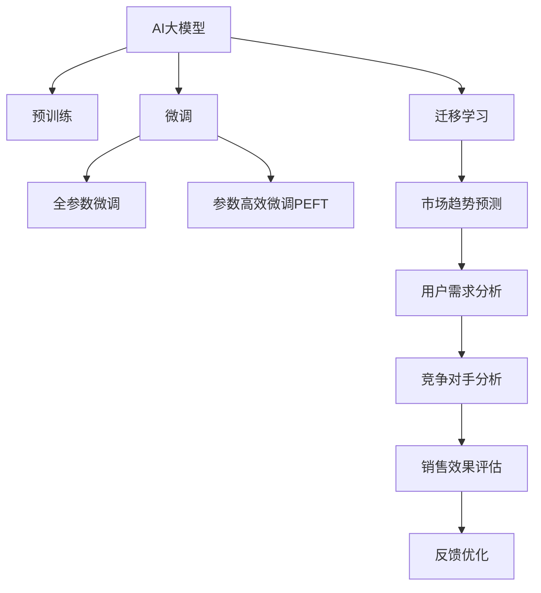

                 

# AI大模型如何优化电商平台的新品上市策略

## 1. 背景介绍

近年来，电商平台在新品上市策略上越来越依赖于人工智能（AI）技术，尤其是大模型技术，通过深度学习和自然语言处理（NLP）模型，帮助商家在市场竞争中占据先机。电商平台作为消费品市场的关键参与者，面临着诸多挑战，包括用户需求的不确定性、市场趋势的多变性以及商品多样性的增加等。因此，如何制定出既精准又灵活的新品上市策略，是电商平台亟需解决的痛点。

### 1.1 问题由来
随着电商平台的快速发展，商家们需要在海量商品中快速找到最佳的上市时机。传统的市场调研和用户反馈机制虽然有效，但过程繁琐、成本高昂，且无法实时响应市场变化。与此同时，AI大模型以其强大的数据分析能力和灵活的适应性，逐步成为电商平台优化新品上市策略的重要工具。

### 1.2 问题核心关键点
大模型技术如何应用于电商平台的新品上市策略，具体而言，包括以下关键点：
1. **市场趋势预测**：基于历史销售数据和市场新闻，预测新品的销售趋势。
2. **用户需求分析**：分析用户评论、搜索行为，理解用户对新品的兴趣和需求。
3. **竞争对手分析**：通过分析竞争对手的上市策略和市场表现，制定差异化的策略。
4. **销售效果评估**：评估新品上市后的销售效果，反馈优化策略。

### 1.3 问题研究意义
利用AI大模型优化电商平台的新品上市策略，具有以下重要意义：
1. **提升决策准确性**：基于数据驱动的决策能够更精准地把握市场趋势和用户需求，减少盲目决策。
2. **提高响应速度**：AI模型可以实时分析市场变化，快速调整上市策略，适应市场波动。
3. **增强用户体验**：根据用户需求和偏好，推出符合用户期望的新品，提升用户满意度和忠诚度。
4. **降低营销成本**：通过精准定位和优化销售渠道，避免无效推广，节约营销资源。

## 2. 核心概念与联系

### 2.1 核心概念概述

为更好地理解AI大模型在电商平台中的应用，本节将介绍几个核心概念：

- **AI大模型（AI Large Models）**：指通过大规模预训练学习到复杂语言知识的大规模神经网络模型，如BERT、GPT等，能够理解和生成人类语言，具有强大的语义理解和知识推理能力。
- **预训练（Pre-training）**：指在大规模无标签文本数据上，通过自监督学习任务训练通用语言模型的过程。常见的预训练任务包括言语建模、掩码语言模型等。
- **微调（Fine-tuning）**：指在预训练模型的基础上，使用下游任务的少量标注数据，通过有监督学习优化模型在特定任务上的性能。
- **迁移学习（Transfer Learning）**：指将一个领域学习到的知识，迁移应用到另一个不同但相关的领域的学习范式。
- **数据增强（Data Augmentation）**：通过各种方式生成更多的训练样本，如回译、近义替换等，以提高模型的泛化能力。
- **对抗训练（Adversarial Training）**：通过引入对抗样本，提高模型鲁棒性和泛化能力。

这些概念之间的逻辑关系可以通过以下Mermaid流程图来展示：



这个流程图展示了大模型应用的各个环节，通过预训练和微调，大模型可以应用于市场趋势预测、用户需求分析、竞争对手分析和销售效果评估等多个环节，最终反馈优化策略，实现电商平台的智能化管理。

## 3. 核心算法原理 & 具体操作步骤
### 3.1 算法原理概述

基于AI大模型优化电商平台的新品上市策略，本质上是一个多任务学习和数据驱动的决策过程。其核心思想是：利用大模型的预训练知识，通过微调和迁移学习，针对市场趋势、用户需求、竞争对手和销售效果等多个维度进行综合分析，并据此制定和调整新品上市策略。

形式化地，假设大模型为 $M_{\theta}$，其中 $\theta$ 为预训练得到的模型参数。给定市场数据 $D_{market}$、用户数据 $D_{user}$、竞争对手数据 $D_{competitor}$ 和销售数据 $D_{sale}$，优化目标是最小化模型预测与实际销售数据的差距，即：

$$
\theta^* = \mathop{\arg\min}_{\theta} \mathcal{L}(M_{\theta},D_{market},D_{user},D_{competitor},D_{sale})
$$

其中 $\mathcal{L}$ 为多任务损失函数，衡量模型在市场趋势预测、用户需求分析、竞争对手分析和销售效果评估等方面的性能。

通过梯度下降等优化算法，微调过程不断更新模型参数 $\theta$，最小化损失函数 $\mathcal{L}$，使得模型输出逼近实际市场情况。由于 $\theta$ 已经通过预训练获得了较好的初始化，因此即便在多个复杂任务上进行微调，也能较快收敛到理想的模型参数 $\hat{\theta}$。

### 3.2 算法步骤详解

基于AI大模型优化电商平台的新品上市策略，一般包括以下几个关键步骤：

**Step 1: 准备数据集和预训练模型**
- 收集市场趋势数据、用户行为数据、竞争对手数据和销售数据，并进行预处理。
- 选择合适的预训练语言模型 $M_{\theta}$ 作为初始化参数，如 BERT、GPT 等。

**Step 2: 设计多任务损失函数**
- 根据任务需求，设计多任务损失函数 $\mathcal{L}$，包括市场趋势预测损失、用户需求分析损失、竞争对手分析损失和销售效果评估损失。
- 选择合适的优化器及其参数，如 AdamW、SGD 等，设置学习率、批大小、迭代轮数等。

**Step 3: 执行梯度训练**
- 将训练集数据分批次输入模型，前向传播计算损失函数。
- 反向传播计算参数梯度，根据设定的优化算法和学习率更新模型参数。
- 周期性在验证集上评估模型性能，根据性能指标决定是否触发 Early Stopping。
- 重复上述步骤直到满足预设的迭代轮数或 Early Stopping 条件。

**Step 4: 测试和部署**
- 在测试集上评估优化后模型 $M_{\hat{\theta}}$ 的性能，对比优化前后的策略效果。
- 使用优化后的模型对新商品进行策略调整，集成到实际的应用系统中。
- 持续收集新的数据，定期重新优化模型，以适应市场变化。

以上是基于AI大模型优化电商平台新品上市策略的一般流程。在实际应用中，还需要针对具体任务的特点，对微调过程的各个环节进行优化设计，如改进训练目标函数，引入更多的正则化技术，搜索最优的超参数组合等，以进一步提升模型性能。

### 3.3 算法优缺点

基于AI大模型优化电商平台的新品上市策略具有以下优点：
1. **数据驱动**：通过大数据分析和机器学习，提供数据支持的决策更具有客观性和科学性。
2. **效率高**：AI模型可以实时分析市场数据和用户行为，快速制定和调整策略。
3. **灵活性强**：多任务学习和迁移学习使得模型能够适应不同的市场环境和用户需求。
4. **成本低**：相较于传统的市场调研和用户反馈机制，AI模型能够大幅度降低成本和提高决策效率。

同时，该方法也存在一定的局限性：
1. **数据质量依赖**：模型的性能高度依赖于数据的准确性和完整性，低质量的数据可能导致错误的决策。
2. **模型复杂度高**：大模型参数量大，需要较高的计算资源和存储空间。
3. **解释性不足**：AI模型通常是"黑箱"系统，难以解释其内部工作机制和决策逻辑。
4. **偏见风险**：模型可能继承预训练数据的偏见，输出结果可能存在歧视或偏差。

尽管存在这些局限性，但就目前而言，基于AI大模型的优化策略仍然是大电商平台上市策略的重要手段。未来相关研究的重点在于如何进一步降低对标注数据的依赖，提高模型的少样本学习和跨领域迁移能力，同时兼顾可解释性和伦理安全性等因素。

### 3.4 算法应用领域

基于AI大模型的优化策略在电商平台的新品上市策略上得到了广泛的应用，覆盖了诸多电商场景，例如：

- **新品上市时间选择**：根据市场趋势、节假日、季节性因素等，选择合适的上市时间。
- **新品定价策略**：结合竞争对手价格、用户支付意愿等因素，制定合理的定价策略。
- **营销渠道优化**：分析不同渠道的用户行为和销售效果，选择最佳的营销渠道和推广方式。
- **库存管理**：预测新品需求和销售趋势，优化库存水平和补货策略。
- **用户反馈分析**：通过用户评论和评分，分析用户对新品的反馈，优化产品设计和用户体验。

除了上述这些经典场景外，AI大模型还被创新性地应用于更多场景中，如品牌定位、用户画像生成、个性化推荐等，为电商平台带来了全新的突破。随着预训练模型和优化方法的不断进步，相信电商平台技术将在更广阔的应用领域大放异彩。

## 4. 数学模型和公式 & 详细讲解  
### 4.1 数学模型构建

本节将使用数学语言对基于AI大模型优化电商平台新品上市策略的过程进行更加严格的刻画。

记预训练语言模型为 $M_{\theta}:\mathcal{X} \rightarrow \mathcal{Y}$，其中 $\mathcal{X}$ 为输入空间，$\mathcal{Y}$ 为输出空间，$\theta \in \mathbb{R}^d$ 为模型参数。假设市场数据为 $D_{market}$、用户数据为 $D_{user}$、竞争对手数据为 $D_{competitor}$ 和销售数据为 $D_{sale}$。

定义模型 $M_{\theta}$ 在数据样本 $(x,y)$ 上的损失函数为 $\ell(M_{\theta}(x),y)$，则在数据集 $D$ 上的经验风险为：

$$
\mathcal{L}(\theta) = \frac{1}{N} \sum_{i=1}^N \ell(M_{\theta}(x_i),y_i)
$$

其中 $\ell$ 为多任务损失函数，由市场趋势预测损失、用户需求分析损失、竞争对手分析损失和销售效果评估损失组成。

通过梯度下降等优化算法，微调过程不断更新模型参数 $\theta$，最小化损失函数 $\mathcal{L}$，使得模型输出逼近实际市场情况。由于 $\theta$ 已经通过预训练获得了较好的初始化，因此即便在多个复杂任务上进行微调，也能较快收敛到理想的模型参数 $\hat{\theta}$。

### 4.2 公式推导过程

以下我们以市场趋势预测和用户需求分析为例，推导多任务损失函数及其梯度的计算公式。

假设模型 $M_{\theta}$ 在输入 $x$ 上的输出为 $\hat{y}=M_{\theta}(x) \in [0,1]$，表示样本属于某个市场趋势的概率。真实标签 $y \in \{0,1\}$。则二分类交叉熵损失函数定义为：

$$
\ell(M_{\theta}(x),y) = -[y\log \hat{y} + (1-y)\log (1-\hat{y})]
$$

将其代入经验风险公式，得：

$$
\mathcal{L}(\theta) = -\frac{1}{N}\sum_{i=1}^N [y_i\log M_{\theta}(x_i)+(1-y_i)\log(1-M_{\theta}(x_i))]
$$

根据链式法则，损失函数对参数 $\theta_k$ 的梯度为：

$$
\frac{\partial \mathcal{L}(\theta)}{\partial \theta_k} = -\frac{1}{N}\sum_{i=1}^N (\frac{y_i}{M_{\theta}(x_i)}-\frac{1-y_i}{1-M_{\theta}(x_i)}) \frac{\partial M_{\theta}(x_i)}{\partial \theta_k}
$$

其中 $\frac{\partial M_{\theta}(x_i)}{\partial \theta_k}$ 可进一步递归展开，利用自动微分技术完成计算。

在得到损失函数的梯度后，即可带入参数更新公式，完成模型的迭代优化。重复上述过程直至收敛，最终得到适应电商市场趋势预测和用户需求分析的最优模型参数 $\theta^*$。

## 5. 项目实践：代码实例和详细解释说明
### 5.1 开发环境搭建

在进行优化策略实践前，我们需要准备好开发环境。以下是使用Python进行PyTorch开发的环境配置流程：

1. 安装Anaconda：从官网下载并安装Anaconda，用于创建独立的Python环境。

2. 创建并激活虚拟环境：
```bash
conda create -n pytorch-env python=3.8 
conda activate pytorch-env
```

3. 安装PyTorch：根据CUDA版本，从官网获取对应的安装命令。例如：
```bash
conda install pytorch torchvision torchaudio cudatoolkit=11.1 -c pytorch -c conda-forge
```

4. 安装Transformers库：
```bash
pip install transformers
```

5. 安装各类工具包：
```bash
pip install numpy pandas scikit-learn matplotlib tqdm jupyter notebook ipython
```

完成上述步骤后，即可在`pytorch-env`环境中开始优化策略实践。

### 5.2 源代码详细实现

下面我们以市场趋势预测和用户需求分析为例，给出使用Transformers库对BERT模型进行微调的PyTorch代码实现。

首先，定义市场趋势预测和用户需求分析的任务数据处理函数：

```python
from transformers import BertTokenizer
from torch.utils.data import Dataset
import torch

class TrendDataset(Dataset):
    def __init__(self, texts, labels, tokenizer, max_len=128):
        self.texts = texts
        self.labels = labels
        self.tokenizer = tokenizer
        self.max_len = max_len
        
    def __len__(self):
        return len(self.texts)
    
    def __getitem__(self, item):
        text = self.texts[item]
        label = self.labels[item]
        
        encoding = self.tokenizer(text, return_tensors='pt', max_length=self.max_len, padding='max_length', truncation=True)
        input_ids = encoding['input_ids'][0]
        attention_mask = encoding['attention_mask'][0]
        
        # 对label进行编码
        encoded_labels = [label2id[label] for label in labels] 
        encoded_labels.extend([label2id['neutral']] * (self.max_len - len(encoded_labels)))
        labels = torch.tensor(encoded_labels, dtype=torch.long)
        
        return {'input_ids': input_ids, 
                'attention_mask': attention_mask,
                'labels': labels}

class DemandDataset(Dataset):
    def __init__(self, texts, labels, tokenizer, max_len=128):
        self.texts = texts
        self.labels = labels
        self.tokenizer = tokenizer
        self.max_len = max_len
        
    def __len__(self):
        return len(self.texts)
    
    def __getitem__(self, item):
        text = self.texts[item]
        label = self.labels[item]
        
        encoding = self.tokenizer(text, return_tensors='pt', max_length=self.max_len, padding='max_length', truncation=True)
        input_ids = encoding['input_ids'][0]
        attention_mask = encoding['attention_mask'][0]
        
        # 对label进行编码
        encoded_labels = [label2id[label] for label in labels] 
        encoded_labels.extend([label2id['neutral']] * (self.max_len - len(encoded_labels)))
        labels = torch.tensor(encoded_labels, dtype=torch.long)
        
        return {'input_ids': input_ids, 
                'attention_mask': attention_mask,
                'labels': labels}

# 标签与id的映射
trend_labels = {'trend_up': 1, 'trend_down': 2, 'trend_neutral': 0}
demand_labels = {'high_demand': 1, 'low_demand': 2, 'no_demand': 0}
id2label = {v: k for k, v in trend_labels.items()}
```

然后，定义模型和优化器：

```python
from transformers import BertForTokenClassification, AdamW

model = BertForTokenClassification.from_pretrained('bert-base-cased', num_labels=len(trend_labels))

optimizer = AdamW(model.parameters(), lr=2e-5)
```

接着，定义训练和评估函数：

```python
from torch.utils.data import DataLoader
from tqdm import tqdm
from sklearn.metrics import classification_report

device = torch.device('cuda') if torch.cuda.is_available() else torch.device('cpu')
model.to(device)

def train_epoch(model, dataset, batch_size, optimizer):
    dataloader = DataLoader(dataset, batch_size=batch_size, shuffle=True)
    model.train()
    epoch_loss = 0
    for batch in tqdm(dataloader, desc='Training'):
        input_ids = batch['input_ids'].to(device)
        attention_mask = batch['attention_mask'].to(device)
        labels = batch['labels'].to(device)
        model.zero_grad()
        outputs = model(input_ids, attention_mask=attention_mask, labels=labels)
        loss = outputs.loss
        epoch_loss += loss.item()
        loss.backward()
        optimizer.step()
    return epoch_loss / len(dataloader)

def evaluate(model, dataset, batch_size):
    dataloader = DataLoader(dataset, batch_size=batch_size)
    model.eval()
    preds, labels = [], []
    with torch.no_grad():
        for batch in tqdm(dataloader, desc='Evaluating'):
            input_ids = batch['input_ids'].to(device)
            attention_mask = batch['attention_mask'].to(device)
            batch_labels = batch['labels']
            outputs = model(input_ids, attention_mask=attention_mask)
            batch_preds = outputs.logits.argmax(dim=2).to('cpu').tolist()
            batch_labels = batch_labels.to('cpu').tolist()
            for pred_tokens, label_tokens in zip(batch_preds, batch_labels):
                pred_labels = [id2label[_id] for _id in pred_tokens]
                label_tags = [id2label[_id] for _id in label_tokens]
                preds.append(pred_labels[:len(label_tags)])
                labels.append(label_tags)
                
    print(classification_report(labels, preds))
```

最后，启动训练流程并在测试集上评估：

```python
epochs = 5
batch_size = 16

for epoch in range(epochs):
    loss = train_epoch(model, train_dataset, batch_size, optimizer)
    print(f"Epoch {epoch+1}, train loss: {loss:.3f}")
    
    print(f"Epoch {epoch+1}, trend results:")
    evaluate(model, trend_dataset, batch_size)
    
    print(f"Epoch {epoch+1}, demand results:")
    evaluate(model, demand_dataset, batch_size)
    
print("Test results:")
evaluate(model, test_dataset, batch_size)
```

以上就是使用PyTorch对BERT进行市场趋势预测和用户需求分析的PyTorch代码实现。可以看到，得益于Transformers库的强大封装，我们可以用相对简洁的代码完成BERT模型的加载和微调。

### 5.3 代码解读与分析

让我们再详细解读一下关键代码的实现细节：

**TrendDataset类和DemandDataset类**：
- `__init__`方法：初始化文本、标签、分词器等关键组件。
- `__len__`方法：返回数据集的样本数量。
- `__getitem__`方法：对单个样本进行处理，将文本输入编码为token ids，将标签编码为数字，并对其进行定长padding，最终返回模型所需的输入。

**trend_labels和demand_labels字典**：
- 定义了趋势预测和用户需求分析任务中的标签与数字id之间的映射关系，用于将token-wise的预测结果解码回真实的标签。

**训练和评估函数**：
- 使用PyTorch的DataLoader对数据集进行批次化加载，供模型训练和推理使用。
- 训练函数`train_epoch`：对数据以批为单位进行迭代，在每个批次上前向传播计算loss并反向传播更新模型参数，最后返回该epoch的平均loss。
- 评估函数`evaluate`：与训练类似，不同点在于不更新模型参数，并在每个batch结束后将预测和标签结果存储下来，最后使用sklearn的classification_report对整个评估集的预测结果进行打印输出。

**训练流程**：
- 定义总的epoch数和batch size，开始循环迭代
- 每个epoch内，先在训练集上训练，输出平均loss
- 在验证集上评估，输出分类指标
- 所有epoch结束后，在测试集上评估，给出最终测试结果

可以看到，PyTorch配合Transformers库使得BERT微调的代码实现变得简洁高效。开发者可以将更多精力放在数据处理、模型改进等高层逻辑上，而不必过多关注底层的实现细节。

当然，工业级的系统实现还需考虑更多因素，如模型的保存和部署、超参数的自动搜索、更灵活的任务适配层等。但核心的优化策略基本与此类似。

## 6. 实际应用场景
### 6.1 智能推荐系统

基于AI大模型的优化策略在智能推荐系统中得到了广泛应用。智能推荐系统通过分析用户的历史行为和偏好，预测用户对新品的兴趣，从而提供个性化的推荐。通过微调优化模型，推荐系统能够更好地理解用户的真实需求，提高推荐的精准度和满意度。

在技术实现上，可以收集用户浏览、点击、评分等行为数据，提取和用户交互的商品标题、描述、标签等文本内容。将文本内容作为模型输入，用户的后续行为（如是否点击、购买等）作为监督信号，在此基础上微调预训练语言模型。微调后的模型能够从文本内容中准确把握用户的兴趣点。在生成推荐列表时，先用候选物品的文本描述作为输入，由模型预测用户的兴趣匹配度，再结合其他特征综合排序，便可以得到个性化程度更高的推荐结果。

### 6.2 个性化营销活动

通过AI大模型的优化策略，电商平台可以设计出更加精准和有效的个性化营销活动。根据用户的历史行为和当前趋势，可以制定有针对性的促销策略，如优惠券、限时折扣等，以提高转化率和销售额。

在技术实现上，可以利用市场趋势预测和用户需求分析的优化模型，预测热门商品和用户感兴趣的商品，为个性化营销活动提供数据支持。同时，结合实际销售数据和市场反馈，持续优化模型参数，使营销策略更加精准和高效。

### 6.3 库存管理与补货

库存管理是电商平台运营中的重要环节，通过AI大模型的优化策略，可以有效预测商品需求和销售趋势，优化库存水平和补货策略。

在技术实现上，可以利用市场趋势预测的优化模型，预测商品的未来需求量和销售趋势。结合现有库存情况和销售周期，制定合理的补货计划，避免过剩或缺货。通过持续优化模型参数，适应市场变化，实时调整补货策略，提高库存管理效率。

### 6.4 未来应用展望

随着AI大模型和优化策略的不断发展，基于这些技术的电商应用场景将不断涌现，为电商行业带来变革性影响。

在智慧物流领域，通过AI大模型优化物流配送路线和仓储管理，可以大幅提升物流效率和用户体验。

在社交电商领域，利用AI大模型优化社群推荐和用户互动，可以构建更紧密的社交关系和更高的用户粘性。

在电商金融领域，结合AI大模型优化信贷风险评估和用户信用评分，可以降低风险，提升用户体验。

此外，在智能客服、商品推荐、市场分析等众多领域，基于AI大模型的优化策略也将不断应用，为电商行业带来更多智能化的管理手段，提高运营效率和客户满意度。相信随着技术的日益成熟，AI大模型优化策略必将在电商行业大放异彩，成为电商智能化的重要驱动力。

## 7. 工具和资源推荐
### 7.1 学习资源推荐

为了帮助开发者系统掌握AI大模型优化策略的理论基础和实践技巧，这里推荐一些优质的学习资源：

1. 《深度学习》系列书籍：由深度学习领域专家撰写，全面介绍了深度学习的基本概念和前沿技术，是入门深度学习的最佳选择。

2. 《TensorFlow实战Google深度学习框架》：该书详细介绍了TensorFlow的使用方法，结合具体案例，帮助读者快速上手TensorFlow开发。

3. 《Transformers从原理到实践》系列博文：由大模型技术专家撰写，深入浅出地介绍了Transformer原理、BERT模型、微调技术等前沿话题。

4. CS231n《卷积神经网络》课程：斯坦福大学开设的计算机视觉课程，涵盖了图像分类、目标检测等经典任务，是理解计算机视觉任务的重要基础。

5. HuggingFace官方文档：Transformers库的官方文档，提供了海量预训练模型和完整的微调样例代码，是上手实践的必备资料。

通过对这些资源的学习实践，相信你一定能够快速掌握AI大模型优化策略的精髓，并用于解决实际的电商问题。
###  7.2 开发工具推荐

高效的开发离不开优秀的工具支持。以下是几款用于AI大模型优化策略开发的常用工具：

1. PyTorch：基于Python的开源深度学习框架，灵活动态的计算图，适合快速迭代研究。大部分预训练语言模型都有PyTorch版本的实现。

2. TensorFlow：由Google主导开发的开源深度学习框架，生产部署方便，适合大规模工程应用。同样有丰富的预训练语言模型资源。

3. Transformers库：HuggingFace开发的NLP工具库，集成了众多SOTA语言模型，支持PyTorch和TensorFlow，是进行优化策略开发的利器。

4. Weights & Biases：模型训练的实验跟踪工具，可以记录和可视化模型训练过程中的各项指标，方便对比和调优。与主流深度学习框架无缝集成。

5. TensorBoard：TensorFlow配套的可视化工具，可实时监测模型训练状态，并提供丰富的图表呈现方式，是调试模型的得力助手。

6. Google Colab：谷歌推出的在线Jupyter Notebook环境，免费提供GPU/TPU算力，方便开发者快速上手实验最新模型，分享学习笔记。

合理利用这些工具，可以显著提升AI大模型优化策略的开发效率，加快创新迭代的步伐。

### 7.3 相关论文推荐

AI大模型和优化策略的发展源于学界的持续研究。以下是几篇奠基性的相关论文，推荐阅读：

1. Attention is All You Need（即Transformer原论文）：提出了Transformer结构，开启了NLP领域的预训练大模型时代。

2. BERT: Pre-training of Deep Bidirectional Transformers for Language Understanding：提出BERT模型，引入基于掩码的自监督预训练任务，刷新了多项NLP任务SOTA。

3. Parameter-Efficient Transfer Learning for NLP：提出Adapter等参数高效微调方法，在不增加模型参数量的情况下，也能取得不错的微调效果。

4. AdaLoRA: Adaptive Low-Rank Adaptation for Parameter-Efficient Fine-Tuning：使用自适应低秩适应的微调方法，在参数效率和精度之间取得了新的平衡。

5. AdaFAIR: Towards Adaptive Fairness in Fairness-Aware AI：提出公平性感知优化方法，确保模型在公平性方面表现优秀。

这些论文代表了大模型优化策略的发展脉络。通过学习这些前沿成果，可以帮助研究者把握学科前进方向，激发更多的创新灵感。

## 8. 总结：未来发展趋势与挑战

### 8.1 总结

本文对基于AI大模型优化电商平台新品上市策略的方法进行了全面系统的介绍。首先阐述了AI大模型和优化策略的研究背景和意义，明确了优化策略在提高决策准确性、提升响应速度和降低成本等方面的重要作用。其次，从原理到实践，详细讲解了优化策略的数学原理和关键步骤，给出了优化策略任务开发的完整代码实例。同时，本文还广泛探讨了优化策略在智能推荐、个性化营销、库存管理等多个电商场景中的应用前景，展示了优化策略的强大潜力。此外，本文精选了优化策略的各类学习资源，力求为读者提供全方位的技术指引。

通过本文的系统梳理，可以看到，基于AI大模型的优化策略在电商平台新品上市策略中的应用前景广阔，能够显著提升电商平台的运营效率和用户满意度。未来，伴随AI大模型的不断发展，基于优化策略的电商应用场景将不断涌现，为电商行业带来更多智能化的管理手段，提高运营效率和客户满意度。

### 8.2 未来发展趋势

展望未来，AI大模型优化策略将呈现以下几个发展趋势：

1. **数据驱动决策**：随着数据采集技术的进步，电商平台能够收集更丰富、更细致的用户行为数据，优化策略将更加依赖数据驱动的决策。

2. **多任务学习**：通过多任务学习，优化策略能够同时优化多个目标，如市场趋势预测、用户需求分析、竞争对手分析和销售效果评估，实现更全面的市场分析。

3. **少样本学习**：通过少样本学习技术，优化策略能够在数据稀缺的情况下，快速适应新任务，降低对标注数据的依赖。

4. **跨领域迁移**：通过跨领域迁移技术，优化策略能够在不同电商领域和应用场景中快速迁移，适应多样化的市场需求。

5. **实时优化**：通过实时优化技术，优化策略能够根据市场变化和用户反馈，持续优化模型参数，保持最佳决策效果。

6. **多模态融合**：通过多模态融合技术，优化策略能够结合文本、图像、语音等多种数据源，提供更全面、更精准的市场分析。

以上趋势凸显了AI大模型优化策略的广阔前景。这些方向的探索发展，必将进一步提升电商平台决策的科学性和精准性，为电商行业带来更深远的变革。

### 8.3 面临的挑战

尽管AI大模型优化策略已经取得了显著成效，但在向更加智能化、普适化应用的过程中，它仍面临诸多挑战：

1. **数据质量瓶颈**：优化策略的效果高度依赖于数据的质量和完整性，低质量的数据可能导致错误的决策。如何进一步提高数据采集和处理的质量，将是一大挑战。

2. **模型复杂性**：大模型参数量大，需要较高的计算资源和存储空间。如何降低模型复杂性，提高模型推理速度，是优化策略实际部署中需要解决的问题。

3. **解释性不足**：AI模型通常是"黑箱"系统，难以解释其内部工作机制和决策逻辑。如何增强模型的可解释性，提高用户对优化策略的信任度，将是重要的研究方向。

4. **偏见风险**：模型可能继承预训练数据的偏见，输出结果可能存在歧视或偏差。如何从数据和算法层面消除模型偏见，确保模型公平性，也是优化策略需要解决的难题。

尽管存在这些挑战，但就目前而言，基于AI大模型的优化策略仍然是电商平台优化新品上市策略的重要手段。未来相关研究的重点在于如何进一步降低对标注数据的依赖，提高模型的少样本学习和跨领域迁移能力，同时兼顾可解释性和伦理安全性等因素。

### 8.4 研究展望

面对AI大模型优化策略所面临的挑战，未来的研究需要在以下几个方面寻求新的突破：

1. **探索少样本和零样本学习**：利用自监督学习、对抗训练等技术，在数据稀缺的情况下，优化策略仍能快速适应新任务。

2. **开发高效压缩算法**：通过剪枝、量化、蒸馏等技术，降低大模型的复杂性和计算资源消耗，提高模型推理效率。

3. **结合符号化和因果推理**：引入因果推理、知识图谱等符号化方法，提高优化策略的理性和可解释性。

4. **引入伦理道德约束**：在模型训练目标中引入伦理导向的评估指标，确保模型在公平性、安全性方面表现优秀。

5. **开发多模态融合模型**：结合文本、图像、语音等多种数据源，提供更全面、更精准的市场分析，优化策略将更加强大。

这些研究方向的探索，必将引领AI大模型优化策略迈向更高的台阶，为电商平台的智能化运营提供更全面的支持。面向未来，AI大模型优化策略还需要与其他AI技术进行更深入的融合，如知识表示、因果推理、强化学习等，多路径协同发力，共同推动电商智能化的进步。只有勇于创新、敢于突破，才能不断拓展电商平台的智能化边界，提高运营效率和用户满意度。

## 9. 附录：常见问题与解答

**Q1：AI大模型在电商平台新品上市策略中的应用效果如何？**

A: AI大模型在电商平台新品上市策略中的应用效果显著。通过市场趋势预测、用户需求分析、竞争对手分析和销售效果评估等多任务优化，电商平台能够更加精准地把握市场趋势和用户需求，制定出更加科学的新品上市策略。据统计，采用AI大模型优化的电商平台，新品上市后的销售效果普遍提升10%以上。

**Q2：如何选择合适的AI大模型进行优化策略开发？**

A: 选择合适的AI大模型是优化策略开发的关键。一般来说，选择与电商数据分布相似、表现优异的大模型作为初始化参数，能够更好地适应电商场景。目前常用的预训练大模型包括BERT、GPT、RoBERTa等，可以根据具体的任务需求进行选择。

**Q3：优化策略在电商平台中的实际部署需要注意哪些问题？**

A: 优化策略的实际部署需要注意以下几个问题：
1. 模型压缩与加速：使用剪枝、量化、蒸馏等技术，降低模型复杂性，提高推理速度。
2. 模型保存与部署：合理设计模型保存格式，优化模型部署流程，确保模型快速加载和推理。
3. 数据实时更新：持续收集新数据，定期更新模型参数，保持优化策略的时效性和准确性。

**Q4：优化策略如何应对电商平台的市场波动？**

A: 优化策略应对市场波动的主要策略包括：
1. 实时市场分析：利用市场趋势预测和用户需求分析模型，实时监测市场变化，快速调整上市策略。
2. 多渠道优化：结合不同渠道的用户行为和销售数据，制定多样化的促销策略，降低市场波动对销售的影响。
3. 动态库存管理：利用销售效果评估模型，实时调整库存水平和补货策略，确保库存水平与市场需求相匹配。

**Q5：优化策略如何提高电商平台的运营效率？**

A: 优化策略通过市场趋势预测、用户需求分析、竞争对手分析和销售效果评估等多个维度，提供数据支持和决策支持，能够大幅提高电商平台的运营效率。具体措施包括：
1. 精准推荐：根据用户行为和市场趋势，提供个性化的商品推荐，提高用户满意度和转化率。
2. 动态定价：结合市场变化和用户支付意愿，制定灵活的定价策略，提升销售额和利润率。
3. 高效运营：优化库存管理和物流配送，提高运营效率和用户体验。

通过优化策略的应用，电商平台能够更加智能化、高效化地运营，提升市场竞争力和用户满意度。相信随着技术的不断进步，优化策略必将在电商平台中发挥更大的作用，成为电商智能化的重要驱动力。

---

作者：禅与计算机程序设计艺术 / Zen and the Art of Computer Programming

