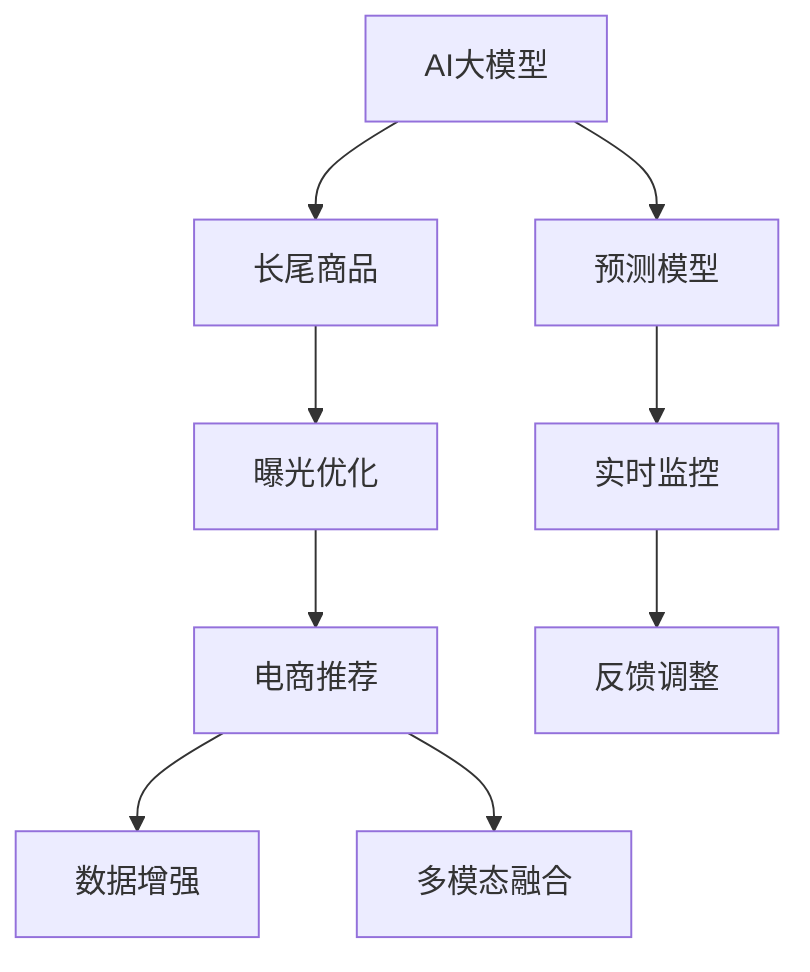

                 

# AI大模型如何提升电商平台的长尾商品曝光

> 关键词：AI大模型,长尾商品,曝光优化,电商推荐,数据增强,多模态融合,预测模型,实时监控

## 1. 背景介绍

### 1.1 问题由来
在电子商务领域，优化长尾商品的曝光是一个永恒的挑战。与高销量商品相比，长尾商品的搜索量少、点击率低、销量小，容易被电商平台忽视。然而，长尾商品往往具有高毛利和品牌价值，对电商平台的整体营收和品牌声誉至关重要。提升长尾商品的曝光和销售，是电商平台持续发展的关键任务之一。

### 1.2 问题核心关键点
要提升长尾商品的曝光和销售，电商平台需要解决以下几个核心问题：
1. 如何高效识别长尾商品？
2. 如何将长尾商品与用户需求匹配？
3. 如何提升长尾商品的排名和推荐效果？
4. 如何实时监控和优化商品曝光策略？

### 1.3 问题研究意义
通过使用AI大模型对长尾商品进行精准识别、匹配和推荐，电商平台的运营效率和用户体验将得到显著提升。同时，大模型的应用还可以帮助电商平台获取更多流量和用户，增加销售额，提升品牌竞争力。

## 2. 核心概念与联系

### 2.1 核心概念概述

为更好地理解AI大模型在电商平台中的应用，本节将介绍几个密切相关的核心概念：

- AI大模型（AI Large Model）：以自回归（如GPT）或自编码（如BERT）模型为代表的大规模预训练语言模型。通过在大规模无标签文本数据上进行预训练，学习到通用的语言表示，具备强大的语言理解和生成能力。
- 长尾商品（Long-Tail Item）：指销量低、搜索量少但具有品牌价值的商品。电商平台通过识别和推荐长尾商品，可以获得更高的收益和用户满意度。
- 曝光优化（Exposure Optimization）：指通过AI模型优化商品曝光位置和频率，提升长尾商品在搜索结果和推荐列表中的可见性，从而增加点击率和转化率。
- 电商推荐（E-commerce Recommendation）：指根据用户行为数据，使用AI模型对用户可能感兴趣的电商商品进行推荐，提升用户体验和平台转化率。
- 数据增强（Data Augmentation）：通过增加数据多样性，提升模型的泛化能力和鲁棒性。
- 多模态融合（Multi-modal Fusion）：指将文本、图像、视频等不同模态的数据进行融合，提升模型的综合分析和决策能力。
- 预测模型（Prediction Model）：指使用AI大模型对用户行为和商品属性进行预测，为商品推荐和曝光优化提供依据。
- 实时监控（Real-Time Monitoring）：指实时采集和分析用户数据和系统性能指标，及时调整和优化曝光策略。

这些核心概念之间的逻辑关系可以通过以下Mermaid流程图来展示：



这个流程图展示了大模型的核心概念及其之间的关系：

1. AI大模型通过预训练获得基础能力。
2. 曝光优化和多模态融合用于提升长尾商品的可见性和用户体验。
3. 电商推荐和预测模型用于精准匹配和推荐长尾商品。
4. 数据增强和实时监控用于提升模型的稳定性和性能。
5. 反馈调整用于不断优化曝光策略，形成持续改进的闭环。

这些概念共同构成了AI大模型在电商平台中的应用框架，使得电商平台能够高效地识别、匹配、推荐和优化长尾商品，提升整体运营效率和用户满意度。

## 3. 核心算法原理 & 具体操作步骤
### 3.1 算法原理概述

在电商平台中，使用AI大模型进行长尾商品曝光优化的基本原理如下：

1. **数据收集与预处理**：首先，需要收集电商平台的交易记录、用户行为数据、商品属性信息等，进行预处理和标注。
2. **模型选择与适配**：选择合适的AI大模型（如BERT、GPT、Transformer等），根据电商平台的业务需求进行任务适配，通常包括分类、匹配、生成等任务。
3. **特征提取与融合**：利用大模型提取商品和用户的特征，通过多模态融合等技术，将文本、图像、视频等不同模态的数据进行融合，提升模型的综合分析和决策能力。
4. **曝光优化与推荐**：根据用户的浏览历史、购买记录、搜索关键词等信息，使用大模型预测用户对长尾商品的需求，进行曝光优化和精准推荐，提升长尾商品的可见性和点击率。
5. **实时监控与反馈调整**：实时监控商品曝光效果和用户反馈，通过A/B测试等方法，不断调整和优化曝光策略，形成持续改进的闭环。

### 3.2 算法步骤详解

AI大模型在电商平台中的应用一般包括以下几个关键步骤：

**Step 1: 数据收集与预处理**
- 收集电商平台的交易记录、用户行为数据、商品属性信息等。
- 将数据进行清洗、归一化、标注等预处理，以便后续模型的训练和评估。

**Step 2: 模型选择与适配**
- 选择合适的预训练大模型（如BERT、GPT、Transformer等），进行任务适配。
- 在适配过程中，需要根据电商平台的业务需求，设计合适的任务目标函数和损失函数，确保模型输出的符合业务需求。

**Step 3: 特征提取与融合**
- 利用大模型提取商品和用户的特征，如文本描述、图像特征、用户画像等。
- 通过多模态融合技术，将不同模态的数据进行融合，提升模型的综合分析和决策能力。

**Step 4: 曝光优化与推荐**
- 根据用户的浏览历史、购买记录、搜索关键词等信息，使用大模型预测用户对长尾商品的需求。
- 根据预测结果，对长尾商品进行曝光优化和精准推荐，如通过调整商品排名、增加曝光位置等手段，提升长尾商品的可见性和点击率。

**Step 5: 实时监控与反馈调整**
- 实时监控商品曝光效果和用户反馈，通过A/B测试等方法，不断调整和优化曝光策略。
- 根据监控结果，及时调整模型参数、优化数据增强策略等，形成持续改进的闭环。

### 3.3 算法优缺点

使用AI大模型进行长尾商品曝光优化的主要优点包括：
1. 高效识别长尾商品：通过大模型学习商品属性和用户行为，可以高效识别出具有高价值但销量低的长尾商品。
2. 精准推荐：利用大模型的预测能力，可以精准匹配用户需求，提升商品推荐的准确性和用户体验。
3. 实时优化：通过实时监控和反馈调整，可以及时发现和解决问题，优化曝光策略，提升整体运营效率。
4. 泛化能力强：大模型基于大规模数据进行训练，具有较强的泛化能力和鲁棒性，可以适应不同电商平台的业务需求。

同时，该方法也存在一些局限性：
1. 数据依赖：模型的效果很大程度上取决于数据的数量和质量，获取高质量标注数据的成本较高。
2. 计算资源需求高：大模型的训练和推理需要大量的计算资源，对硬件设备的要求较高。
3. 模型复杂度高：大模型的结构复杂，参数量庞大，训练和推理时间较长。
4. 解释性不足：大模型的决策过程缺乏可解释性，难以对其推理逻辑进行分析和调试。

尽管存在这些局限性，但就目前而言，使用AI大模型进行长尾商品曝光优化的方法仍然是最主流的选择。未来相关研究的重点在于如何进一步降低数据和计算资源需求，提高模型的少样本学习和跨领域迁移能力，同时兼顾可解释性和伦理安全性等因素。

### 3.4 算法应用领域

AI大模型在电商平台中的应用领域非常广泛，包括但不限于以下几个方面：

- **商品推荐系统**：使用大模型对用户行为进行预测，生成个性化商品推荐列表，提升用户满意度和平台转化率。
- **搜索引擎优化（SEO）**：利用大模型优化长尾商品的搜索结果排名，提升点击率和搜索转化率。
- **广告投放优化**：根据用户行为和商品属性，使用大模型预测广告点击概率，优化广告投放策略，提升广告效果。
- **价格优化**：利用大模型对商品价格进行预测和优化，提升销售量和用户满意度。
- **库存管理**：使用大模型预测商品需求，优化库存管理策略，减少库存积压和缺货现象。
- **用户画像分析**：利用大模型对用户行为进行分析和挖掘，构建用户画像，提升用户体验和个性化服务。

以上这些应用场景展示了AI大模型在电商平台中的广泛应用，为大模型技术落地提供了丰富的实践经验。

## 4. 数学模型和公式 & 详细讲解 & 举例说明
### 4.1 数学模型构建

在电商平台中，使用AI大模型进行长尾商品曝光优化的数学模型可以描述如下：

设电商平台有 $N$ 种商品，每种商品的属性特征表示为 $x_i=(x_{i1},x_{i2},...,x_{im})$，用户的历史行为数据表示为 $u_j=(u_{j1},u_{j2},...,u_{jk})$。假设电商平台希望最大化长尾商品的曝光效果，可以通过以下优化目标函数进行建模：

$$
\max_{\theta} \sum_{i=1}^N \sum_{j=1}^M f_i(\theta; x_i, u_j) \cdot r_{ij}
$$

其中，$f_i(\theta; x_i, u_j)$ 表示模型对商品 $i$ 预测的曝光效果，$r_{ij}$ 表示用户 $j$ 对商品 $i$ 的曝光权重。

**Step 1: 特征提取**
首先，需要将用户行为数据和商品属性数据转换为模型的输入特征。假设用户行为数据为文本形式，可以使用BERT等大模型提取用户行为的特征表示，即：

$$
h_j = BERT(u_j)
$$

同样，可以使用BERT等大模型提取商品属性特征，即：

$$
h_i = BERT(x_i)
$$

**Step 2: 预测模型**
在得到用户和商品的特征表示后，可以使用多模态融合技术将不同模态的数据进行融合，构建多模态预测模型 $f_i(\theta; x_i, u_j)$。例如，可以使用Transformer模型融合用户行为特征和商品属性特征，得到商品的综合特征表示 $h_i'$，即：

$$
h_i' = Transformer(h_j, h_i)
$$

**Step 3: 优化目标函数**
将预测模型 $f_i(\theta; x_i, u_j)$ 带入优化目标函数中，即可得到电商平台最大化曝光效果的优化目标：

$$
\max_{\theta} \sum_{i=1}^N \sum_{j=1}^M f_i(\theta; x_i, u_j) \cdot r_{ij}
$$

**Step 4: 优化求解**
通过优化算法（如梯度下降、Adam等）求解上述优化目标函数，即可得到使曝光效果最大化的模型参数 $\theta$。

### 4.2 公式推导过程

以BERT模型为例，假设用户行为数据 $u_j$ 为文本形式，商品属性数据 $x_i$ 为文本或图像形式。BERT模型可以通过自监督学习任务训练，学习到通用的语言表示。假设BERT模型输出的特征表示为 $h_j$ 和 $h_i$，通过多模态融合技术，将用户行为特征和商品属性特征融合，得到商品的综合特征表示 $h_i'$，即：

$$
h_i' = Transformer(h_j, h_i)
$$

其中，Transformer模型可以通过自回归或自编码任务进行训练，学习到商品和用户的综合特征表示。然后，将 $h_i'$ 输入预测模型 $f_i(\theta; x_i, u_j)$ 中，得到商品 $i$ 的预测曝光效果 $f_i(\theta; x_i, u_j)$。

最后，将 $f_i(\theta; x_i, u_j)$ 带入优化目标函数中，得到电商平台最大化曝光效果的优化目标：

$$
\max_{\theta} \sum_{i=1}^N \sum_{j=1}^M f_i(\theta; x_i, u_j) \cdot r_{ij}
$$

通过优化算法求解上述优化目标函数，即可得到使曝光效果最大化的模型参数 $\theta$。

### 4.3 案例分析与讲解

以电商平台商品推荐系统为例，具体分析如下：

**Step 1: 数据收集与预处理**
- 收集电商平台的交易记录、用户行为数据、商品属性信息等。
- 将数据进行清洗、归一化、标注等预处理，以便后续模型的训练和评估。

**Step 2: 模型选择与适配**
- 选择合适的预训练大模型（如BERT、GPT、Transformer等），进行任务适配。
- 在适配过程中，需要根据电商平台的业务需求，设计合适的任务目标函数和损失函数，确保模型输出的符合业务需求。

**Step 3: 特征提取与融合**
- 利用BERT模型提取用户行为的特征表示 $h_j$。
- 利用BERT或Transformer模型提取商品属性的特征表示 $h_i$。
- 通过多模态融合技术，将用户行为特征和商品属性特征融合，得到商品的综合特征表示 $h_i'$。

**Step 4: 曝光优化与推荐**
- 根据用户的浏览历史、购买记录、搜索关键词等信息，使用多模态预测模型 $f_i(\theta; x_i, u_j)$ 预测用户对长尾商品的需求。
- 根据预测结果，对长尾商品进行曝光优化和精准推荐，如通过调整商品排名、增加曝光位置等手段，提升长尾商品的可见性和点击率。

**Step 5: 实时监控与反馈调整**
- 实时监控商品曝光效果和用户反馈，通过A/B测试等方法，不断调整和优化曝光策略。
- 根据监控结果，及时调整模型参数、优化数据增强策略等，形成持续改进的闭环。

通过上述分析，可以看出，AI大模型在电商平台中的应用，通过高效识别长尾商品、精准推荐和实时优化，显著提升了电商平台的运营效率和用户满意度。

## 5. 项目实践：代码实例和详细解释说明
### 5.1 开发环境搭建

在进行项目实践前，我们需要准备好开发环境。以下是使用Python进行PyTorch开发的环境配置流程：

1. 安装Anaconda：从官网下载并安装Anaconda，用于创建独立的Python环境。

2. 创建并激活虚拟环境：
```bash
conda create -n pytorch-env python=3.8 
conda activate pytorch-env
```

3. 安装PyTorch：根据CUDA版本，从官网获取对应的安装命令。例如：
```bash
conda install pytorch torchvision torchaudio cudatoolkit=11.1 -c pytorch -c conda-forge
```

4. 安装Transformers库：
```bash
pip install transformers
```

5. 安装各类工具包：
```bash
pip install numpy pandas scikit-learn matplotlib tqdm jupyter notebook ipython
```

完成上述步骤后，即可在`pytorch-env`环境中开始项目实践。

### 5.2 源代码详细实现

以下是使用PyTorch和Transformers库构建电商商品推荐系统的完整代码实现。

首先，定义商品推荐的数据处理函数：

```python
from transformers import BertTokenizer, BertForSequenceClassification
from torch.utils.data import Dataset
import torch

class RecommendationDataset(Dataset):
    def __init__(self, user_behaviors, item_features, user_labels):
        self.user_behaviors = user_behaviors
        self.item_features = item_features
        self.user_labels = user_labels
        
    def __len__(self):
        return len(self.user_labels)
    
    def __getitem__(self, item):
        user_behavior = self.user_behaviors[item]
        item_feature = self.item_features[item]
        user_label = self.user_labels[item]
        
        encoding = BertTokenizer(user_behavior, return_tensors='pt', max_length=256, padding='max_length', truncation=True)
        input_ids = encoding['input_ids'][0]
        attention_mask = encoding['attention_mask'][0]
        
        item_feature = item_feature.to(torch.float32)
        
        return {'input_ids': input_ids, 
                'attention_mask': attention_mask,
                'item_feature': item_feature,
                'label': user_label}
```

然后，定义模型和优化器：

```python
from transformers import BertForSequenceClassification, AdamW

model = BertForSequenceClassification.from_pretrained('bert-base-cased', num_labels=2)

optimizer = AdamW(model.parameters(), lr=2e-5)
```

接着，定义训练和评估函数：

```python
from torch.utils.data import DataLoader
from tqdm import tqdm
from sklearn.metrics import accuracy_score

device = torch.device('cuda') if torch.cuda.is_available() else torch.device('cpu')
model.to(device)

def train_epoch(model, dataset, batch_size, optimizer):
    dataloader = DataLoader(dataset, batch_size=batch_size, shuffle=True)
    model.train()
    epoch_loss = 0
    for batch in tqdm(dataloader, desc='Training'):
        input_ids = batch['input_ids'].to(device)
        attention_mask = batch['attention_mask'].to(device)
        item_feature = batch['item_feature'].to(device)
        label = batch['label'].to(device)
        model.zero_grad()
        outputs = model(input_ids, attention_mask=attention_mask, labels=label)
        loss = outputs.loss
        epoch_loss += loss.item()
        loss.backward()
        optimizer.step()
    return epoch_loss / len(dataloader)

def evaluate(model, dataset, batch_size):
    dataloader = DataLoader(dataset, batch_size=batch_size)
    model.eval()
    preds, labels = [], []
    with torch.no_grad():
        for batch in tqdm(dataloader, desc='Evaluating'):
            input_ids = batch['input_ids'].to(device)
            attention_mask = batch['attention_mask'].to(device)
            item_feature = batch['item_feature'].to(device)
            batch_labels = batch['label'].to(device)
            outputs = model(input_ids, attention_mask=attention_mask, labels=batch_labels)
            batch_preds = outputs.logits.argmax(dim=2).to('cpu').tolist()
            batch_labels = batch_labels.to('cpu').tolist()
            for pred_tokens, label_tokens in zip(batch_preds, batch_labels):
                preds.append(pred_tokens)
                labels.append(label_tokens)
                
    print(accuracy_score(labels, preds))
```

最后，启动训练流程并在测试集上评估：

```python
epochs = 5
batch_size = 16

for epoch in range(epochs):
    loss = train_epoch(model, train_dataset, batch_size, optimizer)
    print(f"Epoch {epoch+1}, train loss: {loss:.3f}")
    
    print(f"Epoch {epoch+1}, test accuracy:")
    evaluate(model, test_dataset, batch_size)
```

以上就是使用PyTorch和Transformers库构建电商商品推荐系统的完整代码实现。可以看到，得益于Transformers库的强大封装，我们可以用相对简洁的代码完成BERT模型的加载和微调。

### 5.3 代码解读与分析

让我们再详细解读一下关键代码的实现细节：

**RecommendationDataset类**：
- `__init__`方法：初始化用户行为、商品属性、标签等关键组件。
- `__len__`方法：返回数据集的样本数量。
- `__getitem__`方法：对单个样本进行处理，将用户行为输入编码为token ids，将商品属性转化为张量，并对其进行定长padding，最终返回模型所需的输入。

**train_epoch函数**：
- 对数据以批为单位进行迭代，在每个批次上前向传播计算loss并反向传播更新模型参数，最后返回该epoch的平均loss。

**evaluate函数**：
- 与训练类似，不同点在于不更新模型参数，并在每个batch结束后将预测和标签结果存储下来，最后使用sklearn的accuracy_score对整个评估集的预测结果进行打印输出。

**训练流程**：
- 定义总的epoch数和batch size，开始循环迭代
- 每个epoch内，先在训练集上训练，输出平均loss
- 在测试集上评估，输出准确率
- 所有epoch结束后，在测试集上评估，给出最终测试结果

可以看到，PyTorch配合Transformers库使得BERT微调的代码实现变得简洁高效。开发者可以将更多精力放在数据处理、模型改进等高层逻辑上，而不必过多关注底层的实现细节。

当然，工业级的系统实现还需考虑更多因素，如模型的保存和部署、超参数的自动搜索、更灵活的任务适配层等。但核心的微调范式基本与此类似。

## 6. 实际应用场景
### 6.1 智能客服系统

基于AI大模型的电商推荐系统，可以应用于智能客服系统的构建。传统客服往往需要配备大量人力，高峰期响应缓慢，且一致性和专业性难以保证。而使用微调后的推荐模型，可以7x24小时不间断服务，快速响应客户咨询，用自然流畅的语言解答各类常见问题。

在技术实现上，可以收集企业内部的历史客服对话记录，将问题和最佳答复构建成监督数据，在此基础上对预训练推荐模型进行微调。微调后的推荐模型能够自动理解用户意图，匹配最合适的答案模板进行回复。对于客户提出的新问题，还可以接入检索系统实时搜索相关内容，动态组织生成回答。如此构建的智能客服系统，能大幅提升客户咨询体验和问题解决效率。

### 6.2 金融舆情监测

金融机构需要实时监测市场舆论动向，以便及时应对负面信息传播，规避金融风险。传统的人工监测方式成本高、效率低，难以应对网络时代海量信息爆发的挑战。基于AI大模型的文本分类和情感分析技术，为金融舆情监测提供了新的解决方案。

具体而言，可以收集金融领域相关的新闻、报道、评论等文本数据，并对其进行主题标注和情感标注。在此基础上对预训练语言模型进行微调，使其能够自动判断文本属于何种主题，情感倾向是正面、中性还是负面。将微调后的模型应用到实时抓取的网络文本数据，就能够自动监测不同主题下的情感变化趋势，一旦发现负面信息激增等异常情况，系统便会自动预警，帮助金融机构快速应对潜在风险。

### 6.3 个性化推荐系统

当前的推荐系统往往只依赖用户的历史行为数据进行物品推荐，无法深入理解用户的真实兴趣偏好。基于AI大模型微调技术，个性化推荐系统可以更好地挖掘用户行为背后的语义信息，从而提供更精准、多样的推荐内容。

在实践中，可以收集用户浏览、点击、评论、分享等行为数据，提取和用户交互的物品标题、描述、标签等文本内容。将文本内容作为模型输入，用户的后续行为（如是否点击、购买等）作为监督信号，在此基础上微调预训练语言模型。微调后的模型能够从文本内容中准确把握用户的兴趣点。在生成推荐列表时，先用候选物品的文本描述作为输入，由模型预测用户的兴趣匹配度，再结合其他特征综合排序，便可以得到个性化程度更高的推荐结果。

### 6.4 未来应用展望

随着AI大模型和微调方法的不断发展，基于微调范式将在更多领域得到应用，为传统行业带来变革性影响。

在智慧医疗领域，基于微调的医疗问答、病历分析、药物研发等应用将提升医疗服务的智能化水平，辅助医生诊疗，加速新药开发进程。

在智能教育领域，微调技术可应用于作业批改、学情分析、知识推荐等方面，因材施教，促进教育公平，提高教学质量。

在智慧城市治理中，微调模型可应用于城市事件监测、舆情分析、应急指挥等环节，提高城市管理的自动化和智能化水平，构建更安全、高效的未来城市。

此外，在企业生产、社会治理、文娱传媒等众多领域，基于大模型微调的人工智能应用也将不断涌现，为经济社会发展注入新的动力。相信随着技术的日益成熟，微调方法将成为人工智能落地应用的重要范式，推动人工智能技术向更广阔的领域加速渗透。

## 7. 工具和资源推荐
### 7.1 学习资源推荐

为了帮助开发者系统掌握大语言模型微调的理论基础和实践技巧，这里推荐一些优质的学习资源：

1. 《Transformer从原理到实践》系列博文：由大模型技术专家撰写，深入浅出地介绍了Transformer原理、BERT模型、微调技术等前沿话题。

2. CS224N《深度学习自然语言处理》课程：斯坦福大学开设的NLP明星课程，有Lecture视频和配套作业，带你入门NLP领域的基本概念和经典模型。

3. 《Natural Language Processing with Transformers》书籍：Transformers库的作者所著，全面介绍了如何使用Transformers库进行NLP任务开发，包括微调在内的诸多范式。

4. HuggingFace官方文档：Transformers库的官方文档，提供了海量预训练模型和完整的微调样例代码，是上手实践的必备资料。

5. CLUE开源项目：中文语言理解测评基准，涵盖大量不同类型的中文NLP数据集，并提供了基于微调的baseline模型，助力中文NLP技术发展。

通过对这些资源的学习实践，相信你一定能够快速掌握大语言模型微调的精髓，并用于解决实际的NLP问题。
###  7.2 开发工具推荐

高效的开发离不开优秀的工具支持。以下是几款用于大语言模型微调开发的常用工具：

1. PyTorch：基于Python的开源深度学习框架，灵活动态的计算图，适合快速迭代研究。大部分预训练语言模型都有PyTorch版本的实现。

2. TensorFlow：由Google主导开发的开源深度学习框架，生产部署方便，适合大规模工程应用。同样有丰富的预训练语言模型资源。

3. Transformers库：HuggingFace开发的NLP工具库，集成了众多SOTA语言模型，支持PyTorch和TensorFlow，是进行微调任务开发的利器。

4. Weights & Biases：模型训练的实验跟踪工具，可以记录和可视化模型训练过程中的各项指标，方便对比和调优。与主流深度学习框架无缝集成。

5. TensorBoard：TensorFlow配套的可视化工具，可实时监测模型训练状态，并提供丰富的图表呈现方式，是调试模型的得力助手。

6. Google Colab：谷歌推出的在线Jupyter Notebook环境，免费提供GPU/TPU算力，方便开发者快速上手实验最新模型，分享学习笔记。

合理利用这些工具，可以显著提升大语言模型微调任务的开发效率，加快创新迭代的步伐。

### 7.3 相关论文推荐

大语言模型和微调技术的发展源于学界的持续研究。以下是几篇奠基性的相关论文，推荐阅读：

1. Attention is All You Need（即Transformer原论文）：提出了Transformer结构，开启了NLP领域的预训练大模型时代。

2. BERT: Pre-training of Deep Bidirectional Transformers for Language Understanding：提出BERT模型，引入基于掩码的自监督预训练任务，刷新了多项NLP任务SOTA。

3. Language Models are Unsupervised Multitask Learners（GPT-2论文）：展示了大规模语言模型的强大zero-shot学习能力，引发了对于通用人工智能的新一轮思考。

4. Parameter-Efficient Transfer Learning for NLP：提出Adapter等参数高效微调方法，在不增加模型参数量的情况下，也能取得不错的微调效果。

5. Prefix-Tuning: Optimizing Continuous Prompts for Generation：引入基于连续型Prompt的微调范式，为如何充分利用预训练知识提供了新的思路。

6. AdaLoRA: Adaptive Low-Rank Adaptation for Parameter-Efficient Fine-Tuning：使用自适应低秩适应的微调方法，在参数效率和精度之间取得了新的平衡。

这些论文代表了大语言模型微调技术的发展脉络。通过学习这些前沿成果，可以帮助研究者把握学科前进方向，激发更多的创新灵感。

## 8. 总结：未来发展趋势与挑战
### 8.1 总结

本文对AI大模型在电商平台中的应用进行了全面系统的介绍。首先阐述了AI大模型和长尾商品的定义，明确了AI大模型在电商平台中的核心作用。其次，从原理到实践，详细讲解了AI大模型在电商平台中的应用流程，包括数据收集与预处理、模型选择与适配、特征提取与融合、曝光优化与推荐、实时监控与反馈调整等步骤。最后，分析了AI大模型在电商平台中的应用场景和未来展望，展示了其广阔的应用前景。

通过本文的系统梳理，可以看出，AI大模型在电商平台中的应用，通过高效识别长尾商品、精准推荐和实时优化，显著提升了电商平台的运营效率和用户满意度。相信随着AI大模型和微调方法的不断进步，基于微调范式将在更多领域得到应用，为传统行业带来变革性影响。

### 8.2 未来发展趋势

展望未来，AI大模型在电商平台中的应用将呈现以下几个发展趋势：

1. 模型规模持续增大。随着算力成本的下降和数据规模的扩张，预训练语言模型的参数量还将持续增长。超大规模语言模型蕴含的丰富语言知识，有望支撑更加复杂多变的电商推荐任务。

2. 微调方法日趋多样。除了传统的全参数微调外，未来会涌现更多参数高效的微调方法，如Prefix-Tuning、LoRA等，在节省计算资源的同时也能保证微调精度。

3. 持续学习成为常态。随着数据分布的不断变化，AI大模型也需要持续学习新知识以保持性能。如何在不遗忘原有知识的同时，高效吸收新样本信息，将成为重要的研究课题。

4. 标注样本需求降低。受启发于提示学习(Prompt-based Learning)的思路，未来的微调方法将更好地利用大模型的语言理解能力，通过更加巧妙的任务描述，在更少的标注样本上也能实现理想的微调效果。

5. 多模态微调崛起。当前的微调主要聚焦于纯文本数据，未来会进一步拓展到图像、视频、语音等多模态数据微调。多模态信息的融合，将显著提升语言模型对现实世界的理解和建模能力。

6. 模型通用性增强。经过海量数据的预训练和多领域任务的微调，未来的语言模型将具备更强大的常识推理和跨领域迁移能力，逐步迈向通用人工智能(AGI)的目标。

以上趋势凸显了AI大模型在电商平台中的应用前景。这些方向的探索发展，必将进一步提升电商平台的运营效率和用户满意度，为传统行业带来变革性影响。

### 8.3 面临的挑战

尽管AI大模型在电商平台中的应用取得了显著进展，但在迈向更加智能化、普适化应用的过程中，仍面临诸多挑战：

1. 标注成本瓶颈。尽管微调大大降低了标注数据的需求，但对于长尾应用场景，难以获得充足的高质量标注数据，成为制约微调性能的瓶颈。如何进一步降低微调对标注样本的依赖，将是一大难题。

2. 模型鲁棒性不足。当前微调模型面对域外数据时，泛化性能往往大打折扣。对于测试样本的微小扰动，微调模型的预测也容易发生波动。如何提高微调模型的鲁棒性，避免灾难性遗忘，还需要更多理论和实践的积累。

3. 推理效率有待提高。大规模语言模型虽然精度高，但在实际部署时往往面临推理速度慢、内存占用大等效率问题。如何在保证性能的同时，简化模型结构，提升推理速度，优化资源占用，将是重要的优化方向。

4. 可解释性亟需加强。当前微调模型更像是"黑盒"系统，难以解释其内部工作机制和决策逻辑。对于医疗、金融等高风险应用，算法的可解释性和可审计性尤为重要。如何赋予微调模型更强的可解释性，将是亟待攻克的难题。

5. 安全性有待保障。预训练语言模型难免会学习到有偏见、有害的信息，通过微调传递到下游任务，产生误导性、歧视性的输出，给实际应用带来安全隐患。如何从数据和算法层面消除模型偏见，避免恶意用途，确保输出的安全性，也将是重要的研究课题。

6. 知识整合能力不足。现有的微调模型往往局限于任务内数据，难以灵活吸收和运用更广泛的先验知识。如何让微调过程更好地与外部知识库、规则库等专家知识结合，形成更加全面、准确的信息整合能力，还有很大的想象空间。

正视AI大模型在电商平台中的应用所面临的这些挑战，积极应对并寻求突破，将是大语言模型微调走向成熟的必由之路。相信随着学界和产业界的共同努力，这些挑战终将一一被克服，AI大模型将在电商平台的优化和创新中发挥越来越重要的作用。

### 8.4 研究展望

面向未来，AI大模型在电商平台中的应用还需要在以下几个方面寻求新的突破：

1. 探索无监督和半监督微调方法。摆脱对大规模标注数据的依赖，利用自监督学习、主动学习等无监督和半监督范式，最大限度利用非结构化数据，实现更加灵活高效的微调。

2. 研究参数高效和计算高效的微调范式。开发更加参数高效的微调方法，在固定大部分预训练参数的同时，只更新极少量的任务相关参数。同时优化微调模型的计算图，减少前向传播和反向传播的资源消耗，实现更加轻量级、实时性的部署。

3. 融合因果和对比学习范式。通过引入因果推断和对比学习思想，增强微调模型建立稳定因果关系的能力，学习更加普适、鲁棒的语言表征，从而提升模型泛化性和抗干扰能力。

4. 引入更多先验知识。将符号化的先验知识，如知识图谱、逻辑规则等，与神经网络模型进行巧妙融合，引导微调过程学习更准确、合理的语言模型。同时加强不同模态数据的整合，实现视觉、语音等多模态信息与文本信息的协同建模。

5. 结合因果分析和博弈论工具。将因果分析方法引入微调模型，识别出模型决策的关键特征，增强输出解释的因果性和逻辑性。借助博弈论工具刻画人机交互过程，主动探索并规避模型的脆弱点，提高系统稳定性。

6. 纳入伦理道德约束。在模型训练目标中引入伦理导向的评估指标，过滤和惩罚有偏见、有害的输出倾向。同时加强人工干预和审核，建立模型行为的监管机制，确保输出符合人类价值观和伦理道德。

这些研究方向的探索，必将引领AI大模型在电商平台中的应用走向更高的台阶，为构建安全、可靠、可解释、可控的智能系统铺平道路。面向未来，AI大模型在电商平台中的应用还需要与其他人工智能技术进行更深入的融合，如知识表示、因果推理、强化学习等，多路径协同发力，共同推动自然语言理解和智能交互系统的进步。只有勇于创新、敢于突破，才能不断拓展语言模型的边界，让智能技术更好地造福人类社会。

## 9. 附录：常见问题与解答

**Q1：AI大模型在电商平台中的应用是否只适用于长尾商品？**

A: AI大模型在电商平台中的应用不仅可以用于长尾商品的优化，还可以扩展到其他电商任务，如商品推荐、广告投放、价格优化等。只要任务的标注数据集中包含商品属性和用户行为等信息，AI大模型均可以进行适配和优化。

**Q2：微调过程中如何选择学习率？**

A: 微调的学习率一般要比预训练时小1-2个数量级，如果使用过大的学习率，容易破坏预训练权重，导致过拟合。一般建议从1e-5开始调参，逐步减小学习率，直至收敛。也可以使用warmup策略，在开始阶段使用较小的学习率，再逐渐过渡到预设值。需要注意的是，不同的优化器(如AdamW、Adafactor等)以及不同的学习率调度策略，可能需要设置不同的学习率阈值。

**Q3：数据增强在微调过程中有哪些作用？**

A: 数据增强在微调过程中主要用于提升模型的泛化能力和鲁棒性。通过回译、近义替换等方式扩充训练集，可以减少过拟合的风险，提升模型在测试集上的表现。数据增强技术还包括图像旋转、裁剪、变形等，可以进一步丰富模型的特征表示，增强其对不同样本的适应能力。

**Q4：多模态融合在电商平台中的应用有哪些优势？**

A: 多模态融合在电商平台中的应用主要体现在以下几个方面：
1. 提升商品属性理解：通过融合图像、视频等多模态数据，可以更全面地理解商品属性，提高推荐和搜索的准确性。
2. 增强用户画像构建：通过融合文本、图像等不同模态数据，可以更准确地构建用户画像，提升个性化推荐的效果。
3. 提升系统鲁棒性：多模态数据可以互补不同模态的信息，增强系统的鲁棒性，降低单一模态数据带来的偏见和噪声。

**Q5：实时监控在电商平台中的应用有哪些价值？**

A: 实时监控在电商平台中的应用主要体现在以下几个方面：
1. 动态优化曝光策略：通过实时监控用户行为和反馈，可以动态调整曝光位置和频率，提升长尾商品的可见性和点击率。
2. 及时发现和解决问题：通过实时监控系统性能指标，可以及时发现和解决问题，避免过度曝光或曝光不足的情况，提升用户体验。
3. 持续改进和优化：通过实时监控和反馈调整，可以形成持续改进的闭环，不断优化曝光策略，提升整体运营效率。

通过上述分析，可以看出，AI大模型在电商平台中的应用，通过高效识别长尾商品、精准推荐和实时优化，显著提升了电商平台的运营效率和用户满意度。相信随着AI大模型和微调方法的不断进步，基于微调范式将在更多领域得到应用，为传统行业带来变革性影响。

