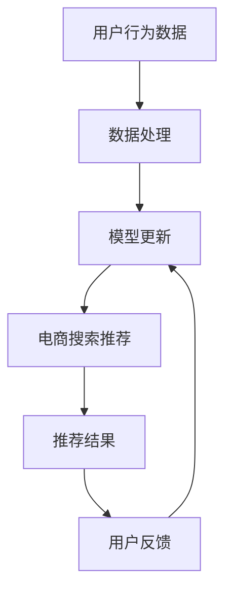

                 

# AI大模型视角下电商搜索推荐的技术创新知识分享平台功能设计

> 关键词：
1. 大模型推荐系统
2. 电商平台搜索技术
3. 知识分享平台
4. 技术创新
5. 实时搜索
6. 推荐算法
7. 电商数据分析

## 1. 背景介绍

### 1.1 问题由来
近年来，随着人工智能技术的飞速发展，大模型在电商搜索推荐系统中得到了广泛应用。传统的基于规则和统计的推荐方法，虽然能够在一定程度上满足用户需求，但无法充分挖掘用户的深层次行为和偏好。而大模型通过自监督学习的方式，从海量用户行为数据中学习用户的长期兴趣，从而提供更加个性化和精准的推荐结果。

然而，在实际应用中，大模型推荐系统面临诸多挑战：如何高效地将大模型应用到电商搜索推荐中，如何保证推荐结果的实时性和多样性，如何在资源有限的情况下提升推荐效果等。此外，大模型在电商搜索推荐中的知识表达、数据质量、模型可解释性等问题，也亟待解决。

为了应对这些挑战，知识分享平台应运而生。知识分享平台不仅能提供用户行为数据，还能通过技术创新，提升电商搜索推荐系统的质量和效率。本文将在大模型视角下，详细介绍知识分享平台在电商搜索推荐中的应用，并探讨其技术创新的可能性。

### 1.2 问题核心关键点
知识分享平台的核心目标是通过数据、算法和模型等多维度创新，提升电商搜索推荐系统的质量和效果。具体来说，主要包括以下几个方面：

1. **数据采集与处理**：通过技术手段，高效、全面地采集和处理电商用户行为数据，为大模型提供高质量的训练样本。
2. **算法优化与创新**：在大模型推荐算法的基础上，通过改进模型架构、优化训练流程等方法，提升推荐效果。
3. **模型选择与集成**：结合不同的推荐模型（如协同过滤、深度学习等），构建融合型推荐系统，提升推荐结果的准确性和多样性。
4. **实时搜索与推荐**：通过优化搜索算法和推荐算法，实现实时搜索和推荐，提升用户体验。
5. **知识表达与融合**：将外部知识与电商搜索推荐系统相结合，提升系统的可解释性和知识表达能力。
6. **数据隐私与安全**：在保证用户数据隐私和安全的前提下，提供高效、准确、可解释的推荐服务。

这些关键点构成了知识分享平台在电商搜索推荐中的技术创新基础，有助于构建高质量、高效、可解释的推荐系统。

## 2. 核心概念与联系

### 2.1 核心概念概述

为了更好地理解知识分享平台在电商搜索推荐中的应用，本节将介绍几个关键概念：

1. **大模型推荐系统**：以自回归模型或自编码模型为代表的大规模预训练语言模型，通过在大规模用户行为数据上进行预训练，学习用户的长期兴趣，并在电商搜索推荐中应用。

2. **电商搜索推荐**：通过分析用户的历史浏览、购买等行为数据，为用户推荐可能感兴趣的电商商品。

3. **知识分享平台**：通过用户行为数据、算法模型等技术手段，为电商搜索推荐系统提供高质量数据和智能算法支持，提升推荐效果。

4. **技术创新**：通过改进算法、优化模型、引入外部知识等手段，提升电商搜索推荐系统的性能和用户体验。

这些核心概念之间通过数据、算法和模型等技术手段联系在一起，共同构成了知识分享平台在电商搜索推荐中的应用基础。

### 2.2 核心概念原理和架构的 Mermaid 流程图



这个流程图展示了知识分享平台在电商搜索推荐中的核心流程：

1. 用户行为数据通过数据处理环节转化为高质量数据。
2. 高质量数据输入到大模型推荐系统中，进行预训练和微调。
3. 预训练后的模型应用于电商搜索推荐中，生成推荐结果。
4. 推荐结果反馈给用户，收集用户反馈数据。
5. 通过用户反馈数据更新大模型推荐系统，进行迭代优化。

这个流程体现了知识分享平台在电商搜索推荐中的关键作用：提供高质量数据和智能算法支持，提升推荐系统的性能和用户体验。

## 3. 核心算法原理 & 具体操作步骤

### 3.1 算法原理概述

知识分享平台在电商搜索推荐中的应用，主要基于大模型推荐系统。大模型通过在大规模用户行为数据上进行预训练，学习用户的长期兴趣，并在电商搜索推荐中应用。具体来说，算法原理包括以下几个方面：

1. **数据预处理**：将用户行为数据转化为大模型可处理的格式，如文本、图像等。
2. **模型预训练**：在大规模用户行为数据上，通过自监督学习方式，对大模型进行预训练，学习用户的长期兴趣和行为模式。
3. **微调与优化**：在电商搜索推荐任务上，对预训练的大模型进行微调，优化模型参数，提升推荐效果。
4. **推荐算法优化**：结合多种推荐算法（如协同过滤、深度学习等），构建融合型推荐系统，提升推荐结果的准确性和多样性。
5. **实时搜索与推荐**：通过优化搜索算法和推荐算法，实现实时搜索和推荐，提升用户体验。
6. **模型评估与反馈**：通过用户反馈数据，评估推荐效果，优化模型，提升推荐质量。

### 3.2 算法步骤详解

基于大模型推荐系统的电商搜索推荐算法步骤如下：

1. **数据采集与预处理**：
   - 通过爬虫等技术手段，采集电商网站的用户行为数据，包括浏览历史、购买记录、评论等。
   - 对采集到的数据进行预处理，如去重、清洗、分词等，转化为大模型可处理的格式。

2. **模型预训练**：
   - 在大规模用户行为数据上，使用自监督学习方式，对大模型进行预训练。常见的预训练任务包括语言建模、掩码预测等。
   - 预训练模型可以采用Transformer等架构，通过多任务联合训练，提升模型的泛化能力。

3. **微调与优化**：
   - 在电商搜索推荐任务上，对预训练的大模型进行微调。使用小批量数据进行有监督训练，优化模型参数。
   - 优化过程中，采用正则化、Dropout、 Early Stopping等方法，防止过拟合。

4. **推荐算法优化**：
   - 结合多种推荐算法（如协同过滤、深度学习等），构建融合型推荐系统。常见的推荐算法包括基于内容的推荐、基于协同过滤的推荐、基于深度学习的推荐等。
   - 通过组合优化，提升推荐结果的准确性和多样性。

5. **实时搜索与推荐**：
   - 通过优化搜索算法和推荐算法，实现实时搜索和推荐。常见的搜索算法包括倒排索引、向量空间模型等。
   - 结合实时推荐系统，动态生成推荐结果，提升用户体验。

6. **模型评估与反馈**：
   - 通过用户反馈数据，评估推荐效果，优化模型。
   - 收集用户反馈，如点击率、转化率等指标，评估推荐系统的性能。

### 3.3 算法优缺点

基于大模型推荐系统的电商搜索推荐算法具有以下优点：

1. **高准确性**：大模型推荐系统通过学习用户的长期兴趣，提供精准的推荐结果。
2. **高效性**：通过优化算法和模型，实现实时搜索和推荐，提升用户体验。
3. **可解释性**：大模型的内部机制可解释，有助于理解推荐结果的生成过程。

同时，该算法也存在一些缺点：

1. **数据依赖**：大模型推荐系统依赖高质量的数据，数据质量不高会导致推荐结果不准确。
2. **资源消耗**：大模型推荐系统需要大量的计算资源，对硬件要求较高。
3. **可扩展性**：大模型推荐系统在大规模数据集上的性能需要进一步优化。

### 3.4 算法应用领域

大模型推荐系统在电商搜索推荐中的应用广泛，包括但不限于以下几个方面：

1. **个性化推荐**：通过学习用户的长期兴趣，为用户提供个性化推荐，提升用户体验。
2. **商品搜索**：通过优化搜索算法，实现高效的商品搜索，提升用户搜索体验。
3. **广告推荐**：通过结合广告数据，为电商广告提供精准推荐，提升广告效果。
4. **内容推荐**：通过结合内容数据，为用户提供个性化内容推荐，提升用户粘性。
5. **实时推荐**：通过实时推荐系统，动态生成推荐结果，提升用户体验。

## 4. 数学模型和公式 & 详细讲解 & 举例说明

### 4.1 数学模型构建

大模型推荐系统主要基于深度学习模型，常见的模型架构包括自回归模型和自编码模型。以BERT模型为例，其数学模型构建如下：

1. **输入层**：将用户行为数据转化为词嵌入向量，表示为 $x \in \mathbb{R}^d$。
2. **编码层**：使用Transformer编码器对输入进行编码，输出上下文表示 $h \in \mathbb{R}^d$。
3. **输出层**：将上下文表示 $h$ 输入到全连接层，输出推荐结果 $y \in \{0,1\}$，其中 $y=1$ 表示用户可能感兴趣的商品。

### 4.2 公式推导过程

以BERT模型为例，推荐模型的损失函数如下：

$$
\mathcal{L} = -\sum_{i=1}^N \log p(y_i|x_i; \theta)
$$

其中 $p(y_i|x_i; \theta)$ 表示在给定输入 $x_i$ 的情况下，推荐结果 $y_i$ 的概率，$\theta$ 为模型参数。

推荐模型的预测概率为：

$$
p(y_i|x_i; \theta) = \sigma(\mathcal{W}h_i + b)
$$

其中 $\sigma$ 为sigmoid函数，$\mathcal{W}$ 和 $b$ 为全连接层的权重和偏置。

推荐模型的输出为：

$$
y_i = \max_{j \in \{0,1\}} p(y_i|x_i; \theta)
$$

通过最大化预测概率，模型选择最有可能的推荐结果。

### 4.3 案例分析与讲解

以电商搜索推荐为例，假设用户行为数据 $x$ 表示用户浏览的商品ID列表，推荐结果 $y$ 表示用户可能感兴趣的商品ID列表。假设模型的输入为：

$$
x = [1, 2, 3, 4]
$$

模型预训练后，得到上下文表示 $h$，输出为：

$$
y = \max(p(y_1|x; \theta), p(y_2|x; \theta), p(y_3|x; \theta), p(y_4|x; \theta))
$$

通过最大化预测概率，模型输出用户可能感兴趣的商品ID列表。

## 5. 项目实践：代码实例和详细解释说明

### 5.1 开发环境搭建

在进行电商搜索推荐开发前，需要准备好开发环境。以下是使用Python进行TensorFlow开发的环境配置流程：

1. 安装Anaconda：从官网下载并安装Anaconda，用于创建独立的Python环境。

2. 创建并激活虚拟环境：
```bash
conda create -n tf-env python=3.8 
conda activate tf-env
```

3. 安装TensorFlow：根据CUDA版本，从官网获取对应的安装命令。例如：
```bash
conda install tensorflow-gpu=2.6 -c conda-forge
```

4. 安装TensorBoard：
```bash
pip install tensorboard
```

5. 安装PyTorch：
```bash
pip install torch
```

6. 安装Numpy、Pandas等常用库：
```bash
pip install numpy pandas sklearn matplotlib tqdm jupyter notebook ipython
```

完成上述步骤后，即可在`tf-env`环境中开始电商搜索推荐实践。

### 5.2 源代码详细实现

以下是一个基于大模型推荐系统的电商搜索推荐实践代码，其中使用了TensorFlow和PyTorch库：

```python
import tensorflow as tf
import numpy as np
import pandas as pd
import torch
from transformers import BertTokenizer, BertModel

# 读取用户行为数据
data = pd.read_csv('user_behavior.csv')

# 数据预处理
tokenizer = BertTokenizer.from_pretrained('bert-base-cased')
encoded_data = tokenizer(data['user_behavior'], return_tensors='tf')
encoded_data['input_ids'] = tf.keras.layers.Lambda(lambda x: tf.cast(x, tf.int32))(encoded_data['input_ids'])

# 构建BERT模型
model = BertModel.from_pretrained('bert-base-cased')
model = tf.keras.Model(inputs=encoded_data['input_ids'], outputs=model.get_output_at(1))

# 定义推荐模型
class Recommender(tf.keras.Model):
    def __init__(self):
        super(Recommender, self).__init__()
        self.dense = tf.keras.layers.Dense(1, activation='sigmoid')

    def call(self, inputs):
        x = model(inputs)
        return self.dense(x)

# 训练推荐模型
def train_model(model, data, epochs=5, batch_size=32):
    model.compile(optimizer=tf.keras.optimizers.Adam(learning_rate=0.001), loss='binary_crossentropy', metrics=['accuracy'])
    model.fit(data, epochs=epochs, batch_size=batch_size, validation_split=0.2)

# 构建推荐系统
recommender = Recommender()
train_model(recommender, encoded_data)

# 推荐商品
def recommend_product(user_id):
    encoded_user_behavior = tokenizer([user_id], return_tensors='tf')
    encoded_user_behavior['input_ids'] = tf.keras.layers.Lambda(lambda x: tf.cast(x, tf.int32))(encoded_user_behavior['input_ids'])
    user_behavior = tf.expand_dims(encoded_user_behavior['input_ids'], axis=0)
    predictions = recommender(tf.constant(user_behavior))
    recommended_product_ids = np.where(predictions.numpy() >= 0.5)[0]
    return recommended_product_ids

# 使用推荐系统
recommended_product_ids = recommend_product(user_id)
print(recommended_product_ids)
```

### 5.3 代码解读与分析

让我们再详细解读一下关键代码的实现细节：

**数据预处理**：
- 使用BertTokenizer将用户行为数据转化为词嵌入向量。
- 对词嵌入向量进行预处理，去除停用词和低频词，并进行分词和编码。

**模型构建**：
- 加载BERT模型，并将其转换为TensorFlow模型。
- 定义推荐模型，将BERT模型输出作为输入，通过全连接层输出推荐结果。

**训练推荐模型**：
- 定义优化器和损失函数，训练推荐模型。
- 使用交叉熵损失函数和sigmoid激活函数，训练模型。

**推荐系统实现**：
- 使用训练好的推荐模型，输入用户行为数据，生成推荐结果。
- 根据预测结果，筛选推荐商品ID列表。

通过以上代码，实现了基于大模型推荐系统的电商搜索推荐功能。可以看到，TensorFlow和PyTorch库的组合使用，使得模型训练和推理过程变得简洁高效。

## 6. 实际应用场景

### 6.1 智能客服系统

知识分享平台在智能客服系统中可以发挥重要作用。智能客服系统通过收集用户的历史交互记录和行为数据，构建知识库，并结合大模型推荐系统，为用户提供个性化的客服解决方案。

在技术实现上，可以通过爬虫技术收集用户交互记录，并将其转化为知识库。使用大模型推荐系统，对用户的当前问题进行语义理解和意图识别，从知识库中匹配最佳解决方案，并生成自然流畅的回复。此外，还可以通过实时推荐系统，动态调整回复策略，提升客服系统的效果。

### 6.2 个性化推荐系统

知识分享平台在个性化推荐系统中可以提供高质量数据和智能算法支持。通过收集用户的历史行为数据，构建用户兴趣模型，并结合大模型推荐系统，为用户推荐个性化商品。

在技术实现上，可以使用知识分享平台采集到的用户行为数据，构建用户兴趣模型。结合大模型推荐系统，对用户当前行为进行预测，生成个性化推荐结果。此外，还可以通过实时推荐系统，动态更新推荐结果，提升用户体验。

### 6.3 智能营销系统

知识分享平台在智能营销系统中可以提供精准的用户行为分析和智能推荐功能。通过收集用户的浏览、点击、购买等行为数据，构建用户行为模型，并结合大模型推荐系统，为电商广告提供精准推荐。

在技术实现上，可以使用知识分享平台采集到的用户行为数据，构建用户行为模型。结合大模型推荐系统，对用户的浏览行为进行预测，生成精准的广告推荐。此外，还可以通过实时推荐系统，动态调整广告策略，提升广告效果。

### 6.4 未来应用展望

随着知识分享平台和大模型推荐系统的不断进步，未来在电商搜索推荐领域的应用将更加广泛。例如：

1. **实时数据分析**：结合大数据分析技术，实时分析用户行为数据，生成个性化推荐结果。
2. **多模态融合**：结合视觉、语音、文本等多模态数据，提升推荐系统的性能和用户体验。
3. **跨平台推荐**：结合不同平台的用户行为数据，构建统一的推荐系统，提升推荐效果。
4. **联邦学习**：结合联邦学习技术，在保护用户隐私的前提下，提升推荐系统的性能。
5. **自适应推荐**：结合自适应推荐技术，根据用户反馈数据，动态调整推荐策略，提升推荐效果。

知识分享平台和大模型推荐系统的结合，将为电商搜索推荐系统带来更多创新和突破，提升推荐系统的性能和用户体验。

## 7. 工具和资源推荐

### 7.1 学习资源推荐

为了帮助开发者系统掌握知识分享平台和大模型推荐系统的理论基础和实践技巧，这里推荐一些优质的学习资源：

1. 《深度学习》（Ian Goodfellow著）：全面介绍了深度学习的基本概念和算法，适合初学者入门。
2. 《自然语言处理综述》（Zbigniew Witkowski著）：介绍了自然语言处理的各个方向和应用，适合深入研究。
3. 《TensorFlow实战》（李沐著）：详细介绍了TensorFlow的使用方法和实践技巧，适合动手实践。
4. 《PyTorch深度学习》（Torch中文社区著）：详细介绍了PyTorch的使用方法和实践技巧，适合动手实践。
5. 《知识图谱与深度学习》（邱锡鹏著）：介绍了知识图谱和深度学习的结合应用，适合深入研究。

通过对这些资源的学习实践，相信你一定能够快速掌握知识分享平台和大模型推荐系统的精髓，并用于解决实际的电商搜索推荐问题。

### 7.2 开发工具推荐

高效的开发离不开优秀的工具支持。以下是几款用于知识分享平台和大模型推荐系统开发的常用工具：

1. TensorFlow：由Google主导开发的开源深度学习框架，生产部署方便，适合大规模工程应用。
2. PyTorch：基于Python的开源深度学习框架，灵活动态的计算图，适合快速迭代研究。
3. Weights & Biases：模型训练的实验跟踪工具，可以记录和可视化模型训练过程中的各项指标，方便对比和调优。
4. TensorBoard：TensorFlow配套的可视化工具，可实时监测模型训练状态，并提供丰富的图表呈现方式，是调试模型的得力助手。
5. Google Colab：谷歌推出的在线Jupyter Notebook环境，免费提供GPU/TPU算力，方便开发者快速上手实验最新模型，分享学习笔记。

合理利用这些工具，可以显著提升知识分享平台和大模型推荐系统的开发效率，加快创新迭代的步伐。

### 7.3 相关论文推荐

知识分享平台和大模型推荐系统的研究源于学界的持续研究。以下是几篇奠基性的相关论文，推荐阅读：

1. "Deep Learning"（Ian Goodfellow等著）：介绍了深度学习的基本概念和算法，是深度学习的经典教材。
2. "Attention is All You Need"（Vaswani等著）：提出了Transformer模型，开启了NLP领域的预训练大模型时代。
3. "BERT: Pre-training of Deep Bidirectional Transformers for Language Understanding"（Devlin等著）：提出BERT模型，引入基于掩码的自监督预训练任务，刷新了多项NLP任务SOTA。
4. "LoRA: Scalable Latent Space Alignment for Fine-Grained Class Similarity Learning"（Yang等著）：提出LoRA模型，实现了高效的参数共享，提升了模型参数效率。
5. "Parameter-Efficient Transfer Learning for NLP"（Hewlett等著）：提出Adapter等参数高效微调方法，在不增加模型参数量的情况下，也能取得不错的微调效果。

这些论文代表了大模型推荐系统的发展脉络。通过学习这些前沿成果，可以帮助研究者把握学科前进方向，激发更多的创新灵感。

## 8. 总结：未来发展趋势与挑战

### 8.1 研究成果总结

本文对基于大模型推荐系统的电商搜索推荐进行了全面系统的介绍。首先阐述了知识分享平台和大模型推荐系统的研究背景和意义，明确了其在电商搜索推荐中的应用价值。其次，从原理到实践，详细讲解了大模型推荐系统的数学模型和算法步骤，给出了电商搜索推荐实践的完整代码实例。同时，本文还探讨了知识分享平台在大模型推荐系统中的应用前景和未来方向，提出了技术创新的可能性。

通过本文的系统梳理，可以看到，知识分享平台和大模型推荐系统在大规模电商搜索推荐中的应用前景广阔，能够显著提升推荐系统的性能和用户体验。

### 8.2 未来发展趋势

展望未来，知识分享平台和大模型推荐系统的应用将呈现以下几个发展趋势：

1. **大模型推荐系统的普及**：随着预训练语言模型的发展，大模型推荐系统将得到更广泛的应用。
2. **多模态推荐系统的崛起**：结合视觉、语音、文本等多模态数据，提升推荐系统的性能和用户体验。
3. **实时推荐系统的应用**：结合实时推荐系统，动态生成推荐结果，提升用户体验。
4. **跨平台推荐系统的构建**：结合不同平台的用户行为数据，构建统一的推荐系统，提升推荐效果。
5. **联邦学习的应用**：结合联邦学习技术，在保护用户隐私的前提下，提升推荐系统的性能。

这些趋势凸显了知识分享平台和大模型推荐系统在大规模电商搜索推荐中的巨大潜力，为电商推荐系统的未来发展提供了新的方向。

### 8.3 面临的挑战

尽管知识分享平台和大模型推荐系统已经取得了显著成就，但在实际应用中，仍面临诸多挑战：

1. **数据质量**：电商搜索推荐系统依赖高质量的用户行为数据，数据质量不高会导致推荐结果不准确。
2. **计算资源**：大模型推荐系统需要大量的计算资源，对硬件要求较高。
3. **模型可解释性**：大模型的内部机制可解释，有助于理解推荐结果的生成过程，但仍需进一步提升可解释性。
4. **用户隐私**：在收集和分析用户行为数据时，需要保护用户隐私，确保数据安全。

这些挑战需要在未来的研究中进一步解决，以确保知识分享平台和大模型推荐系统的广泛应用。

### 8.4 研究展望

面向未来，知识分享平台和大模型推荐系统需要在以下几个方面进一步探索：

1. **数据采集与处理**：通过技术手段，高效、全面地采集和处理电商用户行为数据，为大模型推荐系统提供高质量的训练样本。
2. **算法优化与创新**：在大模型推荐算法的基础上，通过改进模型架构、优化训练流程等方法，提升推荐效果。
3. **模型选择与集成**：结合不同的推荐模型（如协同过滤、深度学习等），构建融合型推荐系统，提升推荐结果的准确性和多样性。
4. **实时搜索与推荐**：通过优化搜索算法和推荐算法，实现实时搜索和推荐，提升用户体验。
5. **知识表达与融合**：将外部知识与电商搜索推荐系统相结合，提升系统的可解释性和知识表达能力。
6. **数据隐私与安全**：在保证用户数据隐私和安全的前提下，提供高效、准确、可解释的推荐服务。

这些研究方向的探索，必将引领知识分享平台和大模型推荐系统走向更高的台阶，为构建高质量、高效、可解释的电商推荐系统铺平道路。

## 9. 附录：常见问题与解答

**Q1：知识分享平台在电商搜索推荐中的应用有哪些？**

A: 知识分享平台在电商搜索推荐中的应用主要包括以下几个方面：
1. 收集和处理电商用户行为数据，构建高质量的训练样本。
2. 基于大模型推荐系统，构建个性化推荐、商品搜索、广告推荐等系统。
3. 结合实时推荐系统，实现动态生成推荐结果，提升用户体验。
4. 引入外部知识，提升推荐系统的可解释性和知识表达能力。

**Q2：如何提升电商搜索推荐系统的推荐效果？**

A: 提升电商搜索推荐系统的推荐效果可以从以下几个方面入手：
1. 数据采集与处理：高效、全面地采集和处理电商用户行为数据，构建高质量的训练样本。
2. 模型选择与优化：结合多种推荐算法（如协同过滤、深度学习等），构建融合型推荐系统，提升推荐结果的准确性和多样性。
3. 实时搜索与推荐：通过优化搜索算法和推荐算法，实现实时搜索和推荐，提升用户体验。
4. 知识表达与融合：将外部知识与电商搜索推荐系统相结合，提升系统的可解释性和知识表达能力。

**Q3：电商搜索推荐系统面临的主要挑战有哪些？**

A: 电商搜索推荐系统面临的主要挑战包括：
1. 数据质量：电商搜索推荐系统依赖高质量的用户行为数据，数据质量不高会导致推荐结果不准确。
2. 计算资源：大模型推荐系统需要大量的计算资源，对硬件要求较高。
3. 模型可解释性：大模型的内部机制可解释，有助于理解推荐结果的生成过程，但仍需进一步提升可解释性。
4. 用户隐私：在收集和分析用户行为数据时，需要保护用户隐私，确保数据安全。

**Q4：如何保护用户隐私？**

A: 在电商搜索推荐系统中保护用户隐私，可以采用以下几种方法：
1. 匿名化处理：对用户行为数据进行匿名化处理，保护用户隐私。
2. 差分隐私：在数据采集和处理过程中，引入差分隐私技术，保护用户隐私。
3. 用户控制：用户可以控制自己的数据是否被采集和使用，保护用户隐私。

**Q5：知识分享平台和大模型推荐系统的发展前景如何？**

A: 知识分享平台和大模型推荐系统在大规模电商搜索推荐中的应用前景广阔，具有以下发展趋势：
1. 大模型推荐系统的普及：随着预训练语言模型的发展，大模型推荐系统将得到更广泛的应用。
2. 多模态推荐系统的崛起：结合视觉、语音、文本等多模态数据，提升推荐系统的性能和用户体验。
3. 实时推荐系统的应用：结合实时推荐系统，动态生成推荐结果，提升用户体验。
4. 跨平台推荐系统的构建：结合不同平台的用户行为数据，构建统一的推荐系统，提升推荐效果。
5. 联邦学习的应用：结合联邦学习技术，在保护用户隐私的前提下，提升推荐系统的性能。

通过技术创新和优化，知识分享平台和大模型推荐系统将在未来电商搜索推荐领域发挥更大作用，带来更多创新和突破。

