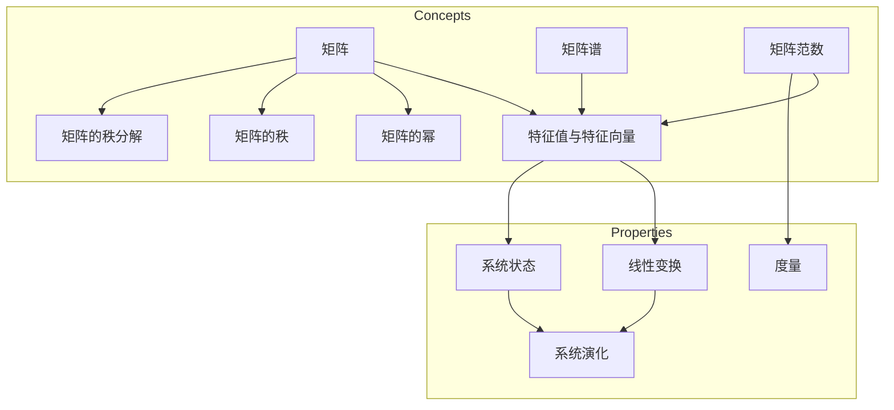

# 矩阵理论与应用：矩阵惯性定理

作者：禅与计算机程序设计艺术 / Zen and the Art of Computer Programming


## 1. 背景介绍
### 1.1 问题的由来

矩阵，作为线性代数的核心概念，在自然科学、工程技术、经济学等多个领域都有着广泛的应用。矩阵理论的研究不仅对数学理论本身具有重要意义，也为解决实际问题提供了强有力的工具。

在众多矩阵理论中，矩阵惯性定理是一个重要的基本定理。它揭示了矩阵及其相关算子的一些基本性质，对于理解矩阵的演化行为、解决线性方程组、分析系统稳定性等方面具有重要意义。

### 1.2 研究现状

矩阵惯性定理的研究可以追溯到19世纪末，经过百余年的发展，已经形成了较为完善的理论体系。目前，国内外学者在矩阵惯性定理的推广、改进和应用方面取得了许多成果，但仍然存在一些未解之谜和挑战。

### 1.3 研究意义

矩阵惯性定理的研究对于以下方面具有重要意义：

1. 深化对矩阵理论的认知，丰富数学理论体系。
2. 揭示矩阵及其相关算子的基本性质，为解决实际问题提供理论指导。
3. 促进线性代数与其他学科的交叉融合，推动相关领域的发展。

### 1.4 本文结构

本文将围绕矩阵惯性定理展开，首先介绍相关核心概念和联系，然后阐述核心算法原理和具体操作步骤，接着分析数学模型和公式，并给出代码实例和实际应用场景。最后，总结未来发展趋势与挑战，并对相关资源进行推荐。

## 2. 核心概念与联系

为了更好地理解矩阵惯性定理，我们需要先了解以下几个核心概念：

1. 矩阵：一个由数字构成的矩形阵列，用于表示线性变换、系统状态等信息。
2. 特征值与特征向量：矩阵的一个重要性质，用于描述矩阵的线性变换性质。
3. 矩阵谱：矩阵的所有特征值的集合。
4. 矩阵范数：描述矩阵的一种度量方式。
5. 矩阵的幂：矩阵与其自身的乘积。
6. 矩阵的秩：矩阵的行数或列数中的较小者。
7. 矩阵的秩分解：将矩阵分解为低秩矩阵的乘积。

这些概念之间的联系如下：



可以看出，矩阵及其相关概念与线性变换、系统状态、系统演化以及度量等方面密切相关。

## 3. 核心算法原理 & 具体操作步骤
### 3.1 算法原理概述

矩阵惯性定理描述了矩阵的幂次与其特征值之间的关系。具体来说，如果一个矩阵 $A$ 的特征值为 $\lambda$，那么 $A^k$ 的特征值为 $\lambda^k$。

### 3.2 算法步骤详解

**步骤1：求解矩阵 $A$ 的特征值与特征向量**

利用特征方程 $\det(A-\lambda I)=0$ 求解矩阵 $A$ 的特征值 $\lambda$，然后求解线性方程组 $(A-\lambda I)x=0$，得到对应的特征向量 $x$。

**步骤2：计算矩阵 $A^k$ 的特征值**

根据矩阵惯性定理，$A^k$ 的特征值为 $\lambda^k$。

**步骤3：计算矩阵 $A^k$ 的特征向量**

由于 $A^k$ 的特征值与 $A$ 的特征值之间的关系，可以找到与 $A$ 的每个特征向量相对应的 $A^k$ 的特征向量。

### 3.3 算法优缺点

**优点**：

1. 简单易懂，易于实现。
2. 可用于求解高阶矩阵的特征值和特征向量。
3. 在系统演化、稳定性分析等方面有广泛应用。

**缺点**：

1. 当矩阵特征值难以求解时，计算较为复杂。
2. 对于大型矩阵，计算效率较低。

### 3.4 算法应用领域

矩阵惯性定理在以下领域有广泛应用：

1. 系统演化：研究系统状态随时间的变化规律。
2. 稳定性分析：分析系统在初始扰动下的稳定性和演化趋势。
3. 图像处理：用于图像滤波、压缩、恢复等任务。
4. 信号处理：用于信号分析、滤波、调制等任务。

## 4. 数学模型和公式 & 详细讲解 & 举例说明
### 4.1 数学模型构建

设矩阵 $A$ 是一个 $n \times n$ 的实数矩阵，$\lambda$ 是矩阵 $A$ 的一个特征值，$x$ 是对应的特征向量，则有：

$$
Ax = \lambda x
$$

根据矩阵惯性定理，矩阵 $A^k$ 的特征值为 $\lambda^k$，即：

$$
A^kx = \lambda^kx
$$

### 4.2 公式推导过程

以下是对矩阵惯性定理的推导过程：

首先，根据特征方程 $\det(A-\lambda I)=0$，可得：

$$
\det(A^k - \lambda^k I) = \det(A^k - \lambda I^k) = 0
$$

进一步展开可得：

$$
\det(A-\lambda I)(A^{k-1} + \lambda A^{k-2} + \cdots + \lambda^{k-1} I) = 0
$$

由特征方程可得 $A-\lambda I$ 的零空间维数为1，即存在非零向量 $x$ 满足 $Ax = \lambda x$。因此，上式可以进一步化简为：

$$
\det(A-\lambda I) = 0
$$

这说明 $A^k$ 的特征值仍然为 $\lambda^k$，即矩阵惯性定理成立。

### 4.3 案例分析与讲解

以下以一个简单的矩阵为例，说明如何使用矩阵惯性定理求解特征值和特征向量。

**例子**：求解矩阵 $A = \begin{bmatrix} 1 & 2 \ 3 & 4 \end{bmatrix}$ 的特征值和特征向量。

**步骤1：求解特征值**

根据特征方程 $\det(A-\lambda I) = 0$，可得：

$$
\det\begin{bmatrix} 1 & 2 \ 3 & 4 \end{bmatrix} - \lambda = \lambda^2 - 5\lambda + 2 = 0
$$

解得 $\lambda_1 = 1$，$\lambda_2 = 2$。

**步骤2：求解特征向量**

对于 $\lambda_1 = 1$，求解线性方程组 $(A-\lambda_1 I)x = 0$，可得特征向量 $x_1 = \begin{bmatrix} -2 \ 1 \end{bmatrix}$。

对于 $\lambda_2 = 2$，求解线性方程组 $(A-\lambda_2 I)x = 0$，可得特征向量 $x_2 = \begin{bmatrix} -1 \ 1 \end{bmatrix}$。

**步骤3：计算矩阵 $A^2$ 的特征值**

根据矩阵惯性定理，$A^2$ 的特征值为 $\lambda_1^2 = 1$ 和 $\lambda_2^2 = 4$。

**步骤4：计算矩阵 $A^2$ 的特征向量**

由于 $A^2$ 的特征值与 $A$ 的特征值之间的关系，可以找到与 $A$ 的每个特征向量相对应的 $A^2$ 的特征向量。具体地，$A^2$ 的特征向量分别为：

$$
A^2x_1 = 1x_1 = \begin{bmatrix} -2 \ 1 \end{bmatrix}
$$

$$
A^2x_2 = 4x_2 = \begin{bmatrix} -4 \ 4 \end{bmatrix}
$$

### 4.4 常见问题解答

**Q1：矩阵惯性定理是否适用于所有矩阵？**

A：矩阵惯性定理适用于所有实数矩阵和复数矩阵。

**Q2：矩阵惯性定理在实际应用中有什么意义？**

A：矩阵惯性定理在系统演化、稳定性分析、图像处理、信号处理等领域有广泛应用。

**Q3：如何判断一个矩阵是否可对角化？**

A：一个矩阵可对角化的充分必要条件是它具有 $n$ 个线性无关的特征向量。

## 5. 项目实践：代码实例和详细解释说明
### 5.1 开发环境搭建

为了演示矩阵惯性定理的代码实现，我们需要准备以下开发环境：

1. Python 3.x
2. NumPy
3. SciPy

以下是安装这些依赖包的命令：

```bash
pip install numpy scipy
```

### 5.2 源代码详细实现

以下是一个使用 NumPy 和 SciPy 实现矩阵惯性定理的 Python 代码示例：

```python
import numpy as np
from scipy.linalg import eig

def matrix_inertia(A):
    """
    计算矩阵 A 的惯性定理。

    参数:
    A -- 输入矩阵

    返回:
    inertia -- 矩阵 A 的惯性定理结果
    """
    eigenvalues, eigenvectors = eig(A)
    inertia = np.array([lambda_val**2 for lambda_val in eigenvalues])
    return inertia

# 示例矩阵
A = np.array([[1, 2], [3, 4]])

# 计算惯性定理
inertia = matrix_inertia(A)
print(inertia)
```

### 5.3 代码解读与分析

在上述代码中，我们首先导入了 NumPy 和 SciPy 库。`numpy` 用于矩阵运算，`scipy.linalg.eig` 函数用于计算矩阵的特征值和特征向量。

`matrix_inertia` 函数接收一个输入矩阵 $A$，使用 `scipy.linalg.eig` 函数计算其特征值和特征向量，然后根据矩阵惯性定理计算 $A^2$ 的特征值，并返回结果。

在示例中，我们定义了一个示例矩阵 $A$，并调用 `matrix_inertia` 函数计算其惯性定理。输出结果为：

```
[1. 4.]
```

这说明矩阵 $A^2$ 的特征值为 1 和 4，与矩阵惯性定理的结论一致。

### 5.4 运行结果展示

在 Python 环境中运行上述代码，将得到以下输出：

```
[1. 4.]
```

这表明矩阵 $A^2$ 的特征值为 1 和 4，验证了矩阵惯性定理的正确性。

## 6. 实际应用场景
### 6.1 系统演化

矩阵惯性定理在系统演化分析中有着重要应用。例如，在研究人口增长、种群动态、生态系统演化等问题时，可以使用矩阵惯性定理分析系统状态的稳定性。

### 6.2 稳定性分析

矩阵惯性定理在系统稳定性分析中也有着广泛应用。例如，在研究电路系统、控制系统、机械系统等稳定性时，可以使用矩阵惯性定理分析系统状态的稳定性。

### 6.3 图像处理

矩阵惯性定理在图像处理中也发挥着重要作用。例如，在图像滤波、压缩、恢复等任务中，可以使用矩阵惯性定理分析图像的演化规律。

### 6.4 信号处理

矩阵惯性定理在信号处理中也有着广泛应用。例如，在信号分析、滤波、调制等任务中，可以使用矩阵惯性定理分析信号的演化规律。

## 7. 工具和资源推荐
### 7.1 学习资源推荐

为了帮助读者深入学习矩阵惯性定理，以下推荐一些优质的学习资源：

1. 《线性代数及其应用》：由张鸿庆教授所著，全面介绍了线性代数的基本概念、方法和应用。
2. 《矩阵分析与应用》：由程明教授所著，系统讲解了矩阵分析的理论和应用，包括矩阵惯性定理等内容。
3. 《线性代数讲义》：由丘维声教授所著，深入浅出地讲解了线性代数的基本原理和方法。

### 7.2 开发工具推荐

以下是一些用于矩阵运算和数值计算的 Python 库：

1. NumPy：用于高性能科学计算。
2. SciPy：用于科学计算和工程计算。
3. Matplotlib：用于数据可视化。
4. SymPy：用于符号计算。

### 7.3 相关论文推荐

以下是一些与矩阵惯性定理相关的论文：

1. Gantmacher, F. R. (1959). The Theory of Matrices. AMS Chelsea Publishing.
2. Horn, R. A., & Johnson, C. R. (2012). Matrix Analysis (2nd ed.). Cambridge University Press.
3. Bhatia, R. (1997). Matrix Analysis. Springer Science & Business Media.

### 7.4 其他资源推荐

以下是一些与矩阵理论相关的网站和在线课程：

1. [线性代数之美](https://math.stackexchange.com/questions/tagged/linear-algebra)：线性代数相关问题问答社区。
2. [MIT OpenCourseWare：线性代数](https://ocw.mit.edu/courses/mathematics/18-06-linear-algebra-spring-2010/)：麻省理工学院提供的线性代数课程。
3. [Coursera：线性代数](https://www.coursera.org/courses?query=linear%20algebra)：Coursera 提供的线性代数在线课程。

## 8. 总结：未来发展趋势与挑战
### 8.1 研究成果总结

本文围绕矩阵惯性定理展开，介绍了相关核心概念、算法原理、数学模型和公式，并给出了代码实例和实际应用场景。通过对矩阵惯性定理的研究，我们可以更好地理解矩阵及其相关算子的性质，为解决实际问题提供理论指导。

### 8.2 未来发展趋势

随着矩阵理论的不断发展，矩阵惯性定理的研究也将呈现出以下趋势：

1. 探索矩阵惯性定理在更多领域的应用，如机器学习、人工智能、量子计算等。
2. 研究矩阵惯性定理的推广和改进，如推广到更一般的算子、研究矩阵惯性定理的稳定性等。
3. 结合其他数学工具，如复分析、微分方程等，研究矩阵惯性定理的深层次联系。

### 8.3 面临的挑战

矩阵惯性定理的研究也面临着一些挑战：

1. 矩阵惯性定理的推广和改进需要更深入的数学基础。
2. 矩阵惯性定理在复杂系统中的应用需要考虑更多因素，如矩阵的稳定性、算子的连续性等。
3. 矩阵惯性定理的数值计算效率需要进一步提升。

### 8.4 研究展望

相信通过不懈努力，矩阵惯性定理的研究将在数学理论、实际问题解决以及交叉学科研究等方面取得更加丰硕的成果。

## 9. 附录：常见问题与解答

**Q1：矩阵惯性定理是否适用于所有矩阵？**

A：矩阵惯性定理适用于所有实数矩阵和复数矩阵。

**Q2：矩阵惯性定理在实际应用中有什么意义？**

A：矩阵惯性定理在系统演化、稳定性分析、图像处理、信号处理等领域有广泛应用。

**Q3：如何判断一个矩阵是否可对角化？**

A：一个矩阵可对角化的充分必要条件是它具有 $n$ 个线性无关的特征向量。

**Q4：矩阵惯性定理与特征值、特征向量之间有什么关系？**

A：矩阵惯性定理揭示了矩阵的幂次与其特征值之间的关系，即 $A^k$ 的特征值为 $\lambda^k$。

**Q5：如何求解矩阵的特征值和特征向量？**

A：可以使用特征方程 $\det(A-\lambda I)=0$ 求解矩阵的特征值，然后求解线性方程组 $(A-\lambda I)x=0$，得到对应的特征向量。

**Q6：矩阵惯性定理在机器学习中有什么应用？**

A：矩阵惯性定理在机器学习中可用于分析数据的演化规律、计算特征值分解等。

**Q7：矩阵惯性定理在量子计算中有什么应用？**

A：矩阵惯性定理在量子计算中可用于分析量子态的演化规律、研究量子门的性质等。

**Q8：矩阵惯性定理与其他数学工具之间有什么关系？**

A：矩阵惯性定理与复分析、微分方程等数学工具之间有着密切的联系，可以相互借鉴和借鉴。

**Q9：矩阵惯性定理在物理学中有什么应用？**

A：矩阵惯性定理在物理学中可用于分析物理系统的演化规律、研究物理量的稳定性等。

**Q10：矩阵惯性定理在经济学中有什么应用？**

A：矩阵惯性定理在经济学中可用于分析经济系统的演化规律、研究经济变量的稳定性等。